# Capítulo 1

# Introducción a la Inteligencia Artificial Generativa Local y al Proyecto Integrador

---

## Contenidos del capítulo

1. Introducción
2. Objetivos de aprendizaje
3. Conceptos fundamentales
4. Desarrollo conceptual
5. Ejemplos de aplicación
6. Demostración conceptual
7. Buenas prácticas
8. Errores comunes
9. Relación con el Proyecto Integrador
10. Síntesis del capítulo
11. Preguntas para la reflexión
12. Bibliografía y recursos recomendados

---

## 1. Introducción

### Un nuevo escenario para el trabajo profesional

Imagine por un momento a una investigadora que debe analizar más de quinientos artículos científicos para identificar las principales tendencias de investigación de los últimos cinco años. La tarea requiere leer cada resumen, clasificar los trabajos según su temática, identificar metodologías utilizadas y elaborar un informe comparativo para apoyar la toma de decisiones de un comité académico.

Tradicionalmente, esta labor demandaría varias jornadas de trabajo, un importante esfuerzo de lectura y una alta probabilidad de inconsistencias derivadas del cansancio o de la interpretación subjetiva de la información. En los últimos años, muchas personas han comenzado a utilizar herramientas de inteligencia artificial generativa para acelerar este tipo de procesos. Basta con copiar el texto de un artículo en un asistente conversacional y solicitar un resumen, una clasificación temática o la extracción de ideas principales.

Sin embargo, rápidamente surgen nuevas preguntas. ¿Qué ocurre si los documentos contienen información confidencial? ¿Cómo asegurar que todas las respuestas mantengan exactamente los mismos criterios de análisis? ¿Qué sucede si el asistente modifica su comportamiento entre una consulta y otra? ¿Es posible adaptar ese asistente para que responda siempre desde una perspectiva disciplinar específica? ¿Y sería posible hacerlo sin depender permanentemente de un servicio externo en la nube?

Estas preguntas representan algunos de los desafíos que actualmente enfrentan organizaciones, instituciones educativas, empresas y profesionales de prácticamente todas las áreas del conocimiento. La inteligencia artificial ya no constituye una tecnología reservada exclusivamente para especialistas en informática; se ha transformado en una herramienta transversal capaz de apoyar procesos de análisis, generación de conocimiento, automatización y toma de decisiones.

No obstante, el verdadero valor de la inteligencia artificial no radica únicamente en la posibilidad de obtener respuestas rápidas, sino en la capacidad de construir soluciones adaptadas a necesidades concretas. En este contexto emerge un nuevo paradigma: el diseño de asistentes inteligentes especializados, capaces de comprender un dominio específico, seguir criterios previamente definidos y apoyar de manera consistente el trabajo profesional.

Este taller se sitúa precisamente en ese escenario. Su propósito no es enseñar el uso de una aplicación determinada ni formar expertos en programación de modelos de inteligencia artificial. El objetivo es desarrollar las competencias necesarias para comprender el funcionamiento de la inteligencia artificial generativa, diseñar asistentes inteligentes especializados, configurarlos adecuadamente, integrarlos en flujos de trabajo y utilizarlos como apoyo al análisis y la toma de decisiones dentro de distintos contextos disciplinares.

Una característica distintiva del taller es el énfasis en el uso de modelos de inteligencia artificial ejecutados localmente. A diferencia de los servicios disponibles exclusivamente a través de Internet, una solución local permite mantener un mayor control sobre los datos, reducir la dependencia de plataformas externas y adaptar el comportamiento del asistente según las necesidades particulares de cada usuario u organización. Esta aproximación favorece la autonomía tecnológica, facilita la experimentación y proporciona un entorno con mayor control sobre los datos para el desarrollo de aplicaciones basadas en inteligencia artificial.

Durante el taller, cada participante desarrollará un **Proyecto Integrador** consistente en el diseño, implementación y validación de un asistente inteligente especializado aplicado a su propio ámbito disciplinar. Este proyecto permitirá integrar progresivamente los conocimientos adquiridos durante el taller y constituirá la principal evidencia del aprendizaje alcanzado.

El recorrido que inicia este capítulo busca proporcionar los fundamentos conceptuales necesarios para comprender qué es la inteligencia artificial generativa, cómo ha evolucionado durante los últimos años, qué diferencias existen entre un modelo ejecutado en la nube y uno ejecutado localmente, y por qué los asistentes inteligentes especializados representan una oportunidad para transformar la manera en que analizamos información y apoyamos la toma de decisiones.

Más que aprender a utilizar una herramienta específica, el propósito es comprender una nueva forma de interactuar con el conocimiento. Las plataformas, los modelos y las aplicaciones continuarán evolucionando con rapidez; sin embargo, los principios que sustentan el diseño de asistentes inteligentes permanecerán como la base para desarrollar soluciones cada vez más pertinentes, confiables y alineadas con las necesidades de cada disciplina.

---

<p align="center">
  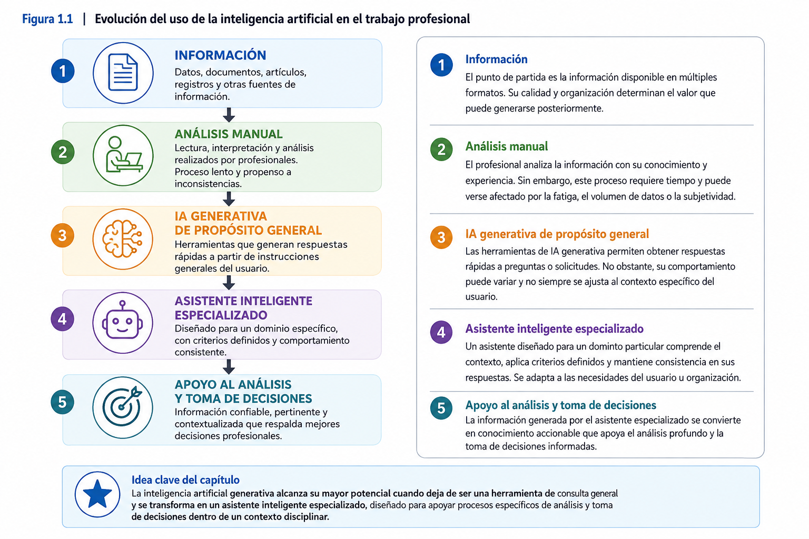
</p>

---

### Idea clave del capítulo

> **La inteligencia artificial generativa alcanza su mayor potencial cuando deja de ser una herramienta de consulta general y se transforma en un asistente inteligente especializado, diseñado para apoyar procesos específicos de análisis y toma de decisiones dentro de un contexto disciplinar.**

---

# 2. Objetivos de aprendizaje

Al finalizar este capítulo, el participante será capaz de comprender los fundamentos que sustentan la Inteligencia Artificial Generativa y reconocer su potencial para apoyar procesos de análisis y toma de decisiones en distintos contextos disciplinares. Asimismo, distinguirá las principales diferencias entre los servicios de inteligencia artificial disponibles en la nube y los modelos ejecutados localmente, identificando las ventajas que estos últimos ofrecen en términos de autonomía tecnológica, privacidad de la información y personalización.

Desde una perspectiva práctica, el participante comprenderá la arquitectura básica de un entorno de inteligencia artificial local y reconocerá el papel que desempeñan sus principales componentes, estableciendo las bases necesarias para el diseño y configuración de asistentes inteligentes especializados durante las siguientes capitulos.

Finalmente, este capítulo permitirá definir el problema disciplinar que orientará el Proyecto Integrador, identificando una necesidad concreta susceptible de ser apoyada mediante un asistente inteligente local.

En términos específicos, al finalizar el capítulo el participante será capaz de:

* Explicar los conceptos fundamentales asociados a la Inteligencia Artificial Generativa y a los Modelos de Lenguaje de Gran Escala (LLM).
* Diferenciar las características, ventajas y limitaciones de los servicios de inteligencia artificial basados en la nube respecto de las soluciones ejecutadas localmente.
* Comprender el concepto de autonomía tecnológica y su importancia en contextos académicos, profesionales y organizacionales.
* Identificar los principales componentes que conforman un entorno local para la ejecución de modelos de inteligencia artificial generativa.
* Reconocer las diferencias entre un asistente de propósito general y un asistente inteligente especializado.
* Identificar oportunidades de aplicación de asistentes inteligentes en su propio ámbito disciplinar.
* Definir el problema, necesidad u oportunidad que será abordado mediante el Proyecto Integrador del taller.

---

## Relación con el Proyecto Integrador

Los aprendizajes desarrollados durante este capítulo permitirán establecer las bases conceptuales del Proyecto Integrador. Como resultado del trabajo realizado, cada participante finalizará el capítulo con una definición clara del problema disciplinar que desea abordar y con una comprensión suficiente del entorno tecnológico que utilizará para construir su asistente inteligente durante el resto del taller.

Este primer avance constituye el punto de partida para las siguientes etapas del proyecto, en las cuales el participante diseñará, configurará, validará e integrará progresivamente su asistente inteligente hasta obtener una solución funcional orientada al análisis y la toma de decisiones.

---

### Idea clave del capítulo

> **Antes de construir un asistente inteligente es necesario comprender qué problema resolverá, por qué la inteligencia artificial puede aportar valor en ese contexto y cuáles son las ventajas de desarrollar la solución en un entorno local.**

---

# 3. Conceptos fundamentales

Antes de profundizar en el funcionamiento de la Inteligencia Artificial Generativa, es importante familiarizarse con algunos conceptos que serán utilizados de manera recurrente durante el taller. Estos términos constituyen el lenguaje común que permitirá comprender el funcionamiento de los modelos de inteligencia artificial, el diseño de asistentes inteligentes y su posterior integración en soluciones aplicadas.

Los conceptos presentados a continuación no buscan ofrecer definiciones exhaustivas, sino proporcionar una primera aproximación que facilite la comprensión de los contenidos desarrollados en este capítulo. Cada uno de ellos será ampliado progresivamente a medida que avance el taller.

---

## Inteligencia Artificial (IA)

La Inteligencia Artificial corresponde al conjunto de disciplinas, técnicas y tecnologías orientadas al desarrollo de sistemas capaces de realizar tareas que tradicionalmente requieren inteligencia humana, tales como reconocer patrones, interpretar información, aprender a partir de datos, resolver problemas, tomar decisiones o generar contenido.

En la actualidad, la inteligencia artificial se encuentra presente en múltiples aplicaciones cotidianas, desde sistemas de recomendación en plataformas de entretenimiento hasta asistentes virtuales, motores de búsqueda, sistemas de diagnóstico médico y herramientas de apoyo a la investigación científica.

---

## Inteligencia Artificial Generativa (IAG)

La Inteligencia Artificial Generativa es una rama de la inteligencia artificial especializada en la creación de contenido nuevo a partir de los patrones aprendidos durante su entrenamiento.

Dependiendo del modelo utilizado, la IAG puede generar:

- texto;
- imágenes;
- audio;
- video;
- código fuente;
- documentos;
- resúmenes;
- análisis.

A diferencia de otros sistemas de inteligencia artificial orientados principalmente a clasificar o predecir información, la IA Generativa tiene la capacidad de producir respuestas originales a partir de las instrucciones proporcionadas por el usuario.

---

## Modelo de Lenguaje de Gran Escala (Large Language Model - LLM)

Un Modelo de Lenguaje de Gran Escala (LLM) es un sistema de inteligencia artificial entrenado sobre enormes volúmenes de información textual con el propósito de comprender y generar lenguaje natural.

Los LLM constituyen el núcleo tecnológico de la mayoría de los asistentes inteligentes actuales.

Entre sus capacidades destacan:

- responder preguntas;
- resumir documentos;
- traducir textos;
- redactar informes;
- generar código;
- analizar información;
- asistir procesos de toma de decisiones.

Durante este taller, los participantes trabajarán con modelos de este tipo ejecutándose en un entorno local.

---

## IA en la nube

Corresponde a servicios de inteligencia artificial cuya ejecución se realiza en servidores remotos accesibles a través de Internet.

En este modelo:

- el procesamiento ocurre fuera del computador del usuario;
- el proveedor administra la infraestructura tecnológica;
- normalmente se requiere conexión permanente a Internet;
- los datos enviados son procesados por servicios externos.

Este enfoque ofrece facilidad de uso y acceso inmediato a modelos de gran capacidad, aunque también plantea desafíos relacionados con la privacidad, la dependencia tecnológica y el control sobre la información.

---

## IA local

La IA local corresponde a la ejecución de modelos de inteligencia artificial directamente en el computador o servidor del usuario, sin depender permanentemente de servicios externos para realizar la inferencia.

En este enfoque:

- el modelo se ejecuta en infraestructura propia;
- la información procesada directamente por el modelo puede mantenerse bajo control del usuario;
- es posible interactuar con el modelo sin conexión a Internet una vez instalado y configurado el entorno local;
- existe mayor flexibilidad para personalizar el comportamiento del asistente.

La ejecución local del modelo constituye el eje tecnológico del presente taller. En etapas posteriores, este entorno será integrado con servicios externos para construir flujos automatizados.

---

## Autonomía tecnológica

La autonomía tecnológica hace referencia a la capacidad de una organización o de un profesional para implementar y utilizar soluciones tecnológicas reduciendo su dependencia de proveedores externos.

En el contexto de la inteligencia artificial, esta autonomía implica aspectos como:

- control sobre los modelos utilizados;
- control sobre los datos procesados;
- independencia respecto a plataformas comerciales;
- posibilidad de personalizar la solución según necesidades específicas;
- continuidad operativa incluso ante cambios en servicios externos.

La autonomía tecnológica no significa prescindir completamente de servicios en la nube, sino disponer de alternativas que permitan decidir cuándo, cómo y para qué utilizar cada tipo de solución.

---

## Asistente inteligente

Un asistente inteligente es una aplicación basada en inteligencia artificial diseñada para interactuar con las personas mediante lenguaje natural, proporcionando apoyo en tareas específicas como responder consultas, analizar información, generar contenido o asistir procesos de decisión.

Su comportamiento depende de:

- el modelo de inteligencia artificial utilizado;
- las instrucciones que recibe;
- el contexto definido por el diseñador;
- las restricciones establecidas para su funcionamiento.

---

## Asistente inteligente especializado

A diferencia de un asistente de propósito general, un asistente inteligente especializado se encuentra diseñado para operar dentro de un dominio de conocimiento específico.

Por ejemplo:

- un asistente para análisis financiero;
- un asistente para investigación científica;
- un asistente para gestión académica;
- un asistente para análisis jurídico;
- un asistente para apoyo clínico.

Su principal fortaleza consiste en mantener criterios de respuesta consistentes y alineados con las necesidades particulares de una disciplina o proceso organizacional.

---

## Prompt

Un *prompt* corresponde a la instrucción o conjunto de instrucciones que un usuario proporciona a un modelo de inteligencia artificial para orientar la generación de una respuesta.

La calidad del resultado depende, en gran medida, de la claridad, precisión y contexto incluidos en el prompt.

Durante los siguientes capitulos se estudiarán técnicas para diseñar prompts que permitan construir asistentes inteligentes especializados.

---

## Flujo funcional

Un flujo funcional corresponde a la secuencia de procesos mediante la cual diferentes herramientas intercambian información para automatizar una tarea.

En el contexto del taller, un flujo funcional permitirá integrar:

- mecanismos de captura de información;
- asistentes inteligentes;
- herramientas de automatización;
- generación de respuestas;
- apoyo al análisis y la toma de decisiones.

Su desarrollo será abordado en las últimos capitulos.

---

## Proyecto Integrador

El Proyecto Integrador constituye el eje articulador del taller.

Cada participante diseñará, implementará y validará un asistente inteligente local aplicado a un problema propio de su disciplina.

Todas las actividades desarrolladas durante el curso contribuirán progresivamente a la construcción de este proyecto, el cual será presentado como evidencia final del aprendizaje alcanzado.

---

## Conceptos clave del capítulo

Al finalizar esta sección, el participante deberá familiarizarse con los siguientes conceptos:

- Inteligencia Artificial.
- Inteligencia Artificial Generativa.
- Modelo de Lenguaje de Gran Escala (LLM).
- IA en la nube.
- IA local.
- Autonomía tecnológica.
- Asistente inteligente.
- Asistente inteligente especializado.
- Prompt.
- Flujo funcional.
- Proyecto Integrador.

# 4. Desarrollo conceptual

## 4.1 ¿Qué entendemos por Inteligencia Artificial?

La expresión **Inteligencia Artificial (IA)** forma parte del lenguaje cotidiano. Es frecuente encontrarla en noticias, redes sociales, aplicaciones móviles e incluso en campañas publicitarias. Sin embargo, su uso masivo ha provocado que el término sea empleado para describir tecnologías muy distintas entre sí, generando cierta confusión acerca de su verdadero significado.

Desde una perspectiva general, la Inteligencia Artificial puede entenderse como una disciplina de las Ciencias de la Computación dedicada al desarrollo de sistemas capaces de ejecutar tareas que, hasta hace algunos años, se consideraban exclusivas de la inteligencia humana. Entre ellas se encuentran la capacidad de aprender a partir de la experiencia, reconocer patrones, comprender lenguaje natural, resolver problemas, formular recomendaciones o generar nuevo conocimiento a partir de la información disponible.

Es importante señalar que la Inteligencia Artificial no intenta reproducir el funcionamiento completo del cerebro humano. Su propósito consiste en desarrollar algoritmos capaces de resolver problemas específicos utilizando modelos matemáticos y computacionales que imitan ciertos procesos cognitivos humanos, como el aprendizaje, la clasificación, la predicción o el razonamiento.

En este sentido, cuando una aplicación recomienda una película en una plataforma de streaming, identifica el rostro de una persona en una fotografía o responde una consulta utilizando lenguaje natural, no "piensa" de la misma manera que un ser humano. Lo que realmente hace es aplicar modelos matemáticos entrenados previamente para reconocer patrones y generar una respuesta estadísticamente probable frente a una determinada situación.

---

### Inteligencia Artificial no es una única tecnología

Uno de los errores más frecuentes consiste en pensar que la Inteligencia Artificial corresponde a una única tecnología. En realidad, la IA constituye un campo de conocimiento que integra múltiples disciplinas y enfoques de trabajo.

Entre las principales áreas que forman parte de la Inteligencia Artificial se encuentran:

- Aprendizaje Automático (*Machine Learning*).
- Aprendizaje Profundo (*Deep Learning*).
- Procesamiento del Lenguaje Natural (*Natural Language Processing*).
- Visión por Computador (*Computer Vision*).
- Sistemas Expertos.
- Robótica Inteligente.
- Inteligencia Artificial Generativa.

Cada una de estas áreas aborda problemas diferentes y utiliza técnicas específicas para resolverlos.

Por ejemplo, un sistema que detecta correos electrónicos no deseados utiliza algoritmos distintos a los empleados por un vehículo autónomo o por un asistente inteligente capaz de mantener una conversación.

La Inteligencia Artificial Generativa, que constituye el foco principal de este taller, representa solamente una de las múltiples ramas que conforman este amplio campo disciplinar.

---

### De los sistemas programados a los sistemas que aprenden

Durante muchos años, el desarrollo de software se basó principalmente en la programación tradicional.

En este paradigma, el programador define explícitamente todas las reglas que el sistema debe seguir.

Por ejemplo, si se desea desarrollar una aplicación que determine si una persona es mayor de edad, bastaría con programar una condición sencilla:

```text
Si edad >= 18
    entonces "Mayor de edad"
Sino
    "Menor de edad"
```

Este tipo de soluciones funciona muy bien cuando el problema posee reglas claras y completamente definidas.

Sin embargo, existen numerosos problemas donde resulta prácticamente imposible escribir todas las reglas necesarias.

Por ejemplo:

- reconocer si una fotografía corresponde a un gato o a un perro;
- identificar una enfermedad a partir de una radiografía;
- traducir automáticamente un texto entre dos idiomas;
- resumir un artículo científico;
- responder preguntas utilizando lenguaje natural.

En estos casos, resulta mucho más eficiente permitir que el sistema aprenda a partir de grandes cantidades de ejemplos, en lugar de intentar programar manualmente cada posible situación.

Este cambio de paradigma dio origen al desarrollo del Aprendizaje Automático (*Machine Learning*), disciplina que permitió que los computadores comenzaran a construir modelos capaces de identificar patrones presentes en los datos.

Posteriormente, gracias al incremento de la capacidad de procesamiento y a la disponibilidad de enormes volúmenes de información, surgieron modelos mucho más complejos basados en redes neuronales profundas (*Deep Learning*), capaces de resolver tareas anteriormente consideradas inalcanzables.

La Inteligencia Artificial Generativa representa una evolución natural de este proceso, permitiendo que los sistemas no sólo analicen información, sino que también sean capaces de producir contenido completamente nuevo.

---

### La Inteligencia Artificial como herramienta de apoyo

A pesar de los importantes avances alcanzados durante los últimos años, resulta fundamental comprender que la Inteligencia Artificial no reemplaza el juicio profesional.

Los modelos actuales poseen una enorme capacidad para analizar información, identificar relaciones, resumir documentos o generar propuestas de solución. Sin embargo, continúan presentando limitaciones relacionadas con el contexto, la interpretación, la veracidad de la información y la comprensión profunda de situaciones complejas.

Por esta razón, en ámbitos como la medicina, el derecho, la ingeniería, la investigación científica o la educación, la Inteligencia Artificial debe entenderse como una herramienta de apoyo a la toma de decisiones y no como un sustituto del conocimiento experto.

Uno de los principios que guiará todo este taller será precisamente éste:

> **La responsabilidad final sobre las decisiones siempre corresponde a las personas, no a la Inteligencia Artificial.**

Este principio será retomado en diversas oportunidades durante el curso, especialmente al analizar aspectos relacionados con la privacidad, los sesgos, la transparencia y el uso responsable de la IA Generativa.

---

### Ejemplo aplicado

Imagine un analista financiero que debe revisar cientos de informes trimestrales antes de elaborar un diagnóstico para una empresa.

Un asistente inteligente puede:

- resumir los documentos;
- identificar indicadores relevantes;
- comparar resultados históricos;
- detectar patrones de comportamiento.

Sin embargo, la decisión de recomendar o no una determinada inversión continúa dependiendo del criterio profesional del analista, quien debe considerar factores estratégicos, regulatorios y contextuales que muchas veces trascienden la información disponible para el modelo.

Este ejemplo ilustra una idea central del taller: la Inteligencia Artificial no reemplaza al especialista, sino que amplía su capacidad para analizar información y tomar decisiones fundamentadas.

---
<p align="center">
  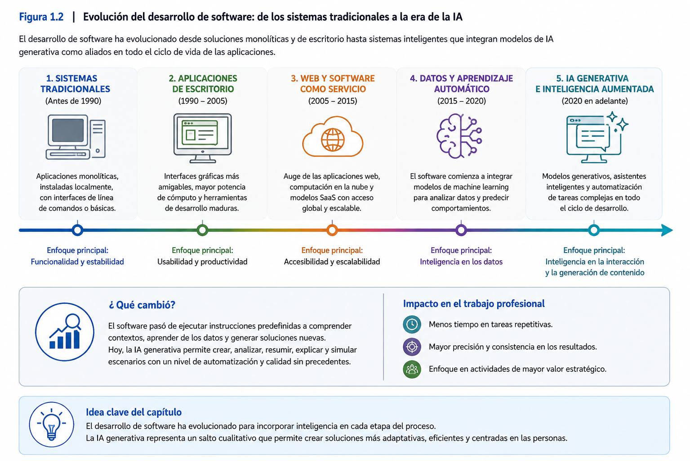
</p>

---

### Ideas clave

Al finalizar este apartado, el participante debería comprender que:

- La Inteligencia Artificial constituye un campo amplio que integra diversas disciplinas y tecnologías.
- La Inteligencia Artificial Generativa representa una de las ramas más recientes y de mayor crecimiento dentro de este campo.
- Los sistemas modernos aprenden patrones a partir de datos, en lugar de depender exclusivamente de reglas programadas manualmente.
- La IA debe entenderse como una herramienta de apoyo al análisis y la toma de decisiones, manteniendo siempre al ser humano como responsable último de las decisiones adoptadas.

## 4.2 Evolución hacia la Inteligencia Artificial Generativa

La Inteligencia Artificial Generativa constituye uno de los avances tecnológicos más relevantes de la última década. Sin embargo, para comprender su verdadero alcance es necesario entender que no surgió de manera repentina, sino como resultado de una evolución continua de la Inteligencia Artificial durante más de setenta años.

Cada etapa de esta evolución respondió a una necesidad distinta y fue posible gracias al desarrollo de nuevas metodologías, al aumento de la capacidad computacional y a la disponibilidad de mayores volúmenes de información.

Comprender esta evolución permite valorar por qué la Inteligencia Artificial Generativa representa un cambio de paradigma y no simplemente una mejora incremental respecto de las tecnologías anteriores.

---

### Primera etapa: Inteligencia Artificial basada en reglas

Los primeros desarrollos de Inteligencia Artificial, entre las décadas de 1950 y 1980, se sustentaban principalmente en sistemas basados en reglas.

En este enfoque, los expertos definían explícitamente el conocimiento que el sistema debía utilizar para resolver un problema.

Por ejemplo, un sistema de diagnóstico médico podía contener reglas como las siguientes:

- Si el paciente presenta fiebre y tos persistente, evaluar enfermedad respiratoria.
- Si además existe dificultad respiratoria, recomendar exámenes complementarios.

Este tipo de soluciones permitió desarrollar los denominados **Sistemas Expertos**, ampliamente utilizados durante los años ochenta en ámbitos como la medicina, la industria y la ingeniería.

Aunque estos sistemas demostraron ser útiles para problemas muy específicos, presentaban importantes limitaciones:

- dependían completamente del conocimiento previamente incorporado;
- resultaban difíciles de mantener cuando las reglas aumentaban;
- no podían aprender automáticamente nuevas situaciones.

En otras palabras, eran sistemas inteligentes únicamente dentro de los límites definidos por sus programadores.

---

### Segunda etapa: Aprendizaje Automático (Machine Learning)

A partir de la década de 1990 comenzó a consolidarse un nuevo enfoque conocido como **Machine Learning** o Aprendizaje Automático.

En lugar de programar todas las reglas manualmente, los investigadores comenzaron a desarrollar algoritmos capaces de aprender patrones directamente desde los datos.

En este paradigma, el proceso cambia completamente.

En vez de indicar al computador cómo resolver un problema, se le proporcionan numerosos ejemplos para que descubra por sí mismo las relaciones existentes entre ellos.

Por ejemplo, si se desea construir un modelo capaz de identificar correos electrónicos no deseados, ya no es necesario programar todas las posibles reglas.

Basta con disponer de miles de mensajes previamente clasificados como:

- correo legítimo;
- correo no deseado.

A partir de estos ejemplos, el algoritmo identifica patrones que posteriormente utilizará para clasificar nuevos mensajes.

Este cambio representó uno de los mayores avances en la historia de la Inteligencia Artificial.

---

### Tercera etapa: Aprendizaje Profundo (Deep Learning)

El crecimiento exponencial de la capacidad de procesamiento y la disponibilidad de grandes volúmenes de datos impulsaron el desarrollo del **Deep Learning** o Aprendizaje Profundo.

Este enfoque utiliza redes neuronales artificiales compuestas por múltiples capas capaces de aprender representaciones cada vez más complejas de la información.

Gracias al Deep Learning fue posible alcanzar avances significativos en áreas como:

- reconocimiento de imágenes;
- reconocimiento de voz;
- traducción automática;
- conducción autónoma;
- procesamiento del lenguaje natural.

Estos modelos comenzaron a superar el rendimiento humano en tareas muy específicas, siempre que dispusieran de suficientes datos para su entrenamiento.

---

### Cuarta etapa: Inteligencia Artificial Generativa

Hasta hace pocos años, la mayoría de los sistemas de Inteligencia Artificial estaban diseñados para responder preguntas como:

- ¿Qué objeto aparece en esta imagen?
- ¿Cuál será el precio de una acción mañana?
- ¿Este correo corresponde a spam?
- ¿Qué enfermedad presenta este paciente?

Es decir, eran sistemas orientados principalmente a clasificar, identificar o predecir información.

La Inteligencia Artificial Generativa introduce un cambio fundamental.

Ahora los modelos son capaces de responder preguntas completamente distintas.

Por ejemplo:

- ¿Puedes redactar un informe?
- ¿Puedes resumir este documento?
- ¿Puedes generar un programa en Python?
- ¿Puedes diseñar una propuesta de investigación?
- ¿Puedes explicar este concepto utilizando ejemplos?

En otras palabras, además de analizar información, los modelos pueden generar nuevo contenido utilizando lenguaje natural.

Este cambio amplía enormemente las posibilidades de aplicación de la Inteligencia Artificial en prácticamente todas las disciplinas.

---

### ¿Por qué la IA Generativa representa un cambio de paradigma?

La Inteligencia Artificial Generativa modifica profundamente la forma en que las personas interactúan con los computadores.

Tradicionalmente, los sistemas informáticos exigían que los usuarios aprendieran a utilizar comandos, interfaces o procedimientos específicos.

Hoy ocurre exactamente lo contrario.

Es el sistema quien aprende a comprender el lenguaje natural utilizado por las personas.

Esto permite que profesionales sin formación en programación puedan aprovechar modelos avanzados de inteligencia artificial simplemente describiendo el problema que desean resolver.

En consecuencia, la barrera de entrada disminuye considerablemente y la IA comienza a incorporarse en actividades cotidianas de análisis, investigación, educación, salud, ingeniería y gestión organizacional.

---

### Ejemplo aplicado

Considere una institución educativa que desea analizar cientos de encuestas respondidas por estudiantes.

Un sistema tradicional podría calcular promedios, porcentajes y frecuencias.

Un modelo de Inteligencia Artificial Generativa, en cambio, puede:

- identificar los principales temas mencionados por los estudiantes;
- resumir automáticamente comentarios abiertos;
- detectar patrones de satisfacción o insatisfacción;
- elaborar un informe ejecutivo;
- proponer líneas de mejora.

En este caso, la IA no sólo procesa información, sino que contribuye directamente a generar conocimiento útil para apoyar la toma de decisiones.

---

<p align="center">
  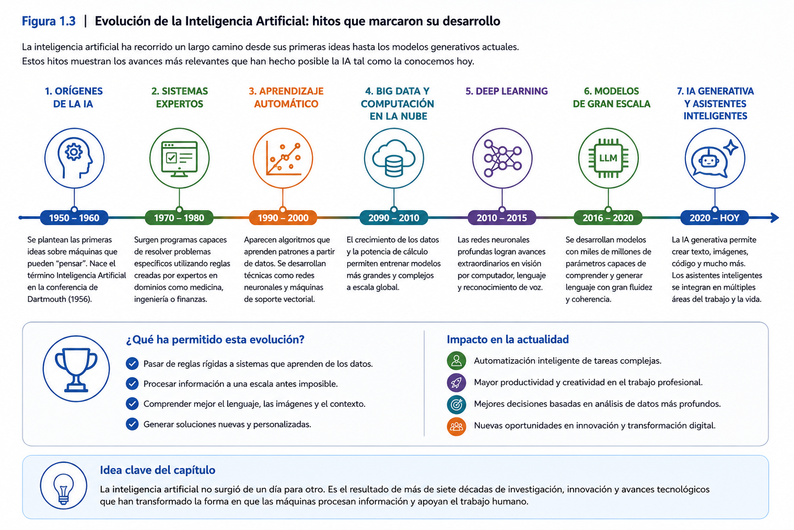
</p>

---

### Ideas clave

Al finalizar este apartado, el participante debería comprender que:

- La Inteligencia Artificial Generativa es el resultado de una evolución tecnológica de varias décadas.
- Cada etapa de esa evolución incorporó nuevas capacidades para resolver problemas cada vez más complejos.
- La principal diferencia entre la IA Generativa y los enfoques anteriores radica en su capacidad para producir contenido original utilizando lenguaje natural.
- La IA Generativa permite que profesionales de diversas disciplinas interactúen con modelos avanzados sin necesidad de conocimientos especializados en programación.
- Los asistentes inteligentes especializados representan una aplicación práctica de esta evolución tecnológica y constituyen el foco central del presente taller.

## 4.3 ¿Qué es un Modelo de Lenguaje de Gran Escala (LLM)?

Uno de los conceptos más importantes para comprender la Inteligencia Artificial Generativa es el de **Modelo de Lenguaje de Gran Escala**, conocido internacionalmente como **Large Language Model (LLM)**.

Aunque muchas personas interactúan diariamente con asistentes inteligentes como ChatGPT, Claude, Gemini o Copilot, pocas conocen qué tecnología permite que estos sistemas comprendan preguntas, mantengan conversaciones, redacten documentos o generen código de programación.

La respuesta se encuentra precisamente en los Modelos de Lenguaje de Gran Escala.

Un LLM es un modelo de inteligencia artificial entrenado para comprender, interpretar y generar lenguaje natural. Su principal objetivo consiste en predecir cuál es la secuencia de palabras más probable que debe aparecer a continuación dentro de un determinado contexto.

A primera vista, esta definición puede parecer sorprendentemente simple. Sin embargo, detrás de esta capacidad existe un proceso de entrenamiento extremadamente complejo que involucra enormes volúmenes de información y una gran capacidad de procesamiento computacional.

---

### Aprender observando grandes cantidades de texto

Cuando una persona aprende un nuevo idioma, lo hace escuchando conversaciones, leyendo libros, escribiendo textos y corrigiendo errores. Con el tiempo comienza a identificar patrones lingüísticos, reglas gramaticales, expresiones habituales y relaciones entre conceptos.

Los Modelos de Lenguaje siguen una lógica similar.

Durante su entrenamiento procesan enormes colecciones de documentos provenientes de distintas fuentes, tales como:

- libros;
- artículos científicos;
- páginas web;
- documentación técnica;
- manuales;
- repositorios de código;
- textos públicos disponibles para entrenamiento.

A partir de esta información, el modelo identifica relaciones estadísticas entre palabras, frases y conceptos.

Es importante comprender que el modelo no memoriza cada documento de manera literal. Lo que aprende son patrones de uso del lenguaje que posteriormente utilizará para generar nuevas respuestas.

Por esta razón, un LLM puede responder preguntas que nunca ha visto exactamente formuladas durante su entrenamiento.

---

### ¿Cómo genera una respuesta?

Cuando un usuario escribe una pregunta, el modelo inicia un proceso continuo de predicción.

Supongamos la siguiente consulta:

> "¿Cuáles son las ventajas de utilizar inteligencia artificial local?"

El modelo no busca una respuesta almacenada en una base de datos.

Tampoco realiza una búsqueda en Internet (a menos que haya sido integrado con herramientas externas).

Lo que hace es analizar el contexto disponible y estimar cuál debería ser el siguiente elemento de texto más probable, denominado **token**.

Posteriormente repite este proceso de manera sucesiva, generando nuevos tokens hasta construir una respuesta completa.

Y nuevamente.

Y nuevamente.

Este proceso se repite rápidamente hasta construir una respuesta completa.

En consecuencia, cada respuesta corresponde a una generación dinámica de texto y no a la recuperación de un contenido previamente almacenado.

---

### El papel del contexto

Una característica fundamental de los LLM es su capacidad para considerar el contexto.

Observe las siguientes preguntas.

**Pregunta 1**

> ¿Qué es Python?

El modelo podría responder que Python es un lenguaje de programación.

Sin embargo, si previamente la conversación trataba sobre zoología, probablemente responderá que se trata de una especie de serpiente.

¿Por qué ocurre esto?

Porque el modelo no interpreta únicamente la última pregunta, sino todo el contexto disponible durante la conversación.

Esta capacidad resulta especialmente importante cuando se diseñan asistentes inteligentes especializados.

Mientras más preciso sea el contexto proporcionado al modelo, mayor será la probabilidad de obtener respuestas coherentes y consistentes.

Precisamente este principio será uno de los ejes centrales del diseño de asistentes durante los siguientes capitulos del taller.

---

### ¿Los LLM comprenden realmente lo que escriben?

Esta es probablemente una de las preguntas más debatidas dentro de la comunidad científica.

Desde un punto de vista práctico, los modelos producen respuestas que muchas veces resultan difíciles de distinguir de las elaboradas por una persona.

Sin embargo, esto no significa necesariamente que comprendan la información del mismo modo que un ser humano.

Los LLM identifican relaciones extremadamente complejas entre palabras, conceptos y estructuras lingüísticas.

Gracias a ello pueden:

- explicar conceptos;
- resumir documentos;
- traducir textos;
- redactar informes;
- escribir código;
- analizar información.

No obstante, continúan presentando limitaciones importantes.

Por ejemplo:

- pueden generar información incorrecta con gran seguridad;
- pueden interpretar erróneamente situaciones ambiguas;
- no poseen experiencias personales;
- no tienen conciencia ni comprensión del mundo físico.

En consecuencia, sus respuestas siempre deben ser interpretadas críticamente por el usuario.

---

### ¿Por qué los LLM representan un cambio tan importante?

Hasta hace pocos años, la mayoría de los sistemas informáticos requerían interfaces específicas para cada tarea.

Hoy un mismo modelo puede desempeñar funciones completamente distintas dependiendo únicamente de las instrucciones que reciba.

Por ejemplo, un mismo LLM puede actuar como:

- profesor;
- investigador;
- asesor financiero;
- programador;
- traductor;
- analista de datos;
- redactor técnico;
- asistente jurídico.

Lo único que cambia es el contexto definido por el usuario.

Esta flexibilidad convierte a los LLM en una plataforma tecnológica extraordinariamente versátil para el desarrollo de asistentes inteligentes especializados.

---

### Ejemplo aplicado

Imagine que una universidad desea disponer de un asistente para responder consultas sobre reglamentos académicos.

Existen dos alternativas.

La primera consiste en desarrollar un software tradicional donde cada posible pregunta debe programarse manualmente.

La segunda consiste en utilizar un LLM y proporcionarle el contexto correspondiente al reglamento institucional.

En este segundo caso, el modelo podrá responder una enorme variedad de consultas formuladas en lenguaje natural sin necesidad de programar cada pregunta individualmente.

El trabajo del desarrollador deja entonces de centrarse en escribir reglas para cada situación y pasa a enfocarse en diseñar correctamente el contexto y las instrucciones que orientarán el comportamiento del asistente.

Este cambio representa una de las principales transformaciones introducidas por la Inteligencia Artificial Generativa.

---

<p align="center">
  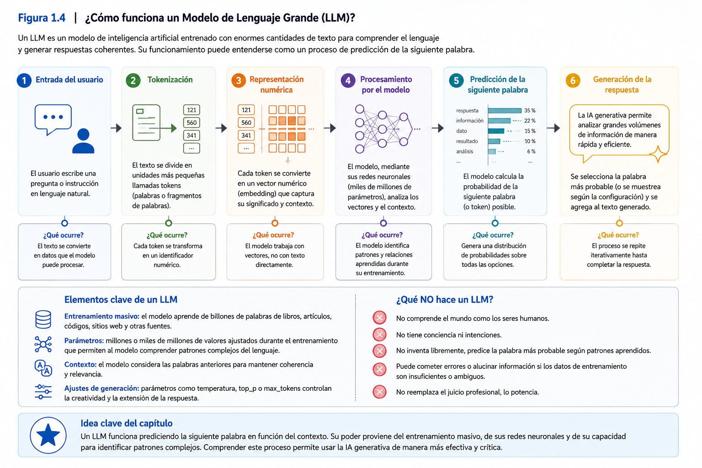
</p>

---

### Ideas clave

Al finalizar este apartado, el participante debería comprender que:

- Un Modelo de Lenguaje de Gran Escala (LLM) constituye el núcleo tecnológico de los asistentes inteligentes actuales.
- Un LLM genera respuestas prediciendo secuencias de palabras a partir del contexto disponible.
- La calidad de las respuestas depende en gran medida del contexto proporcionado al modelo.
- Los LLM no recuperan respuestas previamente almacenadas, sino que generan nuevo contenido de forma dinámica.
- Los asistentes inteligentes especializados aprovechan esta capacidad para adaptarse a distintos dominios disciplinares mediante la definición de contextos e instrucciones específicas.

## 4.4 IA en la nube versus IA local

Durante los últimos años, la mayoría de las personas ha conocido la Inteligencia Artificial Generativa a través de servicios disponibles en Internet, como ChatGPT, Claude, Gemini o Microsoft Copilot. Estas plataformas han democratizado el acceso a modelos de lenguaje de gran escala, permitiendo que millones de usuarios interactúen con sistemas capaces de responder preguntas, redactar documentos, traducir textos o generar código mediante lenguaje natural.

Sin embargo, estos servicios representan únicamente una de las formas posibles de utilizar la Inteligencia Artificial Generativa. Existe una alternativa cada vez más utilizada por organizaciones, instituciones educativas, centros de investigación y profesionales: la ejecución de modelos de inteligencia artificial en infraestructura propia, conocida comúnmente como **IA local**.

Comprender las diferencias entre ambos enfoques resulta fundamental para seleccionar la alternativa más adecuada según las necesidades de cada proyecto.

---

### ¿Qué entendemos por IA en la nube?

La IA en la nube corresponde a un modelo de servicio en el cual el procesamiento de las solicitudes realizadas por el usuario ocurre en servidores administrados por un proveedor externo.

Cuando una persona escribe una consulta utilizando un servicio de IA en línea, la información viaja a través de Internet hasta los centros de datos del proveedor, donde el modelo procesa la solicitud y genera una respuesta que posteriormente es enviada de vuelta al usuario.

Desde la perspectiva del usuario, el proceso resulta prácticamente transparente.

Basta con abrir una aplicación o un navegador web para comenzar a utilizar el servicio.

Esta facilidad de acceso constituye una de las principales razones que explican la rápida expansión de la Inteligencia Artificial Generativa durante los últimos años.

---

### Ventajas de la IA en la nube

Los servicios basados en la nube ofrecen múltiples beneficios.

Entre los más importantes destacan:

- acceso inmediato sin necesidad de instalar modelos complejos;
- actualización permanente de la infraestructura tecnológica;
- disponibilidad de modelos de última generación;
- alta capacidad de procesamiento;
- escalabilidad para atender millones de usuarios simultáneamente;
- mantenimiento administrado por el proveedor.

Estas características convierten a la IA en la nube en una excelente alternativa para usuarios que requieren comenzar rápidamente a utilizar herramientas de inteligencia artificial sin administrar infraestructura propia.

---

### Limitaciones de la IA en la nube

A pesar de sus ventajas, la utilización de servicios externos también implica ciertos desafíos que deben ser considerados, especialmente cuando se trabaja con información sensible o procesos críticos.

Entre ellos se encuentran:

- dependencia de la conexión a Internet;
- dependencia de las políticas comerciales del proveedor;
- posibles restricciones de uso o consumo;
- costos asociados al volumen de consultas;
- menor control sobre la infraestructura tecnológica;
- necesidad de analizar cuidadosamente el tratamiento de la información enviada al servicio.

En muchos contextos organizacionales, estas limitaciones pueden transformarse en factores relevantes al momento de decidir qué estrategia tecnológica adoptar.

---

### ¿Qué entendemos por IA local?

La IA local consiste en ejecutar modelos de inteligencia artificial directamente sobre equipos o servidores controlados por la propia organización o por el usuario.

En este enfoque, el modelo se instala dentro de la infraestructura disponible y procesa las consultas sin depender permanentemente de servicios externos.

Desde el punto de vista conceptual, el funcionamiento del modelo es el mismo.

Lo que cambia es el lugar donde ocurre el procesamiento y el grado de control que posee el usuario sobre la solución implementada.

Durante este taller trabajaremos precisamente bajo este enfoque.

---

### Ventajas de la IA local

La ejecución local de modelos de inteligencia artificial ofrece diversas ventajas para organizaciones y profesionales.

Entre ellas destacan:

#### Mayor control sobre la información

Los datos permanecen dentro de la infraestructura administrada por la organización, reduciendo la necesidad de transferir información hacia servicios externos.

#### Autonomía tecnológica

La organización puede decidir qué modelos utilizar, cuándo actualizarlos y cómo configurarlos según sus necesidades.

#### Personalización

Es posible adaptar el comportamiento del asistente para responder a requerimientos específicos de una institución, empresa o disciplina.

#### Independencia de proveedores

La continuidad del trabajo depende principalmente de la infraestructura propia y no exclusivamente de las condiciones impuestas por un servicio comercial.

#### Experimentación

La IA local facilita la realización de pruebas, ajustes y configuraciones sin afectar servicios productivos ni depender de límites de uso establecidos por terceros.

---

### ¿Significa esto que la IA local es siempre mejor?

No.

Uno de los errores más frecuentes consiste en plantear esta discusión como una competencia donde necesariamente debe existir un ganador.

En realidad, ambos enfoques responden a necesidades distintas.

Existen situaciones donde la IA en la nube constituye la mejor alternativa, especialmente cuando se requiere acceder rápidamente a modelos de última generación sin administrar infraestructura propia.

Por otra parte, existen escenarios donde la IA local resulta especialmente conveniente, por ejemplo:

- instituciones que manejan información confidencial;
- centros de investigación;
- organizaciones con políticas estrictas de seguridad;
- empresas que desean personalizar profundamente sus asistentes;
- proyectos donde la autonomía tecnológica constituye un requisito estratégico.

En consecuencia, la decisión no depende exclusivamente de la tecnología, sino del contexto en el cual será utilizada.

---

### El enfoque adoptado en este taller

El presente taller utiliza IA local por razones tanto pedagógicas como técnicas.

Desde una perspectiva pedagógica, trabajar con modelos locales permite comprender con mayor profundidad cómo se construyen los asistentes inteligentes, evitando que los participantes dependan exclusivamente de plataformas comerciales.

Desde una perspectiva técnica, la IA local proporciona un entorno adecuado para experimentar, configurar modelos, diseñar asistentes especializados e integrarlos posteriormente en flujos funcionales.

Más importante aún, este enfoque favorece el desarrollo de competencias transferibles.

Las herramientas específicas podrán cambiar con el tiempo, pero la comprensión del funcionamiento de un entorno de IA local permitirá adaptarse con mayor facilidad a futuras tecnologías.

---

### Ejemplo aplicado

Suponga que un hospital desea implementar un asistente inteligente para apoyar la elaboración de informes clínicos.

Una alternativa consiste en utilizar un servicio de IA disponible en la nube.

Otra opción consiste en instalar un modelo de lenguaje dentro de la infraestructura tecnológica del propio hospital.

La elección dependerá de diversos factores, entre ellos:

- las políticas institucionales sobre tratamiento de datos;
- los requisitos de seguridad y privacidad;
- la infraestructura tecnológica disponible;
- el nivel de personalización requerido;
- los costos asociados al servicio.

Este ejemplo ilustra que la decisión entre IA local e IA en la nube debe responder a criterios técnicos, organizacionales y estratégicos, más que a preferencias personales.

---

<p align="center">
  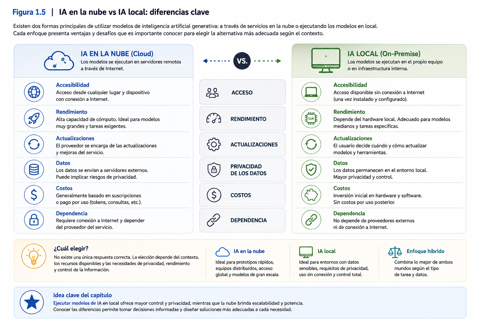
</p>

---

### Ideas clave

Al finalizar este apartado, el participante debería comprender que:

- La IA en la nube y la IA local representan dos estrategias diferentes para utilizar modelos de inteligencia artificial.
- La elección entre ambos enfoques depende de los objetivos, restricciones y necesidades de cada organización.
- La IA local ofrece ventajas importantes en términos de autonomía tecnológica, personalización y control sobre la infraestructura.
- La IA en la nube proporciona acceso inmediato a modelos avanzados sin necesidad de administrar infraestructura propia.
- El presente taller adopta el enfoque de IA local porque favorece el aprendizaje, la experimentación y el desarrollo de asistentes inteligentes especializados.

## 4.5 Autonomía tecnológica

Uno de los conceptos que aparecerá de manera recurrente a lo largo de este taller es el de **autonomía tecnológica**. Aunque suele asociarse a aspectos informáticos o de infraestructura, en realidad corresponde a un concepto mucho más amplio, relacionado con la capacidad que poseen las personas y las organizaciones para decidir cómo utilizan la tecnología, bajo qué condiciones la implementan y qué grado de control mantienen sobre ella.

En el contexto de la Inteligencia Artificial Generativa, la autonomía tecnológica adquiere una importancia especial debido a la creciente dependencia de plataformas, servicios y modelos administrados por grandes proveedores tecnológicos.

Comprender este concepto resulta fundamental para evaluar críticamente las distintas alternativas disponibles y seleccionar aquellas que mejor se adapten a las necesidades de cada organización.

---

### ¿Qué entendemos por autonomía tecnológica?

La autonomía tecnológica puede definirse como la capacidad de una organización o de un profesional para utilizar, adaptar y gestionar soluciones tecnológicas manteniendo un adecuado nivel de control sobre su funcionamiento, su evolución y el tratamiento de la información que procesan.

No significa trabajar completamente aislado de Internet ni rechazar el uso de servicios en la nube.

Tampoco implica desarrollar todas las soluciones desde cero.

Por el contrario, significa disponer de la capacidad para decidir, de manera informada, cuándo conviene utilizar un servicio externo y cuándo resulta más conveniente implementar una solución propia.

La autonomía tecnológica, por tanto, constituye una cuestión de **gobernanza tecnológica** más que una característica exclusiva del software.

---

### ¿Por qué la autonomía tecnológica se ha vuelto tan relevante?

La rápida expansión de la Inteligencia Artificial Generativa ha permitido que organizaciones de todos los tamaños incorporen asistentes inteligentes a sus procesos de trabajo.

Sin embargo, esta adopción también ha generado nuevas preguntas:

- ¿Dónde se procesan nuestros datos?
- ¿Quién administra los modelos utilizados?
- ¿Qué ocurre si un proveedor modifica las condiciones del servicio?
- ¿Es posible personalizar completamente el comportamiento del asistente?
- ¿Cómo garantizar la continuidad operativa si el servicio deja de estar disponible?

Responder estas preguntas exige analizar aspectos que van mucho más allá de las capacidades técnicas de un modelo de inteligencia artificial.

En este contexto, la autonomía tecnológica se transforma en un criterio estratégico para la planificación e implementación de soluciones basadas en IA.

---

### Dimensiones de la autonomía tecnológica

Aunque el concepto puede analizarse desde múltiples perspectivas, en este taller consideraremos cinco dimensiones fundamentales.

#### Control sobre la información

La organización debe conocer dónde se almacenan los datos, cómo son procesados y quién tiene acceso a ellos.

Este aspecto resulta especialmente relevante cuando se trabaja con información institucional, antecedentes de investigación, datos personales o documentos confidenciales.

---

#### Control sobre la infraestructura

Corresponde a la capacidad para decidir dónde se ejecutarán los modelos de inteligencia artificial.

Dependiendo del contexto, esto puede significar utilizar:

- infraestructura propia;
- servidores institucionales;
- servicios en la nube;
- esquemas híbridos.

La decisión dependerá de los objetivos y restricciones de cada organización.

---

#### Personalización

La autonomía también implica la posibilidad de adaptar el comportamiento de los asistentes inteligentes a necesidades específicas.

Por ejemplo:

- utilizar terminología institucional;
- aplicar reglamentos internos;
- responder utilizando formatos definidos;
- especializar el asistente en un dominio disciplinar.

Esta capacidad constituye uno de los principales beneficios del enfoque que desarrollaremos durante el taller.

---

#### Continuidad operativa

Las organizaciones deben considerar cómo asegurar el funcionamiento de sus soluciones tecnológicas frente a cambios externos.

Una dependencia excesiva de un único proveedor puede afectar la continuidad de determinados procesos.

Contar con alternativas tecnológicas incrementa la capacidad de adaptación frente a este tipo de situaciones.

---

#### Desarrollo de capacidades internas

La autonomía tecnológica también supone fortalecer las competencias de las personas que utilizarán y administrarán las soluciones implementadas.

No basta con disponer de una herramienta.

Es necesario comprender:

- cómo funciona;
- cuáles son sus limitaciones;
- cómo configurarla;
- cómo mantenerla;
- cómo mejorarla con el tiempo.

Precisamente uno de los objetivos de este taller consiste en desarrollar estas capacidades.

---

### Autonomía tecnológica y toma de decisiones

Desde una perspectiva organizacional, la autonomía tecnológica no constituye un fin en sí mismo.

Su verdadero valor radica en proporcionar mejores condiciones para la toma de decisiones.

Una organización que comprende el funcionamiento de sus herramientas puede evaluar con mayor criterio aspectos como:

- costos;
- seguridad;
- privacidad;
- escalabilidad;
- sostenibilidad;
- interoperabilidad;
- dependencia de proveedores.

En consecuencia, la autonomía tecnológica contribuye directamente a una gestión más informada y estratégica de la innovación.

---

### El papel de la IA local

El uso de modelos ejecutados localmente representa una de las estrategias que pueden fortalecer la autonomía tecnológica.

Sin embargo, es importante comprender que la IA local no constituye una solución universal.

Existen numerosos escenarios donde los servicios en la nube representan una alternativa completamente válida e incluso preferible.

Lo relevante no es optar siempre por una única tecnología, sino desarrollar la capacidad para seleccionar la solución más adecuada según los requerimientos del contexto.

Por esta razón, el presente taller utiliza la IA local como medio para comprender con mayor profundidad el funcionamiento de los asistentes inteligentes y fortalecer las competencias de los participantes, más que como una postura excluyente respecto de otras alternativas tecnológicas.

---

### Ejemplo aplicado

Considere una universidad que desea implementar un asistente inteligente para apoyar a los estudiantes durante el proceso de inscripción de asignaturas.

La institución podría contratar un servicio comercial disponible en la nube.

Sin embargo, también podría optar por desarrollar un asistente ejecutado en servidores institucionales, utilizando su propia base normativa, reglamentos académicos y procedimientos internos.

Ambas alternativas son técnicamente viables.

La diferencia radica en el grado de control que la universidad desea mantener sobre aspectos como:

- personalización del asistente;
- administración de la información;
- continuidad del servicio;
- evolución futura de la solución.

En este escenario, la autonomía tecnológica permite que la decisión responda a criterios institucionales y no únicamente a las características de una plataforma específica.

---

<p align="center">
  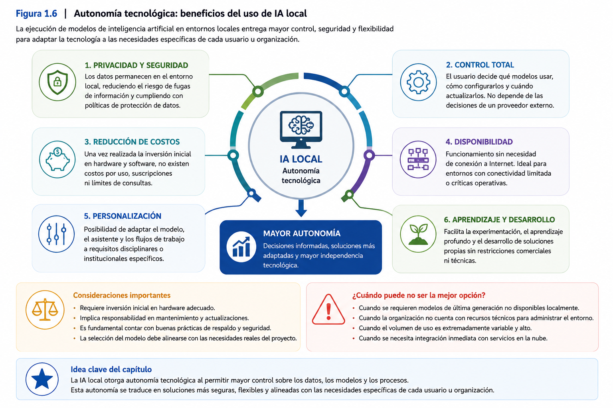
</p>

---

### Ideas clave

Al finalizar este apartado, el participante debería comprender que:

- La autonomía tecnológica corresponde a la capacidad de utilizar y gestionar soluciones tecnológicas manteniendo un adecuado nivel de control sobre ellas.
- La autonomía tecnológica involucra aspectos relacionados con la información, la infraestructura, la personalización, la continuidad operativa y el desarrollo de capacidades internas.
- La IA local constituye una estrategia para fortalecer dicha autonomía, pero no reemplaza necesariamente a los servicios en la nube.
- La elección entre distintas alternativas tecnológicas debe responder a criterios organizacionales, técnicos y estratégicos.
- El desarrollo de competencias constituye un componente esencial de la autonomía tecnológica y uno de los principales objetivos del presente taller.

## 4.6 Componentes de un entorno de IA local

Una vez comprendidos los conceptos de Inteligencia Artificial Generativa, Modelos de Lenguaje de Gran Escala (LLM) y autonomía tecnológica, resulta natural preguntarse cómo es posible ejecutar un modelo de inteligencia artificial directamente en un computador personal o en un servidor institucional.

La respuesta consiste en la integración de diversos componentes de software que trabajan coordinadamente para permitir la ejecución de modelos de lenguaje sin depender permanentemente de servicios externos.

Aunque cada implementación puede variar según las herramientas utilizadas, la arquitectura general de un entorno de IA local mantiene una estructura relativamente similar.

Comprender esta arquitectura resulta mucho más importante que memorizar el nombre de una determinada aplicación, ya que las herramientas evolucionan constantemente mientras que los principios que sustentan su funcionamiento permanecen prácticamente invariables.

---

### Una arquitectura compuesta por varios elementos

Al igual que ocurre con un automóvil, un entorno de IA local no está constituido por una única pieza.

Para que un vehículo pueda desplazarse se requiere la interacción coordinada de múltiples componentes:

- motor;
- transmisión;
- dirección;
- frenos;
- sistema eléctrico.

Cada uno cumple una función distinta.

De forma similar, un entorno de Inteligencia Artificial Local integra diferentes componentes que permiten que el modelo pueda responder las consultas realizadas por el usuario.

Comprender el rol de cada uno de ellos facilitará posteriormente la instalación, configuración y resolución de problemas.

---

### El modelo de lenguaje

El primer componente corresponde al **Modelo de Lenguaje de Gran Escala (LLM)**.

Este constituye el "cerebro" del sistema.

Es el responsable de:

- comprender instrucciones;
- analizar el contexto;
- generar respuestas;
- redactar textos;
- producir código;
- resumir documentos.

Sin un modelo de lenguaje no existe inteligencia artificial generativa.

Durante el taller los participantes utilizarán modelos previamente entrenados que podrán ejecutarse directamente sobre su computador.

---

### El motor de ejecución

Disponer de un modelo no es suficiente.

Es necesario contar con un software capaz de cargar dicho modelo en memoria, administrar los recursos del computador y ejecutar las consultas realizadas por el usuario.

Este componente actúa como un **motor de ejecución**, permitiendo que el modelo pueda funcionar correctamente dentro del sistema operativo.

Su función es comparable a la de un reproductor multimedia.

Un archivo de video por sí solo no puede reproducirse.

Se requiere un programa capaz de interpretarlo y mostrarlo en pantalla.

De manera análoga, un modelo de lenguaje necesita un motor que permita utilizarlo.

Durante este taller ese rol será desempeñado por **Ollama**, herramienta que será estudiada en profundidad en el siguiente capítulo.

Por ahora basta comprender que constituye el componente encargado de ejecutar los modelos de IA de manera local.

---

### La interfaz de usuario

Una vez que el modelo se encuentra ejecutándose, es necesario proporcionar un mecanismo que permita interactuar con él.

La interfaz de usuario constituye precisamente ese punto de contacto entre la persona y el modelo de inteligencia artificial.

Su función consiste en facilitar la escritura de consultas, visualizar respuestas y administrar conversaciones.

La interfaz facilita la interacción con el modelo y, dependiendo de sus funcionalidades, también puede permitir configurar determinados aspectos del asistente, como instrucciones, parámetros o características de la interacción.

En este taller utilizaremos **Open WebUI**, una interfaz gráfica que permite trabajar con modelos ejecutados mediante Ollama y configurar asistentes especializados.

Al igual que en el caso anterior, el objetivo de este capítulo no es aprender a utilizar esta herramienta, sino comprender el papel que desempeña dentro de la arquitectura general.

---

### El usuario

Aunque pueda parecer evidente, el usuario constituye uno de los componentes más importantes del sistema.

La calidad de las respuestas depende en gran medida de:

- las preguntas formuladas;
- el contexto proporcionado;
- las instrucciones entregadas;
- la capacidad para interpretar críticamente los resultados.

La Inteligencia Artificial Generativa no reemplaza el criterio profesional.

Por el contrario, amplifica las capacidades del usuario cuando éste sabe formular adecuadamente sus consultas.

Esta idea será desarrollada con mayor profundidad durante los capitulos dedicados al diseño de asistentes inteligentes.

---

### La información utilizada

Todo asistente inteligente necesita trabajar sobre algún tipo de información.

Dependiendo del problema que se desea resolver, ésta puede provenir de:

- documentos institucionales;
- artículos científicos;
- reglamentos;
- manuales;
- bases de conocimiento;
- procedimientos internos;
- datos proporcionados por el usuario.

La utilidad del asistente dependerá directamente de la calidad, actualidad y pertinencia de esta información.

En consecuencia, un buen asistente no depende únicamente del modelo utilizado, sino también del conocimiento que se pone a su disposición.

---

### Una visión integrada

Cuando todos estos componentes trabajan coordinadamente, el proceso ocurre de manera muy sencilla desde la perspectiva del usuario.

1. El usuario formula una consulta.
2. La interfaz recibe la solicitud.
3. El motor de ejecución envía la consulta al modelo.
4. El modelo analiza el contexto y genera una respuesta.
5. La respuesta es presentada nuevamente al usuario.

Aunque internamente ocurren numerosos procesos adicionales, esta secuencia resume el funcionamiento general de un entorno de Inteligencia Artificial Local.

Comprender esta arquitectura permitirá interpretar con mayor facilidad las actividades prácticas que se desarrollarán durante el taller.

---

### Ejemplo aplicado

Imagine una empresa que desea implementar un asistente inteligente para responder consultas sobre sus procedimientos internos.

Para ello necesitará:

- un modelo de lenguaje capaz de comprender las consultas;
- un motor que permita ejecutar dicho modelo;
- una interfaz para que los funcionarios interactúen con el asistente;
- los documentos institucionales que servirán como base de conocimiento;
- usuarios que formulen las consultas e interpreten las respuestas.

Obsérvese que ninguno de estos componentes, por sí solo, constituye la solución completa.

El verdadero valor surge de la integración de todos ellos.

---

<p align="center">
  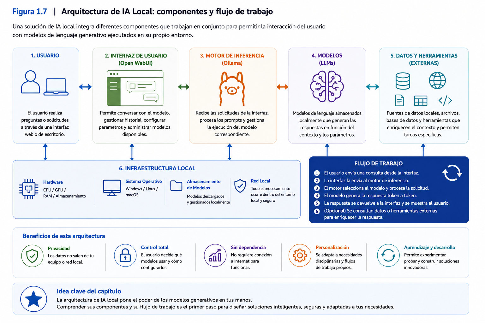
</p>

> **Nota:** En capitulos posteriores esta arquitectura se ampliará incorporando herramientas de automatización e integración con otras aplicaciones.

---

### Ideas clave

Al finalizar este apartado, el participante debería comprender que:

- Un entorno de IA local está compuesto por diversos elementos que trabajan de forma integrada.
- El modelo de lenguaje constituye el núcleo del sistema, pero requiere un motor de ejecución para funcionar.
- La interfaz de usuario facilita la interacción entre las personas y el modelo de inteligencia artificial.
- La calidad de los resultados depende tanto del modelo como de la información disponible y de las instrucciones proporcionadas por el usuario.
- Comprender la arquitectura general resulta más importante que memorizar herramientas específicas, ya que estas evolucionan con rapidez mientras que los principios de funcionamiento permanecen estables.

## 4.7 ¿Qué es un asistente inteligente especializado?

Durante los últimos años, millones de personas han comenzado a utilizar herramientas de Inteligencia Artificial Generativa para responder preguntas, redactar documentos, resumir información o generar código de programación. La mayoría de estas aplicaciones corresponden a asistentes de propósito general, capaces de abordar una amplia variedad de temas mediante lenguaje natural.

Sin embargo, en el ámbito profesional, académico y organizacional, rara vez se necesita un asistente que "sepa un poco de todo". Lo que normalmente se requiere es una herramienta capaz de comprender un contexto específico, utilizar terminología especializada y apoyar tareas concretas asociadas a un determinado dominio de conocimiento.

Es precisamente en este escenario donde surgen los **asistentes inteligentes especializados**.

---

### Del conocimiento general al conocimiento especializado

Imagine que una empresa incorpora un nuevo profesional.

Durante sus primeros días de trabajo, esa persona posee conocimientos generales sobre su profesión, pero desconoce los procedimientos internos, la normativa institucional, la terminología utilizada por la organización y las características específicas de sus clientes.

Con el paso del tiempo, y gracias a la experiencia acumulada, comienza a especializarse.

Aprende:

- los procesos propios de la organización;
- los documentos institucionales;
- los criterios utilizados para tomar decisiones;
- la forma de comunicar la información;
- las necesidades particulares de los usuarios.

El resultado es un profesional que continúa siendo competente en su disciplina, pero cuya experiencia se encuentra ahora orientada hacia un contexto específico.

Con los asistentes inteligentes ocurre algo muy similar.

Un modelo de lenguaje posee un conocimiento general obtenido durante su entrenamiento. Sin embargo, mediante una adecuada configuración, es posible orientarlo para desempeñar un rol muy específico dentro de una organización o disciplina.

---

### ¿Qué hace que un asistente sea especializado?

Un asistente inteligente especializado no depende exclusivamente del modelo de lenguaje utilizado.

Su comportamiento es consecuencia de diversos elementos que trabajan conjuntamente.

Entre ellos destacan:

- el contexto definido para el asistente;
- el rol que deberá desempeñar;
- los objetivos que orientan su funcionamiento;
- las restricciones establecidas por el diseñador;
- la información que utilizará como referencia;
- los criterios de respuesta esperados.

En otras palabras, el modelo constituye únicamente la base tecnológica.

La especialización surge a partir del diseño realizado por quien configura el asistente.

En este taller, una parte fundamental de esa especialización se realizará mediante el **System Prompt**, donde se definirán elementos como el rol del asistente, sus objetivos, criterios de respuesta, restricciones y forma de comunicación. La especialización podrá complementarse posteriormente con información proporcionada durante la interacción y con otros recursos disponibles para el asistente.

---

### Asistente generalista versus asistente especializado

Un asistente generalista intenta responder consultas sobre prácticamente cualquier tema.

Por ejemplo:

- historia;
- programación;
- medicina;
- economía;
- literatura;
- matemáticas.

Su fortaleza radica en su versatilidad.

Sin embargo, esa misma amplitud puede transformarse en una limitación cuando se requiere responder utilizando criterios propios de una organización o disciplina específica.

En cambio, un asistente especializado restringe deliberadamente su ámbito de acción.

Por ejemplo, puede estar diseñado exclusivamente para:

- apoyar la gestión financiera de una empresa;
- orientar procesos académicos universitarios;
- asistir investigaciones científicas;
- analizar normativa jurídica;
- apoyar diagnósticos clínicos;
- responder consultas sobre procedimientos internos.

Esta especialización permite obtener respuestas más consistentes y alineadas con las necesidades del usuario.

---

### La importancia del contexto

Uno de los factores que mayor influencia ejerce sobre el comportamiento de un asistente inteligente es el contexto.

El contexto responde preguntas como:

- ¿Quién es el asistente?
- ¿Cuál es su función?
- ¿Qué tipo de información puede utilizar?
- ¿Qué objetivos debe cumplir?
- ¿Qué restricciones debe respetar?
- ¿Cómo debe comunicarse con el usuario?

Cuanto más claro y preciso sea este contexto, mayor será la probabilidad de obtener respuestas coherentes.

En el siguiente capítulo se estudiará en profundidad cómo construir este contexto mediante el diseño de un **System Prompt**, elemento que orientará el comportamiento del asistente.

---

### Un asistente como apoyo al trabajo profesional

El propósito de un asistente inteligente especializado no consiste en reemplazar al profesional.

Su función es apoyar tareas que consumen tiempo y esfuerzo, permitiendo que las personas concentren su atención en actividades que requieren análisis, juicio crítico y toma de decisiones.

Entre las tareas donde un asistente puede aportar valor se encuentran:

- resumir documentos extensos;
- clasificar información;
- elaborar borradores de informes;
- responder consultas frecuentes;
- organizar antecedentes;
- identificar patrones en grandes volúmenes de información;
- generar propuestas iniciales para apoyar el trabajo del especialista.

En todos estos casos, la responsabilidad final continúa recayendo sobre la persona que utiliza el asistente.

---

### El asistente como parte de un proceso

Es importante comprender que un asistente inteligente rara vez constituye una solución completa por sí solo.

Generalmente forma parte de un proceso más amplio.

Por ejemplo:

1. Un usuario ingresa información.
2. El asistente analiza los antecedentes.
3. Genera una propuesta de respuesta.
4. Un profesional revisa el resultado.
5. Finalmente se toma una decisión.

Esta integración entre capacidades humanas y capacidades de la Inteligencia Artificial representa uno de los principios fundamentales del enfoque de trabajo desarrollado en este taller.

---

### Ejemplo aplicado

Considere una universidad que recibe diariamente cientos de consultas relacionadas con reglamentos académicos.

Un asistente de propósito general podría responder muchas de estas preguntas.

Sin embargo, un asistente especializado podría además:

- utilizar exclusivamente la normativa institucional vigente;
- responder siguiendo el lenguaje utilizado por la universidad;
- considerar calendarios académicos específicos;
- incorporar procedimientos internos;
- orientar las respuestas según el perfil del estudiante.

Aunque ambos asistentes utilicen el mismo modelo de lenguaje, la diferencia radica en el contexto y en las instrucciones que orientan su comportamiento.

Este ejemplo ilustra una de las ideas centrales del taller: el verdadero valor no reside únicamente en el modelo de inteligencia artificial, sino en el diseño del asistente que se construye sobre él.

---

<p align="center">
  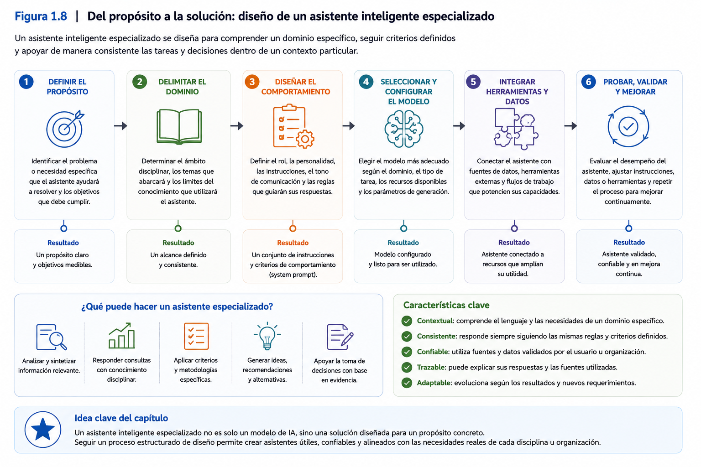
</p>

---

### Ideas clave

Al finalizar este apartado, el participante debería comprender que:

- Un asistente inteligente especializado se construye sobre un Modelo de Lenguaje de Gran Escala, pero su comportamiento depende principalmente del contexto definido por el diseñador.
- La especialización permite adaptar el asistente a un dominio disciplinar, una organización o un proceso específico.
- El contexto, el rol, los objetivos y las restricciones constituyen elementos esenciales para orientar las respuestas del asistente.
- Los asistentes inteligentes especializados complementan el trabajo del profesional, facilitando el análisis de información y apoyando la toma de decisiones.
- El diseño de asistentes inteligentes especializados constituye el eje central del Proyecto Integrador que será desarrollado durante el taller.

# 5. Ejemplos de aplicación

Los conceptos desarrollados hasta este punto permiten comprender que la Inteligencia Artificial Generativa trasciende la simple interacción con un asistente conversacional. Su verdadero potencial se manifiesta cuando se utiliza para resolver problemas concretos dentro de un contexto disciplinar específico.

En esta sección se presentan diversos ejemplos que ilustran cómo un asistente inteligente especializado puede apoyar procesos de análisis y toma de decisiones en distintos ámbitos profesionales.

Es importante destacar que estos ejemplos no representan soluciones completamente desarrolladas. Su propósito consiste en mostrar oportunidades de aplicación que posteriormente podrán transformarse en proyectos reales durante el desarrollo del Proyecto Integrador.

---

## Caso 1. Educación Superior

### Situación

Una universidad recibe diariamente cientos de consultas relacionadas con reglamentos académicos, inscripción de asignaturas, requisitos de titulación y procesos administrativos.

Responder estas consultas requiere revisar múltiples documentos institucionales y mantener criterios uniformes entre las distintas unidades académicas.

### Solución mediante un asistente inteligente especializado

La institución desarrolla un asistente entrenado para:

- interpretar reglamentos académicos;
- responder consultas frecuentes;
- orientar a estudiantes sobre procedimientos institucionales;
- generar respuestas utilizando la terminología oficial de la universidad.

### Beneficios

- Disminución de tiempos de respuesta.
- Mayor uniformidad en la información entregada.
- Apoyo permanente para estudiantes y funcionarios.
- Reducción de consultas repetitivas.

---

## Caso 2. Investigación científica

### Situación

Un grupo de investigación necesita revisar cientos de artículos científicos para identificar tendencias, metodologías utilizadas y vacíos de investigación.

El análisis manual consume una gran cantidad de tiempo.

### Solución mediante un asistente inteligente especializado

El investigador diseña un asistente capaz de:

- resumir artículos científicos;
- identificar objetivos y metodologías;
- clasificar publicaciones por temática;
- extraer hallazgos relevantes;
- apoyar la construcción del estado del arte.

### Beneficios

- Mayor velocidad de revisión bibliográfica.
- Organización sistemática de la información.
- Identificación de patrones de investigación.
- Apoyo a la elaboración de informes científicos.

---

## Caso 3. Salud

### Situación

Un establecimiento de salud debe elaborar diariamente numerosos informes clínicos y administrativos.

Los profesionales dedican una parte importante de su jornada a tareas documentales.

### Solución mediante un asistente inteligente especializado

El asistente puede colaborar en:

- elaboración de borradores de informes;
- organización de antecedentes clínicos;
- generación de resúmenes de atención;
- apoyo documental para equipos médicos.

### Beneficios

- Disminución de tareas repetitivas.
- Mejor organización de la información.
- Mayor disponibilidad de tiempo para actividades asistenciales.

**Importante:** En este contexto, la Inteligencia Artificial constituye exclusivamente una herramienta de apoyo. Las decisiones clínicas continúan siendo responsabilidad del profesional de salud.

---

## Caso 4. Ingeniería y mantenimiento

### Situación

Una empresa industrial administra cientos de procedimientos técnicos y manuales de mantenimiento.

Cuando ocurre una falla, los técnicos deben localizar rápidamente la documentación correspondiente.

### Solución mediante un asistente inteligente especializado

El asistente permite:

- consultar procedimientos técnicos mediante lenguaje natural;
- localizar manuales específicos;
- resumir protocolos de mantenimiento;
- apoyar la resolución de incidentes.

### Beneficios

- Reducción de tiempos de búsqueda.
- Acceso más rápido al conocimiento técnico.
- Mayor estandarización de procedimientos.

---

## Caso 5. Gestión organizacional

### Situación

Una organización necesita analizar periódicamente grandes volúmenes de información provenientes de informes, reuniones, encuestas y documentos institucionales.

El procesamiento manual dificulta la identificación oportuna de tendencias.

### Solución mediante un asistente inteligente especializado

El asistente puede:

- resumir documentos ejecutivos;
- clasificar información;
- identificar temas recurrentes;
- generar reportes preliminares;
- apoyar reuniones de toma de decisiones.

### Beneficios

- Mayor eficiencia en el análisis de información.
- Mejor preparación de reuniones ejecutivas.
- Apoyo a la planificación estratégica.

---

## Elementos comunes en todos los casos

Aunque los ejemplos anteriores pertenecen a disciplinas diferentes, todos comparten una estructura similar.

1. Existe un problema relacionado con el procesamiento de información.
2. El conocimiento necesario para resolver ese problema puede organizarse y describirse.
3. Un Modelo de Lenguaje de Gran Escala puede apoyar dicho proceso.
4. El asistente inteligente se especializa mediante la definición de un contexto específico.
5. La decisión final continúa siendo responsabilidad del profesional.

Esta estructura constituye precisamente la lógica que seguirá el Proyecto Integrador desarrollado durante el taller.

---

## Del ejemplo al Proyecto Integrador

Al finalizar este capítulo, cada participante comenzará a definir un problema perteneciente a su propio contexto profesional.

No se espera que todos desarrollen el mismo tipo de asistente.

Por el contrario, uno de los principales objetivos del taller consiste en que cada participante adapte la Inteligencia Artificial Generativa a las necesidades particulares de su disciplina.

Algunos asistentes estarán orientados a la educación.

Otros a la investigación.

Otros al análisis financiero.

Otros a procesos industriales.

Otros a la gestión documental.

La diversidad de proyectos permitirá demostrar que los principios estudiados durante este capítulo pueden aplicarse en una amplia variedad de contextos profesionales.

---

<p align="center">
  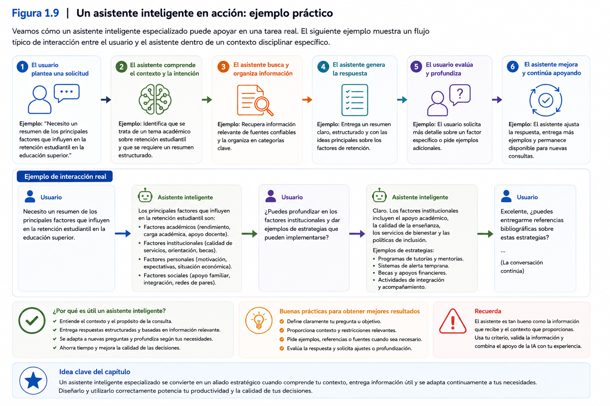
</p>

---

### Ideas clave

Al finalizar esta sección, el participante debería comprender que:

- La Inteligencia Artificial Generativa puede aplicarse en una amplia variedad de disciplinas.
- El verdadero valor de un asistente inteligente surge cuando se adapta a un problema específico.
- Los principios estudiados en este capítulo son independientes del área profesional donde serán utilizados.
- El Proyecto Integrador permitirá aplicar estos conceptos al contexto laboral o disciplinar de cada participante.
- La Inteligencia Artificial complementa el trabajo profesional, facilitando el análisis de información y apoyando la toma de decisiones, sin reemplazar el juicio experto.

# 6. Demostración conceptual

En esta sección se presenta una demostración conceptual cuyo propósito es ilustrar cómo un Modelo de Lenguaje de Gran Escala puede apoyar el análisis de información antes de que el participante aprenda a configurar su propio asistente inteligente.

La demostración no pretende enseñar el uso de una herramienta específica. Su objetivo consiste en comprender la lógica de interacción entre un usuario y un modelo de Inteligencia Artificial Generativa, identificando los elementos que posteriormente permitirán diseñar asistentes inteligentes especializados.

---

## Situación de trabajo

Imagine que un director académico debe revisar un documento institucional de aproximadamente veinte páginas para identificar los principales cambios introducidos en una nueva normativa.

Realizar esta tarea de forma completamente manual requiere:

- leer el documento completo;
- identificar los cambios relevantes;
- organizar la información;
- redactar un resumen ejecutivo;
- elaborar recomendaciones para su equipo de trabajo.

Dependiendo de la complejidad del documento, este proceso puede consumir varias horas.

Surge entonces la siguiente pregunta:

> **¿Puede un Modelo de Lenguaje apoyar este proceso de análisis sin reemplazar el juicio profesional del director académico?**

---

## Interacción inicial

El usuario proporciona el documento al modelo y formula una consulta como la siguiente:

> **Analiza este documento e identifica los cinco cambios más relevantes respecto de la normativa anterior. Resume cada cambio utilizando un lenguaje claro y explica brevemente cuál podría ser su impacto para una institución de educación superior.**

Obsérvese que la solicitud no consiste simplemente en generar un resumen.

El usuario está solicitando al modelo que:

- analice información;
- identifique cambios;
- sintetice contenido;
- genere una interpretación inicial.

Este tipo de tareas constituye uno de los principales aportes de la Inteligencia Artificial Generativa en procesos de análisis documental.

---

## ¿Qué ocurre internamente?

Aunque el usuario únicamente observa una respuesta en pantalla, internamente el modelo ejecuta diversas operaciones.

De manera simplificada, el proceso puede representarse mediante las siguientes etapas:

1. Recibe la consulta formulada por el usuario.
2. Analiza el contexto disponible.
3. Interpreta la intención de la solicitud.
4. Procesa el contenido del documento.
5. Genera una respuesta utilizando lenguaje natural.
6. Presenta el resultado al usuario.

Todo este proceso ocurre en pocos segundos.

Es importante destacar que el modelo no "comprende" el documento como lo haría un especialista humano. Lo que hace es identificar patrones presentes en el texto y generar una respuesta estadísticamente coherente con el contexto proporcionado.

---

## El papel del profesional

Una vez obtenida la respuesta, comienza una etapa igualmente importante.

El profesional analiza críticamente el resultado.

Entre las preguntas que debería formularse se encuentran:

- ¿La información es correcta?
- ¿Se omitieron aspectos importantes?
- ¿La interpretación realizada por el modelo es adecuada para este contexto?
- ¿Existen afirmaciones que deban verificarse?
- ¿La respuesta requiere ajustes antes de ser utilizada?

En esta etapa queda de manifiesto uno de los principios fundamentales del taller:

> **La Inteligencia Artificial apoya el análisis, pero la responsabilidad sobre las conclusiones continúa siendo del profesional.**

---

## ¿Cómo mejora este proceso un asistente especializado?

Supongamos ahora que, en lugar de utilizar un asistente de propósito general, el director académico dispone de un asistente especializado en normativa universitaria.

Este asistente podría haber sido configurado para:

- utilizar exclusivamente reglamentos institucionales;
- responder empleando terminología académica;
- considerar la legislación vigente;
- identificar automáticamente artículos relacionados;
- generar informes utilizando el formato institucional.

Obsérvese que el Modelo de Lenguaje continúa siendo el mismo.

Lo que cambia es el contexto que orienta su comportamiento.

Este ejemplo demuestra por qué el diseño del asistente resulta tan importante como el modelo de inteligencia artificial utilizado.

---

## Aprendizajes obtenidos

Esta demostración permite identificar varias ideas centrales del presente capítulo.

En primer lugar, la Inteligencia Artificial Generativa puede apoyar procesos complejos de análisis documental.

En segundo lugar, la calidad del resultado depende tanto del modelo como de la forma en que el usuario plantea la solicitud.

Finalmente, el verdadero potencial de estas herramientas aparece cuando el modelo deja de comportarse como un asistente generalista y comienza a operar dentro de un dominio de conocimiento claramente definido.

Precisamente este será el objetivo de los siguientes capitulos.

---

<p align="center">
  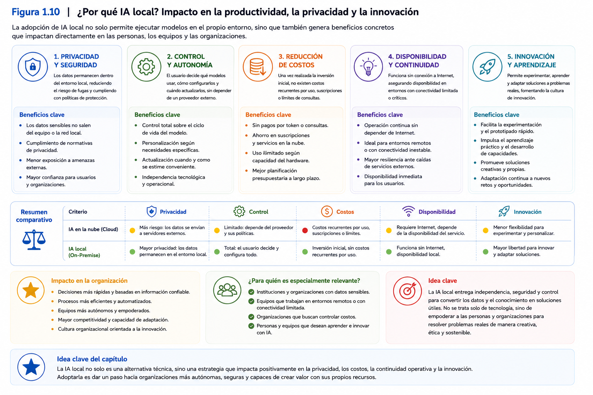
</p>

---

### Ideas clave

Al finalizar esta demostración, el participante debería comprender que:

- La Inteligencia Artificial Generativa puede apoyar procesos de análisis documental complejos.
- El modelo genera una propuesta inicial que debe ser interpretada críticamente por el usuario.
- La calidad del resultado depende del contexto y de la forma en que se plantea la consulta.
- Un asistente inteligente especializado mejora la pertinencia de las respuestas al incorporar conocimiento propio de un dominio específico.
- La toma de decisiones continúa siendo responsabilidad del profesional que utiliza la herramienta.

# 7. Buenas prácticas

La Inteligencia Artificial Generativa constituye una herramienta de enorme potencial para apoyar el análisis de información, la generación de contenido y la toma de decisiones. Sin embargo, obtener resultados útiles no depende únicamente de la calidad del modelo utilizado. También requiere que el usuario adopte prácticas de trabajo que favorezcan un uso eficiente, responsable y crítico de estas tecnologías.

Las siguientes recomendaciones constituyen principios generales que orientarán el trabajo durante todo el taller y servirán como base para el desarrollo del Proyecto Integrador.

---

## Comprender el problema antes de utilizar la IA

Una de las principales fortalezas de la Inteligencia Artificial consiste en su capacidad para apoyar la resolución de problemas.

No obstante, ningún modelo puede compensar una definición deficiente del problema que se desea resolver.

Antes de utilizar un asistente inteligente resulta recomendable responder preguntas como:

- ¿Qué necesidad deseo resolver?
- ¿Qué información necesito analizar?
- ¿Qué resultado espero obtener?
- ¿Cómo utilizaré posteriormente ese resultado?

Una adecuada comprensión del problema facilita la selección de la estrategia tecnológica más apropiada.

---

## Utilizar la IA como apoyo y no como sustituto del criterio profesional

Los modelos de Inteligencia Artificial pueden generar respuestas de gran calidad, pero ello no significa que siempre sean correctas.

Las respuestas producidas por un asistente deben entenderse como insumos para el análisis y no como decisiones definitivas.

El profesional continúa siendo responsable de:

- interpretar los resultados;
- verificar la información;
- considerar el contexto;
- adoptar la decisión final.

Mantener este principio constituye una condición esencial para un uso responsable de la Inteligencia Artificial.

---

## Formular consultas claras y específicas

La calidad de una respuesta depende en gran medida de la calidad de la consulta realizada.

Aunque el diseño de instrucciones será desarrollado en profundidad en el siguiente capítulo, desde este momento resulta conveniente incorporar un hábito fundamental:

> Cuanto más clara sea la solicitud, mayor será la probabilidad de obtener una respuesta útil.

En general, una buena consulta debería indicar:

- el objetivo de la tarea;
- el contexto del problema;
- el tipo de respuesta esperada;
- el nivel de profundidad requerido.

---

## Verificar siempre la información obtenida

La Inteligencia Artificial puede producir respuestas plausibles que contengan errores, omisiones o afirmaciones incorrectas.

Por esta razón, toda información utilizada para apoyar decisiones relevantes debe ser verificada utilizando fuentes confiables.

Esta recomendación adquiere especial importancia en ámbitos como:

- salud;
- educación;
- investigación;
- ingeniería;
- derecho;
- administración pública.

La validación de la información constituye una responsabilidad del usuario y no del modelo.

---

## Respetar la privacidad y la confidencialidad de la información

Antes de utilizar cualquier herramienta de Inteligencia Artificial es importante analizar el tipo de información que será procesada.

Cuando se trabaja con antecedentes sensibles, documentos institucionales o información confidencial, resulta indispensable respetar las políticas y normativas aplicables a la organización.

Uno de los motivos por los cuales este taller utiliza un entorno de IA local es precisamente fortalecer el control sobre la información utilizada durante el desarrollo de los asistentes inteligentes.

---

## Comprender las limitaciones del modelo

Ningún modelo de Inteligencia Artificial posee conocimiento perfecto.

Todos presentan limitaciones relacionadas con:

- la calidad de los datos utilizados durante su entrenamiento;
- la actualización de la información disponible;
- la interpretación del contexto;
- la generación ocasional de respuestas incorrectas.

Conocer estas limitaciones permite utilizar la herramienta con expectativas realistas y aprovechar mejor sus fortalezas.

---

## Documentar el proceso de trabajo

A medida que el participante avance en el desarrollo del Proyecto Integrador, será recomendable registrar:

- las decisiones adoptadas;
- las configuraciones realizadas;
- los problemas encontrados;
- las soluciones implementadas;
- las mejoras incorporadas.

Esta documentación facilitará la evaluación del proyecto y permitirá reproducir posteriormente la solución desarrollada.

---

## Mantener una actitud de aprendizaje continuo

La Inteligencia Artificial Generativa evoluciona con gran rapidez.

Nuevos modelos, herramientas y aplicaciones aparecen continuamente.

Por esta razón, el principal aprendizaje que debe obtener el participante no consiste en memorizar una herramienta específica, sino en comprender los principios que sustentan su funcionamiento.

Las tecnologías cambiarán.

Los fundamentos permanecerán.

---

## Buenas prácticas para este taller

Durante el desarrollo de los siguientes capitulos se recomienda que cada participante:

- experimente con diferentes consultas;
- compare distintas respuestas;
- analice críticamente los resultados obtenidos;
- comparta experiencias con otros participantes;
- documente los avances del Proyecto Integrador;
- formule preguntas cuando existan dudas conceptuales.

El aprendizaje obtenido durante el taller dependerá, en gran medida, del grado de participación activa de cada asistente.

---

<p align="center">
  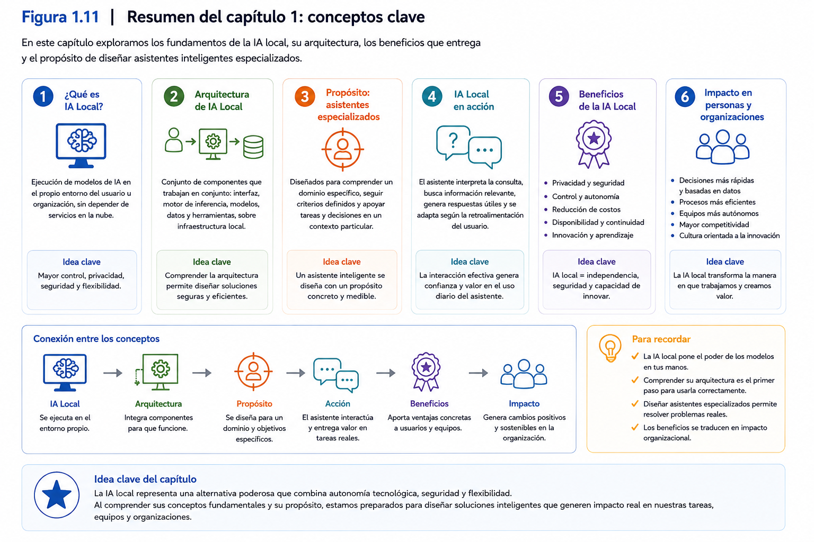
</p>

---

### Ideas clave

Al finalizar esta sección, el participante debería comprender que:

- La calidad de los resultados depende tanto del modelo como de la forma en que éste es utilizado.
- La Inteligencia Artificial constituye una herramienta de apoyo y no reemplaza el juicio profesional.
- La verificación de la información continúa siendo responsabilidad del usuario.
- La privacidad, la ética y la confidencialidad deben considerarse desde el inicio de cualquier proyecto basado en IA.
- Comprender los principios de funcionamiento resulta más importante que aprender una herramienta específica, ya que ello permitirá adaptarse a la evolución tecnológica futura.

# 8. Errores comunes

El creciente acceso a herramientas de Inteligencia Artificial Generativa ha permitido que millones de personas comiencen a utilizarlas en actividades académicas, profesionales y personales. Sin embargo, la facilidad de uso de estas tecnologías puede generar una falsa sensación de simplicidad, llevando a los usuarios a cometer errores que disminuyen la calidad de los resultados obtenidos.

Conocer estos errores desde el inicio del proceso de aprendizaje permite desarrollar una actitud más crítica frente al uso de la Inteligencia Artificial y aprovechar de mejor manera sus capacidades.

---

## Creer que la Inteligencia Artificial siempre tiene la razón

Uno de los errores más frecuentes consiste en asumir que toda respuesta generada por un modelo de Inteligencia Artificial es necesariamente correcta.

Los modelos de lenguaje producen respuestas altamente coherentes desde el punto de vista lingüístico. Sin embargo, una respuesta bien redactada no garantiza que la información sea verdadera.

En ocasiones, el modelo puede:

- incorporar información incorrecta;
- interpretar erróneamente una consulta;
- omitir antecedentes relevantes;
- presentar afirmaciones sin suficiente fundamento.

Por esta razón, las respuestas siempre deben ser revisadas y contrastadas con otras fuentes cuando sean utilizadas para apoyar decisiones importantes.

---

## Formular consultas demasiado generales

Otro error habitual consiste en realizar preguntas excesivamente amplias o ambiguas.

Por ejemplo:

> "Explícame la Inteligencia Artificial."

Esta solicitud admite múltiples interpretaciones y puede generar respuestas muy diferentes dependiendo del contexto.

Una mejor alternativa sería formular una consulta como:

> "Explica los principales beneficios de la Inteligencia Artificial Generativa para apoyar la toma de decisiones en instituciones de educación superior."

Mientras mayor sea la precisión de la consulta, más pertinente tenderá a ser la respuesta obtenida.

---

## Esperar que el modelo conozca el contexto

Los modelos de lenguaje no conocen automáticamente la realidad de cada organización.

No saben:

- cómo funciona una empresa;
- cuáles son sus procedimientos internos;
- qué reglamentos utiliza;
- cuáles son sus objetivos institucionales.

Toda esta información debe ser proporcionada explícitamente por el usuario o incorporada posteriormente al diseño del asistente inteligente.

Precisamente por esta razón el contexto constituye uno de los elementos centrales en la construcción de asistentes especializados.

---

## Utilizar la primera respuesta sin revisarla

Una respuesta generada por un modelo de Inteligencia Artificial debe entenderse como una propuesta inicial.

En muchas ocasiones es posible mejorar considerablemente el resultado mediante nuevas consultas, aclaraciones o solicitudes de mayor profundidad.

Aceptar la primera respuesta sin realizar una revisión crítica limita el potencial de estas herramientas y aumenta la probabilidad de utilizar información incompleta o imprecisa.

---

## Confundir velocidad con calidad

La Inteligencia Artificial puede generar respuestas en pocos segundos.

Sin embargo, la rapidez no debe confundirse con calidad.

Una respuesta rápida puede requerir posteriormente:

- revisión;
- complementación;
- corrección;
- validación;
- adaptación al contexto.

El verdadero beneficio no consiste únicamente en ahorrar tiempo, sino en liberar al profesional de tareas repetitivas para que pueda concentrarse en actividades de mayor valor.

---

## Pensar que el modelo reemplaza al especialista

La Inteligencia Artificial Generativa constituye una herramienta de apoyo.

No reemplaza:

- la experiencia profesional;
- el juicio crítico;
- la responsabilidad ética;
- la toma de decisiones.

Las organizaciones continúan necesitando profesionales capaces de interpretar resultados, evaluar alternativas y asumir la responsabilidad sobre las decisiones adoptadas.

---

## Elegir una herramienta sin analizar las necesidades del proyecto

Con frecuencia se selecciona una plataforma de Inteligencia Artificial únicamente porque es popular o ampliamente utilizada.

Sin embargo, antes de elegir una herramienta conviene analizar aspectos como:

- el problema que se desea resolver;
- la naturaleza de la información;
- los requisitos de privacidad;
- el nivel de personalización requerido;
- la infraestructura disponible;
- las políticas de la organización.

La elección tecnológica debe responder al contexto y no únicamente a la popularidad de una determinada aplicación.

---

## Creer que un mejor modelo resuelve todos los problemas

Es habitual pensar que utilizar un modelo más avanzado garantiza automáticamente mejores resultados.

Aunque la calidad del modelo influye en el desempeño, también son determinantes otros factores como:

- la claridad de las instrucciones;
- la calidad de la información disponible;
- la definición del contexto;
- el diseño del asistente;
- la capacidad del usuario para interpretar los resultados.

En muchos casos, un asistente bien diseñado utilizando un modelo adecuado ofrece mejores resultados que un modelo muy avanzado utilizado sin una estrategia clara.

---

## Descuidar la documentación del proyecto

Durante el desarrollo de soluciones basadas en Inteligencia Artificial es frecuente realizar múltiples ajustes.

No registrar estas modificaciones dificulta posteriormente:

- reproducir resultados;
- comprender las decisiones adoptadas;
- mejorar el asistente;
- compartir el trabajo con otros profesionales.

Por ello, la documentación constituye una práctica recomendable desde las primeras etapas del proyecto.

---

## Olvidar que la tecnología evoluciona constantemente

Las herramientas de Inteligencia Artificial cambian con gran rapidez.

Centrar el aprendizaje exclusivamente en una plataforma específica puede provocar que los conocimientos queden rápidamente desactualizados.

Por esta razón, el presente taller pone énfasis en comprender principios y metodologías antes que memorizar funciones particulares de una aplicación.

Este enfoque facilitará la adaptación a futuras generaciones de modelos y herramientas.

---

<p align="center">
  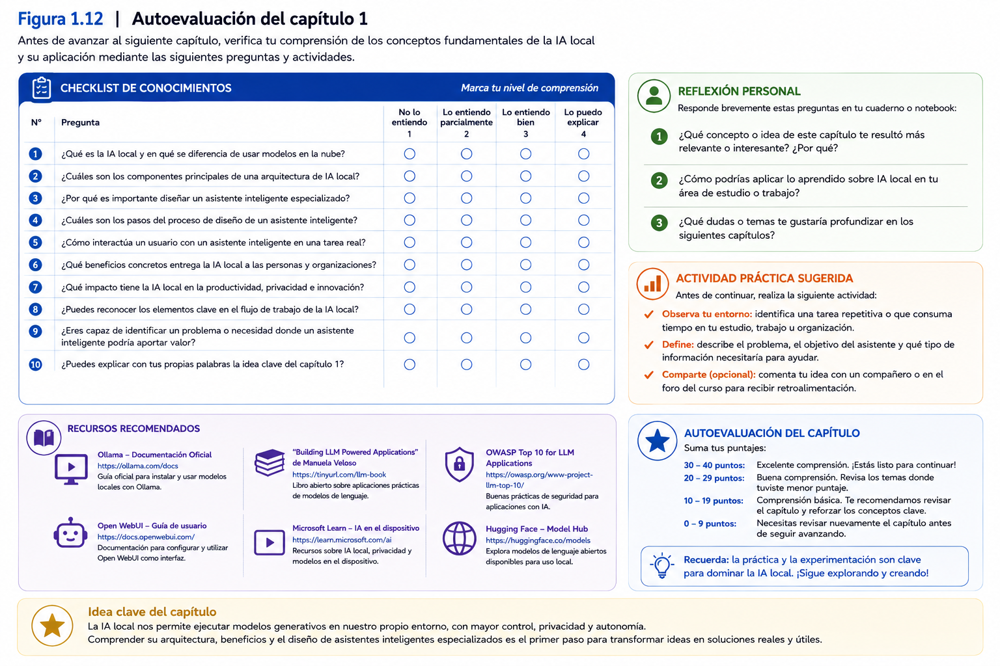
</p>

---

### Ideas clave

Al finalizar esta sección, el participante debería comprender que:

- La Inteligencia Artificial Generativa requiere un uso crítico y reflexivo.
- La calidad de los resultados depende tanto del modelo como del usuario que interactúa con él.
- El contexto, la claridad de las instrucciones y la validación de las respuestas son factores esenciales para obtener resultados confiables.
- La tecnología constituye una herramienta de apoyo y no reemplaza la responsabilidad profesional.
- Evitar estos errores permitirá aprovechar de mejor manera las capacidades de los asistentes inteligentes durante el desarrollo del Proyecto Integrador.

# 9. Relación con el Proyecto Integrador

Hasta este punto del capítulo se han presentado los principales fundamentos conceptuales que sustentan el desarrollo del taller. Se ha revisado qué es la Inteligencia Artificial, cómo ha evolucionado hasta la Inteligencia Artificial Generativa, cuál es el papel de los Modelos de Lenguaje de Gran Escala (LLM), las diferencias entre la IA en la nube y la IA local, el concepto de autonomía tecnológica y los componentes que conforman un entorno de inteligencia artificial local.

Aunque estos contenidos poseen un importante valor conceptual, su verdadero propósito consiste en proporcionar las bases necesarias para iniciar el desarrollo del Proyecto Integrador.

A partir de este capítulo, el participante comenzará a construir una solución que evolucionará progresivamente durante todo el taller hasta convertirse en un asistente inteligente especializado completamente funcional.

---

## El Proyecto Integrador como eje del aprendizaje

El Proyecto Integrador constituye la principal estrategia metodológica del taller.

Cada nuevo aprendizaje se incorpora progresivamente a la solución desarrollada por el participante.

De esta forma, el conocimiento adquirido deja de ser exclusivamente teórico y se transforma en una herramienta para resolver un problema real perteneciente a su propio contexto profesional o disciplinar.

---

## ¿Qué se espera desarrollar en esta parte del taller?

El objetivo principal no consiste en construir inmediatamente un asistente inteligente.

Antes de iniciar el diseño de cualquier solución resulta indispensable comprender con claridad el problema que se desea resolver.

Por ello, el principal producto esperado en esta parte corresponde a la **definición del problema disciplinar** que orientará todo el Proyecto Integrador.

Esta definición permitirá establecer el alcance del trabajo que será desarrollado durante los siguientes capitulos.

---

## Preguntas orientadoras

Para definir adecuadamente el Proyecto Integrador, el participante debería reflexionar sobre preguntas como las siguientes:

- ¿Qué problema de mi disciplina podría beneficiarse del apoyo de un asistente inteligente?
- ¿Qué actividades consumen una cantidad importante de tiempo?
- ¿Qué procesos requieren analizar grandes volúmenes de información?
- ¿Qué tipo de consultas se repiten con frecuencia?
- ¿Qué información utilizan habitualmente los profesionales de mi área?
- ¿Qué decisiones podrían apoyarse mediante un asistente especializado?

Responder estas preguntas permitirá seleccionar un problema cuya solución resulte pertinente, factible y alineada con los objetivos del taller.

---

## El primer entregable

Como resultado del trabajo realizado durante este capítulo, cada participante elaborará el primer avance de su Proyecto Integrador.

Este avance corresponde a la definición del problema disciplinar e incluirá, al menos, los siguientes elementos:

- nombre preliminar del proyecto;
- disciplina o área de aplicación;
- descripción del problema o necesidad identificada;
- usuarios a quienes estará dirigido el asistente;
- propósito general del asistente inteligente;
- principales tareas o consultas que deberá resolver.

Este documento servirá como base para el diseño del asistente inteligente que será desarrollado en el siguiente capítulo.

---

## Una decisión que influirá en todo el proyecto

La selección del problema constituye una de las decisiones más importantes del Proyecto Integrador.

Un problema claramente definido facilitará:

- el diseño del contexto del asistente;
- la elaboración de instrucciones precisas;
- la selección de información relevante;
- la validación de los resultados obtenidos;
- la evaluación final del proyecto.

Por el contrario, un problema demasiado amplio o poco definido dificultará el desarrollo de las etapas posteriores.

Por esta razón, el docente acompañará a los participantes en la delimitación del alcance de sus proyectos, proporcionando retroalimentación y orientaciones para asegurar su factibilidad.


---

## Más que un ejercicio académico

El Proyecto Integrador no debe entenderse como una actividad realizada únicamente para efectos de evaluación.

Su propósito consiste en que cada participante desarrolle una solución aplicable a su propio contexto profesional.

Idealmente, al finalizar el taller, el asistente inteligente construido podrá continuar evolucionando y adaptándose a nuevas necesidades de la organización, transformándose en una herramienta de apoyo para el trabajo cotidiano.

Desde esta perspectiva, el Proyecto Integrador representa una oportunidad para transferir los aprendizajes del taller hacia situaciones reales de la práctica profesional.

---

<p align="center">
  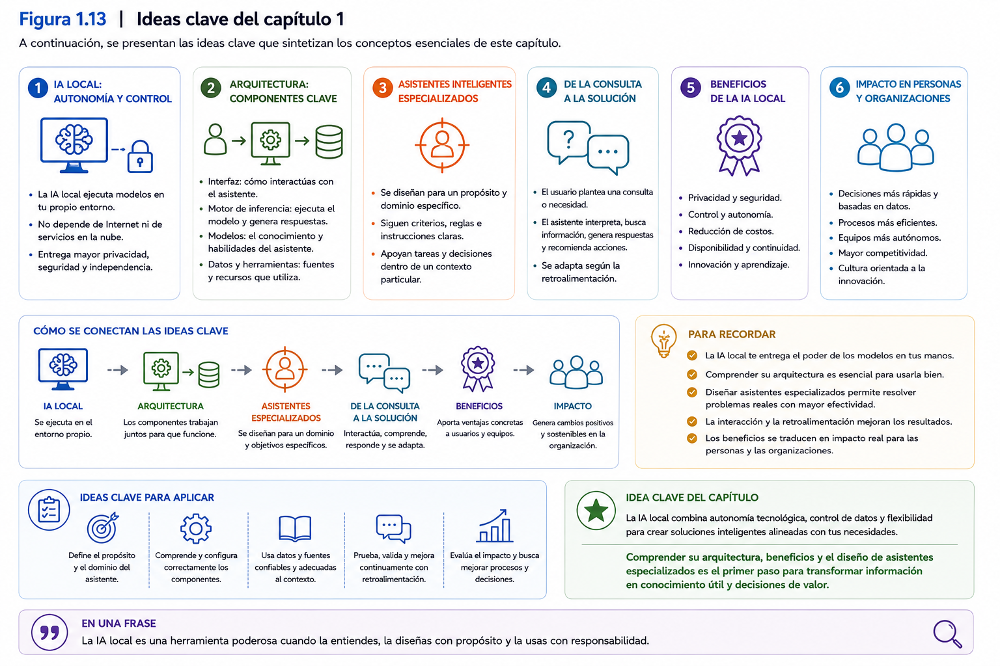
</p>

---

### Ideas clave

Al finalizar esta sección, el participante debería comprender que:

- El Proyecto Integrador constituye el eje metodológico del taller.
- Todos los contenidos desarrollados contribuyen al desarrollo progresivo de un único proyecto.
- La primera etapa consiste en definir claramente el problema disciplinar que será abordado mediante un asistente inteligente especializado.
- Una adecuada definición del problema facilitará el diseño, implementación y validación de las etapas posteriores.
- El propósito final del Proyecto Integrador es desarrollar una solución aplicable al contexto profesional del participante, más allá de cumplir con un requisito de evaluación.

# 10. Síntesis del capítulo

La Inteligencia Artificial Generativa representa uno de los avances tecnológicos más significativos de las últimas décadas. Su capacidad para comprender y generar lenguaje natural ha transformado la forma en que las personas interactúan con los sistemas informáticos, permitiendo desarrollar soluciones capaces de apoyar procesos de análisis, generación de conocimiento y toma de decisiones en una amplia variedad de disciplinas.

A lo largo de este capítulo se revisaron los principales fundamentos conceptuales que sustentan el desarrollo del presente taller.

En primer lugar, se definió la Inteligencia Artificial como un campo de conocimiento orientado al desarrollo de sistemas capaces de ejecutar tareas que tradicionalmente requieren inteligencia humana. Posteriormente, se analizó su evolución histórica, identificando el tránsito desde los sistemas basados en reglas hacia el Aprendizaje Automático (*Machine Learning*), el Aprendizaje Profundo (*Deep Learning*) y, finalmente, la Inteligencia Artificial Generativa.

También se estudió el concepto de **Modelo de Lenguaje de Gran Escala (LLM)**, identificándolo como el componente central de los asistentes inteligentes actuales. Se explicó que estos modelos generan respuestas a partir del análisis del contexto y la predicción de secuencias de palabras, permitiendo interactuar con las personas mediante lenguaje natural.

A continuación, se compararon dos estrategias para utilizar esta tecnología: la **IA en la nube** y la **IA local**. Esta comparación permitió comprender que ambas alternativas poseen ventajas y limitaciones, y que su elección debe responder a las necesidades particulares de cada organización. En este contexto, se introdujo el concepto de **autonomía tecnológica**, entendida como la capacidad para gestionar y adaptar soluciones tecnológicas manteniendo un adecuado nivel de control sobre la infraestructura, la información y los procesos.

Posteriormente, se presentó la arquitectura general de un entorno de IA local, identificando los principales componentes que permiten ejecutar un Modelo de Lenguaje de Gran Escala en infraestructura propia. Más allá de las herramientas específicas, se enfatizó la importancia de comprender el papel que desempeña cada componente dentro del sistema.

Finalmente, se introdujo el concepto de **asistente inteligente especializado**, eje central del presente taller. Se destacó que el verdadero valor de estas soluciones no depende únicamente del modelo utilizado, sino de la capacidad para definir un contexto adecuado, establecer objetivos claros y orientar el comportamiento del asistente hacia un dominio disciplinar específico.

Los ejemplos desarrollados durante el capítulo permitieron comprobar que estos principios pueden aplicarse en ámbitos tan diversos como la educación, la investigación, la salud, la ingeniería y la gestión organizacional. Asimismo, las secciones dedicadas a las buenas prácticas y a los errores comunes proporcionaron orientaciones para utilizar la Inteligencia Artificial de manera crítica, responsable y profesional.

Todos estos aprendizajes convergen en un objetivo común: proporcionar las bases necesarias para iniciar el desarrollo del Proyecto Integrador. Durante este capítulo, cada participante habrá identificado un problema perteneciente a su contexto profesional que podrá ser abordado mediante un asistente inteligente especializado.

En los siguientes capitulos, este proyecto evolucionará progresivamente. El participante aprenderá a diseñar el contexto del asistente, definir su comportamiento, validar sus respuestas, integrarlo con otras herramientas y evaluar su utilidad mediante un caso de aplicación real.

En consecuencia, este capítulo no constituye únicamente una introducción a la Inteligencia Artificial Generativa. Representa el punto de partida para comprender una nueva forma de construir soluciones tecnológicas centradas en el conocimiento, capaces de apoyar el trabajo profesional sin reemplazar el juicio crítico de las personas.

---

## En este capítulo aprendimos que...

Al finalizar este capítulo, el participante debería ser capaz de reconocer que:

- La Inteligencia Artificial Generativa es el resultado de una evolución tecnológica que combina avances en aprendizaje automático, redes neuronales y procesamiento del lenguaje natural.
- Los Modelos de Lenguaje de Gran Escala (LLM) constituyen el núcleo tecnológico de los asistentes inteligentes actuales.
- La IA puede ejecutarse tanto en la nube como en infraestructura local, dependiendo de las necesidades y restricciones de cada organización.
- La autonomía tecnológica permite seleccionar, adaptar y gestionar soluciones de Inteligencia Artificial con mayor control sobre la información y la infraestructura.
- Un asistente inteligente especializado se construye mediante la combinación de un Modelo de Lenguaje de Gran Escala con un contexto claramente definido y orientado a un dominio disciplinar específico.
- El Proyecto Integrador permitirá aplicar progresivamente todos estos conceptos a un problema real perteneciente al ámbito profesional de cada participante.

---

## Preparando el siguiente capítulo

En el próximo capítulo se abordará el diseño y configuración de asistentes inteligentes especializados.

A partir del problema disciplinar definido durante este capítulo, el participante aprenderá a construir el contexto que orientará el comportamiento del asistente, establecer su rol, definir objetivos, incorporar restricciones y elaborar las primeras instrucciones que permitirán transformar un Modelo de Lenguaje de Gran Escala en una herramienta especializada para apoyar el análisis y la toma de decisiones.

De esta manera, el conocimiento conceptual adquirido en este capítulo comenzará a transformarse en una solución funcional desarrollada por cada participante.

# 11. Preguntas para la reflexión

Las siguientes preguntas tienen como propósito promover el análisis crítico de los contenidos desarrollados en este capítulo y facilitar la conexión entre los conceptos estudiados y el contexto profesional de cada participante.

No existe una única respuesta correcta. Lo importante es fundamentar las ideas utilizando los principios revisados durante el capítulo y reflexionar sobre las oportunidades y desafíos que plantea la Inteligencia Artificial Generativa en distintos ámbitos de aplicación.

---

## Reflexión conceptual

### 1.

¿Por qué la Inteligencia Artificial Generativa representa un cambio de paradigma respecto de las generaciones anteriores de Inteligencia Artificial?

---

### 2.

¿Cuáles son las principales diferencias entre un Modelo de Lenguaje de Gran Escala (LLM) y los sistemas tradicionales basados en reglas?

---

### 3.

¿Por qué un asistente inteligente especializado puede generar respuestas más útiles que un asistente de propósito general dentro de un contexto profesional?

---

## Reflexión aplicada

### 4.

Piense en una actividad que realiza habitualmente en su trabajo o disciplina.

¿Qué tareas podrían beneficiarse del apoyo de un asistente inteligente especializado?

Fundamente su respuesta.

---

### 5.

¿Qué tipo de información necesitaría un asistente inteligente para apoyar adecuadamente esa actividad?

Considere aspectos como:

- documentos;
- procedimientos;
- reglamentos;
- bases de conocimiento;
- experiencia institucional.

---

### 6.

¿Qué ventajas y qué riesgos observa al incorporar Inteligencia Artificial Generativa en su organización?

Considere aspectos relacionados con:

- productividad;
- calidad;
- privacidad;
- seguridad;
- autonomía tecnológica.

---

## Reflexión crítica

### 7.

¿Considera que la Inteligencia Artificial podría reemplazar completamente el trabajo de un profesional de su disciplina?

Fundamente su respuesta utilizando los conceptos estudiados en este capítulo.

---

### 8.

¿Por qué la validación humana continúa siendo necesaria incluso cuando un modelo genera respuestas aparentemente correctas?

---

### 9.

¿En qué situaciones preferiría utilizar un modelo de Inteligencia Artificial ejecutado localmente en lugar de un servicio disponible en la nube?

Explique las razones de su elección.

---

## Reflexión sobre el Proyecto Integrador

### 10.

Describa brevemente el problema que desea abordar durante el Proyecto Integrador.

Explique:

- cuál es la necesidad identificada;
- quiénes serían los usuarios del asistente;
- qué beneficios espera obtener mediante su implementación.

---

### 11.

¿Qué conocimientos adquiridos durante este capítulo considera más importantes para iniciar el diseño de su asistente inteligente?

Justifique su respuesta.

---

### 12.

Si tuviera que explicar a un colega qué aprenderá durante este taller, ¿cómo describiría, en pocas palabras, el propósito del Proyecto Integrador y el valor de desarrollar un asistente inteligente especializado?

---

## Reflexión final

Antes de continuar con el siguiente capítulo, dedique algunos minutos a responder la siguiente pregunta:

> **Si pudiera desarrollar un asistente inteligente que resolviera un único problema de su contexto profesional, ¿qué problema elegiría y por qué considera que tendría un impacto significativo en su trabajo o en su organización?**

Esta reflexión servirá como punto de partida para el diseño del asistente inteligente que comenzará a desarrollar en el siguiente capítulo.

# 12. Bibliografía y recursos recomendados

Los contenidos desarrollados en este capítulo se sustentan en literatura especializada sobre Inteligencia Artificial, Aprendizaje Automático, Modelos de Lenguaje de Gran Escala y diseño de asistentes inteligentes. Las siguientes referencias constituyen una base para profundizar los conceptos presentados y comprender la evolución reciente de la Inteligencia Artificial Generativa.

---

## Bibliografía fundamental

Bishop, C. M. (2023). *Deep Learning: Foundations and Concepts*. Springer.

Goodfellow, I., Bengio, Y., & Courville, A. (2016). *Deep Learning*. MIT Press.

Mitchell, T. M. (1997). *Machine Learning*. McGraw-Hill.

Russell, S., & Norvig, P. (2021). *Artificial Intelligence: A Modern Approach* (4th ed.). Pearson.

---

## Lecturas complementarias

Bommasani, R., et al. (2021). *On the Opportunities and Risks of Foundation Models*. Stanford University.

Brown, T., et al. (2020). *Language Models are Few-Shot Learners*. Proceedings of NeurIPS.

Kaplan, J., et al. (2020). *Scaling Laws for Neural Language Models*. OpenAI.

Vaswani, A., et al. (2017). *Attention Is All You Need*. Proceedings of NeurIPS.

---

## Recursos digitales recomendados

Documentación oficial de Ollama

https://ollama.com

---

Documentación oficial de Open WebUI

https://openwebui.com

---

Documentación oficial de Hugging Face

https://huggingface.co

---

Repositorio oficial de modelos GGUF

https://huggingface.co/models

---

## Recomendación para el participante

No es necesario estudiar todas estas referencias antes de continuar con el taller.

El propósito de esta bibliografía consiste en proporcionar fuentes confiables para quienes deseen profundizar los fundamentos teóricos presentados en este capítulo.

Los siguientes capítulos retomarán progresivamente estos conceptos desde una perspectiva eminentemente práctica, orientada al diseño e implementación de asistentes inteligentes locales para el apoyo al análisis y la toma de decisiones.


