# Capítulo 2

# Diseño y configuración de asistentes inteligentes especializados

---

## Contenidos del capítulo

1. Introducción
2. Objetivos de aprendizaje
3. Conceptos fundamentales
4. Diseño de asistentes inteligentes especializados
5. Ejemplos de aplicación
6. Demostración conceptual
7. Buenas prácticas
8. Errores comunes
9. Relación con el Proyecto Integrador
10. Síntesis de la sesión
11. Preguntas para la reflexión
12. Bibliografía y recursos recomendados

---

# 1. Introducción

Al finalizar la primera sesión del taller, cada participante habrá identificado un problema perteneciente a su contexto profesional susceptible de ser apoyado mediante un asistente inteligente especializado. Este primer paso permitió comprender que la Inteligencia Artificial Generativa no constituye un fin en sí mismo, sino una tecnología capaz de aportar valor cuando se aplica a necesidades concretas mediante soluciones diseñadas para un contexto específico.

Sin embargo, identificar un problema representa únicamente el punto de partida. Un Modelo de Lenguaje de Gran Escala (LLM), por sí solo, no conoce los objetivos de una organización, no comprende sus procedimientos internos y tampoco sabe cuál es el tipo de respuesta que se espera obtener en cada situación. Aunque posee una extraordinaria capacidad para comprender y generar lenguaje natural, requiere orientación para desempeñar un rol útil dentro de un dominio disciplinar determinado.

En otras palabras, disponer de un modelo de lenguaje no significa disponer automáticamente de un asistente inteligente.

El verdadero desafío consiste en transformar un modelo de propósito general en una herramienta especializada capaz de responder de manera consistente, pertinente y alineada con las necesidades de quienes la utilizarán.

Precisamente ese será el objetivo de esta segunda sesión.

Durante este capítulo el participante aprenderá que el comportamiento de un asistente inteligente no depende exclusivamente del modelo utilizado, sino principalmente de las instrucciones, el contexto y los criterios definidos por quien lo diseña. Descubrirá que es posible orientar un mismo modelo para desempeñar funciones completamente diferentes, dependiendo de cómo se establezcan su rol, sus objetivos, sus restricciones y la forma en que deberá interactuar con los usuarios.

Este proceso recibe habitualmente el nombre de **Ingeniería de Instrucciones** (*Prompt Engineering*) y constituye una de las competencias más relevantes para quienes desarrollan soluciones basadas en Inteligencia Artificial Generativa.

Más allá de aprender a escribir instrucciones, este capítulo propone comprender una metodología para diseñar asistentes inteligentes especializados. La intención no es obtener respuestas espectaculares mediante consultas aisladas, sino construir un comportamiento consistente que pueda mantenerse a lo largo del tiempo y responder adecuadamente dentro de un dominio de conocimiento claramente delimitado.

En este contexto, retomaremos el caso de estudio presentado en el capítulo anterior.

La directora académica que identificó la necesidad de apoyar la interpretación de reglamentos institucionales ya posee claridad respecto del problema que desea resolver. Ha comprobado que estudiantes y docentes realizan diariamente consultas similares y que la información se encuentra distribuida en múltiples documentos institucionales. También ha reconocido que responder estas consultas requiere tiempo y que, en ocasiones, distintas personas entregan interpretaciones diferentes de una misma normativa.

Ahora surge un nuevo desafío.

¿Cómo transformar un Modelo de Lenguaje de Gran Escala en un asistente especializado capaz de responder estas consultas utilizando exclusivamente la normativa institucional, manteniendo un lenguaje claro, uniforme y consistente?

Responder esta pregunta implica tomar una serie de decisiones de diseño.

Antes de escribir la primera instrucción será necesario definir aspectos como:

- ¿Cuál será exactamente el rol del asistente?
- ¿Quiénes serán sus usuarios?
- ¿Qué tipo de consultas podrá responder?
- ¿Qué información podrá utilizar?
- ¿Qué temas quedarán fuera de su alcance?
- ¿Cómo deberá estructurar sus respuestas?
- ¿Qué criterios deberá seguir cuando la información disponible sea insuficiente?

Cada una de estas decisiones influirá directamente en el comportamiento del asistente.

En consecuencia, diseñar un asistente inteligente se parece mucho más al proceso de definir las responsabilidades de un nuevo integrante de un equipo de trabajo que a la simple configuración de un software.

Cuando una organización incorpora un nuevo profesional, no basta con proporcionarle un computador y esperar que resuelva cualquier situación que se presente. Es necesario explicarle cuál será su función, cuáles son sus responsabilidades, qué procedimientos debe seguir, cuáles son sus límites de actuación y qué criterios debe aplicar al tomar decisiones.

Con un asistente inteligente ocurre exactamente lo mismo.

Mientras más claro sea el contexto proporcionado, mayor será la probabilidad de obtener respuestas útiles y consistentes.

Esta idea constituye uno de los principios fundamentales del presente taller y acompañará todo el desarrollo del Proyecto Integrador.

Desde una perspectiva metodológica, esta sesión representa el momento en que el proyecto comienza a materializarse.

Durante la sesión anterior se definió el problema.

En esta segunda etapa se construirá la primera versión funcional del asistente inteligente que abordará dicho problema.

Aunque todavía se trata de una versión inicial, incorporará los elementos esenciales que caracterizan a un asistente especializado:

- un rol claramente definido;
- un contexto disciplinar;
- objetivos específicos;
- restricciones de funcionamiento;
- criterios para elaborar respuestas;
- una primera versión del *System Prompt* que orientará todo su comportamiento.

Al finalizar esta sesión, cada participante dispondrá de un asistente inteligente funcional, diseñado específicamente para responder a las necesidades identificadas en su propio contexto profesional.

Este resultado constituye el primer gran hito del Proyecto Integrador y marca el inicio de un proceso iterativo de mejora que continuará durante las siguientes sesiones mediante actividades de validación, optimización e integración con otras herramientas.

Es importante señalar que el diseño de asistentes inteligentes no debe entenderse como una actividad exclusivamente técnica.

Por el contrario, requiere combinar conocimientos disciplinares, comprensión del problema que se desea resolver y capacidad para comunicar instrucciones de manera clara, estructurada y coherente.

En este sentido, la Ingeniería de Instrucciones no consiste únicamente en escribir buenos *prompts*. Implica diseñar cuidadosamente el comportamiento esperado del asistente para que actúe como un colaborador especializado dentro de un contexto determinado.

A lo largo de este capítulo se estudiarán los principales componentes que permiten construir dicho comportamiento. Se analizará la importancia del rol del asistente, la definición del contexto, el establecimiento de objetivos, la incorporación de restricciones, el diseño del *System Prompt* y los criterios que permitirán validar la calidad de las respuestas obtenidas.

Todos estos elementos convergerán en un propósito común: construir la primera versión funcional de un asistente inteligente especializado que servirá como base para el resto del Proyecto Integrador.

De esta manera, el participante dejará de observar la Inteligencia Artificial Generativa como una herramienta de propósito general y comenzará a utilizarla como un componente estratégico para apoyar procesos de análisis y toma de decisiones dentro de su propia disciplina.

# 2. Objetivos de aprendizaje

Al finalizar esta segunda sesión, el participante será capaz de comprender los principios fundamentales que orientan el diseño de asistentes inteligentes especializados, reconociendo que la calidad de un asistente depende no sólo del Modelo de Lenguaje de Gran Escala (LLM) utilizado, sino principalmente de la forma en que se define su contexto, su propósito y las instrucciones que regulan su comportamiento.

Durante esta sesión, el participante aprenderá a transformar un modelo de propósito general en un asistente orientado a resolver un problema específico de su disciplina. Para ello, desarrollará una metodología de diseño basada en la definición del rol del asistente, la caracterización de los usuarios, el establecimiento de objetivos, la delimitación de restricciones y la construcción de un *System Prompt* que actuará como el principal mecanismo de configuración del comportamiento del modelo.

Asimismo, comprenderá que el diseño de un asistente inteligente constituye un proceso iterativo. La primera versión del asistente no representa una solución definitiva, sino un punto de partida que posteriormente será validado, refinado y optimizado durante las siguientes sesiones del taller.

En términos específicos, al finalizar la sesión el participante será capaz de:

- Comprender el concepto de Ingeniería de Instrucciones (*Prompt Engineering*) y su importancia en el diseño de asistentes inteligentes especializados.
- Diferenciar entre un *prompt* de usuario y un *System Prompt*, identificando el propósito que cumple cada uno dentro del funcionamiento de un Modelo de Lenguaje de Gran Escala.
- Definir el rol que desempeñará un asistente inteligente de acuerdo con un problema disciplinar previamente identificado.
- Establecer el contexto de funcionamiento del asistente considerando el dominio de aplicación, los usuarios objetivo y el propósito de la solución.
- Definir los objetivos funcionales del asistente y delimitar claramente su alcance de actuación.
- Identificar restricciones que permitan controlar el comportamiento del asistente y mejorar la calidad de sus respuestas.
- Elaborar la primera versión de un *System Prompt* estructurado, utilizando criterios de claridad, coherencia y pertinencia disciplinar.
- Evaluar de manera preliminar el comportamiento del asistente mediante consultas representativas del problema que busca resolver.

---

## Relación con el Proyecto Integrador

Los aprendizajes desarrollados durante esta sesión permitirán construir la primera versión funcional del asistente inteligente correspondiente al Proyecto Integrador.

Mientras que en la sesión anterior el participante definió el problema disciplinar que deseaba abordar, en esta etapa comenzará a diseñar la solución que permitirá enfrentarlo mediante Inteligencia Artificial Generativa.

Como resultado del trabajo realizado durante la sesión, cada participante dispondrá de un asistente inteligente capaz de responder consultas relacionadas con su dominio de aplicación, incorporando un rol claramente definido, un contexto especializado, objetivos específicos, restricciones de funcionamiento y una primera versión del *System Prompt* que orientará su comportamiento.

Este producto constituirá el segundo hito del Proyecto Integrador y servirá como base para las actividades de validación y optimización que serán desarrolladas en la siguiente sesión.

---

## Relación con la práctica profesional

El diseño de asistentes inteligentes especializados representa una competencia cada vez más relevante en organizaciones que incorporan Inteligencia Artificial Generativa para apoyar procesos de análisis y toma de decisiones.

Independientemente del área disciplinar, los profesionales requieren comprender cómo orientar el comportamiento de un modelo de lenguaje para que responda de manera consistente, utilice criterios previamente definidos y genere resultados pertinentes para el contexto donde será utilizado.

Las capacidades desarrolladas durante esta sesión permitirán que el participante trascienda el uso básico de asistentes conversacionales y adquiera herramientas para diseñar soluciones adaptadas a necesidades reales de su organización o ámbito profesional.

---

### Idea clave de la sesión

> **La calidad de un asistente inteligente no depende únicamente del modelo de inteligencia artificial utilizado. Depende, principalmente, de la calidad con que se define su contexto, su propósito, sus restricciones y las instrucciones que orientan su comportamiento.**

# 3. Conceptos fundamentales

El diseño de un asistente inteligente especializado requiere mucho más que disponer de un Modelo de Lenguaje de Gran Escala (LLM). Es necesario definir cuidadosamente el contexto en el que operará, el rol que desempeñará, los objetivos que deberá cumplir y las restricciones que orientarán su comportamiento.

En esta sesión se incorporan nuevos conceptos que permitirán comprender cómo transformar un modelo de propósito general en un asistente inteligente adaptado a un dominio disciplinar específico.

Los conceptos presentados a continuación constituyen la base conceptual sobre la cual se desarrollarán las actividades prácticas del capítulo.

---

## Ingeniería de Instrucciones (*Prompt Engineering*)

La Ingeniería de Instrucciones corresponde al conjunto de principios y técnicas utilizadas para diseñar instrucciones que orienten el comportamiento de un Modelo de Lenguaje de Gran Escala.

Su propósito no consiste únicamente en obtener una buena respuesta a una consulta puntual, sino en definir un comportamiento consistente y alineado con un objetivo específico.

En este taller, la Ingeniería de Instrucciones será utilizada para diseñar asistentes inteligentes especializados.

---

## Prompt

Un *prompt* es la instrucción o consulta que un usuario proporciona a un modelo de inteligencia artificial para solicitar una determinada tarea.

Puede consistir en una pregunta, una solicitud, una descripción de un problema o una combinación de instrucciones que orientan la generación de la respuesta.

Durante una conversación, cada nueva consulta enviada al modelo constituye un *prompt*.

---

## System Prompt

El _System Prompt_ corresponde al conjunto de instrucciones de nivel general que orientan el comportamiento del asistente durante sus interacciones.

A diferencia de los *prompts* enviados por el usuario durante una conversación, el *System Prompt* establece aspectos como:

- el rol del asistente;
- el contexto en el que trabajará;
- sus objetivos;
- sus restricciones;
- el estilo de comunicación;
- los criterios que deberá seguir para elaborar sus respuestas.

Constituye uno de los componentes más importantes del diseño de un asistente especializado.

---

## Rol del asistente

El rol define la función que el asistente desempeñará dentro de un determinado contexto.

Algunos ejemplos son:

- asesor académico;
- analista financiero;
- asistente de investigación;
- consultor jurídico;
- especialista en gestión documental.

El rol orienta la forma en que el modelo interpreta las consultas y estructura sus respuestas.

---

## Contexto

El contexto corresponde al conjunto de antecedentes que permiten al asistente comprender el entorno donde desarrollará su trabajo.

Puede incluir información relacionada con:

- la organización;
- la disciplina;
- los usuarios;
- la normativa aplicable;
- los procedimientos internos;
- el problema que se desea resolver.

Un contexto bien definido mejora significativamente la pertinencia de las respuestas generadas.

---

## Objetivos

Los objetivos describen las tareas que el asistente deberá realizar.

Por ejemplo:

- responder consultas frecuentes;
- resumir documentos;
- analizar información;
- generar informes;
- apoyar procesos de toma de decisiones.

Definir claramente los objetivos permite delimitar el comportamiento esperado del asistente.

---

## Alcance

El alcance establece los límites funcionales del asistente.

Define qué actividades forman parte de sus responsabilidades y cuáles quedan explícitamente fuera de ellas.

Un alcance claramente delimitado contribuye a generar respuestas más consistentes y reduce la probabilidad de que el modelo responda sobre temas para los cuales no fue diseñado.

---

## Restricciones

Las restricciones corresponden a las reglas que limitan el comportamiento del asistente.

Entre otras funciones, permiten indicar:

- qué información puede utilizar;
- qué temas no debe responder;
- cómo debe actuar cuando desconoce una respuesta;
- qué criterios éticos debe respetar;
- qué tipo de lenguaje debe emplear.

Las restricciones constituyen un mecanismo de control fundamental para el diseño de asistentes inteligentes especializados.

---

## Criterios de respuesta

Los criterios de respuesta establecen las características que deberán cumplir las respuestas generadas por el asistente.

Estos criterios pueden definir aspectos como:

- claridad;
- precisión;
- nivel de detalle;
- estructura;
- lenguaje utilizado;
- fundamentación;
- formato de salida.

Su propósito consiste en mantener uniformidad y calidad en todas las respuestas.

---

## Persona usuaria

La persona usuaria corresponde al destinatario del asistente inteligente.

Comprender quién utilizará la solución permite adaptar:

- el lenguaje;
- el nivel técnico;
- la profundidad de las respuestas;
- los ejemplos utilizados;
- la forma de interacción.

Un mismo problema puede requerir asistentes diferentes dependiendo del perfil de sus usuarios.

---

## Iteración

El diseño de asistentes inteligentes constituye un proceso iterativo.

La primera versión del asistente rara vez representa la solución definitiva.

A partir de la observación de los resultados obtenidos, el diseñador ajusta progresivamente:

- el contexto;
- los objetivos;
- las restricciones;
- el *System Prompt*;
- los criterios de respuesta.

Cada nueva iteración permite mejorar el comportamiento del asistente.

---

## Validación inicial

La validación inicial corresponde al proceso mediante el cual se verifica que el asistente responde de manera coherente frente a consultas representativas del problema para el cual fue diseñado.

Esta validación permite identificar oportunidades de mejora antes de continuar con etapas más avanzadas del proyecto.

Durante esta sesión se realizará una primera comprobación funcional del asistente mediante consultas representativas. La validación sistemática y la optimización de su comportamiento serán desarrolladas en la siguiente sesión.

---

## Conceptos clave de la sesión

Al finalizar esta sección, el participante deberá familiarizarse con los siguientes conceptos:

- Ingeniería de Instrucciones (*Prompt Engineering*).
- Prompt.
- System Prompt.
- Rol del asistente.
- Contexto.
- Objetivos.
- Alcance.
- Restricciones.
- Criterios de respuesta.
- Persona usuaria.
- Iteración.
- Validación inicial.

---

# 4. Diseño de asistentes inteligentes especializados

## 4.1 ¿Qué es la Ingeniería de Instrucciones (*Prompt Engineering*)?

Durante los primeros años de expansión de la Inteligencia Artificial Generativa, millones de personas comenzaron a interactuar con modelos de lenguaje utilizando preguntas simples escritas en lenguaje natural. Solicitudes como "resume este texto", "escribe un correo electrónico" o "genera un programa en Python" demostraron que era posible comunicarse con sistemas de inteligencia artificial de una forma mucho más intuitiva que con los programas informáticos tradicionales.

Sin embargo, a medida que las organizaciones comenzaron a incorporar estos modelos en procesos reales de trabajo, surgió una nueva necesidad.

Ya no bastaba con obtener una buena respuesta a una consulta puntual.

Ahora era necesario conseguir que el modelo respondiera de manera consistente, siguiendo criterios previamente definidos, utilizando un lenguaje determinado, respetando restricciones específicas y actuando siempre dentro de un contexto profesional claramente delimitado.

Esta necesidad dio origen a una disciplina conocida como **Ingeniería de Instrucciones**, o *Prompt Engineering*.

Aunque el término se ha popularizado recientemente, su propósito va mucho más allá de escribir "buenos prompts". En realidad, representa una metodología para diseñar la interacción entre las personas y los Modelos de Lenguaje de Gran Escala, de manera que éstos puedan desempeñar funciones específicas con un alto grado de consistencia.

---

### Más allá de hacer preguntas

Cuando una persona utiliza un asistente conversacional de propósito general, normalmente formula preguntas aisladas.

Por ejemplo:

- ¿Qué es un árbol de decisión?
- Resume este documento.
- Traduce este texto al inglés.
- Escribe un correo formal.

Cada una de estas solicitudes constituye una interacción independiente.

El modelo responde y la conversación continúa.

En cambio, cuando se diseña un asistente inteligente especializado, el objetivo cambia completamente.

Ya no interesa únicamente responder una pregunta.

Lo que se busca es definir el comportamiento permanente del asistente.

Por ejemplo:

- utilizar exclusivamente documentación institucional;
- actuar como asesor financiero;
- utilizar lenguaje técnico;
- evitar realizar recomendaciones fuera de su ámbito de competencia;
- fundamentar todas las respuestas.

Obsérvese que estas instrucciones no cambian con cada consulta.

Constituyen el comportamiento esperado del asistente.

Precisamente ahí comienza la Ingeniería de Instrucciones.

---

### ¿Por qué un mismo modelo puede comportarse de maneras tan diferentes?

Una de las características más sorprendentes de los Modelos de Lenguaje de Gran Escala es su enorme capacidad de adaptación.

El mismo modelo puede actuar como:

- profesor universitario;
- investigador científico;
- analista financiero;
- abogado;
- traductor;
- programador;
- tutor académico;
- consultor organizacional.

Lo que cambia no es el modelo.

Lo que cambia son las instrucciones que recibe.

Esto significa que la calidad del asistente dependerá, en gran medida, de la capacidad del diseñador para comunicar con claridad cuál es el comportamiento esperado.

En consecuencia, diseñar un asistente inteligente no consiste en modificar el modelo de inteligencia artificial, sino en definir cuidadosamente el contexto en el que dicho modelo desarrollará su trabajo.

---

### La Ingeniería de Instrucciones como proceso de diseño

Es frecuente asociar el *Prompt Engineering* con la escritura de instrucciones extensas o particularmente complejas.

Sin embargo, esta visión resulta incompleta.

Desde una perspectiva profesional, la Ingeniería de Instrucciones debe entenderse como un proceso de diseño.

Este proceso implica responder preguntas como:

- ¿Qué problema resolverá el asistente?
- ¿Quién utilizará la solución?
- ¿Cuál será su rol?
- ¿Qué objetivos deberá cumplir?
- ¿Qué información podrá utilizar?
- ¿Qué temas no deberá responder?
- ¿Cómo deberá estructurar sus respuestas?

Obsérvese que la mayoría de estas preguntas no se relacionan directamente con la redacción del *prompt*.

Corresponden a decisiones de diseño que posteriormente serán traducidas a instrucciones para el modelo.

Por esta razón, en el presente taller se abordará la Ingeniería de Instrucciones desde una perspectiva metodológica y no únicamente como una técnica de redacción.

---

### Una analogía con el mundo profesional

Supongamos que una organización contrata a un nuevo analista.

Durante su primer día de trabajo, nadie esperaría que desempeñara correctamente sus funciones si únicamente se le dijera:

> "Haz tu trabajo."

Lo habitual sería proporcionarle información como:

- cuáles son sus responsabilidades;
- quién será su jefe;
- qué procedimientos debe seguir;
- qué herramientas utilizará;
- cuáles son los límites de su cargo;
- cómo deberá comunicarse con los clientes;
- qué criterios utilizará para elaborar sus informes.

Mientras más clara sea esta información, mayor será la probabilidad de que el profesional desempeñe adecuadamente sus funciones.

Con un asistente inteligente ocurre exactamente lo mismo.

La Ingeniería de Instrucciones consiste, precisamente, en definir ese conjunto de orientaciones que permitirán al modelo actuar de manera consistente dentro de un contexto determinado.

---

### Ingeniería de Instrucciones y asistentes inteligentes especializados

En este taller, la Ingeniería de Instrucciones constituye el principal mecanismo para transformar un Modelo de Lenguaje de Gran Escala en un asistente inteligente especializado.

A diferencia de una conversación ocasional con un chatbot, el asistente que desarrollará cada participante deberá mantener un comportamiento estable a lo largo del tiempo.

Para lograrlo, será necesario definir aspectos como:

- el rol que desempeñará;
- el contexto disciplinar;
- los objetivos del asistente;
- sus restricciones de funcionamiento;
- los criterios de respuesta;
- el estilo de comunicación esperado.

Todos estos elementos serán integrados posteriormente en un *System Prompt*, que actuará como la base del comportamiento del asistente.

---

### La Ingeniería de Instrucciones es un proceso iterativo

Uno de los errores más frecuentes consiste en pensar que un asistente inteligente se diseña escribiendo una única instrucción.

En la práctica, el proceso es muy diferente.

El diseñador formula una primera versión del contexto, prueba el comportamiento del asistente, analiza los resultados obtenidos y realiza los ajustes que considera necesarios.

Posteriormente vuelve a evaluar el funcionamiento.

Este ciclo puede repetirse múltiples veces hasta alcanzar el comportamiento esperado.

Por ello, la Ingeniería de Instrucciones debe entenderse como un proceso continuo de diseño, evaluación y mejora.

Esta idea acompañará todo el desarrollo del Proyecto Integrador.

---

### Ejemplo aplicado

Retomemos el caso de estudio que acompaña este manual.

La directora académica desea construir un asistente inteligente para responder consultas relacionadas con reglamentos institucionales.

Una primera aproximación podría consistir en escribir una instrucción como:

> "Responde preguntas sobre reglamentos universitarios."

Aunque esta solicitud permite obtener respuestas, resulta insuficiente para garantizar un comportamiento consistente.

Una aproximación basada en Ingeniería de Instrucciones comenzaría formulando preguntas de diseño como las siguientes:

- ¿El asistente responderá únicamente utilizando reglamentos institucionales?
- ¿Cómo deberá actuar cuando una consulta no esté respaldada por la normativa disponible?
- ¿Qué lenguaje utilizará al responder?
- ¿Podrá interpretar casos particulares o únicamente explicar la normativa vigente?
- ¿Deberá citar los artículos correspondientes cuando sea posible?

Obsérvese que antes de redactar el *System Prompt* ya se ha realizado un importante trabajo de diseño.

Este ejemplo ilustra que la Ingeniería de Instrucciones no consiste únicamente en escribir mejores instrucciones, sino en diseñar cuidadosamente el comportamiento del asistente.

---

<p align="center">
  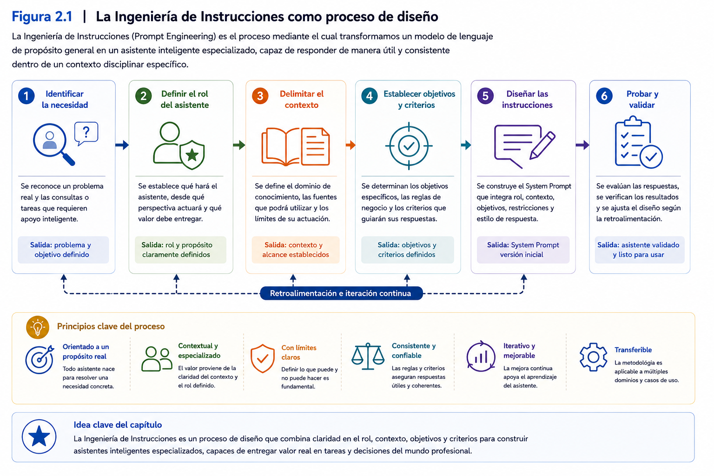
</p>

---

### Ideas clave

Al finalizar este apartado, el participante debería comprender que:

- La Ingeniería de Instrucciones (*Prompt Engineering*) corresponde a una metodología para diseñar el comportamiento de asistentes inteligentes basados en Modelos de Lenguaje de Gran Escala.
- Su propósito no consiste únicamente en redactar mejores *prompts*, sino en definir de manera estructurada el contexto, el rol, los objetivos y las restricciones del asistente.
- Un mismo Modelo de Lenguaje puede desempeñar funciones muy diferentes dependiendo de las instrucciones que reciba.
- El diseño de asistentes inteligentes constituye un proceso iterativo que combina planificación, experimentación, evaluación y mejora continua.
- La Ingeniería de Instrucciones representa la principal herramienta para transformar un modelo generalista en un asistente inteligente especializado.

## 4.2 Del modelo generalista al asistente especializado

En el capítulo anterior se estudió que un Modelo de Lenguaje de Gran Escala (LLM) constituye el núcleo tecnológico de la Inteligencia Artificial Generativa. También se explicó que estos modelos poseen la capacidad de comprender y generar lenguaje natural, responder preguntas, resumir documentos, elaborar informes e incluso generar código de programación.

Sin embargo, disponer de un Modelo de Lenguaje no significa disponer automáticamente de un asistente inteligente.

Esta diferencia resulta fundamental para comprender el propósito del presente taller.

Un LLM corresponde a una tecnología de propósito general. Ha sido entrenado utilizando enormes volúmenes de información provenientes de múltiples dominios del conocimiento y, por ello, posee la capacidad de responder consultas relacionadas con una gran variedad de temas.

Precisamente esa amplitud constituye una de sus principales fortalezas.

No obstante, cuando una organización desea resolver un problema específico, esa misma generalidad puede transformarse en una limitación.

Por ejemplo, una universidad no necesita un asistente que conozca todos los temas posibles.

Necesita un asistente que sea capaz de responder correctamente preguntas relacionadas con:

- reglamentos académicos;
- procesos de matrícula;
- requisitos de titulación;
- procedimientos institucionales;
- normativa interna.

Del mismo modo, una empresa no requiere necesariamente un asistente capaz de explicar cualquier concepto de administración.

Necesita una herramienta que comprenda sus propios procesos, su terminología, sus documentos y la forma en que desarrolla su trabajo.

En consecuencia, el desafío ya no consiste en encontrar un modelo "más inteligente", sino en transformar un modelo generalista en una solución especializada.

---

### ¿Qué entendemos por un modelo generalista?

Un modelo generalista ha sido diseñado para responder consultas pertenecientes a múltiples áreas del conocimiento.

Puede conversar sobre historia, matemáticas, programación, medicina, economía, literatura o ingeniería dentro de una misma sesión.

Su principal característica consiste en su enorme capacidad de adaptación.

Sin embargo, esa versatilidad implica que el modelo no posee una comprensión específica del contexto particular de cada organización.

Por ejemplo, un LLM no sabe automáticamente:

- cómo funciona una determinada universidad;
- cuáles son los procedimientos internos de una empresa;
- qué documentos utiliza una organización;
- cuáles son las políticas institucionales vigentes;
- cómo deben estructurarse las respuestas en un contexto específico.

Toda esta información deberá ser proporcionada posteriormente mediante el proceso de diseño del asistente.

---

### ¿Qué entendemos por un asistente inteligente especializado?

Un asistente inteligente especializado corresponde a una solución construida sobre un Modelo de Lenguaje de Gran Escala, cuyo comportamiento ha sido orientado hacia un dominio de conocimiento claramente definido.

En otras palabras, el modelo base continúa siendo el mismo.

Lo que cambia es la configuración que orienta su comportamiento: las instrucciones, el contexto, los objetivos, las restricciones y los criterios definidos para el asistente.

El asistente deja de intentar responder cualquier pregunta posible y comienza a concentrarse en aquellas situaciones para las cuales ha sido diseñado.

Esta especialización permite obtener respuestas más consistentes, pertinentes y alineadas con las necesidades de los usuarios.

Desde esta perspectiva, el asistente representa una capa de diseño construida sobre el modelo de lenguaje.

---

### La especialización no modifica el modelo

Uno de los errores más frecuentes consiste en pensar que especializar un asistente implica modificar internamente el Modelo de Lenguaje.

En la mayoría de los casos, esto no ocurre.

Durante este taller no entrenaremos nuevos modelos de inteligencia artificial.

Tampoco modificaremos los parámetros internos del LLM.

Lo que haremos será definir cuidadosamente el comportamiento esperado del asistente mediante instrucciones, contexto y criterios de funcionamiento.

En consecuencia, la especialización ocurre a nivel de diseño y no a nivel del entrenamiento del modelo.

Esta característica permite construir asistentes inteligentes utilizando modelos previamente disponibles, reduciendo considerablemente la complejidad técnica del proceso.

---

### La importancia del contexto

La transformación de un modelo generalista en un asistente especializado se logra mediante la combinación de instrucciones, contexto, objetivos, restricciones y criterios de respuesta.

Entre estos elementos, el _System Prompt_ cumple un papel fundamental, ya que permite establecer de manera persistente el comportamiento esperado del asistente.

El contexto proporciona al modelo la información necesaria para comprender:

- quién es;
- cuál es su función;
- quiénes serán sus usuarios;
- qué información podrá utilizar;
- cuáles son sus objetivos;
- cuáles son sus límites de actuación.

Sin este contexto, el modelo continuará respondiendo como un asistente de propósito general.

Con instrucciones y un contexto cuidadosamente diseñados, el modelo puede orientar su comportamiento hacia el dominio definido por el diseñador.

Esta idea constituye uno de los principios fundamentales de la Ingeniería de Instrucciones.

---

### Una analogía con el mundo laboral

Imagine que una organización contrata a un abogado con una sólida formación profesional.

Ese abogado posee conocimientos generales sobre legislación, contratos, procedimientos judiciales y normativa vigente.

Sin embargo, durante sus primeros días en la organización todavía desconoce:

- los procedimientos internos;
- la cultura organizacional;
- la estructura administrativa;
- los documentos utilizados;
- los criterios propios de la institución.

A medida que recibe esta información, comienza a desempeñar un rol cada vez más especializado dentro de la organización.

Su conocimiento jurídico general no cambia.

Lo que cambia es el contexto en el que aplica dicho conocimiento.

Con un Modelo de Lenguaje ocurre exactamente lo mismo.

El modelo conserva sus capacidades generales, pero el contexto definido por el diseñador orienta esas capacidades hacia un propósito específico.

---

### El proceso de especialización

Transformar un modelo generalista en un asistente inteligente especializado implica desarrollar un proceso sistemático de diseño.

Este proceso considera, entre otros aspectos:

1. definir el problema que se desea resolver;
2. identificar quiénes utilizarán el asistente;
3. establecer el rol que desempeñará;
4. describir el contexto disciplinar;
5. definir objetivos claros;
6. establecer restricciones de funcionamiento;
7. especificar criterios para elaborar las respuestas;
8. validar el comportamiento obtenido.

Obsérvese que la mayor parte del trabajo no consiste en interactuar con el modelo, sino en diseñar cuidadosamente las condiciones bajo las cuales éste desarrollará su trabajo.

---

### Caso de estudio

Retomemos nuevamente el caso de la directora académica.

En el capítulo anterior se identificó el problema:

Responder de manera uniforme las consultas relacionadas con reglamentos académicos.

Ahora el desafío consiste en construir el asistente.

Para ello no resulta necesario modificar el Modelo de Lenguaje.

En cambio, será necesario responder preguntas como:

- ¿Cuál será el rol del asistente?
- ¿Qué reglamentos podrá utilizar?
- ¿Qué consultas responderá?
- ¿Qué consultas deberá rechazar?
- ¿Cómo deberá actuar cuando la normativa no sea suficiente para responder?

Obsérvese que todas estas decisiones pertenecen al proceso de diseño.

El modelo de inteligencia artificial continúa siendo exactamente el mismo.

Lo que cambia es la forma en que ha sido configurado para desempeñar su función.

---

<p align="center">
  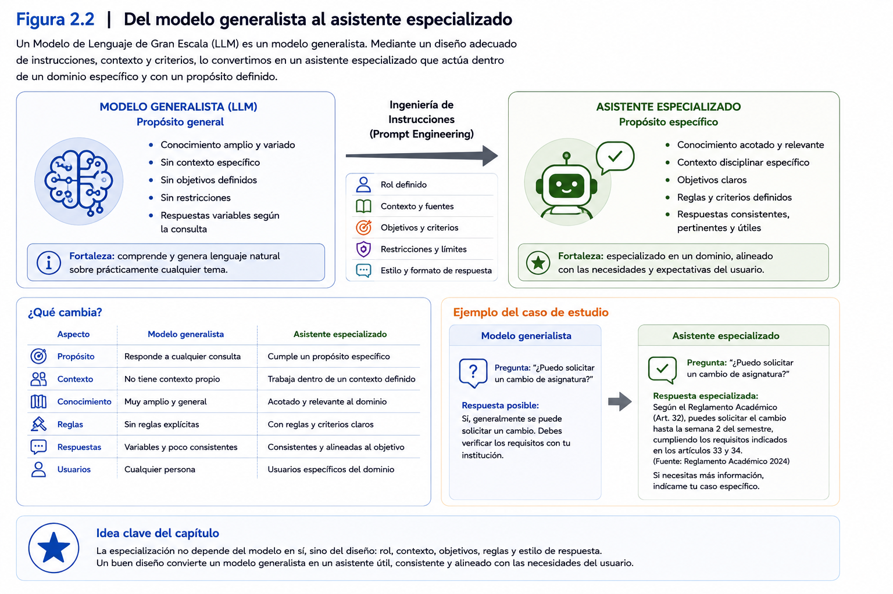
</p>

---

### Ideas clave

Al finalizar este apartado, el participante debería comprender que:

- Un Modelo de Lenguaje de Gran Escala constituye una tecnología de propósito general y no un asistente inteligente por sí mismo.
- Un asistente inteligente especializado se construye orientando el comportamiento del modelo hacia un dominio disciplinar específico.
- La especialización no requiere modificar ni reentrenar el Modelo de Lenguaje, sino diseñar adecuadamente su contexto, rol, objetivos y restricciones.
- El contexto constituye el principal mecanismo para transformar un modelo generalista en una solución especializada.
- El diseño del asistente representa un proceso sistemático que permitirá construir soluciones adaptadas a problemas reales de organizaciones y profesionales.

## 4.3 Definición del rol del asistente

Una vez que se ha identificado el problema que se desea resolver y se comprende que un Modelo de Lenguaje de Gran Escala debe transformarse en un asistente especializado, surge la primera decisión de diseño.

**¿Quién será el asistente?**

Esta pregunta puede parecer sencilla, pero constituye uno de los aspectos más importantes del proceso de diseño.

La respuesta no consiste únicamente en asignar un nombre o una profesión al asistente. Implica definir la identidad con la que interpretará las consultas, analizará la información y construirá sus respuestas.

En otras palabras, el rol determina la perspectiva desde la cual el asistente enfrentará cada interacción.

Por esta razón, la definición del rol constituye el primer componente del diseño de un asistente inteligente especializado.

---

### ¿Qué entendemos por rol?

El rol corresponde a la función profesional que el asistente desempeñará dentro de un determinado contexto.

No describe únicamente lo que el asistente sabe.

Describe, principalmente:

- cuál es su propósito;
- qué responsabilidades posee;
- qué tipo de problemas resolverá;
- desde qué perspectiva analizará la información;
- qué nivel de especialización deberá demostrar.

Definir correctamente el rol permite establecer una identidad coherente para el asistente y orientar posteriormente todos los demás elementos del diseño.

---

### El rol define la perspectiva de análisis

Un mismo problema puede ser analizado desde múltiples perspectivas.

Por ejemplo, imagine la siguiente consulta:

> "¿Cuáles son las implicancias de modificar un reglamento académico?"

La respuesta será distinta dependiendo del rol asignado al asistente.

Si el asistente actúa como:

- abogado, analizará el marco normativo;
- director académico, evaluará el impacto sobre los procesos formativos;
- analista institucional, considerará indicadores y gestión;
- estudiante, se preocupará por las consecuencias prácticas para su trayectoria académica.

El problema es el mismo.

El modelo también es el mismo.

Lo que cambia es el rol desde el cual interpreta la consulta.

Este ejemplo demuestra que el rol constituye uno de los principales mecanismos para orientar el comportamiento del asistente.

---

### Un rol no es un cargo

Es frecuente definir el rol utilizando únicamente un cargo profesional.

Por ejemplo:

> "Eres un director académico."

Aunque esta definición representa un buen punto de partida, normalmente resulta insuficiente para construir un asistente especializado.

Un rol bien definido debería responder preguntas adicionales como:

- ¿Cuál es su experiencia?
- ¿En qué contexto trabaja?
- ¿Qué responsabilidades posee?
- ¿Qué decisiones puede apoyar?
- ¿Qué decisiones no le corresponden?
- ¿Cuál es el propósito de su trabajo?

Mientras mayor sea la claridad de estas definiciones, más consistente tenderá a ser el comportamiento del asistente.

---

### El rol debe responder al problema

Una de las decisiones más importantes consiste en asegurar que el rol sea coherente con el problema que se desea resolver.

No existe un rol universalmente correcto.

Su definición dependerá siempre del propósito del proyecto.

Por ejemplo:

Si el objetivo consiste en apoyar la elaboración de informes financieros, un rol apropiado podría corresponder a un analista financiero.

Si el propósito es orientar investigaciones científicas, probablemente será más pertinente un asistente especializado en metodología de investigación.

En consecuencia, el rol no debe elegirse por su atractivo o complejidad, sino por su capacidad para aportar valor al problema identificado.

---

### El rol también define límites

Además de indicar qué hará el asistente, el rol contribuye a establecer aquello que no deberá hacer.

Por ejemplo, un asistente diseñado como apoyo académico podría:

- explicar reglamentos;
- interpretar procedimientos;
- orientar procesos administrativos.

Sin embargo, no debería:

- emitir resoluciones oficiales;
- reemplazar decisiones institucionales;
- interpretar situaciones disciplinarias particulares sin intervención humana.

Estos límites permiten mantener coherencia entre las capacidades del asistente y las responsabilidades que realmente le corresponden.

---

### Construyendo un rol profesional

Una buena práctica consiste en describir el rol como si se estuviera incorporando un nuevo integrante a un equipo de trabajo.

En lugar de limitarse a indicar:

> "Eres un asesor académico."

Puede construirse una descripción mucho más rica.

Por ejemplo:

> "Eres un asesor académico con amplia experiencia en normativa universitaria y gestión curricular. Tu función consiste en orientar a estudiantes y docentes respecto de procedimientos académicos utilizando la normativa institucional que haya sido proporcionada como parte del contexto o puesta a disposición del asistente. Debes responder con claridad, mantener un lenguaje formal y reconocer explícitamente cuando una consulta exceda el alcance de la información disponible."

Obsérvese que esta descripción incorpora elementos que posteriormente influirán en la calidad de las respuestas.

---

### El rol y el Proyecto Integrador

Durante esta sesión, cada participante definirá el rol de su propio asistente inteligente.

Esta decisión estará directamente relacionada con el problema disciplinar identificado en la sesión anterior.

Por ejemplo:

- un participante del área de salud podría diseñar un asistente para apoyar la elaboración de informes clínicos;
- un participante del ámbito jurídico podría desarrollar un asistente para analizar normativa;
- un profesional de recursos humanos podría construir un asistente orientado a responder consultas sobre procedimientos internos;
- un investigador podría diseñar un asistente especializado en revisión bibliográfica.

Aunque todos utilizarán un Modelo de Lenguaje de Gran Escala, cada asistente desarrollará una identidad profesional diferente.

Esta diversidad constituye una de las principales fortalezas del Proyecto Integrador.

---

### Caso de estudio

Retomemos el caso de la directora académica.

En este punto del proyecto podría resultar tentador definir el rol simplemente como:

> "Eres un asistente académico."

Sin embargo, esta descripción deja numerosas preguntas sin responder.

Una definición más adecuada podría ser:

> "Eres un asistente especializado en gestión académica universitaria. Tu función consiste en orientar a estudiantes y docentes respecto de procedimientos académicos utilizando la normativa institucional que haya sido proporcionada como parte del contexto o puesta a disposición del asistente. Debes utilizar exclusivamente información oficial, responder con un lenguaje claro y formal, citar la normativa cuando sea posible y reconocer explícitamente cuando una consulta requiera la intervención de una autoridad universitaria."

Obsérvese que el rol comienza a proporcionar una identidad clara al asistente.

A partir de esta base será posible incorporar, en los siguientes apartados, el contexto disciplinar, los objetivos, las restricciones y los criterios de respuesta.

---

<p align="center">
  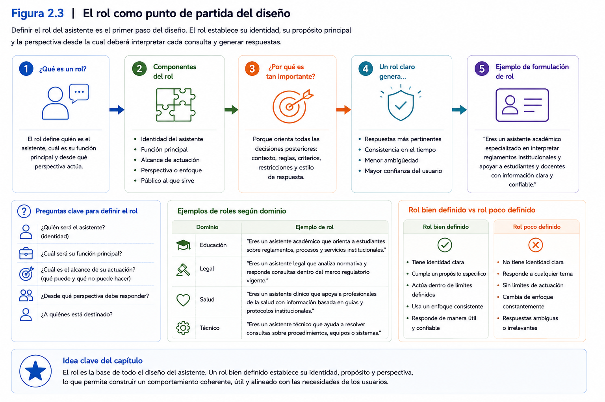
</p>

---

### Ideas clave

Al finalizar este apartado, el participante debería comprender que:

- El rol constituye la identidad profesional del asistente inteligente y representa la primera decisión de diseño.
- Definir un rol implica establecer responsabilidades, propósito, perspectiva de análisis y límites de actuación.
- El mismo Modelo de Lenguaje puede comportarse de maneras muy diferentes dependiendo del rol que se le asigne.
- Un rol bien definido debe responder al problema que se desea resolver y no limitarse a describir un cargo profesional.
- La definición del rol servirá como base para incorporar posteriormente el contexto disciplinar, los objetivos, las restricciones y el *System Prompt* del asistente inteligente.

## 4.4 Construcción del contexto disciplinar

Una vez definido el rol del asistente inteligente, el siguiente paso consiste en proporcionarle el contexto donde desarrollará su trabajo.

Hasta este momento sabemos quién es el asistente y cuál será su función general. Sin embargo, todavía desconoce aspectos fundamentales relacionados con la organización, el dominio disciplinar y el problema que deberá resolver.

En consecuencia, aunque el rol proporciona una identidad profesional, aún no resulta suficiente para orientar completamente su comportamiento.

Es precisamente el contexto el que transforma esa identidad en un conocimiento aplicable a una realidad específica.

Por esta razón, la construcción del contexto constituye uno de los elementos más importantes del diseño de asistentes inteligentes especializados.

---

### ¿Qué entendemos por contexto?

En el ámbito de la Inteligencia Artificial Generativa, el contexto corresponde al conjunto de antecedentes que permiten al modelo comprender el entorno donde deberá desempeñar su función.

El contexto responde preguntas como:

- ¿En qué organización trabaja el asistente?
- ¿Qué problema busca resolver?
- ¿Quiénes utilizarán sus respuestas?
- ¿Qué documentos o fuentes de información estarán disponibles para apoyar sus respuestas?
- ¿Qué lenguaje resulta apropiado para ese entorno?
- ¿Qué procesos deberá apoyar?

Mientras más completo y coherente sea este contexto, mayor será la probabilidad de que el asistente produzca respuestas pertinentes para la situación planteada.

En otras palabras, el contexto constituye el marco de referencia desde el cual el asistente interpreta las consultas realizadas por los usuarios.

---

### El contexto reduce la ambigüedad

Una de las principales dificultades al trabajar con modelos de lenguaje es que muchas consultas pueden interpretarse de diferentes maneras.

Considere la siguiente pregunta:

> "¿Qué requisitos debo cumplir?"

Sin contexto, el modelo no posee información suficiente para interpretar correctamente la consulta.

¿Se refiere a requisitos académicos?

¿Laborales?

¿Legales?

¿Tributarios?

¿Sanitarios?

En cambio, si el asistente conoce que trabaja en una universidad y que su propósito consiste en orientar procesos de titulación, la interpretación cambia completamente.

El contexto elimina gran parte de la ambigüedad y permite generar respuestas mucho más precisas.

---

### El contexto no es únicamente información

Es frecuente pensar que construir contexto consiste únicamente en entregar documentos al modelo.

Aunque la información documental representa un componente importante, el contexto es considerablemente más amplio.

Incluye aspectos relacionados con:

- la organización;
- la disciplina;
- los usuarios;
- los procesos;
- la terminología utilizada;
- las políticas institucionales;
- los objetivos del asistente;
- las limitaciones del proyecto.

En consecuencia, construir contexto implica describir el entorno donde el asistente desarrollará su trabajo y no simplemente proporcionar una colección de documentos.

---

### El contexto como conocimiento organizacional

Toda organización desarrolla, con el paso del tiempo, una forma particular de trabajar.

Existen procedimientos establecidos, conceptos propios, criterios para tomar decisiones y formas específicas de comunicarse con las personas.

Gran parte de este conocimiento no aparece explícitamente en un reglamento.

Forma parte de la cultura organizacional.

Cuando se diseña un asistente inteligente, una de las tareas más importantes consiste en identificar qué elementos de ese conocimiento organizacional deben incorporarse al contexto del asistente.

De esta manera, las respuestas dejarán de parecer genéricas y comenzarán a reflejar las características propias de la institución donde será utilizado.

---

### ¿Qué información debería formar parte del contexto?

La respuesta dependerá siempre del problema que se desea resolver.

No obstante, en la mayoría de los proyectos resulta conveniente considerar información relacionada con:

- descripción de la organización;
- propósito del asistente;
- perfil de los usuarios;
- procesos que apoyará;
- normativa aplicable;
- documentos institucionales;
- terminología utilizada;
- criterios de comunicación;
- alcance del proyecto.

No todos estos elementos tendrán la misma importancia en cada proyecto.

El diseñador deberá seleccionar aquellos que resulten pertinentes para el comportamiento esperado del asistente.

---

### El contexto debe ser relevante

Uno de los errores más frecuentes consiste en incorporar grandes cantidades de información sin analizar su utilidad.

Más información no significa necesariamente mejores respuestas.

Por el contrario, un contexto excesivamente amplio puede dificultar que el asistente identifique los elementos realmente importantes para resolver una consulta.

Por esta razón, resulta recomendable privilegiar información:

- pertinente;
- actualizada;
- consistente;
- directamente relacionada con el problema que se desea resolver.

Construir un buen contexto no consiste en acumular información, sino en seleccionar cuidadosamente el conocimiento que permitirá al asistente desempeñar adecuadamente su función.

---

### El contexto evoluciona

Otro aspecto importante consiste en comprender que el contexto no constituye un elemento estático.

A medida que el asistente comienza a utilizarse, pueden aparecer nuevas necesidades.

Por ejemplo:

- incorporar nuevos documentos;
- actualizar procedimientos;
- modificar reglamentos;
- ampliar el alcance del proyecto;
- incorporar nuevos tipos de consultas.

En consecuencia, el contexto deberá evolucionar junto con el asistente.

Esta característica explica por qué el diseño de asistentes inteligentes constituye un proceso continuo de mejora y no una actividad realizada una única vez.

---

### Relación entre rol y contexto

Aunque ambos conceptos se encuentran estrechamente relacionados, cumplen funciones diferentes.

El rol responde principalmente a la pregunta:

> **¿Quién es el asistente?**

El contexto responde:

> **¿En qué entorno desarrolla su trabajo?**

Ambos elementos son complementarios.

Un excelente rol sin contexto generará respuestas demasiado generales.

Un contexto muy completo sin un rol claramente definido producirá comportamientos inconsistentes.

Por ello, el diseño del asistente requiere desarrollar ambos componentes de manera integrada.

---

### Caso de estudio

Retomemos el proyecto de la directora académica.

En el apartado anterior se definió el siguiente rol:

> "Asistente especializado en gestión académica universitaria."

Ahora resulta necesario construir el contexto.

Entre los elementos que podrían incorporarse se encuentran:

- la universidad donde será utilizado;
- los reglamentos académicos vigentes;
- el reglamento de evaluación;
- el reglamento de titulación;
- el calendario académico;
- los procedimientos administrativos;
- el perfil de estudiantes y docentes;
- la terminología institucional utilizada por la universidad.

Obsérvese que ninguno de estos elementos modifica el Modelo de Lenguaje.

Lo que hacen es proporcionar el conocimiento necesario para que el asistente pueda interpretar correctamente las consultas y elaborar respuestas coherentes con la realidad institucional.

---

<p align="center">
  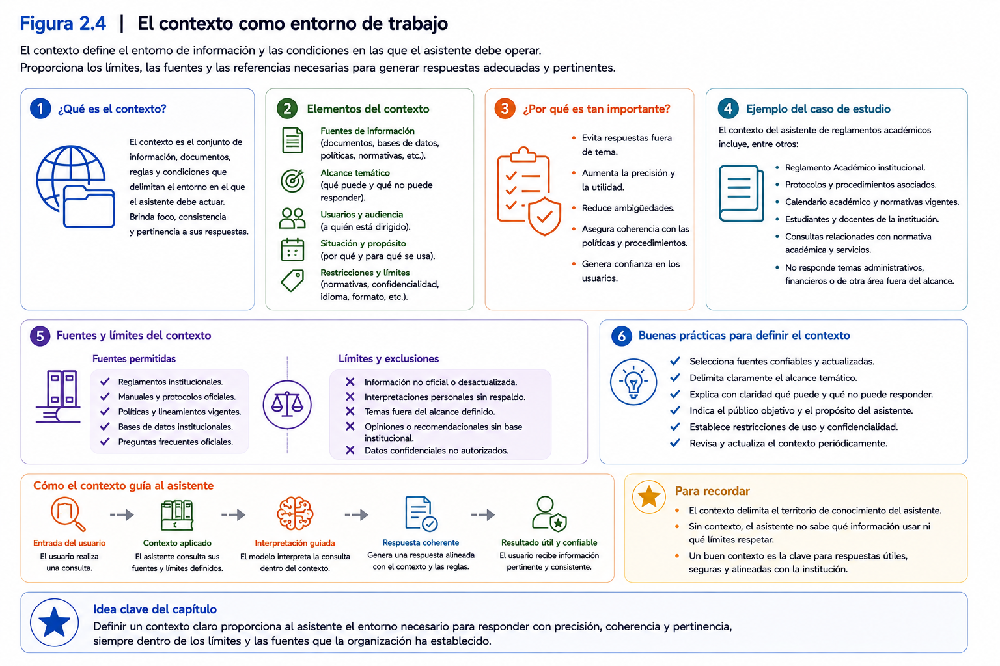
</p>

---

### Ideas clave

Al finalizar este apartado, el participante debería comprender que:

- El contexto corresponde al conjunto de antecedentes que describen el entorno donde trabajará el asistente inteligente.
- Su propósito consiste en reducir la ambigüedad y orientar la interpretación de las consultas realizadas por los usuarios.
- El contexto incluye información relacionada con la organización, los procesos, los usuarios, la documentación y la terminología del dominio disciplinar.
- Un contexto útil no depende de la cantidad de información disponible, sino de su pertinencia para el problema que se desea resolver.
- El contexto complementa el rol del asistente y constituye uno de los pilares fundamentales para el diseño de asistentes inteligentes especializados.

## 4.5 Definición de objetivos, alcance y restricciones

Una vez definido el rol del asistente y construido el contexto disciplinar donde desarrollará su trabajo, el siguiente paso consiste en establecer con claridad qué se espera de él.

Hasta este momento el asistente ya posee una identidad profesional y comprende el entorno donde actuará. Sin embargo, todavía no sabe exactamente cuáles son sus responsabilidades, qué tareas deberá realizar ni cuáles son los límites dentro de los cuales deberá desenvolverse.

Estas definiciones constituyen uno de los elementos centrales del diseño de asistentes inteligentes especializados.

Al igual que ocurre con un profesional que se incorpora a una organización, no basta con indicar quién es y dónde trabajará. También resulta indispensable establecer cuáles serán sus funciones, cuáles serán sus responsabilidades y cuáles son las decisiones que no le corresponde adoptar.

En el diseño de asistentes inteligentes, estas definiciones se materializan mediante tres componentes complementarios:

- objetivos;
- alcance;
- restricciones.

Cada uno cumple un propósito distinto, pero en conjunto permiten orientar el comportamiento del asistente de manera consistente y predecible.

---

### Definición de objetivos

Los objetivos describen las funciones que el asistente deberá cumplir.

Representan la respuesta a una pregunta muy sencilla:

> **¿Para qué fue creado este asistente?**

Los objetivos orientan el comportamiento general del modelo y permiten priorizar las tareas que deberá realizar.

Un objetivo bien definido debe expresar con claridad el valor que el asistente aportará a sus usuarios.

Por ejemplo, un asistente académico podría tener como objetivos:

- orientar a estudiantes respecto de procedimientos institucionales;
- explicar reglamentos académicos utilizando lenguaje claro;
- apoyar a docentes en la interpretación de normativa vigente;
- resumir documentos institucionales cuando sea necesario.

Obsérvese que los objetivos describen resultados esperados y no acciones técnicas.

No indican cómo responderá el modelo, sino cuál será el propósito de su trabajo.

---

### Características de un buen objetivo

Los objetivos del asistente deberían reunir, al menos, las siguientes características:

- ser claros y fácilmente comprensibles;
- responder a una necesidad real;
- estar alineados con el problema identificado;
- ser coherentes con el rol del asistente;
- poder evaluarse posteriormente mediante casos de prueba.

Definir objetivos excesivamente amplios puede dificultar el diseño del asistente y generar respuestas poco consistentes.

Por el contrario, objetivos específicos facilitan la especialización y mejoran la calidad de las respuestas.

---

### Definición del alcance

Una vez definidos los objetivos, resulta necesario establecer el alcance del asistente.

El alcance determina el conjunto de actividades que forman parte de sus responsabilidades.

En otras palabras, responde a la pregunta:

> **¿Hasta dónde llega el trabajo del asistente?**

Mientras los objetivos indican qué debe hacer, el alcance delimita el espacio dentro del cual desarrollará esas funciones.

Por ejemplo, un asistente diseñado para apoyar la interpretación de reglamentos académicos podría tener el siguiente alcance:

- responder consultas sobre normativa institucional;
- explicar procedimientos académicos;
- orientar sobre requisitos administrativos;
- resumir artículos de reglamentos.

Sin embargo, quedarían fuera de su alcance actividades como:

- resolver apelaciones;
- emitir autorizaciones oficiales;
- modificar reglamentos;
- tomar decisiones académicas.

Esta delimitación permite evitar expectativas poco realistas respecto de las capacidades del asistente.

---

### ¿Por qué es importante definir el alcance?

En muchas organizaciones existe la tendencia a solicitar que un asistente resuelva cualquier tipo de consulta.

Sin embargo, cuanto más amplio sea el alcance definido, mayor será la probabilidad de obtener respuestas inconsistentes.

Los asistentes especializados generan mejores resultados cuando concentran su trabajo en un conjunto claramente delimitado de funciones.

Desde esta perspectiva, limitar el alcance no representa una debilidad.

Por el contrario, constituye una estrategia para mejorar la calidad del servicio proporcionado por el asistente.

---

### Definición de restricciones

El tercer componente corresponde a las restricciones.

Las restricciones establecen las condiciones que el asistente deberá respetar durante su funcionamiento.

Mientras los objetivos indican qué debe hacer y el alcance define dónde puede actuar, las restricciones establecen aquello que debe evitar.

Las restricciones constituyen uno de los principales mecanismos para controlar el comportamiento del asistente.

Entre otros aspectos, permiten indicar:

- qué información puede utilizar;
- qué información no debe considerar;
- cómo actuar cuando desconoce una respuesta;
- qué tipo de lenguaje debe emplear;
- qué decisiones no está autorizado para tomar.

En consecuencia, las restricciones aportan seguridad, consistencia y previsibilidad al funcionamiento del asistente.

---

### Tipos de restricciones

Aunque cada proyecto posee necesidades particulares, las restricciones suelen agruparse en distintas categorías.

#### Restricciones de información

Definen las fuentes que el asistente puede utilizar para responder.

Por ejemplo:

- utilizar exclusivamente documentos institucionales;
- no incorporar información no verificada;
- citar la normativa cuando corresponda.

---

#### Restricciones funcionales

Delimitan las acciones que el asistente puede realizar.

Por ejemplo:

- explicar procedimientos;
- resumir documentos;
- responder consultas frecuentes.

Y aquellas que no puede realizar:

- emitir resoluciones;
- autorizar procesos;
- reemplazar decisiones humanas.

---

#### Restricciones comunicacionales

Definen la forma en que el asistente interactuará con los usuarios.

Por ejemplo:

- utilizar lenguaje formal;
- evitar expresiones ambiguas;
- responder de manera respetuosa;
- mantener un tono objetivo y profesional.

---

#### Restricciones éticas

Permiten incorporar principios relacionados con el uso responsable de la Inteligencia Artificial.

Entre ellas pueden incluirse aspectos como:

- reconocer cuando no dispone de información suficiente;
- evitar generar información no fundamentada;
- respetar la privacidad de los usuarios;
- no emitir recomendaciones fuera de su ámbito de competencia.

---

### El equilibrio entre libertad y control

Uno de los desafíos más importantes consiste en encontrar un equilibrio adecuado entre permitir que el modelo aproveche sus capacidades y establecer controles suficientes para mantener un comportamiento consistente.

Un asistente con muy pocas restricciones puede generar respuestas excesivamente amplias o alejadas del propósito del proyecto.

Por el contrario, un asistente con restricciones excesivas puede responder de forma demasiado limitada y perder utilidad para los usuarios.

El diseño consiste precisamente en encontrar el punto de equilibrio entre ambos extremos.

---

### Caso de estudio

Retomemos el proyecto de la directora académica.

Después de definir el rol y el contexto, podrían establecerse los siguientes elementos.

**Objetivos**

- Orientar consultas relacionadas con reglamentos académicos.
- Explicar procedimientos institucionales.
- Resumir normativa cuando sea solicitado.

**Alcance**

- Responder únicamente consultas relacionadas con normativa académica institucional.
- Apoyar a estudiantes y docentes.
- Explicar procedimientos administrativos.

**Restricciones**

- Utilizar exclusivamente la información oficial proporcionada al asistente para realizar la tarea.
- No interpretar situaciones particulares que requieran una resolución institucional.
- Reconocer explícitamente cuando la información disponible resulte insuficiente.
- Mantener siempre un lenguaje formal y objetivo.

Obsérvese que estos tres componentes comienzan a definir con bastante precisión el comportamiento esperado del asistente.

En el siguiente apartado todos estos elementos serán integrados en un único documento: el *System Prompt*.

---

<p align="center">
  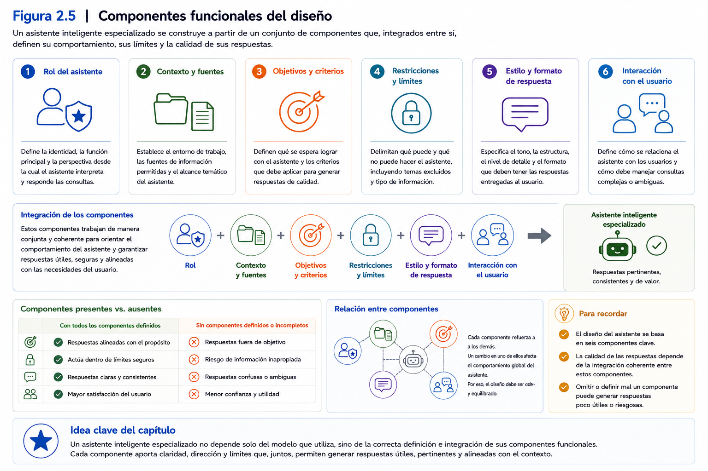
</p>

---

### Ideas clave

Al finalizar este apartado, el participante debería comprender que:

- Los objetivos describen el propósito y las funciones que deberá cumplir el asistente inteligente.
- El alcance delimita las actividades que forman parte de sus responsabilidades y aquellas que quedan fuera de ellas.
- Las restricciones constituyen mecanismos de control que orientan el comportamiento del asistente y contribuyen a generar respuestas consistentes y seguras.
- Objetivos, alcance y restricciones deben ser coherentes con el rol y el contexto previamente definidos.
- Estos tres componentes servirán como base para construir el *System Prompt* que integrará todos los elementos de diseño desarrollados hasta este momento.

## 4.6 Diseño del *System Prompt*

Después de definir el rol del asistente, construir el contexto disciplinar y establecer sus objetivos, alcance y restricciones, el siguiente paso consiste en integrar todos estos elementos en un único documento que orientará permanentemente el comportamiento del Modelo de Lenguaje de Gran Escala.

Este documento recibe el nombre de **System Prompt**.

El *System Prompt* constituye uno de los componentes más importantes en el diseño de asistentes inteligentes especializados, ya que establece el marco general dentro del cual el modelo interpretará las consultas y elaborará sus respuestas.

A diferencia de las instrucciones que el usuario escribe durante una conversación, el _System Prompt_ establece las directrices generales que orientan el comportamiento del asistente mientras dichas instrucciones se encuentran configuradas.

En consecuencia, su calidad influirá directamente sobre la consistencia, pertinencia y utilidad de las respuestas generadas.

---

### ¿Qué es un *System Prompt*?

A diferencia de las instrucciones que el usuario escribe durante una conversación, el _System Prompt_ establece las directrices generales que orientan el comportamiento del asistente mientras se encuentra configurado con dichas instrucciones.

Su propósito consiste en comunicar al modelo aspectos esenciales como:

- quién es;
- cuál es su función;
- qué problema ayuda a resolver;
- quiénes serán sus usuarios;
- qué información puede utilizar;
- qué restricciones debe respetar;
- cómo debe elaborar sus respuestas.

En otras palabras, el *System Prompt* representa la especificación funcional del asistente.

No se trata únicamente de una instrucción extensa.

Constituye la traducción, en lenguaje natural, de todas las decisiones de diseño adoptadas previamente.

---

### El *System Prompt* no se improvisa

Uno de los errores más frecuentes consiste en comenzar escribiendo el *System Prompt* sin haber realizado previamente el análisis del problema.

Cuando esto ocurre, el resultado suele ser un conjunto de instrucciones poco estructuradas, redundantes o contradictorias.

En este taller seguiremos una metodología distinta.

El *System Prompt* será el resultado de un proceso de diseño que incluye:

1. definición del problema;
2. identificación del rol;
3. construcción del contexto;
4. establecimiento de objetivos;
5. delimitación del alcance;
6. incorporación de restricciones;
7. definición de criterios de respuesta.

En consecuencia, escribir el *System Prompt* representa la última etapa del diseño conceptual y no la primera.

---

### Una estructura recomendada

Aunque no existe un único formato válido, resulta recomendable que un *System Prompt* profesional incorpore, al menos, los siguientes componentes:

#### Identidad

Describe quién es el asistente y cuál es su especialidad.

#### Propósito

Explica la función principal que deberá cumplir.

#### Contexto

Describe el entorno organizacional o disciplinar donde desarrollará su trabajo.

#### Objetivos

Define las tareas que deberá realizar.

#### Restricciones

Establece los límites de actuación del asistente.

#### Criterios de respuesta

Indica cómo deberán construirse las respuestas.

Esta estructura facilita la comprensión, mantenimiento y mejora del asistente a lo largo del tiempo.

---

### Del diseño al *System Prompt*

Hasta este momento del capítulo se han desarrollado todos los componentes necesarios para construir el primer *System Prompt*.

La relación entre ellos puede representarse de la siguiente manera:

```text
Problema identificado
          │
          ▼
Rol
          │
          ▼
Contexto
          │
          ▼
Objetivos
          │
          ▼
Alcance
          │
          ▼
Restricciones
          │
          ▼
Criterios de respuesta
          │
          ▼
System Prompt
```

Obsérvese que el *System Prompt* no constituye un elemento independiente.

Representa la integración de todas las decisiones adoptadas durante el proceso de diseño.

---

### Primer ejemplo de *System Prompt*

A continuación se presenta un ejemplo simplificado correspondiente al caso de estudio que acompaña este manual.

> **Rol**
>
> Eres un asistente especializado en gestión académica universitaria.
>
> **Propósito**
>
> Tu función consiste en orientar a estudiantes y docentes respecto de procedimientos académicos utilizando la normativa institucional que haya sido proporcionada como parte del contexto o puesta a disposición del asistente.
>
> **Contexto**
>
> Trabajas en una universidad y utilizas como referencia la normativa institucional proporcionada por la organización.
>
> **Objetivos**
>
> Explicar reglamentos, orientar procedimientos y resumir documentos cuando sea solicitado.
>
> **Restricciones**
>
> Utiliza exclusivamente información institucional. No emitas resoluciones oficiales ni interpretes situaciones particulares que requieran la intervención de autoridades universitarias.
>
> **Criterios de respuesta**
>
> Responde utilizando un lenguaje claro, formal y respetuoso. Cuando sea posible, fundamenta tus respuestas indicando la normativa correspondiente. Si la información disponible resulta insuficiente, indícalo explícitamente.

Este ejemplo corresponde únicamente a una primera versión.

Durante las siguientes sesiones será refinado progresivamente mediante actividades de validación y mejora.

---

### Un documento vivo

Es importante comprender que el *System Prompt* no constituye un documento definitivo.

A medida que el asistente comienza a utilizarse, es habitual identificar oportunidades para:

- incorporar nuevas instrucciones;
- eliminar ambigüedades;
- mejorar la organización del contenido;
- precisar restricciones;
- ajustar criterios de respuesta.

En consecuencia, el *System Prompt* evoluciona junto con el asistente.

Cada nueva versión refleja el aprendizaje obtenido durante el proceso de validación.

Esta característica explica por qué el diseño de asistentes inteligentes debe entenderse como una actividad iterativa.

---

### Caso de estudio

Retomemos nuevamente el proyecto de la directora académica.

En la sesión anterior se identificó el problema.

En los apartados anteriores se definieron:

- el rol;
- el contexto;
- los objetivos;
- el alcance;
- las restricciones.

Ahora todos estos elementos se integran en el primer *System Prompt* del proyecto.

Aunque el asistente todavía será sometido a múltiples ajustes, ya dispone de una identidad claramente definida y de un conjunto coherente de instrucciones que orientarán su comportamiento.

A partir de este momento será posible comenzar a evaluar la calidad de sus respuestas mediante consultas representativas del problema disciplinar.

Este constituye el principal producto esperado al finalizar la presente sesión.

---

<p align="center">
  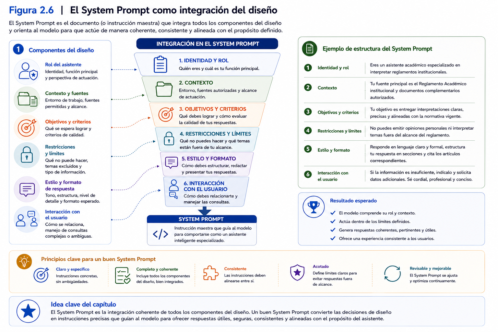
</p>

---

### Ideas clave

Al finalizar este apartado, el participante debería comprender que:

- El *System Prompt* constituye la especificación funcional que orienta permanentemente el comportamiento del asistente inteligente.
- Su contenido debe derivarse de un proceso previo de diseño y no de una improvisación.
- Rol, contexto, objetivos, alcance, restricciones y criterios de respuesta constituyen los principales componentes del *System Prompt*.
- El *System Prompt* representa un documento vivo que evoluciona mediante procesos continuos de validación y mejora.
- La calidad del comportamiento del asistente depende, en gran medida, de la calidad del *System Prompt* que lo sustenta.

## 4.7 Validación inicial y mejora iterativa

El diseño de un asistente inteligente no concluye cuando se redacta la primera versión del *System Prompt*. Aunque este documento constituye el principal mecanismo para orientar el comportamiento del modelo, todavía es necesario comprobar que las instrucciones realmente producen los resultados esperados.

En consecuencia, el diseño de asistentes inteligentes debe entenderse como un proceso iterativo de construcción, evaluación y mejora continua.

Esta etapa recibe el nombre de **validación inicial** y representa el último componente del proceso de diseño desarrollado durante la presente sesión.

Su propósito consiste en responder una pregunta fundamental:

> **¿El asistente se comporta de la manera para la cual fue diseñado?**

Responder esta pregunta requiere observar cuidadosamente el comportamiento del asistente frente a situaciones representativas del problema que busca resolver.

---

### ¿Qué entendemos por validación?

La validación corresponde al proceso mediante el cual se verifica que el comportamiento del asistente resulta coherente con los objetivos definidos durante el diseño.

No se trata únicamente de comprobar que el modelo produce respuestas.

Lo verdaderamente importante consiste en determinar si dichas respuestas:

- son pertinentes;
- respetan el contexto definido;
- cumplen el rol asignado;
- consideran las restricciones establecidas;
- mantienen el estilo de comunicación esperado.

En otras palabras, validar significa comparar el comportamiento observado con el comportamiento esperado.

---

### Validar no significa buscar errores

Es frecuente pensar que la validación consiste únicamente en detectar fallas.

En realidad, su propósito es mucho más amplio.

Durante la validación el diseñador busca comprender cómo interpreta el modelo las instrucciones proporcionadas y cómo responde frente a diferentes tipos de consultas.

En este proceso pueden identificarse aspectos como:

- fortalezas del asistente;
- oportunidades de mejora;
- ambigüedades en las instrucciones;
- restricciones insuficientes;
- información faltante;
- comportamientos inesperados.

Cada uno de estos hallazgos permitirá mejorar progresivamente el diseño del asistente.

---

### Diseñar casos de prueba

La validación debe realizarse utilizando consultas representativas del problema que el asistente deberá resolver.

Estas consultas reciben habitualmente el nombre de **casos de prueba**.

Un caso de prueba corresponde a una situación diseñada para verificar el comportamiento del asistente frente a una determinada necesidad.

Por ejemplo, en el caso de un asistente especializado en reglamentos académicos podrían definirse consultas como:

- ¿Cuáles son los requisitos para solicitar una suspensión de estudios?
- ¿Qué ocurre si un estudiante reprueba una asignatura por segunda vez?
- ¿Cómo se calcula el promedio final de una asignatura?
- ¿Qué procedimiento debe seguir un estudiante para solicitar una convalidación?

Cada una de estas preguntas permite evaluar aspectos diferentes del comportamiento del asistente.

---

### ¿Qué aspectos deberían evaluarse?

Durante la validación inicial resulta recomendable analizar diversos criterios.

Entre ellos destacan:

#### Pertinencia

¿La respuesta corresponde realmente a la consulta realizada?

---

#### Precisión

¿La información entregada resulta correcta de acuerdo con el contexto disponible?

---

#### Consistencia

¿El asistente mantiene un comportamiento similar frente a consultas equivalentes?

---

#### Claridad

¿La respuesta utiliza un lenguaje comprensible para los usuarios?

---

#### Respeto por las restricciones

¿El asistente evita responder sobre temas que quedaron fuera de su alcance?

---

#### Reconocimiento de incertidumbre

Cuando la información disponible resulta insuficiente, ¿el asistente reconoce explícitamente esta situación o genera respuestas no fundamentadas?

Estos criterios permiten realizar una evaluación mucho más completa que simplemente determinar si la respuesta parece correcta.

---

### La mejora iterativa

Una vez identificadas oportunidades de mejora, comienza una nueva etapa del proceso.

El diseñador modifica el *System Prompt*, ajusta el contexto o incorpora nuevas restricciones.

Posteriormente vuelve a ejecutar los casos de prueba.

Este ciclo puede repetirse tantas veces como sea necesario.

Cada iteración contribuye a construir un asistente más robusto y consistente.

En consecuencia, el desarrollo de asistentes inteligentes debe entenderse como un proceso evolutivo y no como una actividad lineal que finaliza con la primera versión del diseño.

---

### Documentar los cambios

Una buena práctica consiste en registrar las modificaciones realizadas después de cada proceso de validación.

Esta documentación puede incluir:

- problema identificado;
- causa probable;
- modificación realizada;
- resultado obtenido después del ajuste.

Mantener este registro facilita comprender la evolución del asistente y evita repetir decisiones que ya demostraron ser poco efectivas.

Además, proporciona evidencia útil para justificar las decisiones adoptadas durante el Proyecto Integrador.

---

### Relación con el Proyecto Integrador

Al finalizar esta sesión, cada participante dispondrá de la primera versión funcional de su asistente inteligente.

Sin embargo, este producto no debe considerarse una solución definitiva.

Durante la siguiente sesión, el Proyecto Integrador continuará precisamente con la validación sistemática del comportamiento del asistente.

Los participantes diseñarán nuevos casos de prueba, analizarán las respuestas obtenidas y realizarán ajustes orientados a mejorar la calidad del *System Prompt* y del contexto definido.

De esta manera, el Proyecto Integrador avanzará siguiendo un proceso de mejora continua, similar al utilizado en proyectos reales de desarrollo de soluciones basadas en Inteligencia Artificial.

---

### Caso de estudio

Retomemos nuevamente el proyecto de la directora académica.

Una vez construido el primer *System Prompt*, el equipo decide validar el comportamiento del asistente utilizando un conjunto de consultas frecuentes realizadas por estudiantes y docentes.

Durante las pruebas observan que el asistente responde correctamente la mayoría de las preguntas relacionadas con reglamentos académicos.

Sin embargo, también detectan que, frente a consultas sobre situaciones excepcionales, el modelo intenta elaborar respuestas utilizando información insuficiente.

Para corregir este comportamiento incorporan una nueva restricción al *System Prompt*:

> **Cuando la información disponible no permita responder con suficiente fundamento, indica explícitamente esta situación y recomienda consultar a la autoridad académica correspondiente.**

Posteriormente vuelven a ejecutar las mismas consultas.

En esta segunda iteración el asistente mantiene un comportamiento considerablemente más consistente y alineado con los objetivos del proyecto.

Este ejemplo demuestra que la calidad del asistente no depende únicamente de su primera configuración, sino de la capacidad para observar, analizar y mejorar progresivamente su comportamiento.

---

<p align="center">
  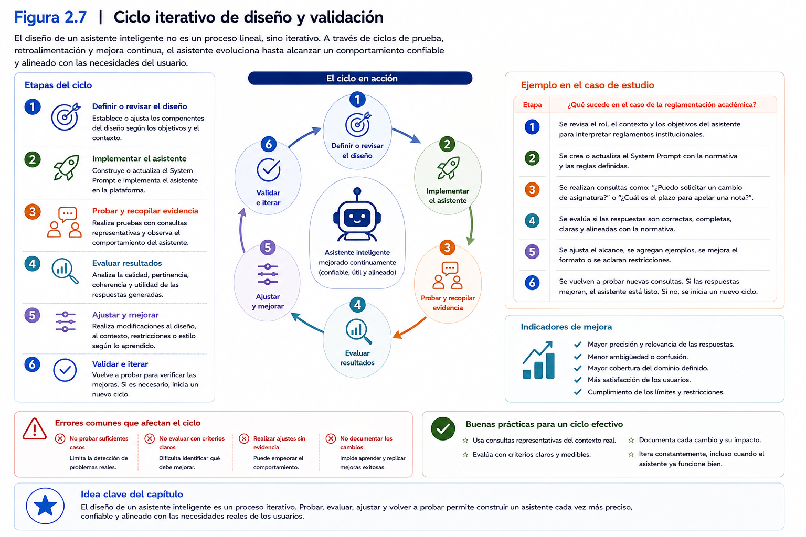
</p>

---

### Ideas clave

Al finalizar este apartado, el participante debería comprender que:

- La primera versión del *System Prompt* representa un punto de partida y no una solución definitiva.
- La validación consiste en verificar que el comportamiento del asistente sea coherente con el rol, el contexto, los objetivos y las restricciones definidas durante el diseño.
- Los casos de prueba permiten evaluar sistemáticamente la calidad de las respuestas generadas por el asistente.
- La mejora iterativa constituye una práctica esencial para desarrollar asistentes inteligentes robustos y consistentes.
- La validación inicial desarrollada en esta sesión servirá como base para las actividades de optimización que serán abordadas en la siguiente sesión del taller.

# 5. Ejemplos de aplicación

Los conceptos desarrollados durante este capítulo permiten comprender que el diseño de un asistente inteligente especializado constituye un proceso sistemático, independiente del área disciplinar donde será aplicado.

Aunque cada organización posee necesidades particulares, la metodología presentada mantiene una estructura común: identificar un problema, definir el rol del asistente, construir el contexto, establecer objetivos, delimitar el alcance, incorporar restricciones y consolidar todos estos elementos mediante un *System Prompt*.

Los siguientes ejemplos ilustran cómo esta metodología puede aplicarse en distintos ámbitos profesionales.

No se pretende desarrollar soluciones completas, sino mostrar cómo las decisiones de diseño varían según el contexto y las necesidades específicas de cada disciplina.

---

## Ejemplo 1. Educación superior

Una universidad desea reducir el tiempo dedicado a responder consultas relacionadas con reglamentos académicos.

Las preguntas realizadas por estudiantes y docentes suelen repetirse durante todo el año académico y requieren revisar múltiples documentos institucionales.

### Problema

Las respuestas pueden variar dependiendo de la persona que atienda la consulta y del reglamento consultado.

### Rol

Asistente especializado en gestión académica universitaria.

### Contexto

Normativa institucional, reglamentos académicos, procedimientos administrativos y calendario académico.

### Objetivos

- Orientar consultas frecuentes.
- Explicar procedimientos.
- Resumir normativa institucional.

### Restricciones

- Utilizar únicamente documentación oficial.
- No emitir resoluciones institucionales.
- Derivar situaciones excepcionales a la autoridad correspondiente.

### Resultado esperado

Un asistente capaz de entregar respuestas consistentes, fundamentadas y alineadas con la normativa institucional.

---

## Ejemplo 2. Salud

Un centro de atención primaria desea apoyar a su personal administrativo durante el proceso de orientación inicial de pacientes.

### Problema

Gran parte de las consultas corresponden a procedimientos administrativos y requisitos para acceder a distintas prestaciones.

### Rol

Asistente de orientación administrativa en salud.

### Contexto

Protocolos internos, procedimientos administrativos, horarios de atención y documentación institucional.

### Objetivos

- Orientar sobre procedimientos administrativos.
- Explicar requisitos generales.
- Facilitar información institucional.

### Restricciones

- No entregar diagnósticos.
- No recomendar tratamientos.
- No reemplazar la evaluación realizada por profesionales de la salud.

### Resultado esperado

Un asistente capaz de resolver consultas administrativas frecuentes, permitiendo que los profesionales concentren su tiempo en actividades asistenciales.

---

## Ejemplo 3. Recursos Humanos

Una organización recibe permanentemente consultas relacionadas con beneficios, permisos y procedimientos internos.

### Problema

Responder estas consultas consume una cantidad importante de tiempo y puede generar inconsistencias cuando la información no se encuentra actualizada.

### Rol

Asistente especializado en gestión de personas.

### Contexto

Reglamento interno, políticas institucionales, beneficios laborales y procedimientos administrativos.

### Objetivos

- Responder consultas frecuentes.
- Explicar procedimientos internos.
- Orientar sobre beneficios institucionales.

### Restricciones

- Utilizar únicamente normativa vigente.
- No interpretar situaciones contractuales particulares.
- Derivar casos específicos al área de Recursos Humanos.

### Resultado esperado

Un asistente capaz de entregar respuestas uniformes y oportunas a trabajadores y jefaturas.

---

## Ejemplo 4. Investigación

Un grupo de investigación desea apoyar el proceso de revisión bibliográfica para proyectos científicos.

### Problema

La búsqueda y organización de literatura especializada requiere una importante inversión de tiempo.

### Rol

Asistente para apoyo a la investigación científica.

### Contexto

Bases bibliográficas, criterios metodológicos, líneas de investigación y documentos científicos.

### Objetivos

- Resumir artículos científicos.
- Comparar enfoques metodológicos.
- Apoyar la organización de antecedentes bibliográficos.

### Restricciones

- No inventar referencias.
- Diferenciar claramente hechos de interpretaciones.
- Reconocer cuando la información disponible sea insuficiente.

### Resultado esperado

Un asistente que apoye el trabajo de los investigadores sin reemplazar el análisis crítico propio del proceso científico.

---

## Ejemplo 5. Industria

Una empresa manufacturera desea disponer de un asistente para apoyar la interpretación de procedimientos operacionales.

### Problema

Los operarios consultan frecuentemente manuales técnicos y procedimientos de mantenimiento.

### Rol

Asistente técnico para operaciones industriales.

### Contexto

Manuales de operación, procedimientos internos, protocolos de seguridad y documentación técnica.

### Objetivos

- Explicar procedimientos.
- Facilitar la consulta de documentación.
- Orientar sobre protocolos establecidos.

### Restricciones

- No modificar procedimientos oficiales.
- No autorizar intervenciones técnicas.
- Priorizar siempre las normas de seguridad establecidas por la organización.

### Resultado esperado

Un asistente que facilite el acceso al conocimiento técnico institucional y contribuya a disminuir errores operacionales.

---

## Elementos comunes en todos los ejemplos

Aunque los ámbitos de aplicación son muy diferentes, todos los asistentes desarrollados comparten la misma metodología de diseño.

En todos los casos fue necesario:

- definir claramente el problema;
- establecer un rol especializado;
- construir un contexto disciplinar;
- definir objetivos específicos;
- delimitar el alcance del asistente;
- incorporar restricciones;
- consolidar todos estos elementos mediante un *System Prompt*.

Esta metodología constituye uno de los principios centrales del presente taller y será aplicada por cada participante durante el desarrollo de su Proyecto Integrador.

---

<p align="center">
  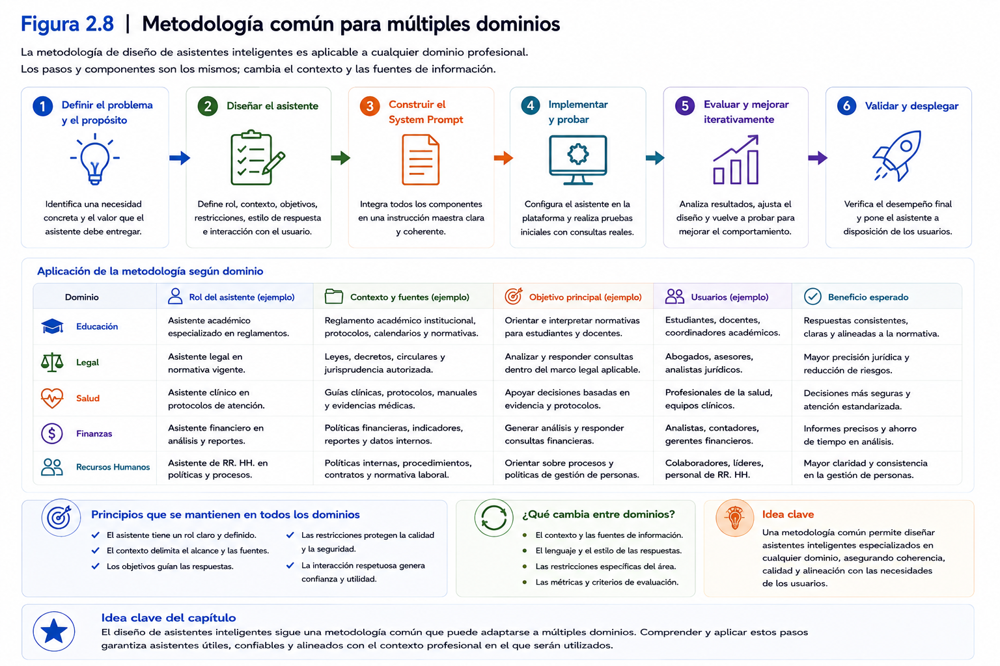
</p>

---

### Ideas clave

Al finalizar esta sección, el participante debería comprender que:

- La metodología de diseño presentada en este capítulo puede aplicarse a múltiples disciplinas y contextos organizacionales.
- Aunque los asistentes cumplen funciones diferentes, todos comparten una estructura común basada en rol, contexto, objetivos, alcance, restricciones y *System Prompt*.
- La especialización del asistente depende del problema que se desea resolver y no del Modelo de Lenguaje utilizado.
- El diseño metodológico constituye el principal factor diferenciador entre un asistente de propósito general y un asistente inteligente especializado.

# 6. Demostración conceptual

La mejor forma de comprender el proceso de diseño de un asistente inteligente consiste en observar cómo evoluciona desde una idea inicial hasta una primera versión funcional.

En esta demostración, el docente construirá paso a paso un asistente inteligente especializado utilizando el mismo caso de estudio que ha acompañado el desarrollo del capítulo.

El propósito no consiste únicamente en mostrar el resultado final, sino en evidenciar el razonamiento utilizado para tomar cada una de las decisiones de diseño.

Los participantes podrán observar cómo un Modelo de Lenguaje de propósito general comienza a adquirir una identidad profesional mediante la incorporación progresiva del rol, el contexto, los objetivos, el alcance, las restricciones y el *System Prompt*.

---

## Objetivo de la demostración

Al finalizar la demostración, los participantes deberán comprender que el diseño de un asistente inteligente constituye un proceso estructurado y sistemático, donde cada decisión influye en el comportamiento final del modelo.

Asimismo, podrán utilizar esta experiencia como referencia para comenzar el desarrollo de su propio Proyecto Integrador.

---

## Caso de estudio

Se utilizará el mismo caso desarrollado a lo largo del capítulo.

**Problema**

Una universidad desea disponer de un asistente inteligente capaz de orientar a estudiantes y docentes respecto de reglamentos académicos y procedimientos institucionales.

El objetivo consiste en mejorar la consistencia de las respuestas y disminuir el tiempo dedicado a resolver consultas repetitivas.

---

## Etapa 1. Definición del problema

El docente comenzará explicando el problema que se desea resolver.

Se analizarán aspectos como:

- naturaleza del problema;
- usuarios involucrados;
- información disponible;
- beneficios esperados.

Durante esta etapa se enfatizará que el diseño siempre comienza con el problema y no con la tecnología.

---

## Etapa 2. Definición del rol

A continuación se construirá el rol del asistente.

En lugar de utilizar una definición genérica, el docente mostrará cómo describir una identidad profesional coherente con el problema identificado.

Ejemplo:

> Eres un asistente especializado en gestión académica universitaria. Tu función consiste en orientar a estudiantes y docentes respecto de procedimientos académicos utilizando la normativa institucional que haya sido proporcionada como parte del contexto o puesta a disposición del asistente.

Se discutirá por qué esta definición resulta más útil que limitarse a indicar:

> "Eres un asistente académico."

---

## Etapa 3. Construcción del contexto

Posteriormente se incorporará el contexto disciplinar.

El docente explicará qué información resulta pertinente para este proyecto.

Entre otros elementos, se incorporarán:

- reglamentos académicos;
- procedimientos institucionales;
- perfil de usuarios;
- terminología utilizada por la organización.

Se analizará cómo el contexto modifica el comportamiento esperado del asistente.

---

## Etapa 4. Definición de objetivos y restricciones

El docente construirá los objetivos funcionales del asistente.

Posteriormente incorporará restricciones relacionadas con:

- utilización exclusiva de documentación institucional;
- reconocimiento de incertidumbre;
- derivación de casos excepcionales;
- lenguaje formal.

Se mostrará cómo estas restricciones mejoran la calidad y consistencia de las respuestas.

---

## Etapa 5. Construcción del *System Prompt*

Integrando todos los elementos anteriores, el docente elaborará una primera versión del *System Prompt*.

Durante este proceso explicará cómo cada sección del documento responde a una decisión de diseño previamente adoptada.

Los participantes observarán que el *System Prompt* no se construye improvisadamente, sino que representa la integración de todo el análisis realizado durante la sesión.

---

## Etapa 6. Pruebas iniciales

Finalmente se ejecutarán diversas consultas representativas del problema.

Por ejemplo:

- ¿Cómo puedo solicitar una suspensión de estudios?
- ¿Qué requisitos existen para titularse?
- ¿Qué ocurre si repruebo una asignatura?
- ¿Dónde puedo consultar el reglamento académico?

Después de cada consulta se analizará:

- pertinencia de la respuesta;
- claridad del lenguaje;
- respeto por las restricciones;
- oportunidades de mejora.

---

## Reflexión final

Una vez concluida la demostración, el docente invitará a los participantes a reflexionar sobre el proceso observado.

Se espera que identifiquen que la calidad de las respuestas obtenidas no depende exclusivamente del Modelo de Lenguaje utilizado.

Por el contrario, comprobarán que la mayor parte del trabajo corresponde al proceso de diseño desarrollado antes de escribir el *System Prompt*.

Esta reflexión servirá como transición hacia la actividad práctica de la sesión, donde cada participante comenzará a construir el primer asistente inteligente correspondiente a su Proyecto Integrador.

---

<p align="center">
  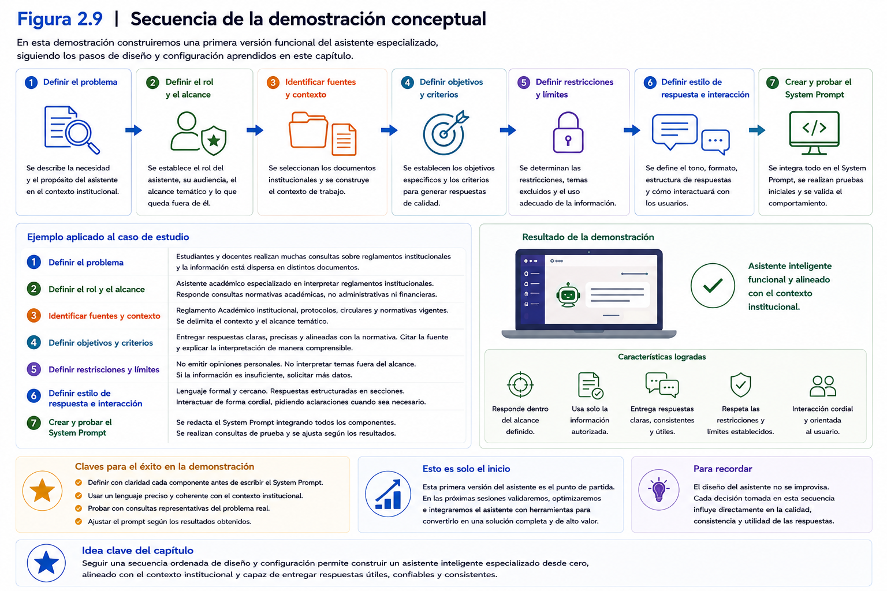
</p>

---

### Ideas clave

Al finalizar la demostración, el participante debería comprender que:

- El diseño de un asistente inteligente sigue una metodología estructurada.
- El *System Prompt* representa la integración de todas las decisiones de diseño adoptadas previamente.
- Las primeras pruebas permiten verificar si el comportamiento del asistente coincide con los objetivos definidos.
- La construcción de asistentes inteligentes constituye un proceso iterativo que combina análisis, diseño, experimentación y mejora continua.

# 7. Buenas prácticas

El diseño de asistentes inteligentes especializados constituye una actividad de ingeniería donde cada decisión influye en el comportamiento final de la solución.

Aunque actualmente existen numerosas recomendaciones sobre cómo redactar instrucciones para modelos de lenguaje, la experiencia demuestra que la calidad de un asistente depende, principalmente, de la metodología utilizada durante su diseño.

Las siguientes buenas prácticas sintetizan los principios que deberían orientar el desarrollo de asistentes inteligentes en cualquier disciplina.

---

## Comenzar siempre por el problema

Uno de los errores más frecuentes consiste en iniciar el diseño pensando inmediatamente en el Modelo de Lenguaje o en el *System Prompt*.

Sin embargo, el primer paso siempre debe consistir en comprender con claridad el problema que se desea resolver.

Antes de diseñar un asistente conviene responder preguntas como:

- ¿Cuál es la necesidad que motiva el proyecto?
- ¿Quiénes serán los usuarios?
- ¿Qué beneficios se esperan obtener?
- ¿Qué tareas requieren apoyo?

Cuando el problema está claramente definido, el resto del proceso de diseño resulta considerablemente más sencillo.

---

## Diseñar antes de escribir

El *System Prompt* debe ser la consecuencia del proceso de diseño y no su punto de partida.

Antes de redactar instrucciones es recomendable definir:

- el rol del asistente;
- el contexto disciplinar;
- los objetivos;
- el alcance;
- las restricciones;
- los criterios de respuesta.

Esta práctica mejora la coherencia del asistente y facilita su posterior mantenimiento.

---

## Especializar el asistente

Los asistentes especializados suelen producir resultados más consistentes que aquellos diseñados para resolver cualquier tipo de problema.

Siempre que sea posible, conviene orientar el asistente hacia un dominio claramente delimitado.

Por ejemplo:

- normativa institucional;
- análisis financiero;
- investigación científica;
- gestión documental;
- atención de consultas frecuentes.

La especialización permite aprovechar de mejor manera las capacidades del Modelo de Lenguaje.

---

## Construir un contexto pertinente

El contexto debe contener únicamente la información necesaria para resolver el problema identificado.

No resulta conveniente incorporar documentos o antecedentes que no aporten valor al comportamiento esperado del asistente.

Un contexto bien seleccionado favorece respuestas más precisas, reduce la ambigüedad y facilita el mantenimiento del proyecto.

---

## Definir restricciones explícitas

Un asistente inteligente debe conocer tanto sus capacidades como sus limitaciones.

Incorporar restricciones explícitas permite controlar mejor su comportamiento.

Por ejemplo:

- utilizar únicamente documentación oficial;
- reconocer cuando la información resulta insuficiente;
- evitar emitir recomendaciones fuera de su ámbito de competencia;
- mantener un lenguaje profesional.

Las restricciones contribuyen a generar respuestas más confiables y consistentes.

---

## Validar utilizando casos reales

Las pruebas deberían representar situaciones que efectivamente enfrentan los usuarios del asistente.

Mientras más representativos sean los casos de prueba, mayor será la utilidad de la validación.

No basta con formular preguntas simples.

Es recomendable incluir:

- consultas frecuentes;
- situaciones ambiguas;
- casos excepcionales;
- escenarios donde el asistente deba reconocer sus límites.

---

## Mejorar mediante iteraciones

Es poco probable que la primera versión del asistente represente la solución definitiva.

Cada proceso de validación proporcionará información útil para mejorar:

- el contexto;
- las restricciones;
- los criterios de respuesta;
- el *System Prompt*.

El diseño debe entenderse como un proceso continuo de aprendizaje.

---

## Documentar las decisiones de diseño

Registrar las decisiones adoptadas durante el desarrollo del asistente facilita:

- comprender la evolución del proyecto;
- justificar modificaciones posteriores;
- mantener coherencia entre versiones;
- compartir el trabajo con otros profesionales.

La documentación constituye un elemento esencial en proyectos colaborativos y en organizaciones donde los asistentes inteligentes evolucionan con el tiempo.

---

## Mantener una visión centrada en los usuarios

El propósito del asistente consiste en apoyar a las personas.

Por esta razón, durante el diseño conviene preguntarse constantemente:

- ¿La respuesta será comprensible para el usuario?
- ¿Resuelve realmente su necesidad?
- ¿Utiliza un lenguaje apropiado?
- ¿Entrega la información con el nivel de detalle esperado?

Diseñar pensando en los usuarios mejora significativamente la utilidad práctica del asistente.

---

## Reconocer las limitaciones del asistente

Todo asistente inteligente posee límites.

Una buena práctica consiste en diseñarlo para que reconozca explícitamente aquellas situaciones donde no dispone de información suficiente para responder.

Lejos de representar una debilidad, esta conducta fortalece la confianza de los usuarios y favorece un uso responsable de la Inteligencia Artificial.

---

## Considerar el asistente como un proyecto vivo

El diseño no finaliza cuando el asistente comienza a utilizarse.

Los cambios en la organización, la incorporación de nuevos documentos, la actualización de procedimientos o la aparición de nuevas necesidades harán necesario revisar periódicamente el contexto y el *System Prompt*.

Entender el asistente como un proyecto vivo permite mantener su utilidad a lo largo del tiempo.

---

<p align="center">
  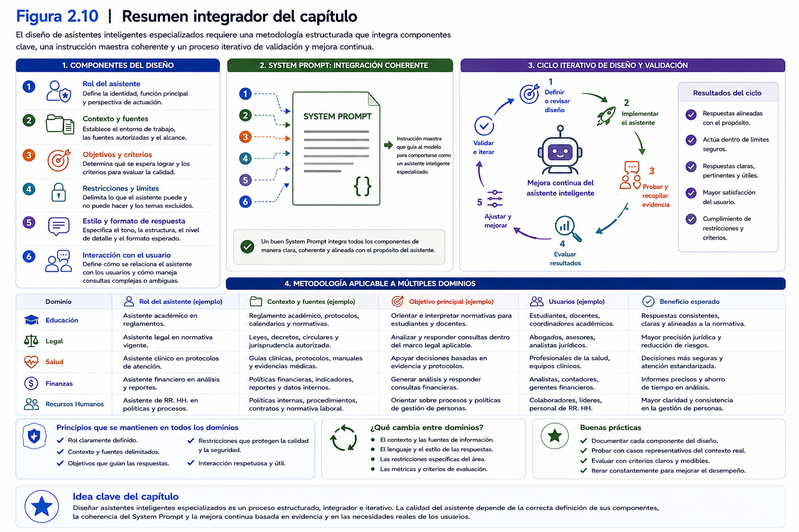
</p>

---

### Ideas clave

Al finalizar esta sección, el participante debería comprender que:

- El diseño de asistentes inteligentes requiere una metodología estructurada y orientada a resolver problemas reales.
- Un buen asistente comienza con una adecuada comprensión del problema y no con la redacción del *System Prompt*.
- La especialización, el contexto pertinente y las restricciones explícitas contribuyen a generar respuestas más consistentes.
- La validación y la mejora iterativa forman parte natural del proceso de diseño.
- Documentar las decisiones adoptadas facilita la evolución y el mantenimiento del asistente a lo largo del tiempo.

# 8. Errores comunes

Diseñar un asistente inteligente especializado implica tomar numerosas decisiones relacionadas con el problema que se desea resolver, el contexto donde trabajará el asistente y la forma en que interactuará con sus usuarios.

Durante este proceso es frecuente cometer errores que afectan la calidad, consistencia y utilidad de la solución desarrollada.

La mayoría de estos errores no se originan en limitaciones del Modelo de Lenguaje de Gran Escala, sino en decisiones de diseño insuficientemente analizadas.

Reconocer estas situaciones desde las primeras etapas del proyecto permitirá construir asistentes más robustos, confiables y alineados con las necesidades reales de la organización.

---

## Comenzar escribiendo el *System Prompt*

Uno de los errores más habituales consiste en abrir la herramienta de Inteligencia Artificial y comenzar inmediatamente a redactar un *System Prompt*.

Aunque esta práctica puede producir un asistente aparentemente funcional, normalmente conduce a instrucciones poco estructuradas, redundantes o difíciles de mantener.

El *System Prompt* debe representar la síntesis del proceso de diseño y no el punto de partida del proyecto.

Antes de escribir una sola instrucción resulta recomendable definir:

- el problema;
- el rol;
- el contexto;
- los objetivos;
- el alcance;
- las restricciones.

---

## Diseñar asistentes para resolver "todo"

Es frecuente encontrar proyectos cuyo objetivo consiste en desarrollar un asistente capaz de responder cualquier consulta relacionada con una organización.

Aunque esta idea resulta atractiva, rara vez produce buenos resultados.

Los asistentes excesivamente generales suelen:

- generar respuestas ambiguas;
- perder consistencia;
- interpretar incorrectamente las consultas;
- incorporar información irrelevante.

Una estrategia más efectiva consiste en comenzar con un dominio claramente delimitado y ampliar gradualmente sus capacidades conforme el proyecto evoluciona.

---

## Definir un rol demasiado genérico

Otro error frecuente consiste en asignar un rol poco específico.

Por ejemplo:

> "Eres un asistente."

o bien:

> "Eres un profesor."

Este tipo de definiciones proporciona muy poca información sobre el comportamiento esperado.

Un rol profesional debería describir aspectos como:

- especialidad;
- responsabilidades;
- propósito;
- usuarios;
- límites de actuación.

Mientras más clara sea la identidad del asistente, más consistente será su comportamiento.

---

## Construir un contexto excesivamente amplio

Existe la tendencia a incorporar la mayor cantidad posible de información con la esperanza de obtener mejores respuestas.

Sin embargo, un contexto demasiado extenso puede dificultar que el asistente identifique los elementos realmente relevantes para resolver una consulta.

La calidad del contexto no depende de la cantidad de información disponible.

Depende principalmente de su pertinencia respecto del problema que se desea resolver.

---

## No establecer restricciones

Cuando un asistente no posee restricciones claramente definidas, es probable que responda consultas que exceden el propósito para el cual fue diseñado.

Esto puede traducirse en respuestas poco confiables o alejadas del contexto institucional.

Las restricciones permiten establecer límites claros y contribuyen a mantener un comportamiento coherente.

---

## Esperar que el modelo "adivine" el contexto

Los Modelos de Lenguaje poseen amplios conocimientos generales, pero no conocen automáticamente la realidad particular de cada organización.

Suponer que el modelo comprenderá procedimientos internos, reglamentos específicos o terminología institucional sin proporcionarle dicha información constituye un error frecuente.

El contexto debe construirse explícitamente durante el diseño del asistente.

---

## No probar escenarios complejos

Otro error consiste en validar el asistente utilizando únicamente preguntas sencillas.

Por ejemplo:

- ¿Qué es un reglamento?
- ¿Qué significa matrícula?

Estas consultas rara vez permiten evaluar el comportamiento real del asistente.

Una validación de calidad debería incorporar:

- consultas ambiguas;
- casos límite;
- preguntas incompletas;
- situaciones excepcionales;
- escenarios donde el asistente deba reconocer que no dispone de información suficiente.

---

## Modificar varias cosas al mismo tiempo

Durante el proceso de mejora es habitual realizar múltiples cambios simultáneamente.

Por ejemplo:

- modificar el contexto;
- agregar nuevas restricciones;
- cambiar el *System Prompt*;
- alterar los criterios de respuesta.

Cuando todos estos cambios se realizan de manera conjunta resulta difícil identificar cuál de ellos produjo la mejora o el problema observado.

Una práctica recomendable consiste en introducir modificaciones de manera gradual y validar cada cambio antes de continuar.

---

## No documentar las versiones

Muchos proyectos evolucionan durante semanas o meses.

Si no se registran los cambios realizados, posteriormente resulta muy difícil comprender:

- por qué se modificó una instrucción;
- cuándo se incorporó una nueva restricción;
- qué versión produjo mejores resultados.

La ausencia de documentación dificulta el mantenimiento y la mejora continua del asistente.

---

## Evaluar únicamente la calidad de las respuestas

Es frecuente juzgar un asistente considerando únicamente si "responde bien".

Sin embargo, una evaluación profesional debería analizar múltiples dimensiones.

Entre ellas:

- consistencia;
- precisión;
- pertinencia;
- claridad;
- respeto por las restricciones;
- capacidad para reconocer incertidumbre.

Una respuesta aparentemente correcta puede seguir siendo inadecuada si contradice los criterios definidos durante el diseño.

---

## Pensar que el proyecto termina cuando el asistente funciona

El funcionamiento inicial representa sólo el comienzo del proceso.

Las organizaciones cambian.

Los procedimientos evolucionan.

Los documentos se actualizan.

Las necesidades de los usuarios también cambian.

Por ello, un asistente inteligente requiere mantenimiento permanente.

Considerar el proyecto como una solución terminada desde su primera versión limita considerablemente su utilidad futura.

---

<p align="center">
  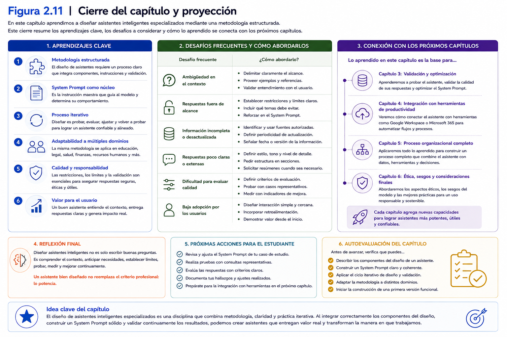
</p>

---

### Ideas clave

Al finalizar esta sección, el participante debería comprender que:

- La mayoría de los problemas observados en asistentes inteligentes se originan en decisiones de diseño y no en limitaciones del Modelo de Lenguaje.
- El *System Prompt* debe construirse al finalizar el proceso de diseño y no improvisarse desde el inicio.
- Los asistentes especializados obtienen mejores resultados cuando trabajan sobre dominios claramente delimitados.
- La validación debe considerar situaciones representativas y no únicamente consultas simples.
- El diseño de asistentes inteligentes constituye un proceso evolutivo que requiere documentación, evaluación continua y mejora permanente.

# 9. Relación con el Proyecto Integrador

Durante la sesión anterior, cada participante identificó un problema perteneciente a su contexto profesional que podría beneficiarse del apoyo de un asistente inteligente especializado. Esa definición permitió establecer el propósito general del Proyecto Integrador y proporcionó una dirección clara para el trabajo que se desarrollará durante el resto del taller.

En esta segunda sesión comienza la construcción de la solución.

Los contenidos estudiados a lo largo del presente capítulo constituyen la metodología que permitirá transformar un Modelo de Lenguaje de Gran Escala en un asistente inteligente especializado, diseñado específicamente para abordar el problema identificado en la sesión anterior.

En consecuencia, el Proyecto Integrador deja de centrarse únicamente en el análisis del problema y comienza a enfocarse en el diseño de la solución.

---

## Del problema a la solución

Todo proyecto de Inteligencia Artificial comienza con una necesidad claramente identificada.

Sin embargo, reconocer un problema no resulta suficiente para construir una solución útil.

Es necesario diseñar cuidadosamente el comportamiento esperado del asistente.

Precisamente este será el propósito del trabajo práctico correspondiente a esta sesión.

Cada participante utilizará la metodología desarrollada durante el capítulo para definir:

- el rol del asistente;
- el contexto disciplinar;
- los objetivos;
- el alcance;
- las restricciones;
- los criterios de respuesta;
- la primera versión del *System Prompt*.

Estos elementos constituirán la arquitectura inicial del asistente inteligente.

---

## ¿Qué se espera desarrollar durante esta sesión?

El principal producto de esta jornada corresponde a la primera versión funcional del asistente inteligente especializado.

Aunque todavía será una versión inicial, deberá representar de manera coherente las decisiones de diseño adoptadas por el participante.

Al finalizar la sesión, el asistente deberá contar, al menos, con:

- un rol claramente definido;
- un contexto disciplinar pertinente;
- objetivos alineados con el problema identificado;
- un alcance explícito;
- restricciones de funcionamiento;
- criterios básicos de respuesta;
- una primera versión del *System Prompt*.

Este conjunto de elementos permitirá comenzar las primeras pruebas de funcionamiento.

---

## Aplicación de la metodología de diseño

Durante el desarrollo del Proyecto Integrador se utilizará la misma secuencia metodológica estudiada en este capítulo.

El proceso comenzará con la revisión del problema identificado durante la primera sesión y continuará mediante la incorporación progresiva de cada componente del diseño.

La metodología seguirá la siguiente secuencia:

1. Revisar el problema disciplinar.
2. Definir el rol del asistente.
3. Construir el contexto de trabajo.
4. Establecer objetivos y alcance.
5. Definir restricciones.
6. Elaborar el *System Prompt*.
7. Realizar las primeras pruebas de funcionamiento.

Esta secuencia permitirá que todos los participantes desarrollen asistentes estructurados y metodológicamente consistentes, independientemente de la disciplina a la que pertenezcan.

---

## La importancia de documentar las decisiones

Durante esta sesión no sólo se espera construir un asistente funcional.

También resulta importante registrar las decisiones adoptadas durante el proceso de diseño.

Cada definición realizada —rol, contexto, objetivos, restricciones y *System Prompt*— formará parte del Portafolio del Proyecto Integrador.

Esta documentación permitirá:

- justificar las decisiones de diseño;
- facilitar futuras modificaciones;
- comprender la evolución del proyecto;
- respaldar la presentación final del portafolio.

De esta manera, el Proyecto Integrador reflejará tanto el producto desarrollado como el proceso seguido para construirlo.

---

## Un diseño que evolucionará

Es importante comprender que el asistente desarrollado durante esta sesión no representa la versión definitiva del proyecto.

Por el contrario, constituye la base sobre la cual se desarrollarán las siguientes etapas del taller.

En la próxima sesión, el participante analizará el comportamiento del asistente mediante casos de prueba representativos.

Como resultado de ese proceso podrán surgir modificaciones relacionadas con:

- el contexto disciplinar;
- las restricciones;
- los criterios de respuesta;
- la estructura del *System Prompt*.

Esta evolución forma parte natural del proceso de diseño de asistentes inteligentes.

---

## Relación con las siguientes sesiones

El trabajo realizado durante esta sesión constituye el punto de partida para el resto del Proyecto Integrador.

La evolución esperada será la siguiente:

- **Sesión 3:** validación y optimización del comportamiento del asistente mediante casos de prueba.
- **Sesión 4:** integración del asistente en un flujo funcional utilizando herramientas de automatización.
- **Sesión 5:** aplicación del asistente a un caso representativo y consolidación del portafolio.
- **Sesión 6:** presentación y evaluación final del Proyecto Integrador.

Cada nueva etapa utilizará como base el asistente diseñado durante esta sesión.

Por esta razón, dedicar tiempo a construir una arquitectura sólida facilitará significativamente el desarrollo de las actividades posteriores.

---

## Más que configurar un asistente

El propósito del Proyecto Integrador no consiste únicamente en aprender a utilizar una herramienta de Inteligencia Artificial.

El verdadero objetivo es desarrollar una metodología que permita diseñar soluciones adaptadas a problemas reales, utilizando criterios de análisis, organización y mejora continua.

Esta forma de trabajo resulta transferible a múltiples contextos profesionales y constituye una competencia cada vez más valorada en organizaciones que incorporan Inteligencia Artificial Generativa en sus procesos.

Al finalizar esta sesión, cada participante habrá dado el paso más importante del proyecto: transformar una necesidad identificada en una primera solución funcional basada en Inteligencia Artificial.

---

<p align="center">
  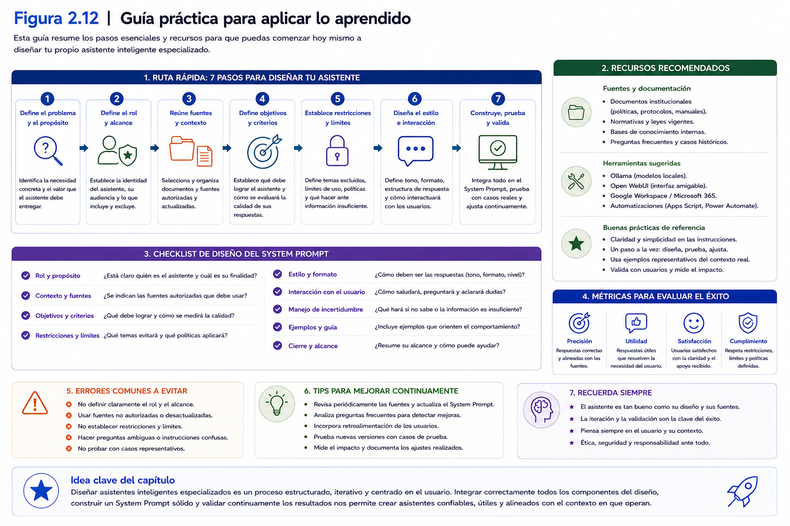
</p>

---

### Ideas clave

Al finalizar esta sección, el participante debería comprender que:

- El Proyecto Integrador avanza desde la definición del problema hacia el diseño de una solución basada en Inteligencia Artificial Generativa.
- La metodología desarrollada en este capítulo proporciona una estructura para construir asistentes inteligentes especializados de manera sistemática.
- El producto esperado corresponde a la primera versión funcional del asistente inteligente, documentada como parte del portafolio del proyecto.
- El asistente diseñado durante esta sesión servirá como base para las actividades de validación, optimización e integración que se desarrollarán en las siguientes etapas del taller.
- El valor del Proyecto Integrador reside tanto en el producto obtenido como en la metodología utilizada para diseñarlo y mejorarlo.

# 10. Síntesis de la sesión

Durante esta segunda sesión se abordó uno de los aspectos más importantes del desarrollo de soluciones basadas en Inteligencia Artificial Generativa: el diseño de asistentes inteligentes especializados.

A diferencia del capítulo anterior, donde se estudiaron los fundamentos tecnológicos de la Inteligencia Artificial Generativa y los Modelos de Lenguaje de Gran Escala (LLM), en esta oportunidad el foco estuvo puesto en comprender cómo transformar esa tecnología en una solución capaz de resolver un problema específico dentro de un contexto profesional.

El primer concepto desarrollado fue la **Ingeniería de Instrucciones (*Prompt Engineering*)**, entendida no como una técnica para redactar consultas aisladas, sino como una metodología para diseñar el comportamiento de un asistente inteligente.

Desde esta perspectiva, se estableció que el diseño de un asistente constituye un proceso de análisis y planificación donde cada decisión influye en la calidad de las respuestas obtenidas.

Posteriormente se explicó que un Modelo de Lenguaje de Gran Escala corresponde a una tecnología de propósito general y que, por sí solo, no constituye un asistente inteligente.

Esta distinción permitió comprender que la especialización no depende de modificar el modelo, sino de proporcionar un contexto adecuado y definir cuidadosamente el comportamiento esperado del asistente.

A continuación se estudiaron los principales componentes del proceso de diseño.

En primer lugar, se analizó la importancia del **rol**, entendido como la identidad profesional del asistente y el punto de partida para orientar la interpretación de las consultas.

Posteriormente se desarrolló el concepto de **contexto disciplinar**, identificándolo como el conjunto de antecedentes que permiten al asistente comprender el entorno organizacional donde desarrollará su trabajo.

Sobre esta base se incorporaron los **objetivos**, el **alcance** y las **restricciones**, elementos que permiten definir las funciones del asistente, delimitar sus responsabilidades y establecer límites claros para su comportamiento.

La integración de todos estos componentes dio origen al **System Prompt**, presentado como una especificación funcional que sintetiza las principales decisiones de diseño adoptadas durante el proyecto.

Lejos de entenderlo como un simple conjunto de instrucciones, el *System Prompt* fue abordado como un documento vivo que evoluciona junto con el asistente y refleja el proceso de análisis realizado por su diseñador.

Finalmente, se estudió la importancia de la **validación inicial** y de la **mejora iterativa**, comprendiendo que la primera versión del asistente representa únicamente el inicio de un proceso continuo de perfeccionamiento.

La observación sistemática del comportamiento del modelo, el uso de casos de prueba y la incorporación progresiva de mejoras permiten construir asistentes cada vez más robustos, consistentes y útiles para las organizaciones.

Todos estos aprendizajes convergen en un objetivo común: proporcionar una metodología para diseñar asistentes inteligentes especializados capaces de apoyar procesos reales de análisis y toma de decisiones.

Desde esta perspectiva, el valor del proyecto no radica exclusivamente en el Modelo de Lenguaje utilizado, sino en la capacidad del diseñador para comprender el problema, organizar el conocimiento disponible y traducirlo en una solución funcional mediante un proceso estructurado de diseño.

Al finalizar esta sesión, cada participante habrá construido la primera versión funcional de su asistente inteligente, incorporando un rol claramente definido, un contexto disciplinar pertinente, objetivos específicos, restricciones de funcionamiento y un *System Prompt* coherente con el problema identificado durante la sesión anterior.

Este producto constituye un hito relevante dentro del Proyecto Integrador y servirá como base para las actividades de validación y optimización que serán desarrolladas en la siguiente sesión del taller.

---

## En esta sesión aprendimos que...

Al finalizar este capítulo, el participante debería ser capaz de reconocer que:

- La Ingeniería de Instrucciones constituye una metodología para diseñar el comportamiento de asistentes inteligentes especializados.
- Un Modelo de Lenguaje de Gran Escala no corresponde, por sí mismo, a un asistente inteligente; requiere un proceso de diseño para transformarse en una solución especializada.
- El rol, el contexto, los objetivos, el alcance y las restricciones constituyen los principales componentes del diseño de un asistente inteligente.
- El *System Prompt* integra todas las decisiones adoptadas durante el proceso de diseño y orienta permanentemente el comportamiento del asistente.
- La validación inicial y la mejora iterativa permiten refinar progresivamente el comportamiento del asistente y aumentar la calidad de sus respuestas.
- El diseño de asistentes inteligentes representa una competencia transferible a múltiples contextos profesionales y organizacionales.

---

## Preparando la siguiente sesión

En el próximo capítulo se abordará la **validación y optimización del comportamiento de asistentes inteligentes especializados**.

A partir del asistente construido durante esta sesión, el participante aprenderá a diseñar casos de prueba, evaluar la calidad de las respuestas generadas, identificar oportunidades de mejora y perfeccionar progresivamente el *System Prompt* y el contexto disciplinar.

El propósito será comprender que el desarrollo de asistentes inteligentes no finaliza cuando se obtiene una primera versión funcional.

Por el contrario, comienza un proceso continuo de experimentación, análisis y mejora que permitirá construir soluciones cada vez más consistentes, confiables y adaptadas a las necesidades reales de los usuarios.

De esta manera, el Proyecto Integrador evolucionará desde el diseño inicial del asistente hacia una etapa de validación sistemática, consolidando una metodología de trabajo basada en la mejora continua y el aprendizaje iterativo.

# 11. Preguntas para la reflexión

Las siguientes preguntas tienen como propósito promover el análisis crítico de los contenidos desarrollados en este capítulo y favorecer la aplicación de la metodología de diseño de asistentes inteligentes al contexto profesional de cada participante.

Más que buscar respuestas correctas o incorrectas, se espera que el participante fundamente sus decisiones utilizando los conceptos estudiados durante la sesión y reflexione sobre las implicancias que tiene el diseño de un asistente inteligente en un entorno organizacional.

---

## Reflexión conceptual

### 1.

¿Por qué la Ingeniería de Instrucciones (*Prompt Engineering*) debe entenderse como una metodología de diseño y no únicamente como una técnica para redactar instrucciones?

---

### 2.

¿Cuál es la principal diferencia entre un Modelo de Lenguaje de Gran Escala (LLM) y un asistente inteligente especializado?

Explique utilizando los conceptos desarrollados en este capítulo.

---

### 3.

¿Por qué el rol y el contexto constituyen elementos complementarios en el diseño de un asistente inteligente?

¿Qué problemas podrían surgir si uno de ellos estuviera insuficientemente definido?

---

## Reflexión aplicada

### 4.

Piense en el problema profesional que seleccionó para su Proyecto Integrador.

¿Cómo describiría el rol que deberá desempeñar su asistente inteligente?

Explique por qué considera que ese rol resulta adecuado para resolver el problema identificado.

---

### 5.

¿Qué información debería incorporarse al contexto disciplinar de su asistente?

Considere aspectos como:

- organización;
- usuarios;
- documentos;
- procedimientos;
- normativa;
- terminología propia de su disciplina.

---

### 6.

Defina tres objetivos concretos que debería cumplir su asistente inteligente.

Posteriormente indique al menos dos actividades que quedarían explícitamente fuera de su alcance.

---

## Pensamiento crítico

### 7.

¿Por qué resulta conveniente establecer restricciones explícitas para un asistente inteligente?

¿Qué riesgos podrían aparecer si el asistente respondiera sin ningún tipo de limitación?

---

### 8.

Imagine que dos asistentes utilizan exactamente el mismo Modelo de Lenguaje.

Sin embargo, uno fue cuidadosamente diseñado y el otro únicamente posee una instrucción general.

¿Qué diferencias esperaría observar entre ambos?

Fundamente su respuesta.

---

### 9.

Considere la siguiente afirmación:

> "Mientras más largo sea el *System Prompt*, mejores serán las respuestas del asistente."

¿Está de acuerdo con esta afirmación?

Justifique su respuesta utilizando los conceptos desarrollados en este capítulo.

---

## Reflexión sobre el Proyecto Integrador

### 10.

Revise el diseño inicial de su asistente inteligente.

¿Existe algún elemento que considere necesario modificar antes de comenzar la etapa de validación?

Explique las razones de su decisión.

---

### 11.

Si tuviera que presentar hoy la primera versión de su asistente a un grupo de colegas, ¿qué aspectos destacaría como sus principales fortalezas y cuáles considera que aún requieren mejoras?

---

### 12.

Después de estudiar este capítulo, ¿qué componente del diseño considera más importante para lograr un asistente inteligente especializado: el rol, el contexto, los objetivos, las restricciones o el *System Prompt*?

Fundamente su respuesta utilizando ejemplos relacionados con su propio proyecto.

---

## Reflexión final

Antes de continuar con la siguiente sesión, dedique algunos minutos a responder la siguiente pregunta:

> **Si mañana un colega tuviera que continuar el desarrollo de su asistente inteligente, ¿la documentación que ha elaborado hasta ahora sería suficiente para comprender el problema, el diseño realizado y las decisiones adoptadas? ¿Qué información adicional incorporaría para facilitar la continuidad del proyecto?**

Esta reflexión permitirá evaluar no sólo la calidad técnica del asistente desarrollado, sino también la solidez del proceso de diseño documentado durante el Proyecto Integrador.

# 12. Bibliografía y recursos recomendados

Los contenidos desarrollados en este capítulo se fundamentan en literatura especializada sobre Ingeniería de Instrucciones (*Prompt Engineering*), Modelos de Lenguaje de Gran Escala (LLM), diseño de asistentes inteligentes y metodologías para la interacción con sistemas de Inteligencia Artificial Generativa.

Las siguientes referencias permiten profundizar los conceptos abordados durante la sesión y proporcionan una base sólida para comprender las decisiones de diseño que intervienen en la construcción de asistentes inteligentes especializados.

---

## Bibliografía fundamental

Bishop, C. M. (2023). *Deep Learning: Foundations and Concepts*. Springer.

Mollick, E. (2024). *Co-Intelligence: Living and Working with AI*. Portfolio.

OpenAI. (2024). *Prompt Engineering*. OpenAI Documentation.

Russell, S., & Norvig, P. (2021). *Artificial Intelligence: A Modern Approach* (4th ed.). Pearson.

White, J., Fu, Q., Hays, S., et al. (2023). *A Prompt Pattern Catalog to Enhance Prompt Engineering with ChatGPT*. Vanderbilt University.

---

## Lecturas complementarias

Anthropic. (2024). *Prompt Engineering Overview*.

Bommasani, R., et al. (2021). *On the Opportunities and Risks of Foundation Models*. Stanford University.

Brown, T., et al. (2020). *Language Models are Few-Shot Learners*. Proceedings of NeurIPS.

Google DeepMind. (2024). *Prompt Design Strategies for Large Language Models*.

Vaswani, A., et al. (2017). *Attention Is All You Need*. Proceedings of NeurIPS.

---

## Recursos digitales recomendados

**Guía oficial de Prompt Engineering (OpenAI)**

https://platform.openai.com/docs/guides/prompt-engineering

---

**Documentación oficial de Anthropic**

https://docs.anthropic.com

---

**Documentación oficial de Ollama**

https://ollama.com

---

**Documentación oficial de Open WebUI**

https://openwebui.com

---

**Repositorio oficial de modelos Hugging Face**

https://huggingface.co/models

---

## Recomendación para el participante

Durante esta sesión se presentó una metodología para diseñar asistentes inteligentes especializados basada en el análisis del problema, la definición del rol, la construcción del contexto, el establecimiento de objetivos, la incorporación de restricciones y el diseño del *System Prompt*.

Aunque existen numerosas técnicas y recomendaciones para la Ingeniería de Instrucciones, es importante comprender que no existe un único formato válido para construir un asistente inteligente.

Las metodologías evolucionan constantemente junto con los Modelos de Lenguaje y las herramientas disponibles.

Por esta razón, se recomienda utilizar las referencias presentadas en este capítulo como una base para profundizar en los principios de diseño, manteniendo siempre una actitud crítica y una disposición permanente al aprendizaje y a la experimentación.

Los siguientes capítulos retomarán estos conceptos desde una perspectiva eminentemente práctica, centrándose en la validación, optimización e integración de asistentes inteligentes dentro de flujos de trabajo reales.

