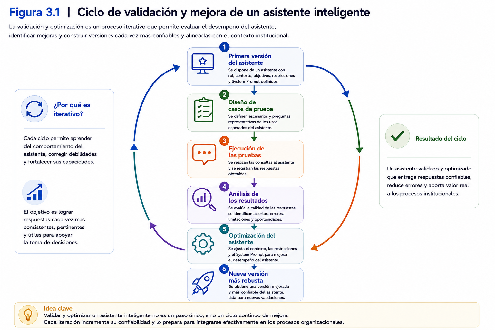
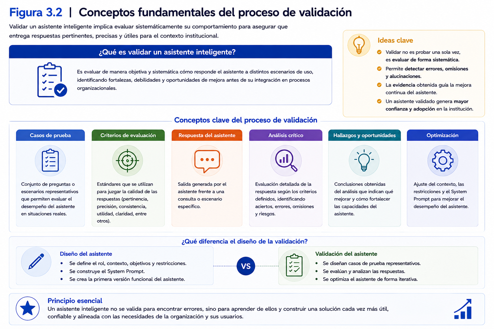
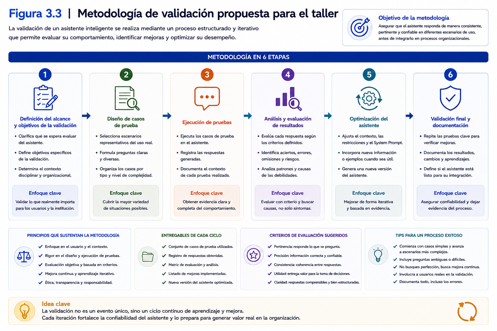
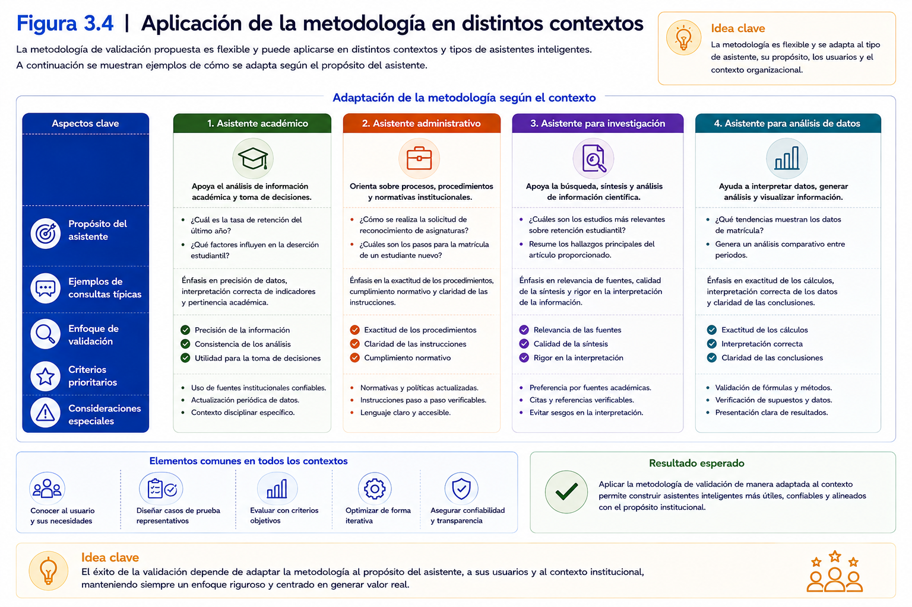
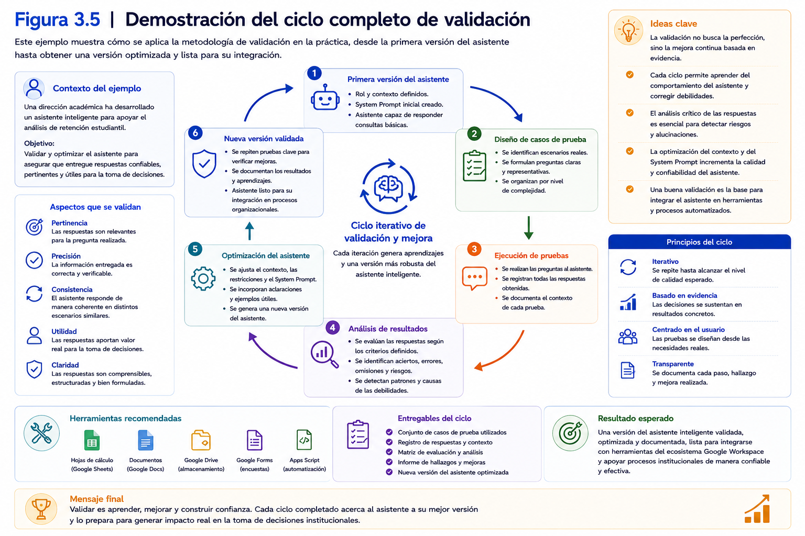
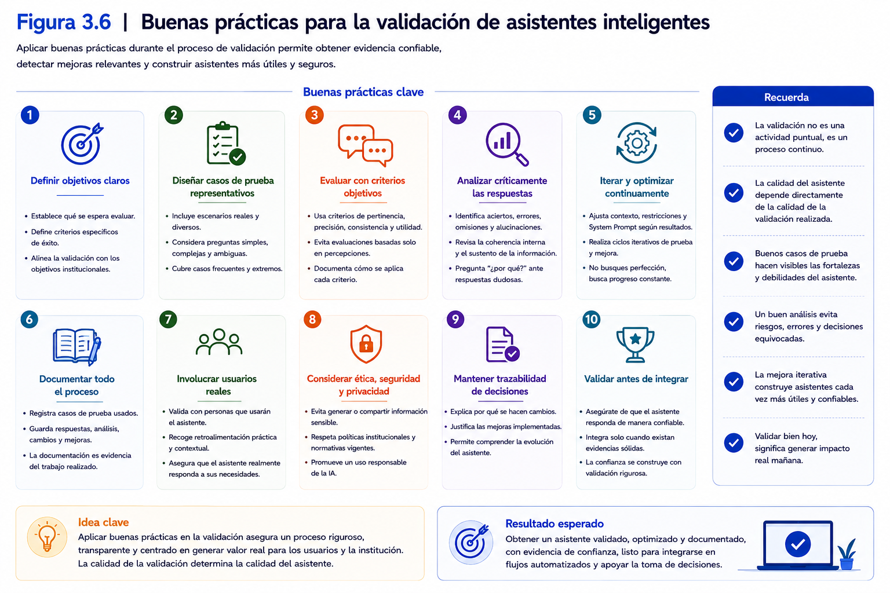
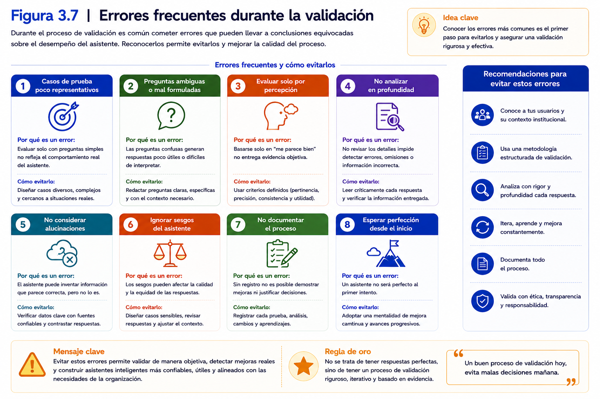
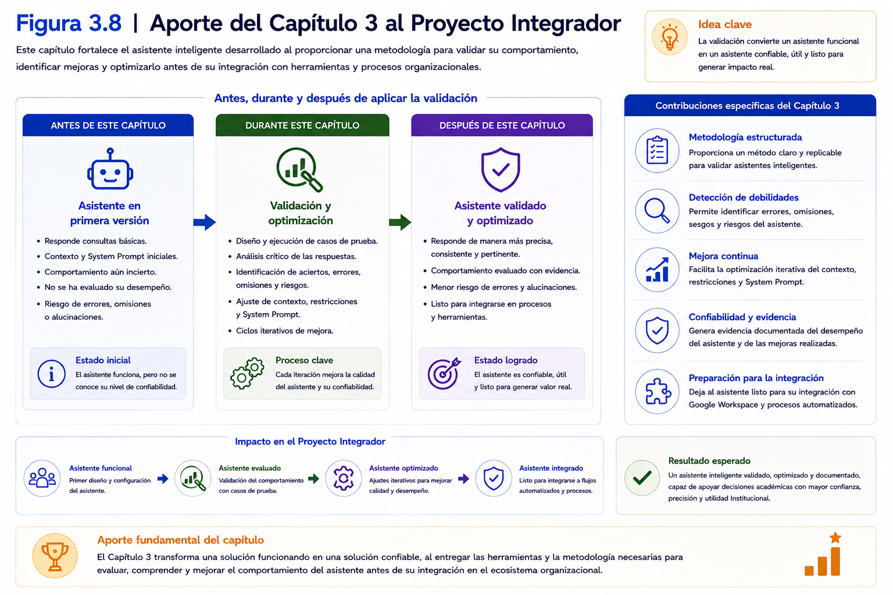
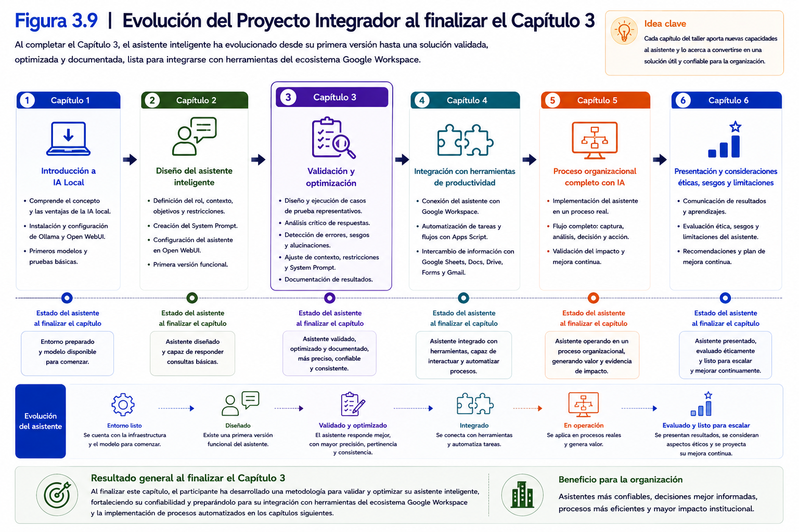

# Capítulo 3
# Validación y optimización del asistente inteligente

---

## Contenidos del capítulo

1. Introducción
2. Objetivos de aprendizaje
3. Conceptos fundamentales
4. Desarrollo conceptual
5. Ejemplos de aplicación
6. Demostración conceptual
7. Buenas prácticas
8. Errores comunes
9. Relación con el Proyecto Integrador
10. Síntesis del capítulo
11. Preguntas para la reflexión
12. Bibliografía y recursos recomendados

---

# 1. Introducción

Al finalizar el capítulo anterior, la directora académica había logrado construir la primera versión funcional de un asistente inteligente especializado para apoyar el análisis de información académica y la toma de decisiones dentro de su institución.

El asistente era capaz de responder consultas relacionadas con indicadores institucionales, interpretar información proveniente de documentos internos y orientar a los usuarios respecto de distintos procedimientos académicos. Su comportamiento estaba definido mediante un rol claramente establecido, un contexto disciplinar pertinente, objetivos específicos, restricciones de funcionamiento y un *System Prompt* cuidadosamente diseñado.

Sin embargo, antes de poner esta solución a disposición de los equipos de trabajo surgió una pregunta fundamental:

> **¿Cómo saber si el asistente realmente funciona de manera confiable?**

Responder correctamente una consulta aislada no garantiza que un asistente inteligente esté preparado para apoyar procesos reales dentro de una organización.

Un mismo asistente puede entregar respuestas muy precisas frente a determinadas preguntas y, al mismo tiempo, cometer errores importantes cuando enfrenta consultas ambiguas, información incompleta o situaciones que no fueron consideradas durante su diseño.

En consecuencia, desarrollar un asistente inteligente no finaliza cuando éste comienza a responder preguntas.

Por el contrario, a partir de ese momento comienza una nueva etapa del proyecto: la validación.

Validar un asistente inteligente implica evaluar sistemáticamente su comportamiento para determinar si responde de manera consistente y pertinente frente a diferentes escenarios de uso, identificando sus fortalezas y limitaciones.

Este proceso permite identificar fortalezas, detectar debilidades y generar evidencia suficiente para introducir mejoras antes de integrar el asistente dentro de un proceso organizacional.

En proyectos profesionales de Inteligencia Artificial Generativa, la validación constituye una etapa tan importante como el propio diseño del asistente.

Las organizaciones no incorporan soluciones de IA únicamente porque "funcionan", sino porque existe evidencia de que producen resultados consistentes, reducen errores y apoyan efectivamente la toma de decisiones.

Durante este capítulo se abordará una metodología para validar y optimizar asistentes inteligentes especializados mediante el diseño de casos de prueba, el análisis crítico de las respuestas obtenidas y el refinamiento progresivo de los distintos componentes que conforman el asistente.

Más que buscar una respuesta perfecta desde el primer intento, el objetivo será comprender que el desarrollo de asistentes inteligentes es un proceso iterativo de mejora continua.

Cada ciclo de validación permitirá incorporar nuevos aprendizajes, ajustar el contexto disciplinar, perfeccionar el *System Prompt* y fortalecer la calidad de las respuestas generadas por el modelo.

Al finalizar este capítulo, cada participante dispondrá de una metodología para evaluar objetivamente el comportamiento de su asistente inteligente y aplicar mejoras fundamentadas antes de avanzar hacia su integración con herramientas del ecosistema Google Workspace y otros procesos automatizados que serán desarrollados en los siguientes capítulos del taller.

---

  

---

### Ideas clave

Al finalizar esta introducción, el participante debería comprender que:

- Diseñar un asistente inteligente representa sólo la primera etapa del proyecto.
- La validación permite determinar si el asistente responde de manera consistente frente a distintos escenarios de uso.
- La optimización constituye un proceso continuo basado en evidencia obtenida durante las pruebas.
- La mejora iterativa incrementa la confiabilidad del asistente antes de su integración en procesos organizacionales.
- La validación desarrollada en este capítulo preparará al asistente para su incorporación posterior en flujos automatizados utilizando herramientas del ecosistema Google Workspace.

# 2. Objetivos de aprendizaje

Al finalizar este capítulo, el participante será capaz de:

- Comprender la importancia de la validación como una etapa fundamental en el desarrollo de asistentes inteligentes especializados.

- Diferenciar el proceso de diseño de un asistente del proceso de validación y optimización de su comportamiento.

- Diseñar casos de prueba representativos que permitan evaluar sistemáticamente el desempeño de un asistente inteligente frente a distintos escenarios de uso.

- Analizar críticamente las respuestas generadas por un asistente inteligente, considerando criterios de pertinencia, precisión, consistencia y utilidad para el apoyo al análisis y la toma de decisiones.

- Identificar limitaciones, alucinaciones (*hallucinations*), sesgos y otros comportamientos que puedan afectar la confiabilidad del asistente.

- Aplicar un proceso de refinamiento iterativo para optimizar el contexto disciplinar, las restricciones y el *System Prompt*, mejorando progresivamente el desempeño del asistente.

- Documentar los resultados obtenidos durante la validación como evidencia del proceso de mejora continua desarrollado en el Proyecto Integrador.

- Preparar un asistente inteligente confiable para su integración posterior con herramientas del ecosistema Google Workspace y otros procesos automatizados abordados en los siguientes capítulos.

---

## Competencias que se desarrollan durante este capítulo

Durante este capítulo el participante fortalecerá competencias relacionadas con:

- Evaluación crítica de soluciones basadas en Inteligencia Artificial Generativa.
- Diseño de estrategias de validación para asistentes inteligentes especializados.
- Análisis de calidad de respuestas generadas por Modelos de Lenguaje de Gran Escala (LLM).
- Optimización iterativa de asistentes inteligentes mediante evidencia empírica.
- Documentación técnica de procesos de validación y mejora.
- Preparación de soluciones de IA para su incorporación en procesos organizacionales.

---

## Vinculación con el Proyecto Integrador

Los aprendizajes desarrollados en este capítulo permitirán al participante avanzar desde una primera versión funcional del asistente hacia una solución más robusta y confiable.

Como resultado del trabajo realizado durante la exposición teórica, el laboratorio guiado y la aplicación al Proyecto Integrador, cada participante dispondrá de:

- un conjunto estructurado de casos de prueba;
- un registro documentado de los resultados obtenidos;
- un análisis crítico del comportamiento del asistente;
- una versión optimizada del contexto y del *System Prompt*;
- una nueva versión del asistente con un mejor desempeño frente a situaciones reales de uso.

Este conjunto de evidencias constituirá el principal producto del tercer capítulo y servirá de base para la integración del asistente con herramientas del ecosistema Google Workspace que será desarrollada posteriormente.

---

### Al finalizar este capítulo.

El participante no sólo habrá mejorado técnicamente su asistente inteligente.

También habrá incorporado una metodología de validación y mejora continua que podrá aplicar en futuros proyectos de Inteligencia Artificial Generativa, independientemente del modelo o de las herramientas tecnológicas utilizadas.

De esta manera, el aprendizaje trasciende el desarrollo del Proyecto Integrador y se convierte en una competencia profesional transferible a distintos contextos organizacionales.

# 3. Conceptos fundamentales

Antes de comenzar el proceso de validación de un asistente inteligente, resulta necesario comprender una serie de conceptos que permitirán interpretar correctamente los resultados obtenidos durante las pruebas y orientar el proceso de mejora.

Estos conceptos constituyen la base metodológica sobre la cual se desarrollará el resto del capítulo y serán utilizados posteriormente durante el laboratorio y el Proyecto Integrador.

---

## 3.1 Validación

La **validación** corresponde al proceso mediante el cual se evalúa si un asistente inteligente responde adecuadamente a los objetivos para los cuales fue diseñado.

Su propósito no consiste únicamente en verificar que el asistente entregue una respuesta, sino en determinar si dicha respuesta resulta útil, pertinente, consistente y suficientemente confiable para apoyar un proceso de análisis o de toma de decisiones.

La validación responde, entre otras, a preguntas como:

- ¿El asistente comprende correctamente las consultas?
- ¿Las respuestas son coherentes con el contexto definido?
- ¿Respeta las restricciones establecidas durante el diseño?
- ¿La información entregada resulta útil para el usuario?

La validación constituye una actividad sistemática y planificada, basada en evidencia obtenida mediante casos de prueba representativos.

---

## 3.2 Caso de prueba

Un **caso de prueba** corresponde a una situación diseñada deliberadamente para evaluar el comportamiento del asistente frente a una consulta específica.

Cada caso de prueba representa una situación que podría enfrentar un usuario durante el uso normal del asistente.

Un caso de prueba normalmente incluye:

- el objetivo de la prueba;
- la consulta realizada;
- el resultado esperado;
- la respuesta obtenida;
- las observaciones del evaluador.

Mientras más representativos sean los casos de prueba, mayor será la confianza que podrá alcanzarse respecto del desempeño del asistente.

---

## 3.3 Calidad de la respuesta

No todas las respuestas generadas por un asistente inteligente poseen la misma calidad.

Durante la validación será necesario evaluar distintos atributos, entre ellos:

- precisión;
- pertinencia;
- claridad;
- consistencia;
- completitud;
- utilidad para el usuario.

La evaluación de estos criterios permitirá determinar si el asistente cumple efectivamente con el propósito definido durante su diseño.

---

## 3.4 Refinamiento iterativo

El **refinamiento iterativo** corresponde al proceso continuo de mejora del asistente a partir de los resultados obtenidos durante la validación.

Cada iteración considera tres etapas principales:

1. observar el comportamiento del asistente;
2. identificar oportunidades de mejora;
3. introducir modificaciones y volver a validar.

Este proceso puede repetirse tantas veces como sea necesario hasta alcanzar un nivel satisfactorio de desempeño.

---

## 3.5 Alucinaciones (*Hallucinations*)

Una **alucinación** ocurre cuando un Modelo de Lenguaje genera información inventada, no sustentada o presentada sin respaldo suficiente en la información disponible, formulándola como si fuera válida o verificable.

Las alucinaciones representan uno de los principales riesgos asociados al uso de modelos generativos en contextos profesionales.

Por esta razón, un proceso de validación debe contemplar estrategias para identificarlas y reducir su ocurrencia mediante un mejor diseño del contexto, restricciones adecuadas y una revisión crítica de las respuestas.

---

## 3.6 Sesgos

Los **sesgos** corresponden a patrones sistemáticos presentes en las respuestas del asistente que pueden favorecer determinadas interpretaciones, excluir información relevante o generar resultados poco equilibrados.

Los sesgos pueden originarse en diferentes fuentes, entre ellas:

- los datos utilizados durante el entrenamiento del modelo;
- el contexto proporcionado al asistente;
- las instrucciones contenidas en el *System Prompt*;
- la formulación de las consultas realizadas por los usuarios.

Reconocer la existencia de sesgos constituye un requisito indispensable para desarrollar soluciones de Inteligencia Artificial responsables y confiables.

---

## 3.7 Optimización

La **optimización** corresponde al proceso mediante el cual se introducen mejoras al asistente con el propósito de aumentar la calidad de sus respuestas y fortalecer su capacidad para resolver el problema identificado durante el diseño.

Optimizar un asistente no implica necesariamente modificar el Modelo de Lenguaje.

En la mayoría de los casos, las mejoras se logran mediante ajustes en:

- el contexto disciplinar;
- el rol del asistente;
- las restricciones;
- los criterios de respuesta;
- el *System Prompt*.

La optimización constituye la etapa final de cada ciclo de validación y prepara al asistente para una nueva ronda de pruebas.

---

  

---

### Ideas clave

Al finalizar esta sección, el participante debería comprender que:

- La validación constituye un proceso sistemático para evaluar el comportamiento de un asistente inteligente.
- Los casos de prueba proporcionan evidencia sistemática y documentada sobre el desempeño observado del asistente.
- La calidad de una respuesta depende de múltiples criterios y no únicamente de que sea correcta.
- Las alucinaciones y los sesgos representan riesgos que deben identificarse y controlarse durante la validación.
- La optimización corresponde a un proceso iterativo de mejora continua basado en los resultados obtenidos durante las pruebas.

# 4. Desarrollo conceptual

Hasta este momento del taller, el participante ha construido la primera versión funcional de un asistente inteligente especializado. El asistente posee un rol claramente definido, un contexto disciplinar, objetivos, restricciones y un *System Prompt* diseñado para responder a un problema específico.

Sin embargo, disponer de un asistente funcional no significa necesariamente que esté preparado para apoyar un proceso real de análisis y toma de decisiones.

En el desarrollo de soluciones basadas en Inteligencia Artificial Generativa existe una diferencia importante entre **que un asistente funcione** y **que sea confiable**.

La confiabilidad no debe suponerse. Debe evaluarse mediante un proceso sistemático de validación que genere evidencia sobre el comportamiento del asistente frente a diferentes escenarios de uso.

En este capítulo se propone una metodología compuesta por cinco etapas, diseñada para evaluar y optimizar asistentes inteligentes especializados antes de incorporarlos a un contexto organizacional.

---

## 4.1 La validación como parte del ciclo de vida del asistente

En muchos proyectos de Inteligencia Artificial Generativa existe la tendencia a considerar que el desarrollo termina cuando el asistente comienza a responder consultas.

En realidad, ese momento representa el inicio de una nueva etapa.

Todo asistente inteligente evoluciona a lo largo de un ciclo de vida compuesto, al menos, por las siguientes fases:

1. Definición del problema.
2. Diseño del asistente.
3. Configuración inicial.
4. Validación.
5. Optimización.
6. Integración en procesos organizacionales.
7. Mantenimiento y mejora continua.

La validación constituye el puente entre el diseño y la utilización práctica del asistente.

Su propósito consiste en determinar si el comportamiento observado corresponde efectivamente al comportamiento esperado.

---

## 4.2 ¿Qué significa validar un asistente inteligente?

Validar un asistente no significa comprobar que "responde".

Significa determinar si responde correctamente bajo distintas condiciones de uso.

Durante este proceso interesa responder preguntas como:

- ¿Comprende correctamente las consultas?
- ¿Respeta el contexto disciplinar?
- ¿Entrega información pertinente?
- ¿Mantiene coherencia entre respuestas similares?
- ¿Reconoce sus propias limitaciones?
- ¿Evita inventar información?

Responder estas preguntas requiere observar el comportamiento del asistente frente a situaciones cuidadosamente planificadas.

Por esta razón, la validación debe realizarse mediante casos de prueba y no únicamente mediante consultas improvisadas.

---

## 4.3 Una metodología de validación basada en evidencia

La metodología propuesta para este taller considera cinco etapas sucesivas.

Cada etapa genera evidencia que permitirá decidir si el asistente puede avanzar hacia la siguiente fase del proyecto o si requiere nuevas mejoras.

Las etapas son las siguientes:

### Etapa 1. Planificación de la validación

En esta etapa se define:

- qué aspectos serán evaluados;
- cuáles serán los criterios de calidad;
- qué tipo de usuarios representa cada prueba;
- qué resultados se esperan obtener.

Una buena planificación evita realizar pruebas innecesarias y facilita posteriormente el análisis de resultados.

---

### Etapa 2. Diseño de casos de prueba

Posteriormente se construyen escenarios representativos.

Cada caso de prueba debe responder a una situación real que probablemente enfrentará el asistente durante su utilización.

No basta con formular preguntas simples.

Es recomendable incluir consultas que representen distintos niveles de dificultad, diferentes tipos de usuarios y situaciones donde el asistente deba reconocer que no dispone de información suficiente para responder.

---

### Etapa 3. Ejecución de las pruebas

Una vez definidos los casos de prueba, éstos se ejecutan utilizando exactamente la misma configuración del asistente que posteriormente será utilizada por los usuarios.

> Debido a la naturaleza probabilística de los Modelos de Lenguaje, una misma consulta puede generar respuestas diferentes entre distintas ejecuciones. Por esta razón, cuando se evalúen aspectos críticos del comportamiento del asistente, puede resultar conveniente repetir determinados casos de prueba y comparar los resultados obtenidos. 

Durante esta etapa no deben introducirse modificaciones al *System Prompt* ni al contexto.

El objetivo consiste en observar el comportamiento real del asistente bajo condiciones controladas.

---

### Etapa 4. Análisis de resultados

Después de ejecutar las pruebas comienza la etapa más importante del proceso.

Cada respuesta debe analizarse considerando criterios previamente definidos.

Por ejemplo:

- precisión;
- pertinencia;
- claridad;
- consistencia;
- utilidad;
- cumplimiento de restricciones.

Este análisis permitirá identificar fortalezas y oportunidades de mejora.

---

### Etapa 5. Optimización

Finalmente se incorporan las mejoras identificadas durante el análisis.

Las modificaciones pueden realizarse sobre distintos componentes del asistente, entre ellos:

- contexto disciplinar;
- rol;
- restricciones;
- criterios de respuesta;
- *System Prompt*.

Posteriormente comienza un nuevo ciclo de validación.

Este proceso se repite hasta obtener un nivel satisfactorio de desempeño.

---

## 4.4 La mejora continua

Uno de los principios más importantes de esta metodología consiste en comprender que la validación no constituye una actividad aislada.

Por el contrario, representa un proceso continuo de aprendizaje.

Cada nueva iteración proporciona información que permitirá construir un asistente más robusto, consistente y útil para los usuarios.

Esta filosofía de mejora continua también será aplicada posteriormente cuando el asistente forme parte de un proceso automatizado integrado con herramientas del ecosistema Google Workspace.

En ese contexto, cualquier modificación realizada al proceso organizacional podrá requerir nuevas rondas de validación y optimización del asistente.

---

  

---

### Ideas clave

Al finalizar esta sección, el participante debería comprender que:

- La validación constituye una etapa esencial dentro del ciclo de vida de un asistente inteligente.
- Una metodología estructurada permite obtener evidencia objetiva sobre el desempeño del asistente.
- Los casos de prueba deben representar situaciones reales de uso y responder a criterios previamente definidos.
- La optimización se fundamenta en los resultados obtenidos durante la validación y forma parte de un proceso iterativo de mejora continua.
- La confiabilidad de un asistente inteligente depende tanto de su diseño como de la calidad del proceso de validación realizado antes de su incorporación a un entorno organizacional.

# 5. Ejemplos de aplicación

La metodología de validación presentada en este capítulo puede aplicarse a cualquier asistente inteligente especializado, independientemente del área disciplinar donde será utilizado.

Aunque el diseño del asistente depende del contexto específico de cada organización, el proceso de validación mantiene una lógica común: definir casos de prueba, ejecutar las consultas, analizar las respuestas y optimizar progresivamente el comportamiento del asistente.

Los siguientes ejemplos ilustran cómo aplicar esta metodología en diferentes escenarios profesionales.

---

## Ejemplo 1. Educación superior

Retomemos el caso de la directora académica presentado en los capítulos anteriores.

El asistente fue diseñado para apoyar el análisis de indicadores institucionales y orientar a los equipos académicos respecto de procedimientos internos.

Antes de ponerlo en funcionamiento, la directora decide validar su comportamiento.

Para ello construye el siguiente caso de prueba.

### Objetivo

Evaluar la capacidad del asistente para interpretar correctamente una consulta relacionada con la retención estudiantil.

### Consulta

> ¿Cuáles son las principales causas de disminución en la retención de estudiantes de primer año durante los últimos dos periodos académicos?

### Resultado esperado

El asistente debería:

- identificar que la consulta requiere un análisis institucional;
- responder utilizando únicamente la información disponible en el contexto proporcionado;
- evitar formular conclusiones no sustentadas;
- indicar cuando no disponga de antecedentes suficientes para explicar una causa específica.

### Resultado observado

El asistente entrega un resumen de los indicadores disponibles, pero además incorpora posibles causas que no aparecen en la documentación institucional.

### Análisis

La respuesta presenta una alucinación parcial.

Aunque la información estadística es correcta, el asistente formula explicaciones que no pueden respaldarse con la evidencia disponible.

### Mejora propuesta

Modificar el *System Prompt* incorporando una restricción explícita:

> "No infiera causas que no estén respaldadas por la información disponible. Si no existe evidencia suficiente, indíquelo expresamente."

Posteriormente se ejecuta nuevamente el mismo caso de prueba para verificar si la modificación mejora el comportamiento del asistente.

---

## Ejemplo 2. Salud

Un hospital desarrolla un asistente para orientar al personal administrativo respecto de los procedimientos de derivación de pacientes.

Durante la validación se plantea la siguiente consulta:

> ¿Qué procedimiento debe seguirse cuando un paciente requiere una derivación urgente?

El asistente identifica correctamente el protocolo institucional y reconoce que no puede emitir recomendaciones clínicas.

En este caso, la validación confirma que el asistente respeta las restricciones definidas durante su diseño.

---

## Ejemplo 3. Ingeniería

Una empresa industrial implementa un asistente destinado a apoyar la interpretación de procedimientos de mantenimiento preventivo.

Uno de los casos de prueba plantea una situación excepcional que no aparece en los manuales técnicos.

En lugar de generar una respuesta inventada, el asistente informa que no dispone de información suficiente y recomienda consultar la documentación correspondiente.

Este comportamiento demuestra que el asistente reconoce adecuadamente los límites de su conocimiento.

---

## Ejemplo 4. Investigación científica

Un grupo de investigación desarrolla un asistente especializado para apoyar la elaboración de revisiones bibliográficas.

Durante la validación se solicita identificar estudios relacionados con un determinado tema.

El asistente responde correctamente utilizando únicamente las referencias incorporadas al contexto y evita citar publicaciones inexistentes.

La validación confirma que las restricciones incorporadas durante el diseño reducen significativamente el riesgo de generar referencias bibliográficas ficticias.

---

## Ejemplo 5. Gestión organizacional

Una institución implementa un asistente para responder consultas relacionadas con su normativa interna.

Durante la validación se presentan consultas ambiguas y preguntas formuladas de distintas maneras por diferentes usuarios.

El análisis demuestra que, aunque el contenido de las respuestas es correcto, algunas explicaciones resultan excesivamente extensas.

Como mejora, se ajustan los criterios de respuesta para privilegiar mensajes más breves y estructurados.

Después de una nueva ronda de pruebas, los usuarios reportan una mejor experiencia de uso.

---

## ¿Qué tienen en común estos ejemplos?

Aunque pertenecen a disciplinas diferentes, todos los casos siguen exactamente la misma metodología:

1. Definir un objetivo de validación.
2. Diseñar un caso de prueba representativo.
3. Ejecutar la prueba utilizando el asistente.
4. Analizar críticamente la respuesta obtenida.
5. Introducir mejoras cuando sea necesario.
6. Repetir la validación para comprobar los cambios.

Esta secuencia permite transformar observaciones aisladas en evidencia objetiva para la mejora continua del asistente.

---

  

---

### Ideas clave

Al finalizar esta sección, el participante debería comprender que:

- La metodología de validación puede aplicarse en cualquier disciplina.
- Los casos de prueba deben representar situaciones reales de uso.
- La evidencia obtenida durante la validación permite fundamentar las mejoras incorporadas al asistente.
- La optimización no depende del área de aplicación, sino del análisis sistemático de los resultados obtenidos.
- Un asistente confiable se construye mediante múltiples ciclos de validación y mejora continua.

# 6. Demostración conceptual

Hasta este momento se ha presentado una metodología para validar asistentes inteligentes especializados y se han analizado distintos ejemplos de aplicación.

A continuación, se desarrollará una demostración conceptual utilizando el mismo caso de estudio trabajado desde el inicio del taller. El objetivo consiste en ilustrar cómo aplicar la metodología de validación antes de que los participantes desarrollen el laboratorio correspondiente.

---

## Caso de estudio

Recordemos que la directora académica diseñó un asistente inteligente especializado para apoyar el análisis de información institucional y responder consultas relacionadas con indicadores académicos, procedimientos internos y normativa vigente.

El asistente ya dispone de:

- un rol claramente definido;
- un contexto disciplinar;
- objetivos específicos;
- restricciones de funcionamiento;
- un *System Prompt*.

Ahora corresponde verificar si su comportamiento resulta consistente frente a diferentes escenarios de uso.

---

## Paso 1. Definir el objetivo de la validación

Antes de formular preguntas al asistente es necesario definir qué aspecto se desea evaluar.

En esta demostración el objetivo será el siguiente:

> Evaluar la capacidad del asistente para responder consultas relacionadas con la interpretación de indicadores académicos, utilizando exclusivamente la información institucional disponible.

Definir un objetivo concreto permite orientar el diseño de los casos de prueba y facilita posteriormente el análisis de los resultados.

---

## Paso 2. Diseñar los casos de prueba

Se preparan consultas que representen situaciones reales que podrían plantear los usuarios del asistente.

### Caso de prueba 1

**Consulta**

> ¿Cuál fue la tasa de retención de primer año durante el último periodo académico?

**Resultado esperado**

El asistente debería responder únicamente con la información disponible en los documentos institucionales.

---

### Caso de prueba 2

**Consulta**

> ¿Por qué disminuyó la retención durante el último año?

**Resultado esperado**

Si el contexto no contiene información que explique las causas, el asistente deberá indicarlo explícitamente y evitar formular hipótesis.

---

### Caso de prueba 3

**Consulta**

> ¿Qué estrategias recomienda para mejorar la retención estudiantil?

**Resultado esperado**

El asistente podrá proponer recomendaciones generales, pero diferenciándolas claramente de los antecedentes institucionales.

---

## Paso 3. Ejecutar las pruebas

Se realizan las consultas utilizando exactamente la misma configuración que utilizarán posteriormente los usuarios.

Durante esta etapa no se modifica el contexto ni el *System Prompt*.

El propósito consiste en observar el comportamiento real del asistente.

Cada respuesta debe registrarse para facilitar el análisis posterior.

---

## Paso 4. Analizar las respuestas

Una vez ejecutadas las pruebas, se revisa cada respuesta considerando los criterios definidos durante la planificación.

Por ejemplo:

| Criterio | Evaluación |
|----------|------------|
| Precisión | ¿La información es correcta? |
| Pertinencia | ¿La respuesta responde exactamente a la consulta? |
| Claridad | ¿La explicación resulta comprensible para el usuario? |
| Consistencia | ¿Respuestas similares mantienen el mismo criterio? |
| Restricciones | ¿Respeta los límites establecidos para el asistente? |

Durante este análisis pueden identificarse distintos tipos de problemas.

Por ejemplo:

- respuestas demasiado extensas;
- información redundante;
- lenguaje ambiguo;
- alucinaciones;
- incumplimiento de restricciones;
- omisión de información relevante.

---

## Paso 5. Optimizar el asistente

A partir del análisis realizado se identifican oportunidades de mejora.

En este ejemplo se observa que el asistente intenta explicar las causas de la disminución de la retención, aunque dicha información no aparece en el contexto institucional.

Para corregir este comportamiento se incorpora la siguiente instrucción al *System Prompt*:

> Cuando una consulta requiera información que no se encuentre respaldada por el contexto disponible, indique explícitamente que no existen antecedentes suficientes y absténgase de formular conclusiones.

Una vez aplicada esta mejora, las pruebas se ejecutan nuevamente.

---

## Paso 6. Comparar los resultados

Finalmente se comparan ambas versiones del asistente.

| Aspecto evaluado | Primera versión | Versión optimizada |
|------------------|-----------------|--------------------|
| Precisión | Buena | Muy buena |
| Alucinaciones | Ocasionales | No observadas durante las pruebas |
| Cumplimiento de restricciones | Parcial | Completo |
| Consistencia | Media | Alta |

La comparación evidencia que pequeñas modificaciones en el contexto o en el *System Prompt* pueden producir mejoras significativas en el comportamiento del asistente.

---

## ¿Qué aprenderemos durante el laboratorio?

La demostración desarrollada en esta sección constituye el mismo procedimiento que será aplicado posteriormente durante el laboratorio guiado.

La única diferencia es que, durante la actividad práctica, cada participante realizará el proceso de validación utilizando un asistente inteligente construido previamente, registrará los resultados obtenidos y propondrá mejoras fundamentadas a partir de la evidencia recopilada.

---

  

---

### Ideas clave

Al finalizar esta demostración, el participante debería comprender que:

- La validación debe planificarse antes de ejecutar cualquier prueba.
- Los casos de prueba representan situaciones reales de uso.
- La evidencia obtenida durante las pruebas permite fundamentar las mejoras realizadas.
- La optimización del asistente debe basarse en observaciones objetivas y no en percepciones aisladas.
- El mismo procedimiento será utilizado durante el laboratorio y posteriormente en el Proyecto Integrador.

# 7. Buenas prácticas

La validación de un asistente inteligente no debe entenderse como una actividad informal basada en impresiones personales o pruebas aisladas.

Por el contrario, constituye un proceso sistemático cuyo propósito es obtener evidencia objetiva sobre el comportamiento del asistente antes de incorporarlo a un entorno de trabajo.

Las siguientes recomendaciones permitirán desarrollar un proceso de validación más riguroso, facilitando la identificación de oportunidades de mejora y aumentando la confiabilidad de la solución desarrollada.

---

## 7.1 Definir previamente el objetivo de cada prueba

Antes de formular una consulta al asistente, es recomendable establecer claramente qué aspecto se desea evaluar.

Por ejemplo:

- verificar la precisión de una respuesta;
- evaluar el cumplimiento de una restricción;
- comprobar la consistencia entre respuestas similares;
- analizar la capacidad del asistente para reconocer sus limitaciones.

Cuando cada prueba posee un objetivo definido, resulta mucho más sencillo interpretar posteriormente los resultados obtenidos.

---

## 7.2 Diseñar casos de prueba representativos

Los casos de prueba deben reflejar situaciones que probablemente enfrentarán los usuarios durante el funcionamiento normal del asistente.

Es recomendable considerar, al menos, tres categorías de casos de prueba:

- **Casos normales:** representan consultas habituales que el asistente debería resolver correctamente.
- **Casos límite:** incorporan ambigüedad, información incompleta o situaciones poco frecuentes.
- **Casos fuera de alcance:** evalúan si el asistente reconoce correctamente situaciones que exceden su propósito o la información disponible.

Mientras mayor sea la diversidad de los casos de prueba, mayor será la confianza que podrá alcanzarse respecto del desempeño del asistente.

---

## 7.3 Registrar sistemáticamente los resultados

Una buena práctica consiste en documentar todas las pruebas realizadas.

Para cada caso de prueba resulta conveniente registrar:

- la consulta realizada;
- la respuesta obtenida;
- el resultado esperado;
- las observaciones del evaluador;
- las mejoras propuestas.

Esta información permitirá comparar distintas versiones del asistente y justificar las modificaciones realizadas durante el proceso de optimización.

---

## 7.4 Introducir modificaciones de manera controlada

Cuando una prueba revela oportunidades de mejora, es recomendable realizar modificaciones de manera controlada.

Por ejemplo, si se desea mejorar el comportamiento del asistente mediante ajustes al *System Prompt*, conviene evitar modificar simultáneamente el contexto, el rol y las restricciones.

Cambiar un único elemento por iteración facilita identificar cuál de las modificaciones produjo el efecto observado.

---

## 7.5 Repetir las pruebas después de cada mejora

Toda modificación debe verificarse mediante una nueva ronda de validación.

No basta con asumir que un cambio producirá mejores resultados.

La evidencia debe obtenerse comparando objetivamente el comportamiento del asistente antes y después de la optimización.

---

## 7.6 Evaluar tanto los aciertos como los errores

El análisis no debe centrarse únicamente en identificar fallas.

También resulta importante reconocer aquellas situaciones donde el asistente responde correctamente.

Estas respuestas permiten identificar fortalezas que conviene mantener durante futuras optimizaciones.

---

## 7.7 Respetar el propósito original del asistente

Durante el proceso de mejora puede surgir la tentación de ampliar progresivamente las funciones del asistente.

Sin embargo, incorporar nuevas responsabilidades sin una adecuada planificación puede afectar la calidad de las respuestas y disminuir la especialización alcanzada.

Es recomendable mantener el foco en el problema disciplinar definido durante los primeros capítulos.

---

## 7.8 Documentar las decisiones de optimización

Cada modificación realizada al contexto, a las restricciones o al *System Prompt* debería quedar registrada.

Documentar estas decisiones permite:

- comprender la evolución del asistente;
- facilitar futuras mejoras;
- justificar técnicamente los cambios incorporados;
- fortalecer la trazabilidad del Proyecto Integrador.

Esta práctica adquiere especial importancia cuando varias personas participan en el desarrollo o mantenimiento de un mismo asistente.

---

  

---

### Ideas clave

Al finalizar esta sección, el participante debería comprender que:

- Una validación rigurosa requiere planificación y documentación.
- Los casos de prueba deben representar situaciones reales de uso.
- Las mejoras deben introducirse de manera controlada y verificarse mediante nuevas pruebas.
- La documentación del proceso facilita la mejora continua y fortalece la calidad del Proyecto Integrador.
- La validación constituye una actividad permanente durante todo el ciclo de vida del asistente inteligente.

# 8. Errores comunes

Durante el proceso de validación es frecuente encontrar prácticas que dificultan la identificación de problemas o conducen a conclusiones incorrectas sobre el desempeño de un asistente inteligente.

Conocer estos errores permite evitarlos desde las primeras etapas del desarrollo, favoreciendo un proceso de optimización más eficiente y una mayor confiabilidad de la solución final.

A continuación se presentan algunos de los errores más frecuentes observados durante la validación de asistentes inteligentes especializados.

---

## 8.1 Confundir una respuesta correcta con un asistente confiable

Uno de los errores más habituales consiste en asumir que el asistente funciona correctamente porque respondió satisfactoriamente una o dos consultas.

En realidad, un asistente inteligente debe demostrar un comportamiento consistente frente a una amplia variedad de situaciones.

Una respuesta correcta aislada no constituye evidencia suficiente para afirmar que el asistente está preparado para apoyar un proceso real.

---

## 8.2 Realizar pruebas improvisadas

Otro error frecuente consiste en formular preguntas al azar, sin definir previamente qué aspecto se desea evaluar.

Cuando las pruebas no responden a un objetivo específico, resulta difícil interpretar los resultados y comparar distintas versiones del asistente.

La validación debe basarse en casos de prueba previamente planificados y documentados.

---

## 8.3 Modificar varios elementos al mismo tiempo

Después de identificar un problema, algunos desarrolladores modifican simultáneamente el contexto, el rol, las restricciones y el *System Prompt*.

Aunque el comportamiento del asistente pueda mejorar, posteriormente será imposible determinar cuál de las modificaciones produjo realmente ese cambio.

Por esta razón, resulta recomendable introducir ajustes de manera gradual y controlada.

---

## 8.4 Ignorar las respuestas incorrectas

En ocasiones se tiende a repetir únicamente aquellas consultas donde el asistente responde correctamente.

Sin embargo, las respuestas incorrectas representan una fuente muy valiosa de aprendizaje.

Analizar cuidadosamente estos casos permite identificar debilidades del contexto, restricciones poco claras o instrucciones insuficientemente definidas.

---

## 8.5 Intentar eliminar completamente las alucinaciones

Los Modelos de Lenguaje pueden generar alucinaciones incluso cuando han sido cuidadosamente configurados.

Pretender eliminarlas por completo constituye un objetivo poco realista.

El propósito de la validación consiste en reducir su frecuencia, reconocer cuándo aparecen e incorporar mecanismos que disminuyan su impacto sobre el proceso de toma de decisiones.

---

## 8.6 Formular consultas ambiguas durante la validación

Si una consulta resulta ambigua o incompleta, será difícil determinar si una respuesta incorrecta corresponde a una deficiencia del asistente o a un problema en el diseño del caso de prueba.

Por ello, las pruebas deben formularse con claridad y representar situaciones reales de uso.

---

## 8.7 No registrar las modificaciones realizadas

Realizar cambios sin documentarlos dificulta reconstruir el proceso de optimización.

Con el tiempo resulta imposible recordar:

- qué modificación se realizó;
- cuándo se incorporó;
- cuál era el problema original;
- qué mejora produjo.

La ausencia de registros limita la trazabilidad y dificulta el mantenimiento del asistente.

---

## 8.8 Considerar finalizado el proceso de validación

Uno de los errores conceptuales más importantes consiste en pensar que la validación termina cuando el asistente supera una determinada cantidad de pruebas.

En realidad, los asistentes inteligentes evolucionan continuamente.

Cada cambio en la documentación utilizada como contexto, cada modificación del *System Prompt* y cada nuevo escenario de uso pueden requerir nuevas rondas de validación.

La mejora continua constituye una característica inherente al desarrollo de soluciones basadas en Inteligencia Artificial Generativa.

---

  

---

### Ideas clave

Al finalizar esta sección, el participante debería comprender que:

- La confiabilidad de un asistente no puede evaluarse mediante pruebas aisladas.
- La validación requiere planificación, documentación y análisis sistemático.
- Las mejoras deben introducirse de forma controlada para facilitar su evaluación.
- Los errores detectados constituyen oportunidades para optimizar el asistente.
- La validación representa un proceso continuo que acompaña todo el ciclo de vida de la solución desarrollada.

# 9. Relación con el Proyecto Integrador

Durante los dos primeros capítulos del taller, cada participante diseñó e implementó la primera versión funcional de un asistente inteligente especializado para resolver un problema propio de su contexto profesional.

Sin embargo, disponer de un asistente funcional representa únicamente el punto de partida del Proyecto Integrador.

A partir de este capítulo comienza una nueva etapa del desarrollo: la validación sistemática de la solución.

El propósito ya no consiste en incorporar nuevas funcionalidades al asistente, sino en obtener evidencia objetiva acerca de su comportamiento antes de integrarlo en un proceso de trabajo real.

Esta etapa permitirá determinar si el asistente responde de manera consistente, si respeta las restricciones definidas durante su diseño y si realmente constituye un apoyo confiable para el análisis y la toma de decisiones.

---

## ¿Qué desarrollará el participante durante el laboratorio?

Después de la exposición teórica, cada participante realizará un laboratorio guiado cuyo propósito será aplicar la metodología de validación presentada en este capítulo.

Durante esta actividad deberá:

- diseñar un conjunto de casos de prueba representativos;
- ejecutar las pruebas utilizando la primera versión de su asistente;
- registrar sistemáticamente los resultados obtenidos;
- analizar críticamente las respuestas generadas;
- identificar oportunidades de mejora;
- optimizar el contexto y el *System Prompt* cuando corresponda;
- repetir las pruebas para verificar el efecto de las modificaciones realizadas.

El laboratorio permitirá comprender la metodología mediante la práctica antes de aplicarla definitivamente al Proyecto Integrador.

---

## Aplicación al Proyecto Integrador

Finalizado el laboratorio, cada participante utilizará la misma metodología para validar su propio asistente inteligente especializado.

Como resultado de este proceso deberá generar evidencia que demuestre:

- los casos de prueba utilizados;
- los resultados obtenidos durante la validación;
- las fortalezas identificadas;
- las limitaciones observadas;
- las mejoras incorporadas;
- la comparación entre la versión inicial y la versión optimizada del asistente.

Esta información pasará a formar parte del Portafolio del Proyecto Integrador y documentará la evolución de la solución desarrollada durante el taller.

---

## Producto esperado de este capítulo

Al finalizar este capítulo, cada participante dispondrá de:

- un asistente inteligente validado mediante casos de prueba;
- una versión optimizada del contexto y del *System Prompt*;
- un registro documentado del proceso de validación;
- evidencia objetiva de las mejoras incorporadas;
- una solución preparada para avanzar hacia la siguiente etapa del taller.

En el próximo capítulo, este asistente validado será integrado con herramientas del ecosistema Google Workspace para construir un flujo funcional orientado al apoyo de procesos de análisis y toma de decisiones.

---

  

---

### Ideas clave

Al finalizar esta sección, el participante debería comprender que:

- La validación constituye una etapa obligatoria dentro del Proyecto Integrador.
- El laboratorio permitirá aplicar, en un entorno guiado, la metodología presentada durante la exposición teórica.
- La evidencia obtenida durante la validación formará parte del Portafolio del Proyecto Integrador.
- Un asistente correctamente validado constituye la base para su integración posterior con herramientas del ecosistema Google Workspace.
- Cada mejora incorporada durante este capítulo incrementará la confiabilidad de la solución desarrollada y facilitará su utilización en procesos organizacionales.

# 10. Síntesis del capítulo

Durante los capítulos anteriores del taller se abordó el diseño y la configuración de un asistente inteligente especializado capaz de apoyar el análisis y la toma de decisiones dentro de un contexto disciplinar específico.

Sin embargo, desarrollar una primera versión funcional del asistente representa únicamente el inicio del proceso.

En este capítulo se incorporó una nueva perspectiva: la necesidad de validar sistemáticamente el comportamiento del asistente antes de integrarlo en un proceso organizacional.

Se presentó una metodología de validación compuesta por cinco etapas:

1. Planificación de la validación.
2. Diseño de casos de prueba.
3. Ejecución de las pruebas.
4. Análisis de resultados.
5. Optimización del asistente.

Esta metodología permite obtener evidencia objetiva acerca del desempeño del asistente, facilitando la identificación de fortalezas, limitaciones y oportunidades de mejora.

Asimismo, se analizó la importancia de construir casos de prueba representativos, evaluar la calidad de las respuestas utilizando criterios previamente definidos y documentar todas las modificaciones incorporadas durante el proceso de optimización.

Otro aspecto fundamental desarrollado durante este capítulo fue comprender que la validación no constituye una actividad puntual, sino un proceso iterativo de mejora continua.

Cada nueva versión del asistente debe volver a evaluarse, permitiendo comprobar si las modificaciones realizadas contribuyen efectivamente a mejorar su comportamiento.

También se revisaron buenas prácticas orientadas a fortalecer la confiabilidad del proceso de validación, así como errores frecuentes que pueden afectar la calidad de las conclusiones obtenidas.

Finalmente, se estableció la relación entre esta metodología y el Proyecto Integrador, destacando que toda la evidencia generada durante la validación formará parte del Portafolio que será presentado al finalizar el taller.

---

## ¿Qué hemos logrado hasta este momento?

Al finalizar esta etapa del taller, cada participante habrá desarrollado progresivamente una solución basada en Inteligencia Artificial Generativa que incluye:

- un problema disciplinar claramente definido;
- una primera versión funcional de un asistente inteligente especializado;
- una metodología para validar objetivamente su comportamiento;
- un conjunto de casos de prueba;
- un proceso documentado de optimización;
- una nueva versión del asistente con un mayor nivel de confiabilidad.

En otras palabras, el participante ya no dispone únicamente de un asistente que responde consultas.

Dispone de una solución que ha comenzado a demostrar, mediante evidencia, su capacidad para apoyar procesos reales de análisis y toma de decisiones.

---

## Preparación para el  siguiente capítulo

En el próximo capítulo se abordará un nuevo desafío.

Una vez validado y optimizado el asistente inteligente, será necesario incorporarlo dentro de un flujo funcional que permita interactuar con herramientas del ecosistema Google Workspace.

De esta manera, el asistente dejará de funcionar como una aplicación aislada y pasará a integrarse en un proceso organizacional automatizado, ampliando significativamente su utilidad práctica.

---

  

---

### Ideas clave

Al finalizar este capítulo, el participante debería recordar que:

- La validación constituye una etapa esencial en el desarrollo de asistentes inteligentes especializados.
- La calidad de un asistente debe demostrarse mediante evidencia obtenida a partir de casos de prueba.
- La optimización forma parte de un proceso continuo de mejora y aprendizaje.
- La documentación de la validación fortalece la trazabilidad y la calidad del Proyecto Integrador.
- Un asistente validado representa la base para construir, en el siguiente capítulo, un flujo automatizado integrado con herramientas del ecosistema Google Workspace.

# 11. Preguntas para la reflexión

Las siguientes preguntas tienen como propósito favorecer el análisis crítico de los contenidos desarrollados durante este capítulo y promover la aplicación de la metodología de validación al Proyecto Integrador.

Más que buscar respuestas correctas o incorrectas, se espera que el participante reflexione sobre el proceso seguido para evaluar su asistente inteligente, identifique oportunidades de mejora y fundamente sus decisiones utilizando los conceptos estudiados en este capítulo.

---

## Reflexión conceptual

### 1.

¿Por qué la validación constituye una etapa diferente al diseño de un asistente inteligente?

Explique utilizando los conceptos desarrollados durante este capítulo.

---

### 2.

¿Por qué una respuesta correcta no constituye evidencia suficiente para afirmar que un asistente es confiable?

---

### 3.

¿Qué diferencia existe entre validar un asistente y simplemente utilizarlo para responder consultas?

---

## Reflexión aplicada

### 4.

Revise el conjunto de casos de prueba que diseñó para su asistente.

¿Considera que representan adecuadamente las situaciones reales que enfrentarán los futuros usuarios?

¿Qué casos adicionales incorporaría?

---

### 5.

Durante la validación, ¿identificó alguna respuesta que le haya sorprendido?

Explique qué ocurrió y cuál considera que fue la causa de ese comportamiento.

---

### 6.

Después de analizar los resultados obtenidos, ¿qué componente del asistente requirió mayores ajustes?

- el contexto disciplinar;
- el rol;
- las restricciones;
- el *System Prompt*;
- otro elemento.

Fundamente su respuesta.

---

## Pensamiento crítico

### 7.

Imagine que dos asistentes obtienen respuestas similares en una misma consulta.

¿Es posible afirmar que ambos poseen la misma calidad?

¿Qué otros aspectos deberían evaluarse antes de llegar a esa conclusión?

---

### 8.

¿Por qué considera que las alucinaciones representan un riesgo importante cuando un asistente inteligente se utiliza para apoyar procesos de análisis y toma de decisiones?

¿De qué manera podrían reducirse durante el proceso de validación?

---

### 9.

Suponga que un usuario propone ampliar significativamente las funciones del asistente.

Antes de incorporar esas nuevas capacidades, ¿qué aspectos deberían validarse para asegurar que la calidad de la solución no se vea afectada?

---

## Reflexión sobre el Proyecto Integrador

### 10.

Después de completar la validación de su asistente, ¿considera que está preparado para ser utilizado por otras personas dentro de su organización?

Justifique su respuesta utilizando evidencia obtenida durante las pruebas realizadas.

---

### 11.

Si tuviera que entregar hoy su asistente a un colega para que continuara desarrollándolo, ¿la documentación generada durante la validación sería suficiente para comprender:

- las pruebas realizadas;
- los problemas detectados;
- las mejoras incorporadas;
- las decisiones adoptadas?

¿Qué información adicional incorporaría?

---

### 12.

¿Qué considera más valioso del proceso desarrollado durante este capítulo?

- la planificación de la validación;
- el diseño de casos de prueba;
- el análisis crítico de las respuestas;
- la optimización iterativa;
- la documentación de la evidencia.

Explique por qué ese aspecto será importante cuando su asistente forme parte de un proceso automatizado en los siguientes capítulos.

---

## Reflexión final

Antes de continuar con el siguiente capítulo, responda la siguiente pregunta:

> **Si mañana su asistente comenzara a interactuar automáticamente con usuarios mediante herramientas del ecosistema Google Workspace, ¿tendría la confianza suficiente para permitir que sus respuestas fueran utilizadas como apoyo a la toma de decisiones? ¿Qué evidencia obtenida durante la validación respalda esa confianza?**

Esta reflexión permitirá reconocer que la integración de un asistente inteligente dentro de un proceso organizacional exige, previamente, una validación rigurosa y documentada que respalde la calidad de su comportamiento.

# 12. Bibliografía y recursos recomendados

Los contenidos desarrollados en este capítulo se fundamentan en literatura especializada sobre evaluación de sistemas de Inteligencia Artificial, Ingeniería de Instrucciones (*Prompt Engineering*), calidad de Modelos de Lenguaje (LLM) y desarrollo de asistentes inteligentes especializados.

Las referencias seleccionadas permiten profundizar los principios metodológicos utilizados durante el proceso de validación y optimización presentado en este capítulo, proporcionando criterios para evaluar críticamente el comportamiento de asistentes inteligentes en distintos contextos profesionales.

---

## Bibliografía fundamental

Bishop, C. M. (2023). *Deep Learning: Foundations and Concepts*. Springer.

Mollick, E. (2024). *Co-Intelligence: Living and Working with AI*. Portfolio.

OpenAI. (2024). *Prompt Engineering*. OpenAI Documentation.

Russell, S., & Norvig, P. (2021). *Artificial Intelligence: A Modern Approach* (4th ed.). Pearson.

White, J., Fu, Q., Hays, S., et al. (2023). *A Prompt Pattern Catalog to Enhance Prompt Engineering with ChatGPT*. Vanderbilt University.

---

## Lecturas complementarias

Anthropic. (2024). *Prompt Engineering Overview*.

Bommasani, R., et al. (2021). *On the Opportunities and Risks of Foundation Models*. Stanford University.

Brown, T., et al. (2020). *Language Models are Few-Shot Learners*. Proceedings of NeurIPS.

Google DeepMind. (2024). *Prompt Design Strategies for Large Language Models*.

NIST. (2024). *Artificial Intelligence Risk Management Framework (AI RMF 1.0)*.

---

## Recursos digitales recomendados

**Documentación oficial de OpenAI – Prompt Engineering**

https://platform.openai.com/docs/guides/prompt-engineering

---

**Documentación oficial de Anthropic**

https://docs.anthropic.com

---

**Documentación oficial de Ollama**

https://ollama.com

---

**Documentación oficial de Open WebUI**

https://openwebui.com

---

**Repositorio oficial de modelos Hugging Face**

https://huggingface.co/models

---

## Recomendación para el participante

La validación y optimización constituyen una de las etapas más importantes en el desarrollo de asistentes inteligentes especializados.

Aunque un asistente sea capaz de responder correctamente una consulta, ello no garantiza que su comportamiento sea consistente frente a distintos escenarios de uso ni que pueda incorporarse de manera segura en un proceso organizacional.

Por esta razón, se recomienda adoptar la validación como una práctica permanente de mejora continua.

Cada modificación realizada al contexto, a las restricciones o al *System Prompt* debería ir acompañada de nuevos casos de prueba que permitan verificar objetivamente su impacto sobre el comportamiento del asistente.

Asimismo, resulta recomendable documentar sistemáticamente las decisiones de optimización, ya que esta información facilitará futuras mejoras, permitirá comprender la evolución del asistente y fortalecerá la trazabilidad del Proyecto Integrador.

En el siguiente capítulo, el asistente inteligente desarrollado y validado durante los tres primeros capítulos dejará de funcionar como una aplicación independiente para integrarse con herramientas del ecosistema Google Workspace, permitiendo automatizar procesos de análisis y apoyo a la toma de decisiones.

La calidad de esa integración dependerá, en gran medida, del proceso de validación desarrollado en este capítulo.
