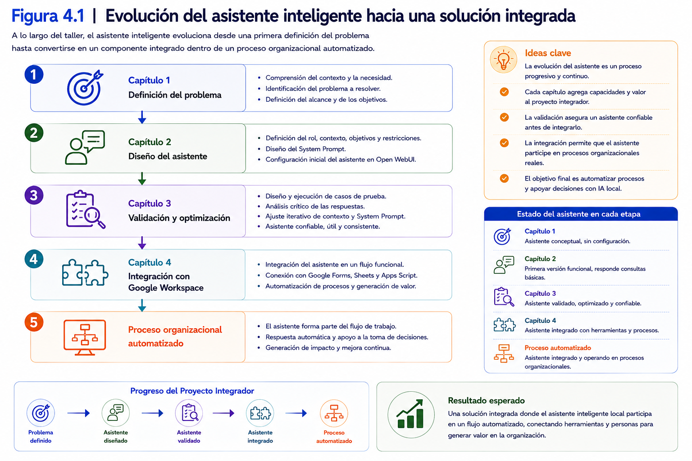
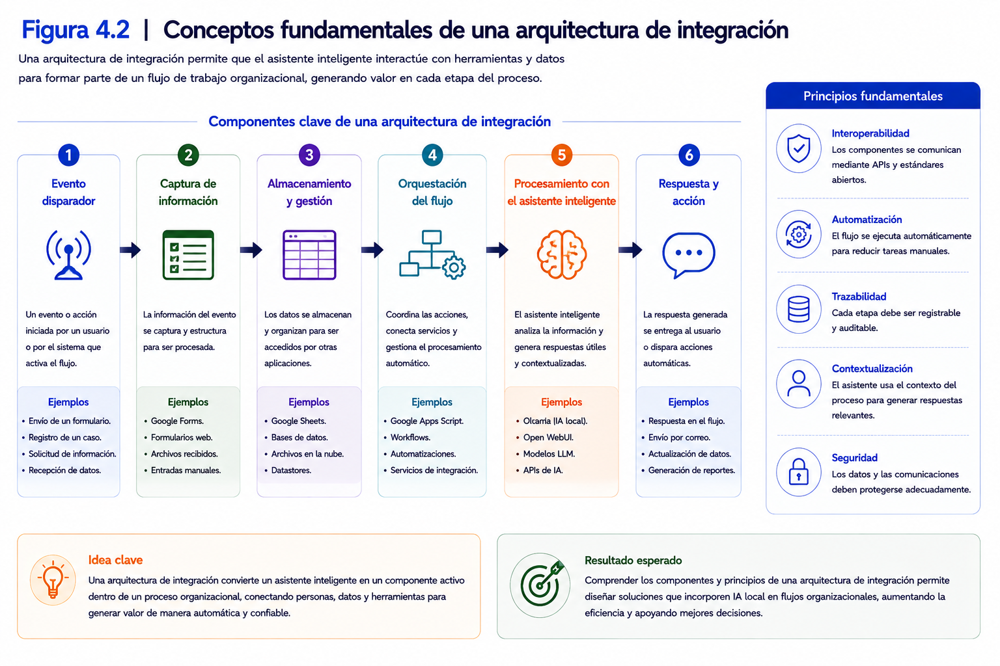
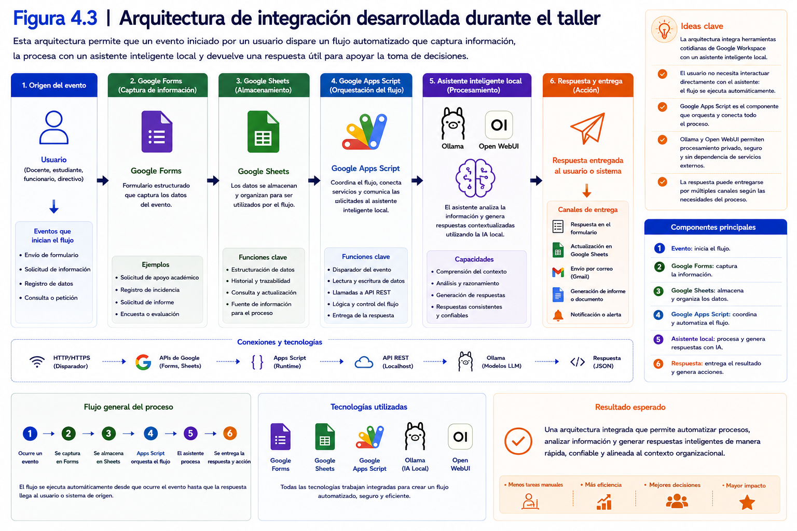
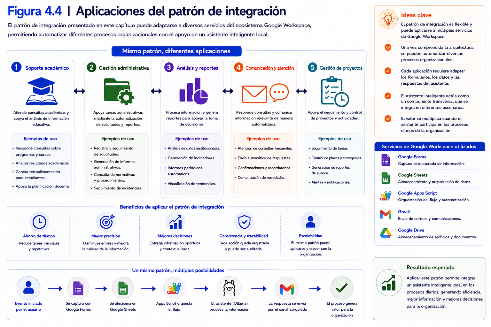
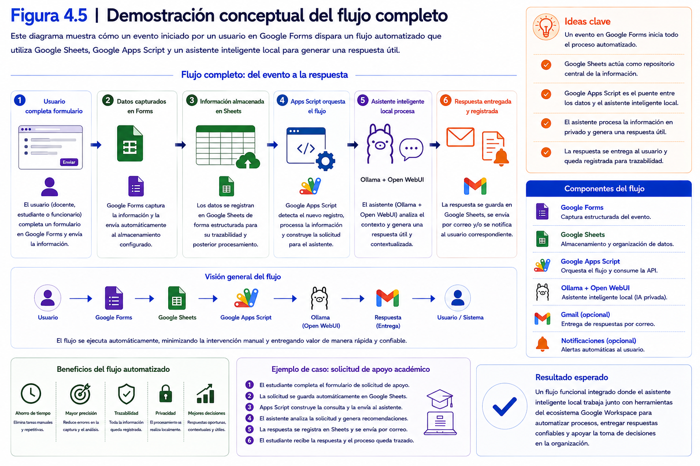
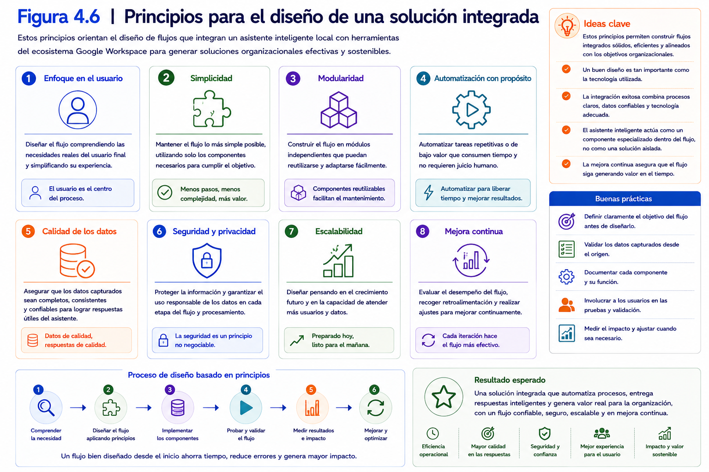
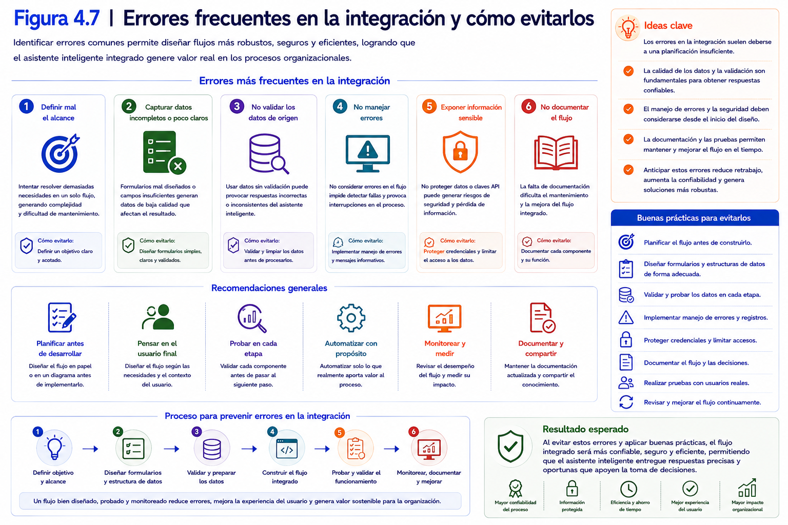
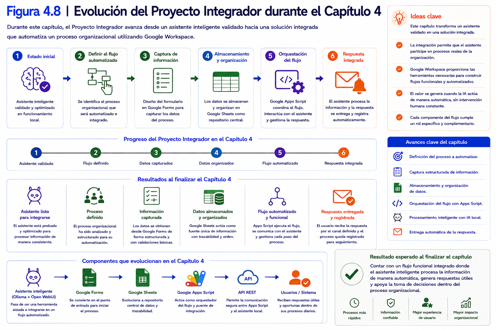
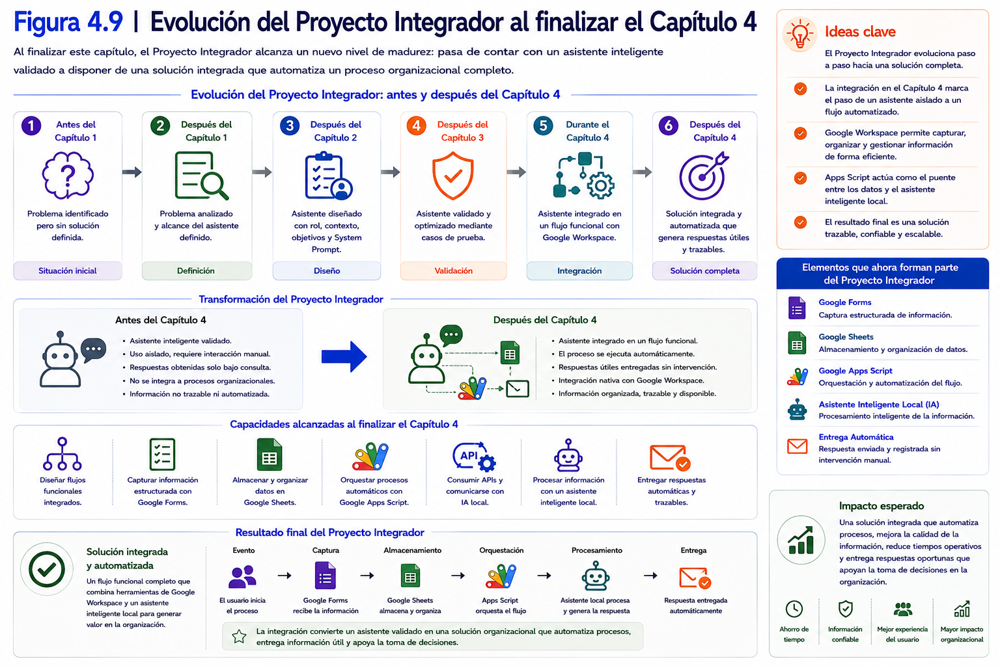

# Capítulo 4
# Integración del asistente inteligente en flujos funcionales

---

## Contenidos del capítulo

1. Introducción
2. Objetivos de aprendizaje
3. Conceptos fundamentales
4. Desarrollo conceptual
5. Ejemplos de aplicación
6. Demostración conceptual
7. Buenas prácticas
8. Errores comunes
9. Relación con el Proyecto Integrador
10. Síntesis del capítulo
11. Preguntas para la reflexión
12. Bibliografía y recursos recomendados

---

# 1. Introducción

Durante los capítulos anteriores del taller se desarrolló progresivamente un asistente inteligente especializado capaz de apoyar el análisis y la toma de decisiones dentro de un contexto disciplinar específico.

En primer lugar, se analizaron los fundamentos de la Inteligencia Artificial Generativa Local y se definió el problema que el asistente debía resolver. Posteriormente, se diseñó su estructura, estableciendo el rol, el contexto, los objetivos, las restricciones y el *System Prompt*. Finalmente, se aplicó una metodología de validación que permitió optimizar su comportamiento mediante casos de prueba y un proceso iterativo de mejora continua.

Al concluir el capítulo anterior, la directora académica disponía de un asistente inteligente capaz de responder consultas de manera consistente y confiable.

Sin embargo, todavía existía una limitación importante.

El asistente únicamente podía utilizarse cuando una persona interactuaba directamente con él.

En otras palabras, se trataba de una herramienta aislada.

En un entorno organizacional, los procesos rara vez comienzan cuando un usuario abre una aplicación de Inteligencia Artificial.

Por el contrario, normalmente se inician cuando ocurre un evento dentro de la organización.

Por ejemplo:

- un docente completa un formulario;
- un estudiante solicita apoyo académico;
- un funcionario registra una incidencia;
- un directivo requiere un informe;
- un usuario envía una consulta institucional.

Cada uno de estos eventos genera información que posteriormente debe ser analizada para apoyar una decisión o ejecutar una acción determinada.

En este contexto, el verdadero potencial de un asistente inteligente no radica únicamente en su capacidad para responder preguntas, sino en su posibilidad de integrarse con los procesos habituales de una organización.

La integración permite que el asistente deje de ser una aplicación independiente y pase a formar parte de un flujo de trabajo donde interactúa con otras herramientas utilizadas diariamente por las personas.

Durante este capítulo se estudiará cómo incorporar un asistente inteligente local dentro de un flujo funcional utilizando servicios del ecosistema Google Workspace.

Más que aprender el funcionamiento particular de cada herramienta, el objetivo será comprender un patrón general de integración que posteriormente podrá adaptarse a diferentes escenarios organizacionales.

Desde esta perspectiva, Google Forms actuará como el mecanismo de captura de información, Google Sheets permitirá registrar y organizar los datos, Google Apps Script coordinará el flujo de trabajo y el asistente inteligente procesará la información para generar una respuesta útil que apoye la toma de decisiones.

Aunque el laboratorio de este capítulo utilizará este flujo como caso de referencia, la misma arquitectura podrá extenderse posteriormente a otros servicios del ecosistema Google Workspace, como Gmail, Google Drive, Google Docs o Google Calendar.

De este modo, el participante comprenderá que el valor de la Inteligencia Artificial Generativa no reside únicamente en la generación de respuestas, sino en su capacidad para integrarse de manera natural con los procesos digitales de una organización.

Al finalizar este capítulo, cada participante será capaz de comprender la arquitectura general de una solución integrada basada en IA local y de implementar un flujo funcional donde un asistente inteligente interactúe con herramientas del ecosistema Google Workspace para automatizar una tarea específica.

---

  

---

### Ideas clave

Al finalizar esta introducción, el participante debería comprender que:

- Un asistente inteligente validado constituye solamente una parte de la solución tecnológica.
- El verdadero valor de la Inteligencia Artificial Generativa se alcanza cuando el asistente se integra con los procesos habituales de una organización.
- Google Workspace proporciona un conjunto de herramientas que permiten construir flujos funcionales donde la IA participa como un componente más del proceso.
- El laboratorio utilizará un único patrón de integración basado en Google Forms, Google Sheets y Google Apps Script, el cual podrá adaptarse posteriormente a otros servicios del ecosistema Google.
- La integración representa el paso que transforma un asistente inteligente en una solución organizacional orientada al apoyo del análisis y la toma de decisiones.

# 2. Objetivos de aprendizaje

Al finalizar este capítulo, el participante será capaz de:

- Comprender la importancia de integrar un asistente inteligente dentro de un flujo de trabajo para apoyar procesos de análisis y toma de decisiones.

- Diferenciar un asistente inteligente utilizado de forma aislada de una solución integrada dentro de un proceso organizacional.

- Identificar los principales componentes que intervienen en un flujo de automatización basado en Inteligencia Artificial Generativa Local y Google Workspace.

- Comprender el rol que desempeñan Google Forms, Google Sheets y Google Apps Script dentro de una arquitectura de integración.

- Analizar el funcionamiento general de un flujo donde un evento iniciado por un usuario desencadena el procesamiento automático de información mediante un asistente inteligente local.

- Comprender los principios básicos del consumo de APIs REST como mecanismo de comunicación entre aplicaciones y modelos de Inteligencia Artificial.

- Reconocer el patrón general de integración desarrollado durante este capítulo y su potencial para adaptarse a otros servicios del ecosistema Google Workspace.

- Preparar el asistente inteligente validado durante el capítulo anterior para su incorporación en un proceso organizacional automatizado.

---

## Competencias que se desarrollan durante este capítulo

Durante este capítulo el participante fortalecerá competencias relacionadas con:

- Diseño de soluciones integradas basadas en Inteligencia Artificial Generativa.
- Automatización de procesos mediante herramientas digitales.
- Comprensión de arquitecturas de integración entre aplicaciones.
- Consumo básico de servicios mediante APIs REST.
- Análisis de flujos de información dentro de procesos organizacionales.
- Integración de asistentes inteligentes con herramientas del ecosistema Google Workspace.

---

## Vinculación con el Proyecto Integrador

Durante los capítulos anteriores, el Proyecto Integrador se concentró en el diseño y la validación de un asistente inteligente especializado.

En este capítulo el foco cambia.

El asistente deja de ser el producto final y pasa a convertirse en uno de los componentes de una solución más amplia.

Como resultado de la exposición teórica, el laboratorio guiado y el trabajo sobre el Proyecto Integrador, cada participante será capaz de:

- identificar un proceso organizacional susceptible de automatización;
- comprender la arquitectura general del flujo de integración;
- incorporar su asistente inteligente dentro de dicho flujo;
- analizar el intercambio de información entre los distintos componentes;
- verificar el funcionamiento completo de la solución.

El resultado esperado no será únicamente un asistente funcional, sino una solución integrada capaz de recibir información desde un formulario, procesarla mediante Inteligencia Artificial Generativa Local y registrar automáticamente los resultados obtenidos.

---

## Alcance de la integración

Es importante destacar que el objetivo de este capítulo no consiste en estudiar exhaustivamente todas las herramientas disponibles dentro de Google Workspace.

Por el contrario, el propósito es comprender un patrón general de integración que posteriormente pueda adaptarse a diferentes servicios del ecosistema.

Por razones metodológicas, el laboratorio utilizará como flujo de referencia la integración entre:

- Google Forms;
- Google Sheets;
- Google Apps Script;
- Asistente inteligente local.

Una vez comprendido este patrón, el participante estará en condiciones de extrapolar la misma lógica de integración hacia otras herramientas como Gmail, Google Drive, Google Docs o Google Calendar.

---

### Al finalizar este capítulo...

El participante comprenderá que un asistente inteligente adquiere su verdadero valor cuando forma parte de un proceso organizacional completo.

Más allá de la tecnología utilizada, habrá desarrollado una visión sistémica de la automatización, identificando cómo distintas herramientas colaboran para capturar información, procesarla mediante Inteligencia Artificial y generar respuestas que apoyen el análisis y la toma de decisiones.

Esta perspectiva constituirá el principal aprendizaje del cuarto capítulo y preparará el camino para la consolidación del Proyecto Integrador.

# 3. Conceptos fundamentales

Hasta este momento del taller, el asistente inteligente había sido concebido como una aplicación independiente con la que un usuario interactuaba directamente mediante una interfaz conversacional.

Sin embargo, en la mayoría de las organizaciones los procesos no comienzan cuando una persona abre un asistente de Inteligencia Artificial.

Normalmente, los procesos se inician cuando ocurre un evento dentro de un sistema de información.

Por ejemplo:

- un usuario completa un formulario;
- se registra una solicitud;
- se genera un nuevo documento;
- se recibe un correo electrónico;
- se actualiza una base de datos.

A partir de ese momento, distintas aplicaciones colaboran entre sí para procesar la información y generar una respuesta.

Comprender esta interacción constituye el objetivo principal del presente capítulo.

---

## 3.1 Flujo de trabajo

Un **flujo de trabajo** (*workflow*) corresponde a una secuencia ordenada de actividades mediante las cuales la información avanza desde un punto de inicio hasta la obtención de un resultado.

Cada actividad transforma, procesa o comunica información hacia la siguiente etapa del proceso.

En un flujo automatizado, estas actividades son ejecutadas parcial o totalmente por sistemas informáticos, reduciendo la intervención manual de las personas.

---

## 3.2 Automatización de procesos

La **automatización de procesos** consiste en utilizar herramientas tecnológicas para ejecutar tareas repetitivas de manera automática, siguiendo reglas previamente definidas.

El propósito de la automatización no es reemplazar completamente la participación humana, sino reducir tareas operativas, disminuir errores y agilizar la ejecución de los procesos.

Cuando la Inteligencia Artificial se incorpora dentro de un flujo automatizado, deja de actuar únicamente como un sistema de consulta y comienza a participar activamente en la generación de respuestas, clasificaciones, recomendaciones o análisis.

---

## 3.3 Integración de sistemas

La **integración de sistemas** corresponde al proceso mediante el cual diferentes aplicaciones intercambian información para trabajar como una solución única.

Cada sistema mantiene una función específica, pero todos colaboran para ejecutar un proceso común.

En este capítulo, por ejemplo, cada componente desempeñará un rol claramente definido:

- Google Forms capturará la información.
- Google Sheets almacenará los datos.
- Google Apps Script coordinará el flujo.
- El asistente inteligente procesará la consulta.
- Google Sheets registrará nuevamente el resultado obtenido.

Ninguna de estas herramientas resuelve por sí sola el problema.

El valor surge de la integración entre todas ellas.

---

## 3.4 Evento

Un **evento** corresponde a la acción que inicia un proceso automatizado.

En un entorno organizacional, un evento puede originarse por múltiples causas.

Por ejemplo:

- el envío de un formulario;
- la creación de un archivo;
- la recepción de un correo electrónico;
- la incorporación de un nuevo registro;
- la modificación de un documento.

Cada evento representa el punto de partida del flujo de trabajo.

---

## 3.5 API

Una **API** (*Application Programming Interface*) constituye un mecanismo que permite la comunicación entre aplicaciones.

Gracias a una API, un sistema puede solicitar información o servicios a otro sistema utilizando un conjunto previamente definido de reglas.

En este taller, la comunicación entre los servicios de Google Workspace y el modelo ejecutado localmente mediante Ollama se realizará a través de un mecanismo de integración. Google Apps Script expondrá servicios web para intercambiar información con un programa local desarrollado en Python (`puente_local.py`), el cual se comunicará con la API de Ollama para procesar las consultas.

El participante no desarrollará una API propia.

Su objetivo será comprender cómo utilizar una API existente para integrar aplicaciones dentro de un flujo automatizado.

---

## 3.6 API REST

Una **API REST** es un tipo de API ampliamente utilizado para intercambiar información mediante solicitudes realizadas sobre la red.

En términos generales, una aplicación envía una solicitud, otra aplicación la procesa y posteriormente devuelve una respuesta.

Este mecanismo constituye uno de los principales medios de comunicación entre aplicaciones modernas y representa la base de numerosos procesos de integración utilizados actualmente en organizaciones públicas y privadas.

---

## 3.7 Arquitectura de integración

La **arquitectura de integración** corresponde a la forma en que los distintos componentes de una solución se organizan para colaborar entre sí.

En este capítulo se utilizará una arquitectura sencilla compuesta por cinco elementos principales:

- Captura de la información.
- Registro de los datos.
- Coordinación del flujo.
- Procesamiento mediante Inteligencia Artificial.
- Registro de los resultados.

Comprender esta arquitectura resulta más importante que memorizar una herramienta específica, ya que el mismo patrón puede implementarse posteriormente utilizando otras tecnologías.

---

  

---

### Ideas clave

Al finalizar esta sección, el participante debería comprender que:

- Un flujo de trabajo corresponde a una secuencia organizada de actividades orientadas a alcanzar un objetivo.
- La automatización permite ejecutar tareas repetitivas utilizando herramientas digitales.
- La integración de sistemas consiste en hacer que diferentes aplicaciones colaboren dentro de un mismo proceso.
- Un evento constituye el mecanismo que inicia un flujo automatizado.
- Las APIs permiten la comunicación entre aplicaciones.
- La arquitectura de integración representa la organización de todos los componentes que participan en una solución basada en Inteligencia Artificial.

# 4. Desarrollo conceptual

Hasta este momento del taller, el asistente inteligente funcionaba como una aplicación independiente. Un usuario formulaba una consulta directamente y el modelo generaba una respuesta utilizando el contexto y las instrucciones definidas durante los capítulos anteriores.

Sin embargo, en la mayoría de las organizaciones las personas no interactúan permanentemente con un asistente de Inteligencia Artificial.

Las actividades cotidianas se desarrollan mediante formularios, hojas de cálculo, sistemas de gestión, documentos compartidos y múltiples herramientas que forman parte del ecosistema digital de la institución.

Por esta razón, el verdadero desafío no consiste únicamente en desarrollar un asistente inteligente, sino en incorporarlo dentro de un proceso existente, permitiendo que participe de manera natural en el flujo de información de la organización.

En esta sección se presenta una arquitectura de integración sencilla que servirá como modelo para el laboratorio y posteriormente para el Proyecto Integrador.

---

## 4.1 De un asistente a una solución integrada

Un asistente inteligente representa solamente uno de los componentes de una solución tecnológica.

Para generar valor dentro de una organización es necesario que interactúe con otros sistemas que permitan:

- capturar información;
- almacenar datos;
- coordinar el flujo de trabajo;
- procesar consultas;
- registrar resultados.

Cuando estos componentes trabajan de manera coordinada, el asistente deja de ser una aplicación aislada y pasa a formar parte de un proceso organizacional automatizado.

---

## 4.2 Arquitectura propuesta para el taller

Durante este taller se utilizará una arquitectura integrada por distintos componentes que cumplen funciones específicas dentro del flujo de trabajo.

### Captura de información

El proceso comienza cuando un usuario completa un formulario electrónico.

En nuestro caso de estudio, un docente registra una consulta académica mediante Google Forms.

El formulario constituye el punto de entrada del flujo de trabajo.

---

### Registro de la información

Cada respuesta enviada desde el formulario se almacena automáticamente en Google Sheets.

La hoja de cálculo cumple una doble función:

- almacenar la información recibida;
- actuar como punto de intercambio entre los distintos componentes del proceso.

---

### Coordinación del proceso

Google Apps Script permite gestionar el intercambio de información entre Google Sheets y el componente local de la solución. A través del Web App, expone las solicitudes pendientes y recibe posteriormente las respuestas generadas por el modelo.

Por su parte, el programa `puente_local.py` consulta periódicamente este servicio para identificar nuevas solicitudes y coordinar su procesamiento mediante Ollama.

Entre otras tareas, este componente puede:

- identificar nuevas solicitudes;
- preparar la información;
- comunicarse con el asistente inteligente;
- registrar la respuesta obtenida.

La coordinación del proceso se distribuye entre Google Apps Script y `puente_local.py`: Apps Script gestiona el intercambio de información con Google Sheets, mientras que `puente_local.py` coordina el procesamiento de las solicitudes en el entorno local.

---

### Procesamiento mediante IA

Una vez recuperada la solicitud, `puente_local.py` prepara la información y envía la consulta al modelo ejecutado localmente mediante Ollama.

Para ello utiliza el _System Prompt_ definido para el asistente y los datos correspondientes a la solicitud.

Ollama procesa localmente la consulta y devuelve la respuesta generada a `puente_local.py`.

El asistente analiza la información utilizando:

- el contexto disciplinar;
- el rol definido;
- las restricciones;
- el *System Prompt* validado durante el capítulo anterior.

Como resultado genera una respuesta acorde al problema planteado.

---

### Registro del resultado

Finalmente, la respuesta generada por el asistente vuelve a registrarse en Google Sheets.

De esta forma, toda la información del proceso queda almacenada en un único lugar.

Esto facilita:

- la revisión posterior;
- la auditoría del proceso;
- el seguimiento de las consultas;
- el análisis histórico de la información.

---

## 4.3 El patrón general de integración

Aunque el laboratorio utilizará Google Workspace como plataforma de referencia, la arquitectura presentada responde a un patrón ampliamente utilizado en proyectos de automatización.

Este patrón puede resumirse en cinco etapas:

1. Capturar información.
2. Almacenar los datos.
3. Procesar la información.
4. Generar una respuesta.
5. Registrar el resultado.

Cada organización podrá implementar estas etapas utilizando diferentes tecnologías.

Lo importante no es la herramienta utilizada, sino comprender cómo fluye la información entre los distintos componentes del proceso.

---

## 4.4 El rol del asistente inteligente dentro del flujo

Un aspecto importante consiste en comprender que el asistente inteligente no controla el proceso.

Su función es únicamente procesar la información que recibe y generar una respuesta.

La coordinación del flujo permanece a cargo del mecanismo de automatización.

Esta separación de responsabilidades ofrece múltiples ventajas.

Por ejemplo:

- facilita el mantenimiento del sistema;
- permite reemplazar el asistente sin modificar el resto del flujo;
- simplifica futuras ampliaciones;
- mejora la escalabilidad de la solución.

En consecuencia, el asistente debe entenderse como un servicio especializado que participa dentro de un proceso mayor y no como el proceso completo.

---

## 4.5 Un patrón reutilizable

La arquitectura presentada durante este capítulo constituye un ejemplo de integración.

Sin embargo, el mismo principio puede aplicarse posteriormente a numerosos escenarios organizacionales.

Por ejemplo:

- responder consultas recibidas por correo electrónico;
- clasificar documentos almacenados en Google Drive;
- analizar información registrada en hojas de cálculo;
- generar respuestas automáticas a solicitudes internas;
- apoyar procesos administrativos mediante formularios digitales.

En todos estos casos, el patrón general permanece inalterado.

Lo único que cambia es el origen de la información y la herramienta utilizada para capturar el evento que inicia el proceso.

---

  

---

### Ideas clave

Al finalizar esta sección, el participante debería comprender que:

- Un asistente inteligente representa únicamente uno de los componentes de una solución integrada.
- La automatización requiere coordinar distintas herramientas que colaboran dentro de un mismo flujo de trabajo.
- Google Forms, Google Sheets, Google Apps Script y el asistente inteligente desempeñan funciones claramente diferenciadas.
- El patrón de integración desarrollado durante el taller puede reutilizarse posteriormente en otros procesos organizacionales.
- El valor de una solución basada en Inteligencia Artificial depende tanto de la calidad del asistente como del diseño del flujo donde éste participa.

# 5. Ejemplos de aplicación

La arquitectura de integración presentada en este capítulo puede implementarse en múltiples contextos organizacionales.

Aunque las herramientas utilizadas durante el laboratorio corresponden al ecosistema Google Workspace, el principio de funcionamiento permanece inalterado: un evento inicia el proceso, la información es procesada por un asistente inteligente y el resultado se incorpora nuevamente al flujo de trabajo.

Los siguientes ejemplos ilustran distintas aplicaciones de este patrón.

---

## Ejemplo 1. Educación superior

Retomemos el caso de la directora académica desarrollado desde el inicio del taller.

Uno de los docentes de la institución necesita orientación respecto de una situación académica relacionada con un estudiante.

En lugar de enviar un correo electrónico o solicitar una reunión, completa un formulario institucional.

### Flujo del proceso

- El docente registra la consulta mediante Google Forms.
- La información queda almacenada automáticamente en Google Sheets.
- Google Apps Script deja disponible la solicitud mediante el Web App.
- `puente_local.py` identifica la solicitud pendiente y la envía al modelo ejecutado mediante Ollama.
- El modelo genera una respuesta utilizando las instrucciones y el _System Prompt_ definidos.
- `puente_local.py` devuelve la respuesta al Web App.
- Google Apps Script registra el resultado en Google Sheets y envía la respuesta al usuario mediante Gmail.

### Resultado

La directora académica dispone de una respuesta estructurada y documentada sin intervenir manualmente durante el proceso.

El tiempo de atención disminuye y todas las consultas quedan registradas para futuras revisiones.

---

## Ejemplo 2. Recursos Humanos

Una organización recibe diariamente solicitudes relacionadas con vacaciones, permisos administrativos y licencias.

Cada colaborador completa un formulario electrónico.

El asistente inteligente interpreta la solicitud utilizando la normativa interna de la institución y genera una respuesta preliminar que queda registrada para revisión del área de Recursos Humanos.

En este caso, la Inteligencia Artificial no reemplaza la decisión final, sino que agiliza el análisis inicial de cada solicitud.

---

## Ejemplo 3. Mesa de ayuda tecnológica

El departamento de informática utiliza un formulario para registrar incidencias reportadas por los usuarios.

Cada nuevo registro activa automáticamente el flujo de integración.

El asistente analiza la descripción del problema, identifica posibles causas y propone una primera recomendación basada en la documentación técnica disponible.

Posteriormente, el equipo de soporte revisa la respuesta antes de atender el requerimiento.

---

## Ejemplo 4. Gestión documental

Una institución recibe solicitudes relacionadas con distintos procedimientos administrativos.

Cada solicitud se registra mediante un formulario electrónico.

El asistente analiza el contenido, identifica el tipo de trámite y genera una clasificación preliminar que posteriormente será utilizada por los funcionarios responsables.

Este proceso reduce considerablemente el tiempo necesario para organizar la información recibida.

---

## Ejemplo 5. Investigación académica

Un grupo de investigación desarrolla un formulario para registrar observaciones realizadas durante un trabajo de campo.

Cada registro activa automáticamente un proceso donde el asistente resume la información, identifica palabras clave y genera una síntesis preliminar que queda almacenada junto con los datos originales.

Posteriormente, los investigadores revisan y validan estos resultados antes de incorporarlos al análisis definitivo.

---

## ¿Qué tienen en común estos ejemplos?

Aunque pertenecen a organizaciones y disciplinas diferentes, todos utilizan exactamente la misma arquitectura de integración.

En todos los casos se observa la siguiente secuencia:

1. Un usuario genera un evento.
2. La información es capturada mediante un formulario.
3. Los datos se almacenan automáticamente.
4. Un mecanismo de automatización coordina el proceso.
5. El asistente inteligente analiza la información.
6. El resultado vuelve al flujo de trabajo.

Lo que cambia entre un escenario y otro no es la arquitectura, sino el propósito del proceso y el contexto disciplinar del asistente inteligente.

---

  

---

### Ideas clave

Al finalizar esta sección, el participante debería comprender que:

- La arquitectura de integración propuesta puede aplicarse en distintos contextos organizacionales.
- El flujo de trabajo permanece prácticamente inalterado, independientemente del área de aplicación.
- El valor de la solución no depende de una herramienta específica, sino de la correcta integración entre los distintos componentes.
- El asistente inteligente participa como un servicio especializado dentro del proceso y no como un sistema independiente.
- Comprender el patrón general de integración permitirá adaptar posteriormente esta solución a otros servicios del ecosistema Google Workspace.

# 6. Demostración conceptual

Hasta este momento se ha estudiado la arquitectura general de una solución integrada basada en Inteligencia Artificial Generativa Local y Google Workspace.

A continuación se desarrollará una demostración conceptual utilizando el mismo caso de estudio trabajado desde el inicio del taller.

El objetivo consiste en mostrar cómo un asistente inteligente deja de funcionar como una aplicación independiente y pasa a integrarse dentro de un proceso organizacional automatizado.

---

## Caso de estudio

Recordemos que la directora académica dispone de un asistente inteligente validado durante el capítulo anterior.

Este asistente fue diseñado para apoyar la interpretación de información académica y responder consultas relacionadas con indicadores institucionales, normativa y procedimientos internos.

Ahora el desafío consiste en permitir que los docentes interactúen con este asistente sin necesidad de abrir directamente Open WebUI.

La interacción se realizará mediante un formulario institucional.

---

## Paso 1. El usuario inicia el proceso

Un docente necesita orientación respecto de una situación académica.

En lugar de enviar un correo electrónico o comunicarse directamente con la directora académica, completa un formulario institucional utilizando Google Forms.

Por ejemplo:

**Nombre del docente**

María González.

**Tipo de consulta**

Normativa académica.

**Consulta**

> ¿Cuál es el procedimiento institucional para estudiantes que superan el porcentaje máximo de inasistencia permitido?

Al presionar el botón **Enviar**, comienza automáticamente el flujo de trabajo.

---

## Paso 2. Registro de la información

Google Forms almacena automáticamente la información recibida en Google Sheets.

La hoja de cálculo contiene ahora un nuevo registro con todos los antecedentes ingresados por el docente.

En este momento todavía no existe ninguna intervención del asistente inteligente.

La información simplemente ha sido capturada y almacenada.

---

## Paso 3. Activación del flujo

La nueva respuesta queda registrada en Google Sheets con estado `PENDIENTE`.

Google Apps Script permite que esta solicitud quede disponible a través del Web App. El programa `puente_local.py`, ejecutado en el entorno local, consulta periódicamente este servicio e identifica las solicitudes pendientes para iniciar su procesamiento.

Una vez recuperada la solicitud, `puente_local.py` construye el mensaje correspondiente y lo envía a Ollama para obtener una respuesta del modelo.

---

## Paso 4. Procesamiento mediante IA

`puente_local.py` envía la consulta al modelo ejecutado localmente mediante Ollama.

Para ello utiliza el _System Prompt_ definido para el asistente y los datos correspondientes a la solicitud recuperada desde Google Sheets.

En este flujo automatizado, Open WebUI no participa directamente en la comunicación. Su función corresponde principalmente a la interacción y configuración visual del asistente, mientras que `puente_local.py` se comunica directamente con la API de Ollama.

---

## Paso 5. Registro del resultado

Una vez generada la respuesta, `puente_local.py` la devuelve al Web App mediante una solicitud HTTP. Google Apps Script registra la respuesta en Google Sheets, almacena la fecha de procesamiento y envía automáticamente un correo electrónico al usuario mediante Gmail.

Si el proceso finaliza correctamente, la solicitud queda registrada con el estado `ENVIADA`. Si ocurre un problema durante el procesamiento o envío, el estado permite identificar que se produjo un error.

Ahora la hoja contiene tanto la consulta original como la respuesta generada por el asistente.

Toda la información permanece disponible para:

- seguimiento;
- revisión;
- auditoría;
- análisis posterior.

---

## Paso 6. Resultado final

El usuario recibe la respuesta directamente en el correo electrónico registrado en el formulario, sin necesidad de acceder a Open WebUI ni consultar manualmente Google Sheets.

---

## ¿Qué aprenderemos durante el laboratorio?

La demostración desarrollada en esta sección representa exactamente el flujo que será implementado durante el laboratorio.

La diferencia es que, durante la actividad práctica, cada participante configurará los distintos componentes de la arquitectura y verificará el funcionamiento completo del proceso.

Al finalizar el laboratorio, el flujo permitirá:

- capturar una consulta mediante Google Forms;
- registrar automáticamente la información en Google Sheets;
- identificar y procesar solicitudes pendientes mediante `puente_local.py`;
- enviar la consulta al modelo ejecutado localmente mediante Ollama;
- obtener una respuesta generada por IA;
- registrar automáticamente la respuesta y su estado en Google Sheets;
- enviar la respuesta al usuario mediante Gmail.

Este mismo patrón será posteriormente adaptado por cada participante para resolver el problema definido en su Proyecto Integrador.

---

  

---

### Ideas clave

Al finalizar esta demostración, el participante debería comprender que:

- El flujo automatizado comienza cuando ocurre un evento, en este caso el envío de un formulario.
- Google Forms, Google Sheets, Google Apps Script y el asistente inteligente desempeñan funciones claramente diferenciadas.
- El asistente inteligente actúa como un servicio especializado dentro del proceso y no como el controlador del flujo.
- Toda la información generada durante el proceso puede registrarse para facilitar su seguimiento y análisis.
- El laboratorio implementará exactamente la arquitectura presentada en esta demostración conceptual.

# 7. Buenas prácticas

La integración de un asistente inteligente dentro de un proceso organizacional requiere mucho más que conectar aplicaciones entre sí.

Una solución de calidad debe ser comprensible, mantenible, escalable y confiable. Para ello, resulta recomendable seguir una serie de principios que faciliten el diseño del flujo y reduzcan la probabilidad de errores durante su implementación.

Las siguientes recomendaciones corresponden a buenas prácticas ampliamente utilizadas en proyectos de automatización de procesos y constituyen una guía para el desarrollo del laboratorio y del Proyecto Integrador.

---

## 7.1 Diseñar primero el proceso y luego seleccionar las herramientas

Uno de los errores más frecuentes consiste en comenzar un proyecto preguntándose qué herramienta utilizar.

En realidad, el punto de partida siempre debe ser el proceso que se desea mejorar.

Una vez comprendido el flujo de trabajo, resulta mucho más sencillo identificar qué herramientas cumplen mejor cada función.

Durante este taller, Google Forms, Google Sheets y Google Apps Script representan una implementación concreta de un patrón de integración, pero el mismo principio puede aplicarse utilizando otras plataformas.

---

## 7.2 Asignar una responsabilidad específica a cada componente

Cada elemento de la arquitectura debe cumplir una función claramente definida.

Por ejemplo:

- Google Forms captura información.
- Google Sheets almacena los datos.
- Google Apps Script coordina el flujo.
- El asistente inteligente procesa la consulta.

Evitar que una misma herramienta asuma múltiples responsabilidades facilita el mantenimiento de la solución y simplifica futuras modificaciones.

---

## 7.3 Mantener el asistente independiente del flujo

El asistente inteligente debe comportarse como un servicio especializado.

No debería depender de un formulario específico ni de una hoja de cálculo determinada.

Mientras más independiente sea el asistente del resto de la arquitectura, mayor será la posibilidad de reutilizarlo posteriormente en otros procesos organizacionales.

---

## 7.4 Diseñar flujos simples y fáciles de comprender

Un flujo excesivamente complejo resulta más difícil de implementar, mantener y depurar.

Siempre que sea posible, conviene comenzar con una arquitectura sencilla y posteriormente incorporar nuevas funcionalidades de manera gradual.

La simplicidad favorece la comprensión del proceso y reduce la probabilidad de errores.

---

## 7.5 Registrar toda la información relevante

Cada etapa importante del flujo debería dejar evidencia de su ejecución.

Registrar tanto la información de entrada como la respuesta generada por el asistente permite:

- revisar el funcionamiento del proceso;
- identificar errores;
- analizar resultados históricos;
- apoyar auditorías posteriores.

La trazabilidad constituye un elemento fundamental en cualquier proceso automatizado.

---

## 7.6 Considerar siempre el manejo de errores

No todos los procesos finalizarán correctamente.

Por ejemplo, pueden producirse situaciones como:

- ausencia de conexión con el asistente;
- información incompleta en el formulario;
- errores durante la comunicación mediante la API;
- respuestas vacías o inesperadas.

Aunque durante este taller se implementará un flujo simplificado, resulta importante comprender que toda solución profesional debe considerar mecanismos para detectar, registrar y gestionar este tipo de situaciones.

---

## 7.7 Proteger la información procesada

Los procesos automatizados pueden involucrar información institucional, administrativa o académica.

Por ello, es recomendable aplicar criterios básicos de protección de datos, tales como:

- limitar el acceso a la información;
- evitar almacenar datos innecesarios;
- registrar únicamente los antecedentes requeridos para el proceso;
- revisar periódicamente los permisos de acceso a los recursos utilizados.

Estas medidas contribuyen a fortalecer la seguridad y la confiabilidad de la solución.

---

## 7.8 Pensar en la reutilización del flujo

Una buena arquitectura no resuelve únicamente un problema puntual.

También facilita que el mismo patrón pueda utilizarse posteriormente para automatizar otros procesos.

Al diseñar el flujo resulta conveniente preguntarse:

- ¿Podría utilizar este mismo proceso en otro contexto?
- ¿Qué componentes podrían reutilizarse?
- ¿Qué elementos dependen exclusivamente de este caso de estudio?

Responder estas preguntas favorece el desarrollo de soluciones más flexibles y sostenibles.

---

  

---

### Ideas clave

Al finalizar esta sección, el participante debería comprender que:

- La arquitectura debe diseñarse considerando primero el proceso y luego las herramientas.
- Cada componente del flujo debe cumplir una responsabilidad claramente definida.
- El asistente inteligente debe mantenerse desacoplado del mecanismo de automatización.
- La simplicidad, la trazabilidad y el manejo de errores fortalecen la calidad de la solución.
- Un buen patrón de integración puede reutilizarse posteriormente para automatizar distintos procesos organizacionales.

# 8. Errores comunes

Integrar un asistente inteligente dentro de un flujo automatizado requiere comprender tanto el funcionamiento del asistente como la interacción entre los distintos componentes de la solución.

Durante el diseño e implementación de este tipo de arquitecturas es frecuente cometer errores que afectan la estabilidad, la mantenibilidad o la utilidad del proceso.

Reconocer estas situaciones permitirá desarrollar soluciones más robustas y facilitará la implementación del laboratorio y del Proyecto Integrador.

---

## 8.1 Pensar que la Inteligencia Artificial es el proceso completo

Uno de los errores más frecuentes consiste en considerar que el asistente inteligente representa toda la solución.

En realidad, el asistente constituye únicamente uno de los componentes del flujo de trabajo.

La captura de información, la coordinación del proceso, el almacenamiento de datos y el registro de resultados continúan siendo funciones indispensables para el correcto funcionamiento de la solución.

---

## 8.2 Diseñar el flujo en función de una herramienta

Es habitual comenzar un proyecto preguntándose cómo utilizar una determinada plataforma.

Sin embargo, cuando el diseño depende exclusivamente de una herramienta, la solución pierde flexibilidad y resulta difícil adaptarla a nuevos escenarios.

El proceso debe diseñarse primero; posteriormente se seleccionan las herramientas más adecuadas para implementarlo.

---

## 8.3 Asignar múltiples responsabilidades a un mismo componente

En ocasiones se intenta que una única herramienta capture información, procese los datos, coordine el flujo y almacene los resultados.

Este enfoque incrementa la complejidad de la solución y dificulta su mantenimiento.

Cada componente debe desempeñar una función específica dentro de la arquitectura.

---

## 8.4 No considerar el manejo de errores

Todo proceso automatizado puede enfrentar situaciones inesperadas.

Por ejemplo:

- el formulario contiene información incompleta;
- el asistente no responde dentro del tiempo esperado;
- se interrumpe la comunicación entre aplicaciones;
- la respuesta generada no puede registrarse correctamente.

Ignorar estas situaciones puede provocar que el proceso se detenga sin que los usuarios conozcan la causa del problema.

---

## 8.5 Acoplar excesivamente el asistente al flujo

Otro error consiste en desarrollar un asistente que dependa exclusivamente de un formulario, una hoja de cálculo o un proceso específico.

Cuando esto ocurre, reutilizar el asistente en otros contextos requiere modificar gran parte de la solución.

Mantener una adecuada separación entre el asistente y el mecanismo de automatización favorece la reutilización y simplifica futuras mejoras.

---

## 8.6 Automatizar procesos innecesarios

No todas las actividades requieren Inteligencia Artificial.

En algunos casos, una regla simple o una automatización convencional puede resolver el problema de manera más eficiente.

Antes de incorporar un asistente inteligente conviene preguntarse:

- ¿Existe realmente una necesidad de análisis o interpretación?
- ¿La IA aporta un valor adicional al proceso?
- ¿El beneficio obtenido justifica la complejidad de la solución?

La automatización debe responder a una necesidad concreta y no únicamente al interés por utilizar una nueva tecnología.

---

## 8.7 No validar el flujo completo

Es posible comprobar que el asistente responde correctamente y, aun así, que el proceso completo presente fallas.

Por ejemplo:

- el formulario funciona correctamente;
- el asistente genera una respuesta adecuada;
- pero la información nunca llega a la hoja de cálculo.

Por esta razón, la validación debe considerar el comportamiento de toda la arquitectura y no únicamente de uno de sus componentes.

---

## 8.8 Pensar que la integración finaliza cuando el flujo funciona

Una vez implementado el proceso, suele asumirse que el proyecto ha concluido.

Sin embargo, las organizaciones evolucionan continuamente.

Cambian los formularios, se incorporan nuevas necesidades, aparecen nuevos usuarios y se modifican los procedimientos internos.

Como consecuencia, la arquitectura también deberá adaptarse y evolucionar.

La integración constituye un proceso de mejora continua y no una actividad puntual.

---

  

---

### Ideas clave

Al finalizar esta sección, el participante debería comprender que:

- El asistente inteligente representa únicamente un componente de una solución integrada.
- La arquitectura debe diseñarse pensando en el proceso y no en una herramienta específica.
- La separación de responsabilidades facilita el mantenimiento y la reutilización del flujo.
- La validación debe considerar el funcionamiento completo de la solución.
- La integración de procesos constituye una actividad evolutiva que requiere ajustes y mejoras permanentes.

# 9. Relación con el Proyecto Integrador

Durante los tres primeros capítulos del taller, cada participante desarrolló progresivamente un asistente inteligente especializado, capaz de responder consultas relacionadas con un problema propio de su contexto profesional.

En este capítulo comienza una nueva etapa del Proyecto Integrador.

El objetivo ya no consiste únicamente en mejorar el comportamiento del asistente, sino en incorporarlo dentro de un proceso organizacional donde interactúe con otras herramientas digitales para automatizar una tarea específica.

El asistente deja de ser el producto final del proyecto y pasa a convertirse en uno de los componentes de una solución integrada.

---

## ¿Qué desarrollará el participante durante el laboratorio?

Después de la exposición teórica, cada participante implementará un flujo funcional utilizando el patrón de integración estudiado durante este capítulo.

El laboratorio utilizará como arquitectura de referencia la integración entre:

- Google Forms;
- Google Sheets;
- Google Apps Script mediante un Web App;
- `puente_local.py`;
- Ollama y el modelo de lenguaje local;
- Gmail para el envío de las respuestas.

Durante esta actividad, el participante comprenderá cómo se comunican estos componentes y verificará el funcionamiento del flujo completo.

El propósito del laboratorio no será aprender todas las posibilidades del ecosistema Google Workspace, sino comprender un patrón de integración que posteriormente podrá reutilizar en otros escenarios.

---

## Aplicación al Proyecto Integrador

Una vez comprendido el funcionamiento del flujo de referencia, cada participante adaptará esta arquitectura a la problemática definida en capítulos anteriores.

El desafío consistirá en identificar un proceso propio de su contexto profesional donde el asistente inteligente pueda aportar valor mediante la automatización de tareas relacionadas con el análisis de información y la toma de decisiones.

Para ello deberá:

- identificar el evento que dará inicio al proceso;
- definir la información que será capturada;
- integrar su asistente inteligente dentro del flujo;
- verificar el intercambio de información entre los distintos componentes;
- comprobar el funcionamiento de la solución completa.

El objetivo no será replicar exactamente el caso desarrollado durante el laboratorio, sino utilizar el mismo patrón de integración para resolver una necesidad propia.

---

## Producto esperado de este capítulo

Al finalizar este capítulo, cada participante dispondrá de:

- un asistente inteligente integrado dentro de un flujo funcional;
- una arquitectura de automatización completamente operativa;
- un proceso capaz de capturar información, procesarla mediante IA y registrar automáticamente los resultados;
- una base tecnológica preparada para desarrollar el caso de uso definitivo durante los capítulos posteriores.

Esta solución representará el principal avance del Proyecto Integrador y constituirá el punto de partida para la consolidación del portafolio final.

---

## Proyección hacia los capítulos finales

Durante los dos capítulos finales, el trabajo se orientará principalmente al Proyecto Integrador.

El participante utilizará la arquitectura implementada en este capítulo para desarrollar una solución adaptada a su realidad profesional.

En ese contexto podrá:

- ajustar el flujo de automatización;
- mejorar el contexto disciplinar del asistente;
- optimizar el proceso de integración;
- ampliar las funcionalidades cuando resulte pertinente;
- documentar la solución desarrollada.

El resultado esperado será una solución funcional, documentada y alineada con el problema definido al inicio del taller.

---

  

---

### Ideas clave

Al finalizar esta sección, el participante debería comprender que:

- El Proyecto Integrador evoluciona desde un asistente inteligente hacia una solución organizacional integrada.
- El laboratorio proporciona un patrón de integración que servirá como modelo para el desarrollo del proyecto propio.
- La arquitectura implementada durante este capítulo será reutilizada y adaptada durante los dos últimos capítulos.
- El objetivo final consiste en automatizar un proceso real mediante la integración de Inteligencia Artificial Generativa Local con herramientas del ecosistema Google Workspace.
- El valor del Proyecto Integrador dependerá tanto de la calidad del asistente como de la correcta integración entre todos los componentes de la solución.

# 10. Síntesis del capítulo

Durante los capítulos anteriores se diseñó, configuró, validó y optimizó un asistente inteligente especializado para apoyar el análisis y la toma de decisiones dentro de un contexto disciplinar específico.

En este capítulo se dio un paso adicional.

El asistente dejó de concebirse como una aplicación independiente para incorporarse dentro de un flujo de trabajo automatizado, donde interactúa con otras herramientas del ecosistema Google Workspace.

A lo largo del capítulo se analizó cómo una solución basada en Inteligencia Artificial Generativa requiere la integración de distintos componentes que colaboran entre sí para ejecutar un proceso organizacional.

Se presentó una arquitectura de integración compuesta por cinco elementos principales:

1. Captura de la información.
2. Registro de los datos.
3. Coordinación del flujo.
4. Procesamiento mediante Inteligencia Artificial.
5. Registro de los resultados.

Más que estudiar el funcionamiento particular de Google Forms, Google Sheets o Google Apps Script, el propósito fue comprender un patrón general de integración que puede reutilizarse posteriormente en distintos escenarios organizacionales.

Asimismo, se analizaron ejemplos de aplicación en diversas áreas profesionales, demostrando que el mismo principio puede emplearse para automatizar procesos relacionados con educación, recursos humanos, soporte tecnológico, gestión documental e investigación.

Otro aspecto relevante consistió en comprender que el asistente inteligente representa solamente uno de los componentes de la arquitectura.

El verdadero valor de la solución surge cuando todas las herramientas trabajan de manera coordinada para transformar información en conocimiento útil para la organización.

Finalmente, se estableció la relación entre esta arquitectura y el Proyecto Integrador, donde cada participante comenzará a adaptar el patrón de integración a su propia realidad profesional durante los dos últimos capítulos.

---

## ¿Qué hemos logrado hasta este momento?

Al finalizar este capítulo, cada participante habrá construido progresivamente una solución compuesta por:

- un problema organizacional claramente definido;
- un asistente inteligente especializado;
- un proceso sistemático de validación y optimización;
- una arquitectura de integración basada en Google Workspace;
- un flujo automatizado funcional preparado para evolucionar hacia una solución aplicada.

El Proyecto Integrador ha dejado de ser únicamente un asistente inteligente.

Ahora corresponde al desarrollo de una solución tecnológica completa capaz de apoyar procesos reales de análisis y toma de decisiones.

---

## Preparación para los siguientes capítulos

Los dos últimos capítulos estarán orientados principalmente al desarrollo del Proyecto Integrador.

El tiempo de trabajo se concentrará en adaptar el patrón de integración estudiado durante este capítulo a un problema propio del contexto profesional de cada participante.

Durante este proceso, cada estudiante deberá:

- adecuar el flujo de automatización a su realidad institucional;
- incorporar su asistente inteligente dentro del proceso;
- realizar los ajustes necesarios para mejorar el funcionamiento de la solución;
- documentar el desarrollo realizado;
- preparar la presentación final del proyecto.

En consecuencia, los próximos capítulos tendrán un carácter eminentemente práctico y estarán orientados a consolidar el portafolio final.

---

  

---

### Ideas clave

Al finalizar este capítulo, el participante debería recordar que:

- El asistente inteligente representa solamente uno de los componentes de una solución integrada.
- La automatización requiere la colaboración coordinada entre distintas herramientas digitales.
- El patrón de integración estudiado durante este capítulo puede reutilizarse en diferentes procesos organizacionales.
- La arquitectura implementada constituye la base sobre la cual se desarrollará el Proyecto Integrador durante los dos últimos capítulos.
- El objetivo final del taller consiste en construir una solución funcional que combine Inteligencia Artificial Generativa Local con herramientas del ecosistema Google Workspace para apoyar procesos de análisis y toma de decisiones.

# 11. Preguntas para la reflexión

Las siguientes preguntas tienen como propósito favorecer el análisis crítico de los contenidos desarrollados durante este capítulo y promover la aplicación de la arquitectura de integración al Proyecto Integrador.

Más que identificar respuestas correctas o incorrectas, se espera que el participante reflexione sobre el proceso de automatización diseñado, evalúe el papel que desempeña el asistente inteligente dentro de la solución y analice cómo esta arquitectura puede adaptarse a distintos contextos organizacionales.

---

## Reflexión conceptual

### 1.

¿Por qué un asistente inteligente, por sí solo, no constituye una solución completa para apoyar un proceso organizacional?

Explique utilizando los conceptos desarrollados durante este capítulo.

---

### 2.

¿Qué diferencia existe entre automatizar una tarea y automatizar un proceso?

¿Por qué esta diferencia resulta importante al diseñar soluciones basadas en Inteligencia Artificial?

---

### 3.

¿Por qué resulta recomendable asignar una responsabilidad específica a cada componente de la arquitectura?

¿Qué problemas podrían aparecer si una sola herramienta intentara realizar todas las funciones del flujo?

---

## Reflexión aplicada

### 4.

Observe el flujo de integración desarrollado durante este capítulo.

¿Qué componente considera más crítico para el correcto funcionamiento de la solución?

Fundamente su respuesta.

---

### 5.

Imagine que la organización decide reemplazar Google Forms por otra herramienta de captura de información.

¿Qué componentes del flujo permanecerían sin cambios?

¿Qué modificaciones serían necesarias?

---

### 6.

Si el asistente inteligente dejara de responder temporalmente, ¿cómo afectaría esto al funcionamiento general del proceso?

¿Qué mecanismos podrían incorporarse para reducir el impacto de esta situación?

---

## Pensamiento crítico

### 7.

¿Por qué considera que el verdadero valor de la Inteligencia Artificial aparece cuando se integra dentro de un proceso organizacional y no únicamente cuando responde consultas?

---

### 8.

En muchas organizaciones existen procesos que aún se realizan manualmente.

Seleccione uno de esos procesos y describa cómo podría beneficiarse utilizando el patrón de integración estudiado durante este capítulo.

---

### 9.

El laboratorio utiliza Google Forms, Google Sheets y Google Apps Script como arquitectura de referencia.

¿Considera que el mismo patrón podría implementarse utilizando otras plataformas tecnológicas?

Explique qué elementos permanecerían constantes y cuáles cambiarían.

---

## Reflexión sobre el Proyecto Integrador

### 10.

¿Cuál será el evento que iniciará el flujo automatizado de su Proyecto Integrador?

¿Por qué considera que ese evento representa una buena oportunidad para incorporar Inteligencia Artificial?

---

### 11.

Describa brevemente la arquitectura que utilizará en su proyecto.

Identifique:

- el mecanismo de captura de información;
- el componente que coordinará el flujo;
- el asistente inteligente;
- el lugar donde se registrarán los resultados.

---

### 12.

Después de implementar la integración presentada en este capítulo, ¿qué mejoras futuras considera que podrían incorporarse a su Proyecto Integrador?

Piense tanto en nuevas funcionalidades como en posibles optimizaciones del proceso.

---

## Reflexión final

Antes de continuar con los dos últimos capítulos, responda la siguiente pregunta:

> **Si una persona ajena al proyecto observara únicamente el flujo automatizado desarrollado hasta este momento, ¿sería capaz de comprender cómo interactúan los distintos componentes de la solución y cuál es el valor que aporta el asistente inteligente dentro del proceso?**

Responder esta pregunta permitirá reconocer que una buena arquitectura no sólo debe funcionar correctamente, sino también ser comprensible, mantenible y suficientemente flexible para evolucionar junto con las necesidades de la organización.

# 12. Bibliografía y recursos recomendados

Los contenidos desarrollados en este capítulo se fundamentan en literatura especializada sobre automatización de procesos, integración de sistemas, arquitecturas de software, APIs REST e Inteligencia Artificial Generativa aplicada a entornos organizacionales.

Las referencias seleccionadas permiten profundizar los conceptos relacionados con el diseño de soluciones integradas, proporcionando criterios para comprender cómo distintos sistemas colaboran para automatizar procesos y apoyar la toma de decisiones.

---

## Bibliografía fundamental

Fielding, R. T. (2000). *Architectural Styles and the Design of Network-based Software Architectures*. Doctoral Dissertation, University of California, Irvine.

Gamma, E., Helm, R., Johnson, R., & Vlissides, J. (1994). *Design Patterns: Elements of Reusable Object-Oriented Software*. Addison-Wesley.

Mollick, E. (2024). *Co-Intelligence: Living and Working with AI*. Portfolio.

OpenAI. (2024). *OpenAI API Documentation*.

Russell, S., & Norvig, P. (2021). *Artificial Intelligence: A Modern Approach* (4th ed.). Pearson.

---

## Lecturas complementarias

Google. (2024). *Google Workspace Developers Documentation*.

Google. (2024). *Apps Script Documentation*.

Martin, R. C. (2018). *Clean Architecture: A Craftsman's Guide to Software Structure and Design*. Pearson.

NIST. (2024). *Artificial Intelligence Risk Management Framework (AI RMF 1.0)*.

Richardson, L., & Ruby, S. (2007). *RESTful Web Services*. O'Reilly Media.

---

## Recursos digitales recomendados

**Google Workspace Developers**

https://developers.google.com/workspace

---

**Google Apps Script**

https://developers.google.com/apps-script

---

**Google Forms**

https://support.google.com/forms

---

**Google Sheets**

https://support.google.com/sheets

---

**Documentación oficial de Ollama**

https://ollama.com

---

**Documentación oficial de Open WebUI**

https://openwebui.com

---

**Documentación de la API de OpenAI (como referencia conceptual sobre APIs REST)**

https://platform.openai.com/docs

---

## Recomendación para el participante

La integración desarrollada durante este capítulo representa mucho más que la conexión entre distintas herramientas tecnológicas.

Corresponde a una forma de comprender cómo la Inteligencia Artificial puede incorporarse de manera natural dentro de los procesos habituales de una organización, agregando valor sin modificar la forma en que las personas realizan su trabajo cotidiano.

Aunque el laboratorio utilizó Google Forms, Google Sheets y Google Apps Script como arquitectura de referencia, lo verdaderamente importante es comprender el patrón de integración estudiado durante este capítulo.

Una vez dominado este patrón, será posible adaptarlo posteriormente a otros servicios del ecosistema Google Workspace o incluso a plataformas completamente diferentes.

En los dos últimos capítulos, este conocimiento servirá como base para desarrollar el Proyecto Integrador, donde cada participante construirá una solución adaptada a su propio contexto profesional.

El desafío ya no consistirá únicamente en utilizar Inteligencia Artificial, sino en integrarla de manera pertinente dentro de un proceso organizacional que contribuya efectivamente al análisis de información y al apoyo de la toma de decisiones.

El verdadero valor de una solución basada en Inteligencia Artificial no depende exclusivamente del modelo utilizado, sino de la capacidad para integrarlo de forma coherente, útil y sostenible dentro del funcionamiento cotidiano de una organización.

