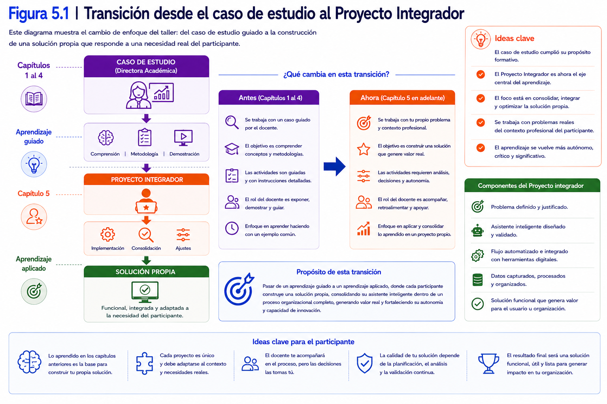
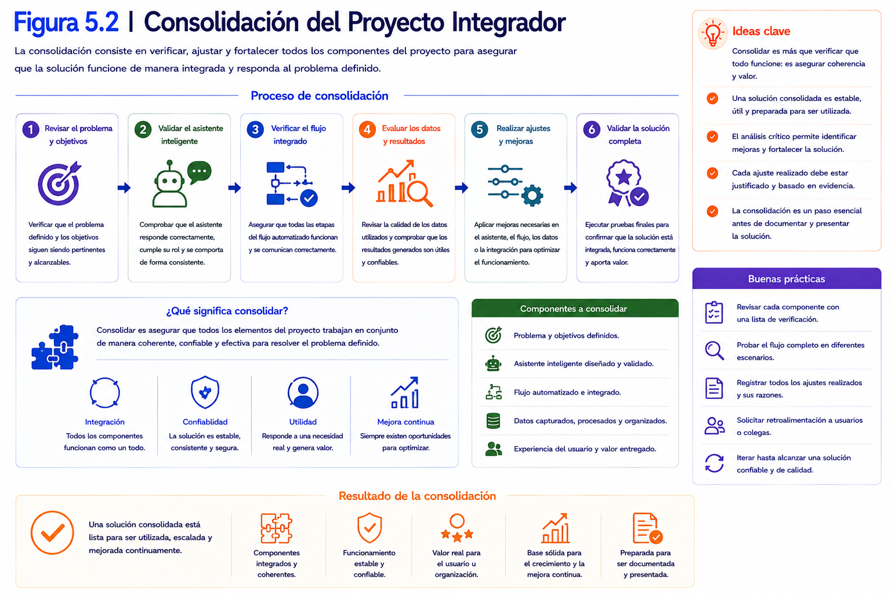
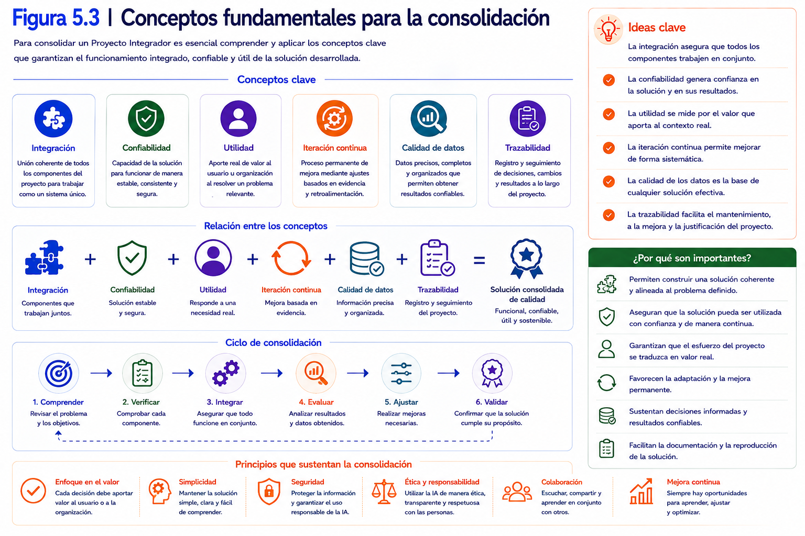
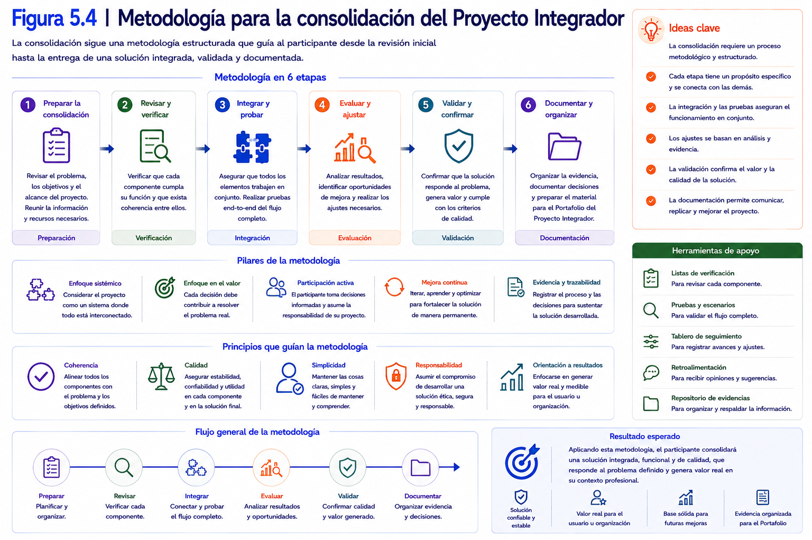
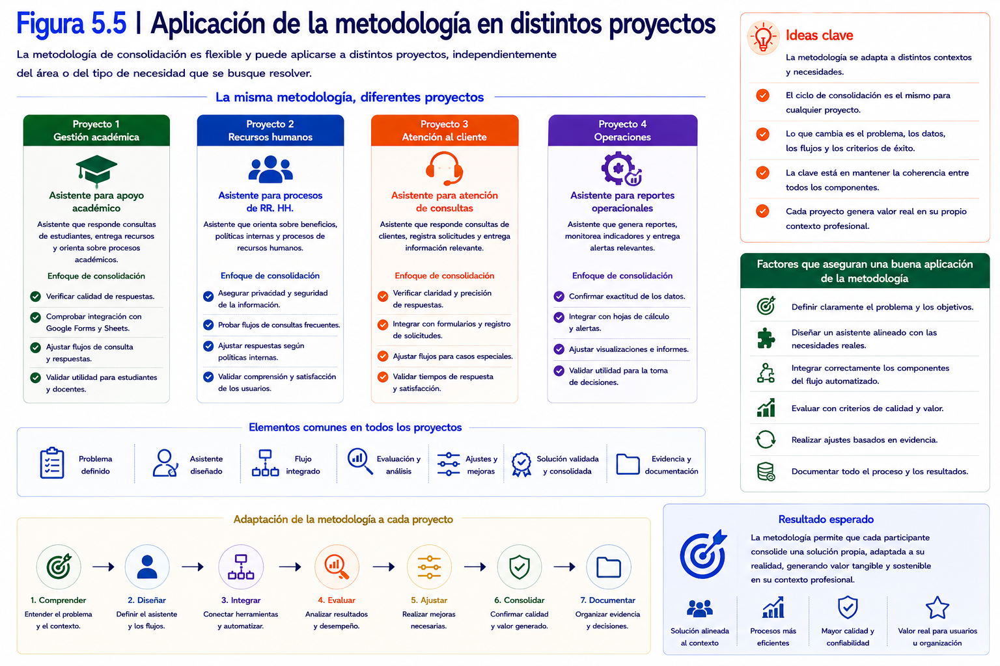
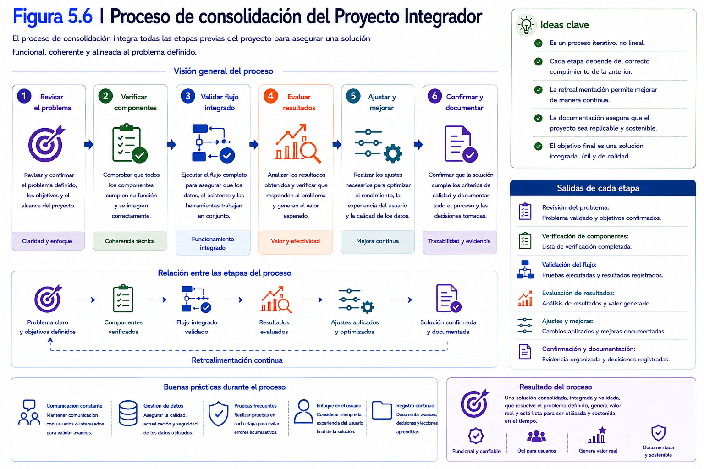
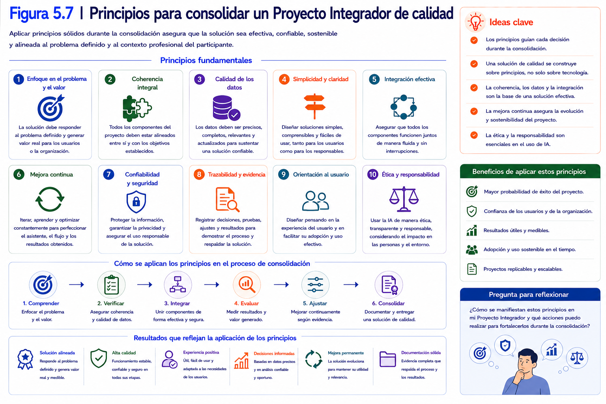
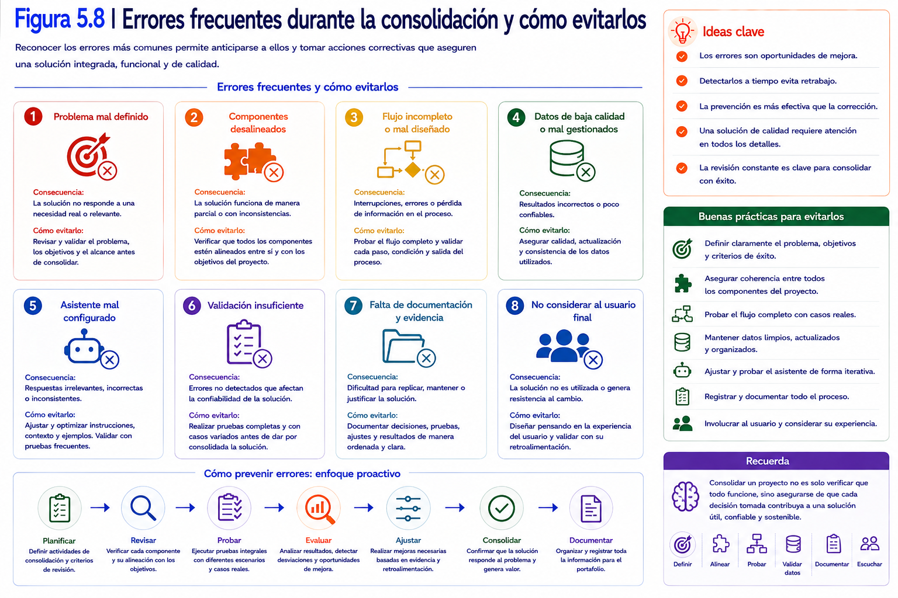
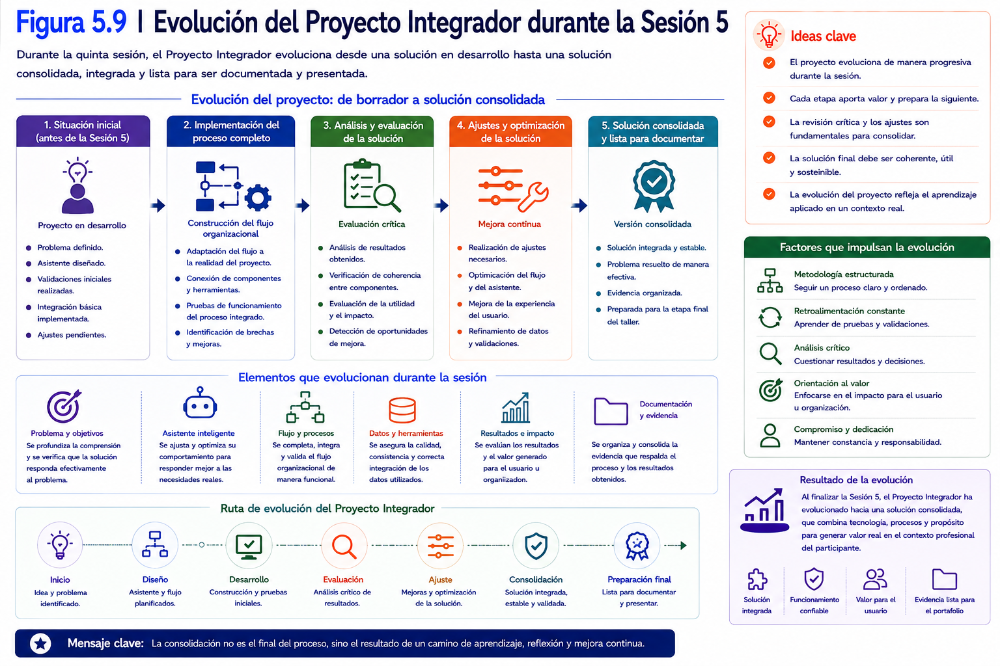
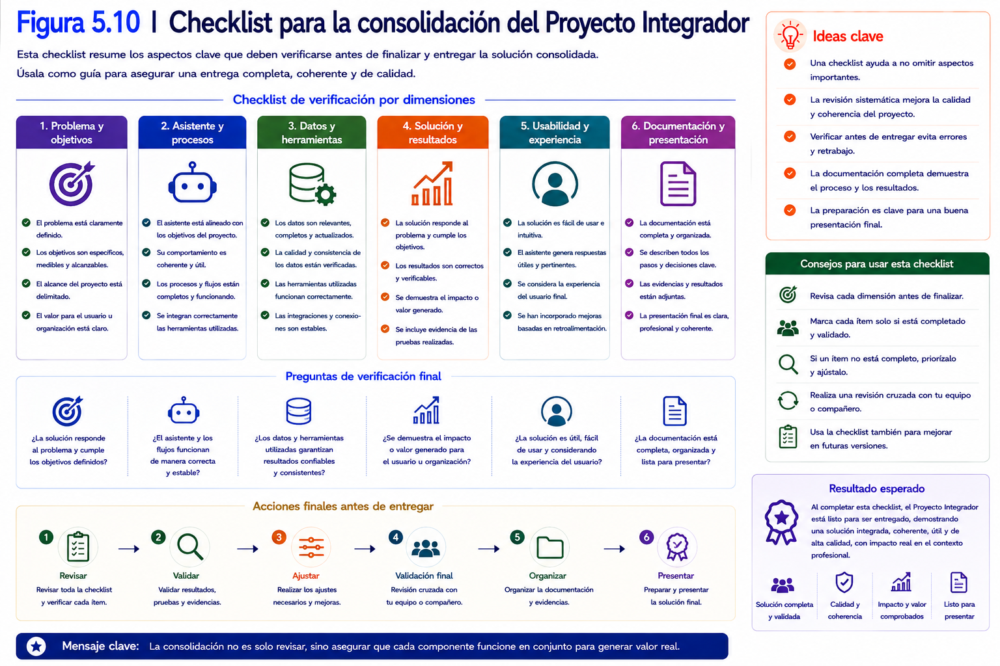

# Capítulo 5
# Consolidación del Proyecto Integrador

---

## Contenidos del capítulo

1. Introducción
2. Objetivos de aprendizaje
3. Conceptos fundamentales
4. Desarrollo conceptual
5. Ejemplos de aplicación
6. Demostración conceptual
7. Buenas prácticas
8. Errores comunes
9. Relación con el Proyecto Integrador
10. Síntesis del capítulo
11. Preguntas para la reflexión
12. Bibliografía y recursos recomendados

---

# 1. Introducción

Durante los capítulos anteriores se desarrolló progresivamente una solución basada en Inteligencia Artificial Generativa Local.

El recorrido comenzó con la definición de un problema disciplinar, continuó con el diseño de un asistente inteligente especializado, avanzó hacia la validación sistemática de su comportamiento y culminó con su integración dentro de un flujo funcional utilizando herramientas del ecosistema Google Workspace.

Hasta este momento, el caso de la directora académica permitió comprender los conceptos, metodologías y principios que sustentan el diseño de este tipo de soluciones.

Sin embargo, ese caso cumplió su propósito.

A partir de este capítulo, el Proyecto Integrador de cada participante pasa a constituir el eje central del trabajo.

Cada estudiante retomará la problemática definida durante las etapas iniciales del taller y aplicará de manera integrada la metodología desarrollada en los capítulos anteriores para consolidar una solución que responda a una necesidad real de su disciplina u organización.

Esta transición representa un cambio importante en la dinámica del taller.

Durante los primeros capítulos, el aprendizaje estuvo orientado principalmente a comprender conceptos y aplicar procedimientos guiados.

En cambio, las actividades desarrolladas a partir de este momento exigirán un mayor grado de autonomía, análisis crítico y capacidad para tomar decisiones técnicas fundamentadas.

El propósito de este capítulo no consiste en incorporar nuevas herramientas o desarrollar componentes adicionales.

El objetivo principal será consolidar la solución construida hasta ahora, verificando que todos sus elementos funcionen de manera integrada y respondan efectivamente al problema definido al inicio del Proyecto Integrador.

Consolidar una solución implica mucho más que comprobar que el flujo automatizado funciona correctamente.

También supone revisar la coherencia entre el problema planteado, el diseño del asistente, el proceso de validación, la arquitectura implementada y el valor que la solución aporta a la organización.

En este contexto, cada participante analizará críticamente su proyecto para identificar oportunidades de mejora, realizar los ajustes necesarios y organizar la evidencia que formará parte del Portafolio del Proyecto Integrador.

Durante este capítulo, el laboratorio ocupará un papel central.

A diferencia de las actividades guiadas desarrolladas anteriormente, el trabajo práctico estará orientado a la implementación de un proceso organizacional completo utilizando el patrón de integración estudiado en el capítulo anterior.

Cada participante adaptará dicha arquitectura a su propio caso de uso, incorporando los ajustes que resulten necesarios para responder a las características particulares de su contexto profesional.

El rol del docente también evoluciona.

En esta etapa, su función deja de centrarse en la exposición de contenidos y pasa a orientarse al acompañamiento, la retroalimentación y la resolución de dudas surgidas durante el desarrollo del Proyecto Integrador.

Al finalizar este capítulo, cada participante dispondrá de una versión consolidada de su solución, técnicamente fundamentada, funcionalmente integrada y preparada para avanzar hacia la etapa final del taller, donde será documentada, presentada y defendida como evidencia del proceso de aprendizaje desarrollado.

---

  

---

### Ideas clave

Al finalizar esta introducción, el participante debería comprender que:

- El caso de estudio utilizado durante los capítulos anteriores ha cumplido su propósito formativo.
- El Proyecto Integrador pasa a constituir el eje central del aprendizaje.
- El objetivo de este capítulo consiste en consolidar una solución funcional y no en incorporar nuevas herramientas.
- La calidad de una solución depende tanto de su funcionamiento como de la coherencia entre sus distintos componentes.
- El laboratorio se desarrollará sobre el proyecto propio de cada participante, con el acompañamiento permanente del docente.

# 2. Objetivos de aprendizaje

Al finalizar este capítulo, el participante será capaz de:

- Consolidar el Proyecto Integrador mediante la implementación de un proceso organizacional completo apoyado por un asistente inteligente local.

- Analizar críticamente la coherencia entre el problema definido, el asistente desarrollado, la arquitectura implementada y los resultados obtenidos.

- Integrar los distintos componentes de la solución en un flujo funcional orientado a responder una necesidad real de su contexto profesional.

- Identificar oportunidades de mejora relacionadas con el funcionamiento del asistente, la integración del proceso y la experiencia del usuario.

- Aplicar criterios de calidad para fortalecer la confiabilidad, mantenibilidad y utilidad de la solución desarrollada.

- Organizar la evidencia generada durante el taller como base para la construcción del Portafolio del Proyecto Integrador.

- Fundamentar las decisiones técnicas adoptadas durante el desarrollo de la solución utilizando los conceptos estudiados en los capítulos anteriores.

---

## Competencias que se desarrollan durante este capítulo

Durante este capítulo el participante fortalecerá competencias relacionadas con:

- Integración de soluciones basadas en Inteligencia Artificial Generativa.
- Automatización de procesos organizacionales.
- Resolución de problemas mediante herramientas digitales.
- Análisis crítico de soluciones tecnológicas.
- Mejora continua de proyectos de desarrollo.
- Documentación técnica de soluciones funcionales.

---

## Vinculación con el Proyecto Integrador

A diferencia de los capítulos anteriores, donde cada actividad permitía desarrollar un componente específico del proyecto, este capítulo tiene como propósito consolidar la solución completa.

Para ello, el participante integrará los conocimientos desarrollados durante todo el taller:

- definición del problema;
- diseño del asistente inteligente;
- validación y optimización;
- integración con herramientas del ecosistema Google Workspace.

El resultado esperado será una solución funcional capaz de responder a una necesidad concreta mediante un proceso automatizado apoyado por Inteligencia Artificial Generativa Local.

---

## El propósito de este capítulo

Este capítulo no incorpora nuevas herramientas ni nuevos componentes tecnológicos.

Su finalidad consiste en fortalecer la calidad de la solución desarrollada.

Para ello, cada participante analizará su proyecto desde una perspectiva integral, verificando aspectos como:

- coherencia entre el problema y la solución propuesta;
- funcionamiento completo del flujo automatizado;
- calidad de las respuestas generadas por el asistente;
- utilidad de la solución para los futuros usuarios;
- oportunidades de mejora antes de la presentación final.

Este proceso permitirá preparar adecuadamente el Proyecto Integrador para la etapa de documentación y presentación final.

---

## Al finalizar este capítulo...

Cada participante dispondrá de una solución consolidada, integrada y suficientemente madura para ser presentada como evidencia del trabajo realizado durante el taller.

Además, contará con una base organizada de documentación y evidencias que facilitarán la elaboración del Portafolio del Proyecto Integrador y la preparación de la demostración funcional de la etapa final.

---

  

---

### Ideas clave

Al finalizar esta sección, el participante debería comprender que:

- La consolidación representa una etapa de integración y mejora, más que de incorporación de nuevos contenidos.
- El Proyecto Integrador pasa a constituir el eje central de todas las actividades de este capítulo.
- La calidad de la solución depende de la coherencia entre todos sus componentes y no únicamente del funcionamiento del asistente.
- La documentación organizada del proyecto facilitará la preparación del Portafolio y la presentación final.
- Este capítulo constituye el puente entre el desarrollo técnico de la solución y su comunicación profesional durante el cierre del taller.

# 3. Conceptos fundamentales

Durante los capítulos anteriores se desarrollaron los distintos componentes que conforman una solución basada en Inteligencia Artificial Generativa Local.

Cada uno de ellos fue construido progresivamente:

- el problema disciplinar;
- el asistente inteligente;
- la validación del comportamiento;
- la integración dentro de un flujo funcional.

Sin embargo, disponer de todos estos elementos no garantiza que la solución esté preparada para utilizarse en un contexto organizacional.

Antes de considerar finalizado un proyecto resulta necesario analizar su funcionamiento desde una perspectiva integral.

Esta etapa recibe el nombre de **consolidación del proyecto**.

---

## 3.1 Consolidación de una solución

La consolidación corresponde al proceso mediante el cual se revisan todos los componentes de una solución para verificar que funcionan de manera coordinada y responden adecuadamente al problema que motivó su desarrollo.

Consolidar no significa agregar nuevas funcionalidades.

Significa asegurar que lo construido cumple efectivamente el propósito para el cual fue diseñado.

Durante este capítulo, la consolidación considerará aspectos técnicos, funcionales y metodológicos.

---

## 3.2 Coherencia de la solución

Una solución tecnológica posee coherencia cuando existe una relación lógica entre todos sus componentes.

En el contexto del Proyecto Integrador, esta coherencia puede analizarse respondiendo preguntas como:

- ¿El asistente resuelve realmente el problema definido al inicio del proyecto?
- ¿La arquitectura implementada resulta adecuada para ese problema?
- ¿El flujo automatizado genera información útil para los usuarios?
- ¿La solución mantiene consistencia entre sus objetivos y sus resultados?

Mientras mayor sea la coherencia entre estos elementos, mayor será el valor de la solución desarrollada.

---

## 3.3 Caso de uso

Un **caso de uso** describe una situación concreta donde una solución tecnológica aporta valor a un usuario o a una organización.

No corresponde únicamente a una descripción técnica del sistema.

También explica:

- quién utiliza la solución;
- qué problema intenta resolver;
- cómo interactúa con ella;
- qué resultado obtiene.

En este capítulo, cada participante definirá claramente el caso de uso de su Proyecto Integrador, permitiendo comprender el contexto donde la solución será aplicada.

---

## 3.4 Evidencia

En un proyecto tecnológico, las afirmaciones deben respaldarse mediante evidencia.

La evidencia corresponde a cualquier elemento que permita demostrar el funcionamiento de la solución desarrollada.

Por ejemplo:

- capturas de pantalla;
- registros del flujo automatizado;
- respuestas generadas por el asistente;
- resultados de las pruebas realizadas;
- documentación técnica.

Esta información será utilizada posteriormente para construir el Portafolio del Proyecto Integrador.

---

## 3.5 Documentación técnica

La documentación técnica reúne la información necesaria para comprender el funcionamiento de una solución.

Su propósito no consiste únicamente en describir cómo fue desarrollada.

También permite que otras personas puedan:

- comprender el proyecto;
- mantener la solución;
- reproducir el proceso;
- identificar futuras oportunidades de mejora.

Una documentación clara constituye un componente fundamental de cualquier proyecto tecnológico.

---

## 3.6 Portafolio del Proyecto Integrador

El **Portafolio del Proyecto Integrador** corresponde al conjunto organizado de evidencias que documentan el proceso de aprendizaje desarrollado durante el taller.

No se limita a presentar el resultado final.

También muestra la evolución del proyecto desde la definición del problema hasta la implementación de la solución integrada.

Por esta razón, el portafolio refleja tanto el producto obtenido como el proceso seguido para alcanzarlo.

---

## 3.7 Mejora continua

La consolidación no representa el término del desarrollo de una solución.

Toda implementación puede perfeccionarse mediante nuevas pruebas, retroalimentación de los usuarios o cambios en las necesidades de la organización.

La **mejora continua** corresponde precisamente a esta capacidad de revisar periódicamente la solución e incorporar ajustes que incrementen su calidad y utilidad.

Adoptar esta perspectiva favorece el desarrollo de proyectos sostenibles y preparados para evolucionar con el tiempo.

---

  

---

### Ideas clave

Al finalizar esta sección, el participante debería comprender que:

- Consolidar una solución implica revisar integralmente todos sus componentes antes de considerar finalizado el proyecto.
- La coherencia entre el problema, el asistente y el flujo automatizado constituye un criterio fundamental de calidad.
- Un caso de uso permite contextualizar el valor de la solución desarrollada.
- La evidencia y la documentación respaldan técnicamente el trabajo realizado durante el taller.
- El Portafolio del Proyecto Integrador representa tanto el resultado obtenido como el proceso seguido para alcanzarlo.
- La mejora continua forma parte del ciclo natural de evolución de cualquier solución basada en Inteligencia Artificial.

# 4. Desarrollo conceptual

Durante los capítulos anteriores del taller, el desarrollo del Proyecto Integrador avanzó de manera incremental.

Cada etapa permitió incorporar un nuevo componente a la solución:

- definición del problema;
- diseño del asistente inteligente;
- validación del comportamiento;
- integración dentro de un flujo automatizado.

En este capítulo, el desafío consiste en analizar la solución como un todo.

Más que revisar cada componente de forma independiente, el objetivo será evaluar cómo interactúan entre sí y si, en conjunto, responden efectivamente a la necesidad que dio origen al proyecto.

Para ello, se propone una metodología de consolidación compuesta por seis etapas.

---

## 4.1 Revisar el problema original

Toda solución tecnológica debe evaluarse considerando el problema que buscaba resolver.

Por esta razón, el primer paso consiste en revisar la definición realizada durante las etapas iniciales del Proyecto Integrador.

Resulta conveniente responder preguntas como:

- ¿El problema continúa siendo relevante?
- ¿Está claramente definido?
- ¿Representa una necesidad real de la organización?
- ¿La solución desarrollada responde efectivamente a esa necesidad?

Si durante esta revisión se detecta que el problema fue formulado de manera ambigua o demasiado amplia, es recomendable realizar los ajustes correspondientes antes de continuar.

---

## 4.2 Verificar la coherencia del asistente inteligente

El segundo paso consiste en revisar el asistente desarrollado durante los capítulos anteriores.

En esta etapa no se pretende rediseñar el asistente.

El propósito consiste en verificar que exista coherencia entre:

- el problema definido;
- el contexto disciplinar;
- el rol asignado;
- el *System Prompt*;
- las respuestas generadas.

Si alguno de estos elementos pierde consistencia respecto del objetivo del proyecto, será necesario realizar ajustes antes de avanzar.

---

## 4.3 Analizar el flujo funcional

Una vez revisado el asistente, corresponde evaluar el funcionamiento completo del proceso automatizado.

El análisis debe considerar aspectos como:

- ¿El flujo comienza correctamente?
- ¿La información se transmite entre los distintos componentes?
- ¿La respuesta del asistente se incorpora correctamente al proceso?
- ¿Los resultados quedan registrados para futuras consultas?

El propósito consiste en verificar que todos los componentes colaboren de manera coordinada.

---

## 4.4 Evaluar el valor que aporta la solución

Un proyecto exitoso no se define únicamente por su correcto funcionamiento técnico.

También debe aportar valor a quienes utilizarán la solución.

En esta etapa resulta conveniente analizar preguntas como:

- ¿Qué tarea se simplifica?
- ¿Qué tarea o etapa del proceso deja de realizarse manualmente?
- ¿Qué beneficio obtiene la organización?
- ¿Qué decisiones podrán tomarse con mayor facilidad?

Responder estas preguntas permite justificar la pertinencia del Proyecto Integrador.

---

## 4.5 Organizar la evidencia

A medida que el proyecto evoluciona, también aumenta la cantidad de información generada.

Por ello resulta recomendable organizar sistemáticamente la evidencia obtenida durante el desarrollo.

Entre otros elementos, conviene conservar:

- capturas de pantalla;
- diagramas del flujo;
- resultados de validación;
- ejemplos de respuestas;
- registros del funcionamiento del proceso.

Esta información facilitará posteriormente la elaboración del Portafolio del Proyecto Integrador.

---

## 4.6 Preparar la solución para su presentación

Finalmente, resulta necesario revisar el proyecto desde la perspectiva de una persona que no participó en su desarrollo.

Al observar la solución debería ser posible comprender:

- cuál era el problema inicial;
- cómo se diseñó el asistente;
- cómo funciona el flujo automatizado;
- qué beneficios aporta la solución;
- qué resultados fueron obtenidos.

Si estos aspectos pueden explicarse de manera clara y ordenada, el Proyecto Integrador estará preparado para avanzar hacia la última etapa del taller.

---

## La consolidación como proceso iterativo

Las seis etapas descritas anteriormente no necesariamente se ejecutan una única vez.

Durante el proceso de revisión es frecuente identificar oportunidades de mejora que obligan a regresar a etapas anteriores.

Por ejemplo:

- redefinir parcialmente el problema;
- ajustar el *System Prompt*;
- modificar el flujo automatizado;
- incorporar nuevas evidencias.

Esta dinámica forma parte del desarrollo normal de cualquier proyecto tecnológico.

Por ello, la consolidación debe entenderse como un proceso iterativo cuyo propósito es incrementar progresivamente la calidad de la solución.

---

  

---

### Ideas clave

Al finalizar esta sección, el participante debería comprender que:

- La consolidación implica analizar el Proyecto Integrador desde una perspectiva global.
- La revisión debe considerar tanto aspectos técnicos como funcionales y organizacionales.
- El valor de una solución depende de su capacidad para resolver un problema real y generar beneficios concretos.
- La organización sistemática de la evidencia facilitará la elaboración del Portafolio del Proyecto Integrador.
- La consolidación constituye un proceso iterativo orientado a fortalecer progresivamente la calidad de la solución antes de su presentación final.

# 5. Ejemplos de aplicación

La consolidación del Proyecto Integrador constituye una etapa común para todos los participantes, independientemente del problema abordado o del área disciplinar en la que se desempeñen.

Aunque cada solución responda a necesidades diferentes, el proceso de revisión, mejora y documentación mantiene una estructura similar.

Los siguientes ejemplos ilustran cómo distintos proyectos pueden aplicar la metodología de consolidación presentada en este capítulo.

---

## Ejemplo 1. Educación superior

Una participante desarrolló un asistente inteligente para apoyar la interpretación de consultas académicas relacionadas con la normativa institucional.

Durante la consolidación del proyecto verificó que:

- el problema inicial continuaba siendo pertinente;
- el asistente respondía adecuadamente a las consultas frecuentes;
- el flujo automatizado funcionaba correctamente;
- las respuestas quedaban registradas en Google Sheets;
- la documentación permitía comprender el funcionamiento completo de la solución.

Después de esta revisión incorporó pequeñas mejoras al *System Prompt* y reorganizó la evidencia que integraría el portafolio.

El resultado fue una solución más consistente y preparada para su presentación.

---

## Ejemplo 2. Ingeniería

Un participante diseñó un asistente para analizar reportes de mantenimiento preventivo de equipos industriales.

Durante la etapa de consolidación observó que el flujo automatizado funcionaba correctamente, pero algunas recomendaciones generadas por el asistente resultaban demasiado generales.

Después de revisar el contexto disciplinar incorporó información adicional sobre los procedimientos de mantenimiento utilizados por su organización.

La calidad de las respuestas mejoró sin necesidad de modificar la arquitectura de integración.

---

## Ejemplo 3. Salud

Una profesional desarrolló un asistente orientado al apoyo de procesos administrativos relacionados con solicitudes internas.

Al revisar el proyecto detectó que la solución resolvía correctamente el problema técnico, pero no explicaba claramente el beneficio obtenido por los usuarios finales.

Como parte de la consolidación incorporó un caso de uso más detallado y reorganizó la documentación para destacar el impacto de la automatización sobre el proceso administrativo.

---

## Ejemplo 4. Investigación

Un investigador construyó un asistente para apoyar la clasificación preliminar de observaciones obtenidas durante un trabajo de campo.

Durante la consolidación revisó las evidencias generadas durante las pruebas y comprobó que la mayoría de los casos producía resultados consistentes.

Sin embargo, identificó algunos escenarios excepcionales que posteriormente incorporó como recomendaciones dentro de la documentación del proyecto.

Esta revisión fortaleció la calidad técnica de la solución presentada.

---

## Ejemplo 5. Gestión organizacional

Una profesional implementó un flujo automatizado para responder consultas frecuentes relacionadas con procedimientos internos de su institución.

La solución funcionaba correctamente desde el punto de vista técnico.

No obstante, durante la consolidación advirtió que otras personas tendrían dificultades para comprender el proyecto debido a la escasa documentación existente.

Como consecuencia, reorganizó el material incorporando:

- una descripción del problema;
- un diagrama del flujo;
- capturas del funcionamiento;
- una explicación del papel desempeñado por el asistente inteligente.

Estas mejoras facilitaron significativamente la comprensión de la solución.

---

## ¿Qué tienen en común estos proyectos?

Aunque los cinco ejemplos pertenecen a ámbitos profesionales diferentes, todos desarrollaron el mismo proceso de consolidación.

En cada caso fue necesario:

1. revisar el problema original;
2. verificar el funcionamiento del asistente;
3. analizar el flujo automatizado;
4. evaluar el valor aportado por la solución;
5. organizar las evidencias;
6. preparar el proyecto para su presentación.

Lo que cambia entre un proyecto y otro es el contexto disciplinar.

La metodología de consolidación permanece inalterada.

---

  

---

### Ideas clave

Al finalizar esta sección, el participante debería comprender que:

- La consolidación constituye una etapa común para cualquier Proyecto Integrador.
- La metodología presentada puede aplicarse en diferentes disciplinas y contextos organizacionales.
- La revisión del proyecto considera tanto aspectos técnicos como funcionales y documentales.
- La calidad de una solución mejora cuando se analiza desde una perspectiva integral.
- El contexto cambia entre proyectos, pero los principios utilizados para consolidarlos permanecen constantes.

# 6. Demostración conceptual

Hasta este momento del taller, cada participante dispone de una solución funcional desarrollada a partir de un problema identificado en su propio contexto profesional.

El asistente inteligente ha sido diseñado, validado e integrado dentro de un flujo automatizado.

Sin embargo, antes de considerar terminado el Proyecto Integrador, resulta necesario realizar una revisión integral que permita verificar la calidad de la solución y preparar adecuadamente la documentación que será presentada durante la última etapa.

La siguiente demostración conceptual ilustra el proceso de consolidación que cualquier participante debería realizar sobre su proyecto.

---

## Situación inicial

Un participante desarrolló un asistente inteligente para apoyar la clasificación automática de solicitudes académicas recibidas mediante un formulario institucional.

La solución ya permite:

- recibir información desde Google Forms;
- registrar automáticamente las solicitudes en Google Sheets;
- procesar las consultas mediante el modelo ejecutado localmente;
- registrar las respuestas generadas y el estado del procesamiento;
- enviar automáticamente la respuesta al usuario mediante Gmail.

Desde un punto de vista técnico, el proyecto funciona correctamente.

No obstante, antes de presentarlo resulta necesario responder una pregunta fundamental:

> **¿Está realmente preparado para ser utilizado por otras personas?**

---

## Paso 1. Revisar el problema definido

El participante vuelve a leer la definición del problema elaborada durante las etapas iniciales del Proyecto Integrador.

Verifica que:

- el problema continúa siendo pertinente;
- la necesidad organizacional permanece vigente;
- la solución desarrollada responde efectivamente a esa necesidad.

En esta etapa también comprueba que los objetivos del proyecto mantienen coherencia con los resultados obtenidos.

---

## Paso 2. Revisar el funcionamiento del asistente

A continuación analiza nuevamente el comportamiento del asistente inteligente.

No realiza nuevas pruebas exhaustivas.

En cambio, revisa los resultados obtenidos durante la etapa de validación para comprobar que:

- las respuestas mantienen consistencia;
- el contexto disciplinar continúa siendo adecuado;
- el *System Prompt* refleja correctamente el propósito del proyecto.

Si identifica oportunidades de mejora menores, las incorpora antes de continuar.

---

## Paso 3. Revisar el flujo automatizado

Posteriormente ejecuta nuevamente el proceso completo.

Durante esta revisión verifica que:

- Google Forms captura correctamente la información;
- Google Sheets registra los datos y el estado de la solicitud;
- Google Apps Script permite el intercambio de información mediante el Web App;
- `puente_local.py` identifica y coordina el procesamiento de las solicitudes pendientes en el entorno local;
- Ollama ejecuta el modelo y genera la respuesta;
- la respuesta vuelve a registrarse automáticamente en Google Sheets;
- el resultado es enviado correctamente al usuario mediante Gmail.

El objetivo consiste en comprobar el comportamiento de la solución completa y no únicamente de uno de sus componentes.

---

## Paso 4. Organizar las evidencias

Una vez verificado el funcionamiento del proyecto, el participante comienza a organizar la evidencia obtenida durante todo el taller.

Selecciona, entre otros elementos:

- capturas del asistente;
- imágenes del flujo automatizado;
- ejemplos de consultas procesadas;
- resultados de validación;
- diagramas de arquitectura.

Toda esta información será utilizada posteriormente para construir el Portafolio del Proyecto Integrador.

---

## Paso 5. Preparar la explicación del proyecto

Finalmente, el participante intenta explicar su solución imaginando que la audiencia nunca ha visto el proyecto.

Para ello responde, de manera ordenada, las siguientes preguntas:

- ¿Qué problema intenta resolver?
- ¿Cómo funciona el asistente inteligente?
- ¿Cómo se integra con el flujo automatizado?
- ¿Qué beneficios aporta?
- ¿Qué resultados obtuvo?

Si logra responder estas preguntas de forma clara y coherente, el proyecto estará preparado para avanzar hacia la presentación final.

---

## Resultado de la consolidación

Después de realizar esta revisión integral, el participante dispone de una solución más robusta.

No necesariamente incorpora nuevas funcionalidades.

Sin embargo, comprende mucho mejor:

- el valor de su proyecto;
- las fortalezas de la solución;
- las limitaciones existentes;
- las oportunidades de mejora futura.

Esta comprensión facilitará tanto la elaboración del Portafolio como la presentación que realizará durante la última etapa.

---

## ¿Qué desarrollará el participante durante el laboratorio?

La demostración conceptual presentada constituye el modelo de trabajo que cada participante seguirá durante el laboratorio.

En esta oportunidad, el objetivo ya no será replicar un ejemplo guiado, sino aplicar la metodología de consolidación al Proyecto Integrador propio.

Durante aproximadamente cien minutos de trabajo práctico, cada participante:

- revisará integralmente su solución;
- realizará los ajustes que estime necesarios;
- organizará las evidencias generadas;
- preparará una primera versión del Portafolio del Proyecto Integrador.

El docente acompañará este proceso proporcionando retroalimentación personalizada y orientando la toma de decisiones cuando resulte necesario.

---

  

---

### Ideas clave

Al finalizar esta demostración, el participante debería comprender que:

- Consolidar un proyecto implica revisar la solución desde una perspectiva integral.
- La revisión considera tanto aspectos técnicos como funcionales y documentales.
- La organización de evidencias facilita la elaboración del Portafolio del Proyecto Integrador.
- Una buena solución no sólo debe funcionar correctamente, sino también ser comprensible y justificable.
- El laboratorio permitirá aplicar esta metodología directamente sobre el Proyecto Integrador desarrollado por cada participante.

# 7. Buenas prácticas

La consolidación del Proyecto Integrador representa la última oportunidad para revisar la calidad de la solución antes de su presentación final.

En esta etapa, pequeñas mejoras pueden marcar una diferencia significativa en la claridad, utilidad y solidez del proyecto.

Las siguientes recomendaciones corresponden a buenas prácticas utilizadas habitualmente durante la revisión de soluciones tecnológicas y constituyen una guía para fortalecer el trabajo desarrollado durante el taller.

---

## 7.1 Revisar el proyecto desde la perspectiva del usuario

Con frecuencia, quienes desarrollan una solución conocen tan bien su funcionamiento que dejan de percibir dificultades que sí serán evidentes para otras personas.

Antes de considerar finalizado el proyecto, resulta conveniente analizar la solución desde la perspectiva de quien la utilizará.

Preguntas como las siguientes pueden orientar esta revisión:

- ¿El flujo resulta comprensible?
- ¿Las respuestas generadas aportan información útil?
- ¿La solución resuelve realmente el problema identificado?
- ¿El proceso resulta sencillo para el usuario final?

Este ejercicio favorece el diseño de soluciones centradas en las necesidades de las personas.

---

## 7.2 Mantener la coherencia entre todos los componentes

Durante la consolidación es recomendable verificar que exista coherencia entre:

- el problema definido;
- los objetivos del proyecto;
- el asistente inteligente;
- el flujo automatizado;
- los resultados obtenidos.

Cuando todos estos elementos mantienen una relación lógica, la solución adquiere mayor consistencia y resulta más fácil de comprender.

---

## 7.3 Documentar mientras se desarrolla el proyecto

Una práctica frecuente consiste en dejar la documentación para el final.

Sin embargo, este enfoque suele provocar la pérdida de información relevante.

Siempre que sea posible, conviene documentar el proyecto de manera progresiva, registrando las decisiones adoptadas, las pruebas realizadas y las mejoras incorporadas.

Esta práctica facilitará la elaboración del Portafolio del Proyecto Integrador.

---

## 7.4 Seleccionar evidencias representativas

No resulta necesario incorporar todas las capturas de pantalla o todos los registros generados durante el desarrollo.

Es preferible seleccionar aquellas evidencias que expliquen claramente:

- el problema;
- la arquitectura;
- el funcionamiento del flujo;
- las respuestas del asistente;
- los resultados alcanzados.

Una selección adecuada facilita la comprensión del proyecto y evita documentación innecesariamente extensa.

---

## 7.5 Justificar las decisiones técnicas

Toda decisión importante adoptada durante el desarrollo debería poder explicarse.

Por ejemplo:

- ¿Por qué se eligió ese problema?
- ¿Por qué se diseñó el asistente de esa manera?
- ¿Por qué se utilizó ese flujo automatizado?
- ¿Por qué se realizaron determinados ajustes durante la validación?

Fundamentar las decisiones fortalece la calidad técnica del proyecto y demuestra comprensión del proceso seguido.

---

## 7.6 Destacar el valor de la solución

Durante la consolidación es recomendable centrar la atención en el valor que la solución aporta a la organización.

Más que describir herramientas, conviene explicar:

- qué problema se resolvió;
- qué tarea fue automatizada;
- qué beneficios se obtuvieron;
- qué impacto puede generar la solución.

Este enfoque facilita que otras personas comprendan la utilidad del proyecto.

---

## 7.7 Mantener una actitud de mejora continua

La versión consolidada del Proyecto Integrador no debe interpretarse como una solución definitiva.

Toda implementación puede evolucionar mediante:

- nuevas necesidades organizacionales;
- retroalimentación de los usuarios;
- mejoras tecnológicas;
- ajustes metodológicos.

Reconocer estas oportunidades demuestra una visión profesional del desarrollo de soluciones basadas en Inteligencia Artificial.

---

## 7.8 Preparar el proyecto para ser comprendido por terceros

Un buen proyecto no depende exclusivamente de la persona que lo desarrolló.

La documentación, los diagramas y las explicaciones deben permitir que otro profesional pueda comprender el funcionamiento de la solución y continuar su evolución si fuera necesario.

Diseñar pensando en la continuidad constituye una buena práctica ampliamente utilizada en proyectos tecnológicos.

---

  

---

### Ideas clave

Al finalizar esta sección, el participante debería comprender que:

- Consolidar un proyecto implica revisar tanto su funcionamiento como su capacidad para comunicar valor.
- La documentación progresiva facilita la construcción del Portafolio del Proyecto Integrador.
- Las evidencias deben seleccionarse por su capacidad para explicar el proyecto y no por su cantidad.
- Toda decisión técnica importante debe estar debidamente fundamentada.
- Un proyecto de calidad puede ser comprendido, utilizado y mejorado por otras personas.

# 8. Errores comunes

Una solución funcional no siempre constituye una solución consolidada.

Es frecuente que proyectos técnicamente correctos presenten debilidades relacionadas con su documentación, su coherencia, la justificación de las decisiones adoptadas o la forma en que comunican el valor que aportan a la organización.

Reconocer estos errores antes de la presentación final permitirá fortalecer el Proyecto Integrador y mejorar significativamente la calidad del trabajo desarrollado.

---

## 8.1 Pensar que un proyecto termina cuando funciona

Uno de los errores más frecuentes consiste en asumir que el desarrollo concluye cuando el flujo automatizado ejecuta correctamente todas sus tareas.

Sin embargo, un proyecto profesional también requiere:

- justificar las decisiones adoptadas;
- documentar la solución;
- organizar las evidencias;
- demostrar el valor obtenido.

El funcionamiento técnico constituye únicamente una parte del resultado esperado.

---

## 8.2 Perder de vista el problema original

Durante el desarrollo del proyecto es habitual concentrarse en aspectos tecnológicos.

Como consecuencia, algunos participantes terminan dedicando más tiempo a perfeccionar herramientas que a resolver el problema definido inicialmente.

Antes de finalizar el proyecto conviene preguntarse:

- ¿La solución responde realmente al problema identificado?
- ¿La automatización aporta un beneficio concreto?
- ¿El usuario obtiene un resultado útil?

Estas preguntas permiten recuperar el propósito original del proyecto.

---

## 8.3 Incorporar funcionalidades innecesarias

Al acercarse la etapa final, algunas personas intentan agregar nuevas características para hacer que el proyecto parezca más completo.

En muchas ocasiones, estas modificaciones aumentan la complejidad sin generar un beneficio real.

Durante la consolidación resulta preferible fortalecer la calidad de los componentes existentes antes que incorporar funcionalidades adicionales.

---

## 8.4 Descuidar la documentación

Otro error frecuente consiste en dedicar todo el esfuerzo al desarrollo técnico y dejar la documentación para el último momento.

Cuando esto ocurre suelen olvidarse decisiones importantes, pruebas realizadas o mejoras incorporadas durante el proceso.

Una documentación incompleta dificulta la comprensión del proyecto y reduce el valor del Portafolio del Proyecto Integrador.

---

## 8.5 Presentar evidencias desordenadas

Acumular una gran cantidad de capturas de pantalla o registros no garantiza una buena documentación.

Las evidencias deben organizarse de manera lógica y responder a una secuencia comprensible.

Una presentación ordenada permite apreciar con claridad la evolución del proyecto y facilita la revisión por parte de terceros.

---

## 8.6 Explicar únicamente las herramientas utilizadas

En ocasiones, los participantes concentran su explicación en describir Google Forms, Google Sheets, Google Apps Script u Ollama.

Aunque estas herramientas forman parte de la solución, no representan el aspecto más importante del proyecto.

La presentación debe centrarse principalmente en:

- el problema abordado;
- la solución propuesta;
- el funcionamiento del proceso;
- el valor generado para la organización.

Las herramientas constituyen el medio para alcanzar ese resultado.

---

## 8.7 No reconocer las limitaciones del proyecto

Toda solución tecnológica posee restricciones.

Intentar presentar el proyecto como una solución perfecta reduce la credibilidad del trabajo realizado.

Una actitud profesional consiste en reconocer:

- los aspectos que funcionan correctamente;
- las limitaciones identificadas;
- las mejoras que podrían desarrollarse en el futuro.

Este análisis demuestra capacidad crítica y favorece la evolución del proyecto.

---

## 8.8 Pensar que la consolidación es una actividad individual

Aunque cada participante desarrolla su propio Proyecto Integrador, la retroalimentación proporcionada por el docente y por los demás integrantes del taller constituye una fuente importante de mejora.

Escuchar observaciones, responder preguntas y analizar otras soluciones permite enriquecer el proyecto antes de su presentación final.

La consolidación también es un proceso colaborativo.

---

  

---

### Ideas clave

Al finalizar esta sección, el participante debería comprender que:

- Un proyecto no finaliza cuando funciona técnicamente; también debe estar preparado para ser comprendido y utilizado.
- La consolidación exige mantener el foco en el problema que motivó el desarrollo de la solución.
- La documentación y la organización de las evidencias forman parte del resultado esperado.
- Explicar el valor del proyecto resulta más importante que describir las herramientas utilizadas.
- Reconocer las limitaciones y aceptar retroalimentación fortalece la calidad del Proyecto Integrador y prepara adecuadamente la presentación final.

# 9. Relación con el Proyecto Integrador

Durante los cuatro primeros capítulos, el Proyecto Integrador evolucionó progresivamente desde una idea inicial hasta convertirse en una solución funcional basada en Inteligencia Artificial Generativa Local.

Cada etapa incorporó un nuevo componente:

- definición del problema;
- diseño del asistente inteligente;
- validación y optimización;
- integración dentro de un flujo automatizado.

En este capítulo comienza la fase de consolidación.

El objetivo ya no consiste en desarrollar nuevos elementos, sino en fortalecer la calidad de la solución construida, verificando que todos sus componentes funcionen de manera integrada y respondan efectivamente a la necesidad identificada al inicio del proyecto.

---

## ¿Qué desarrollará el participante durante el laboratorio?

El laboratorio de este capítulo estará completamente orientado al Proyecto Integrador.

A diferencia de los laboratorios anteriores, donde todos los participantes trabajaban sobre un mismo caso de referencia, ahora cada estudiante desarrollará actividades relacionadas con su propio contexto profesional.

Durante el laboratorio, cada participante:

- revisará integralmente su solución;
- verificará el funcionamiento del flujo automatizado;
- realizará los ajustes que considere necesarios;
- organizará la evidencia generada durante el desarrollo del proyecto;
- preparará una primera versión del Portafolio del Proyecto Integrador.

El docente acompañará este proceso proporcionando orientación individual y retroalimentación permanente.

---

## Consolidación de la solución

El trabajo desarrollado durante este capítulo permitirá transformar un proyecto funcional en una solución más sólida, coherente y adecuadamente documentada.

Para ello, cada participante analizará aspectos como:

- la coherencia entre el problema y la solución;
- la calidad del asistente inteligente;
- el funcionamiento del flujo automatizado;
- el valor aportado por la solución;
- la claridad de la documentación generada.

Este análisis facilitará la identificación de oportunidades de mejora antes de la presentación final.

---

## Organización del Portafolio

Uno de los productos más importantes de este capítulo será la organización sistemática de la información que dará origen al Portafolio del Proyecto Integrador.

Entre los elementos que deberían incorporarse se encuentran:

- descripción del problema;
- objetivos del proyecto;
- arquitectura de la solución;
- evidencias del funcionamiento;
- resultados obtenidos;
- principales ajustes realizados durante el desarrollo.

Esta organización facilitará tanto la presentación final como la revisión posterior del trabajo realizado.

---

## Preparación para la etapa final

Al concluir este capítulo, cada participante dispondrá de una solución suficientemente madura para avanzar hacia la última etapa del taller.

Durante la etapa final, el foco dejará de estar en la implementación técnica y se trasladará hacia la comunicación profesional del proyecto.

Por esta razón, el trabajo desarrollado durante este capítulo constituye la base sobre la cual se construirá la presentación final.

---

  

---

### Ideas clave

Al finalizar este capítulo, el participante debería comprender que:

- Este capítulo está completamente orientado al fortalecimiento del Proyecto Integrador.
- El laboratorio constituye una instancia de trabajo autónomo acompañada por el docente.
- La consolidación implica revisar la solución desde perspectivas técnicas, funcionales y organizacionales.
- La organización del Portafolio comienza durante este capítulo y continuará en la etapa final del taller.
- El resultado esperado consiste en disponer de una solución sólida y preparada para ser presentada durante la última etapa.

# 10. Síntesis del capítulo

Durante este capítulo se desarrolló la etapa de consolidación del Proyecto Integrador.

A diferencia de los capítulos anteriores, donde el trabajo se centró en incorporar progresivamente nuevos componentes a la solución, el propósito de este capítulo fue analizar el proyecto desde una perspectiva integral, verificando la coherencia entre todos los elementos desarrollados a lo largo del taller.

La revisión comenzó retomando el problema definido durante la primera etapa, comprobando que la solución implementada respondiera efectivamente a la necesidad identificada.

Posteriormente, se analizó el asistente inteligente, el flujo automatizado y la interacción entre los distintos componentes que conforman la arquitectura desarrollada durante el Proyecto Integrador.

Además del funcionamiento técnico, se revisaron aspectos relacionados con el valor que aporta la solución, la organización de las evidencias, la documentación generada y la preparación del proyecto para su comunicación profesional.

Durante este proceso se destacó que la consolidación no implica incorporar nuevas funcionalidades, sino fortalecer la calidad, coherencia y utilidad de la solución ya desarrollada.

Asimismo, se presentaron ejemplos de aplicación, buenas prácticas y errores frecuentes que permitieron comprender cómo pequeñas mejoras pueden incrementar significativamente la calidad del Proyecto Integrador antes de su presentación final.

El laboratorio de este capítulo permitió que cada participante aplicara esta metodología directamente sobre su propio proyecto, realizando ajustes, organizando evidencias y preparando una primera versión del Portafolio del Proyecto Integrador.

---

## ¿Qué hemos logrado hasta este momento?

Al finalizar el quinto capítulo, cada participante dispondrá de:

- un problema claramente definido y contextualizado;
- un asistente inteligente especializado;
- un asistente validado y optimizado;
- un flujo automatizado funcional;
- una solución consolidada y revisada integralmente;
- un conjunto organizado de evidencias para el Portafolio del Proyecto Integrador.

La solución ya no representa únicamente un desarrollo tecnológico.

Constituye un proyecto fundamentado, documentado y preparado para ser comunicado a otras personas.

---

## Preparación para el último capítulo

El capítulo final del taller tendrá un propósito diferente.

El foco dejará de estar en el desarrollo de la solución y se orientará hacia su comunicación profesional.

Durante esa instancia, cada participante deberá:

- organizar la versión definitiva del Portafolio del Proyecto Integrador;
- preparar la demostración funcional de la solución;
- presentar el proyecto desarrollado;
- fundamentar las decisiones técnicas adoptadas;
- reflexionar sobre los resultados obtenidos y las oportunidades de mejora futura.

De esta manera, el trabajo realizado durante el presente capítulo constituye la base inmediata para el cierre del taller.

---

  

---

### Ideas clave

Al finalizar este capítulo, el participante debería recordar que:

- La consolidación constituye una etapa esencial para fortalecer la calidad del Proyecto Integrador.
- Una solución profesional debe ser coherente, funcional, documentada y capaz de comunicar claramente el valor que aporta.
- La organización de las evidencias facilita la elaboración del Portafolio y la presentación del proyecto.
- El trabajo desarrollado durante este capítulo prepara directamente la etapa final del taller.
- La siguiente etapa estará orientada a comunicar, demostrar y defender profesionalmente la solución desarrollada.

# 11. Preguntas para la reflexión

Las siguientes preguntas tienen como propósito favorecer el análisis crítico del Proyecto Integrador desarrollado durante el taller.

A diferencia de los capítulos anteriores, las respuestas deberán fundamentarse principalmente en la solución construida por cada participante y no en el caso de estudio utilizado durante la fase inicial del curso.

Se espera que este ejercicio contribuya a fortalecer el proyecto antes de su presentación final.

---

## Reflexión sobre el problema

### 1.

Revise nuevamente el problema definido durante la primera etapa.

¿Considera que la solución desarrollada responde efectivamente a esa necesidad?

Fundamente su respuesta utilizando evidencias obtenidas durante el desarrollo del proyecto.

---

### 2.

Si tuviera la oportunidad de redefinir el problema inicial, ¿modificaría algún aspecto de su formulación?

Explique por qué.

---

## Reflexión sobre la solución

### 3.

¿Cuál considera que es la principal fortaleza de su Proyecto Integrador?

Explique cómo esa característica aporta valor al usuario o a la organización.

---

### 4.

¿Cuál identifica como la principal limitación de su solución?

¿Qué acciones podrían desarrollarse en el futuro para superarla?

---

### 5.

Revise el flujo automatizado implementado.

¿Existe alguna etapa que podría simplificarse o mejorarse?

Justifique su respuesta.

---

## Reflexión sobre el asistente inteligente

### 6.

Después de las actividades de validación y consolidación, ¿qué aspectos del asistente considera más satisfactorios?

¿Existe algún comportamiento que aún debería optimizarse?

---

### 7.

Si otra persona utilizara el asistente desarrollado por usted, ¿qué recomendaciones le entregaría para obtener mejores resultados?

---

## Reflexión sobre el proyecto

### 8.

¿Qué evidencia considera más representativa para demostrar el funcionamiento de su solución?

Explique por qué la seleccionó.

---

### 9.

Si tuviera que explicar su proyecto en menos de tres minutos, ¿qué aspectos consideraría imprescindibles para que una audiencia comprendiera su propuesta?

---

### 10.

¿Qué decisión técnica adoptada durante el desarrollo del proyecto considera más importante?

Fundamente su respuesta.

---

## Reflexión profesional

### 11.

¿De qué manera podría adaptarse la solución desarrollada para ser utilizada en otro contexto profesional distinto al suyo?

¿Qué elementos permanecerían sin cambios y cuáles deberían modificarse?

---

### 12.

Después de completar este taller, ¿qué aprendizaje considera más relevante para futuros proyectos de automatización mediante Inteligencia Artificial Generativa?

Explique cómo espera aplicar ese conocimiento en su actividad profesional.

---

## Reflexión final

Antes de avanzar hacia la última etapa del taller, responda la siguiente pregunta:

> **Si hoy debiera entregar su Proyecto Integrador a otra persona para que lo utilizara y continuara desarrollándolo, ¿considera que la documentación, las evidencias y las explicaciones proporcionadas serían suficientes para comprender completamente la solución?**

Responder esta pregunta permitirá valorar no sólo la calidad técnica del proyecto, sino también su capacidad para ser comprendido, mantenido y evolucionado por otros profesionales.

# 12. Bibliografía y recursos recomendados

Los contenidos desarrollados en este capítulo se fundamentan en literatura relacionada con la gestión de proyectos tecnológicos, la arquitectura de software, la documentación técnica y la mejora continua de soluciones basadas en Inteligencia Artificial.

Las referencias seleccionadas permiten profundizar los principios utilizados durante la consolidación del Proyecto Integrador y proporcionan herramientas para fortalecer la calidad de soluciones desarrolladas en contextos organizacionales.

---

## Bibliografía fundamental

Gamma, E., Helm, R., Johnson, R., & Vlissides, J. (1994). *Design Patterns: Elements of Reusable Object-Oriented Software*. Addison-Wesley.

Martin, R. C. (2018). *Clean Architecture: A Craftsman's Guide to Software Structure and Design*. Pearson.

Mollick, E. (2024). *Co-Intelligence: Living and Working with AI*. Portfolio.

Pressman, R. S., & Maxim, B. R. (2020). *Software Engineering: A Practitioner's Approach* (9th ed.). McGraw-Hill.

Sommerville, I. (2016). *Software Engineering* (10th ed.). Pearson.

---

## Lecturas complementarias

Google. (2024). *Google Workspace Developers Documentation*.

Google. (2024). *Apps Script Documentation*.

NIST. (2024). *Artificial Intelligence Risk Management Framework (AI RMF 1.0)*.

Project Management Institute. (2021). *A Guide to the Project Management Body of Knowledge (PMBOK® Guide)* (7th ed.).

Russell, S., & Norvig, P. (2021). *Artificial Intelligence: A Modern Approach* (4th ed.). Pearson.

---

## Recursos digitales recomendados

**Google Workspace Developers**

https://developers.google.com/workspace

---

**Google Apps Script**

https://developers.google.com/apps-script

---

**Documentación oficial de Ollama**

https://ollama.com

---

**Documentación oficial de Open WebUI**

https://openwebui.com

---

**Project Management Institute**

https://www.pmi.org

---

**NIST Artificial Intelligence Risk Management Framework**

https://www.nist.gov/itl/ai-risk-management-framework

---

## Recomendación para el participante

La consolidación del Proyecto Integrador representa una de las etapas más importantes del desarrollo de una solución basada en Inteligencia Artificial.

Con frecuencia, el éxito de un proyecto no depende únicamente de la calidad técnica del asistente inteligente o del correcto funcionamiento del flujo automatizado, sino de la capacidad para demostrar que la solución responde a una necesidad real, aporta valor a la organización y puede ser comprendida, mantenida y mejorada por otras personas.

Durante este capítulo se desarrolló una revisión integral del proyecto, considerando aspectos técnicos, funcionales y metodológicos.

Esta perspectiva permitirá afrontar con mayor seguridad la etapa final del taller, donde el Proyecto Integrador será documentado, presentado y defendido como evidencia del aprendizaje alcanzado.

Se recomienda conservar toda la información generada durante el desarrollo del proyecto, incluyendo diagramas, capturas de pantalla, resultados de validación y registros del flujo automatizado.

Estos elementos no sólo facilitarán la presentación final, sino que también constituirán una base valiosa para futuras mejoras, nuevas implementaciones o proyectos relacionados.

Finalmente, es importante recordar que toda solución tecnológica representa un proceso de evolución permanente.

La consolidación desarrollada durante este capítulo no constituye el término del proyecto, sino el punto de partida para continuar perfeccionando la solución mediante nuevas necesidades organizacionales, retroalimentación de los usuarios y futuras oportunidades de innovación.

