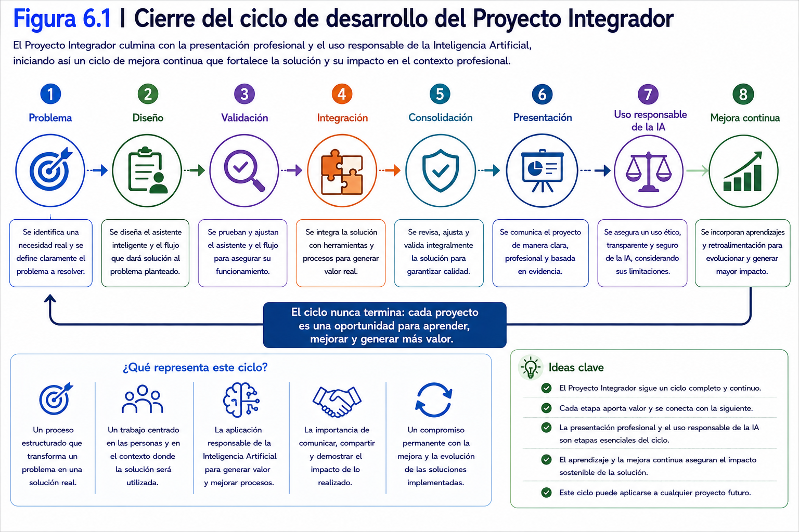
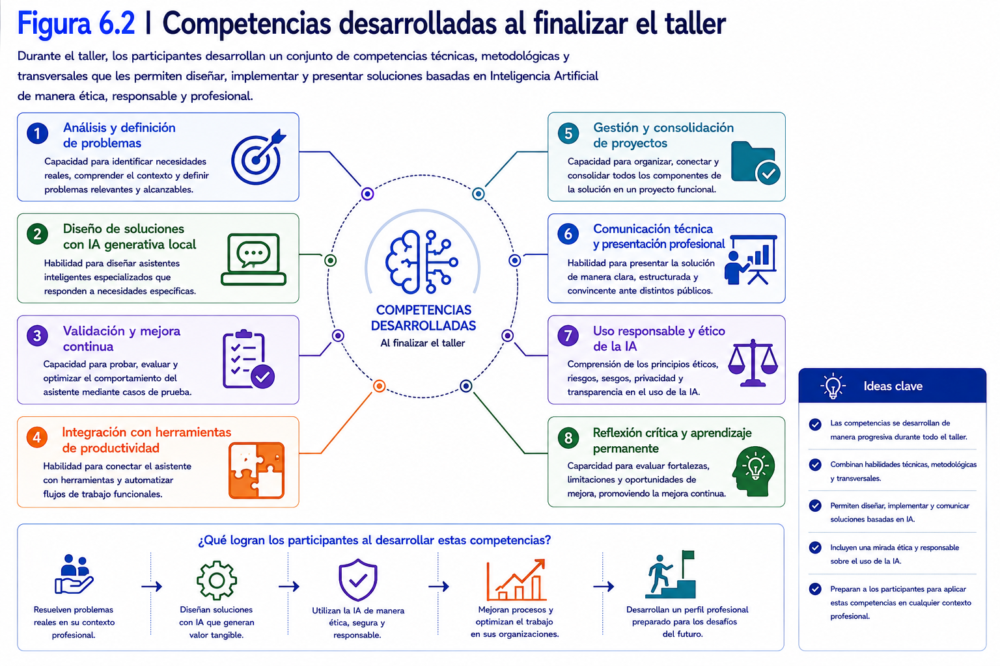
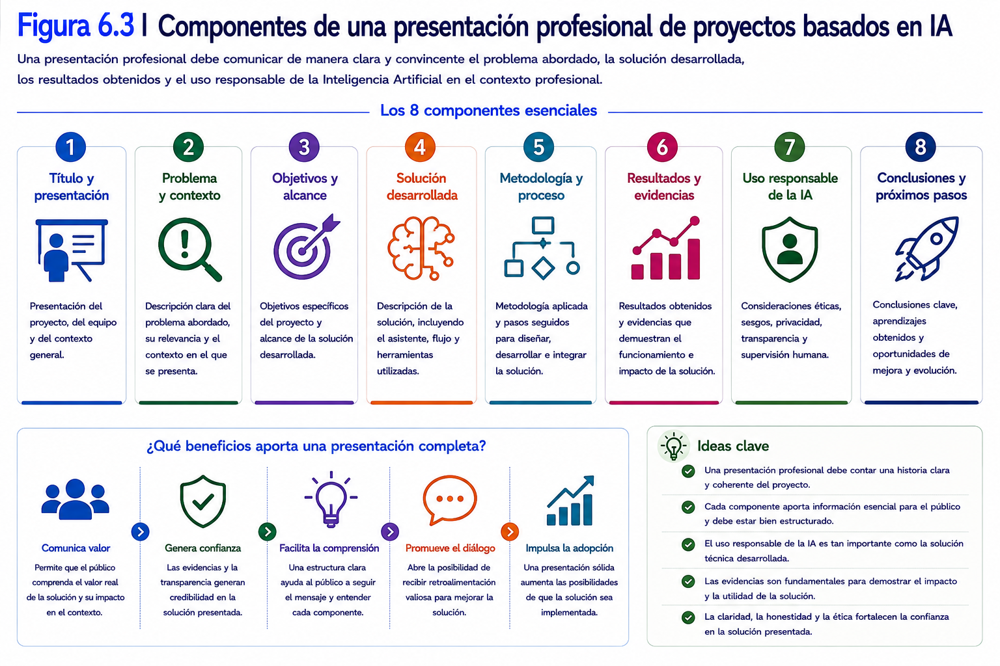
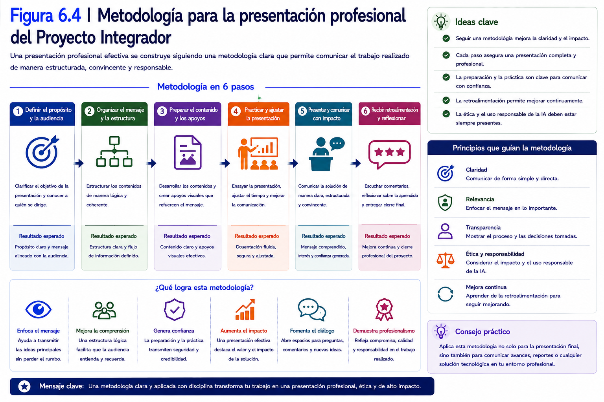
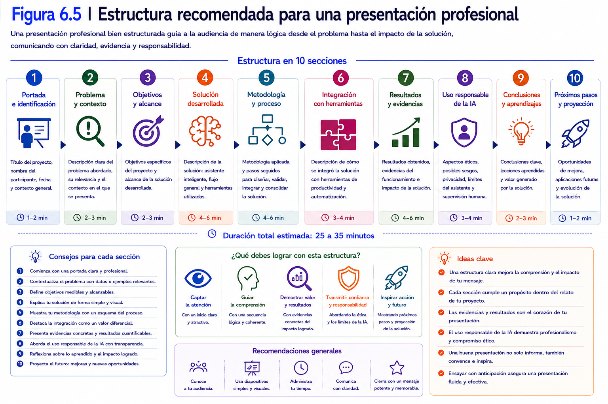
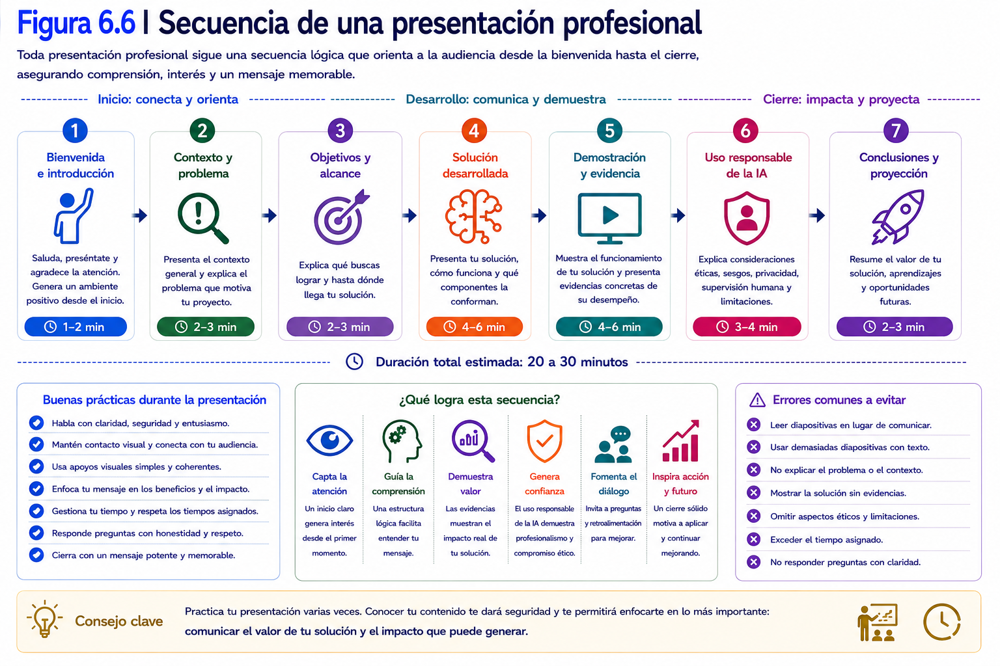
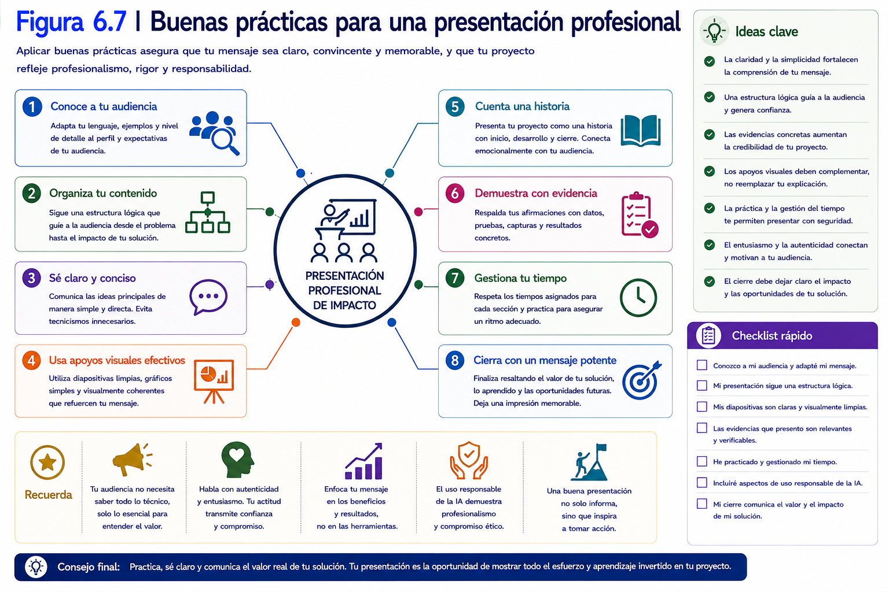
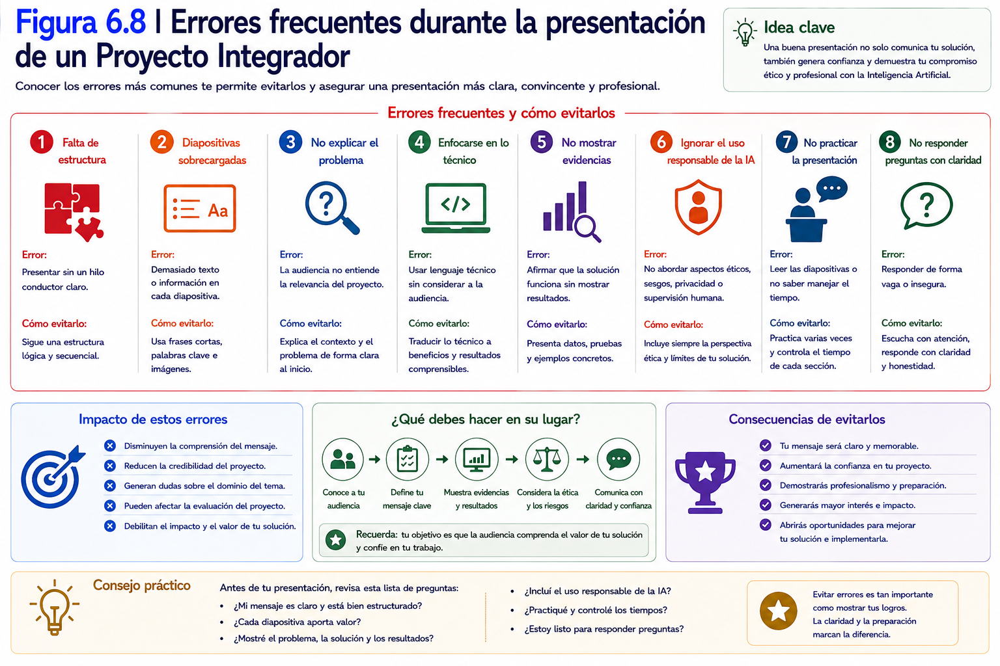
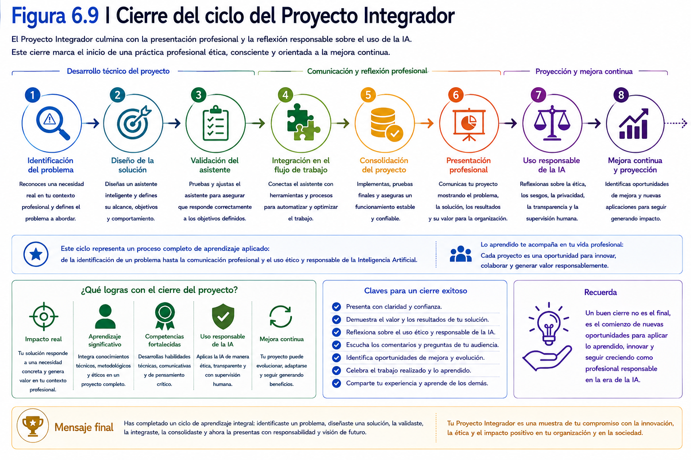
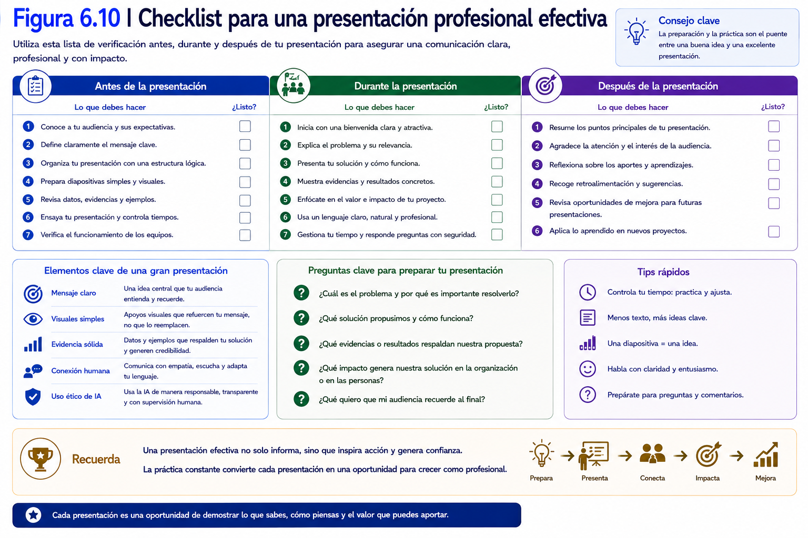

# Capítulo 6
# Presentación del Proyecto Integrador y uso responsable de la Inteligencia Artificial

---

## Contenidos del capítulo

1. Introducción
2. Objetivos de aprendizaje
3. Conceptos fundamentales
4. Desarrollo conceptual
5. Ejemplos de aplicación
6. Demostración conceptual
7. Buenas prácticas
8. Errores comunes
9. Relación con el Proyecto Integrador
10. Síntesis del capítulo
11. Preguntas para la reflexión
12. Bibliografía y recursos recomendados

---

# 1. Introducción

El desarrollo técnico del Proyecto Integrador ha concluido.

Durante este recorrido se definió un problema, se diseñó un asistente inteligente especializado, se validó su comportamiento, se integró dentro de un flujo automatizado y finalmente se consolidó la solución mediante un proceso de revisión integral.

Sin embargo, el término del desarrollo técnico no representa el final del proyecto.

Toda solución tecnológica adquiere su verdadero valor cuando puede ser comprendida, utilizada, evaluada y mejorada por otras personas.

Por esta razón, la última etapa del taller tiene un propósito diferente al de las anteriores.

El objetivo ya no consiste en desarrollar nuevos componentes ni incorporar funcionalidades adicionales.

La atención se centra ahora en comunicar el trabajo realizado de manera clara, fundamentada y profesional.

Cada participante deberá presentar su Proyecto Integrador explicando el problema abordado, la solución desarrollada, las decisiones técnicas adoptadas, los resultados obtenidos y el valor que la propuesta puede aportar a una organización.

No obstante, una presentación técnica de calidad debe ir más allá de la descripción del funcionamiento de una solución.

Actualmente, el desarrollo de sistemas basados en Inteligencia Artificial exige considerar también aspectos relacionados con el uso responsable de esta tecnología.

Una solución técnicamente correcta puede generar consecuencias no deseadas si incorpora sesgos, utiliza información de manera inadecuada, carece de mecanismos de supervisión o produce resultados que los usuarios interpretan como absolutamente confiables.

En consecuencia, la evaluación de un proyecto basado en Inteligencia Artificial no debe limitarse únicamente a verificar su funcionamiento.

También resulta necesario analizar aspectos como:

- la pertinencia de la solución respecto del problema planteado;
- la transparencia del funcionamiento del sistema;
- la calidad y el origen de la información utilizada;
- la existencia de posibles sesgos en las respuestas generadas;
- la protección de la información procesada;
- la necesidad de mantener supervisión humana durante la toma de decisiones;
- las limitaciones propias del asistente inteligente.

Incorporar esta perspectiva no significa desconfiar de la Inteligencia Artificial.

Por el contrario, implica reconocer tanto su potencial como sus limitaciones y asumir la responsabilidad profesional asociada a su utilización dentro de organizaciones públicas y privadas.

Durante este capítulo, cada participante organizará la versión definitiva del Portafolio del Proyecto Integrador, preparará la demostración funcional de su solución y realizará una presentación donde comunicará los principales resultados obtenidos.

Asimismo, reflexionará sobre las fortalezas, limitaciones y oportunidades de mejora de su proyecto, incorporando una mirada ética y responsable sobre el uso de la Inteligencia Artificial en su contexto profesional.

Con ello finalizará un proceso de aprendizaje que no sólo permitió construir una solución tecnológica, sino también desarrollar criterios para implementarla, comunicarla y utilizarla de manera responsable.

---

  

---

### Ideas clave

Al finalizar esta introducción, el participante debería comprender que:

- El desarrollo técnico del Proyecto Integrador ha concluido y comienza la etapa de comunicación profesional de la solución.
- Una presentación efectiva debe explicar tanto el funcionamiento de la solución como el valor que aporta a la organización.
- El uso responsable de la Inteligencia Artificial constituye un componente esencial de cualquier proyecto tecnológico.
- Aspectos como la ética, los sesgos, la privacidad, la transparencia y la supervisión humana deben formar parte de la evaluación final de una solución basada en IA.
- El último capítulo representa el cierre del proceso de aprendizaje y el inicio de una práctica profesional responsable en el diseño e implementación de soluciones basadas en Inteligencia Artificial.

# 2. Objetivos de aprendizaje

Al finalizar este capítulo, el participante será capaz de:

- Presentar de manera clara y estructurada el Proyecto Integrador, comunicando el problema abordado, la solución desarrollada y los resultados obtenidos.

- Demostrar el funcionamiento de la solución mediante una presentación técnica apoyada en evidencias obtenidas durante el desarrollo del proyecto.

- Fundamentar las principales decisiones técnicas adoptadas durante el diseño, validación, integración y consolidación del Proyecto Integrador.

- Analizar críticamente las fortalezas, limitaciones y oportunidades de mejora de la solución desarrollada.

- Evaluar el Proyecto Integrador considerando aspectos relacionados con la ética, la transparencia, los posibles sesgos y el uso responsable de la Inteligencia Artificial.

- Organizar la versión definitiva del Portafolio del Proyecto Integrador como evidencia del proceso de aprendizaje desarrollado durante el taller.

- Reflexionar sobre la aplicabilidad de la solución en otros contextos profesionales y sobre su evolución futura.

---

## Competencias que se desarrollan durante este capítulo

Durante este capítulo el participante fortalecerá competencias relacionadas con:

- Comunicación técnica de soluciones tecnológicas.
- Presentación profesional de proyectos.
- Argumentación y fundamentación de decisiones técnicas.
- Evaluación crítica de soluciones basadas en Inteligencia Artificial.
- Uso responsable y ético de tecnologías de IA.
- Reflexión sobre la mejora continua de proyectos tecnológicos.

---

## Vinculación con el Proyecto Integrador

Este capítulo representa la culminación del Proyecto Integrador.

Después de haber diseñado, validado, integrado y consolidado la solución, el participante deberá demostrar que comprende tanto el funcionamiento técnico del proyecto como el valor que éste aporta a su contexto profesional.

Para ello, organizará el Portafolio del Proyecto Integrador incorporando las principales evidencias obtenidas durante el taller, tales como:

- definición del problema;
- diseño del asistente inteligente;
- arquitectura de integración;
- resultados de validación;
- evidencias del flujo automatizado;
- mejoras realizadas durante la consolidación;
- reflexión final sobre el proyecto.

El Portafolio constituirá el principal respaldo de la presentación realizada durante este capítulo.

---

## El propósito de este capítulo

El  último capítulo no busca identificar el "mejor" proyecto.

Su finalidad consiste en que cada participante sea capaz de explicar, justificar y reflexionar sobre el trabajo desarrollado.

Una presentación profesional debe demostrar que el participante comprende:

- el problema que intentó resolver;
- las decisiones adoptadas durante el desarrollo;
- el funcionamiento de la solución;
- las limitaciones existentes;
- el valor que la propuesta aporta a la organización.

Asimismo, deberá evidenciar una comprensión crítica respecto del uso responsable de la Inteligencia Artificial, reconociendo que toda solución tecnológica implica responsabilidades relacionadas con la calidad de los datos, la existencia de posibles sesgos, la protección de la información y la necesidad de mantener supervisión humana cuando las decisiones puedan afectar a las personas.

---

## Al finalizar este capítulo...

Cada participante dispondrá de:

- un Proyecto Integrador completamente documentado;
- un Portafolio organizado y respaldado mediante evidencias;
- una presentación técnica estructurada;
- una demostración funcional de la solución desarrollada;
- una reflexión crítica sobre el uso responsable de la Inteligencia Artificial en su contexto profesional.

Con ello culminará el proceso formativo desarrollado durante el taller y se dispondrá de una base metodológica para continuar diseñando e implementando soluciones basadas en Inteligencia Artificial Generativa Local en distintos ámbitos profesionales.

---

  

---

### Ideas clave

Al finalizar esta sección, el participante debería comprender que:

- La etapa final está orientada a comunicar y fundamentar profesionalmente el Proyecto Integrador.
- El Portafolio constituye la principal evidencia del proceso de aprendizaje desarrollado durante el taller.
- La evaluación de una solución basada en IA debe considerar tanto aspectos técnicos como éticos y organizacionales.
- La capacidad para comunicar una solución resulta tan importante como su correcto funcionamiento técnico.
- El taller concluye promoviendo una práctica profesional basada en la responsabilidad, la mejora continua y el uso consciente de la Inteligencia Artificial.

# 3. Conceptos fundamentales

El desarrollo de una solución basada en Inteligencia Artificial no concluye cuando el sistema funciona correctamente.

En un contexto profesional, resulta igualmente importante comunicar el proyecto, justificar las decisiones adoptadas, reconocer sus limitaciones y analizar el impacto que puede generar sobre las personas y la organización.

Por esta razón, la última etapa del Proyecto Integrador incorpora conceptos relacionados con la comunicación técnica, la evaluación crítica y el uso responsable de la Inteligencia Artificial.

Estos elementos permiten transformar una solución funcional en una propuesta profesional, preparada para ser comprendida, utilizada y mejorada por otros.

---

## 3.1 Presentación técnica

La presentación técnica corresponde al proceso mediante el cual un equipo comunica el desarrollo de una solución tecnológica a una audiencia determinada.

Su propósito no consiste únicamente en mostrar el funcionamiento del sistema.

También busca explicar:

- el problema abordado;
- la metodología utilizada;
- las decisiones técnicas adoptadas;
- los resultados obtenidos;
- las limitaciones identificadas;
- las oportunidades de mejora.

Una buena presentación permite que otras personas comprendan el valor de la solución, aun cuando no hayan participado en su desarrollo.

---

## 3.2 Demostración funcional

La demostración funcional consiste en evidenciar que la solución desarrollada opera de acuerdo con los objetivos definidos durante el proyecto.

A diferencia de una explicación teórica, la demostración muestra el comportamiento real del sistema mediante un caso de uso representativo.

Durante esta actividad resulta recomendable utilizar ejemplos previamente preparados que permitan observar el funcionamiento completo del flujo automatizado.

El propósito no es impresionar a la audiencia mediante funcionalidades complejas, sino demostrar de manera clara que la solución responde efectivamente al problema planteado.

---

## 3.3 Argumentación técnica

Toda solución tecnológica incorpora múltiples decisiones relacionadas con el diseño, la arquitectura y la implementación.

La argumentación técnica corresponde a la capacidad para explicar por qué dichas decisiones fueron adoptadas y cuáles fueron los criterios utilizados para seleccionarlas.

Una argumentación sólida permite demostrar que el proyecto no fue construido mediante prueba y error, sino a partir de un proceso sistemático de análisis y toma de decisiones.

---

## 3.4 Retroalimentación

La retroalimentación corresponde al conjunto de observaciones, preguntas y sugerencias realizadas por otras personas después de conocer una solución tecnológica.

Lejos de interpretarse como una crítica negativa, constituye una oportunidad para identificar aspectos susceptibles de mejora.

En proyectos basados en Inteligencia Artificial, la retroalimentación resulta especialmente valiosa debido a la naturaleza evolutiva de este tipo de soluciones.

---

## 3.5 Uso responsable de la Inteligencia Artificial

El uso responsable de la Inteligencia Artificial implica desarrollar e implementar soluciones considerando no sólo su funcionamiento técnico, sino también el impacto que pueden generar sobre las personas, las organizaciones y la sociedad.

Este enfoque reconoce que toda tecnología incorpora beneficios, pero también riesgos que deben ser gestionados adecuadamente.

Entre los principales aspectos que deben analizarse se encuentran:

- la transparencia de la solución;
- la protección de la información;
- la supervisión humana;
- la identificación de posibles sesgos;
- el reconocimiento de las limitaciones del sistema.

Incorporar estos elementos fortalece la confiabilidad y legitimidad de las soluciones desarrolladas.

---

## 3.6 Sesgos en Inteligencia Artificial

Un **sesgo** corresponde a una tendencia sistemática que puede producir resultados injustos, incorrectos o poco representativos para determinados usuarios o situaciones.

Los sesgos pueden originarse por múltiples razones, entre ellas:

- datos de entrenamiento incompletos;
- información desactualizada;
- ejemplos poco representativos;
- instrucciones ambiguas;
- interpretaciones incorrectas del contexto.

Aunque los modelos actuales poseen una elevada capacidad de procesamiento, ningún sistema está completamente libre de sesgos.

Por ello, las respuestas generadas por un asistente inteligente siempre deben ser analizadas críticamente antes de utilizarse para apoyar decisiones relevantes.

---

## 3.7 Supervisión humana

La supervisión humana consiste en mantener la participación activa de las personas durante aquellas etapas del proceso donde las decisiones pueden producir efectos importantes sobre individuos u organizaciones.

La Inteligencia Artificial puede apoyar el análisis, organizar información y generar recomendaciones.

Sin embargo, las decisiones relevantes deben mantenerse bajo mecanismos adecuados de supervisión y responsabilidad humana u organizacional.

Este principio resulta especialmente relevante en ámbitos como:

- educación;
- salud;
- recursos humanos;
- administración pública;
- gestión financiera.

---

## 3.8 Transparencia

La transparencia implica que los usuarios comprendan cuándo están interactuando con un sistema basado en Inteligencia Artificial y conozcan el propósito para el cual fue diseñado.

Asimismo, supone comunicar claramente:

- las capacidades del sistema;
- sus limitaciones;
- el tipo de información utilizada;
- el alcance de las recomendaciones generadas.

La transparencia fortalece la confianza de los usuarios y favorece un uso responsable de la tecnología.

---

## 3.9 Mejora continua

La presentación final no representa el término del Proyecto Integrador.

Por el contrario, constituye una oportunidad para recibir retroalimentación que permita continuar perfeccionando la solución.

Las observaciones realizadas por docentes, compañeros y futuros usuarios pueden transformarse en nuevas versiones del proyecto, incorporando mejoras tanto técnicas como funcionales.

De esta manera, el aprendizaje desarrollado durante el taller trasciende la evaluación final y se proyecta hacia futuros escenarios profesionales.

---

  

---

### Ideas clave

Al finalizar esta sección, el participante debería comprender que:

- Una presentación técnica debe explicar tanto el funcionamiento de la solución como las decisiones adoptadas durante su desarrollo.
- La demostración funcional permite evidenciar que el Proyecto Integrador responde al problema identificado.
- La argumentación técnica fortalece la credibilidad y solidez del proyecto.
- El uso responsable de la Inteligencia Artificial requiere considerar aspectos relacionados con la transparencia, los sesgos, la privacidad y la supervisión humana.
- La retroalimentación y la mejora continua forman parte del ciclo natural de evolución de cualquier solución tecnológica.

# 4. Desarrollo conceptual

El desarrollo de un proyecto tecnológico no concluye cuando la solución funciona correctamente.

En el ámbito profesional resulta igualmente importante comunicar el trabajo realizado, demostrar el funcionamiento de la solución, justificar las decisiones adoptadas y reflexionar sobre su impacto dentro de la organización.

Una presentación técnica constituye mucho más que una exposición oral.

Representa la oportunidad para evidenciar el proceso seguido durante el desarrollo del proyecto, explicar el valor de la solución y demostrar que las decisiones adoptadas fueron técnicamente fundamentadas y profesionalmente responsables.

Para ello, se propone una metodología compuesta por seis etapas.

---

## 4.1 Organizar la narrativa del proyecto

Toda presentación debe construirse como una historia lógica.

El objetivo no consiste en describir cronológicamente todas las actividades realizadas, sino en mostrar cómo una necesidad dio origen a una solución.

Una estructura recomendada considera los siguientes elementos:

- contexto del problema;
- necesidad identificada;
- solución propuesta;
- desarrollo del asistente inteligente;
- integración dentro del flujo automatizado;
- resultados obtenidos;
- conclusiones y proyección futura.

Esta secuencia facilita que la audiencia comprenda el propósito del proyecto antes de conocer los aspectos técnicos.

---

## 4.2 Demostrar la solución mediante un caso representativo

La demostración constituye uno de los momentos más relevantes de la presentación.

En lugar de ejecutar múltiples ejemplos, resulta recomendable seleccionar un caso representativo que permita observar el funcionamiento completo del proceso.

Durante la demostración debería apreciarse claramente:

- la captura de información;
- el procesamiento realizado por el asistente;
- la interacción entre los componentes del flujo;
- el resultado final obtenido.

Una demostración breve, estable y bien preparada suele ser más efectiva que una presentación extensa con numerosos ejemplos.

---

## 4.3 Fundamentar las decisiones técnicas

Una solución profesional debe explicar no sólo qué fue desarrollado, sino también por qué se adoptaron determinadas decisiones.

Durante la presentación resulta conveniente justificar aspectos como:

- la selección del problema;
- el diseño del asistente inteligente;
- la elección del flujo de integración;
- los ajustes realizados durante la validación;
- las mejoras incorporadas durante la consolidación.

La fundamentación demuestra comprensión del proceso de desarrollo y fortalece la credibilidad del proyecto.

---

## 4.4 Analizar críticamente la solución

Toda solución tecnológica posee fortalezas y limitaciones.

Reconocerlas constituye una muestra de madurez profesional.

Durante esta etapa de la presentación resulta recomendable analizar:

- los principales beneficios obtenidos;
- las limitaciones actuales;
- las condiciones bajo las cuales la solución funciona adecuadamente;
- los aspectos susceptibles de mejora.

Este análisis permite comprender que el Proyecto Integrador representa una versión funcional susceptible de evolucionar en el futuro.

---

## 4.5 Incorporar una perspectiva de uso responsable

Las soluciones basadas en Inteligencia Artificial requieren un análisis que trascienda los aspectos técnicos.

Antes de considerar finalizado el proyecto, resulta recomendable responder preguntas como:

- ¿La solución protege adecuadamente la información utilizada?
- ¿Existe riesgo de que las respuestas contengan sesgos?
- ¿Las recomendaciones generadas requieren validación humana?
- ¿Los usuarios conocen las limitaciones del sistema?
- ¿El proceso es suficientemente transparente para quienes utilizarán la solución?

Responder estas preguntas fortalece la calidad del proyecto y demuestra un ejercicio responsable de la Inteligencia Artificial.

---

## 4.6 Proyectar la evolución futura

Ninguna solución tecnológica permanece estática.

Toda implementación puede evolucionar mediante nuevas funcionalidades, mejoras metodológicas o cambios en las necesidades de la organización.

Finalizar la presentación identificando posibles líneas de desarrollo futuro demuestra que el Proyecto Integrador constituye el inicio de un proceso de innovación y no únicamente el resultado de una actividad académica.

---

## Una presentación profesional como evidencia de aprendizaje

El propósito de la presentación final no consiste únicamente en evaluar conocimientos.

También permite demostrar competencias profesionales relacionadas con:

- comunicación técnica;
- pensamiento crítico;
- capacidad de análisis;
- argumentación;
- responsabilidad en el uso de la Inteligencia Artificial.

En consecuencia, la presentación constituye la evidencia integradora del aprendizaje desarrollado durante todo el taller.

---

### Lista de verificación para una presentación profesional

Antes de realizar la presentación final, resulta recomendable verificar los siguientes aspectos:

| Aspecto | Verificación |
|---------|--------------|
| El problema está claramente definido | ☐ |
| La solución responde al problema identificado | ☐ |
| El funcionamiento del flujo puede demostrarse correctamente | ☐ |
| Las decisiones técnicas están debidamente fundamentadas | ☐ |
| Las evidencias se encuentran organizadas | ☐ |
| El Portafolio está completo | ☐ |
| Se reconocen las limitaciones del proyecto | ☐ |
| Se analizaron posibles riesgos éticos y sesgos | ☐ |
| Se explica el rol de la supervisión humana | ☐ |
| Se identifican oportunidades de mejora futura | ☐ |

---

  

---

### Ideas clave

Al finalizar esta sección, el participante debería comprender que:

- Una presentación técnica debe estructurarse como una explicación coherente del problema, la solución y los resultados obtenidos.
- La demostración funcional debe centrarse en evidenciar el valor de la solución y no únicamente su funcionamiento técnico.
- Fundamentar las decisiones adoptadas fortalece la credibilidad del Proyecto Integrador.
- El análisis de aspectos éticos, posibles sesgos, privacidad, transparencia y supervisión humana forma parte de la evaluación de cualquier solución basada en Inteligencia Artificial.
- La presentación final constituye una evidencia del aprendizaje alcanzado y una oportunidad para proyectar futuras mejoras de la solución desarrollada.

# 5. Ejemplos de aplicación

Una misma solución tecnológica puede generar percepciones muy diferentes dependiendo de la forma en que sea presentada.

En muchas ocasiones, proyectos técnicamente sólidos no logran transmitir adecuadamente el valor que aportan debido a una presentación poco estructurada, excesivamente técnica o centrada únicamente en las herramientas utilizadas.

Por el contrario, una presentación organizada permite que la audiencia comprenda con facilidad el problema abordado, la solución desarrollada y el impacto que ésta puede generar.

Los siguientes ejemplos ilustran distintas formas de comunicar un Proyecto Integrador.

---

## Ejemplo 1. Educación superior

Una participante desarrolló un asistente inteligente para apoyar la clasificación automática de consultas académicas recibidas por una unidad de apoyo estudiantil.

Durante la presentación comenzó describiendo el funcionamiento de Google Forms, Google Sheets y Google Apps Script.

Aunque la solución funcionaba correctamente, la audiencia tuvo dificultades para comprender cuál era el problema que intentaba resolver.

Después de reorganizar la presentación, decidió comenzar explicando:

- el aumento de consultas estudiantiles;
- la necesidad de agilizar las respuestas;
- las limitaciones del proceso manual.

Sólo después presentó la solución tecnológica.

Como resultado, la audiencia comprendió rápidamente el propósito del proyecto y pudo valorar el aporte de la automatización.

---

## Ejemplo 2. Ingeniería

Un participante implementó un asistente para apoyar la revisión de reportes de mantenimiento preventivo.

Durante la demostración mostró el funcionamiento completo del flujo automatizado utilizando un único caso representativo cuidadosamente preparado.

En pocos minutos la audiencia pudo observar:

- la captura de información;
- el procesamiento mediante IA;
- la respuesta generada;
- el registro automático del resultado.

La demostración resultó clara porque se concentró en un escenario concreto y evitó ejemplos innecesarios.

---

## Ejemplo 3. Salud

Una profesional presentó una solución destinada a apoyar procesos administrativos relacionados con solicitudes internas.

Durante la exposición explicó no sólo el funcionamiento del asistente, sino también las limitaciones identificadas durante el desarrollo.

Además, señaló explícitamente que las respuestas generadas por la IA debían ser revisadas por personal responsable antes de adoptar decisiones administrativas.

Esta explicación fortaleció la confianza de la audiencia y evidenció una comprensión responsable del uso de la Inteligencia Artificial.

---

## Ejemplo 4. Investigación

Un investigador desarrolló un asistente para clasificar observaciones obtenidas durante un trabajo de campo.

En lugar de afirmar que el sistema clasificaba correctamente todos los casos, explicó que existían situaciones excepcionales donde la intervención humana continuaba siendo necesaria.

También describió las mejoras que esperaba incorporar en futuras versiones del proyecto.

Esta actitud permitió presentar una visión realista y técnicamente fundamentada de la solución.

---

## Ejemplo 5. Gestión organizacional

Una profesional automatizó el procesamiento inicial de solicitudes internas utilizando un asistente inteligente integrado con Google Workspace.

Durante la presentación dedicó unos minutos a explicar cómo protegía la información utilizada por el sistema y qué mecanismos había incorporado para reducir posibles errores en el procesamiento automático.

Asimismo, aclaró que la solución apoyaba la toma de decisiones, pero no reemplazaba la responsabilidad de los profesionales encargados del proceso.

La audiencia valoró especialmente esta reflexión sobre el uso responsable de la Inteligencia Artificial.

---

## ¿Qué tienen en común estas presentaciones?

Aunque los proyectos pertenecen a ámbitos profesionales diferentes, todos comparten una estructura similar.

Cada presentación:

1. comienza describiendo el problema;
2. explica la solución desarrollada;
3. demuestra el funcionamiento mediante un caso representativo;
4. fundamenta las decisiones técnicas;
5. reconoce las limitaciones existentes;
6. reflexiona sobre el uso responsable de la Inteligencia Artificial;
7. proyecta posibles mejoras futuras.

Esta estructura facilita que la audiencia comprenda tanto el funcionamiento como el valor de la solución presentada.

---

  

---

### Ideas clave

Al finalizar esta sección, el participante debería comprender que:

- Una buena presentación comienza explicando el problema antes de describir la tecnología utilizada.
- La demostración debe centrarse en un caso representativo que permita comprender el funcionamiento de la solución.
- Reconocer limitaciones y oportunidades de mejora fortalece la credibilidad del proyecto.
- El uso responsable de la Inteligencia Artificial forma parte de una presentación técnica profesional.
- Comunicar adecuadamente el valor del Proyecto Integrador resulta tan importante como demostrar su correcto funcionamiento.

# 6. Demostración conceptual

Después de cinco capítulos, cada participante dispone de un Proyecto Integrador completamente desarrollado.

El problema ha sido definido, el asistente inteligente ha sido diseñado y validado, el flujo automatizado se encuentra operativo y la solución ha sido consolidada mediante una revisión integral.

El desafío de este último capítulo consiste en comunicar ese trabajo de manera clara, organizada y profesional.

La siguiente demostración conceptual presenta una estructura de referencia que puede utilizarse para preparar la presentación final del Proyecto Integrador.

---

## Situación inicial

Una participante desarrolló un asistente inteligente para apoyar la gestión de solicitudes académicas recibidas mediante formularios institucionales.

La solución integra:

- Google Forms para la captura de información;
- Google Sheets para el registro de los datos y el estado de las solicitudes;
- Google Apps Script y el Web App para gestionar el intercambio de información;
- `puente_local.py` para coordinar el procesamiento de las solicitudes en el entorno local;
- Ollama para ejecutar localmente el modelo de lenguaje;
- Gmail para enviar automáticamente las respuestas a los usuarios.

La solución funciona correctamente y ha sido validada durante los capítulos anteriores.

Ahora corresponde comunicar el proyecto.

---

## Paso 1. Presentar el problema

La participante inicia la exposición describiendo brevemente el contexto que dio origen al proyecto.

Explica:

- cuál era la situación inicial;
- qué dificultades presentaba el proceso existente;
- por qué era necesario automatizar parte del trabajo;
- quiénes serían los principales beneficiarios de la solución.

De esta manera, la audiencia comprende primero la necesidad antes de conocer la tecnología utilizada.

---

## Paso 2. Explicar la solución

A continuación presenta la arquitectura general del Proyecto Integrador.

Describe brevemente:

- el papel del asistente inteligente;
- el flujo automatizado implementado;
- la interacción entre los distintos componentes;
- el resultado esperado del proceso.

En esta etapa evita profundizar innecesariamente en aspectos técnicos que no aportan a la comprensión global del proyecto.

---

## Paso 3. Realizar la demostración funcional

Posteriormente ejecuta un único caso de uso representativo.

Durante la demostración muestra:

- el ingreso de una consulta mediante Google Forms;
- el registro de la solicitud en Google Sheets;
- el procesamiento de la solicitud mediante el modelo ejecutado localmente;
- el registro automático de la respuesta y del estado del procesamiento;
- la recepción de la respuesta mediante correo electrónico.

La demostración es breve, estable y permite observar el funcionamiento completo de la solución.

---

## Paso 4. Fundamentar las decisiones adoptadas

Después de la demostración, la participante explica algunas de las decisiones más relevantes tomadas durante el desarrollo del proyecto.

Por ejemplo:

- por qué seleccionó ese problema;
- por qué diseñó el asistente con ese contexto disciplinar;
- por qué eligió esa arquitectura de integración;
- qué ajustes realizó después de la etapa de validación.

Estas explicaciones permiten comprender el razonamiento técnico que sustentó el desarrollo de la solución.

---

## Paso 5. Reflexionar sobre el uso responsable de la IA

Antes de finalizar la presentación, la participante incorpora una reflexión relacionada con el uso responsable de la Inteligencia Artificial.

Explica que:

- la solución apoya el análisis de información, pero no reemplaza el criterio profesional;
- las respuestas del asistente deben ser revisadas antes de adoptar decisiones importantes;
- la información procesada corresponde únicamente a los datos necesarios para ejecutar el flujo;
- el proyecto reconoce la posibilidad de respuestas incorrectas o incompletas y considera la supervisión humana como parte del proceso.

Esta reflexión demuestra una comprensión madura respecto de las capacidades y limitaciones de la tecnología utilizada.

---

## Paso 6. Cerrar la presentación

Finalmente, la participante resume los principales resultados obtenidos.

Destaca:

- el problema resuelto;
- el valor aportado a la organización;
- las principales fortalezas del proyecto;
- las oportunidades de mejora futura.

Con ello concluye la presentación dejando claro que el Proyecto Integrador representa una solución funcional y una base para futuros desarrollos.

---

## ¿Qué desarrollará el participante durante el laboratorio?

Durante el laboratorio final, cada participante preparará y presentará su propio Proyecto Integrador siguiendo una estructura similar a la presentada en esta demostración.

El trabajo comprenderá las siguientes actividades:

- organización del Portafolio del Proyecto Integrador;
- preparación de la presentación técnica;
- verificación de la demostración funcional;
- revisión de las evidencias seleccionadas;
- incorporación de una reflexión sobre el uso responsable de la Inteligencia Artificial;
- presentación del proyecto ante el docente y los demás participantes.

El objetivo no será memorizar un discurso, sino comunicar de forma clara, fundamentada y profesional el proceso desarrollado durante el taller.

---

  

---

### Ideas clave

Al finalizar esta demostración, el participante debería comprender que:

- Una presentación profesional comienza explicando el problema antes que la tecnología utilizada.
- La demostración funcional debe evidenciar el valor de la solución mediante un caso representativo.
- Fundamentar las decisiones adoptadas fortalece la credibilidad del Proyecto Integrador.
- Incorporar una reflexión sobre el uso responsable de la Inteligencia Artificial demuestra madurez profesional y comprensión de las implicancias de esta tecnología.
- La presentación final constituye la evidencia integradora de todo el proceso de aprendizaje desarrollado durante el taller.

# 7. Buenas prácticas

La presentación del Proyecto Integrador constituye la oportunidad para comunicar el trabajo desarrollado durante todo el taller.

Una buena solución tecnológica puede perder parte de su valor si no logra explicar claramente el problema abordado, las decisiones adoptadas y los resultados obtenidos.

Las siguientes recomendaciones corresponden a buenas prácticas utilizadas habitualmente en la presentación de proyectos tecnológicos y pueden contribuir a fortalecer la calidad de la exposición final.

---

## 7.1 Comenzar explicando el problema

El interés de la audiencia se genera cuando comprende la necesidad que motivó el desarrollo de la solución.

Por ello, resulta recomendable iniciar la presentación describiendo:

- el contexto del problema;
- las dificultades identificadas;
- las consecuencias del proceso existente;
- la necesidad de incorporar una solución basada en Inteligencia Artificial.

Una vez comprendido el problema, la audiencia estará en mejores condiciones para valorar la solución propuesta.

---

## 7.2 Presentar la tecnología como un medio y no como el objetivo

Durante la exposición conviene evitar que la atención se concentre exclusivamente en las herramientas utilizadas.

Google Forms, Google Sheets, Google Apps Script, Ollama u Open WebUI representan componentes importantes del proyecto, pero su función consiste en apoyar la solución del problema identificado.

El centro de la presentación debe ser siempre el valor que la solución aporta al proceso organizacional.

---

## 7.3 Preparar previamente la demostración funcional

Las demostraciones en vivo requieren planificación.

Antes de la presentación resulta conveniente verificar:

- el funcionamiento del flujo automatizado;
- la disponibilidad de los archivos necesarios;
- la correcta ejecución del asistente inteligente;
- la conectividad y el entorno de trabajo.

Asimismo, es recomendable disponer de capturas de pantalla o evidencias previamente preparadas para enfrentar situaciones imprevistas durante la demostración.

---

## 7.4 Comunicar con claridad y precisión

Una presentación técnica no requiere utilizar un lenguaje excesivamente complejo.

Resulta preferible emplear explicaciones claras, organizadas y directamente relacionadas con el problema que se intenta resolver.

Siempre que sea posible, conviene:

- utilizar ejemplos concretos;
- evitar tecnicismos innecesarios;
- explicar cada componente dentro del contexto del proyecto.

Una comunicación clara facilita la comprensión por parte de audiencias con distintos niveles de conocimiento técnico.

---

## 7.5 Fundamentar las decisiones importantes

Las decisiones relevantes adoptadas durante el desarrollo deben estar respaldadas por argumentos técnicos.

Cuando se explique una elección, conviene responder preguntas como:

- ¿Por qué se seleccionó ese problema?
- ¿Por qué se eligió esa arquitectura?
- ¿Qué criterios justificaron el diseño del asistente?
- ¿Qué mejoras surgieron después de la validación?

Esta fundamentación fortalece la calidad profesional de la presentación.

---

## 7.6 Reconocer las limitaciones de la solución

Toda solución tecnológica posee restricciones.

Presentarlas de manera transparente demuestra pensamiento crítico y una adecuada comprensión del alcance del proyecto.

Entre otros aspectos, puede resultar pertinente mencionar:

- situaciones donde el asistente requiere supervisión humana;
- escenarios para los cuales la solución aún no ha sido validada;
- funcionalidades que podrían incorporarse en futuras versiones.

Reconocer estas limitaciones no debilita el proyecto; por el contrario, aumenta su credibilidad.

---

## 7.7 Promover un uso responsable de la Inteligencia Artificial

Toda solución basada en IA debe desarrollarse considerando principios de responsabilidad profesional.

Antes de finalizar la presentación, resulta recomendable explicar cómo el proyecto aborda aspectos como:

- protección de la información procesada;
- revisión de posibles sesgos;
- transparencia respecto del funcionamiento del sistema;
- supervisión humana cuando las decisiones puedan afectar a personas;
- reconocimiento de las limitaciones propias del asistente inteligente.

Esta reflexión demuestra que la tecnología ha sido incorporada de manera consciente y responsable.

---

## 7.8 Finalizar destacando el aprendizaje obtenido

Más allá del resultado técnico, el Proyecto Integrador representa un proceso de aprendizaje.

Concluir la presentación reflexionando sobre:

- los conocimientos adquiridos;
- los desafíos enfrentados;
- las decisiones más relevantes;
- las oportunidades de mejora futura,

permite transmitir una visión madura y profesional del trabajo realizado.

---

  

---

### Ideas clave

Al finalizar esta sección, el participante debería comprender que:

- Una presentación efectiva comienza explicando el problema y finaliza destacando el valor de la solución.
- La demostración funcional debe prepararse cuidadosamente antes de la exposición.
- Las decisiones técnicas deben estar debidamente fundamentadas.
- Reconocer las limitaciones del proyecto fortalece la credibilidad de la presentación.
- El uso responsable de la Inteligencia Artificial constituye un componente esencial de cualquier solución tecnológica presentada en un contexto profesional.

# 8. Errores comunes

La calidad de un Proyecto Integrador no depende exclusivamente del funcionamiento técnico de la solución desarrollada.

Una presentación poco estructurada, una argumentación insuficiente o la ausencia de una reflexión crítica pueden dificultar que la audiencia comprenda el verdadero valor del proyecto.

Reconocer estos errores antes de la presentación final permitirá fortalecer tanto la comunicación como la calidad profesional de la propuesta.

---

## 8.1 Comenzar explicando la tecnología

Uno de los errores más frecuentes consiste en iniciar la presentación describiendo las herramientas utilizadas.

Aunque tecnologías como Google Forms, Google Sheets, Google Apps Script, Ollama u Open WebUI forman parte de la solución, la audiencia necesita comprender primero el problema que motivó el desarrollo del proyecto.

Presentar inicialmente la necesidad organizacional facilita que posteriormente la tecnología adquiera sentido.

---

## 8.2 Convertir la presentación en una demostración técnica

Otro error habitual consiste en dedicar la mayor parte del tiempo a mostrar pantallas, configuraciones o detalles de implementación.

La finalidad de la presentación no es demostrar dominio de una herramienta específica.

Su propósito consiste en comunicar:

- el problema abordado;
- la solución desarrollada;
- el valor obtenido;
- el aprendizaje alcanzado.

La tecnología debe apoyar este relato y no transformarse en el centro de la exposición.

---

## 8.3 No fundamentar las decisiones adoptadas

Algunos participantes describen lo que hicieron, pero no explican por qué tomaron determinadas decisiones.

Sin una fundamentación adecuada, la audiencia puede percibir que las elecciones fueron arbitrarias.

Explicar los criterios utilizados durante el diseño, la validación y la integración fortalece la credibilidad del Proyecto Integrador.

---

## 8.4 Omitir las limitaciones del proyecto

Presentar una solución como si fuera perfecta constituye un error frecuente.

Toda implementación posee restricciones relacionadas con:

- el contexto donde fue desarrollada;
- la calidad de la información disponible;
- las capacidades del asistente inteligente;
- las condiciones bajo las cuales fue validada.

Reconocer estas limitaciones demuestra pensamiento crítico y profesionalismo.

---

## 8.5 Ignorar aspectos éticos

Una solución técnicamente correcta puede generar problemas si durante su desarrollo no se consideraron aspectos relacionados con el uso responsable de la Inteligencia Artificial.

Entre los errores más relevantes se encuentran:

- utilizar información sensible sin autorización;
- procesar datos personales innecesarios;
- asumir que todas las respuestas generadas por la IA son correctas;
- omitir posibles riesgos asociados al uso de la solución.

Estos aspectos deben formar parte de la reflexión final del proyecto.

---

## 8.6 Suponer que la IA reemplaza completamente al profesional

La Inteligencia Artificial constituye una herramienta de apoyo para el análisis y la toma de decisiones.

Sin embargo, delegar completamente decisiones relevantes en un asistente inteligente representa un uso inadecuado de esta tecnología.

En aquellos procesos donde las decisiones puedan afectar a personas u organizaciones, la supervisión humana continúa siendo indispensable.

---

## 8.7 No considerar la existencia de sesgos

Los asistentes inteligentes pueden producir respuestas influenciadas por limitaciones de los datos, del contexto o de las instrucciones recibidas.

Ignorar esta posibilidad puede conducir a interpretaciones incorrectas o decisiones poco fundamentadas.

Por esta razón, toda solución basada en IA debe incorporar mecanismos de revisión y validación antes de utilizar sus resultados en contextos reales.

---

## 8.8 Finalizar sin reflexionar sobre el proyecto

Otro error frecuente consiste en concluir la presentación inmediatamente después de la demostración funcional.

Una presentación profesional debería finalizar con una reflexión que permita responder preguntas como:

- ¿Qué aprendizaje dejó el proyecto?
- ¿Qué aspectos podrían mejorarse?
- ¿Cómo evolucionaría la solución en el futuro?
- ¿Qué impacto podría generar en la organización?

Esta reflexión demuestra una comprensión integral del trabajo realizado.

---

  

---

### Ideas clave

Al finalizar esta sección, el participante debería comprender que:

- La presentación debe centrarse en el problema y en el valor de la solución, no únicamente en la tecnología utilizada.
- Las decisiones técnicas requieren una fundamentación clara y coherente.
- Reconocer las limitaciones del proyecto fortalece la credibilidad de la propuesta.
- El uso responsable de la Inteligencia Artificial exige considerar aspectos relacionados con la ética, los sesgos, la privacidad y la supervisión humana.
- Una reflexión final permite demostrar aprendizaje, pensamiento crítico y proyección profesional.

# 9. Relación con el Proyecto Integrador

El Proyecto Integrador constituye el eje articulador de todo el taller.

A lo largo de los seis capítulos, cada participante desarrolló progresivamente una solución basada en Inteligencia Artificial Generativa Local, integrando conocimientos técnicos, metodológicos y organizacionales para responder a una necesidad identificada en su propio contexto profesional.

Durante los capítulos anteriores, el proyecto evolucionó mediante distintas etapas:

- definición del problema;
- diseño del asistente inteligente;
- validación y optimización;
- integración dentro de un flujo automatizado;
- consolidación de la solución.

En este último capítulo concluye ese proceso.

El objetivo ya no consiste en modificar la solución desarrollada, sino en demostrar que el Proyecto Integrador constituye una propuesta técnicamente fundamentada, funcionalmente coherente y profesionalmente responsable.

---

## ¿Qué desarrollará el participante durante el laboratorio final?

El laboratorio de este capítulo corresponde a la actividad integradora del taller.

Cada participante realizará las siguientes acciones:

- organizará la versión definitiva del Portafolio del Proyecto Integrador;
- revisará las evidencias seleccionadas;
- verificará el correcto funcionamiento de la solución;
- preparará la presentación técnica;
- realizará la demostración funcional;
- responderá consultas y observaciones formuladas por el docente y los demás participantes.

Durante esta actividad el protagonismo recaerá completamente en el participante.

El docente actuará principalmente como facilitador, observador y evaluador del proceso.

---

## El Portafolio como evidencia del aprendizaje

El Portafolio del Proyecto Integrador representa mucho más que un conjunto de documentos.

Constituye la evidencia organizada del recorrido realizado durante todo el taller.

Entre los elementos que deberían formar parte del portafolio se encuentran:

- definición del problema;
- objetivos del proyecto;
- diseño del asistente inteligente;
- arquitectura del flujo automatizado;
- resultados de validación;
- principales ajustes realizados;
- evidencias del funcionamiento;
- reflexión sobre el uso responsable de la Inteligencia Artificial;
- oportunidades de mejora futura.

En conjunto, estos elementos permiten comprender no sólo el resultado obtenido, sino también el proceso seguido para alcanzarlo.

---

## La presentación como evidencia profesional

La presentación final no debe interpretarse únicamente como una instancia de evaluación.

Representa también una oportunidad para desarrollar competencias profesionales relacionadas con:

- comunicación técnica;
- argumentación;
- pensamiento crítico;
- análisis de soluciones;
- trabajo colaborativo;
- reflexión sobre el impacto de la tecnología.

Estas competencias resultan tan relevantes como el funcionamiento técnico de la solución desarrollada.

---

## Cierre del Proyecto Integrador

Al finalizar este capítulo, el Proyecto Integrador habrá completado todo su ciclo de desarrollo dentro del taller.

Sin embargo, ello no significa que la solución haya alcanzado su versión definitiva.

Por el contrario, el proyecto queda preparado para continuar evolucionando mediante nuevas necesidades organizacionales, mejoras tecnológicas y futuras experiencias profesionales.

El aprendizaje alcanzado durante el taller constituye, por tanto, el punto de partida para el desarrollo de nuevas soluciones basadas en Inteligencia Artificial.

---

  

---

### Ideas clave

Al finalizar esta sección, el participante debería comprender que:

- El Proyecto Integrador representa la evidencia principal del aprendizaje desarrollado durante el taller.
- El laboratorio final está orientado a comunicar, demostrar y fundamentar profesionalmente la solución construida.
- El Portafolio documenta tanto el resultado obtenido como el proceso seguido para alcanzarlo.
- La presentación final permite desarrollar competencias profesionales relacionadas con la comunicación técnica, el pensamiento crítico y la argumentación.
- El término del taller no representa el final del proyecto, sino el inicio de nuevas oportunidades para continuar perfeccionando la solución desarrollada y aplicar los principios del uso responsable de la Inteligencia Artificial en futuros contextos profesionales.

# 10. Síntesis del capítulo

Este último capítulo permitió completar el ciclo de desarrollo del Proyecto Integrador.

Después de diseñar, validar, integrar y consolidar una solución basada en Inteligencia Artificial Generativa Local, el trabajo se orientó hacia su comunicación profesional, la organización del Portafolio y la reflexión sobre el uso responsable de esta tecnología.

A lo largo del capítulo se analizaron los elementos que caracterizan una presentación técnica de calidad.

Se destacó la importancia de explicar el problema antes de describir la solución, demostrar el funcionamiento mediante un caso representativo, fundamentar las principales decisiones adoptadas durante el desarrollo y reconocer tanto las fortalezas como las limitaciones del proyecto.

Asimismo, se incorporó una perspectiva de uso responsable de la Inteligencia Artificial, considerando aspectos relacionados con la transparencia, la supervisión humana, los posibles sesgos, la protección de la información y la responsabilidad profesional asociada al desarrollo de este tipo de soluciones.

Los ejemplos, las buenas prácticas y los errores comunes permitieron comprender que una presentación profesional no busca demostrar únicamente que una solución funciona, sino también evidenciar que ha sido diseñada de manera reflexiva, documentada y alineada con las necesidades de una organización.

Finalmente, el laboratorio proporcionó un espacio para que cada participante organizara la versión definitiva del Portafolio del Proyecto Integrador, preparara su presentación técnica y compartiera los resultados obtenidos durante el taller.

---

## ¿Qué hemos logrado al finalizar el taller?

Al concluir este último capítulo, cada participante dispondrá de:

- un problema organizacional claramente definido;
- un asistente inteligente especializado;
- un asistente validado y optimizado;
- un flujo automatizado funcional;
- una solución consolidada y documentada;
- un Portafolio del Proyecto Integrador organizado;
- una presentación técnica respaldada por evidencias;
- una reflexión crítica sobre el uso responsable de la Inteligencia Artificial.

El Proyecto Integrador deja de ser únicamente un ejercicio académico.

Se transforma en una experiencia de aprendizaje aplicada que puede servir como base para futuros desarrollos tecnológicos dentro del ámbito profesional.

---

## Proyección profesional

Las competencias desarrolladas durante este taller trascienden el uso de una herramienta específica.

La metodología estudiada puede adaptarse a distintos contextos organizacionales, nuevas tecnologías y futuros modelos de Inteligencia Artificial.

En consecuencia, el aprendizaje alcanzado no depende exclusivamente de Ollama, Open WebUI o Google Workspace.

Lo verdaderamente relevante consiste en haber desarrollado una forma sistemática de:

- identificar problemas;
- diseñar soluciones;
- validar resultados;
- integrar tecnologías;
- consolidar proyectos;
- comunicar propuestas;
- incorporar criterios de responsabilidad profesional.

Estas competencias continuarán siendo valiosas aun cuando las herramientas evolucionen con el tiempo.

---

  

---

### Ideas clave

Al finalizar este capítulo, el participante debería recordar que:

- El Proyecto Integrador representa la evidencia del aprendizaje desarrollado durante todo el taller.
- La presentación técnica constituye una oportunidad para comunicar y fundamentar profesionalmente una solución basada en Inteligencia Artificial.
- El uso responsable de la IA implica considerar aspectos relacionados con la transparencia, la privacidad, los posibles sesgos y la supervisión humana.
- Las competencias desarrolladas durante el taller pueden transferirse a nuevos proyectos y contextos profesionales.
- El aprendizaje alcanzado constituye una base para continuar diseñando, implementando y evaluando soluciones tecnológicas de manera ética, crítica y responsable.

# 11. Preguntas para la reflexión

Las siguientes preguntas tienen como propósito favorecer una reflexión integral sobre el Proyecto Integrador y el proceso de aprendizaje desarrollado durante el taller.

Más que evaluar conocimientos técnicos, se espera que el participante analice críticamente las decisiones adoptadas, identifique oportunidades de mejora y reflexione sobre el papel que desempeñará como profesional en el diseño e implementación de soluciones basadas en Inteligencia Artificial.

---

## Reflexión sobre el Proyecto Integrador

### 1.

Después de finalizar el Proyecto Integrador, ¿considera que la solución desarrollada responde de manera efectiva al problema identificado durante las etapas iniciales del Proyecto Integrador?

Fundamente su respuesta utilizando evidencias obtenidas durante el desarrollo del proyecto.

---

### 2.

¿Cuál considera que fue la decisión técnica más importante adoptada durante el desarrollo del Proyecto Integrador?

Explique por qué esa decisión resultó determinante para el resultado final.

---

### 3.

Si dispusiera de una semana adicional para continuar desarrollando el proyecto, ¿qué aspecto mejoraría primero?

Justifique su respuesta.

---

## Reflexión sobre el aprendizaje

### 4.

¿Qué conocimiento adquirido durante el taller considera que tendrá mayor utilidad en su actividad profesional?

Explique cómo espera aplicarlo.

---

### 5.

¿Cuál fue el mayor desafío enfrentado durante el desarrollo del Proyecto Integrador?

¿Cómo logró resolverlo?

---

### 6.

¿Qué etapa del taller considera más relevante para el éxito del proyecto?

- definición del problema;
- diseño del asistente;
- validación;
- integración;
- consolidación;
- presentación.

Fundamente su respuesta.

---

## Reflexión sobre el uso responsable de la IA

### 7.

¿Qué riesgos éticos podrían aparecer si la solución desarrollada fuera utilizada en un entorno organizacional real?

¿Cómo podrían mitigarse?

---

### 8.

¿En qué situaciones considera indispensable mantener supervisión humana sobre las respuestas generadas por el asistente inteligente?

Explique utilizando ejemplos relacionados con su propio contexto profesional.

---

### 9.

¿Qué mecanismos incorporó —o incorporaría en futuras versiones del proyecto— para reducir posibles sesgos o errores en las respuestas generadas por la Inteligencia Artificial?

---

### 10.

¿De qué manera podría comunicar a los futuros usuarios las capacidades y limitaciones de la solución desarrollada?

¿Por qué considera importante hacerlo?

---

## Reflexión profesional

### 11.

¿Cómo cree que evolucionará su Proyecto Integrador durante los próximos años?

¿Qué nuevas funcionalidades o integraciones considera más relevantes?

---

### 12.

Después de completar este taller, ¿cómo definiría el papel de la Inteligencia Artificial dentro de su disciplina profesional?

¿Considera que debe reemplazar tareas humanas, apoyar la toma de decisiones o desempeñar otro rol? Fundamente su respuesta.

---

## Reflexión final

Antes de dar por concluido el taller, dedique unos minutos a responder la siguiente pregunta:

> **Después de completar este recorrido, ¿qué significa para usted desarrollar una solución basada en Inteligencia Artificial de manera técnicamente competente, organizacionalmente útil y éticamente responsable?**

No existe una única respuesta correcta.

El propósito de esta reflexión es reconocer que el desarrollo de soluciones basadas en Inteligencia Artificial implica mucho más que utilizar herramientas tecnológicas. Requiere comprender problemas, analizar información, diseñar soluciones, evaluar críticamente los resultados y asumir la responsabilidad profesional sobre las decisiones que se apoyan en esta tecnología.

# 12. Bibliografía y recursos recomendados

Los contenidos desarrollados a lo largo de este taller se sustentan en literatura especializada sobre Inteligencia Artificial, ingeniería de software, automatización de procesos, arquitectura de soluciones, gestión de proyectos tecnológicos y uso responsable de tecnologías emergentes.

Las referencias presentadas a continuación constituyen una base para profundizar los conocimientos adquiridos durante el desarrollo del Proyecto Integrador y continuar perfeccionando competencias relacionadas con el diseño, implementación y evaluación de soluciones basadas en Inteligencia Artificial Generativa.

---

## Bibliografía fundamental

Gamma, E., Helm, R., Johnson, R., & Vlissides, J. (1994). *Design Patterns: Elements of Reusable Object-Oriented Software*. Addison-Wesley.

Martin, R. C. (2018). *Clean Architecture: A Craftsman's Guide to Software Structure and Design*. Pearson.

Mollick, E. (2024). *Co-Intelligence: Living and Working with AI*. Portfolio.

Pressman, R. S., & Maxim, B. R. (2020). *Software Engineering: A Practitioner's Approach* (9th ed.). McGraw-Hill.

Russell, S., & Norvig, P. (2021). *Artificial Intelligence: A Modern Approach* (4th ed.). Pearson.

Sommerville, I. (2016). *Software Engineering* (10th ed.). Pearson.

---

## Lecturas complementarias

Google. (2024). *Google Workspace Developers Documentation*.

Google. (2024). *Apps Script Documentation*.

NIST. (2024). *Artificial Intelligence Risk Management Framework (AI RMF 1.0)*.

OpenAI. (2024). *OpenAI API Documentation*.

Project Management Institute. (2021). *A Guide to the Project Management Body of Knowledge (PMBOK® Guide)* (7th ed.).

---

## Recursos digitales recomendados

**Ollama**

https://ollama.com

---

**Open WebUI**

https://openwebui.com

---

**Google Workspace Developers**

https://developers.google.com/workspace

---

**Google Apps Script**

https://developers.google.com/apps-script

---

**Google AI for Developers**

https://ai.google.dev

---

**NIST AI Risk Management Framework**

https://www.nist.gov/itl/ai-risk-management-framework

---

**Project Management Institute**

https://www.pmi.org

---

## Recomendación para el participante

La Inteligencia Artificial evoluciona con gran rapidez.

Nuevos modelos, herramientas y plataformas aparecen constantemente, modificando la forma en que las organizaciones automatizan procesos, analizan información y apoyan la toma de decisiones.

Frente a este escenario, resulta poco probable que una única herramienta permanezca vigente durante toda la trayectoria profesional de una persona.

Por esta razón, el principal aprendizaje de este taller no consiste en dominar una plataforma específica, sino en comprender una metodología de trabajo que pueda adaptarse a distintos contextos tecnológicos.

A lo largo de estos seis capítulos se desarrolló un recorrido completo que permitió:

- identificar un problema organizacional;
- diseñar un asistente inteligente especializado;
- validar y optimizar su comportamiento;
- integrarlo dentro de un flujo automatizado;
- consolidar una solución funcional;
- comunicarla de manera profesional;
- reflexionar sobre el uso responsable de la Inteligencia Artificial.

Estas competencias podrán aplicarse posteriormente utilizando otras herramientas, nuevos modelos de lenguaje o tecnologías que aún no existen.

La capacidad para aprender continuamente, evaluar críticamente nuevas soluciones y adaptarse al cambio será, probablemente, una de las competencias más importantes para los profesionales que trabajarán con Inteligencia Artificial durante los próximos años.

---

# Reflexión final

La Inteligencia Artificial no reemplaza el pensamiento crítico.

No sustituye la responsabilidad profesional.

No elimina la necesidad de comprender los problemas que afectan a las personas y a las organizaciones.

Por el contrario, hace que estas capacidades sean aún más importantes.

Las mejores soluciones no serán aquellas que utilicen el modelo más reciente o la tecnología más avanzada.

Serán aquellas que logren combinar conocimiento disciplinar, criterio profesional, análisis crítico y un uso responsable de la Inteligencia Artificial para generar valor real.

Ese es, precisamente, el propósito de este taller.

Más que aprender a utilizar herramientas, se espera que cada participante haya desarrollado una forma de pensar, diseñar e implementar soluciones tecnológicas capaces de contribuir responsablemente al análisis de información y al apoyo de la toma de decisiones.

El Proyecto Integrador representa el cierre de este proceso formativo.

Al mismo tiempo, constituye el punto de partida para nuevos desafíos, nuevas oportunidades de aprendizaje y futuros proyectos de innovación apoyados por Inteligencia Artificial.

---

> *"La tecnología cambia permanentemente. La capacidad para comprender problemas, aprender de manera continua y actuar con responsabilidad será siempre el principal recurso de quienes lideren la transformación digital."*

