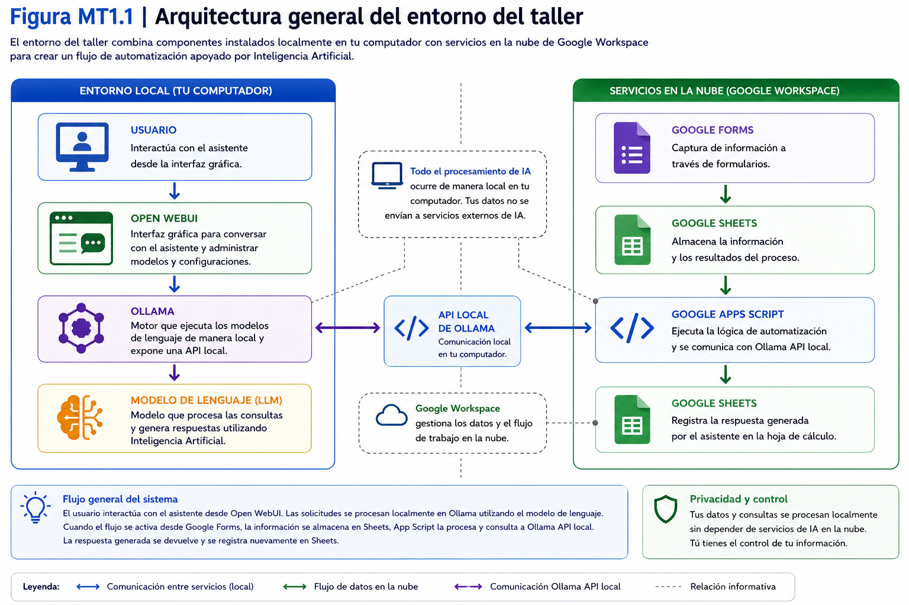
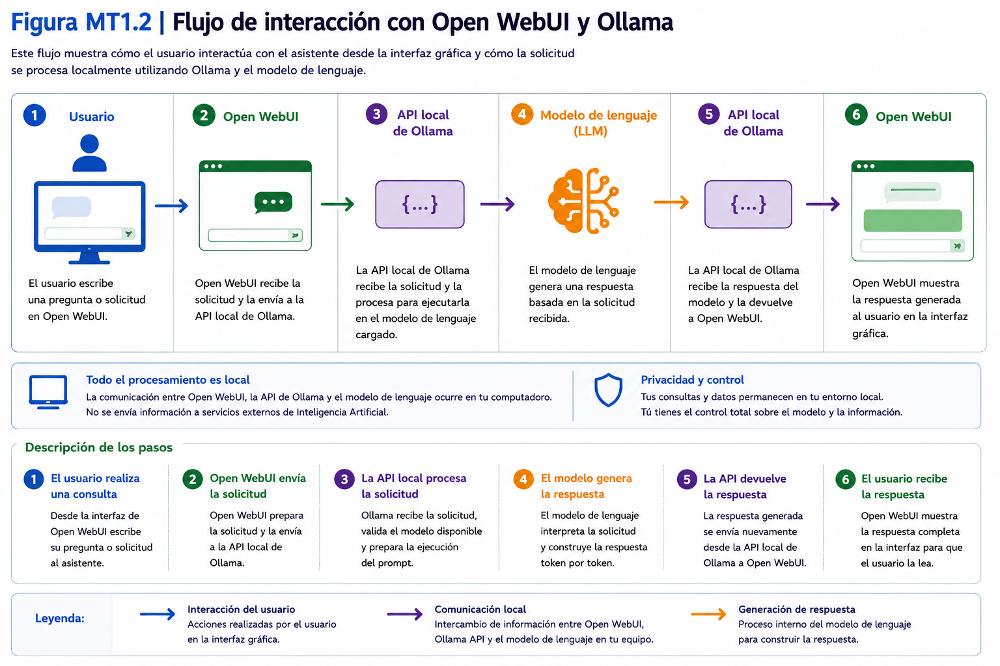
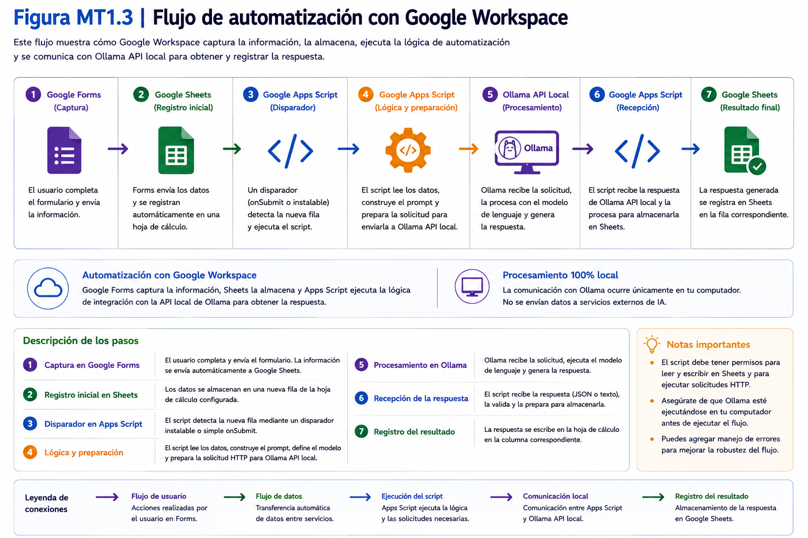
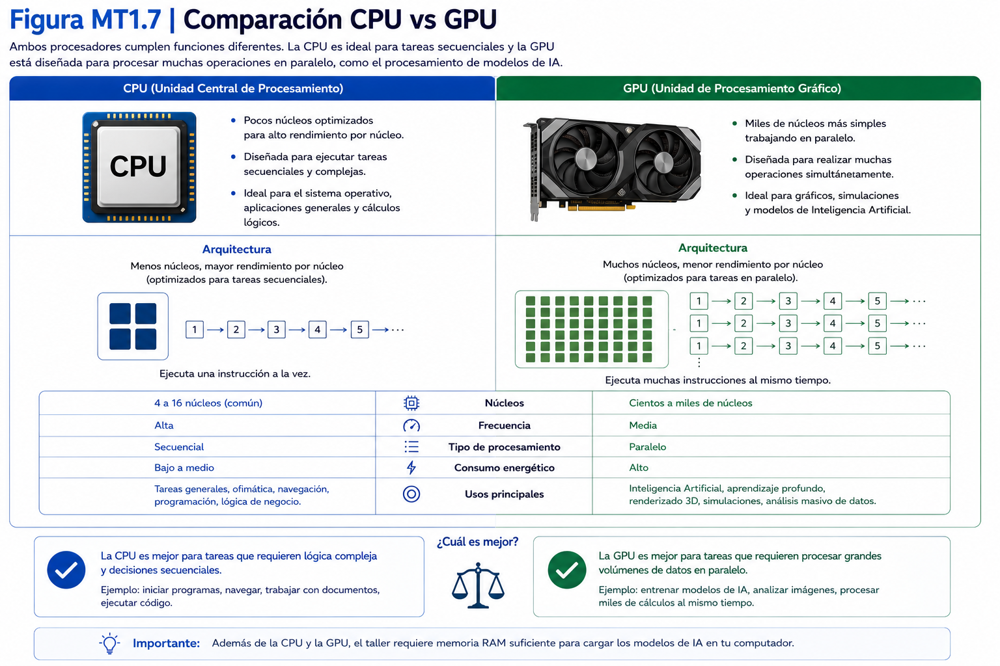
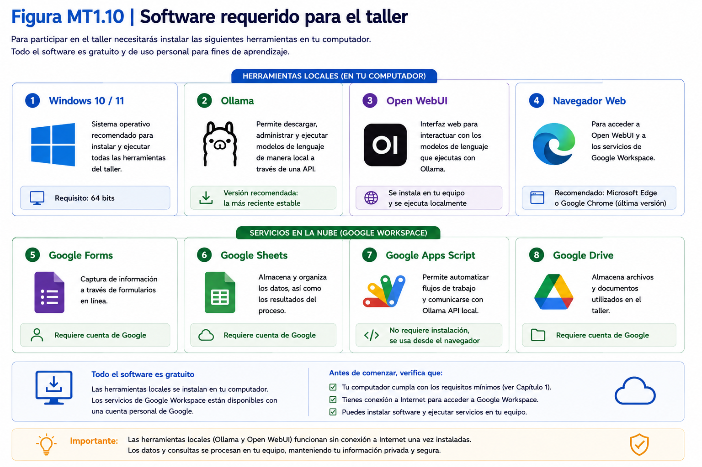
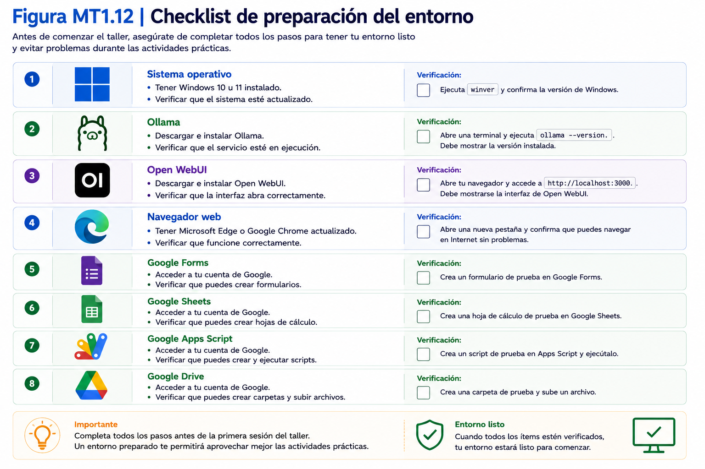

# Parte I

# Construcción del entorno local

---

# Capítulo 1

# Preparación del entorno de trabajo

## 1.1 Introducción al entorno técnico

### Objetivo

Comprender la finalidad del entorno tecnológico que será utilizado durante el taller e identificar los componentes principales que serán instalados y configurados durante las siguientes secciones.

---

### Tiempo estimado

**5 minutos**

---

### Requisitos previos

Antes de comenzar esta sección asegúrese de disponer de:

- Un computador personal con sistema operativo Windows 10 u 11.
- Conexión estable a Internet.
- Permisos para instalar software en el equipo.

> **Nota:** En las siguientes secciones verificará si su computador cumple los requisitos mínimos para ejecutar correctamente el entorno del taller.

---

### Procedimiento

Durante este taller trabajará con un entorno de Inteligencia Artificial de ejecución local, integrado posteriormente con servicios de Google Workspace.

Esto significa que el procesamiento realizado por el modelo de lenguaje se ejecutará directamente en su computador, sin depender de servicios comerciales de Inteligencia Artificial en la nube.

El entorno de trabajo estará compuesto por cuatro componentes principales.

#### 1. Ollama

Será el software encargado de ejecutar localmente los modelos de lenguaje utilizados durante el taller.

Ollama actuará como el motor de Inteligencia Artificial de toda la solución.

---

#### 2. Modelo de lenguaje (LLM)

Corresponde al modelo que procesará las consultas y generará las respuestas.

Durante el taller se utilizarán modelos compatibles con Ollama que serán descargados e instalados posteriormente.

---

#### 3. Open WebUI

Corresponde a la interfaz gráfica que permitirá interactuar con los modelos de lenguaje de manera sencilla, evitando el uso permanente de comandos desde la consola.

Desde esta herramienta se configurarán y probarán asistentes inteligentes para la interacción directa con los modelos de lenguaje.

---

#### 4. Google Workspace

Se utilizará para construir el flujo de automatización implementado durante los laboratorios.

Las principales herramientas utilizadas serán:

- Google Forms
- Google Sheets
- Google Apps Script

Estas aplicaciones permitirán integrar el asistente inteligente con un proceso organizacional sencillo.

---

Durante este Manual Técnico instalará y configurará cada uno de estos componentes siguiendo procedimientos paso a paso.

No es necesario instalar ningún software antes de finalizar este capítulo.

Cada herramienta será abordada en el momento correspondiente.

---

### Verificación

Antes de continuar confirme que identifica correctamente la función de cada componente.

| Componente | Función |
|------------|---------|
| Ollama | Ejecutar modelos de lenguaje de manera local. |
| Modelo de lenguaje | Generar respuestas utilizando Inteligencia Artificial. |
| Open WebUI | Proporcionar una interfaz gráfica para interactuar con los modelos. |
| Google Workspace | Implementar el flujo de automatización del taller. |

Si comprende el propósito general de cada componente puede continuar con la siguiente sección.

---

### Problemas frecuentes

#### No conozco ninguna de estas herramientas.

No constituye un problema.

El Manual Técnico considera que el participante comienza desde un entorno completamente nuevo y sin configuraciones previas.

---

#### ¿Debo instalar inmediatamente alguno de estos programas?

No.

Cada instalación será realizada en el momento correspondiente siguiendo instrucciones detalladas.

---

#### ¿Necesito conocimientos previos sobre Inteligencia Artificial?

No.

Este manual se centra en la implementación técnica del entorno y explica paso a paso cada procedimiento necesario.

---

### Buenas prácticas

- Lea completamente cada procedimiento antes de ejecutarlo.
- Instale únicamente el software indicado en este manual.
- Evite modificar configuraciones no descritas durante el taller.
- Complete cada sección antes de avanzar a la siguiente.

---

### Checklist

Antes de continuar confirme que:

☐ Comprende el propósito del Manual Técnico.

☐ Identifica los cuatro componentes principales del entorno.

☐ Dispone de un computador con Windows.

☐ Cuenta con conexión estable a Internet.

☐ Está preparado para comenzar la preparación del entorno de trabajo.

---

## 1.2 Arquitectura general del entorno

### Objetivo

Comprender la arquitectura tecnológica utilizada durante el taller e identificar cómo interactúan los distintos componentes que conforman el entorno de trabajo.

---

### Tiempo estimado

**10 minutos**

---

### Requisitos previos

Antes de comenzar esta sección se recomienda haber completado la **Sección 1.1 – Introducción al entorno técnico**.

No es necesario tener instalado ningún software.

---

### Procedimiento

Antes de comenzar las instalaciones es importante comprender cómo se relacionan los distintos componentes que serán utilizados durante el taller.

El entorno tecnológico se divide en dos grandes áreas:

- **Entorno local**, instalado en el computador del participante.
- **Servicios en la nube**, proporcionados por Google Workspace.

La siguiente figura representa la arquitectura general utilizada durante todo el taller.

<p align="center">
  
</p>

Observe que la solución está compuesta por dos flujos independientes.

---

### Flujo 1. Interacción directa con el asistente

Este flujo será utilizado durante los primeros laboratorios.

El participante interactúa directamente con Open WebUI.

Open WebUI envía la consulta a Ollama.

Ollama procesa la solicitud utilizando el modelo de lenguaje instalado y devuelve la respuesta al usuario.

Este flujo puede resumirse de la siguiente manera.

<p align="center">
  
</p>

---

### Flujo 2. Automatización del proceso

Durante los laboratorios de integración se incorporará un flujo de automatización utilizando Google Workspace.

En el flujo automatizado, las solicitudes registradas mediante Google Forms se almacenarán en Google Sheets. Un servicio desarrollado con Google Apps Script permitirá intercambiar información con un script de Python ejecutado en el computador local. Este script, denominado `puente_local.py`, consultará directamente el modelo mediante la API local de Ollama y devolverá la respuesta al entorno de Google Workspace.

Una vez recibida la respuesta, Google Apps Script actualizará la solicitud y enviará el resultado al usuario mediante correo electrónico.

El recorrido será el siguiente.

<p align="center">
  
</p>

Este segundo flujo permitirá integrar el asistente inteligente dentro de un proceso organizacional sencillo.

---

### Componentes del entorno

La siguiente tabla resume la función de cada componente.

| Componente         | Función principal                                                              |
| ------------------ | ------------------------------------------------------------------------------ |
| Usuario            | Ingresa consultas y recibe respuestas.                                         |
| Open WebUI         | Interfaz gráfica para interactuar con el modelo.                               |
| Ollama             | Ejecuta el modelo de lenguaje de forma local.                                  |
| Modelo de lenguaje | Genera las respuestas mediante IA.                                             |
| Google Forms       | Captura información del usuario.                                               |
| Google Sheets      | Almacena solicitudes y respuestas.                                             |
| Google Apps Script | Gestiona las solicitudes y respuestas dentro de Google Workspace.              |
| `puente_local.py`  | Coordina el intercambio entre Google Apps Script y Ollama en el entorno local. |

Cada uno de estos componentes será instalado o configurado en los capítulos siguientes.

---

### Verificación

Revise el diagrama anterior y responda mentalmente las siguientes preguntas.

- ¿Qué componente ejecuta el modelo de lenguaje?
- ¿Qué aplicación utiliza el participante para conversar directamente con el asistente?
- ¿Dónde se almacenan las respuestas generadas durante el proceso automatizado?
- ¿Qué componente coordina el intercambio de información entre Google Workspace y el entorno local?

Si puede responder estas preguntas correctamente, ha comprendido la arquitectura general del taller.

---

### Problemas frecuentes

#### No comprendo el diagrama.

No se preocupe.

En los siguientes capítulos instalará cada componente de manera independiente y posteriormente observará cómo interactúan entre sí.

---

#### ¿Debo memorizar la arquitectura?

No.

Este diagrama será utilizado como referencia durante todo el Manual Técnico.

---

#### ¿Qué ocurre si uno de los componentes deja de funcionar?

Cada capítulo incluye procedimientos de verificación y diagnóstico que permitirán identificar el componente responsable del problema.

---

### Buenas prácticas

- Consulte este diagrama cada vez que tenga dudas sobre el funcionamiento del entorno.
- Procure comprender el recorrido de la información antes de comenzar las instalaciones.
- No intente modificar la arquitectura durante el desarrollo del taller.
- Configure los componentes siguiendo el orden propuesto en este manual.

---

### Checklist

Antes de continuar confirme que:

☐ Comprende la diferencia entre el entorno local y Google Workspace.

☐ Identifica los dos flujos principales del taller.

☐ Reconoce la función de cada componente del entorno.

☐ Comprende el recorrido general de la información.

☐ Está preparado para verificar que su computador cumple los requisitos mínimos del taller.

---

## 1.3 Requisitos mínimos del sistema

### Objetivo

Verificar que el computador cumple los requisitos mínimos necesarios para instalar y ejecutar correctamente el entorno tecnológico utilizado durante el taller.

---

### Tiempo estimado

**10 minutos**

---

### Requisitos previos

Antes de comenzar esta sección asegúrese de disponer de:

- Un computador con Windows 10 u 11.
- Acceso al escritorio de Windows.
- Permisos para consultar la configuración del sistema.

No es necesario instalar ningún software.

---

### Procedimiento

Antes de instalar cualquier componente es recomendable verificar que el computador dispone de los recursos necesarios para ejecutar los modelos de Inteligencia Artificial de forma local.

Aunque Ollama puede funcionar en equipos modestos, el rendimiento dependerá principalmente de la memoria disponible y del tamaño del modelo utilizado.

Durante este taller se recomienda verificar los siguientes componentes.

---

## Paso 1. Verificar la versión de Windows

1. Presione las teclas **Windows + R**.
2. Escriba:

```text
winver
```

3. Presione **Aceptar**.

Verifique que el equipo utiliza alguna de las siguientes versiones:

- Windows 10
- Windows 11

---

## Paso 2. Verificar el procesador

1. Abra el menú **Inicio**.
2. Escriba **Información del sistema**.
3. Abra la aplicación.

Localice el campo:

**Procesador**

Anote el modelo instalado en el equipo.

---

## Paso 3. Verificar la memoria RAM

En la misma ventana observe el campo:

**Memoria física instalada (RAM)**

Registre la cantidad de memoria disponible.

Como referencia, considere la siguiente tabla.

| Memoria RAM | Recomendación |
|--------------|---------------|
| Menos de 8 GB | No recomendado |
| 8 GB | Funcionamiento básico |
| 16 GB | Recomendado para el taller |
| 32 GB o superior | Excelente desempeño |

---

## Paso 4. Verificar el espacio disponible en disco

1. Abra el **Explorador de archivos**.
2. Seleccione **Este equipo**.
3. Observe la unidad donde instalará Ollama.

Se recomienda disponer de al menos:

**20 GB de espacio libre**

Esto permitirá instalar los modelos utilizados durante el taller.

---

## Paso 5. Verificar la conexión a Internet

Abra un navegador web e ingrese a cualquier sitio de Internet.

La conexión será necesaria para:

- descargar Ollama;
- descargar Open WebUI;
- descargar los modelos de lenguaje;
- utilizar Google Workspace.

Una vez descargados los modelos, gran parte del trabajo podrá realizarse sin conexión.

---

## Resumen de requisitos mínimos

| Componente | Requisito mínimo |
|-------------|------------------|
| Sistema operativo | Windows 10 u 11 |
| Procesador | 64 bits |
| Memoria RAM | 8 GB |
| Recomendado | 16 GB o más |
| Espacio libre | 20 GB |
| Internet | Necesario durante la instalación |

Estos requisitos permiten desarrollar correctamente todas las actividades propuestas durante el taller.

---

### Verificación

Confirme que su computador cumple los siguientes requisitos.

| Elemento | Cumple |
|-----------|:------:|
| Windows 10 u 11 | □ |
| Procesador de 64 bits | □ |
| Al menos 8 GB de RAM | □ |
| 20 GB libres en disco | □ |
| Conexión a Internet | □ |

Si todos los elementos fueron verificados puede continuar con la siguiente sección.

---

### Problemas frecuentes

#### Mi computador tiene menos de 8 GB de memoria RAM.

El taller podrá ejecutarse únicamente con modelos pequeños, aunque el rendimiento podría verse afectado.

---

#### No dispongo de espacio suficiente en disco.

Elimine archivos innecesarios o libere espacio antes de comenzar la instalación de Ollama y de los modelos de lenguaje.

---

#### No encuentro la aplicación "Información del sistema".

Puede escribir directamente **msinfo32** desde el menú Inicio o desde la ventana **Ejecutar (Windows + R)**.

---

### Buenas prácticas

- Mantenga al menos un 20 % de espacio libre en la unidad del sistema.
- Cierre aplicaciones que consuman gran cantidad de memoria antes de ejecutar modelos de IA.
- Utilice preferentemente una conexión estable durante las descargas.
- Si trabaja con un computador portátil, manténgalo conectado a la corriente durante las instalaciones.

---

### Checklist

Antes de continuar confirme que:

☐ Verificó la versión de Windows.

☐ Identificó el procesador instalado.

☐ Comprobó la memoria RAM disponible.

☐ Confirmó que dispone de espacio suficiente en disco.

☐ Verificó la conexión a Internet.

☐ Su computador cumple los requisitos mínimos para continuar.

---

## 1.4 Requisitos recomendados

### Objetivo

Conocer la configuración de hardware recomendada para ejecutar el entorno del taller con un rendimiento óptimo y seleccionar el modelo de lenguaje más adecuado según las características del computador.

---

### Tiempo estimado

**8 minutos**

---

### Requisitos previos

Antes de comenzar esta sección se recomienda haber completado la **Sección 1.3 – Requisitos mínimos del sistema**.

Es conveniente conocer:

- Cantidad de memoria RAM instalada.
- Tipo de procesador.
- Espacio libre disponible en disco.

---

### Procedimiento

Los requisitos mínimos permiten ejecutar el entorno del taller.

Sin embargo, una configuración superior mejorará considerablemente la velocidad de respuesta de los modelos de Inteligencia Artificial.

La siguiente tabla resume la configuración recomendada.

| Componente | Recomendado |
|------------|-------------|
| Sistema operativo | Windows 11 (64 bits) |
| Procesador | Intel Core i5 / AMD Ryzen 5 o superior |
| Memoria RAM | 16 GB o más |
| Espacio libre en disco | 50 GB o más |
| GPU | Opcional |
| Conexión a Internet | Banda ancha |

> **Nota:** La GPU no es un requisito obligatorio para este taller. Todos los laboratorios pueden desarrollarse utilizando únicamente el procesador (CPU), aunque algunas tareas requerirán más tiempo de procesamiento.

---

## Configuración recomendada según memoria RAM

La cantidad de memoria disponible influirá directamente en el tamaño del modelo que podrá ejecutar su computador.

Como referencia inicial, considere la siguiente tabla.

| Memoria RAM | Configuración sugerida |
|--------------|-----------------------|
| 8 GB | Modelos pequeños (hasta 3B aproximadamente) |
| 16 GB | Modelos entre 7B y 8B |
| 32 GB | Modelos de mayor tamaño y mejor rendimiento |
| 64 GB o superior | Ejecución simultánea de varios modelos y proyectos más complejos |

Durante el taller se recomendarán modelos compatibles con equipos de gama media, evitando configuraciones que requieran hardware especializado.

> **Importante:** Estas recomendaciones son aproximadas. El consumo real de recursos dependerá del modelo utilizado, su cuantización, la longitud del contexto, el hardware disponible y las demás aplicaciones que se encuentren en ejecución.

---

## Espacio disponible en disco

Además del sistema operativo, el computador deberá almacenar:

- Ollama.
- Open WebUI.
- Modelos de lenguaje.
- Archivos del proyecto.
- Bases de datos y documentos generados durante los laboratorios.

Por este motivo se recomienda disponer de al menos **50 GB de espacio libre**.

Esto permitirá instalar nuevos modelos sin necesidad de liberar espacio constantemente.

---

## Procesador

No es necesario disponer del procesador más reciente del mercado.

Sin embargo, procesadores de varias generaciones anteriores pueden incrementar significativamente los tiempos de respuesta del asistente.

Como referencia, un procesador de gama media actual ofrecerá una experiencia satisfactoria para todas las actividades del taller.

---

## Tarjeta gráfica (GPU)

La utilización de una GPU puede acelerar considerablemente la ejecución de modelos de lenguaje.

No obstante, durante este taller se trabajará con una configuración compatible con computadores que únicamente disponen de CPU.

Si su equipo incorpora una GPU compatible, podrá aprovechar un mejor rendimiento sin necesidad de modificar los procedimientos descritos en este manual.

---

### Verificación

Revise nuevamente las características de su computador.

Complete la siguiente tabla.

| Característica | Mi equipo |
|----------------|-----------|
| Procesador | __________________ |
| Memoria RAM | __________________ |
| Espacio libre | __________________ |
| ¿Dispone de GPU dedicada? | Sí ☐ &nbsp;&nbsp; No ☐ |

Una vez completada esta información estará en condiciones de seleccionar el modelo más adecuado durante los capítulos siguientes.

---

### Problemas frecuentes

#### Mi computador cumple únicamente los requisitos mínimos.

Podrá desarrollar el taller utilizando modelos de menor tamaño.

Las respuestas podrían demorar algunos segundos adicionales.

---

#### No sé si mi computador tiene una GPU dedicada.

No es un problema.

Durante este taller no será necesario configurar manualmente la tarjeta gráfica.

Todos los procedimientos están diseñados para funcionar utilizando únicamente la CPU.

---

#### Mi computador dispone de una gran cantidad de memoria RAM.

Podrá utilizar modelos más grandes y obtener respuestas más rápidas, aunque para las actividades del taller no será necesario utilizar configuraciones avanzadas.

---

### Buenas prácticas

- Mantenga suficiente espacio libre antes de descargar nuevos modelos.
- Evite ejecutar aplicaciones que consuman gran cantidad de memoria mientras trabaja con modelos de IA.
- Reinicie el computador si observa una disminución importante del rendimiento después de varias horas de uso.
- Utilice siempre modelos acordes a la capacidad de su equipo.

---

### Checklist

Antes de continuar confirme que:

☐ Conoce la configuración recomendada para el taller.

☐ Identificó la memoria RAM instalada en su computador.

☐ Verificó el espacio libre disponible.

☐ Comprende cómo la memoria RAM influye en la selección de modelos.

☐ Está preparado para revisar los distintos tipos de procesadores utilizados para ejecutar modelos de Inteligencia Artificial.

---

## 1.5 CPU vs GPU

### Objetivo

Comprender las diferencias entre el procesamiento mediante CPU y GPU, identificando cómo cada uno influye en el rendimiento de los modelos de Inteligencia Artificial utilizados durante el taller.

---

### Tiempo estimado

**8 minutos**

---

### Requisitos previos

Antes de comenzar esta sección se recomienda haber completado:

- Sección 1.3 – Requisitos mínimos del sistema.
- Sección 1.4 – Requisitos recomendados.

No es necesario realizar ninguna instalación.

---

### Procedimiento

Los modelos de lenguaje realizan millones de operaciones matemáticas para generar una respuesta.

Estas operaciones pueden ejecutarse utilizando dos tipos de procesadores:

- CPU (Unidad Central de Procesamiento).
- GPU (Unidad de Procesamiento Gráfico).

Durante este taller ambas opciones son compatibles.

Sin embargo, conocer sus diferencias permitirá comprender por qué algunos equipos responden más rápido que otros.

---

## CPU

La CPU es el procesador principal del computador.

Se encarga de ejecutar el sistema operativo, los programas instalados y la mayoría de las tareas generales.

Si su computador no dispone de una GPU dedicada, Ollama utilizará automáticamente la CPU para ejecutar el modelo de lenguaje.

### Ventajas

- Compatible con prácticamente cualquier computador.
- No requiere configuración adicional.
- Permite desarrollar completamente el taller.

### Limitaciones

- Los tiempos de respuesta suelen ser mayores.
- El procesamiento de modelos grandes puede resultar más lento.

---

## GPU

La GPU fue diseñada originalmente para procesar gráficos.

Sin embargo, también es capaz de ejecutar grandes cantidades de operaciones matemáticas en paralelo, lo que resulta especialmente útil para los modelos de Inteligencia Artificial.

Si Ollama detecta una GPU compatible, podrá utilizarla para acelerar el procesamiento.

### Ventajas

- Menor tiempo de respuesta.
- Mejor rendimiento con modelos de mayor tamaño.
- Mayor capacidad para ejecutar tareas intensivas.

### Limitaciones

- No todos los computadores disponen de una GPU compatible.
- Algunas GPU requieren controladores actualizados.

---

## Comparación general

| Característica | CPU | GPU |
|----------------|:---:|:---:|
| Disponible en todos los computadores | ✔ | No siempre |
| Requiere configuración especial | No | En algunos casos |
| Adecuada para este taller | ✔ | ✔ |
| Velocidad de procesamiento | Media | Alta |
| Recomendable para modelos grandes | No | Sí |
<p align="center">
  
</p>

---

## ¿Qué utilizaré durante el taller?

No será necesario elegir manualmente entre CPU y GPU.

Ollama detectará automáticamente el hardware disponible y utilizará la mejor opción compatible con su equipo.

Esto significa que todos los procedimientos descritos en este manual serán válidos tanto para computadores con CPU únicamente como para equipos que incorporen una GPU compatible.

---

### Verificación

Determine cuál de las siguientes situaciones corresponde a su computador.

| Situación | Marque |
|-----------|:------:|
| Mi computador dispone únicamente de CPU. | ☐ |
| Mi computador dispone de CPU y GPU integrada. | ☐ |
| Mi computador dispone de CPU y GPU dedicada. | ☐ |
| No conozco la configuración de mi equipo. | ☐ |

> **Nota:** Si desconoce esta información, podrá continuar igualmente con el taller. Ollama seleccionará automáticamente el hardware disponible.

---

### Problemas frecuentes

#### Mi computador no tiene GPU.

No constituye un problema.

Todos los laboratorios pueden desarrollarse utilizando únicamente la CPU.

---

#### Mi computador tiene GPU, pero Ollama parece utilizar la CPU.

Durante este taller no será necesario modificar la configuración de aceleración.

En capítulos posteriores se verificará el funcionamiento del entorno una vez instalado Ollama.

---

#### ¿Necesito comprar una tarjeta gráfica?

No.

La configuración propuesta para este taller fue diseñada para funcionar correctamente en computadores personales sin hardware especializado.

---

### Buenas prácticas

- Mantenga actualizados los controladores del sistema operativo.
- Evite ejecutar aplicaciones que consuman recursos mientras trabaja con modelos de IA.
- Si utiliza un computador portátil, manténgalo conectado a la corriente durante las pruebas.
- No modifique la configuración predeterminada de Ollama salvo que conozca sus implicancias.

---

### Checklist

Antes de continuar confirme que:

☐ Comprende la diferencia entre CPU y GPU.

☐ Conoce cuál es la configuración de su computador.

☐ Comprende que ambos tipos de procesamiento son compatibles con este taller.

☐ Está preparado para revisar con mayor detalle el uso de la memoria RAM y el almacenamiento del equipo.

---

## 1.6 Memoria RAM y almacenamiento

### Objetivo

Comprender cómo la memoria RAM y el espacio de almacenamiento influyen en el funcionamiento de los modelos de Inteligencia Artificial y verificar que el computador dispone de los recursos necesarios para desarrollar el taller.

---

### Tiempo estimado

**8 minutos**

---

### Requisitos previos

Antes de comenzar esta sección se recomienda haber completado:

- Sección 1.3 – Requisitos mínimos del sistema.
- Sección 1.4 – Requisitos recomendados.
- Sección 1.5 – CPU vs GPU.

No es necesario instalar ningún software.

---

### Procedimiento

El rendimiento de un modelo de lenguaje depende principalmente de dos recursos del computador:

- Memoria RAM.
- Espacio disponible en disco.

Aunque ambos suelen confundirse, cumplen funciones completamente diferentes.

---

## Memoria RAM

La memoria RAM almacena temporalmente la información utilizada por el sistema operativo y por las aplicaciones que se encuentran en ejecución.

Cuando Ollama carga un modelo de lenguaje, parte de este modelo se mantiene en la memoria RAM para permitir que las respuestas se generen rápidamente.

En términos generales:

- Mayor memoria RAM permite utilizar modelos más grandes.
- Menor memoria RAM obliga a utilizar modelos más pequeños.

---

### Verificar la memoria RAM instalada

1. Presione las teclas **Windows + I**.
2. Seleccione **Sistema**.
3. Haga clic en **Información**.
4. Localice el campo **Memoria RAM instalada**.

Registre el valor informado por Windows.


---

## Almacenamiento

El almacenamiento corresponde al espacio disponible en el disco donde se instalarán:

- Ollama.
- Open WebUI.
- Los modelos de lenguaje.
- Archivos del proyecto.
- Documentos generados durante el taller.

A diferencia de la memoria RAM, el almacenamiento conserva la información incluso cuando el computador se apaga.

---

### Verificar el espacio disponible

1. Abra el **Explorador de archivos**.
2. Seleccione **Este equipo**.
3. Observe la unidad donde instalará el software.

Verifique que dispone de espacio suficiente para continuar.

---

## Diferencias entre RAM y almacenamiento

| Característica | Memoria RAM | Almacenamiento |
|----------------|-------------|----------------|
| Uso principal | Ejecutar aplicaciones | Guardar archivos |
| Conserva la información al apagar el equipo | No | Sí |
| Influye en la velocidad del modelo | Sí | Parcialmente |
| Permite instalar modelos | No | Sí |

---

## Recomendaciones para este taller

| Recurso | Recomendación |
|----------|---------------|
| Memoria RAM | 16 GB o más |
| Espacio libre | 50 GB o más |

Estas recomendaciones permitirán trabajar cómodamente con los modelos utilizados durante las actividades prácticas.

---

### Verificación

Complete la siguiente tabla.

| Recurso | Mi computador |
|----------|---------------|
| Memoria RAM instalada | __________________ |
| Espacio libre disponible | __________________ |

Si ambos recursos cumplen las recomendaciones anteriores, podrá continuar con el proceso de instalación.

---

### Problemas frecuentes

#### Tengo poca memoria RAM.

El taller podrá desarrollarse utilizando modelos de menor tamaño, aunque algunas respuestas podrían demorar más tiempo.

---

#### Tengo poco espacio disponible.

Antes de instalar Ollama elimine archivos innecesarios o traslade información a otra unidad de almacenamiento.

---

#### Mi computador dispone de varias unidades de disco.

Se recomienda instalar Ollama y los modelos en la unidad con mayor espacio disponible y mejor rendimiento.

---

### Buenas prácticas

- Mantenga siempre espacio libre suficiente para futuras actualizaciones de modelos.
- Evite llenar completamente la unidad donde instalará Ollama.
- Cierre aplicaciones innecesarias antes de ejecutar modelos de lenguaje.
- Reinicie el computador si observa una disminución importante del rendimiento después de varias horas de trabajo.

---

### Checklist

Antes de continuar confirme que:

☐ Verificó la memoria RAM instalada.

☐ Verificó el espacio libre disponible.

☐ Comprende la diferencia entre memoria RAM y almacenamiento.

☐ Su computador dispone de recursos suficientes para continuar con la instalación.

☐ Está preparado para revisar la compatibilidad del sistema operativo.

---

## 1.7 Sistemas operativos compatibles

### Objetivo

Verificar que el sistema operativo instalado en el computador es compatible con las herramientas utilizadas durante el taller y confirmar que se encuentra actualizado antes de iniciar las instalaciones.

---

### Tiempo estimado

**5 minutos**

---

### Requisitos previos

Antes de comenzar esta sección se recomienda haber completado las secciones anteriores del Capítulo 1.

No es necesario instalar ningún software.

---

### Procedimiento

Las herramientas utilizadas durante este taller son compatibles con distintos sistemas operativos.

Sin embargo, este Manual Técnico ha sido desarrollado utilizando **Microsoft Windows**, por lo que todas las capturas de pantalla, rutas de acceso y procedimientos corresponden a dicho entorno.

Si utiliza otro sistema operativo, algunos pasos podrían variar.

---

## Sistemas operativos compatibles

| Sistema operativo | Compatibilidad |
|-------------------|:--------------:|
| Windows 11 (64 bits) | ✔ Recomendada |
| Windows 10 (64 bits) | ✔ Compatible |
| macOS | ✔ Compatible* |
| Linux | ✔ Compatible* |

> **Nota:** Los procedimientos descritos en este manual corresponden exclusivamente a Windows 10 y Windows 11.

---

## Paso 1. Verificar la versión del sistema operativo

1. Presione las teclas **Windows + R**.
2. Escriba:

```text
winver
```

3. Presione **Aceptar**.

Se abrirá una ventana mostrando la versión instalada de Windows.


---

## Paso 2. Verificar si existen actualizaciones pendientes

1. Presione **Windows + I**.
2. Seleccione **Windows Update**.
3. Revise el estado de las actualizaciones.

Si existen actualizaciones importantes pendientes, instálelas antes de continuar.


---

## Paso 3. Reiniciar el computador (si corresponde)

Si Windows solicita reiniciar el equipo después de instalar actualizaciones, complete este proceso antes de continuar con la instalación de Ollama.

Esto reducirá la posibilidad de errores durante el taller.

---

## Recomendación

Aunque Windows 10 continúa siendo compatible, se recomienda utilizar Windows 11 siempre que sea posible.

Las versiones más recientes del sistema operativo suelen ofrecer un mejor soporte para aplicaciones modernas y actualizaciones de seguridad.

---

### Verificación

Complete la siguiente tabla.

| Verificación | Estado |
|--------------|:------:|
| Utilizo Windows 10 u 11 | ☐ |
| El sistema operativo está actualizado | ☐ |
| No existen actualizaciones críticas pendientes | ☐ |
| Reinicié el equipo (si fue necesario) | ☐ |

Si todas las verificaciones fueron completadas puede continuar con la siguiente sección.

---

### Problemas frecuentes

#### Utilizo una versión antigua de Windows.

Se recomienda actualizar el sistema operativo antes de instalar las herramientas utilizadas durante el taller.

---

#### Windows está descargando actualizaciones.

Espere a que finalice el proceso antes de comenzar la instalación de Ollama.

---

#### Después de actualizar Windows el computador solicita reiniciarse.

Realice el reinicio antes de continuar.

Esto evitará posibles conflictos durante la instalación del software.

---

### Buenas prácticas

- Mantenga Windows actualizado.
- Reinicie el computador después de instalar actualizaciones importantes.
- Evite instalar software mientras Windows continúa actualizando el sistema.
- Compruebe periódicamente la existencia de nuevas actualizaciones de seguridad.

---

### Checklist

Antes de continuar confirme que:

☐ Verificó la versión de Windows instalada.

☐ Confirmó que utiliza un sistema operativo compatible.

☐ Revisó la existencia de actualizaciones.

☐ Reinició el equipo si fue necesario.

☐ Está preparado para revisar el software que será instalado durante el taller.

---

## 1.8 Software requerido

### Objetivo

Identificar el software que será utilizado durante el taller y comprender el propósito de cada aplicación antes de comenzar el proceso de instalación.

---

### Tiempo estimado

**5 minutos**

---

### Requisitos previos

Antes de comenzar esta sección se recomienda haber completado las secciones anteriores del Capítulo 1.

No es necesario instalar ningún software.

---

### Procedimiento

Durante el taller utilizará un conjunto reducido de aplicaciones que, integradas entre sí, permitirán desarrollar el Proyecto Integrador.

Cada herramienta será instalada y configurada en los capítulos siguientes.

En esta sección únicamente revisará cuáles son y para qué serán utilizadas.

---

## Software principal

| Aplicación | Propósito |
|------------|-----------|
| Ollama | Ejecutar modelos de lenguaje de forma local. |
| Open WebUI | Interactuar con los modelos mediante una interfaz gráfica. |
| Google Chrome o Microsoft Edge | Acceder a Open WebUI y a Google Workspace. |
| Visual Studio Code *(opcional)* | Editar archivos de configuración y scripts. |

---

## Servicios en línea

Durante el taller también utilizará herramientas disponibles a través del navegador.

| Servicio | Propósito |
|----------|-----------|
| Google Forms | Capturar información de los usuarios. |
| Google Sheets | Almacenar solicitudes y respuestas. |
| Google Apps Script | Automatizar el flujo del proceso. |

---

## Herramientas que instalará

Durante este Manual Técnico instalará las siguientes aplicaciones.

### Ollama

Será la primera aplicación instalada.

A partir de ella podrá descargar y ejecutar modelos de Inteligencia Artificial directamente en su computador.

---

### Open WebUI

Posteriormente configurará el entorno necesario para utilizar Open WebUI.

Esta herramienta permitirá utilizar Ollama mediante una interfaz gráfica mucho más cómoda que la consola.

---

### Modelos de lenguaje

Después de instalar Ollama descargará uno o más modelos compatibles.

Estos modelos serán utilizados durante todo el desarrollo del taller.

La selección del modelo dependerá de las características de su computador.

---

<p align="center">
  
</p>

---
## Herramientas complementarias

Durante distintos procedimientos del manual también se utilizarán herramientas disponibles en Windows o aplicaciones auxiliares:

- **PowerShell:** utilizado para ejecutar comandos de Ollama, Python y otros procedimientos técnicos.
- **Visual Studio Code:** opcional, para editar scripts y archivos de configuración.
- **Bloc de notas de Windows:** alternativa básica para editar archivos de texto.
- **Símbolo del sistema (CMD):** disponible como consola alternativa cuando corresponda.

Cuando sea necesario, este manual indicará cuál utilizar.

---

## ¿Necesito instalar todo ahora?

No.

El proceso de instalación será realizado paso a paso durante los siguientes capítulos.

En este momento basta con conocer qué herramientas serán utilizadas.

---

### Verificación

Revise la siguiente lista.

| Herramienta | La utilizaré durante el taller |
|-------------|:------------------------------:|
| Ollama | ☐ |
| Open WebUI | ☐ |
| Google Forms | ☐ |
| Google Sheets | ☐ |
| Google Apps Script | ☐ |
| Navegador web | ☐ |
<p align="center">
  
</p>
Si identifica correctamente todas las herramientas puede continuar con la siguiente sección.

---

### Problemas frecuentes

#### No tengo instalado Google Chrome.

No es obligatorio.

También puede utilizar Microsoft Edge u otro navegador moderno compatible.

---

#### No conozco Visual Studio Code.

No constituye un requisito para desarrollar el taller.

Su utilización será completamente opcional.

---

#### ¿Necesito instalar Google Workspace?

No.

Google Workspace funciona completamente desde el navegador web.

Solo necesitará iniciar sesión con una cuenta de Google.

---

### Buenas prácticas

- Instale únicamente el software indicado durante el taller.
- Descargue siempre las aplicaciones desde sus sitios oficiales.
- Evite instalar versiones modificadas o provenientes de terceros.
- Mantenga actualizado el navegador utilizado durante las actividades.

---

### Checklist

Antes de continuar confirme que:

☐ Identifica todas las herramientas que serán utilizadas.

☐ Comprende la función general de cada aplicación.

☐ Dispone de un navegador web actualizado.

☐ Tiene una cuenta de Google disponible para trabajar con Google Workspace.

☐ Está preparado para realizar la verificación final del equipo antes de comenzar las instalaciones.

---

## 1.9 Organización de carpetas del proyecto

### Objetivo

Crear una estructura de carpetas estándar que permita organizar correctamente todos los archivos utilizados durante el taller.

---

### Tiempo estimado

**10 minutos**

---

### Requisitos previos

Antes de comenzar esta sección asegúrese de disponer de:

- Windows 10 u 11.
- Permisos para crear carpetas.
- Acceso al Explorador de archivos.

No es necesario instalar ningún software.

---

### Procedimiento

Durante el desarrollo del taller se generarán distintos tipos de archivos:

- modelos de lenguaje;
- scripts;
- documentos;
- respaldos;
- archivos del Proyecto Integrador.

Mantener una estructura organizada facilitará el desarrollo de los laboratorios y permitirá localizar rápidamente cualquier recurso.

Se recomienda utilizar una única carpeta principal para almacenar todo el material del taller.

---

## Paso 1. Crear la carpeta principal

1. Abra el **Explorador de archivos**.
2. Acceda a la ubicación donde almacenará el material del taller.
3. Cree una nueva carpeta con el siguiente nombre.

```text
Taller_IA_Local
```

---

## Paso 2. Crear las carpetas de trabajo

Dentro de la carpeta **Taller_IA_Local** cree la siguiente estructura.

```text
Taller_IA_Local
│
├── 01_Documentacion
│
├── 02_Modelos (Archivos o recursos relacionados con modelos que deban almacenarse manualmente durante el taller.)
│
├── 03_Scripts
│
├── 04_Proyecto_Integrador
│
├── 05_Respaldos
│
└── 06_Recursos
```


Esta estructura será utilizada durante todo el taller.

> **Nota:** Los modelos descargados mediante Ollama son administrados automáticamente por la aplicación y no deben copiarse manualmente en esta carpeta.
---

## Paso 3. Comprender el propósito de cada carpeta

| Carpeta                | Contenido                                                                                         |
| ---------------------- | ------------------------------------------------------------------------------------------------- |
| 01_Documentacion       | Manuales, laboratorios y material de apoyo.                                                       |
| 02_Modelos             | Archivos o recursos relacionados con modelos que deban almacenarse manualmente durante el taller. |
| 03_Scripts             | Scripts de Python y Google Apps Script.                                                           |
| 04_Proyecto_Integrador | Documentos generados durante el proyecto.                                                         |
| 05_Respaldos           | Copias de seguridad y versiones anteriores.                                                       |
| 06_Recursos            | Imágenes, archivos de prueba y otros recursos utilizados durante el taller.                       |

---

## Paso 4. Verificar la estructura

Revise que todas las carpetas hayan sido creadas correctamente.

Su estructura debería ser similar a la siguiente.

```text
Taller_IA_Local
│
├── 01_Documentacion
├── 02_Modelos
├── 03_Scripts
├── 04_Proyecto_Integrador
├── 05_Respaldos
└── 06_Recursos
```

---

## Recomendación

Durante el desarrollo del taller evite crear carpetas adicionales si no son estrictamente necesarias.

Mantener una estructura uniforme facilitará el seguimiento de las actividades y simplificará el soporte técnico cuando sea necesario.

---

### Verificación

Compruebe que dispone de la siguiente estructura.

| Carpeta | Creada |
|----------|:------:|
| Taller_IA_Local | ☐ |
| 01_Documentacion | ☐ |
| 02_Modelos | ☐ |
| 03_Scripts | ☐ |
| 04_Proyecto_Integrador | ☐ |
| 05_Respaldos | ☐ |
| 06_Recursos | ☐ |

Si todas las carpetas fueron creadas correctamente puede continuar con la siguiente sección.

---

### Problemas frecuentes

#### Creé la carpeta en otra ubicación.

No constituye un problema.

Sin embargo, se recomienda mantener todo el material del taller dentro de una única carpeta principal.

---

#### Cambié el nombre de algunas carpetas.

Se recomienda utilizar exactamente los nombres indicados en este manual.

Esto facilitará el desarrollo de los laboratorios y el seguimiento de las instrucciones.

---

#### Ya tengo una carpeta con ese nombre.

Puede reutilizarla siempre que su contenido corresponda al taller o crear una nueva carpeta en otra ubicación.

---

### Buenas prácticas

- Mantenga todos los archivos del taller dentro de la carpeta principal.
- Evite almacenar documentos personales junto al material del curso.
- Realice respaldos periódicos del Proyecto Integrador.
- No elimine carpetas aunque todavía no las utilice.

---

### Checklist

Antes de continuar confirme que:

☐ Creó la carpeta principal del taller.

☐ Creó todas las subcarpetas recomendadas.

☐ Comprende el propósito de cada una.

☐ Mantendrá toda la información del taller organizada en esta estructura.

☐ Está preparado para realizar la verificación final del equipo.


---

## 1.10 Verificación del equipo

### Objetivo

Realizar una verificación final del computador para confirmar que cumple los requisitos necesarios antes de comenzar la instalación de las herramientas utilizadas durante el taller.

---

### Tiempo estimado

**10 minutos**

---

### Requisitos previos

Antes de comenzar esta sección se recomienda haber completado todas las secciones anteriores del Capítulo 1.

No es necesario instalar ningún software.

---

### Procedimiento

Durante las secciones anteriores revisó los requisitos del sistema, verificó las características de su computador y preparó la estructura de trabajo.

En esta sección realizará una comprobación final para asegurar que todo se encuentra listo antes de iniciar la instalación de Ollama.

---

## Paso 1. Verificar el sistema operativo

Confirme que utiliza una versión compatible de Windows.

| Verificación | Estado |
|--------------|:------:|
| Windows 10 (64 bits) | ☐ |
| Windows 11 (64 bits) | ☐ |

---

## Paso 2. Verificar la memoria RAM

Confirme que dispone de la memoria necesaria.

| Memoria instalada | Estado |
|-------------------|:------:|
| 8 GB o superior | ☐ |
| 16 GB o superior (recomendado) | ☐ |

---

## Paso 3. Verificar el espacio disponible

Compruebe que dispone de espacio suficiente para instalar:

- Ollama.
- Modelos de lenguaje.
- Open WebUI.
- Archivos del proyecto.

Espacio disponible:

---

## Paso 4. Verificar la conexión a Internet

Abra su navegador web y compruebe que puede acceder correctamente a un sitio web.

Durante la instalación será necesario descargar distintos componentes desde Internet.

---

## Paso 5. Verificar permisos de instalación

Compruebe que puede instalar software en el computador.

Si utiliza un equipo institucional, confirme previamente que dispone de permisos de administrador o solicite apoyo al área de soporte informático.

---

## Paso 6. Verificar la carpeta del proyecto

Abra el Explorador de archivos y confirme que la estructura creada en la sección anterior permanece disponible.

Debería observar una estructura similar a la siguiente.

```text
Taller_IA_Local
│
├── 01_Documentacion
├── 02_Modelos
├── 03_Scripts
├── 04_Proyecto_Integrador
├── 05_Respaldos
└── 06_Recursos
```

---

## Resumen de la verificación

Complete la siguiente tabla.

| Elemento | Verificado |
|-----------|:----------:|
| Sistema operativo compatible | ☐ |
| Memoria RAM suficiente | ☐ |
| Espacio libre disponible | ☐ |
| Conexión a Internet | ☐ |
| Permisos de instalación | ☐ |
| Carpeta del proyecto creada | ☐ |

Si todos los elementos fueron verificados correctamente, el equipo está preparado para comenzar la instalación de Ollama.

---

### Verificación

Responda la siguiente pregunta.

> **¿Se encuentra su computador preparado para comenzar la instalación del entorno del taller?**

☐ Sí

☐ No

Si respondió **No**, revise nuevamente las secciones anteriores antes de continuar.

---

### Problemas frecuentes

#### No dispongo de permisos para instalar software.

Solicite apoyo al administrador del computador antes de continuar.

---

#### El espacio disponible en disco es insuficiente.

Libere espacio eliminando archivos innecesarios o utilizando otra unidad de almacenamiento.

---

#### La conexión a Internet es inestable.

Se recomienda utilizar una red estable durante las descargas para evitar interrupciones o archivos incompletos.

---

### Buenas prácticas

- Reinicie el computador antes de comenzar las instalaciones si lleva varias horas encendido.
- Cierre aplicaciones que consuman gran cantidad de memoria.
- Mantenga conectado el computador a la corriente durante el proceso de instalación.
- Evite ejecutar actualizaciones de Windows mientras instala el software del taller.

---

### Checklist

Antes de continuar confirme que:

☐ El sistema operativo es compatible.

☐ Dispone de memoria suficiente.

☐ Tiene espacio libre disponible.

☐ La conexión a Internet funciona correctamente.

☐ Puede instalar software.

☐ La estructura de carpetas está preparada.

☐ El computador se encuentra listo para iniciar la instalación de Ollama.

---

## 1.11 Checklist previo

### Objetivo

Realizar una revisión final del entorno de trabajo antes de comenzar la instalación de Ollama, verificando que el computador cumple todos los requisitos establecidos en este capítulo.

---

### Tiempo estimado

**5 minutos**

---

### Requisitos previos

Antes de comenzar esta sección deberá haber completado todas las secciones anteriores del **Capítulo 1**.

---

### Procedimiento

Ha finalizado la etapa de preparación del entorno de trabajo.

Antes de instalar cualquier componente es recomendable realizar una última revisión para confirmar que el computador se encuentra en condiciones de continuar.

Complete la siguiente lista de verificación.

---

## Sistema operativo

☐ Utilizo Windows 10 (64 bits) o Windows 11 (64 bits).

☐ El sistema operativo se encuentra actualizado.

☐ Reinicié el computador si Windows lo solicitó.

---

## Hardware

☐ Verifiqué el procesador instalado.

☐ Confirmé la memoria RAM disponible.

☐ Dispongo del espacio libre recomendado.

☐ Conozco si mi equipo utiliza únicamente CPU o también dispone de GPU.

---

## Organización del proyecto

☐ Creé la carpeta principal del taller.

☐ Creé todas las subcarpetas recomendadas.

☐ Comprendo el propósito de cada carpeta.

---

## Conectividad

☐ Dispongo de conexión estable a Internet.

☐ Puedo acceder correctamente a sitios web.

☐ Tengo disponible una cuenta de Google.

---

## Preparación del equipo

☐ Dispongo de permisos para instalar software.

☐ Cerré aplicaciones innecesarias.

☐ El computador se encuentra conectado a la corriente (si corresponde).

---

## Preparación personal

☐ Comprendo la arquitectura general del entorno.

☐ Identifico las herramientas que serán utilizadas durante el taller.

☐ Estoy preparado para comenzar la instalación de Ollama.

---

## Resultado de la revisión

Marque la situación que corresponda.

☐ Todos los elementos fueron verificados correctamente.

☐ Existen observaciones que debo resolver antes de continuar.

Si marcó la segunda alternativa, revise nuevamente las secciones anteriores antes de comenzar el Capítulo 2.

---

### Verificación

Si respondió afirmativamente todos los puntos del checklist, su computador está preparado para iniciar el proceso de instalación.

No será necesario realizar nuevas verificaciones de hardware durante el resto del Manual Técnico.

---

### Problemas frecuentes

#### Olvidé verificar alguno de los puntos del checklist.

Regrese a la sección correspondiente y complete la verificación antes de continuar.

---

#### Mi computador no cumple alguno de los requisitos recomendados.

Podrá continuar con el taller utilizando modelos de menor tamaño, aunque algunas actividades podrían ejecutarse con menor rendimiento.

---

#### No tengo certeza sobre alguna característica de mi computador.

Consulte nuevamente las secciones anteriores antes de iniciar la instalación de Ollama.

---

### Buenas prácticas

- Conserve esta lista de verificación para futuras instalaciones.
- Si cambia de computador, repita este capítulo antes de instalar el entorno nuevamente.
- Mantenga organizada la carpeta del proyecto durante todo el taller.
- Evite modificar la configuración del sistema mientras desarrolla las actividades prácticas.

---

### Checklist

Antes de continuar confirme que:

☐ Completó todas las verificaciones del Capítulo 1.

☐ El computador cumple los requisitos necesarios.

☐ El entorno de trabajo se encuentra preparado.

☐ Está listo para comenzar la instalación de Ollama.

---

## Resumen del capítulo

En este capítulo usted:

✔ Conoció la arquitectura general del entorno tecnológico.

✔ Verificó los requisitos mínimos y recomendados.

✔ Comprendió las diferencias entre CPU y GPU.

✔ Revisó la memoria RAM y el almacenamiento disponible.

✔ Confirmó la compatibilidad del sistema operativo.

✔ Identificó el software que será utilizado durante el taller.

✔ Organizó la estructura de carpetas del proyecto.

✔ Realizó una verificación completa del equipo.

Con estas actividades el entorno quedó preparado para iniciar la instalación del software utilizado durante el taller.

---

## Próximo capítulo

En el **Capítulo 2 – Instalación y administración de Ollama** descargará, instalará y verificará el funcionamiento de Ollama, que será el motor de Inteligencia Artificial utilizado durante todo el taller.

---

# Fin del Capítulo 1

**Capítulo siguiente: Instalación y administración de Ollama**
