# Capítulo 2

# Instalación y administración de Ollama

## 2.1 ¿Qué es Ollama?

### Objetivo

Conocer el propósito de Ollama dentro del entorno del taller y comprender el papel que desempeñará durante todo el proceso de desarrollo del Proyecto Integrador.

---

### Tiempo estimado

**5 minutos**

---

### Requisitos previos

Antes de comenzar esta sección se recomienda haber completado el **Capítulo 1 – Preparación del entorno de trabajo**.

No es necesario instalar ningún software.

---

### Procedimiento

Ollama es una aplicación que permite ejecutar modelos de lenguaje directamente en el computador del usuario.

En lugar de utilizar servicios externos de Inteligencia Artificial, Ollama procesa las consultas de manera local utilizando los recursos disponibles del equipo.

Durante este taller, Ollama será el componente encargado de ejecutar los modelos de lenguaje utilizados por los asistentes inteligentes.

Su funcionamiento puede resumirse de la siguiente manera.

<p align="center">
  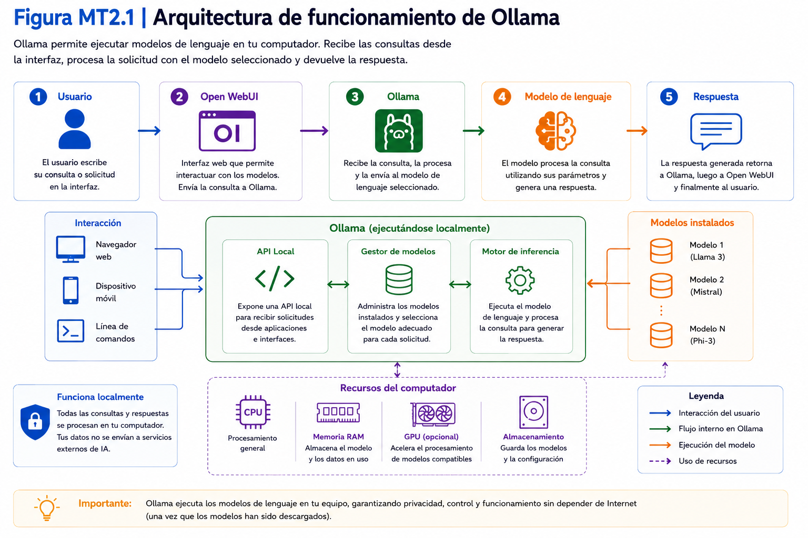
</p>

El usuario interactúa con Open WebUI.

Open WebUI envía la consulta a Ollama.

Ollama procesa la solicitud utilizando el modelo instalado y devuelve la respuesta.

Durante el resto del Manual Técnico aprenderá a:

- instalar Ollama;
- descargar modelos;
- ejecutar modelos localmente;
- administrar modelos;
- integrar Ollama con otras herramientas.

---

## ¿Por qué utilizaremos Ollama?

Las principales ventajas para este taller son:

- ejecución local de los modelos de lenguaje;
- utilización gratuita;
- instalación sencilla;
- compatibilidad con distintos modelos de lenguaje;
- integración con Open WebUI;
- facilidad para automatizar procesos mediante API.

Estas características lo convierten en una excelente alternativa para construir asistentes inteligentes sin depender de servicios comerciales.

---

### Verificación

Confirme que comprende las siguientes afirmaciones.

| Afirmación | Comprendida |
|------------|:-----------:|
| Ollama ejecuta modelos de lenguaje localmente. | ☐ |
| Open WebUI utiliza Ollama para generar respuestas. | ☐ |
| Los modelos se ejecutan en el computador del usuario. | ☐ |
| Ollama será utilizado durante todo el taller. | ☐ |

---

### Problemas frecuentes

#### ¿Ollama es un modelo de Inteligencia Artificial?

No.

Ollama es la aplicación que permite ejecutar distintos modelos de lenguaje.

---

#### ¿Puedo utilizar Ollama sin conexión a Internet?

Sí.

Una vez descargados los modelos, la mayoría de las consultas podrán realizarse sin conexión.

---

#### ¿Necesito crear una cuenta para utilizar Ollama?

No.

Ollama puede instalarse y utilizarse localmente sin necesidad de registrarse.

---

### Buenas prácticas

- Descargue Ollama únicamente desde su sitio oficial.
- Mantenga la aplicación actualizada.
- Utilice modelos compatibles con la capacidad de su computador.
- Evite descargar modelos innecesarios.

---

### Checklist

Antes de continuar confirme que:

☐ Comprende qué es Ollama.

☐ Conoce el papel que desempeñará durante el taller.

☐ Comprende la diferencia entre Ollama y un modelo de lenguaje.

☐ Está preparado para descargar el instalador.

---

## 2.2 Descarga de Ollama

### Objetivo

Descargar el instalador oficial de Ollama desde su sitio web y verificar que el archivo descargado se encuentre listo para comenzar el proceso de instalación.

---

### Tiempo estimado

**10 minutos**

---

### Requisitos previos

Antes de comenzar esta sección asegúrese de disponer de:

- Conexión estable a Internet.
- Navegador web actualizado.
- Espacio suficiente en disco.
- Haber completado la Sección **2.1 ¿Qué es Ollama?**

---

### Procedimiento

En esta sección descargará el instalador oficial de Ollama.

Por motivos de seguridad, siempre se recomienda descargar el software directamente desde el sitio oficial del proyecto.

No utilice instaladores obtenidos desde páginas de terceros.

---

## Paso 1. Abrir el sitio oficial

Abra su navegador web preferido e ingrese a la siguiente dirección.

```text
https://ollama.com
```

Debería visualizar la página principal del proyecto.

<p align="center">
  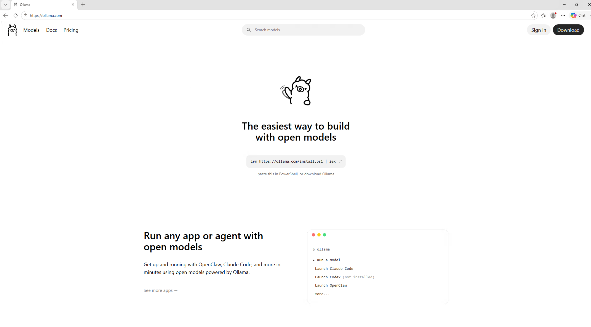
</p>
---

## Paso 2. Acceder a la sección de descarga

En la página principal seleccione el botón:

**Download**

Se mostrará la página con las versiones disponibles para los distintos sistemas operativos.


<p align="center">
  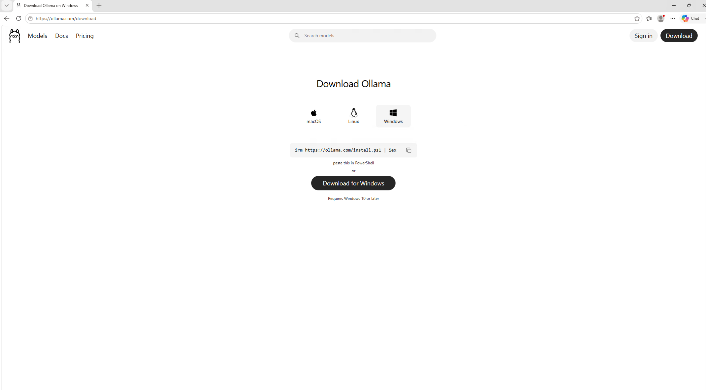
</p>
---

## Paso 3. Seleccionar Windows

Seleccione la versión correspondiente a:

**Windows**

Al hacerlo comenzará la descarga del archivo de instalación.


---

## Paso 4. Esperar la descarga

Dependiendo de la velocidad de su conexión a Internet, la descarga puede tardar algunos segundos o minutos.

Una vez finalizada, el archivo normalmente quedará almacenado en la carpeta:

```text
Descargas
```

---

## Paso 5. Verificar el archivo descargado

Abra la carpeta **Descargas** y confirme que el instalador se encuentra disponible.

Verifique que:

- el archivo fue descargado completamente;
- el tamaño es coherente con el indicado en el sitio oficial;
- el nombre corresponde al instalador de Ollama.


<p align="center">
  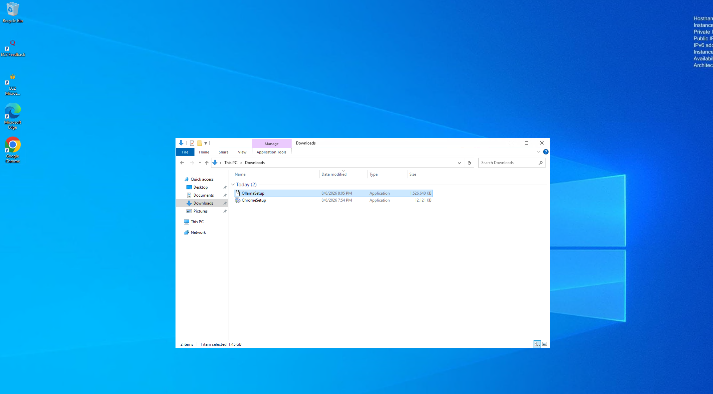
</p>
---

## Recomendación

No ejecute todavía el instalador.

La instalación será realizada paso a paso en la siguiente sección.

---

### Verificación

Complete la siguiente tabla.

| Verificación | Estado |
|--------------|:------:|
| Accedí al sitio oficial de Ollama | ☐ |
| Descargué la versión para Windows | ☐ |
| El archivo se descargó correctamente | ☐ |
| Localicé el instalador en la carpeta Descargas | ☐ |

Si todas las verificaciones fueron completadas puede continuar con la instalación.

---

### Problemas frecuentes

#### No puedo acceder al sitio web.

Verifique su conexión a Internet.

Si el problema persiste, compruebe que el sitio no se encuentre bloqueado por la red institucional.

---

#### La descarga se interrumpió.

Elimine el archivo incompleto y vuelva a descargar el instalador desde el sitio oficial.

---

#### El navegador muestra una advertencia durante la descarga.

Verifique que la descarga proviene del sitio oficial de Ollama antes de continuar.

Si tiene dudas, cancele la descarga e intente nuevamente desde la página principal del proyecto.

---

#### No encuentro el archivo descargado.

Revise la carpeta **Descargas**.

También puede utilizar la función de búsqueda del Explorador de archivos escribiendo:

```text
Ollama
```

---

### Buenas prácticas

- Descargue siempre Ollama desde el sitio oficial.
- Evite utilizar enlaces compartidos por terceros.
- No cambie el nombre del instalador antes de ejecutarlo.
- Conserve el archivo descargado hasta comprobar que la instalación finalizó correctamente.

---

### Checklist

Antes de continuar confirme que:

☐ Descargó el instalador oficial.

☐ El archivo se encuentra completo.

☐ Localizó el instalador en su computador.

☐ Está preparado para iniciar la instalación.

---

## 2.3 Instalación de Ollama

### Objetivo

Instalar Ollama en el computador y verificar que el proceso finalizó correctamente antes de realizar la primera ejecución.

---

### Tiempo estimado

**10 minutos**

---

### Requisitos previos

Antes de comenzar esta sección asegúrese de:

- Haber descargado el instalador oficial de Ollama.
- Disponer de permisos para instalar software.
- Haber cerrado aplicaciones innecesarias.

---

### Procedimiento

En esta sección instalará Ollama utilizando el instalador descargado en la sección anterior.

El proceso es completamente guiado y requiere muy poca configuración por parte del usuario.

---

## Paso 1. Localizar el instalador

Abra el **Explorador de archivos**.

Acceda a la carpeta **Descargas** (o a la ubicación donde guardó el archivo).

Localice el instalador descargado.

---

## Paso 2. Ejecutar el instalador

Haga doble clic sobre el archivo de instalación.

Si Windows muestra una advertencia de seguridad, confirme que el editor corresponde a **Ollama** y seleccione **Sí** para continuar.


---

## Paso 3. Iniciar la instalación

El asistente de instalación comenzará automáticamente.

En la mayoría de los casos no será necesario modificar ninguna configuración.

Seleccione el botón **Install** para iniciar el proceso.


<p align="center">
  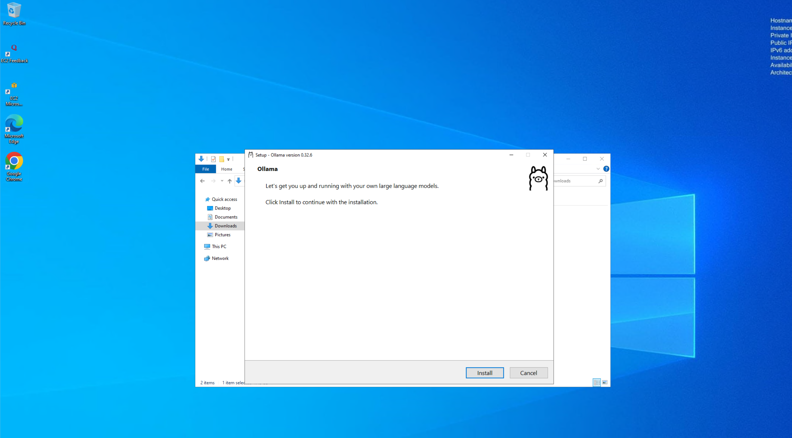
</p>
---

## Paso 4. Esperar el proceso de instalación

Durante algunos segundos el instalador copiará los archivos necesarios al computador.

Espere hasta que el proceso finalice.

No cierre la ventana durante esta etapa.


<p align="center">
  
</p>
---

## Paso 5. Finalizar la instalación

Una vez completado el proceso aparecerá el mensaje de instalación finalizada.

Seleccione **Finish** o cierre la ventana del instalador.

Una vez instalado, Ollama podrá ejecutarse en segundo plano y mantener disponible su servicio local para recibir solicitudes.


---

## ¿Dónde se instala Ollama?

De forma predeterminada, Ollama instala sus archivos de programa automáticamente.

No es necesario modificar la ubicación de instalación.

Los modelos de lenguaje se descargarán posteriormente y serán administrados por la propia aplicación.

---

### Verificación

Confirme los siguientes puntos.

| Verificación | Estado |
|--------------|:------:|
| El instalador se ejecutó correctamente | ☐ |
| La instalación finalizó sin errores | ☐ |
| No aparecieron mensajes de error | ☐ |
| Ollama quedó instalado en el equipo | ☐ |

Si todas las verificaciones fueron completadas, puede continuar con la primera ejecución.

---

### Problemas frecuentes

#### Windows bloquea la instalación.

Compruebe que descargó el instalador desde el sitio oficial.

Si utiliza un computador institucional, solicite permisos al administrador del sistema.

---

#### La instalación se interrumpe inesperadamente.

Cierre el instalador, reinicie el computador e intente nuevamente.

---

#### Aparece un mensaje indicando que la aplicación ya está instalada.

Es posible que Ollama haya sido instalado anteriormente.

En ese caso, continúe con la siguiente sección para verificar su funcionamiento.

---

#### El antivirus muestra una advertencia.

Verifique que el archivo proviene del sitio oficial de Ollama.

Si corresponde, autorice la instalación según las políticas de seguridad de su organización.

---

### Buenas prácticas

- No interrumpa el proceso de instalación.
- Utilice siempre el instalador más reciente disponible en el sitio oficial.
- Mantenga el instalador descargado hasta confirmar que todo funciona correctamente.
- Reinicie el computador únicamente si el instalador lo solicita.

---

### Checklist

Antes de continuar confirme que:

☐ Ejecutó el instalador.

☐ La instalación finalizó correctamente.

☐ No se presentaron errores durante el proceso.

☐ Ollama quedó instalado en el computador.

☐ Está preparado para realizar la primera ejecución.

<p align="center">
  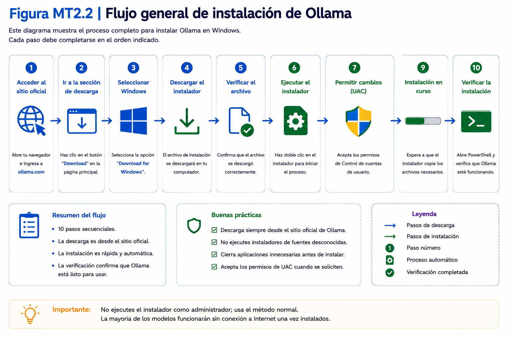
</p>

---

## 2.4 Primera ejecución

### Objetivo

Verificar que Ollama fue instalado correctamente e iniciar la aplicación por primera vez para comprobar que el servicio se encuentra funcionando.

---

### Tiempo estimado

**10 minutos**

---

### Requisitos previos

Antes de comenzar esta sección asegúrese de haber completado la instalación de Ollama.

No es necesario haber descargado ningún modelo de lenguaje.

---

### Procedimiento

Una vez finalizada la instalación, es recomendable comprobar que Ollama se encuentra correctamente instalado y que el servicio funciona sin inconvenientes.

En esta sección realizará la primera ejecución utilizando Windows PowerShell.

---

## Paso 1. Abrir Windows PowerShell

1. Presione la tecla **Windows**.
2. Escriba:

```text
PowerShell
```

3. Seleccione **Windows PowerShell**.

<p align="center">
  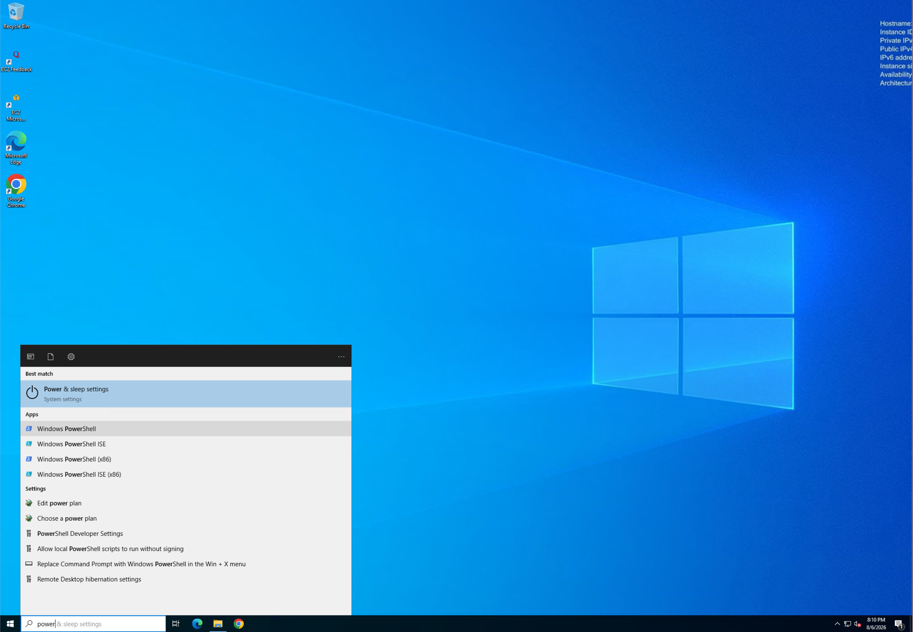
</p>
---

## Paso 2. Verificar que Ollama está disponible

En la consola escriba el siguiente comando.

```powershell
ollama
```

Presione la tecla **Enter**.

Si la instalación fue correcta, Ollama mostrará información general junto con la lista de comandos disponibles.

---

## Paso 3.  Cerrar PowerShell

No es necesario mantener abierta la consola.

Puede cerrarla y continuar con la siguiente sección.

---

### Verificación

Complete la siguiente tabla.

| Verificación                                                     | Estado |
| ---------------------------------------------------------------- | :----: |
| PowerShell reconoce el comando `ollama`                          |   ☐    |
| Ollama muestra la información general y sus comandos disponibles |   ☐    |


Si todas las verificaciones fueron satisfactorias, Ollama se encuentra correctamente instalado y operativo.

---

### Problemas frecuentes

#### El comando `ollama` no es reconocido.

Es posible que la instalación no se haya completado correctamente.

Reinicie el computador y vuelva a intentarlo.

Si el problema persiste, reinstale Ollama.

---

#### El navegador no responde al acceder a `localhost:11434`.

Verifique que Ollama se encuentre ejecutándose.

Si es necesario, cierre la aplicación e iníciela nuevamente.


---

#### La consola se cierra inesperadamente.

Abra nuevamente PowerShell y repita los pasos anteriores.

---

### Buenas prácticas

- Utilice PowerShell para ejecutar los comandos mostrados en este manual.
- Mantenga una única instancia de PowerShell abierta durante las pruebas.
- No modifique variables del sistema ni rutas de instalación.
- Verifique el funcionamiento de Ollama antes de descargar modelos de lenguaje.

---

### Checklist

Antes de continuar confirme que:

☐ PowerShell reconoce el comando `ollama`.  
☐ Ollama muestra correctamente sus comandos disponibles.


---

## 2.5 Verificación de la instalación

### Objetivo

Comprobar que Ollama fue instalado correctamente, que el servicio se encuentra operativo y que el entorno está preparado para descargar el primer modelo de lenguaje.

---

### Tiempo estimado

**10 minutos**

---

### Requisitos previos

Antes de comenzar esta sección deberá haber completado:

- Sección 2.3 – Instalación de Ollama.
- Sección 2.4 – Primera ejecución.

---

### Procedimiento

Antes de descargar modelos de lenguaje es recomendable realizar una verificación completa de la instalación.

Durante esta sección comprobará que Ollama responde correctamente a los principales comandos y que el servicio local se encuentra operativo.

---

## Paso 1. Abrir Windows PowerShell

Abra una nueva ventana de **Windows PowerShell**.

---

## Paso 2. Verificar la versión instalada

Ejecute el siguiente comando.

**Comando**

```powershell
PS C:\Users\Usuario> ollama --version
```

**Salida esperada**

```text
ollama version x.xx.x
```

Si el sistema muestra la versión instalada, continúe con el siguiente paso.

<p align="center">
  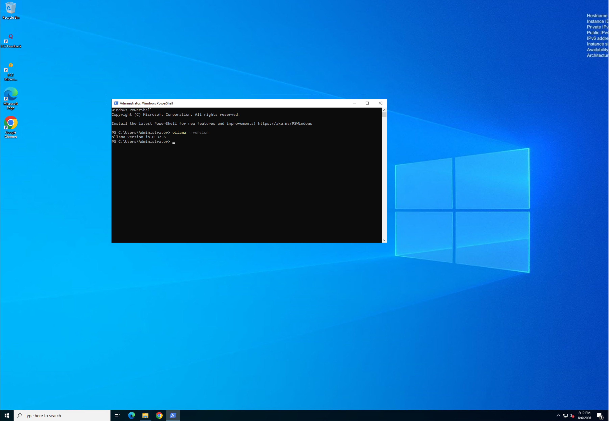
</p>
---

## Paso 3. Verificar la lista de modelos instalados

Ejecute el siguiente comando.

**Comando**

```powershell
PS C:\Users\Usuario> ollama list
```

**Salida esperada**

```text
NAME    ID    SIZE    MODIFIED
```

Como todavía no ha descargado ningún modelo, es normal que la lista aparezca vacía.

<p align="center">
  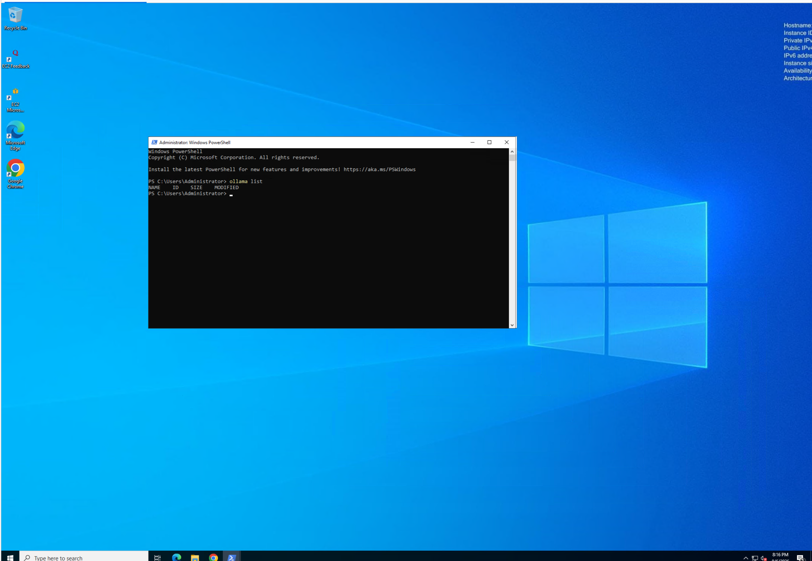
</p>
---

## Paso 4. Verificar la ayuda de Ollama

Ejecute el siguiente comando.

**Comando**

```powershell
PS C:\Users\Usuario> ollama help
```

**Salida esperada**

Se mostrará la lista de comandos disponibles.

No es necesario comprender todos los comandos en este momento.

Durante este capítulo aprenderá los más importantes.

<p align="center">
  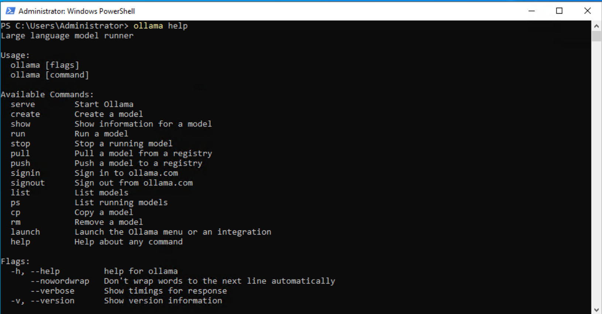
</p>
---

## Paso 5. Verificar el servicio local

Abra su navegador web.

Acceda a:

```text
http://localhost:11434
```

**Resultado esperado**

El navegador responderá indicando que el servicio de Ollama se encuentra disponible.

<p align="center">
  
</p>


---

## Paso 6. Cerrar las aplicaciones

Si todas las verificaciones fueron exitosas, puede cerrar PowerShell.

No será necesario realizar nuevas comprobaciones antes de descargar el primer modelo.

---

### Verificación

Complete la siguiente tabla.

| Elemento verificado | Estado |
|---------------------|:------:|
| Ollama responde al comando `--version` | ☐ |
| `ollama list` se ejecuta correctamente | ☐ |
| `ollama help` muestra la ayuda | ☐ |
| El servicio local responde correctamente | ☐ |

Si todas las verificaciones fueron satisfactorias, la instalación puede considerarse exitosa.

---

### Problemas frecuentes

#### El comando `ollama list` devuelve un error.

Verifique que Ollama se encuentre correctamente instalado.

Si es necesario, reinicie el computador y vuelva a ejecutar el comando.

---
#### El comando `ollama --version` genera un error.

Compruebe que la instalación finalizó correctamente y que está utilizando una ventana nueva de PowerShell.

---

#### La lista aparece vacía.

Es completamente normal.

Todavía no ha descargado ningún modelo de lenguaje.

---

#### El navegador no responde desde `localhost:11434`.

Compruebe que Ollama se encuentra ejecutándose.

Si el problema continúa, reinicie el servicio o el computador.

---

#### La versión mostrada no coincide con la del sitio oficial.

No constituye un problema siempre que corresponda a una versión reciente y compatible.

---

### Buenas prácticas

- Verifique siempre la instalación antes de descargar modelos.
- Familiarícese con los comandos básicos de Ollama.
- No elimine archivos manualmente desde las carpetas internas de Ollama.
- Mantenga actualizado el software cuando existan nuevas versiones estables.

---

### Checklist

Antes de continuar confirme que:

☐ Verificó la versión instalada.

☐ Ejecutó correctamente `ollama list`.

☐ Ejecutó correctamente `ollama help`.

☐ Confirmó el funcionamiento del servicio local.

☐ Ollama está preparado para descargar modelos de lenguaje.

<p align="center">
  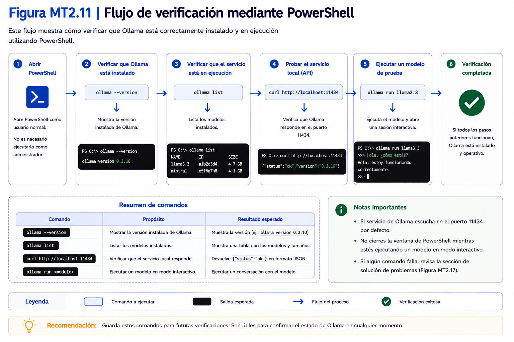
</p>

---

## 2.6 Descarga del primer modelo de lenguaje

### Objetivo

Descargar el primer modelo de lenguaje compatible con Ollama, verificar que la descarga finalizó correctamente y ejecutar una prueba básica de funcionamiento.

---

### Tiempo estimado

**15 minutos**

---

### Requisitos previos

Antes de comenzar esta sección deberá haber completado:

- Sección 2.3 – Instalación de Ollama.
- Sección 2.4 – Primera ejecución.
- Sección 2.5 – Verificación de la instalación.

Además, deberá disponer de una conexión estable a Internet.

---

### Procedimiento

Hasta este momento Ollama se encuentra instalado, pero todavía no dispone de ningún modelo de lenguaje.

En esta sección descargará el primer modelo que será utilizado durante el taller.

---

## Paso 1. Consultar la biblioteca oficial

Abra su navegador web.

Acceda al catálogo oficial de modelos de Ollama.

```text
https://ollama.com/library
```

En esta página encontrará los modelos disponibles para descarga.

<p align="center">
  
</p>
---

## Paso 2. Identificar el modelo recomendado

> **Importante:** Estas recomendaciones son aproximadas. El consumo real de recursos dependerá del modelo utilizado, su cuantización, la longitud del contexto, el hardware disponible y las demás aplicaciones que se encuentren en ejecución.

Durante este taller se trabajará con un modelo seleccionado por el instructor.

En futuras versiones del curso este modelo podría cambiar, por lo que siempre se recomienda consultar la guía del curso antes de iniciar la descarga.

Como referencia, la siguiente tabla muestra los tamaños habitualmente utilizados.

| Tamaño aproximado | Requisitos sugeridos | Uso recomendado |
|-------------------|----------------------|-----------------|
| 3B | Equipos con 8 GB RAM | Pruebas y equipos básicos |
| 7B – 8B | Equipos con 16 GB RAM | Taller completo |
| Superior a 8B | Equipos con 32 GB RAM o más | Casos avanzados |

> **Nota:** Durante esta versión del taller utilizaremos `llama3.2:latest` como modelo principal. En los comandos de descarga y ejecución podrá utilizarse `llama3.2`, mientras que Ollama podrá mostrar posteriormente el modelo instalado con la etiqueta completa `llama3.2:latest`.

---

## Paso 3. Abrir Windows PowerShell

Abra una nueva ventana de **Windows PowerShell**.

---

## Paso 4. Descargar el modelo

Ejecute el comando correspondiente al modelo definido para el taller.

**Comando**

```powershell
PS C:\Users\Usuario> ollama pull nombre-del-modelo
```

**Ejemplo**

```powershell
PS C:\Users\Usuario> ollama pull llama3.2
```

> **Nota:** El nombre del modelo puede variar entre versiones del taller.

Durante la descarga observará el avance del proceso.

<p align="center">
  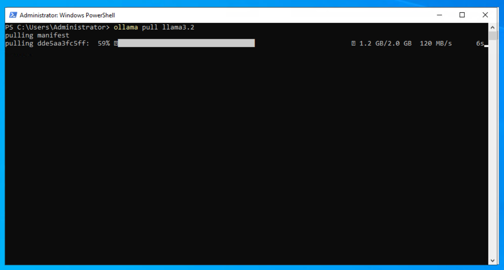
</p>
---

## Paso 5. Esperar la descarga

Dependiendo del tamaño del modelo y de la velocidad de Internet, este proceso puede tardar varios minutos.

Espere hasta que la descarga finalice completamente.

No cierre la ventana de PowerShell durante este proceso.

---

## Paso 6. Verificar que el modelo fue instalado

Ejecute el siguiente comando.

**Comando**

```powershell
PS C:\Users\Usuario> ollama list
```

**Salida esperada**

```text
NAME            ID          SIZE
nombre-modelo   xxxxxxxx    xx GB
```

El modelo descargado deberá aparecer en la lista.

<p align="center">
  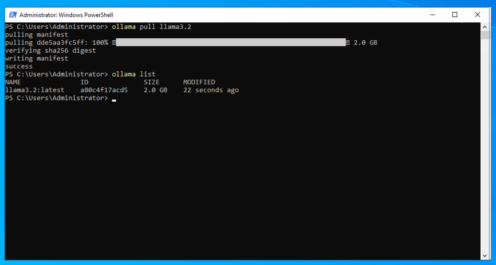
</p>
---

## Paso 7. Ejecutar una prueba rápida

Inicie el modelo mediante el siguiente comando.

**Comando**

```powershell
PS C:\Users\Usuario> ollama run nombre-del-modelo
```

**Ejemplo**

```powershell
PS C:\Users\Usuario> ollama run llama3.2
```

Cuando aparezca el cursor de entrada, escriba una pregunta sencilla.

Por ejemplo:

```text
Hola. ¿Puedes presentarte?
```

Si el modelo responde correctamente, la instalación fue exitosa.

<p align="center">
  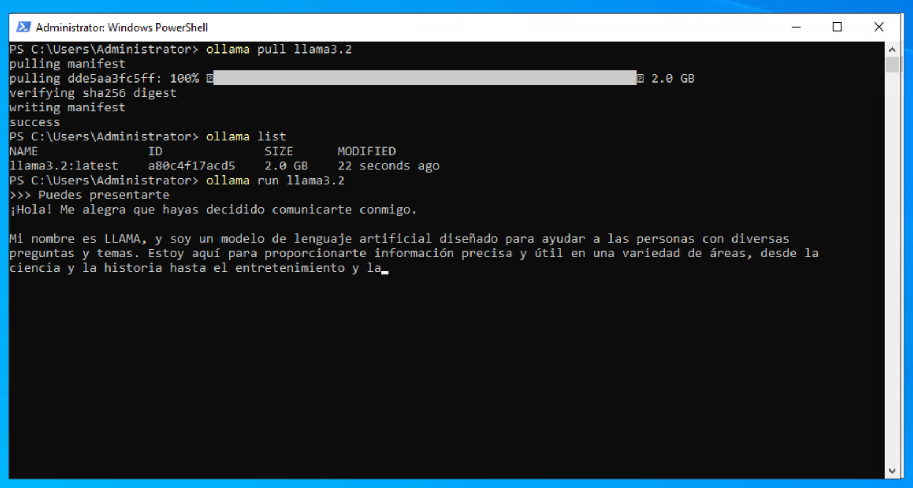
</p>
---

## Paso 8. Finalizar la prueba

Para salir del modelo utilice la combinación de teclas indicada por Ollama o cierre la sesión según las instrucciones mostradas en la consola.

No elimine el modelo descargado.

Será utilizado durante todo el taller.

---

### Verificación

Complete la siguiente tabla.

| Verificación | Estado |
|--------------|:------:|
| Accedí a la biblioteca oficial | ☐ |
| Descargué el modelo recomendado | ☐ |
| El modelo aparece en `ollama list` | ☐ |
| Ejecuté el modelo correctamente | ☐ |
| El modelo respondió una consulta | ☐ |

Si todas las verificaciones fueron satisfactorias, el entorno ya dispone de un modelo de lenguaje completamente operativo.

---

### Problemas frecuentes

#### La descarga se interrumpe.

Compruebe la conexión a Internet y vuelva a ejecutar el comando `ollama pull`.

Ollama continuará la descarga cuando sea posible.

---

#### El modelo no aparece en `ollama list`.

Repita la descarga y espere hasta que finalice completamente.

---

#### El modelo tarda mucho en responder.

Esto depende del tamaño del modelo y de las características del computador.

En equipos con menor cantidad de memoria RAM el tiempo de respuesta puede ser mayor.

---

#### Aparece un mensaje indicando que no existe suficiente memoria.

Seleccione un modelo de menor tamaño recomendado para su equipo.

---

### Buenas prácticas

- Descargue únicamente los modelos que realmente utilizará.
- Mantenga suficiente espacio libre en disco.
- No interrumpa una descarga en curso.
- Verifique el funcionamiento del modelo inmediatamente después de instalarlo.

---

### Checklist

Antes de continuar confirme que:

☐ Descargó correctamente el primer modelo.

☐ Verificó que aparece en la lista de modelos instalados.

☐ Ejecutó el modelo.

☐ El modelo respondió correctamente.

☐ Está preparado para conocer los comandos principales de Ollama.

---

## 2.7 Comandos principales

### Objetivo

Conocer y utilizar los comandos más importantes de Ollama para consultar información, administrar modelos y verificar el estado del entorno de trabajo.

---

### Tiempo estimado

**15 minutos**

---

### Requisitos previos

Antes de comenzar esta sección deberá haber completado:

- Sección 2.3 – Instalación de Ollama.
- Sección 2.6 – Descarga del primer modelo.

Además, deberá tener al menos un modelo instalado.

---

### Procedimiento

Ollama dispone de una interfaz de línea de comandos (CLI) que permite administrar los modelos instalados y controlar el funcionamiento de la aplicación.

Durante esta sección aprenderá los comandos utilizados con mayor frecuencia durante el taller.

---

## Comando 1. Consultar la versión instalada

Permite verificar la versión de Ollama instalada en el computador.

**Comando**

```powershell
PS C:\Users\Usuario> ollama --version
```

**Salida esperada**

```text
ollama version x.xx.x
```

---

## Comando 2. Mostrar ayuda

Presenta todos los comandos disponibles.

**Comando**

```powershell
PS C:\Users\Usuario> ollama help
```

**Salida esperada**

Se mostrará una lista con los comandos disponibles.

No es necesario memorizar todos ellos.

---

## Comando 3. Mostrar modelos instalados

Permite visualizar todos los modelos disponibles en el computador.

**Comando**

```powershell
PS C:\Users\Usuario> ollama list
```

**Salida esperada**

```text
NAME          ID        SIZE
modelo        xxxxxx    xx GB
```

---

## Comando 4. Ejecutar un modelo

Inicia un modelo de lenguaje para comenzar una conversación.

**Comando genérico**

```powershell
PS C:\Users\Usuario> ollama run nombre-del-modelo
```

**Ejemplo**

```powershell
PS C:\Users\Usuario> ollama run llama3.2
```

Una vez iniciado el modelo podrá escribir consultas directamente desde la consola.

---

## Comando 5. Descargar un modelo

Descarga un nuevo modelo desde la biblioteca oficial.

**Comando genérico**

```powershell
PS C:\Users\Usuario> ollama pull nombre-del-modelo
```

**Ejemplo**

```powershell
PS C:\Users\Usuario> ollama pull llama3.2
```

---

## Comando 6. Mostrar información de un modelo

Permite consultar información sobre un modelo instalado.

**Comando genérico**

```powershell
PS C:\Users\Usuario> ollama show nombre-del-modelo
```

**Ejemplo**

```powershell
PS C:\Users\Usuario> ollama show llama3.2
```

La información mostrada dependerá del modelo consultado.
<p align="center">
  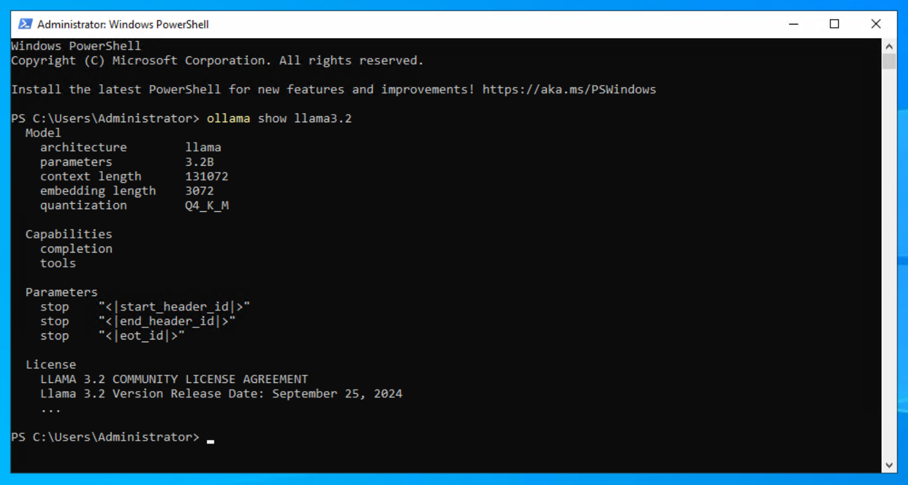
</p>
---

## Comando 7. Eliminar un modelo

Elimina un modelo instalado en el computador.

**Comando genérico**

```powershell
PS C:\Users\Usuario> ollama rm nombre-del-modelo
```

**Ejemplo**

```powershell
PS C:\Users\Usuario> ollama rm llama3.2
```

> **Importante:** No elimine el modelo utilizado durante el taller.

---

## Resumen de comandos

| Comando | Función |
|----------|----------|
| `ollama --version` | Mostrar la versión instalada. |
| `ollama help` | Mostrar la ayuda. |
| `ollama list` | Listar modelos instalados. |
| `ollama run` | Ejecutar un modelo. |
| `ollama pull` | Descargar un modelo. |
| `ollama show` | Mostrar información de un modelo. |
| `ollama rm` | Eliminar un modelo. |

Estos serán los comandos utilizados con mayor frecuencia durante el taller.

---

### Verificación

Ejecute los siguientes comandos y confirme que funcionan correctamente.

| Comando | Ejecutado |
|----------|:---------:|
| `ollama --version` | ☐ |
| `ollama help` | ☐ |
| `ollama list` | ☐ |
| `ollama run` | ☐ |
| `ollama show` | ☐ |

---

### Problemas frecuentes

#### El comando devuelve un mensaje de error.

Revise cuidadosamente la sintaxis y compruebe que el nombre del modelo está escrito correctamente.

---

#### El modelo indicado no existe.

Utilice `ollama list` para consultar los modelos disponibles.

---

#### Eliminé accidentalmente un modelo.

Descárguelo nuevamente utilizando el comando `ollama pull`.

---

#### No recuerdo el nombre exacto del modelo.

Ejecute:

```powershell
PS C:\Users\Usuario> ollama list
```

---

### Buenas prácticas

- Utilice siempre `ollama list` antes de ejecutar un modelo.
- Evite descargar múltiples modelos que no utilizará.
- Elimine únicamente modelos que ya no necesite.
- Mantenga una nomenclatura consistente al trabajar con distintos modelos.

---

### Checklist

Antes de continuar confirme que:

☐ Conoce los comandos básicos de Ollama.

☐ Ejecutó correctamente los principales comandos.

☐ Comprende para qué sirve cada uno.

☐ Está preparado para administrar modelos instalados.

<p align="center">
  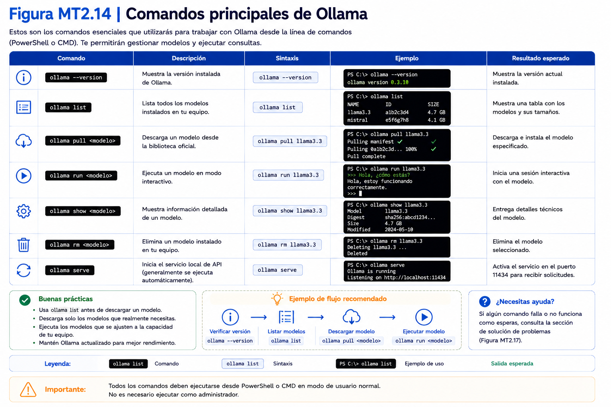
</p>

---

## 2.8 Administración de modelos

### Objetivo

Aprender a administrar los modelos instalados en Ollama, consultando su información, eliminando modelos que ya no se utilizan y manteniendo organizada la biblioteca de modelos.

---

### Tiempo estimado

**15 minutos**

---

### Requisitos previos

Antes de comenzar esta sección deberá haber completado:

- Sección 2.6 – Descarga del primer modelo.
- Sección 2.7 – Comandos principales.

Además, deberá tener al menos un modelo instalado.

---

### Procedimiento

Con el paso del tiempo es habitual descargar distintos modelos para realizar pruebas o desarrollar proyectos.

Por este motivo es importante conocer cómo administrar correctamente la biblioteca de modelos instalada en el computador.

---

## Paso 1. Consultar los modelos instalados

Abra Windows PowerShell.

Ejecute el siguiente comando.

**Comando**

```powershell
PS C:\Users\Usuario> ollama list
```

**Salida esperada**

```text
NAME           ID        SIZE
modelo1        xxxxxx    xx GB
modelo2        xxxxxx    xx GB
```

Revise la lista de modelos disponibles.

---

## Paso 2. Consultar información de un modelo

Seleccione uno de los modelos instalados.

Ejecute el siguiente comando.

**Comando genérico**

```powershell
PS C:\Users\Usuario> ollama show nombre-del-modelo
```

**Ejemplo**

```powershell
PS C:\Users\Usuario> ollama show llama3.2
```

El sistema mostrará información técnica sobre el modelo seleccionado.

---

## Paso 3. Identificar modelos que ya no utiliza

Revise la lista de modelos instalados.

Pregúntese:

- ¿Utilizo actualmente este modelo?
- ¿Lo necesitaré durante el taller?
- ¿Ocupa espacio innecesariamente?

Si la respuesta es negativa, puede considerar eliminarlo.

---

## Paso 4. Eliminar un modelo

**Comando genérico**

```powershell
PS C:\Users\Usuario> ollama rm nombre-del-modelo
```

**Ejemplo**

```powershell
PS C:\Users\Usuario> ollama rm modelo-antiguo
```

Una vez eliminado, el modelo dejará de aparecer en la lista de modelos instalados.

> **Importante:** No elimine el modelo recomendado para el desarrollo del taller.

---

## Paso 5. Verificar la eliminación

Ejecute nuevamente:

**Comando**

```powershell
PS C:\Users\Usuario> ollama list
```

Confirme que el modelo eliminado ya no aparece en la lista.

---

## Paso 6. Descargar nuevamente un modelo (si es necesario)

Si eliminó un modelo por error, podrá recuperarlo ejecutando nuevamente:

**Comando genérico**

```powershell
PS C:\Users\Usuario> ollama pull nombre-del-modelo
```

Si el modelo continúa disponible en la biblioteca de Ollama, podrá descargarlo nuevamente utilizando el mismo comando.

---

## Recomendaciones de administración

A medida que utilice Ollama es posible que acumule numerosos modelos.

Para mantener un entorno organizado se recomienda:

- conservar únicamente los modelos utilizados con frecuencia;
- eliminar modelos de prueba que ya no sean necesarios;
- verificar periódicamente el espacio disponible en disco;
- evitar mantener varias versiones del mismo modelo si no serán utilizadas.

---

### Verificación

Complete la siguiente tabla.

| Acción | Realizada |
|---------|:---------:|
| Consulté la lista de modelos | ☐ |
| Revisé la información de un modelo | ☐ |
| Identifiqué modelos que ya no utilizo | ☐ |
| Comprendí cómo eliminar un modelo | ☐ |
| Comprendí cómo volver a descargarlo | ☐ |

---

### Problemas frecuentes

#### Eliminé el modelo equivocado.

No constituye un problema.

Puede volver a descargarlo utilizando el comando:

```powershell
PS C:\Users\Usuario> ollama pull nombre-del-modelo
```

---

#### No recuerdo el nombre exacto del modelo.

Ejecute:

```powershell
PS C:\Users\Usuario> ollama list
```

para consultar los modelos disponibles.

---

#### Tengo poco espacio disponible en disco.

Elimine modelos que ya no utilice antes de descargar nuevos modelos.

---

#### El comando `ollama show` no encuentra el modelo.

Verifique que el nombre esté escrito exactamente igual que aparece en la salida de `ollama list`.

---

### Buenas prácticas

- Mantenga instalada únicamente la cantidad de modelos necesaria para sus proyectos.
- Revise periódicamente el espacio utilizado por los modelos.
- No elimine modelos mientras estén siendo utilizados por otra aplicación.
- Utilice nombres exactamente iguales a los registrados por Ollama.

---

### Checklist

Antes de continuar confirme que:

☐ Sabe consultar los modelos instalados.

☐ Sabe obtener información de un modelo.

☐ Sabe eliminar modelos.

☐ Sabe recuperar un modelo eliminado.

☐ Comprende cómo mantener organizada su biblioteca de modelos.

<p align="center">
  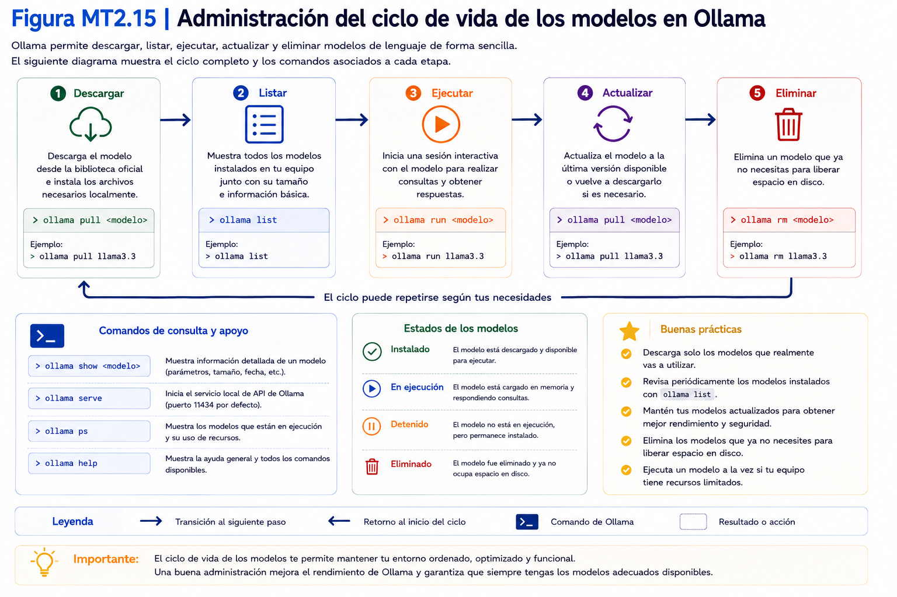
</p>

---

## 2.9 Actualización y desinstalación de Ollama

### Objetivo

Conocer el procedimiento recomendado para mantener Ollama actualizado y aprender cómo desinstalar completamente la aplicación cuando sea necesario.

---

### Tiempo estimado

**10 minutos**

---

### Requisitos previos

Antes de comenzar esta sección deberá haber completado las secciones anteriores del Capítulo 2.

No es necesario realizar ningún cambio en la instalación actual.

---

### Procedimiento

Al igual que cualquier otra aplicación, Ollama recibe periódicamente nuevas versiones que incorporan mejoras, correcciones de errores y compatibilidad con nuevos modelos de lenguaje.

Aunque no es obligatorio actualizar inmediatamente, se recomienda mantener una versión reciente y estable.

Asimismo, en determinadas situaciones puede ser necesario desinstalar la aplicación, por ejemplo:

- reinstalar el entorno desde cero;
- solucionar problemas de instalación;
- liberar espacio en el computador;
- dejar de utilizar Ollama.

En esta sección revisará ambos procedimientos.

---

## Parte A. Actualizar Ollama

### Paso 1. Consultar la versión instalada

Abra **Windows PowerShell**.

Ejecute el siguiente comando.

**Comando**

```powershell
PS C:\Users\Usuario> ollama --version
```

Anote la versión instalada.

---

### Paso 2. Consultar la versión disponible

Acceda al sitio oficial de Ollama.

```text
https://ollama.com
```

Revise si existe una versión más reciente que la instalada en su computador.

---

### Paso 3. Descargar el instalador actualizado

Si existe una nueva versión:

- descargue el instalador más reciente;
- siga el procedimiento descrito en la **Sección 2.2**.

---

### Paso 4. Ejecutar el instalador

Ejecute el nuevo instalador.

El proceso actualizará automáticamente la instalación existente.

En la mayoría de los casos no será necesario realizar configuraciones adicionales.

---

### Paso 5. Verificar la actualización

Una vez finalizado el proceso, ejecute nuevamente:

**Comando**

```powershell
PS C:\Users\Usuario> ollama --version
```

Compruebe que la versión corresponde a la recientemente instalada.

---

## Parte B. Desinstalar Ollama

La desinstalación sólo será necesaria si desea eliminar completamente el entorno o reinstalar la aplicación desde cero.

---

### Paso 1. Abrir la configuración de Windows

Presione:

**Windows + I**

Seleccione:

**Aplicaciones**

Luego:

**Aplicaciones instaladas**

---

### Paso 2. Buscar Ollama

En el cuadro de búsqueda escriba:

```text
Ollama
```

Seleccione la aplicación.

---

### Paso 3. Desinstalar

Seleccione la opción:

**Desinstalar**

Confirme la operación cuando Windows lo solicite.

---

### Paso 4. Verificar la desinstalación

Abra PowerShell.

Ejecute:

**Comando**

```powershell
PS C:\Users\Usuario> ollama --version
```

Si la desinstalación fue exitosa, Windows indicará que el comando ya no existe.

---

## ¿Se eliminan los modelos?

La desinstalación de Ollama puede conservar determinados datos, modelos o archivos asociados a la aplicación.

Si el objetivo es liberar completamente el espacio utilizado, consulte el procedimiento correspondiente a la versión de Ollama utilizada en el taller antes de eliminar manualmente archivos o carpetas.

Para evitar pérdidas de información o problemas en una futura reinstalación, no elimine directorios internos de Ollama sin verificar previamente su contenido y función.

> **Nota:** La ubicación de almacenamiento puede variar entre versiones del sistema operativo y de Ollama.

---

### Verificación

Complete la siguiente tabla.

| Acción | Comprendida |
|---------|:-----------:|
| Consultar la versión instalada | ☐ |
| Actualizar Ollama | ☐ |
| Verificar la actualización | ☐ |
| Desinstalar Ollama | ☐ |
| Comprender el tratamiento de los modelos instalados | ☐ |

---

### Problemas frecuentes

#### Después de actualizar Ollama la versión sigue siendo la misma.

Compruebe que descargó el instalador más reciente desde el sitio oficial.

---

#### La actualización genera un error.

Reinicie el computador y vuelva a ejecutar el instalador.

---

#### No puedo desinstalar Ollama.

Verifique que dispone de permisos de administrador o solicite apoyo al área de soporte informático.

---

#### Después de desinstalar todavía aparecen archivos del programa.

Algunas versiones pueden conservar modelos descargados o archivos de configuración.

Revise cuidadosamente el espacio ocupado antes de eliminarlos manualmente.

---

### Buenas prácticas

- Mantenga Ollama actualizado únicamente con versiones estables.
- Descargue siempre el instalador desde el sitio oficial.
- Evite eliminar manualmente archivos internos de la aplicación.
- Realice una copia de seguridad de los proyectos antes de reinstalar el entorno.

---

### Checklist

Antes de continuar confirme que:

☐ Comprende cómo actualizar Ollama.

☐ Sabe verificar la versión instalada.

☐ Conoce el procedimiento de desinstalación.

☐ Comprende qué ocurre con los modelos instalados.

☐ Está preparado para resolver problemas básicos relacionados con Ollama.

<p align="center">
  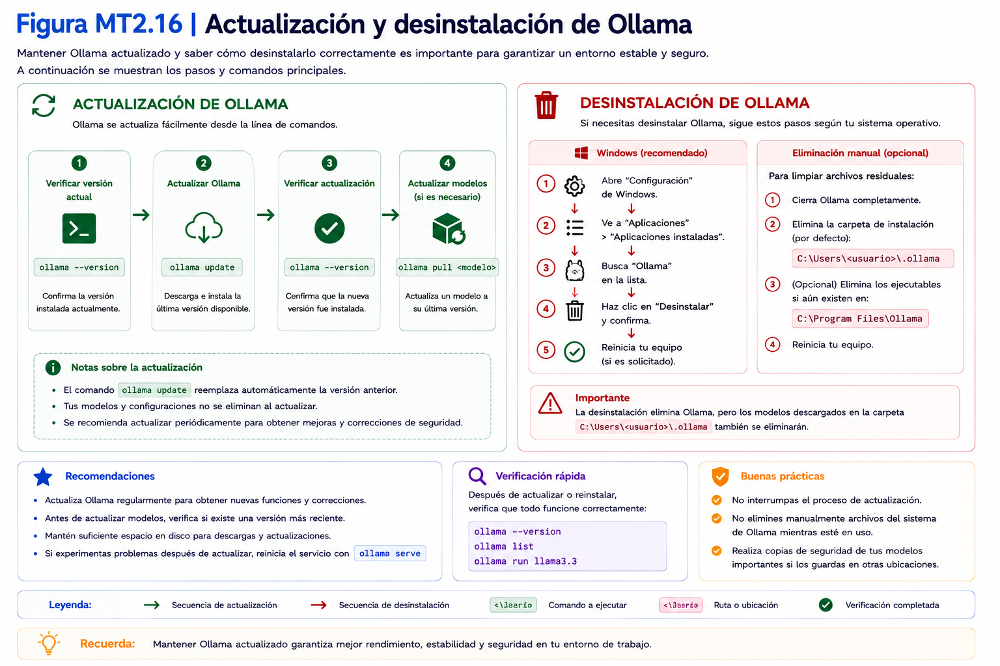
</p>

---

## 2.10 Solución de problemas

### Objetivo

Identificar y resolver los problemas más frecuentes relacionados con la instalación, configuración y funcionamiento de Ollama.

---

### Tiempo estimado

**15 minutos**

---

### Requisitos previos

Se recomienda haber completado todas las secciones anteriores del Capítulo 2.

---

### Procedimiento

Aunque la instalación de Ollama suele completarse sin inconvenientes, es posible que durante el proceso aparezcan errores asociados al sistema operativo, permisos, conectividad o configuración del equipo.

En esta sección se presentan los problemas más habituales y las acciones recomendadas para resolverlos.

---

## Problema 1. El comando `ollama` no es reconocido

### Síntoma

Al ejecutar:

**Comando**

```powershell
PS C:\Users\Usuario> ollama --version
```

aparece un mensaje similar a:

```text
'ollama' no se reconoce como un comando...
```

### Posibles causas

- La instalación no finalizó correctamente.
- El equipo no fue reiniciado después de instalar.
- La instalación fue interrumpida.

### Solución

1. Cierre PowerShell.
2. Reinicie el computador.
3. Abra nuevamente PowerShell.
4. Ejecute otra vez:

```powershell
ollama --version
```

Si el problema continúa, reinstale Ollama siguiendo las instrucciones del Capítulo 2.

---

## Problema 2. No puedo descargar un modelo

### Síntoma

El comando:

```powershell
ollama pull nombre-del-modelo
```

no inicia la descarga.

### Posibles causas

- Sin conexión a Internet.
- Nombre del modelo incorrecto.
- Problemas temporales en el servicio.

### Solución

- Verifique la conexión.
- Revise el nombre del modelo.
- Consulte la biblioteca oficial.
- Intente nuevamente unos minutos después.

---

## Problema 3. El modelo responde muy lentamente

### Posibles causas

- Memoria RAM insuficiente.
- Modelo demasiado grande.
- Muchas aplicaciones abiertas.

### Solución

- Cierre programas innecesarios.
- Reinicie el computador.
- Utilice un modelo más pequeño.

---

## Problema 4. Espacio insuficiente en disco

### Síntoma

La descarga del modelo se interrumpe.

### Solución

- Elimine modelos que ya no utilice.
- Libere espacio en la unidad.
- Descargue un modelo de menor tamaño.

---

## Problema 5. El servicio local no responde

### Síntoma

La dirección:

```text
http://localhost:11434
```

no devuelve respuesta.

### Solución

- Compruebe que Ollama está instalado.
- Reinicie el computador.
- Verifique nuevamente utilizando:

```powershell
ollama --version
```

---

## Problema 6. Open WebUI no encuentra Ollama

Este problema será abordado nuevamente en el Capítulo 4.

Como verificación inicial confirme que:

- Ollama está instalado.
- El servicio responde correctamente.
- El modelo puede ejecutarse desde PowerShell.

---

## Recomendaciones generales

Antes de reinstalar Ollama siempre verifique:

- la conexión a Internet;
- el espacio disponible;
- la memoria RAM;
- la versión instalada;
- el nombre del modelo utilizado.

En la mayoría de los casos el problema se resuelve realizando estas comprobaciones.

---

### Verificación

Responda las siguientes preguntas.

| Pregunta | Sí | No |
|----------|:--:|:--:|
| ¿Conozco las causas más frecuentes de error? | ☐ | ☐ |
| ¿Sé verificar la instalación? | ☐ | ☐ |
| ¿Sé comprobar si un modelo fue descargado correctamente? | ☐ | ☐ |
| ¿Sé dónde comenzar el diagnóstico? | ☐ | ☐ |

---

### Problemas frecuentes

En esta sección se revisaron los problemas más comunes.

Si aparece un error distinto, consulte el **Capítulo 4 – Solución de problemas (Troubleshooting) del Manual de Referencia Técnica**, donde encontrará una colección ampliada de incidencias, causas probables y acciones recomendadas para el diagnóstico y resolución de problemas.

---

### Buenas prácticas

- Realice el diagnóstico antes de reinstalar el software.
- Mantenga actualizado Ollama.
- Utilice modelos compatibles con la capacidad del equipo.
- Documente los errores recurrentes para facilitar futuras soluciones.

---

### Checklist

Antes de continuar confirme que:

☐ Sé verificar la instalación de Ollama.

☐ Puedo identificar los problemas más comunes.

☐ Conozco las acciones básicas de diagnóstico.

☐ Estoy preparado para continuar con la configuración del entorno.

<p align="center">
  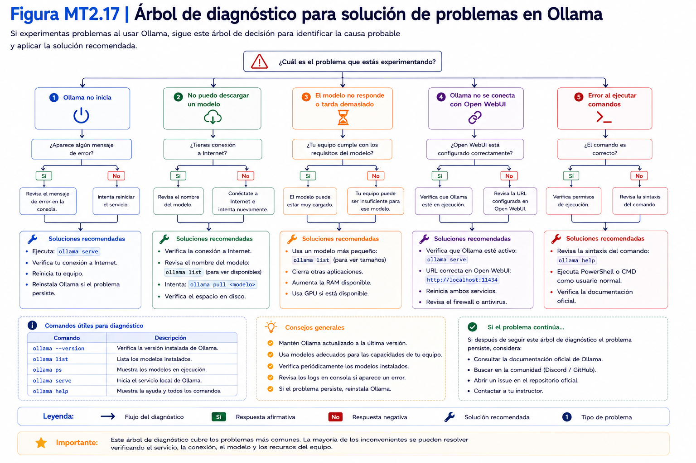
</p>

---

## Resumen del capítulo

En este capítulo usted:

✔ Descargó Ollama desde el sitio oficial.

✔ Instaló la aplicación.

✔ Verificó el funcionamiento del servicio.

✔ Descargó su primer modelo de lenguaje.

✔ Aprendió los comandos principales.

✔ Administró modelos instalados.

✔ Conoció el procedimiento de actualización y desinstalación.

✔ Revisó los problemas más frecuentes y sus posibles soluciones.

Con estas actividades quedó preparado para comenzar a trabajar con modelos de lenguaje de manera local.

---

## Próximo capítulo

En el **Capítulo 3 – Selección y administración de modelos de lenguaje** conocerá cómo seleccionar y gestionar modelos de lenguaje de acuerdo con las características de su computador y el tipo de tarea que desea realizar.

---

# Fin del Capítulo 2

**Capítulo siguiente: Capítulo 3 – Selección y administración de modelos de lenguaje**
