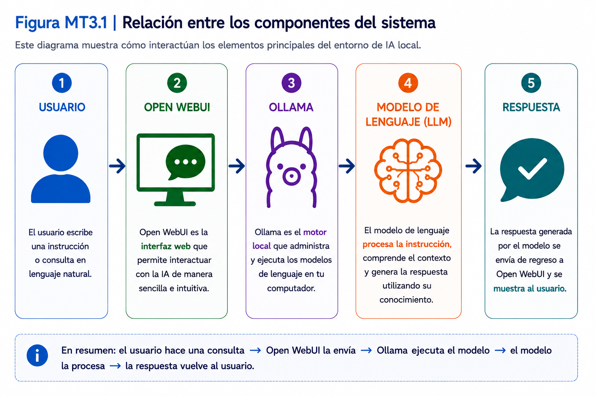
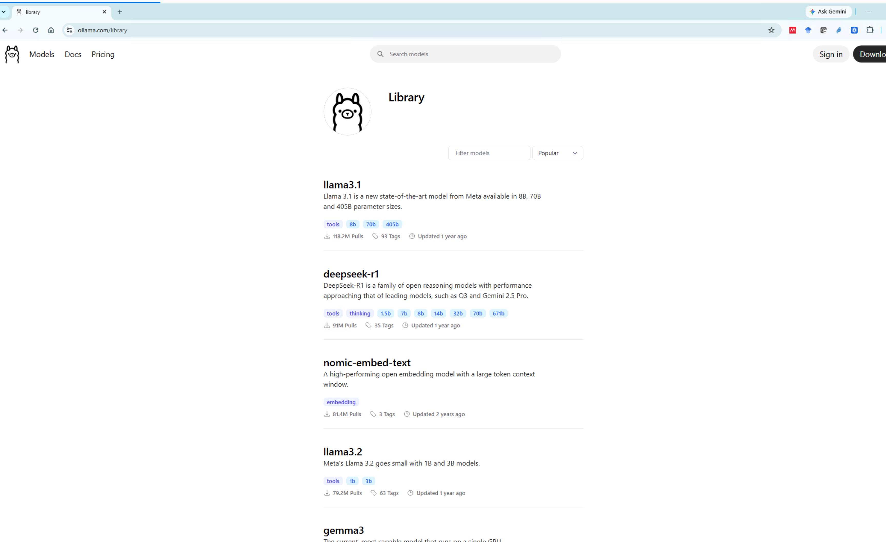
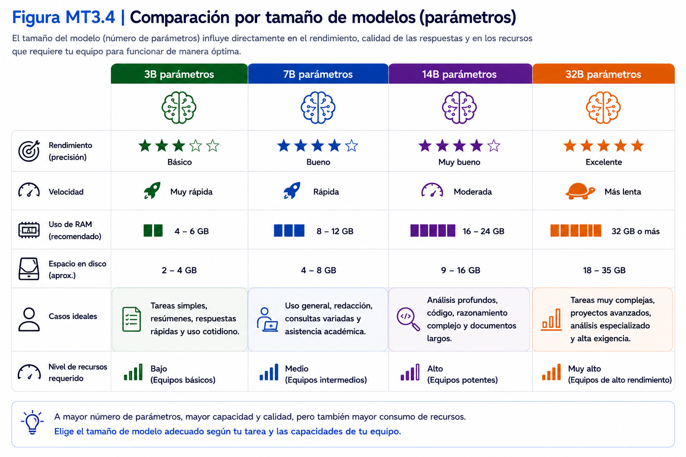
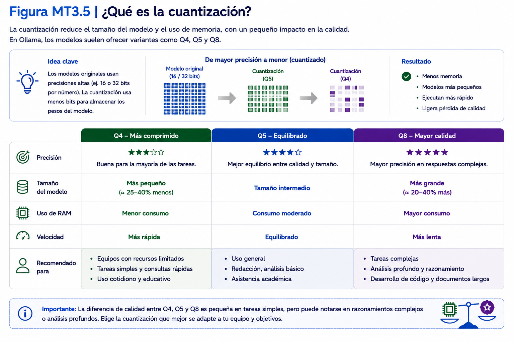
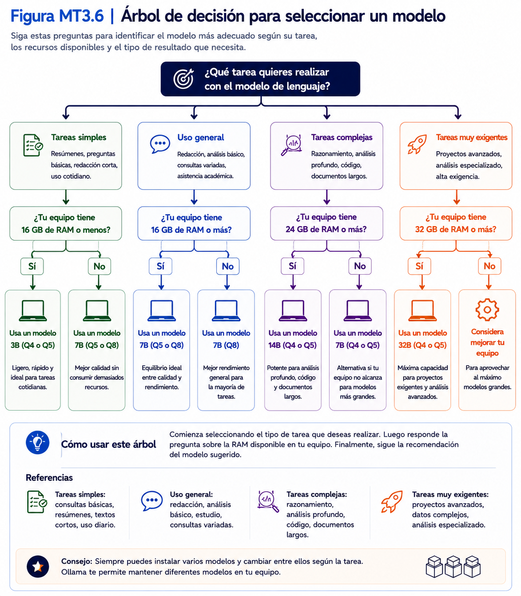
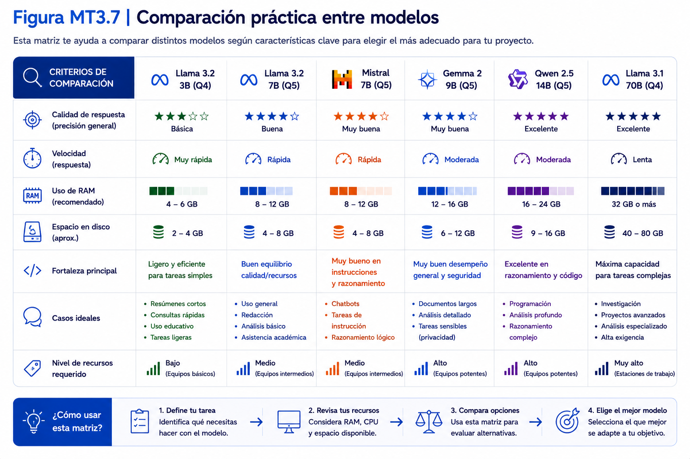
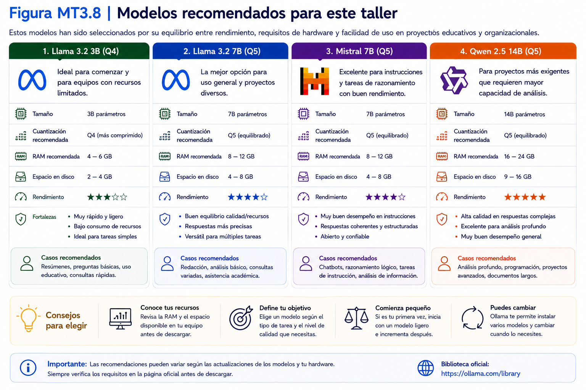
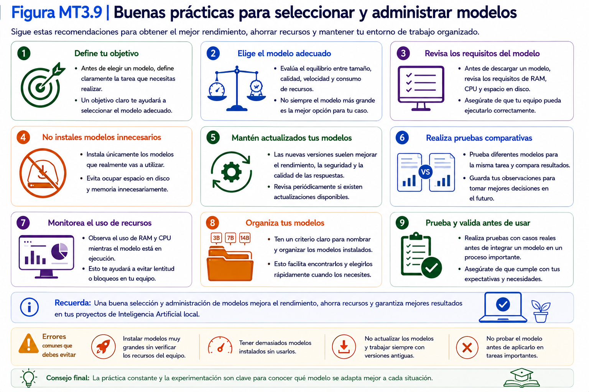

# Capítulo 3

# Selección y administración de modelos de lenguaje

## 3.1 ¿Qué es un modelo de lenguaje?

### Objetivo

Comprender qué es un modelo de lenguaje y cuál es su función dentro del entorno de Inteligencia Artificial utilizado durante el taller.

---

### Tiempo estimado

**5 minutos**

---

### Requisitos previos

Antes de comenzar esta sección deberá haber completado el **Capítulo 2 – Instalación y administración de Ollama**.

Además, se recomienda tener al menos un modelo instalado en el computador.

---

### Procedimiento

Hasta este momento ha instalado Ollama y descargado su primer modelo.

Ahora es importante comprender qué representa realmente ese modelo.

Un **modelo de lenguaje** (Large Language Model o LLM) es un modelo de Inteligencia Artificial entrenado con grandes cantidades de información para procesar lenguaje y generar respuestas a partir de las instrucciones recibidas.

En otras palabras, es el componente que realiza el trabajo de Inteligencia Artificial.

Mientras que Ollama actúa como el motor que ejecuta el modelo, el modelo de lenguaje es quien procesa las instrucciones y genera las respuestas.

La siguiente figura resume esta relación.

<p align="center">
  
</p>

Durante el taller podrá instalar distintos modelos.

Cada uno tendrá características diferentes en aspectos como:

- velocidad;
- tamaño;
- consumo de memoria;
- calidad de las respuestas;
- especialización.

Por este motivo, seleccionar correctamente un modelo será una decisión importante.

---

## ¿Qué puede hacer un modelo de lenguaje?

Dependiendo del modelo utilizado, podrá realizar tareas como:

- responder preguntas;
- resumir documentos;
- redactar textos;
- traducir información;
- generar código;
- analizar información;
- apoyar procesos organizacionales.

No todos los modelos obtienen el mismo desempeño en todas estas tareas.

---

## ¿Todos los modelos son iguales?

No.

Aunque todos procesan lenguaje natural, existen diferencias importantes entre ellos.

Por ejemplo:

- algunos responden más rápido;
- otros generan respuestas más precisas;
- algunos requieren mayor memoria RAM;
- otros están optimizados para programación;
- algunos ofrecen mejor desempeño en determinados idiomas.

Durante este capítulo aprenderá a identificar estas diferencias y seleccionar el modelo más adecuado para cada situación.

---

## ¿Necesito utilizar siempre el mismo modelo?

No.

Una de las principales ventajas de Ollama es que permite instalar varios modelos y cambiar entre ellos cuando sea necesario.

Esto significa que un mismo computador puede utilizar distintos modelos según la tarea que se desee realizar.

---

### Verificación

Responda las siguientes preguntas.

| Pregunta | Sí | No |
|----------|:--:|:--:|
| ¿Comprendo la diferencia entre Ollama y un modelo de lenguaje? | ☐ | ☐ |
| ¿Comprendo que distintos modelos ofrecen distintos resultados? | ☐ | ☐ |
| ¿Comprendo que puedo instalar más de un modelo? | ☐ | ☐ |
| ¿Comprendo que el modelo genera las respuestas? | ☐ | ☐ |

---

### Problemas frecuentes

#### Pensé que Ollama era el modelo de Inteligencia Artificial.

No.

Ollama es la aplicación que ejecuta los modelos.

Los modelos son componentes independientes que pueden instalarse o eliminarse según las necesidades del usuario.

---

#### ¿Puedo utilizar distintos modelos al mismo tiempo?

Sí.

Puede mantener varios modelos instalados y seleccionar cuál utilizar en cada momento.

---

#### ¿Todos los modelos funcionan igual de rápido?

No.

El rendimiento dependerá del tamaño del modelo y de las características del computador.

---

### Buenas prácticas

- Seleccione el modelo de acuerdo con la tarea que desea realizar.
- Evite instalar modelos que no utilizará.
- Mantenga únicamente los modelos necesarios para sus proyectos.
- Antes de descargar un modelo, revise sus requisitos de hardware.

---

### Checklist

Antes de continuar confirme que:

☐ Comprende qué es un modelo de lenguaje.

☐ Comprende la diferencia entre Ollama y un modelo.

☐ Comprende que existen distintos tipos de modelos.

☐ Está preparado para conocer la biblioteca oficial de modelos disponibles.

---

## 3.2 Biblioteca oficial de modelos

### Objetivo

Aprender a utilizar la biblioteca oficial de modelos de Ollama para buscar, consultar y seleccionar modelos de lenguaje compatibles con las características del computador y los objetivos del proyecto.

---

### Tiempo estimado

**10 minutos**

---

### Requisitos previos

Antes de comenzar esta sección deberá haber completado:

- Capítulo 2 – Instalación y administración de Ollama.
- Sección 3.1 – ¿Qué es un modelo de lenguaje?

Se recomienda disponer de conexión a Internet.

---

### Procedimiento

Todos los modelos compatibles con Ollama se encuentran disponibles en la biblioteca oficial del proyecto.

Desde este sitio podrá consultar información sobre cada modelo antes de descargarlo.

La biblioteca se actualiza periódicamente con nuevos modelos y versiones.

Por este motivo, siempre se recomienda utilizar la información publicada en el sitio oficial.

---

## Paso 1. Acceder a la biblioteca

Abra su navegador web.

Ingrese a:

```text
https://ollama.com/library
```

Se mostrará el catálogo oficial de modelos disponibles.

<p align="center">
  
</p>

---

## Paso 2. Explorar los modelos disponibles

En la página principal observará una lista de familias de modelos.

Por ejemplo:

- Llama
- Gemma
- Mistral
- Qwen
- DeepSeek
- Phi

La disponibilidad de modelos puede variar con el tiempo.


---

## Paso 3. Abrir la ficha de un modelo

Seleccione cualquiera de los modelos disponibles.

Cada modelo dispone de una ficha técnica donde podrá consultar información como:

- nombre del modelo;
- tamaños disponibles;
- descripción;
- comando de descarga;
- variantes disponibles.


<p align="center">
  
</p>
---

## Paso 4. Identificar el comando de descarga

Cada ficha incluye el comando necesario para descargar el modelo mediante Ollama.

Por ejemplo.

**Comando genérico**

```powershell
ollama pull nombre-del-modelo
```

Este comando podrá copiarse directamente desde la página.

No será necesario escribirlo manualmente.

---

## Paso 5. Revisar las variantes disponibles

Algunos modelos disponen de distintas versiones.

Estas pueden diferenciarse por:

- tamaño;
- cuantización;
- versión;
- capacidad.

Durante las siguientes secciones aprenderá cómo interpretar estas diferencias.

---

## Información que encontrará en cada modelo

La mayoría de las fichas incluyen información similar a la siguiente.

| Información | Descripción |
|--------------|-------------|
| Nombre | Identifica el modelo. |
| Familia | Modelo base al que pertenece. |
| Tamaños disponibles | Versiones del mismo modelo. |
| Comando de descarga | Comando `ollama pull`. |
| Última actualización | Fecha de publicación o actualización. |

La información disponible puede variar entre modelos.

---

## ¿Debo descargar todos los modelos?

No.

Se recomienda descargar únicamente los modelos que realmente utilizará.

Mantener demasiados modelos instalados consume espacio en disco y dificulta la administración del entorno.

---

### Verificación

Complete la siguiente tabla.

| Acción | Realizada |
|---------|:---------:|
| Accedí a la biblioteca oficial | ☐ |
| Revisé diferentes familias de modelos | ☐ |
| Abrí la ficha de un modelo | ☐ |
| Identifiqué el comando de descarga | ☐ |
| Comprendí la información disponible en cada ficha | ☐ |

---

### Problemas frecuentes

#### No encuentro un modelo mencionado en otro sitio.

La biblioteca oficial cambia periódicamente.

Es posible que algunos modelos sean reemplazados por versiones más recientes.

---

#### Existen muchas versiones del mismo modelo.

No constituye un problema.

En las siguientes secciones aprenderá cómo seleccionar la más adecuada.

---

#### No sé cuál modelo descargar.

No descargue ninguno adicional por ahora.

Primero complete este capítulo y posteriormente seleccione el modelo recomendado según las características de su computador.

---

### Buenas prácticas

- Consulte siempre la biblioteca oficial antes de descargar un modelo.
- Revise la ficha técnica antes de iniciar la descarga.
- Descargue únicamente modelos compatibles con la capacidad de su equipo.
- Evite utilizar comandos obtenidos desde sitios no oficiales.

---

### Checklist

Antes de continuar confirme que:

☐ Accedió a la biblioteca oficial.

☐ Comprende cómo buscar modelos.

☐ Comprende la información disponible en cada ficha.

☐ Identificó el comando de descarga de un modelo.

☐ Está preparado para comprender qué significan los tamaños de los modelos.


---

## 3.3 ¿Qué significan 3B, 7B y 14B?

### Objetivo

Comprender qué representan los tamaños de los modelos de lenguaje y cómo esta característica influye en el consumo de memoria, la velocidad de respuesta y la calidad de los resultados.

---

### Tiempo estimado

**10 minutos**

---

### Requisitos previos

Antes de comenzar esta sección deberá haber completado:

- Sección 3.1 – ¿Qué es un modelo de lenguaje?
- Sección 3.2 – Biblioteca oficial de modelos.

No es necesario instalar nuevos modelos.

---

### Procedimiento

Al revisar la biblioteca oficial de Ollama observará nombres similares a los siguientes.

```text
Modelo 3B

Modelo 7B

Modelo 14B

Modelo 32B
```

La letra **B** significa **Billions (miles de millones)** y representa, de forma simplificada, la cantidad de parámetros utilizados por el modelo de lenguaje.

En términos generales:

- Un mayor número de parámetros puede aumentar la capacidad del modelo para abordar tareas complejas, aunque no garantiza por sí solo mejores respuestas.
- Un menor número de parámetros suele requerir menos recursos computacionales.

El desempeño final también dependerá de factores como la arquitectura, el entrenamiento, la cuantización y el tipo de tarea realizada.

No obstante, un modelo más grande no siempre será la mejor opción.

La elección dependerá de las características del equipo y del tipo de tarea que se desea realizar.

---

## Modelos pequeños

Generalmente corresponden a modelos de **3B** o similares.

### Características

- Menor consumo de memoria RAM.
- Respuestas rápidas.
- Descargas más pequeñas.
- Adecuados para computadores con recursos limitados.

### Recomendados para

- Equipos con 8 GB de RAM.
- Pruebas iniciales.
- Automatizaciones sencillas.

---

## Modelos medianos

Generalmente corresponden a modelos entre **7B y 8B**.

### Características

- Buen equilibrio entre velocidad y calidad.
- Consumo moderado de memoria.
- Excelente alternativa para uso general.

### Recomendados para

- Equipos con 16 GB de RAM.
- Desarrollo del Proyecto Integrador.
- Uso cotidiano.

---

## Modelos de mayor tamaño

Para efectos de este taller, consideraremos en esta categoría los modelos de aproximadamente **14B o superiores**.

Estos modelos requieren más recursos que las alternativas de 3B, 7B u 8B utilizadas como referencia durante las actividades.

### Características

- Mayor capacidad de razonamiento.
- Mejor desempeño en tareas complejas.
- Mayor consumo de memoria.
- Respuestas más lentas en computadores modestos.

### Recomendados para

- Equipos con 32 GB de RAM o más.
- Procesamiento de documentos extensos.
- Casos de uso avanzados.

---

## Comparación general

| Tamaño | Memoria requerida | Velocidad | Calidad general |
|---------|------------------|-----------|-----------------|
| 3B | Baja | Alta | Buena |
| 7B – 8B | Media | Media | Muy buena |
| 14B | Alta | Media | Excelente |
| 32B o superior | Muy alta | Menor | Muy alta |

> **Importante:** Esta tabla es una referencia general. Los requisitos reales pueden variar según el modelo, la cuantización utilizada y las características del computador.

---

## ¿Cuál utilizaré durante este taller?

Durante este taller se recomendarán modelos de tamaño medio, ya que ofrecen un equilibrio adecuado entre:

- rendimiento;
- consumo de memoria;
- calidad de las respuestas;
- compatibilidad con computadores personales.

Los modelos específicos serán presentados en la **Sección 3.7 – Modelos recomendados para este taller**.

---

### Verificación

Complete la siguiente tabla.

| Pregunta | Sí | No |
|----------|:--:|:--:|
| Comprendo qué representa la letra **B** en el nombre de un modelo. | ☐ | ☐ |
| Comprendo que un modelo más grande consume más recursos. | ☐ | ☐ |
| Comprendo que un modelo pequeño puede ser suficiente para muchas tareas. | ☐ | ☐ |
| Comprendo que la elección depende del computador disponible. | ☐ | ☐ |

---

### Problemas frecuentes

#### Pensé que un modelo de mayor tamaño siempre era mejor.

No necesariamente.

En muchos casos un modelo mediano ofrece un mejor equilibrio entre velocidad y calidad.

---

#### Mi computador tiene poca memoria RAM.

Seleccione modelos compatibles con la capacidad de su equipo.

Esto proporcionará una experiencia de uso más fluida.

---

#### ¿Puedo instalar modelos de distintos tamaños?

Sí.

Puede mantener varios modelos instalados y seleccionar el más adecuado según la tarea que desee realizar.

---

### Buenas prácticas

- Seleccione modelos acordes a la capacidad de su computador.
- Priorice el equilibrio entre rendimiento y calidad.
- Evite descargar modelos muy grandes si no los necesita.
- Antes de instalar un nuevo modelo, revise siempre sus requisitos.

---

### Checklist

Antes de continuar confirme que:

☐ Comprende qué significa el tamaño de un modelo.

☐ Comprende cómo influye en el rendimiento.

☐ Comprende cómo influye en el consumo de memoria.

☐ Está preparado para conocer el concepto de cuantización.

---

## 3.4 ¿Qué es una cuantización?

### Objetivo

Comprender qué es la cuantización de un modelo de lenguaje y cómo esta característica influye en el tamaño del archivo, el consumo de memoria y el rendimiento durante su ejecución.

---

### Tiempo estimado

**10 minutos**

---

### Requisitos previos

Antes de comenzar esta sección deberá haber completado:

- Sección 3.2 – Biblioteca oficial de modelos.
- Sección 3.3 – ¿Qué significan 3B, 7B y 14B?

No es necesario instalar nuevos modelos.

---

### Procedimiento

Al revisar la biblioteca oficial de Ollama es posible que observe distintas variantes de un mismo modelo.

Por ejemplo:

```text
Modelo 7B Q4

Modelo 7B Q5

Modelo 7B Q8
```

A primera vista parecen modelos diferentes.

Sin embargo, todos corresponden al mismo modelo base.

Lo que cambia es su **cuantización**.

---

## ¿Qué es la cuantización?

La cuantización es un proceso que reduce el tamaño del modelo para disminuir el consumo de memoria y facilitar su ejecución en computadores personales.

Gracias a este proceso es posible ejecutar modelos de gran tamaño sin necesidad de disponer de hardware especializado.

En términos simples:

- una cuantización con menor precisión numérica, como Q4, suele reducir el tamaño del modelo y el consumo de memoria;
- una cuantización con mayor precisión numérica, como Q8, suele requerir más almacenamiento y memoria, conservando una representación más precisa de los parámetros.

La diferencia real de calidad dependerá del modelo y de la tarea realizada.

---

## ¿Qué significa Q4, Q5 o Q8?

La letra **Q** corresponde a **Quantization** (Cuantización).

El número representa el nivel de precisión utilizado para almacenar los parámetros del modelo.

No es necesario comprender el detalle matemático del proceso.

Para utilizar correctamente Ollama basta con conocer las diferencias prácticas.

---

## Comparación general

| Cuantización | Tamaño | Memoria requerida | Velocidad | Calidad aproximada |
|---------------|---------|------------------|------------|--------------------|
| Q4 | Menor | Baja | Alta | Buena |
| Q5 | Media | Media | Alta | Muy buena |
| Q8 | Mayor | Alta | Media | Excelente |

Esta comparación es orientativa.

El comportamiento real dependerá del modelo y de las características del computador.

---

## ¿Cuál debo elegir?

En la mayoría de los casos:

- **Q4** es adecuada para computadores con recursos limitados.
- **Q5** ofrece un excelente equilibrio entre calidad y rendimiento.
- **Q8** resulta recomendable cuando se dispone de suficiente memoria RAM y se busca la mejor calidad posible.

Durante este taller se recomendarán las variantes que proporcionen el mejor equilibrio para computadores personales.

---

## ¿La cuantización cambia el modelo?

No cambia el modelo base ni el entrenamiento del que proviene, pero sí modifica la precisión con que se representan sus parámetros.

Esto permite reducir el tamaño y el consumo de memoria, aunque puede producir pequeñas variaciones en la calidad de las respuestas.

En muchas tareas cotidianas estas diferencias pueden ser poco perceptibles.

---

## Ejemplo

Suponga que un mismo modelo está disponible en tres variantes.

| Variante | Tamaño del archivo | Uso recomendado |
|-----------|-------------------|-----------------|
| Modelo 7B Q4 | Menor | Equipos básicos |
| Modelo 7B Q5 | Medio | Uso general |
| Modelo 7B Q8 | Mayor | Equipos de alto rendimiento |

Las tres variantes responderán preguntas similares.

La diferencia estará principalmente en el consumo de recursos y, en algunos casos, en la calidad de las respuestas.

---

### Verificación

Complete la siguiente tabla.

| Pregunta                                                                                                                 | Sí  | No  |
| ------------------------------------------------------------------------------------------------------------------------ | :-: | :-: |
| Comprendo qué representa la letra **Q**.                                                                                 |  ☐  |  ☐  |
| Comprendo que una mayor cuantización requiere más recursos.                                                              |  ☐  |  ☐  |
| Comprendo que Q5 suele representar un buen equilibrio.                                                                   |  ☐  |  ☐  |
| Comprendo que la cuantización modifica la representación de los parámetros del modelo y puede influir en su rendimiento. |  ☐  |  ☐  |
<p align="center">
  
</p>
---

### Problemas frecuentes

#### Pensé que Q8 era un modelo diferente.

No.

Corresponde al mismo modelo base, pero almacenado con un nivel de precisión distinto.

---

#### ¿Siempre debo descargar la versión Q8?

No.

La mejor opción dependerá de la memoria disponible y del uso que dará al modelo.

---

#### ¿Q4 responde peor que Q8?

No necesariamente.

Para muchas tareas cotidianas la diferencia puede ser poco perceptible.

---

### Buenas prácticas

- Seleccione la cuantización recomendada para su computador.
- Evite descargar variantes innecesarias del mismo modelo.
- Priorice el equilibrio entre rendimiento y calidad.
- Consulte siempre los requisitos antes de descargar un modelo.

---

### Checklist

Antes de continuar confirme que:

☐ Comprende qué es una cuantización.

☐ Comprende la diferencia entre Q4, Q5 y Q8.

☐ Comprende cómo influye en el rendimiento.

☐ Está preparado para seleccionar el modelo más adecuado según las características de su computador.

---

## 3.5 ¿Qué modelo elegir?

### Objetivo

Seleccionar el modelo de lenguaje más adecuado según las características del computador, el tipo de tarea que se desea realizar y el equilibrio esperado entre rendimiento y calidad.

---

### Tiempo estimado

**15 minutos**

---

### Requisitos previos

Antes de comenzar esta sección deberá haber completado:

- Sección 3.3 – ¿Qué significan 3B, 7B y 14B?
- Sección 3.4 – ¿Qué es una cuantización?

No es necesario descargar nuevos modelos.

---

### Procedimiento

Una de las decisiones más importantes al trabajar con Ollama consiste en seleccionar el modelo adecuado.

No existe un modelo que sea el mejor para todas las situaciones.

La elección dependerá principalmente de:

- la capacidad del computador;
- el tipo de tarea que se realizará;
- el tiempo de respuesta esperado;
- la calidad requerida.

Las siguientes recomendaciones le ayudarán a tomar esa decisión.

---


>**Importante:** Las siguientes recomendaciones son aproximadas y están orientadas al entorno práctico del taller. El consumo real de recursos dependerá del modelo, su cuantización, la longitud del contexto, el hardware disponible y las demás aplicaciones que se encuentren en ejecución.

## Selección según la memoria RAM

La memoria disponible es el primer criterio que debe considerar.

| Memoria RAM | Recomendación                                             |
| ----------- | --------------------------------------------------------- |
| 8 GB | Modelos pequeños (3B aproximadamente)                     |
| 16 GB | Modelos medianos (7B u 8B)                                |
| 32 GB | Modelos medianos y grandes                                |
| 64 GB o más | Modelos de mayor tamaño y escenarios de uso más exigentes |

Estas recomendaciones permiten obtener un buen equilibrio entre rendimiento y estabilidad.

---

## Selección según el tipo de trabajo

Cada modelo puede ofrecer un mejor desempeño en determinadas tareas.

La siguiente tabla muestra recomendaciones generales.

| Necesidad | Tipo de modelo recomendado |
|------------|---------------------------|
| Conversación general | Modelo de propósito general |
| Redacción de documentos | Modelo orientado a lenguaje natural |
| Programación | Modelo especializado en código |
| Traducción | Modelo con buen soporte multilingüe |
| Resumen de documentos | Modelo de propósito general de tamaño medio |
| Automatización | Modelo pequeño o mediano |

> **Nota:** Las familias y versiones específicas de modelos cambian con frecuencia. Consulte siempre la biblioteca oficial para identificar las alternativas disponibles.

---

También es importante definir qué aspecto priorizará.

| Prioridad | Recomendación |
|------------|---------------|
| Máxima velocidad | Modelo pequeño |
| Equilibrio entre velocidad y calidad | Modelo mediano |
| Máxima calidad | Modelo grande |

En la mayoría de los casos, un modelo mediano ofrece una experiencia satisfactoria.

---

## ¿Cuándo cambiar de modelo?

Puede ser conveniente cambiar de modelo cuando:

- necesita respuestas más rápidas;
- requiere mayor calidad en los resultados;
- cambia el tipo de tarea;
- dispone de un computador con mejores prestaciones.

No existe inconveniente en mantener varios modelos instalados y seleccionar el más adecuado en cada momento.

---

## Árbol de decisión

Utilice el siguiente esquema como guía inicial.

<p align="center">
  
</p>
Este esquema constituye únicamente una recomendación inicial.

---

## Tabla de decisión rápida para seleccionar un modelo

A partir de los conceptos revisados en este capítulo, la siguiente tabla resume las recomendaciones generales para seleccionar un modelo de lenguaje según las características del computador y el tipo de trabajo que se desea realizar.

> Importante: Estas recomendaciones constituyen una guía general. La selección definitiva dependerá de las características específicas del modelo, la cuantización utilizada y los recursos disponibles en el computador.

| Característica del computador | Modelo recomendado            | Cuantización sugerida | Uso recomendado                                                                   | Observaciones                                                                                                             |
| ----------------------------- | ----------------------------- | --------------------- | --------------------------------------------------------------------------------- | ------------------------------------------------------------------------------------------------------------------------- |
| **8 GB de RAM**               | Modelo pequeño (≈ 3B)         | Q4                    | Pruebas iniciales, asistentes sencillos y automatizaciones básicas.               | Prioriza la velocidad y el bajo consumo de memoria.                                                                       |
| **16 GB de RAM**              | Modelo mediano (7B–8B)        | Q5                    | Desarrollo del taller, asistentes inteligentes y uso general.                     | Corresponde a la configuración recomendada para la mayoría de los participantes.                                          |
| **32 GB de RAM**              | Modelo mediano o grande (14B) | Q5 o Q8               | Procesamiento de documentos extensos, análisis de información y tareas complejas. | Permite obtener respuestas más elaboradas manteniendo un buen rendimiento.                                                |
| **64 GB de RAM o más**        | Modelos de mayor tamaño       | Q8                    | Desarrollo avanzado, comparación de modelos y proyectos de alta exigencia.        | Adecuado para usuarios que requieren trabajar con modelos de mayor tamaño y disponen de recursos de hardware suficientes. |

## Selección rápida según el objetivo del proyecto

Además de la memoria disponible, el tipo de tarea también influye en la elección del modelo más adecuado.

| Si necesita...                                                  | Se recomienda utilizar...                              | Prioridad                              |
| --------------------------------------------------------------- | ------------------------------------------------------ | -------------------------------------- |
| Obtener respuestas rápidamente                                  | Modelo pequeño                                         | Velocidad                              |
| Un equilibrio entre velocidad y calidad                         | Modelo mediano                                         | **Recomendación principal del taller** |
| La mejor calidad posible                                        | Modelo grande                                          | Calidad                                |
| Generar o revisar código (Python, Apps Script, SQL, PowerShell) | Modelo especializado en programación                   | Especialización                        |
| Desarrollar el Proyecto Integrador                              | Modelo de propósito general recomendado para el taller | Equilibrio                             |

> Recomendación del instructor: Para el desarrollo de las actividades prácticas y del Proyecto Integrador se recomienda utilizar un modelo de propósito general de tamaño medio (7B–8B) con cuantización Q5, ya que ofrece un excelente equilibrio entre consumo de recursos, velocidad de respuesta y calidad de los resultados en computadores personales.

---

## Recomendación para este taller

Para desarrollar las actividades propuestas en este curso se recomienda utilizar un modelo de propósito general, de tamaño medio y compatible con computadores personales.

La selección específica será presentada en la **Sección 3.7 – Modelos recomendados para este taller**.

---

### Verificación

Responda las siguientes preguntas.

| Pregunta | Sí | No |
|----------|:--:|:--:|
| Comprendo que la memoria RAM influye en la elección del modelo. | ☐ | ☐ |
| Comprendo que distintos modelos sirven para distintas tareas. | ☐ | ☐ |
| Comprendo cuándo conviene utilizar un modelo pequeño. | ☐ | ☐ |
| Comprendo cuándo conviene utilizar un modelo grande. | ☐ | ☐ |

---

### Problemas frecuentes

#### Descargué un modelo muy grande y mi computador responde lentamente.

Seleccione un modelo de menor tamaño o una variante con menor consumo de memoria.

---

#### Pensé que todos los modelos servían para cualquier tarea.

Aunque muchos modelos son de propósito general, algunos han sido optimizados para tareas específicas.

---

#### No sé cuál modelo instalar.

Comience utilizando el modelo recomendado para este taller.

Posteriormente podrá probar otras alternativas.

---

### Buenas prácticas

- Elija primero el modelo según la memoria disponible.
- Después considere el tipo de tarea que realizará.
- Evite utilizar modelos muy grandes si no aportan beneficios para su trabajo.
- Compare distintos modelos antes de adoptar uno de manera definitiva.

---

### Checklist

Antes de continuar confirme que:

☐ Comprende cómo seleccionar un modelo.

☐ Conoce la influencia de la memoria RAM.

☐ Comprende que existen modelos especializados.

☐ Está preparado para comparar distintos modelos de lenguaje.

---

## 3.6 Comparación de modelos

### Objetivo

Aprender un procedimiento práctico para comparar distintos modelos de lenguaje utilizando las mismas instrucciones (prompts) y evaluar objetivamente sus resultados.

---

### Tiempo estimado

**15 minutos**

---

### Requisitos previos

Antes de comenzar esta sección deberá haber completado:

- Sección 3.5 – ¿Qué modelo elegir?

Además, deberá disponer de al menos dos modelos instalados en Ollama.

---

### Procedimiento

Una forma efectiva de seleccionar un modelo consiste en compararlo con otros utilizando exactamente las mismas instrucciones.

Si cada modelo recibe un prompt diferente, la comparación deja de ser válida.

Por ello, durante esta sección utilizará un procedimiento estandarizado que podrá repetir cada vez que desee evaluar un nuevo modelo.

---

## Paso 1. Seleccionar los modelos

Elija dos o tres modelos instalados en su computador.

Por ejemplo:

- Modelo A
- Modelo B
- Modelo C

No es importante la familia del modelo.

Lo importante es que todos respondan exactamente a la misma instrucción.

---

## Paso 2. Definir un mismo prompt

Prepare una única instrucción.

Ejemplo.

```text
Resume el siguiente texto en un máximo de 150 palabras destacando las ideas principales.
```

También puede utilizar preguntas relacionadas con:

- redacción;
- programación;
- análisis de datos;
- traducción;
- clasificación de información.

## Paso 3. Ejecutar el primer modelo

**Comando genérico**

```powershell
PS C:\Users\Usuario> ollama run nombre-del-modelo
```

Ingrese el prompt preparado.

Espere la respuesta.

Guarde el resultado.

---

## Paso 4. Ejecutar el segundo modelo

Repita exactamente el mismo procedimiento utilizando otro modelo.

No modifique la instrucción.

Guarde nuevamente la respuesta.

---

## Paso 5. Comparar los resultados

Analice las respuestas considerando aspectos como:

- claridad;
- precisión;
- organización;
- tiempo de respuesta;
- facilidad de lectura.

Evite centrarse únicamente en la longitud del texto.

Una respuesta más extensa no necesariamente será una mejor respuesta.

---

## Matriz de comparación

Complete una tabla similar a la siguiente.

| Criterio | Modelo A | Modelo B | Modelo C |
|----------|-----------|-----------|-----------|
| Tiempo de respuesta | | | |
| Claridad | | | |
| Precisión | | | |
| Organización | | | |
| Facilidad de lectura | | | |
| Resultado general | | | |

Esta matriz permitirá realizar comparaciones objetivas.

---

## Ejemplo de comparación

Suponga que los tres modelos responden la misma consulta.

| Aspecto | Modelo A | Modelo B | Modelo C |
|----------|-----------|-----------|-----------|
| Velocidad | Alta | Media | Baja |
| Calidad del texto | Buena | Muy buena | Excelente |
| Consumo de memoria | Bajo | Medio | Alto |

Observe que ninguno de los modelos es superior en todos los aspectos.

La elección dependerá del objetivo del proyecto.

---

## Recomendación

Cuando compare modelos:

- utilice siempre el mismo prompt;
- evalúe varios criterios;
- considere también el tiempo de respuesta;
- tenga presente la capacidad de su computador.

---

### Verificación

Complete la siguiente tabla.

| Acción | Realizada |
|---------|:---------:|
| Seleccioné dos o más modelos | ☐ |
| Utilicé exactamente el mismo prompt | ☐ |
| Comparé las respuestas | ☐ |
| Evalué distintos criterios | ☐ |
| Identifiqué el modelo que mejor se adapta a mis necesidades | ☐ |

<p align="center">
  
</p>
---

### Problemas frecuentes

#### Utilicé prompts diferentes.

La comparación pierde validez.

Repita la prueba utilizando exactamente la misma instrucción.

---

#### Un modelo respondió mucho más lento.

Esto puede deberse al tamaño del modelo o a las características del computador.

---

#### Las respuestas fueron muy similares.

Es completamente normal.

Muchos modelos ofrecen resultados parecidos en tareas sencillas.

Las diferencias suelen apreciarse mejor en tareas más complejas.

---

### Buenas prácticas

- Compare siempre utilizando la misma instrucción.
- Evalúe varios criterios además de la velocidad.
- Realice más de una prueba antes de tomar una decisión.
- Documente los resultados obtenidos.

---

### Checklist

Antes de continuar confirme que:

☐ Comprende cómo comparar modelos.

☐ Conoce los criterios básicos de evaluación.

☐ Comprende la importancia de utilizar el mismo prompt.

☐ Está preparado para conocer los modelos recomendados para este taller.

---

## 3.7 Modelos recomendados para este taller

### Objetivo

Conocer los modelos de lenguaje recomendados para el desarrollo de este taller y comprender en qué situaciones conviene utilizar cada uno de ellos.

---

### Tiempo estimado

**10 minutos**

---

### Requisitos previos

Antes de comenzar esta sección deberá haber completado:

- Sección 3.5 – ¿Qué modelo elegir?
- Sección 3.6 – Comparación de modelos.

No es necesario descargar nuevos modelos durante esta sección.

---

### Procedimiento

A lo largo del taller utilizará principalmente un conjunto reducido de modelos cuidadosamente seleccionados.

El objetivo no es trabajar con la mayor cantidad posible de modelos, sino utilizar aquellos que ofrezcan un buen equilibrio entre:

- calidad de las respuestas;
- velocidad de ejecución;
- consumo de memoria;
- facilidad de instalación;
- estabilidad.

La lista podrá actualizarse en futuras ediciones del curso conforme aparezcan nuevas versiones o modelos más eficientes.

---

## Modelo principal del taller

El modelo principal será el utilizado durante la mayor parte de los laboratorios.

### Características deseadas

- Propósito general.
- Buen desempeño en español.
- Compatible con computadores personales.
- Adecuado para redacción, análisis y automatización.
- Amplio soporte por parte de la comunidad.

Será el modelo recomendado para la mayoría de los participantes.

---

## Modelo alternativo

En algunos casos puede ser conveniente utilizar un modelo alternativo.

Por ejemplo:

- cuando el computador dispone de menos memoria RAM;
- cuando se desea comparar respuestas;
- cuando se requiere evaluar distintos enfoques.

El modelo alternativo deberá pertenecer a la misma categoría de propósito general.

---

## Modelo para equipos con recursos limitados

Si el computador dispone de recursos reducidos, se recomienda utilizar un modelo de menor tamaño.

Características recomendadas:

- menor consumo de memoria;
- respuesta rápida;
- buena calidad para tareas generales.

Este modelo permitirá desarrollar todas las actividades del taller, aunque algunas respuestas podrán ser menos detalladas.

---

## Modelo para programación

Algunas actividades pueden requerir apoyo para generar código o revisar scripts.

En estos casos puede resultar conveniente utilizar un modelo especializado en programación.

Este tipo de modelo suele ofrecer mejores resultados al trabajar con:

- Python;
- Google Apps Script;
- PowerShell;
- SQL.

No será obligatorio durante el taller, pero constituye una buena alternativa para proyectos personales.

---

## Comparación de los modelos recomendados

| Tipo de modelo | Uso principal | Recursos requeridos |
|----------------|---------------|---------------------|
| Propósito general | Desarrollo del taller | Medios |
| Alternativo | Comparación de resultados | Medios |
| Equipos básicos | Computadores con poca memoria | Bajos |
| Programación | Desarrollo de código | Variables según el modelo |

La elección definitiva dependerá siempre de las características del computador y de la actividad que se desee realizar.

---

## ¿Puedo utilizar otros modelos?

Sí.

Ollama permite instalar cualquier modelo compatible disponible en la biblioteca oficial.

Sin embargo, durante el taller se recomienda utilizar los modelos sugeridos por el instructor para asegurar que todos los participantes trabajen en condiciones similares.

---

## Recomendación

Antes de cambiar de modelo pregúntese:

- ¿El nuevo modelo aporta una mejora real?
- ¿Mi computador dispone de recursos suficientes?
- ¿Lo utilizaré de forma frecuente?

Si la respuesta es negativa, probablemente no sea necesario instalarlo.

---

### Verificación

Complete la siguiente tabla.

| Pregunta | Sí | No |
|----------|:--:|:--:|
| Comprendo cuál será el modelo principal del taller. | ☐ | ☐ |
| Comprendo cuándo utilizar un modelo alternativo. | ☐ | ☐ |
| Comprendo cuándo utilizar un modelo pequeño. | ☐ | ☐ |
| Comprendo cuándo utilizar un modelo especializado en programación. | ☐ | ☐ |

---

### Problemas frecuentes

#### Mi computador no puede ejecutar el modelo principal.

Seleccione el modelo recomendado para equipos con recursos limitados.

Todas las actividades del taller podrán desarrollarse con él.

---

#### Quiero probar un modelo diferente.

No existe inconveniente.

No obstante, compare previamente su rendimiento con el modelo recomendado para determinar si realmente aporta ventajas.

---

#### Existen nuevos modelos en la biblioteca oficial.

Es completamente normal.

La lista de modelos evoluciona constantemente.

Consulte siempre la versión más reciente de las recomendaciones del curso.

---

### Buenas prácticas

- Utilice el modelo principal durante los laboratorios.
- Compare otros modelos únicamente cuando exista un objetivo claro.
- Mantenga instalada una cantidad razonable de modelos.
- Revise periódicamente si existen nuevas versiones recomendadas.

---

### Checklist

Antes de continuar confirme que:

☐ Conoce los modelos recomendados para el taller.

☐ Comprende cuándo utilizar cada uno.

☐ Está preparado para administrar varios modelos.

☐ Está listo para revisar las buenas prácticas generales de selección y administración.

---

## 3.8 Buenas prácticas para la selección y administración de modelos

### Objetivo

Aplicar un conjunto de recomendaciones que permitan mantener una biblioteca de modelos organizada, optimizar el uso de los recursos del computador y seleccionar siempre el modelo más adecuado para cada proyecto.

---

### Tiempo estimado

**10 minutos**

---

### Requisitos previos

Antes de comenzar esta sección deberá haber completado todas las secciones anteriores del Capítulo 3.

---

### Procedimiento

A medida que trabaje con Inteligencia Artificial local, es probable que instale diferentes modelos para realizar pruebas o desarrollar nuevos proyectos.

Sin una estrategia de administración, es fácil acumular modelos innecesarios, ocupar gran cantidad de espacio en disco y dificultar la selección del modelo más adecuado.

Las siguientes recomendaciones le ayudarán a mantener un entorno organizado y eficiente.

---

## Recomendación 1. Mantenga pocos modelos instalados

Instale únicamente aquellos modelos que realmente utilizará.

Una biblioteca con demasiados modelos:

- ocupa más espacio en disco;
- dificulta la administración;
- incrementa el tiempo necesario para seleccionar un modelo.

Como regla general, mantenga únicamente:

- un modelo principal;
- un modelo alternativo;
- un modelo para pruebas (si realmente lo necesita).

---

## Recomendación 2. Seleccione el modelo según la tarea

No utilice siempre el mismo modelo.

Antes de comenzar un proyecto pregúntese:

- ¿Necesito rapidez?
- ¿Necesito la mejor calidad posible?
- ¿Necesito generar código?
- ¿Necesito resumir documentos?

La respuesta determinará cuál modelo utilizar.

---

## Recomendación 3. Revise periódicamente su biblioteca

Cada cierto tiempo ejecute:

**Comando**

```powershell
PS C:\Users\Usuario> ollama list
```

Revise los modelos instalados e identifique aquellos que ya no utiliza.

Eliminar modelos innecesarios permitirá recuperar espacio de almacenamiento.

---

## Recomendación 4. No descargue modelos únicamente por curiosidad

Es frecuente instalar numerosos modelos para "probarlos".

Antes de iniciar una descarga considere:

- ¿Lo utilizaré realmente?
- ¿Mi computador dispone de recursos suficientes?
- ¿Existe un beneficio respecto al modelo que ya utilizo?

Si la respuesta es negativa, probablemente no sea necesario instalarlo.

---

## Recomendación 5. Compare antes de cambiar

Si considera reemplazar su modelo principal, realice primero una comparación utilizando los procedimientos descritos en la **Sección 3.6**.

No cambie de modelo únicamente porque sea más reciente.

Verifique primero si realmente mejora el resultado obtenido en sus tareas habituales.

---

## Recomendación 6. Mantenga actualizado Ollama

Las nuevas versiones suelen incorporar:

- mejoras de rendimiento;
- compatibilidad con nuevos modelos;
- correcciones de errores;
- optimizaciones de estabilidad.

No obstante, antes de actualizar revise siempre las notas de la versión publicadas por el proyecto.

---

## Recomendación 7. Organice sus proyectos

Cuando un proyecto dependa de un modelo específico, documente dicha información.

Por ejemplo:

```text
Proyecto:
Asistente Académico

Modelo utilizado:
Modelo de propósito general

Versión:
Edición vigente del curso
```

Esto facilitará la reproducción de resultados en el futuro.

---

## Recomendación 8. Evalúe periódicamente nuevos modelos

El ecosistema de Inteligencia Artificial evoluciona rápidamente.

Periódicamente pueden aparecer modelos que:

- consumen menos memoria;
- responden más rápido;
- ofrecen mejores resultados;
- mejoran el soporte para determinados idiomas.

Antes de adoptarlos definitivamente, realice pruebas comparativas.

---

## Resumen de buenas prácticas

| Recomendación | Beneficio |
|---------------|-----------|
| Mantener pocos modelos | Mejor organización |
| Elegir según la tarea | Mejor rendimiento |
| Revisar periódicamente la biblioteca | Liberar espacio |
| Comparar antes de cambiar | Mejor toma de decisiones |
| Mantener Ollama actualizado | Mayor estabilidad |
| Documentar el modelo utilizado | Reproducibilidad |

---

### Verificación

Complete la siguiente tabla.

| Acción | Comprendida |
|---------|:-----------:|
| Mantener una biblioteca organizada | ☐ |
| Seleccionar modelos según la tarea | ☐ |
| Comparar modelos antes de cambiarlos | ☐ |
| Mantener Ollama actualizado | ☐ |
| Documentar los modelos utilizados | ☐ |
<p align="center">
  
</p>
---

### Problemas frecuentes

#### Tengo demasiados modelos instalados.

Revise cuáles utiliza realmente y elimine aquellos que ya no sean necesarios.

---

#### No recuerdo qué modelo utilicé en un proyecto anterior.

Documente siempre el modelo utilizado junto con los archivos del proyecto.

---

#### Cambié de modelo y los resultados son distintos.

Es completamente normal.

Cada modelo posee características propias y puede generar respuestas diferentes ante una misma instrucción.

---

### Buenas prácticas

- Mantenga una biblioteca simple y organizada.
- Evalúe nuevos modelos únicamente cuando exista una necesidad concreta.
- Documente el modelo utilizado en cada proyecto importante.
- Revise periódicamente las recomendaciones oficiales del curso.

---

### Checklist

Antes de continuar confirme que:

☐ Comprende cómo mantener organizada su biblioteca de modelos.

☐ Sabe cuándo cambiar de modelo.

☐ Comprende la importancia de documentar los modelos utilizados.

☐ Está preparado para finalizar el capítulo.

---

## Resumen del capítulo

En este capítulo usted:

✔ Comprendió qué es un modelo de lenguaje.

✔ Aprendió a utilizar la biblioteca oficial de Ollama.

✔ Interpretó el significado de los tamaños de los modelos.

✔ Comprendió el concepto de cuantización.

✔ Aprendió a seleccionar el modelo adecuado según su computador y sus necesidades.

✔ Comparó distintos modelos utilizando criterios objetivos.

✔ Conoció la estrategia de modelos recomendada para el taller.

✔ Incorporó buenas prácticas para administrar su biblioteca de modelos.

Con estos conocimientos está preparado para comenzar a trabajar con asistentes inteligentes utilizando modelos de lenguaje adecuados para cada proyecto.

<p align="center">
  
</p>
---

## Próximo capítulo

En el **Capítulo 4 – Instalación y configuración de Open WebUI** instalará la interfaz gráfica que permitirá interactuar con los modelos de lenguaje mediante un entorno web intuitivo, sin necesidad de utilizar la línea de comandos.

---

# Fin del Capítulo 3

**Capítulo siguiente: Instalación y configuración de Open WebUI**
