# Capítulo 4

# Instalación y configuración de Open WebUI

## 4.1 ¿Qué es Open WebUI?

### Objetivo

Comprender el propósito de Open WebUI dentro del entorno del taller e identificar cómo interactúa con Ollama para facilitar el uso de modelos de lenguaje mediante una interfaz gráfica.

---

### Tiempo estimado

**5 minutos**

---

### Requisitos previos

Antes de comenzar esta sección deberá haber completado:

- Capítulo 2 – Instalación y administración de Ollama.
- Capítulo 3 – Selección y administración de modelos de lenguaje.

Además, deberá disponer de al menos un modelo instalado en Ollama.

---

### Procedimiento

Hasta este momento todas las interacciones con los modelos de lenguaje se han realizado utilizando la línea de comandos de Windows PowerShell.

Aunque este método resulta muy útil para tareas de administración, no constituye la forma más cómoda de trabajar diariamente con un asistente inteligente.

Para facilitar esta interacción utilizaremos **Open WebUI**.

Open WebUI es una aplicación que proporciona una interfaz gráfica basada en el navegador web, permitiendo conversar con modelos de lenguaje mediante una experiencia similar a otros asistentes de Inteligencia Artificial.

No reemplaza a Ollama.

Trabaja conjuntamente con él.

---

## Arquitectura del entorno

La interacción entre los componentes puede representarse mediante el siguiente esquema.

<p align="center">
  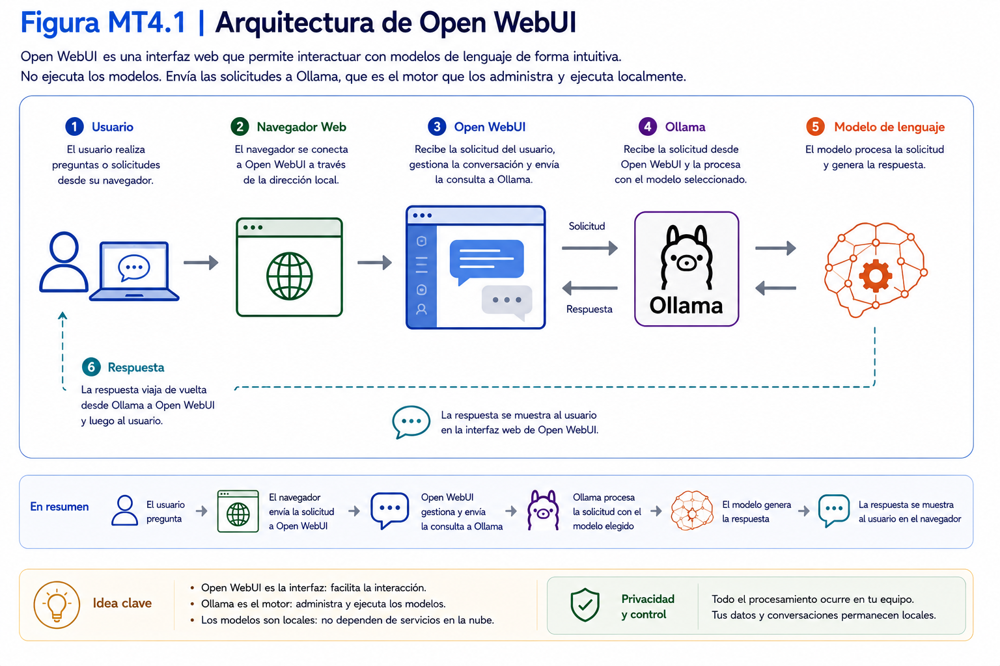
</p>

Open WebUI recibe la consulta realizada por el usuario.

Posteriormente la envía a Ollama.

Ollama procesa la solicitud utilizando el modelo seleccionado y devuelve la respuesta a Open WebUI.

Finalmente, Open WebUI presenta el resultado mediante una interfaz gráfica.

---

## ¿Qué ventajas ofrece Open WebUI?

Entre sus principales características destacan:

- interfaz gráfica intuitiva;
- acceso desde el navegador web;
- administración de conversaciones;
- selección sencilla de modelos;
- creación de asistentes personalizados;
- configuración de parámetros sin utilizar comandos;
- historial de conversaciones.

Durante este taller Open WebUI será la herramienta utilizada para interactuar con los modelos de lenguaje.

---

## ¿Necesito seguir utilizando PowerShell?

Sí.

PowerShell continuará utilizándose para tareas administrativas como:

- descargar modelos;
- eliminar modelos;
- consultar versiones;
- ejecutar comandos de mantenimiento.

Sin embargo, para conversar con los modelos y construir asistentes inteligentes trabajaremos principalmente desde Open WebUI.

---

## ¿Open WebUI necesita Internet?

No necesariamente.

Una vez instalado y configurado, Open WebUI puede utilizar los modelos locales administrados por Ollama sin necesidad de conexión a Internet.

La conexión a Internet será necesaria durante la instalación, para descargar nuevos modelos o cuando se utilicen funcionalidades que dependan de servicios externos.

---

### Verificación

Responda las siguientes preguntas.

| Pregunta | Sí | No |
|----------|:--:|:--:|
| Comprendo la función de Open WebUI. | ☐ | ☐ |
| Comprendo que Open WebUI utiliza Ollama para generar respuestas. | ☐ | ☐ |
| Comprendo que seguiré utilizando PowerShell para tareas administrativas. | ☐ | ☐ |
| Comprendo que Open WebUI funciona como una interfaz gráfica. | ☐ | ☐ |

---

### Problemas frecuentes

#### Pensé que Open WebUI reemplazaba a Ollama.

No.

En la arquitectura utilizada durante este taller, Open WebUI se conecta con Ollama, que será el componente encargado de ejecutar los modelos de lenguaje locales.

---

#### ¿Puedo utilizar Open WebUI sin modelos instalados?

No.

Primero deberá disponer de al menos un modelo descargado mediante Ollama.

---

#### ¿Necesito aprender comandos para utilizar Open WebUI?

No.

La mayoría de las funciones estarán disponibles mediante la interfaz gráfica.

---

### Buenas prácticas

- Mantenga Ollama funcionando antes de iniciar Open WebUI.
- Utilice Open WebUI para las conversaciones y PowerShell para la administración.
- No modifique configuraciones avanzadas sin conocer su propósito.
- Mantenga actualizado tanto Ollama como Open WebUI.

---

### Checklist

Antes de continuar confirme que:

☐ Comprende qué es Open WebUI.

☐ Comprende cómo interactúa con Ollama.

☐ Comprende cuándo utilizar PowerShell y cuándo utilizar Open WebUI.

☐ Está preparado para descargar Open WebUI.


---

## 4.2 Instalación de Python

### Objetivo

Verificar la instalación de Python y, si es necesario, instalar una versión compatible con Open WebUI.

---

### Tiempo estimado

**15 minutos**

---

### Requisitos previos

Antes de comenzar esta sección deberá haber completado:

- Sección 4.1 – ¿Qué es Open WebUI?

Además, deberá disponer de conexión a Internet.

---

### Procedimiento

Open WebUI requiere Python para funcionar.

Antes de instalar Open WebUI verificará si Python ya se encuentra instalado en el computador.

Si dispone de una versión compatible podrá continuar directamente con la siguiente sección.

En caso contrario, realizará la instalación correspondiente.

---

## Paso 1. Abrir Windows PowerShell

Abra una nueva ventana de Windows PowerShell.

---

## Paso 2. Verificar Python

Verifique que Python se encuentre instalado y que la versión corresponda a una de las versiones compatibles definidas para el taller.

Ejecute el siguiente comando.

**Comando**

```powershell
PS C:\Users\Usuario> python --version
```

**Salida esperada:**

```
Python 3.12.x
```


Si obtiene un resultado similar, continúe con la siguiente sección.

---

## Paso 3. Python no está instalado

Si aparece un mensaje indicando que Python no fue encontrado, deberá instalarlo.

Abra su navegador.

Acceda al sitio oficial de Python.

> **Información técnica**

Para conocer las versiones oficiales del software utilizadas en esta colección, consulte el **Capítulo 7 – Versiones de software utilizadas del Manual de Referencia Técnica**.

<p align="center">
  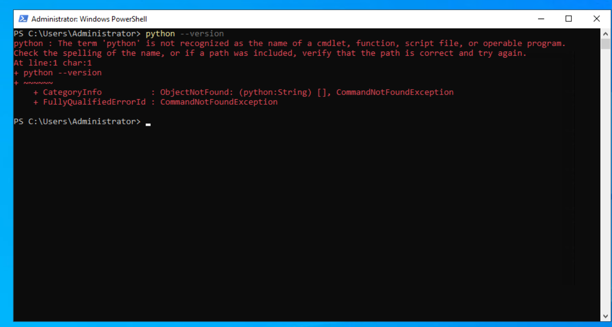
</p>
---

## Paso 4. Descargar Python (3.12.9)

Descargue la versión recomendada para Windows.
https://www.python.org/downloads/windows/

Evite utilizar versiones preliminares o experimentales.

<p align="center">
  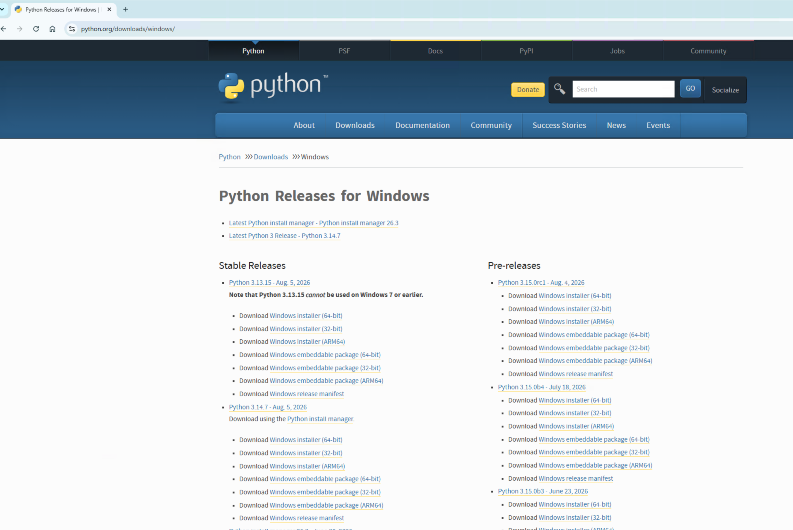
</p>
---

## Paso 5. Ejecutar el instalador

Inicie el proceso de instalación.

Durante el asistente active la opción:

```
Add Python to PATH
```

Esta opción permitirá utilizar Python desde PowerShell.

<p align="center">
  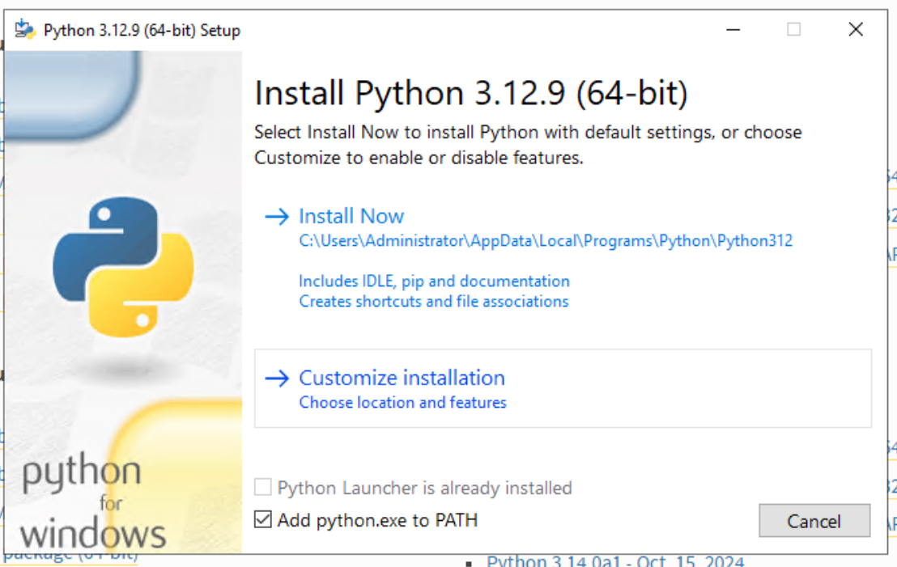
</p>
---

## Paso 6. Finalizar la instalación

Espere a que el asistente finalice.

Una vez completado, cierre el instalador.

---

## Paso 7. Verificar nuevamente

Abra una nueva ventana de PowerShell.

Ejecute:

**Comando**

```powershell
PS C:\Users\Usuario> python --version
```

Verifique que Python responde correctamente.

<p align="center">
  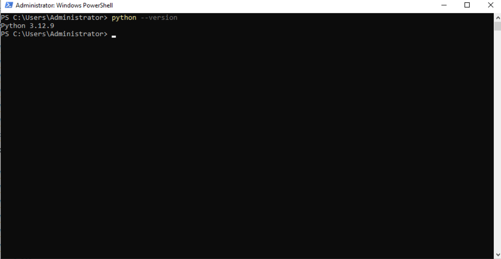
</p>
---

### Verificación

| Verificación | Estado |
|--------------|:------:|
| Python responde desde PowerShell | ☐ |
| La versión es compatible | ☐ |
| PATH quedó configurado | ☐ |
| El entorno está preparado | ☐ |
<p align="center">
  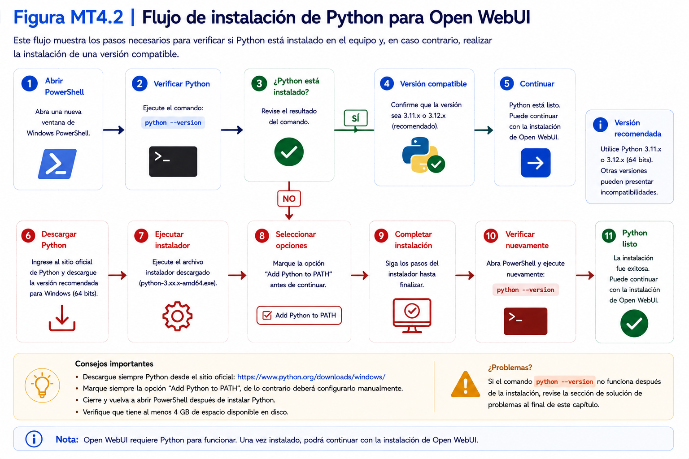
</p>
---

### Problemas frecuentes

#### El comando `python` no existe.

Compruebe que durante la instalación activó la opción **Add Python to PATH**.

---

#### Tengo instalada otra versión.

Mientras sea una versión compatible con Open WebUI, podrá utilizarla.

> En caso de duda, consulte el **Capítulo 7 – Versiones de software utilizadas del Manual de Referencia Técnica**, donde se documentan las versiones recomendadas para esta colección.

---

#### PowerShell sigue mostrando error.

Cierre todas las ventanas de PowerShell y vuelva a abrir una nueva sesión.

---

### Buenas prácticas

- Instale únicamente versiones estables.
- Descargue Python desde el sitio oficial.
- Active siempre la opción **Add Python to PATH**.
- Verifique la instalación antes de continuar.

---

### Checklist

Antes de continuar confirme que:

☐ Python está instalado.

☐ PowerShell reconoce el comando `python`.

☐ La versión instalada es compatible.

☐ Está preparado para instalar Open WebUI.

---

## 4.3 Instalación de Open WebUI

### Objetivo

Instalar Open WebUI utilizando Python y verificar que la instalación finalizó correctamente.

---

### Tiempo estimado

**15 minutos**

---

### Requisitos previos

Antes de comenzar esta sección deberá haber completado:

- Sección 4.2 – Instalación de Python.

Además, deberá disponer de:

- Python correctamente instalado.
- Conexión a Internet.
- Ollama instalado.

---

### Procedimiento

Open WebUI puede instalarse utilizando el administrador de paquetes de Python (**pip**).

Este método permite descargar e instalar los componentes necesarios para ejecutar Open WebUI. Posteriormente se realizará la configuración inicial de la aplicación y se verificará su comunicación con Ollama.

---

## Paso 1. Abrir Windows PowerShell

Abra una nueva ventana de **Windows PowerShell**.

---

## Paso 2. Verificar pip

Ejecute el siguiente comando.

**Comando**

```powershell
PS C:\Users\Usuario> pip --version
```

**Salida esperada**

```text
pip xx.x.x from ...
```

Si obtiene una respuesta similar, puede continuar.

<p align="center">
  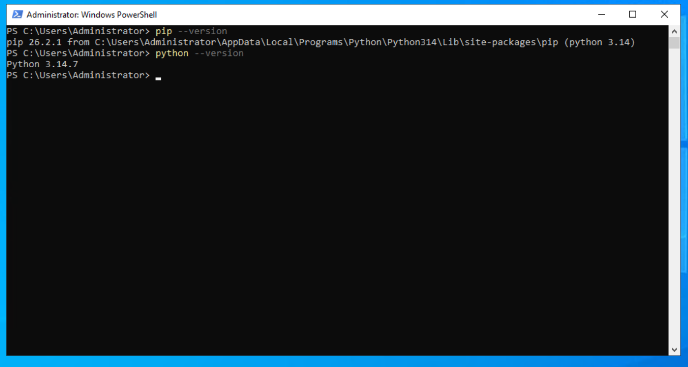
</p>
---

## Paso 3. Instalar Open WebUI

Ejecute el siguiente comando.

**Comando**

```powershell
PS C:\Users\Usuario> pip install open-webui
```

Durante la instalación observará el progreso de descarga e instalación de los distintos paquetes.

<p align="center">
  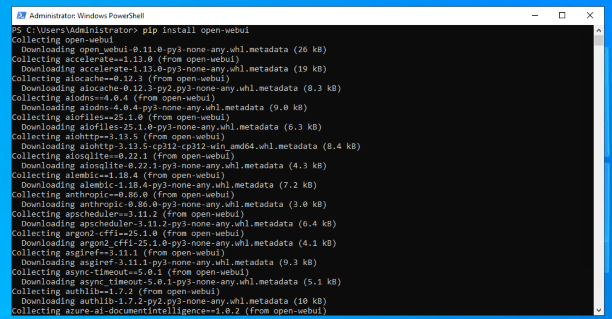
</p>
---

## Paso 4. Esperar la instalación

Dependiendo de la velocidad de Internet, la instalación puede tardar varios minutos.

No cierre la ventana de PowerShell durante este proceso.

Cuando la instalación finalice correctamente aparecerá un mensaje similar a:

**Salida esperada**

```text
Successfully installed ...
```
<p align="center">
  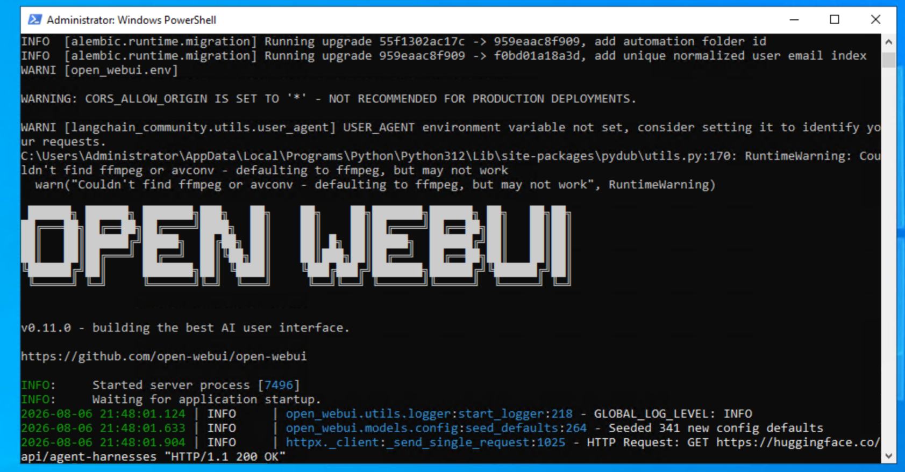
</p>
---

## Paso 5. Verificar la instalación

Ejecute el siguiente comando.

**Comando**

```powershell
PS C:\Users\Usuario> open-webui --help
```

**Salida esperada**

Se mostrará la ayuda correspondiente a Open WebUI.

Si observa la lista de comandos disponibles, la instalación fue exitosa.
<p align="center">
  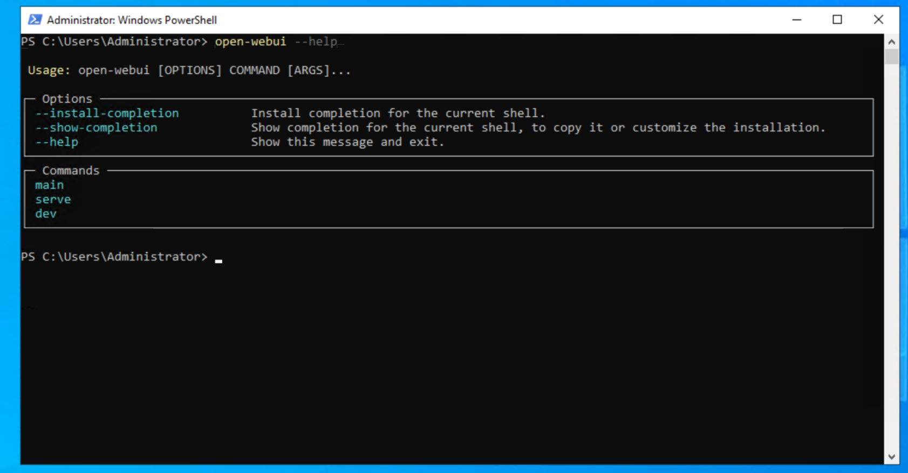
</p>
---

## Paso 6. Confirmar el entorno

No es necesario realizar configuraciones adicionales.

Open WebUI ya se encuentra instalado y listo para ejecutarse.

La primera ejecución será realizada en la siguiente sección.

---

### Verificación

Complete la siguiente tabla.

| Verificación | Estado |
|--------------|:------:|
| `pip` funciona correctamente | ☐ |
| Open WebUI se instaló sin errores | ☐ |
| El comando `open-webui --help` responde correctamente | ☐ |
| El entorno quedó preparado para la primera ejecución | ☐ |

---

### Problemas frecuentes

#### El comando `pip` no existe.

Compruebe que Python fue instalado correctamente y que la opción **Add Python to PATH** fue activada durante la instalación.

---

#### Aparece un mensaje indicando permisos insuficientes.

Cierre PowerShell.

Ábralo nuevamente utilizando permisos de administrador.

Repita la instalación.

---

#### La instalación se interrumpe.

Compruebe la conexión a Internet e intente nuevamente.

En la mayoría de los casos, volver a ejecutar el comando resolverá el problema.

---

#### El comando `open-webui` no es reconocido.

Abra una nueva ventana de PowerShell y vuelva a ejecutar el comando.

Si el problema continúa, verifique que la instalación finalizó correctamente.

---

### Buenas prácticas

- Mantenga actualizado Python.
- Utilice únicamente el comando oficial de instalación.
- No interrumpa la instalación mientras se descargan los paquetes.
- Verifique siempre la instalación antes de continuar.

---

### Checklist

Antes de continuar confirme que:

☐ Open WebUI está instalado.

☐ El comando `open-webui` funciona correctamente.

☐ No se produjeron errores durante la instalación.

☐ Está preparado para ejecutar Open WebUI por primera vez.

---

## 4.4 Primera ejecución

### Objetivo

Iniciar Open WebUI por primera vez, verificar que el servidor funciona correctamente y acceder a la interfaz web desde el navegador.

---

### Tiempo estimado

**10 minutos**

---

### Requisitos previos

Antes de comenzar esta sección deberá haber completado:

- Sección 4.2 – Instalación de Python.
- Sección 4.3 – Instalación de Open WebUI.

Además, deberá disponer de:

- Ollama instalado.
- Al menos un modelo de lenguaje descargado.

---

### Procedimiento

Una vez instalado Open WebUI, el siguiente paso consiste en iniciar el servidor local.

Durante esta primera ejecución la aplicación preparará automáticamente el entorno necesario para su funcionamiento.

---

## Paso 1. Abrir Windows PowerShell

Abra una nueva ventana de **Windows PowerShell**.

---

## Paso 2. Iniciar Open WebUI

Ejecute el siguiente comando.

**Comando**

```powershell
PS C:\Users\Usuario> open-webui serve
```

<p align="center">
  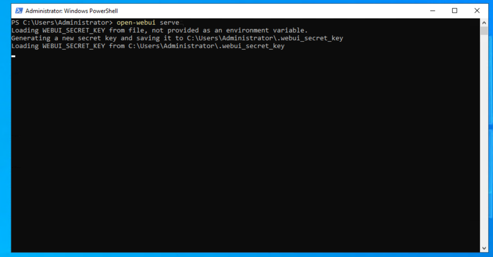
</p>
---

### Salida esperada

Durante los primeros segundos Open WebUI iniciará los servicios necesarios.

Posteriormente aparecerá un mensaje similar al siguiente.

```text
Uvicorn running on

http://127.0.0.1:8080

Press CTRL+C to quit
```

---

## Paso 3. Abrir el navegador

Abra su navegador web preferido.

Ingrese la siguiente dirección.

```text
http://localhost:8080
```

También puede utilizar:

```text
http://127.0.0.1:8080
```

Ambas direcciones corresponden al mismo servidor local.

<p align="center">
  
</p>
---

## Paso 4. Verificar la página inicial

Si todo funciona correctamente observará la pantalla de bienvenida de Open WebUI.

Como es la primera ejecución, todavía no existen usuarios registrados.


---

## Paso 5. Mantener PowerShell abierto

Mientras utilice Open WebUI **no cierre la ventana de PowerShell**.

Esa ventana mantiene funcionando el servidor.

Si la cierra, Open WebUI dejará de estar disponible.

---

## Paso 6. Finalizar la ejecución

Cuando termine de trabajar podrá detener el servidor.

En PowerShell presione:

```text
CTRL + C
```

Posteriormente confirme la detención cuando PowerShell lo solicite.

---

### Verificación

Complete la siguiente tabla.

| Verificación | Estado |
|--------------|:------:|
| Open WebUI inició correctamente | ☐ |
| PowerShell muestra el servidor activo | ☐ |
| El navegador abre la página inicial | ☐ |
| Comprendo cómo detener el servidor | ☐ |

---

### Problemas frecuentes

#### El navegador indica que no puede conectarse.

Compruebe que PowerShell continúa ejecutando Open WebUI.

---

#### Cerré accidentalmente PowerShell.

Simplemente vuelva a ejecutar:

```powershell
open-webui serve
```

---

#### El puerto 8080 está ocupado.

Es posible que otra aplicación esté utilizando ese puerto.

Cierre dicha aplicación o configure Open WebUI para utilizar otro puerto.

---

#### La página aparece en blanco.

Actualice el navegador utilizando la tecla **F5**.

Si el problema continúa, reinicie Open WebUI.

---

### Buenas prácticas

- Mantenga PowerShell abierto mientras utilice Open WebUI.
- No cierre el servidor desde el Administrador de tareas.
- Utilice siempre el navegador para interactuar con los modelos.
- Detenga el servidor correctamente cuando finalice la sesión.

---

### Checklist

Antes de continuar confirme que:

☐ Open WebUI inicia correctamente.

☐ Puede acceder mediante el navegador.

☐ Comprende cómo detener el servidor.

☐ Está preparado para crear el primer usuario administrador.

---

## 4.5 Creación del usuario administrador

### Objetivo

Crear el primer usuario administrador de Open WebUI y acceder al entorno de trabajo por primera vez.

---

### Tiempo estimado

**10 minutos**

---

### Requisitos previos

Antes de comenzar esta sección deberá haber completado:

- Sección 4.4 – Primera ejecución.

Además, Open WebUI debe encontrarse ejecutándose correctamente.

---

### Procedimiento

La primera vez que se inicia Open WebUI no existen usuarios registrados.

Por este motivo, la aplicación solicitará crear una cuenta de administrador.

Este usuario administrará posteriormente la configuración del sistema y podrá crear asistentes inteligentes.

---

## Paso 1. Acceder a Open WebUI

Abra su navegador web.

Ingrese la dirección:

```text
http://localhost:8080
```

Deberá visualizar la pantalla de creación del primer usuario.

<p align="center">
  
</p>

---

## Paso 2. Completar los datos solicitados

Ingrese la información requerida.

Generalmente se solicitarán los siguientes campos.

| Campo | Descripción |
|---------|-------------|
| Nombre | Nombre del usuario |
| Correo electrónico | Dirección de correo válida |
| Contraseña | Contraseña para acceder al sistema |
| Confirmación | Confirmación de la contraseña |

Complete todos los campos.

---

## Paso 3. Crear la cuenta

Seleccione el botón correspondiente para crear el usuario.

Open WebUI registrará automáticamente esta cuenta como administrador del sistema.

<p align="center">
  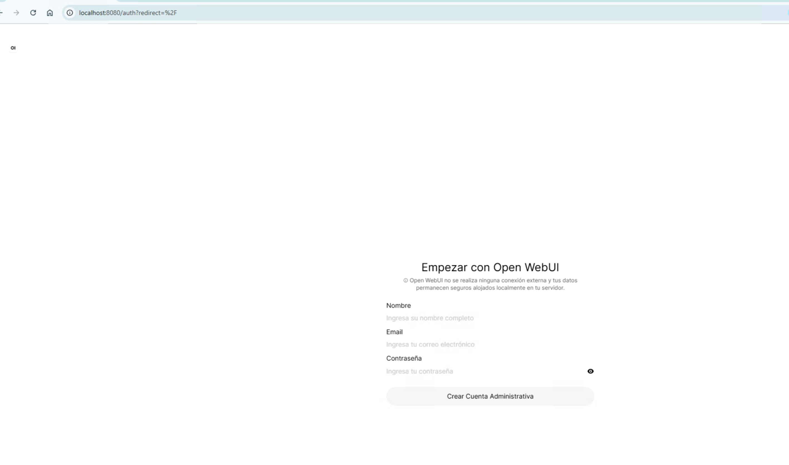
</p>

---

## Paso 4. Iniciar sesión

Si el sistema lo solicita, ingrese nuevamente utilizando:

- correo electrónico;
- contraseña.

Al autenticarse accederá al panel principal de Open WebUI.


---

## Paso 5. Verificar el entorno

Compruebe que puede visualizar correctamente:

- menú lateral;
- área principal de conversación;
- selector de modelos (si corresponde);
- menú del usuario.

No es necesario modificar ninguna configuración en este momento.

---

### Verificación

Complete la siguiente tabla.

| Verificación | Estado |
|--------------|:------:|
| Se creó correctamente el usuario administrador | ☐ |
| Fue posible iniciar sesión | ☐ |
| Se visualiza el panel principal | ☐ |
| El entorno quedó disponible para comenzar a trabajar | ☐ |

---

### Problemas frecuentes

#### No aparece el formulario de creación.

Es posible que ya exista un usuario registrado.

Intente acceder utilizando las credenciales existentes.

---

#### Olvidé la contraseña.

Durante este taller se recomienda registrar la contraseña en un lugar seguro.

Si es necesario, consulte la documentación oficial para restablecer el acceso.

---

#### La página no carga correctamente.

Verifique que Open WebUI continúa ejecutándose en PowerShell.

Actualice la página utilizando **F5**.

---

#### Se produjo un error al crear la cuenta.

Compruebe que todos los campos fueron completados correctamente.

Si el problema continúa, reinicie Open WebUI e intente nuevamente.

---

### Buenas prácticas

- Utilice una contraseña segura.
- Conserve las credenciales en un lugar protegido.
- Cree únicamente un usuario administrador durante la instalación inicial.
- No comparta las credenciales de administración.

---

### Checklist

Antes de continuar confirme que:

☐ El usuario administrador fue creado correctamente.

☐ Puede iniciar sesión.

☐ Accede al panel principal de Open WebUI.

☐ Está preparado para conectar Open WebUI con Ollama.

---

## 4.6 Conexión con Ollama

### Objetivo

Verificar que Open WebUI puede comunicarse correctamente con Ollama y reconocer los modelos de lenguaje instalados en el computador.

---

### Tiempo estimado

**10 minutos**

---

### Requisitos previos

Antes de comenzar esta sección deberá haber completado:

- Sección 4.4 – Primera ejecución.
- Sección 4.5 – Creación del usuario administrador.

Además:

- Ollama debe estar instalado.
- Open WebUI debe encontrarse ejecutándose.
- Debe existir al menos un modelo descargado mediante Ollama.

---

### Procedimiento

Open WebUI no ejecuta modelos de lenguaje por sí mismo.

Para generar respuestas necesita conectarse con Ollama.

En esta sección verificará que dicha comunicación funciona correctamente.

---

## Paso 1. Confirmar que Ollama está funcionando

Abra una nueva ventana de Windows PowerShell.

Ejecute el siguiente comando.

**Comando**

```powershell
PS C:\Users\Usuario> ollama list
```

**Salida esperada**

```text
NAME           ID          SIZE
modelo         xxxxxx      xx GB
```

Si aparece al menos un modelo instalado, Ollama está funcionando correctamente.


---

## Paso 2. Abrir Open WebUI

En el navegador acceda a:

```text
http://localhost:8080
```

Inicie sesión utilizando el usuario administrador creado anteriormente.

---

## Paso 3. Verificar la disponibilidad de modelos

Una vez dentro de Open WebUI, ubique el selector de modelos.

Compruebe que el modelo instalado aparece disponible para ser utilizado.

<p align="center">
  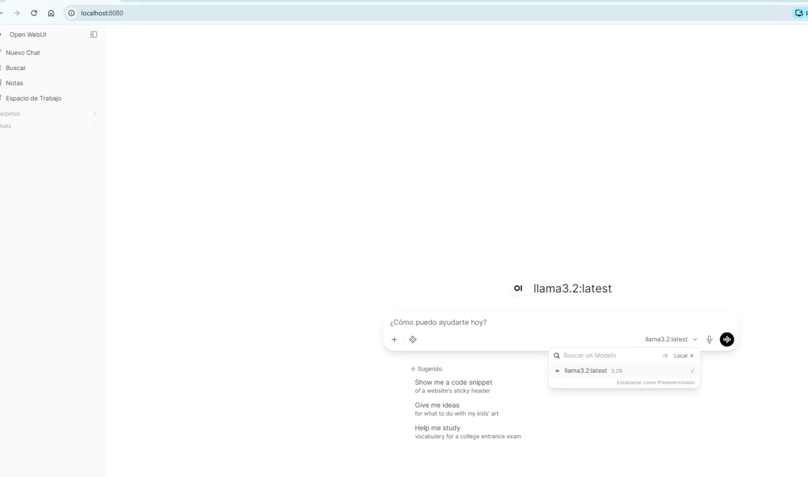
</p>

---

## Paso 4. Seleccionar un modelo

Seleccione el modelo recomendado para el desarrollo del taller.

No modifique otros parámetros de configuración.

---

## Paso 5. Confirmar la conexión

Observe que el modelo permanece disponible y puede seleccionarse sin generar mensajes de error.

Esto indica que Open WebUI logró comunicarse correctamente con Ollama.

---

💡 **Nota técnica 4.1**

Open WebUI consulta automáticamente los modelos administrados por Ollama.

Cada vez que descargue un nuevo modelo mediante el comando:

```powershell
ollama pull nombre-del-modelo
```

éste podrá estar disponible en Open WebUI sin necesidad de reinstalar la aplicación.

En algunos casos bastará con actualizar la página del navegador.

---

### Verificación

Complete la siguiente tabla.

| Verificación | Estado |
|--------------|:------:|
| Ollama responde correctamente | ☐ |
| Open WebUI inicia sin errores | ☐ |
| El modelo aparece en el selector | ☐ |
| Fue posible seleccionar un modelo | ☐ |

---

### Problemas frecuentes

#### No aparece ningún modelo en Open WebUI.

Compruebe que existe al menos un modelo instalado.

Ejecute:

```powershell
PS C:\Users\Usuario> ollama list
```

---

#### Open WebUI no detecta Ollama.

Verifique que Ollama se encuentra ejecutándose correctamente.

Si es necesario, reinicie Open WebUI.

---

#### Descargué un modelo nuevo y no aparece.

Actualice la página del navegador.

Si continúa sin aparecer, reinicie Open WebUI.

---

#### Aparece un mensaje indicando que no puede conectarse al servidor.

Compruebe que Ollama continúa funcionando y que Open WebUI permanece iniciado en PowerShell.

---

### Buenas prácticas

- Descargue nuevos modelos utilizando Ollama.
- Verifique los modelos mediante `ollama list`.
- Reinicie Open WebUI únicamente cuando sea necesario.
- Mantenga ambos programas actualizados.

---

### Checklist

Antes de continuar confirme que:

☐ Open WebUI detecta Ollama.

☐ El modelo aparece disponible.

☐ Fue posible seleccionar un modelo.

☐ Está preparado para iniciar la primera conversación.

---

## 4.7 Primera conversación

### Objetivo

Realizar la primera conversación con un modelo de lenguaje utilizando Open WebUI y verificar que el entorno funciona correctamente.

---

### Tiempo estimado

**10 minutos**

---

### Requisitos previos

Antes de comenzar esta sección deberá haber completado:

- Sección 4.6 – Conexión con Ollama.

Además:

- Open WebUI debe encontrarse ejecutándose.
- Debe existir al menos un modelo disponible.

---

### Procedimiento

Una vez establecida la comunicación entre Open WebUI y Ollama, podrá comenzar a interactuar con el modelo mediante una conversación.

En esta sección realizará una prueba sencilla para comprobar que todo el entorno funciona correctamente.

---

## Paso 1. Abrir Open WebUI

Acceda mediante el navegador a:

```text
http://localhost:8080
```

Inicie sesión si aún no lo ha hecho.

---

## Paso 2. Seleccionar un modelo

En la parte superior de la interfaz seleccione el modelo que utilizará durante la conversación.


---

## Paso 3. Crear una nueva conversación

Seleccione la opción:

**Nuevo chat**

Se abrirá una conversación vacía.


---

## Paso 4. Escribir el primer mensaje

Ingrese el siguiente texto.

```text
Hola.

Preséntate en tres líneas e indica cuáles son tus principales capacidades.
```

Presione **Enter** o seleccione el botón de envío.

---

## Paso 5. Esperar la respuesta

Después de algunos segundos el modelo responderá.

El tiempo dependerá de:

- tamaño del modelo;
- memoria disponible;
- capacidad del procesador.

<p align="center">
  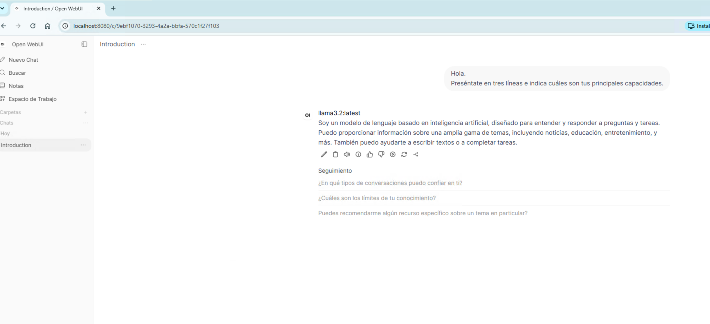
</p>

---

## Paso 6. Continuar la conversación

Realice una segunda consulta.

Por ejemplo.

```text
¿En qué tareas podrías ayudarme durante este taller?
```

Observe que el modelo mantiene el contexto de la conversación anterior.

---

## Paso 7. Finalizar la prueba

Si ambas respuestas fueron generadas correctamente, la instalación y configuración del entorno puede considerarse exitosa.

---

💡 **Nota técnica 4.2**

Cada conversación mantiene un contexto independiente.

Esto significa que el modelo recuerda los mensajes enviados dentro del mismo chat, pero no necesariamente la información de otras conversaciones.

---

### Verificación

Complete la siguiente tabla.

| Verificación | Estado |
|--------------|:------:|
| Fue posible crear una conversación | ☐ |
| El modelo respondió correctamente | ☐ |
| Se realizó una segunda consulta | ☐ |
| El modelo mantuvo el contexto de la conversación | ☐ |

---

### Problemas frecuentes

#### El modelo tarda mucho en responder.

Esto depende del tamaño del modelo y de la capacidad del computador.

Espere algunos segundos adicionales.

---

#### La conversación queda en blanco.

Actualice la página.

Si el problema continúa, verifique que Ollama sigue funcionando correctamente.

---

#### El modelo responde con un mensaje de error.

Compruebe que el modelo seleccionado continúa instalado.

Puede verificarlo mediante:

```powershell
PS C:\Users\Usuario> ollama list
```

---

#### La respuesta aparece incompleta.

Envíe nuevamente la consulta o cree una nueva conversación.

---

### Buenas prácticas

- Utilice una conversación distinta para cada proyecto.
- Formule instrucciones claras y específicas.
- Evite mezclar temas diferentes en un mismo chat.
- Guarde las conversaciones importantes.

---

### Checklist

Antes de continuar confirme que:

☐ Creó correctamente una conversación.

☐ El modelo respondió.

☐ Comprendió el funcionamiento del contexto.

☐ Está preparado para configurar Open WebUI.

---

## 4.8 Configuración básica

### Objetivo

Conocer las principales opciones de configuración de Open WebUI y realizar los ajustes básicos recomendados para el desarrollo del taller.

---

### Tiempo estimado

**10 minutos**

---

### Requisitos previos

Antes de comenzar esta sección deberá haber completado:

- Sección 4.7 – Primera conversación.

Además, Open WebUI debe encontrarse ejecutándose correctamente.

---

### Procedimiento

Open WebUI ofrece numerosas opciones de configuración.

Sin embargo, para el desarrollo de este taller únicamente será necesario revisar un conjunto reducido de parámetros.

Las configuraciones avanzadas serán abordadas únicamente cuando resulten necesarias.

---

## Paso 1. Acceder al menú de configuración

Desde la pantalla principal seleccione el icono correspondiente al usuario.

Posteriormente ingrese a:

**Settings** o **Configuración**, según el idioma disponible.

<p align="center">
  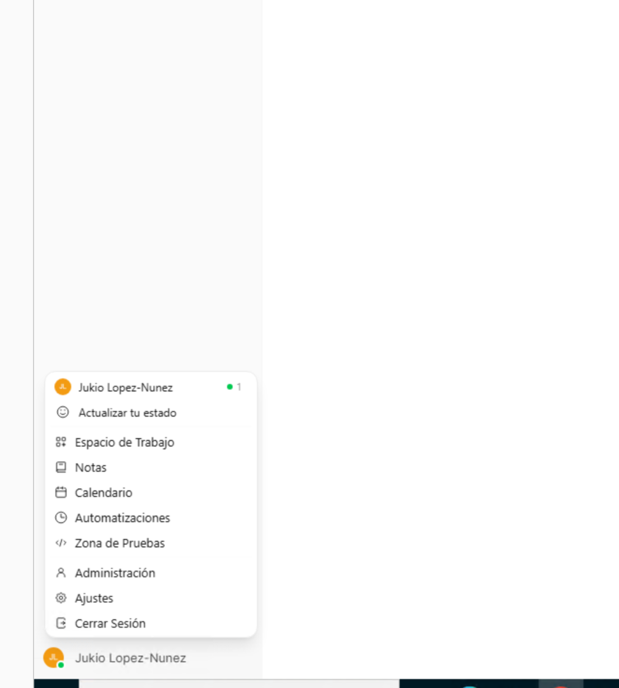
</p>

---

## Paso 2. Revisar la información general

Observe las distintas categorías disponibles.

Por ejemplo:

- Perfil.
- Apariencia.
- Modelos.
- Administración.
- Configuración general.

No modifique aún ninguna opción.

El objetivo es familiarizarse con la estructura de la aplicación.

---

## Paso 3. Configurar el idioma (si corresponde)

Si la versión instalada lo permite, seleccione el idioma con el que trabajará durante el taller.

En caso contrario, mantenga la configuración predeterminada.

---

## Paso 4. Revisar el modelo predeterminado

Acceda a la configuración de modelos.

Compruebe cuál es el modelo seleccionado por defecto.

Si dispone de varios modelos instalados, podrá cambiar el modelo predeterminado más adelante.

No es necesario modificar esta configuración en este momento.

---

## Paso 5. Revisar la configuración del usuario

Verifique que la información del usuario administrador aparece correctamente.

Compruebe especialmente:

- nombre;
- correo electrónico;
- rol de administrador.

---

## Paso 6. Guardar cambios

Si realizó alguna modificación, seleccione la opción correspondiente para guardar los cambios.

En caso contrario, simplemente cierre la ventana de configuración.

---

💡 **Nota técnica 4.3**

Open WebUI incorpora una gran cantidad de parámetros avanzados.

Durante este taller sólo utilizaremos aquellos que sean necesarios para construir y administrar asistentes inteligentes.

Modificar configuraciones desconocidas puede afectar el funcionamiento esperado del entorno.

---

### Verificación

Complete la siguiente tabla.

| Verificación | Estado |
|--------------|:------:|
| Accedí al menú de configuración | ☐ |
| Revisé las categorías disponibles | ☐ |
| Verifiqué la información del usuario | ☐ |
| Comprendí la estructura general de configuración | ☐ |

---

### Problemas frecuentes

#### No encuentro alguna opción descrita.

La interfaz puede variar ligeramente entre versiones de Open WebUI.

Localice la opción equivalente dentro del menú de configuración.

---

#### El idioma no aparece disponible.

Algunas versiones no incluyen traducción completa.

Puede continuar utilizando la interfaz en inglés.

---

#### Modifiqué una configuración por error.

Restablezca el valor original antes de continuar con el taller.

---

### Buenas prácticas

- Modifique únicamente los parámetros necesarios.
- Mantenga una configuración sencilla durante el aprendizaje.
- Explore las opciones avanzadas sólo cuando comprenda su propósito.
- Documente cualquier cambio importante realizado en la configuración.

---

### Checklist

Antes de continuar confirme que:

☐ Conoce la estructura general de configuración.

☐ Puede acceder al perfil del usuario.

☐ Comprende dónde se administran los modelos.

☐ Está preparado para administrar conversaciones.


---

## 4.9 Administración de conversaciones

### Objetivo

Aprender a organizar las conversaciones generadas en Open WebUI para mantener un entorno de trabajo ordenado y facilitar la reutilización de información durante el desarrollo de proyectos.

---

### Tiempo estimado

**10 minutos**

---

### Requisitos previos

Antes de comenzar esta sección deberá haber completado:

- Sección 4.8 – Configuración básica.

Además, deberá haber realizado al menos una conversación con un modelo de lenguaje.

---

### Procedimiento

A medida que utilice Open WebUI comenzará a generar numerosas conversaciones.

Una buena organización permitirá recuperar información rápidamente y mantener separados los distintos proyectos desarrollados durante el taller.

---

## Paso 1. Crear una nueva conversación

Desde la pantalla principal seleccione la opción correspondiente para crear un nuevo chat.

Se abrirá una conversación vacía.

---

## Paso 2. Asignar un nombre descriptivo

Después de realizar las primeras consultas, cambie el nombre de la conversación.

Utilice nombres que permitan identificar fácilmente su contenido.

Por ejemplo:

- Proyecto Integrador
- Pruebas de Prompts
- Automatización Google Forms
- Asistente Académico

Evite nombres genéricos como:

- Chat 1
- Conversación nueva
- Prueba

---

## Paso 3. Crear conversaciones independientes

Utilice una conversación distinta para cada proyecto.

Por ejemplo:

| Proyecto | Conversación |
|----------|--------------|
| Laboratorio 1 | Chat independiente |
| Laboratorio 2 | Chat independiente |
| Proyecto Integrador | Chat independiente |

Esto permitirá mantener el contexto de cada trabajo sin mezclar información.

---

## Paso 4. Buscar conversaciones

Cuando la cantidad de conversaciones aumente, utilice el buscador incorporado por Open WebUI.

Busque utilizando:

- nombre de la conversación;
- palabras clave;
- tema principal.

---

## Paso 5. Eliminar conversaciones innecesarias

Periódicamente revise las conversaciones almacenadas.

Elimine aquellas que correspondan a:

- pruebas;
- consultas temporales;
- ejercicios ya finalizados.

Conservar únicamente las conversaciones relevantes facilitará el trabajo diario.

---

## Paso 6. Mantener una estructura consistente

Se recomienda utilizar siempre una nomenclatura similar.

Ejemplo.

<p align="center">
  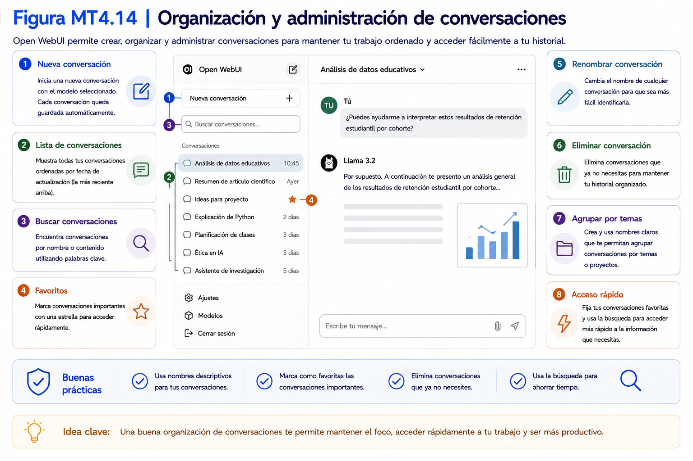
</p>

Esta práctica facilitará la localización de información durante el desarrollo del taller.

---

💡 **Nota técnica 4.4**

El contexto de una conversación permanece únicamente dentro de ese chat.

Si crea una conversación nueva, el modelo no recordará automáticamente la información intercambiada en conversaciones anteriores.

---

### Verificación

Complete la siguiente tabla.

| Verificación | Estado |
|--------------|:------:|
| Creé una nueva conversación | ☐ |
| Asigné un nombre descriptivo | ☐ |
| Comprendí cómo organizar distintos proyectos | ☐ |
| Comprendí cómo buscar conversaciones | ☐ |

---

### Problemas frecuentes

#### Todas mis conversaciones tienen el mismo nombre.

Utilice nombres descriptivos desde el inicio.

Esto facilitará enormemente la organización del trabajo.

---

#### No encuentro una conversación antigua.

Utilice la función de búsqueda disponible en Open WebUI.

---

#### Eliminé una conversación importante.

Antes de eliminar una conversación confirme que ya no será necesaria.

---

#### Mezclé distintos proyectos en un mismo chat.

Lo recomendable es crear una conversación independiente para cada proyecto relevante.

---

### Buenas prácticas

- Una conversación por proyecto.
- Utilice nombres descriptivos.
- Elimine periódicamente conversaciones innecesarias.
- Mantenga una estructura consistente de nombres.

---

### Checklist

Antes de continuar confirme que:

☐ Puede crear conversaciones.

☐ Puede organizarlas correctamente.

☐ Comprende la importancia del contexto.

☐ Está preparado para resolver problemas básicos relacionados con Open WebUI.

---

## 4.10 Solución de problemas

### Objetivo

Identificar y resolver los problemas más frecuentes relacionados con la instalación, configuración y utilización inicial de Open WebUI.

---

### Tiempo estimado

**15 minutos**

---

### Requisitos previos

Se recomienda haber completado todas las secciones anteriores del Capítulo 4.

---

### Procedimiento

La instalación de Open WebUI suele completarse sin inconvenientes.

Sin embargo, durante la configuración inicial pueden aparecer problemas asociados a Python, Ollama, la conexión entre ambos componentes o el acceso desde el navegador.

En esta sección se presentan los problemas más habituales y las acciones recomendadas para resolverlos.

---

## Problema 1. El comando `open-webui` no es reconocido

### Síntoma

Al ejecutar:

**Comando**

```powershell
PS C:\Users\Usuario> open-webui serve
```

PowerShell indica que el comando no existe.

### Posibles causas

- Open WebUI no fue instalado.
- La instalación se interrumpió.
- Python no quedó correctamente configurado.

### Solución

Verifique primero que Python responde correctamente.

```powershell
python --version
```

Luego confirme la instalación ejecutando nuevamente:

```powershell
python -m pip install open-webui
```

---

## Problema 2. La página no abre en el navegador

### Síntoma

Al ingresar a:

```text
http://localhost:8080
```

el navegador muestra un mensaje indicando que no puede establecer conexión.

### Posibles causas

- Open WebUI no está ejecutándose.
- PowerShell fue cerrado.
- El servidor terminó inesperadamente.

### Solución

Abra nuevamente PowerShell.

Ejecute:

```powershell
open-webui serve
```

Espere hasta que el servidor quede disponible.

---

## Problema 3. No aparecen modelos disponibles

### Síntoma

Open WebUI inicia correctamente, pero el selector de modelos aparece vacío.

### Posibles causas

- No existen modelos instalados.
- Ollama no está funcionando.
- Open WebUI no logra comunicarse con Ollama.

### Solución

Verifique los modelos instalados.

```powershell
ollama list
```

Si la lista aparece vacía, descargue un modelo antes de continuar.

---

## Problema 4. El modelo no responde

### Síntoma

La conversación queda esperando indefinidamente.

### Posibles causas

- El modelo está cargándose por primera vez.
- El computador dispone de pocos recursos.
- Ollama dejó de funcionar.

### Solución

Espere algunos segundos.

Si el problema continúa:

- verifique Ollama;
- reinicie Open WebUI;
- vuelva a intentar la consulta.

---

## Problema 5. Open WebUI funciona muy lentamente

### Posibles causas

- Modelo demasiado grande.
- Memoria RAM insuficiente.
- Muchas aplicaciones abiertas.

### Solución

- cierre aplicaciones innecesarias;
- utilice un modelo más pequeño;
- reinicie el computador.

---

## Problema 6. Olvidé la contraseña del administrador

### Solución

Consulte el procedimiento oficial de recuperación de acceso correspondiente a la versión de Open WebUI utilizada en el taller.

Antes de realizar cualquier acción de recuperación, evite eliminar archivos, bases de datos o configuraciones del entorno.

---
<p align="center">
  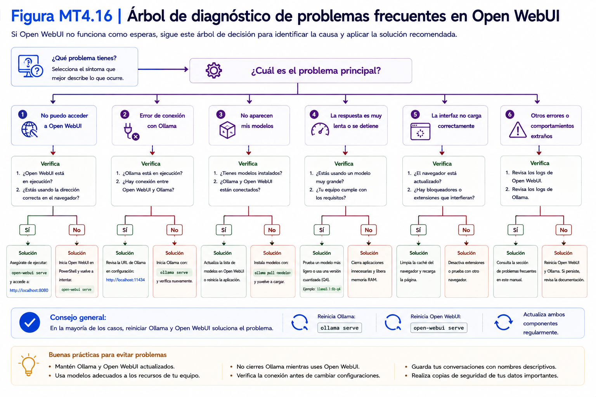
</p>
## Recomendaciones generales

Antes de reinstalar cualquier componente verifique siempre:

- Python.
- Ollama.
- Open WebUI.
- Modelos instalados.
- Conexión entre Open WebUI y Ollama.

En la mayoría de los casos el problema se encuentra en alguno de estos cinco elementos.

---

💡 **Nota técnica 4.5**

Cuando necesite diagnosticar un problema, siga este orden:

1. Python.
2. Ollama.
3. Modelos instalados.
4. Open WebUI.
5. Navegador.

Realizar el diagnóstico de forma ordenada permite identificar el origen del problema con mayor rapidez.

---

### Verificación

Complete la siguiente tabla.

| Pregunta | Sí | No |
|----------|:--:|:--:|
| Sé verificar que Open WebUI está funcionando. | ☐ | ☐ |
| Sé comprobar que Ollama responde correctamente. | ☐ | ☐ |
| Sé verificar los modelos instalados. | ☐ | ☐ |
| Sé dónde comenzar un diagnóstico. | ☐ | ☐ |

---

### Problemas frecuentes

En esta sección se abordaron los problemas más comunes durante la instalación y configuración inicial.

Para ampliar el diagnóstico de incidencias, consulte el **Capítulo 4 – Solución de problemas (Troubleshooting) del Manual de Referencia Técnica**, donde encontrará una matriz ampliada de solución de problemas y procedimientos de diagnóstico.

---

### Buenas prácticas

- Diagnostique antes de reinstalar.
- Verifique cada componente por separado.
- Mantenga actualizado el entorno.
- Documente los errores recurrentes y su solución.

---

### Checklist

Antes de finalizar el capítulo confirme que:

☐ Python funciona correctamente.

☐ Open WebUI inicia sin errores.

☐ Ollama responde correctamente.

☐ Los modelos aparecen disponibles.

☐ Puede iniciar conversaciones con el modelo.

☐ Conoce las acciones básicas de diagnóstico.

---

# Resumen del capítulo

En este capítulo usted:

✔ Comprendió el papel de Open WebUI dentro del entorno de IA local.

✔ Instaló Python y verificó su funcionamiento.

✔ Instaló Open WebUI mediante Python.

✔ Ejecutó Open WebUI por primera vez.

✔ Creó el usuario administrador.

✔ Conectó Open WebUI con Ollama.

✔ Realizó su primera conversación con un modelo de lenguaje.

✔ Conoció la configuración básica del sistema.

✔ Aprendió a organizar sus conversaciones.

✔ Incorporó un procedimiento sistemático para resolver problemas frecuentes.

Con estas actividades el entorno de Inteligencia Artificial local quedó completamente operativo y preparado para comenzar el diseño de asistentes inteligentes.


---

## Próximo capítulo

En el **Capítulo 5 – Diseño de asistentes inteligentes** comenzará la construcción del asistente que acompañará todo el resto del taller. Aprenderá a definir su propósito, alcance, comportamiento y restricciones mediante un *System Prompt*, que posteriormente será validado, optimizado e integrado con herramientas de productividad.

---

# Fin del Capítulo 4

**Capítulo siguiente: Diseño de asistentes inteligentes**
