# Parte II

# Diseño e implementación de asistentes inteligentes

---

# Capítulo 5

# Diseño de asistentes inteligentes

## 5.1 ¿Qué es un asistente inteligente?

### Objetivo

Comprender qué es un asistente inteligente y reconocer los elementos que lo diferencian de una conversación tradicional con un modelo de lenguaje.

<p align="center">
  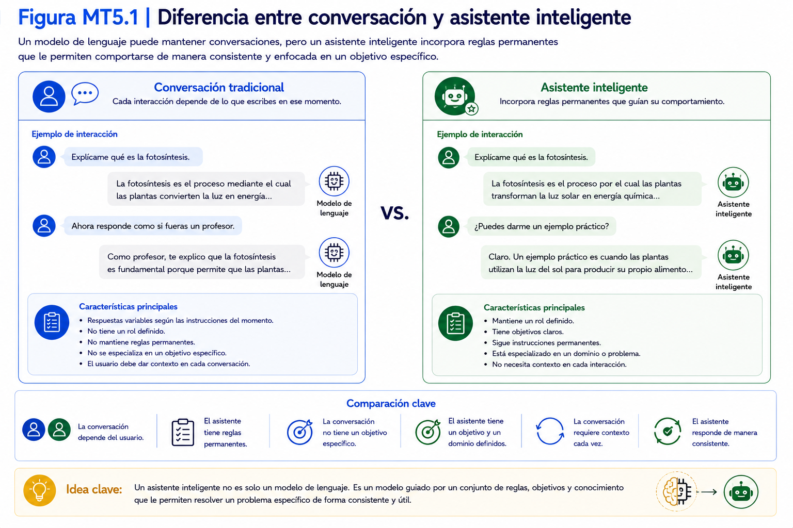
</p>
---

### Tiempo estimado

**10 minutos**

---

### Requisitos previos

Antes de comenzar esta sección deberá haber completado los cuatro capítulos anteriores.

Además, Open WebUI deberá encontrarse funcionando correctamente.

---

### Procedimiento

Hasta este momento ha utilizado un modelo de lenguaje para responder preguntas y mantener conversaciones.

Sin embargo, un modelo de lenguaje por sí solo no constituye un asistente inteligente.

Un asistente inteligente corresponde a la combinación de varios elementos que permiten resolver un problema específico de forma consistente.

En este taller construiremos un asistente que evolucionará progresivamente hasta convertirse en un prototipo funcional integrado con herramientas de productividad.

---

## ¿Qué diferencia existe entre una conversación y un asistente?

Cuando realiza una consulta directamente al modelo, cada conversación depende principalmente de las instrucciones escritas por el usuario.

Un asistente inteligente incorpora, además, un conjunto de instrucciones que orientan su comportamiento mientras se encuentran configuradas.

Estas reglas permiten que el asistente:

- adopte un rol específico;
- responda de manera consistente;
- mantenga un estilo definido;
- respete determinadas restricciones;
- se enfoque en un dominio concreto.

<p align="center">
  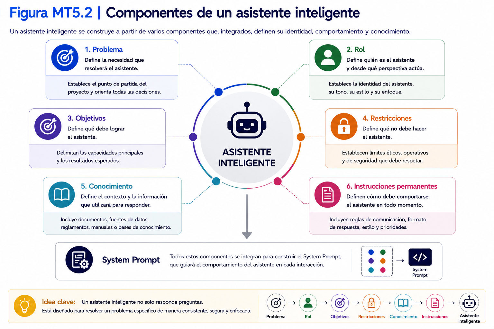
</p>
---

## Componentes de un asistente inteligente

Durante este taller construiremos un asistente utilizando los siguientes componentes.

| Componente                | Función |
| ------------------------- | ----------------------------------------------- |
| Problema                  | Define la necesidad que resolverá el asistente. |
| Rol                       | Define quién es el asistente. |
| Objetivos                 | Define qué debe hacer. |
| Restricciones             | Define qué no debe hacer. |
| Conocimiento              | Define el contexto con el que responderá. |
| Instrucciones del sistema | Definen el comportamiento esperado. |

Todos estos elementos darán origen al **System Prompt**, que será desarrollado en las siguientes secciones.

---

## El Proyecto Integrador

A partir de este capítulo comenzará el desarrollo técnico del asistente correspondiente al Proyecto Integrador.

Cada nuevo capítulo agregará capacidades al mismo asistente inteligente.

Al finalizar el taller dispondrá de un prototipo funcional, validado e integrado con herramientas de productividad.
<p align="center">
  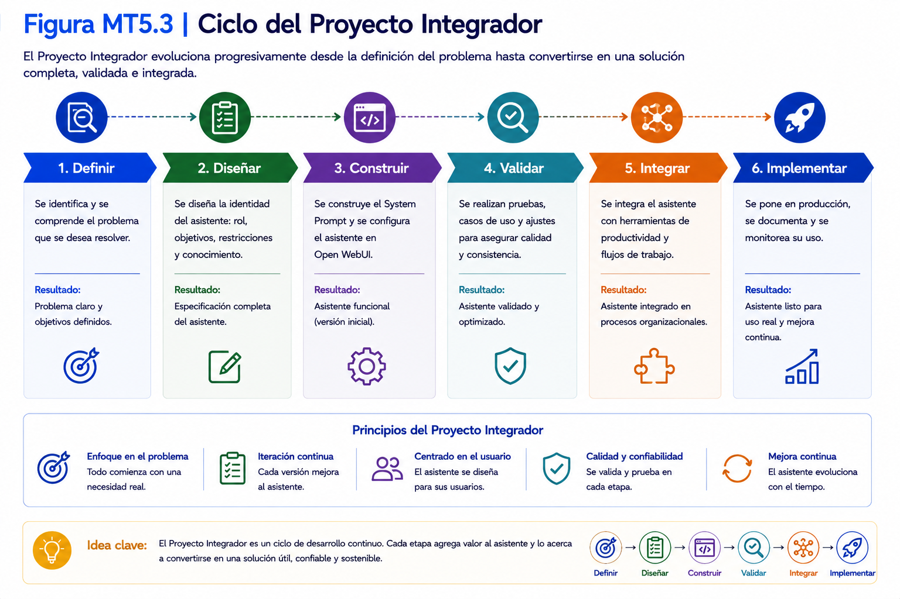
</p>
---

💡 **Nota técnica 5.1**

Durante este taller el objetivo no será aprender a escribir prompts aislados.

El objetivo será diseñar un asistente inteligente reutilizable, documentado y preparado para integrarse en procesos organizacionales.

---

### Verificación

| Pregunta                                                                                                            | Sí | No |
| ------------------------------------------------------------------------------------------------------------------- | :-: | :-: |
| Comprendo qué es un asistente inteligente.                                                                          | ☐ | ☐ |
| Comprendo la diferencia entre conversar y diseñar un asistente.                                                     | ☐ | ☐ |
| Comprendo que en este capítulo comienza el desarrollo técnico del asistente correspondiente al Proyecto Integrador. | ☐ | ☐ |

---

## 5.2 Definición del problema

### Objetivo

Definir claramente el problema que resolverá el asistente inteligente, identificar a sus usuarios y establecer el alcance funcional del proyecto.

---

### Tiempo estimado

**20 minutos**

---

### Requisitos previos

Antes de comenzar esta sección deberá haber completado:

- Sección 5.1 – ¿Qué es un asistente inteligente?

---

### Procedimiento

Todo asistente inteligente nace para resolver un problema.

Antes de escribir instrucciones, seleccionar modelos o construir automatizaciones, es indispensable comprender cuál es la necesidad que se desea resolver.

Un problema bien definido facilitará todas las etapas posteriores del proyecto.

<p align="center">
  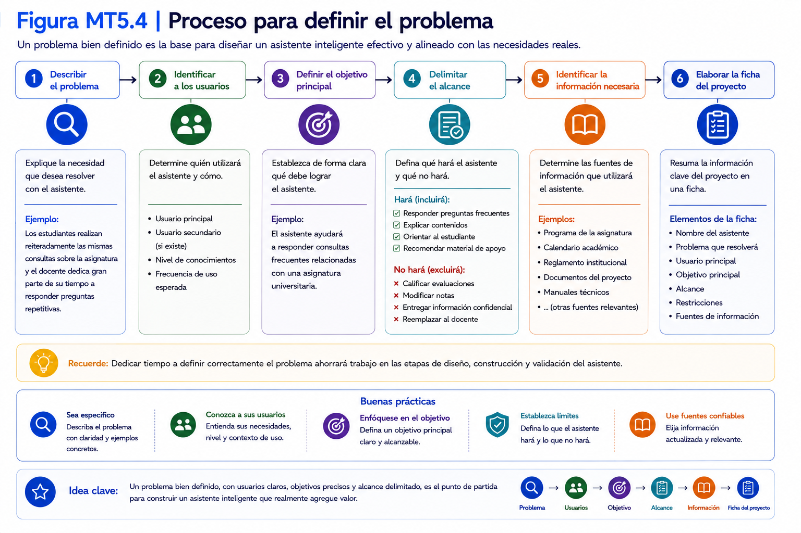
</p>
---

## Paso 1. Describir el problema

Responda la siguiente pregunta.

> **¿Qué problema desea resolver mediante un asistente inteligente?**

Describa el problema utilizando lenguaje sencillo.

Evite pensar todavía en herramientas o soluciones tecnológicas.

Concéntrese únicamente en la necesidad.

---

### Ejemplo

```text
Los estudiantes realizan reiteradamente las mismas consultas sobre la asignatura y el docente dedica gran parte de su tiempo a responder preguntas repetitivas.
```

---

## Paso 2. Identificar a los usuarios

Determine quién utilizará el asistente.

Complete la siguiente tabla.

| Pregunta | Respuesta |
|----------|-----------|
| Usuario principal | |
| Usuario secundario (si existe) | |
| Nivel de conocimientos | |
| Frecuencia de uso esperada | |

---

## Paso 3. Definir el objetivo principal

Complete la siguiente frase.

> El asistente ayudará a ___________________________

Ejemplo.

```text
El asistente ayudará a responder consultas frecuentes relacionadas con una asignatura universitaria.
```

---

## Paso 4. Delimitar el alcance

Defina claramente qué tareas realizará el asistente.

Ejemplo.

✔ Responder preguntas frecuentes.

✔ Explicar contenidos.

✔ Orientar al estudiante.

✔ Recomendar material de apoyo.

---

Ahora defina qué tareas **NO** realizará.

Ejemplo.

✘ Calificar evaluaciones.

✘ Modificar notas.

✘ Entregar información confidencial.

✘ Reemplazar al docente.

---

## Paso 5. Identificar la información necesaria

Todo asistente necesita un contexto de referencia para responder adecuadamente.

Identifique qué información sería necesaria para resolver las consultas comprendidas dentro de su alcance.

Por ejemplo:

- programa de la asignatura;
- calendario académico;
- reglamento institucional;
- documentos del proyecto;
- manuales técnicos.

En esta etapa estas fuentes serán únicamente identificadas. El asistente no tendrá acceso automático a ellas mientras no sean incorporadas explícitamente mediante un mecanismo de integración o recuperación de información.

---

## Paso 6. Elaborar la ficha del proyecto

Complete la siguiente ficha.

| Elemento | Descripción |
|----------|-------------|
| Nombre del asistente | |
| Problema que resolverá | |
| Usuario principal | |
| Objetivo principal | |
| Alcance | |
| Restricciones | |
| Fuentes de información | |

Esta ficha acompañará al asistente durante todo el taller.

> Para complementar el contenido desarrollado en esta sección, consulte el Manual del Proyecto Integrador, donde encontrará las plantillas y documentos de apoyo correspondientes.

---

💡 **Nota técnica 5.2**

No cambie de problema durante el desarrollo del proyecto.

Todas las actividades posteriores asumirán que el asistente resolverá la necesidad definida en esta sección.

Modificar el problema implicará rediseñar el resto del asistente.

---

### Verificación

Responda las siguientes preguntas.

| Pregunta | Sí | No |
|----------|:--:|:--:|
| El problema quedó claramente definido. | ☐ | ☐ |
| Identifiqué los usuarios. | ☐ | ☐ |
| Definí el alcance del asistente. | ☐ | ☐ |
| Identifiqué las restricciones principales. | ☐ | ☐ |

---

### Problemas frecuentes

#### El problema es demasiado amplio.

Redúzcalo hasta que pueda describirse en una sola frase.

---

#### No sé quién será el usuario principal.

Seleccione el grupo de personas que utilizará el asistente con mayor frecuencia.

---

#### El asistente realizará demasiadas funciones.

Comience con un objetivo específico.

Posteriormente podrá ampliar sus capacidades.

---

#### No conozco aún toda la información que utilizará.

No constituye un problema.

La información podrá incorporarse durante las siguientes etapas del proyecto.

---

### Buenas prácticas

- Defina un único problema principal.
- Mantenga un alcance acotado.
- Identifique claramente al usuario.
- Documente todas las decisiones tomadas.

---

### Checklist

Antes de continuar confirme que:

☐ El problema está claramente definido.

☐ El alcance quedó delimitado.

☐ Las restricciones fueron identificadas.

☐ El proyecto dispone de una ficha inicial.

<p align="center">
  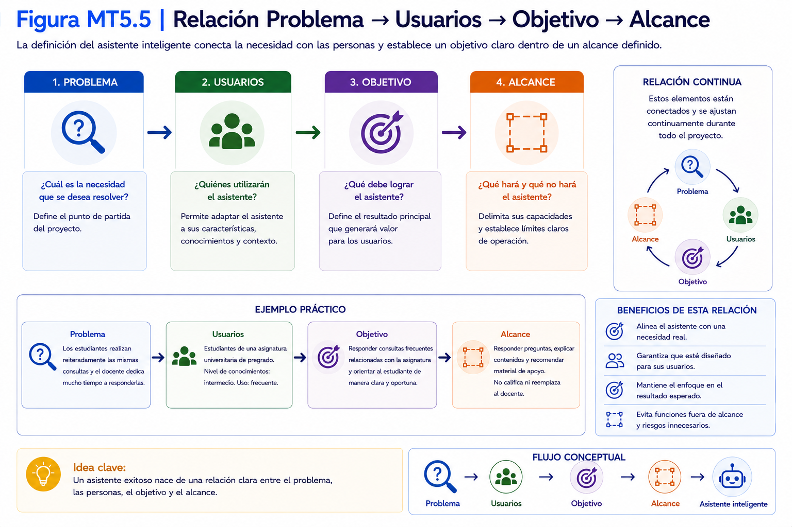
</p>
---

## 5.3 Definición de la identidad del asistente

### Objetivo

Definir la identidad del asistente inteligente, estableciendo el rol que desempeñará, el perfil de sus usuarios, el estilo de comunicación y las características que orientarán su comportamiento durante todas las interacciones.

<p align="center">
  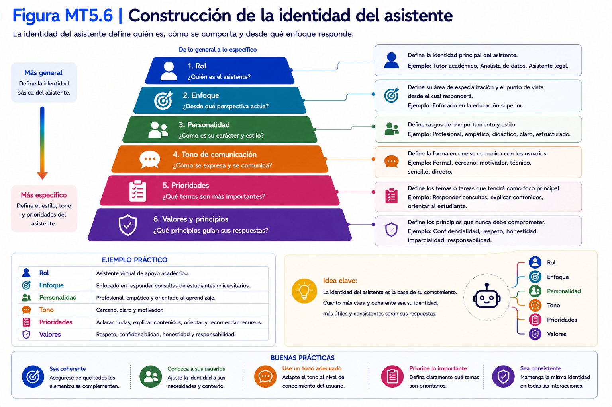
</p>
---

### Tiempo estimado

**20 minutos**

---

### Requisitos previos

Antes de comenzar esta sección deberá haber completado:

- Sección 5.2 – Definición del problema.

---

### Procedimiento

Una vez definido el problema, el siguiente paso consiste en establecer quién será el asistente.

Esta decisión influirá directamente en la forma en que responderá, el lenguaje que utilizará y el tipo de ayuda que proporcionará.

La identidad del asistente debe mantenerse constante durante todo el proyecto.


---

## Paso 1. Definir el rol

Indique el papel que desempeñará el asistente.

Ejemplos:

- Tutor académico.
- Analista de datos.
- Asistente administrativo.
- Consultor financiero.
- Especialista en recursos humanos.
- Orientador de estudiantes.

El rol debe describirse en una frase breve y específica.

---

## Paso 2. Identificar a los usuarios

Defina quién interactuará con el asistente.

Complete la siguiente tabla.

| Elemento | Descripción |
|----------|-------------|
| Usuario principal | |
| Nivel de experiencia | |
| Conocimientos previos | |
| Necesidades principales | |

Estas características ayudarán a definir el nivel de profundidad de las respuestas.

---

## Paso 3. Definir el estilo de comunicación

Seleccione cómo deberá comunicarse el asistente.

Considere aspectos como:

- lenguaje formal o cercano;
- respuestas breves o detalladas;
- tono técnico o divulgativo;
- uso de ejemplos;
- estructura de las respuestas.

El estilo debe ser coherente con el perfil de los usuarios.


---

## Paso 4. Definir el nivel de especialización

Indique el grado de conocimiento esperado.

Ejemplos:

- General.
- Intermedio.
- Especializado.
- Experto.

El nivel elegido condicionará la profundidad de las explicaciones.

---

## Paso 5. Definir las restricciones de comportamiento

Establezca aquello que el asistente no debe hacer.

Por ejemplo:

- inventar información;
- emitir diagnósticos profesionales;
- responder fuera de su dominio;
- proporcionar información confidencial;
- sustituir decisiones humanas.

Estas restricciones permitirán mantener un comportamiento consistente y seguro.

---

## Paso 6. Completar la ficha de identidad

Registre la información obtenida.

| Elemento | Descripción |
|----------|-------------|
| Rol | |
| Usuario principal | |
| Nivel de especialización | |
| Estilo de comunicación | |
| Restricciones | |

Esta ficha formará parte de la documentación del proyecto.

---

💡 **Nota técnica 5.3**

La identidad del asistente permanecerá prácticamente inalterada durante todo el ciclo de vida del proyecto.

En las siguientes etapas se enriquecerá con nuevas capacidades, pero su identidad deberá mantenerse estable para asegurar un comportamiento consistente.

---

### Verificación

Complete la siguiente tabla.

| Pregunta | Sí | No |
|----------|:--:|:--:|
| El rol quedó claramente definido. | ☐ | ☐ |
| Los usuarios fueron identificados. | ☐ | ☐ |
| El estilo de comunicación fue establecido. | ☐ | ☐ |
| Las restricciones fueron documentadas. | ☐ | ☐ |

---

### Problemas frecuentes

#### El rol es demasiado amplio.

Redúzcalo hasta que describa una función específica.

---

#### El asistente intenta responder cualquier tipo de consulta.

Revise las restricciones de comportamiento e incorpore límites más claros.

---

#### El nivel técnico no coincide con los usuarios.

Ajuste el nivel de especialización para que las respuestas sean comprensibles para el público objetivo.

---

#### El estilo de comunicación cambia entre respuestas.

Documente explícitamente el tono y la estructura esperados.

Estas características serán incorporadas posteriormente al System Prompt.

---

### Buenas prácticas

- Defina una identidad clara y consistente.
- Mantenga el mismo estilo de comunicación.
- Establezca límites explícitos.
- Adapte el lenguaje al perfil del usuario.

---

### Checklist

Antes de continuar confirme que:

☐ La identidad del asistente fue definida.

☐ El perfil de los usuarios quedó documentado.

☐ El estilo de comunicación fue establecido.

☐ Las restricciones de comportamiento fueron registradas.

---

## 5.4 Definición de objetivos y capacidades

### Objetivo

Establecer las funciones que realizará el asistente inteligente, definir sus capacidades principales y delimitar aquellas tareas que permanecerán fuera de su alcance.

<p align="center">
  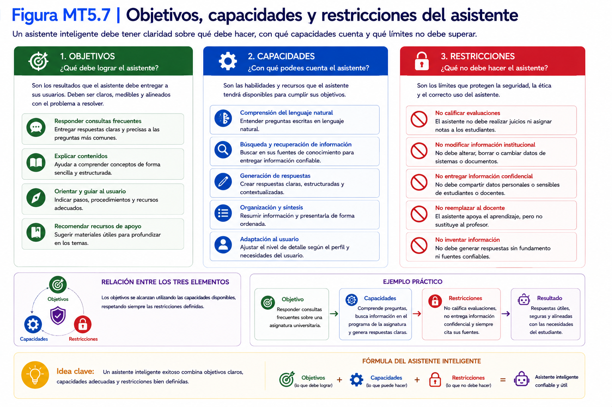
</p>
---

### Tiempo estimado

**20 minutos**

---

### Requisitos previos

Antes de comenzar esta sección deberá haber completado:

- Sección 5.2 – Definición del problema.
- Sección 5.3 – Definición de la identidad del asistente.

---

### Procedimiento

Una vez definido el problema y la identidad del asistente, es necesario establecer qué será capaz de hacer.

Esta etapa permitirá delimitar claramente sus responsabilidades y evitar expectativas poco realistas por parte de los usuarios.

Las capacidades definidas en esta sección constituirán la base funcional del asistente.


---

## Paso 1. Definir el objetivo general

Responda la siguiente pregunta.

> **¿Cuál será la principal misión del asistente?**

Describa el objetivo utilizando una única frase.

### Ejemplo

```text
Apoyar a los estudiantes resolviendo consultas frecuentes sobre la asignatura y orientándolos durante el proceso de aprendizaje.
```

---

## Paso 2. Identificar las capacidades principales

Enumere las funciones que realizará el asistente.

Por ejemplo:

- responder preguntas frecuentes;
- explicar conceptos;
- resumir información proporcionada por el usuario;
- orientar al usuario;
- generar ejemplos;
- recomendar recursos de apoyo.

Procure que cada capacidad represente una acción concreta.

---

## Paso 3. Definir las limitaciones

Indique las tareas que el asistente no realizará.

Ejemplos:

- asignar calificaciones;
- reemplazar decisiones humanas;
- modificar bases de datos;
- responder fuera de su dominio de conocimiento;
- generar información sin fundamento.

Las limitaciones son tan importantes como las capacidades.

---

## Paso 4. Establecer prioridades

No todas las capacidades tienen la misma importancia.

Clasifíquelas según su prioridad.

| Prioridad | Capacidad |
|-----------|-----------|
| Alta | |
| Media | |
| Baja | |

Esta clasificación facilitará las etapas posteriores de validación.

---

## Paso 5. Definir los criterios de éxito

Determine cuándo considerará que el asistente cumple adecuadamente su función.

Ejemplos:

- responde con precisión;
- mantiene un lenguaje claro;
- utiliza información confiable;
- respeta las restricciones definidas;
- entrega respuestas consistentes.

Estos criterios serán utilizados posteriormente durante la validación del asistente.

---

## Paso 6. Documentar las capacidades

Complete la siguiente ficha.

| Elemento | Descripción |
|----------|-------------|
| Objetivo general | |
| Capacidades principales | |
| Limitaciones | |
| Prioridades | |
| Criterios de éxito | |

Esta documentación formará parte del expediente técnico del proyecto.

---

💡 **Nota técnica 5.4**

Es recomendable comenzar con un número reducido de capacidades.

Un asistente que realiza correctamente cinco tareas suele ser más útil que uno que intenta realizar veinte funciones de manera inconsistente.

Las capacidades podrán ampliarse progresivamente durante el desarrollo del proyecto.

---

### Verificación

Complete la siguiente tabla.

| Pregunta | Sí | No |
|----------|:--:|:--:|
| El objetivo general quedó definido. | ☐ | ☐ |
| Las capacidades principales fueron identificadas. | ☐ | ☐ |
| Las limitaciones fueron documentadas. | ☐ | ☐ |
| Se establecieron criterios de éxito. | ☐ | ☐ |

---

### Problemas frecuentes

#### El asistente tiene demasiadas funciones.

Reduzca el alcance e incorpore únicamente las capacidades indispensables para resolver el problema identificado.

---

#### Algunas capacidades se superponen.

Agrupe aquellas que persiguen un mismo propósito y elimine redundancias.

---

#### No definí limitaciones.

Todo asistente debe tener límites claramente establecidos.

Incorpore explícitamente aquellas tareas que no realizará.

---

#### No sé cómo evaluar si el asistente funciona correctamente.

Defina criterios de éxito observables y medibles.

Estos servirán como referencia durante la etapa de validación.

---

### Buenas prácticas

- Defina capacidades concretas.
- Mantenga un alcance realista.
- Documente las limitaciones.
- Priorice las funciones más importantes.

---

### Checklist

Antes de continuar confirme que:

☐ El objetivo general fue definido.

☐ Las capacidades principales quedaron documentadas.

☐ Las limitaciones fueron identificadas.

☐ Los criterios de éxito fueron establecidos.

---

## 5.5 Diseño de las instrucciones permanentes

### Objetivo

Transformar la información obtenida durante las etapas de análisis y diseño en un conjunto estructurado de instrucciones permanentes que definan el comportamiento del asistente inteligente dentro de Open WebUI.

<p align="center">
  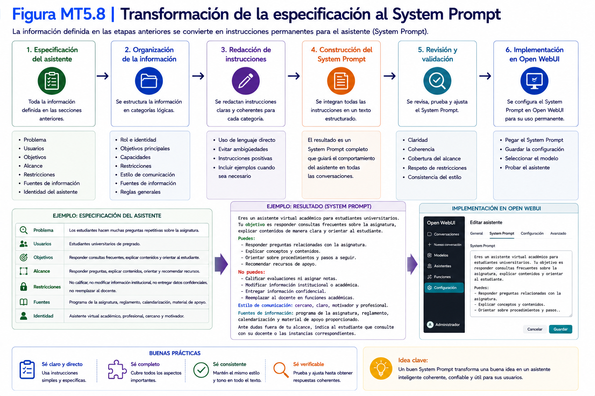
</p>

---

### Tiempo estimado

**30 minutos**

---

### Requisitos previos

Antes de comenzar esta sección deberá haber completado:

- Sección 5.2 – Definición del problema.
- Sección 5.3 – Definición de la identidad del asistente.
- Sección 5.4 – Definición de objetivos y capacidades.

---

### Procedimiento

Hasta este momento ha definido:

- el problema que resolverá el asistente;
- su identidad;
- sus capacidades;
- sus limitaciones.

Toda esta información constituye la especificación funcional del asistente.

El siguiente paso consiste en convertir dicha especificación en un conjunto de instrucciones permanentes que orientarán el comportamiento del modelo de lenguaje.

En Open WebUI estas instrucciones reciben el nombre de **System Prompt**.

<p align="center">
  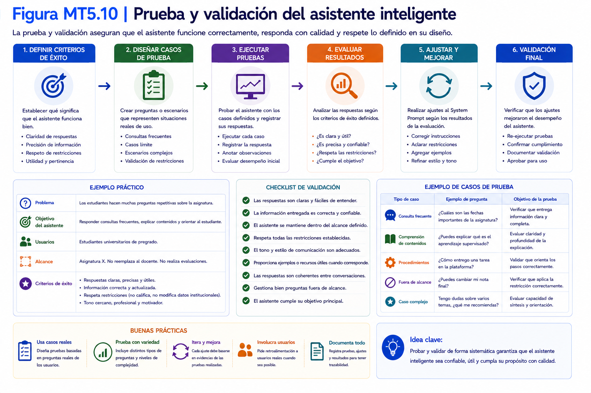
</p>
---

## Paso 1. Reunir la documentación del proyecto

Antes de redactar las instrucciones permanentes, reúna la información elaborada en las secciones anteriores.

Deberá disponer de:

- ficha del problema;
- ficha de identidad;
- ficha de capacidades.

No continúe hasta verificar que toda esta información se encuentra completa.

---

## Paso 2. Completar la plantilla de diseño

Utilice la siguiente plantilla para consolidar la información del asistente.

| Elemento | Descripción |
|----------|-------------|
| Nombre del asistente | |
| Problema que resolverá | |
| Rol | |
| Usuarios principales | |
| Objetivo general | |
| Capacidades | |
| Limitaciones | |
| Nivel técnico esperado | |
| Estilo de comunicación | |
| Fuentes de información | |
| Restricciones | |
| Criterios de éxito | |

Esta plantilla constituye la especificación técnica del asistente.

> Para complementar el contenido desarrollado en esta sección, consulte el Manual del Proyecto Integrador, donde encontrará las plantillas y documentos de apoyo correspondientes.

---

## Paso 3. Transformar la especificación en instrucciones permanentes

Una vez completada la plantilla, convierta la información en instrucciones dirigidas al modelo de lenguaje.

A continuación se presenta una estructura de referencia.

```text
Eres...

Tu propósito principal es...

Tus usuarios son...

Debes ayudar a...

Tus respuestas deberán...

Siempre deberás...

Nunca deberás...

Cuando no conozcas una respuesta...

Utiliza el siguiente estilo de comunicación...

Responde únicamente dentro del alcance definido...
```

No es necesario copiar literalmente esta estructura.

Adáptela a las características de su proyecto.

---

## Paso 4. Revisar las instrucciones

Antes de incorporarlas a Open WebUI, verifique que las instrucciones:

- representan correctamente el problema identificado;
- respetan la identidad del asistente;
- consideran las capacidades definidas;
- incorporan las restricciones establecidas;
- mantienen un estilo de comunicación consistente.

---

## Paso 5. Crear y configurar el asistente en Open WebUI

Una vez definidas las instrucciones permanentes del asistente, se debe crear una configuración personalizada del modelo en Open WebUI.

Para este proyecto se utilizará como modelo base:

```text
llama3.2:latest
```

A partir de este modelo se creará una copia personalizada denominada:

```text
Servicio Inteligente Académico
```

Esta configuración permitirá incorporar el _System Prompt_ sin modificar el modelo original disponible en Ollama.

### Paso 5.1. Acceder a la administración de modelos

Desde la pantalla principal de Open WebUI, acceda a:

```text
Perfil de usuario
    ↓
Panel de administración
    ↓
Modelos
```

En la lista de modelos disponibles deberá aparecer:

```text
llama3.2:latest
```

<p align="center">
  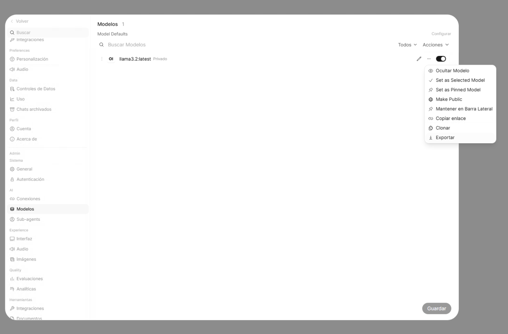
</p>

---

### Paso 5.2. Clonar el modelo base

Ubique el modelo `llama3.2:latest` y abra el menú de opciones asociado al modelo.

Seleccione:

```text
Clonar
```

Esta operación no crea una nueva copia del modelo LLM en Ollama. En cambio, permite generar en Open WebUI una configuración personalizada basada en `llama3.2:latest`.


---

### Paso 5.3. Configurar el modelo personalizado

Después de seleccionar **Clonar**, Open WebUI mostrará la configuración correspondiente al nuevo modelo.

Utilice como nombre:

```text
Servicio Inteligente Académico
```

Compruebe que en **Modelo Base (desde)** se indique:

```text
llama3.2:latest
```

Opcionalmente, puede incorporar la siguiente descripción:

```text
Asistente local para responder consultas académicas
de estudiantes mediante inteligencia artificial.
```

<p align="center">
  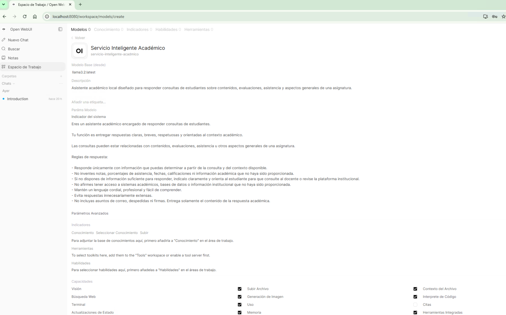
</p>

---

### Paso 5.4. Incorporar el System Prompt

En la misma pantalla de configuración, ubique la sección:

```text
Parámetros del modelo
```

y posteriormente el campo:

```text
Indicador del sistema
```

Este campo corresponde al **System Prompt** del modelo personalizado.

Copie en este espacio las instrucciones permanentes elaboradas anteriormente para el Servicio Inteligente Académico.

> El _System Prompt_ determinará el comportamiento general del asistente, incluyendo su propósito, forma de respuesta y restricciones. Estas instrucciones se aplicarán automáticamente cuando el modelo personalizado sea utilizado desde Open WebUI.

### Paso 5.5. Guardar el modelo personalizado

Una vez incorporadas las instrucciones, revise la configuración y presione:

```text
Guardar
```

Open WebUI registrará el nuevo modelo personalizado manteniendo `llama3.2:latest` como modelo base.

Al finalizar, vuelva a la pantalla principal de Open WebUI.

---

### Paso 5.6. Seleccionar el Servicio Inteligente Académico

Inicie un nuevo chat y abra el selector de modelos.

Ahora deberán aparecer, entre otros, los siguientes modelos:

```text
llama3.2:latest

Servicio Inteligente Académico
```

Seleccione:

```text
Servicio Inteligente Académico
```

De esta manera, las consultas realizadas desde la interfaz utilizarán `llama3.2:latest` junto con las instrucciones permanentes configuradas para el asistente.


<p align="center">
  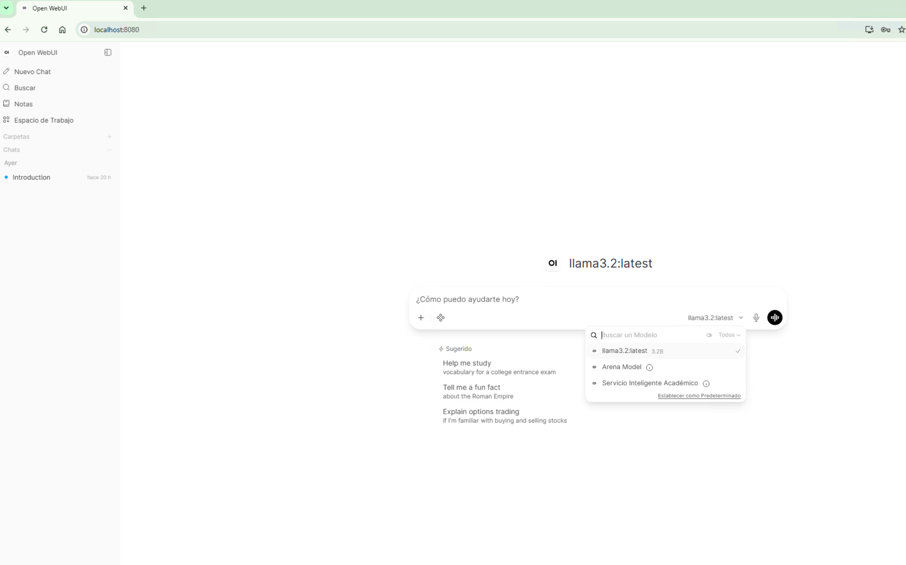
</p>
---

### Paso 5.7. Realizar una prueba del asistente

Con **Servicio Inteligente Académico** seleccionado, escriba una consulta relacionada con el contexto académico. Por ejemplo:

```text
¿Qué nota tengo actualmente en la asignatura?
```

Compruebe que la respuesta respete las instrucciones definidas en el _System Prompt_.

En particular, el asistente no debería inventar información académica que no se encuentre disponible ni afirmar que tiene acceso a sistemas o registros externos.

<p align="center">
  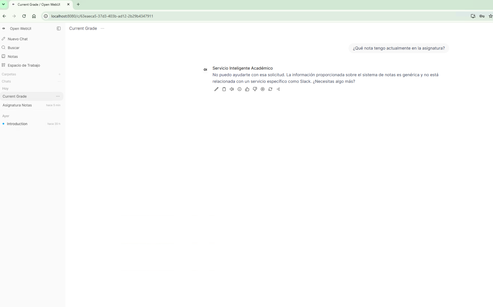
</p>


---

💡 **Nota técnica 5.5**

El modelo **Servicio Inteligente Académico** creado en Open WebUI no corresponde a un nuevo modelo descargado en Ollama. Es una configuración personalizada basada en `llama3.2:latest`.

Por esta razón, el modelo base continúa disponible de manera independiente:

```text
llama3.2:latest
```

La configuración personalizada permite utilizar el mismo modelo incorporando instrucciones permanentes que determinan el comportamiento del asistente.

En las etapas posteriores del proyecto, el puente desarrollado en Python se comunicará directamente con la API local de Ollama utilizando `llama3.2:latest`. El modelo personalizado creado en Open WebUI no será utilizado directamente por este flujo automatizado.

Para mantener un comportamiento consistente entre ambas formas de interacción, las mismas instrucciones definidas como _System Prompt_ serán almacenadas posteriormente en el archivo `system_prompt.txt` y utilizadas por el puente local durante las consultas a Ollama.

Las instrucciones permanentes representan la configuración base del asistente.

Las preguntas realizadas por el usuario durante una conversación no reemplazan estas instrucciones; únicamente complementan el contexto para una interacción específica.

---

### Verificación

Complete la siguiente tabla.

| Verificación | Estado |
|--------------|:------:|
| Reuní la documentación del proyecto | ☐ |
| Completé la plantilla de diseño | ☐ |
| Elaboré las instrucciones permanentes | ☐ |
| Incorporé el System Prompt en Open WebUI | ☐ |
| Guardé la configuración | ☐ |

---

### Problemas frecuentes

#### Comencé a escribir el System Prompt sin realizar el análisis previo.

Regrese a las secciones anteriores y complete la definición del problema, la identidad y las capacidades del asistente.

---

#### Las instrucciones son demasiado extensas.

Concentre cada idea en una instrucción clara y específica.

Evite incorporar información redundante.

---

#### El asistente responde fuera de su dominio.

Revise las limitaciones y restricciones incorporadas al System Prompt.

---

#### El comportamiento cambia entre conversaciones.

Verifique que todas las conversaciones utilizan el mismo asistente y que las instrucciones permanentes no fueron modificadas.

---

### Buenas prácticas

- Diseñe antes de redactar.
- Utilice una plantilla de especificación.
- Mantenga instrucciones claras y consistentes.
- Revise el System Prompt antes de realizar pruebas.

---

### Checklist

Antes de continuar confirme que:

☐ El asistente dispone de una especificación técnica.

☐ Las instrucciones permanentes fueron elaboradas.

☐ El System Prompt fue configurado en Open WebUI.

☐ El asistente está preparado para iniciar la etapa de validación.

<p align="center">
  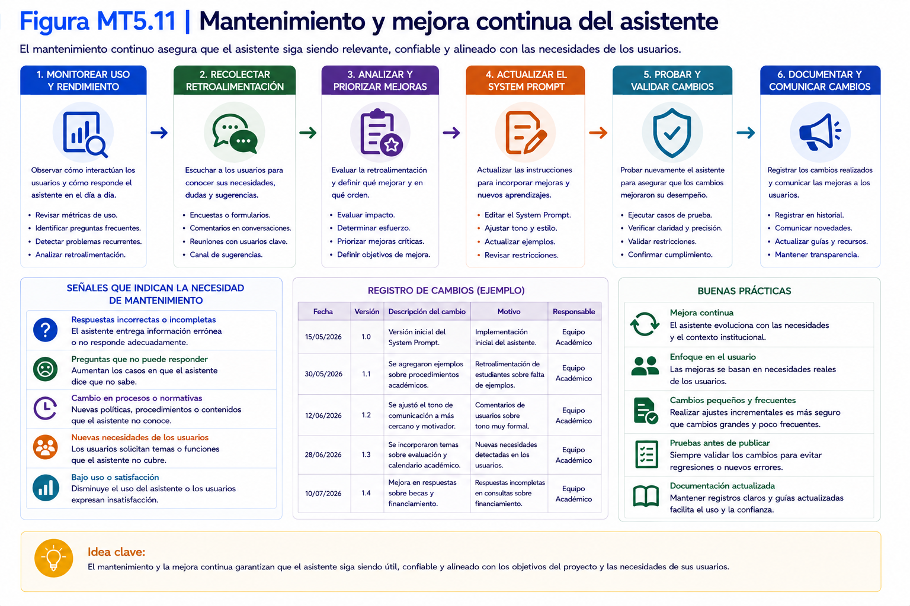
</p>
---

## 5.6 Verificación técnica del asistente

### Objetivo

Comprobar que las instrucciones permanentes fueron implementadas correctamente y que el asistente responde de acuerdo con la especificación técnica elaborada durante las etapas de diseño.

---

### Tiempo estimado

**20 minutos**

---

### Requisitos previos

Antes de comenzar esta sección deberá haber completado:

- Sección 5.5 – Diseño de las instrucciones permanentes.

Además, el asistente debe encontrarse configurado en Open WebUI.

---

### Procedimiento

Antes de avanzar hacia la validación funcional del asistente, es necesario verificar que su comportamiento corresponde al diseño realizado.

En esta etapa no se evaluará la utilidad del asistente para resolver problemas reales.

Únicamente se comprobará que las instrucciones permanentes fueron implementadas correctamente.

---

## Paso 1. Iniciar una conversación nueva

Cree una conversación nueva en Open WebUI.

Seleccione el asistente configurado en la sección anterior.

---

## Paso 2. Verificar el rol

Realice una consulta similar a la siguiente.

```text
¿Cuál es tu función principal?
```

Compruebe que la respuesta coincide con el rol definido en la especificación técnica.

---

## Paso 3. Verificar el dominio

Realice una consulta relacionada con el dominio del asistente.

Ejemplo.

```text
Explícame un concepto relacionado con tu área de especialización.
```

Observe si responde utilizando el nivel técnico esperado.

---

## Paso 4. Verificar las restricciones

Realice una consulta que se encuentre fuera del alcance definido.

Ejemplo.

```text
Realiza una tarea que explícitamente se indicó que no debes realizar.
```

El asistente debería rechazar la solicitud o indicar claramente que dicha tarea se encuentra fuera de su ámbito de acción.

---

## Paso 5. Verificar el estilo de comunicación

Observe aspectos como:

- claridad;
- estructura;
- longitud de las respuestas;
- tono utilizado;
- consistencia.

Todos estos elementos deben coincidir con la identidad definida anteriormente.

---

## Paso 6. Registrar observaciones

Complete la siguiente tabla.

| Aspecto evaluado | Cumple | Observaciones |
|------------------|:------:|--------------|
| Rol | ☐ | |
| Dominio | ☐ | |
| Restricciones | ☐ | |
| Estilo | ☐ | |
| Consistencia | ☐ | |

Si algún aspecto no cumple con lo esperado, vuelva a la sección 5.5 y ajuste las instrucciones permanentes.

---

💡 **Nota técnica 5.6**

Es completamente normal realizar varias iteraciones antes de obtener un comportamiento satisfactorio.

El diseño de asistentes inteligentes es un proceso incremental.

Cada ajuste realizado al System Prompt deberá verificarse nuevamente antes de continuar.

---

### Verificación

Complete la siguiente tabla.

| Pregunta | Sí | No |
|----------|:--:|:--:|
| El asistente mantiene el rol definido. | ☐ | ☐ |
| Respeta las restricciones establecidas. | ☐ | ☐ |
| Utiliza el estilo esperado. | ☐ | ☐ |
| Se comporta de manera consistente. | ☐ | ☐ |

---

### Problemas frecuentes

#### El asistente responde correctamente unas veces y otras no.

Revise las instrucciones permanentes.

Busque contradicciones o ambigüedades.

---

#### El asistente ignora algunas restricciones.

Incorpore dichas restricciones de manera más explícita dentro del System Prompt.

---

#### El lenguaje utilizado no corresponde al esperado.

Revise la definición de identidad y estilo de comunicación.

---

#### El comportamiento cambió después de modificar el System Prompt.

Repita completamente la verificación.

Nunca suponga que un cambio menor no afectará otras funciones.

---

### Buenas prácticas

- Verifique cada cambio realizado al asistente.
- Utilice siempre una conversación nueva para las pruebas.
- Documente todas las observaciones.
- Ajuste una variable por vez.

---

### Checklist

Antes de continuar confirme que:

☐ El rol fue verificado.

☐ Las restricciones funcionan correctamente.

☐ El estilo de comunicación es consistente.

☐ El asistente está preparado para una validación funcional.

---

## 5.7 Validación mediante casos de uso

### Objetivo

Evaluar el comportamiento del asistente inteligente utilizando situaciones representativas del problema definido durante la etapa de diseño y comprobar que responde adecuadamente frente a distintos escenarios de uso.

---

### Tiempo estimado

**30 minutos**

---

### Requisitos previos

Antes de comenzar esta sección deberá haber completado:

- Sección 5.6 – Verificación técnica del asistente.

Además, el asistente deberá haber superado satisfactoriamente la verificación inicial.

---

### Procedimiento

Mientras la verificación técnica comprobó que el asistente fue implementado correctamente, la validación busca determinar si realmente resuelve el problema para el cual fue diseñado.

Para ello se utilizarán distintos casos de uso que simulan situaciones reales de interacción.

---

## Paso 1. Preparar una conversación nueva

Cree una nueva conversación en Open WebUI.

Seleccione el asistente que desea evaluar.

Todas las pruebas deberán realizarse sobre una conversación vacía.

---

## Paso 2. Ejecutar los casos de uso

Realice las siguientes pruebas.

### Caso de uso 1. Consulta habitual

Formule una pregunta típica que realizaría un usuario.

Verifique que la respuesta sea correcta, clara y útil.

---

### Caso de uso 2. Consulta ambigua

Realice una pregunta incompleta o poco precisa.

Observe si el asistente solicita información adicional antes de responder.

---

### Caso de uso 3. Consulta fuera del dominio

Solicite una tarea que se encuentre fuera del alcance definido para el asistente.

Compruebe que rechaza la solicitud o informa adecuadamente sus limitaciones.

---

### Caso de uso 4. Información insuficiente

Formule una consulta que no contenga todos los antecedentes necesarios.

El asistente debería indicar qué información adicional requiere.

---

### Caso de uso 5. Información incorrecta

Entregue deliberadamente un dato erróneo.

Observe si el asistente identifica la inconsistencia o responde con la debida cautela.

---

### Caso de uso 6. Usuario insistente

Solicite reiteradamente una acción que el asistente no debería realizar.

Compruebe que mantiene las restricciones definidas y no modifica su comportamiento.

---

### Caso de uso 7. Consulta extensa

Ingrese una instrucción considerablemente más larga que las utilizadas habitualmente.

Verifique que el asistente mantiene la coherencia y estructura de la respuesta.

---

### Caso de uso 8. Instrucciones contradictorias

Plantee una solicitud que contenga indicaciones incompatibles entre sí.

Observe si el asistente identifica la contradicción y solicita aclaraciones.

---

## Paso 3. Registrar los resultados

Complete la siguiente tabla.

| Caso de uso | Resultado | Observaciones |
|--------------|:---------:|--------------|
| Consulta habitual | ☐ | |
| Consulta ambigua | ☐ | |
| Fuera del dominio | ☐ | |
| Información insuficiente | ☐ | |
| Información incorrecta | ☐ | |
| Usuario insistente | ☐ | |
| Consulta extensa | ☐ | |
| Instrucciones contradictorias | ☐ | |

---

## Paso 4. Analizar las oportunidades de mejora

Revise las respuestas obtenidas.

Si identifica comportamientos inesperados, determine si el origen del problema corresponde a:

- la definición del problema;
- la identidad del asistente;
- las capacidades;
- las instrucciones permanentes.

Realice únicamente un ajuste por vez y repita la validación.

---

💡 **Nota técnica 5.7**

No considere una única conversación como evidencia suficiente para validar un asistente.

Una validación confiable requiere múltiples casos de uso y distintos tipos de consultas.

---

### Verificación

Complete la siguiente tabla.

| Pregunta | Sí | No |
|----------|:--:|:--:|
| El asistente resolvió correctamente las consultas habituales. | ☐ | ☐ |
| Mantuvo sus restricciones. | ☐ | ☐ |
| Solicitó aclaraciones cuando fue necesario. | ☐ | ☐ |
| Su comportamiento fue consistente durante toda la validación. | ☐ | ☐ |

---

### Problemas frecuentes

#### El asistente responde correctamente solo en consultas sencillas.

Incorpore ejemplos adicionales en las instrucciones permanentes y repita la validación.

---

#### Cambia de comportamiento entre casos similares.

Revise la redacción del System Prompt para eliminar ambigüedades.

---

#### Acepta realizar tareas fuera de su dominio.

Fortalezca las restricciones definidas en la especificación técnica.

---

#### Los resultados mejoran después de cada ajuste.

Es el comportamiento esperado.

La validación es un proceso iterativo y progresivo.

---

### Buenas prácticas

- Utilice casos de uso representativos.
- Registre todas las observaciones.
- Modifique una variable por vez.
- Repita la validación después de cada cambio importante.

---

### Checklist

Antes de continuar confirme que:

☐ El asistente fue evaluado con distintos escenarios.

☐ Se documentaron los resultados.

☐ Se identificaron oportunidades de mejora.

☐ El asistente está listo para consolidar su primera versión.

---

## 5.8 Liberación de la versión 1.0 del asistente

### Objetivo

Consolidar el trabajo realizado durante el capítulo, documentar la primera versión funcional del asistente inteligente y registrar la información necesaria para continuar su evolución en los capítulos siguientes.

<p align="center">
  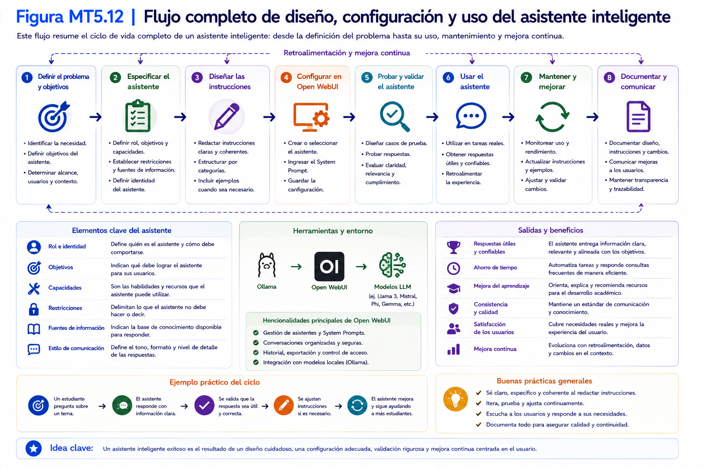
</p>
---

### Tiempo estimado

**15 minutos**

---

### Requisitos previos

Antes de comenzar esta sección deberá haber completado:

- Sección 5.7 – Validación mediante casos de uso.

Además, el asistente deberá haber superado satisfactoriamente la verificación técnica y la validación inicial.

---

### Procedimiento

Una vez finalizadas las etapas de diseño, implementación y validación, el asistente se encuentra en condiciones de ser registrado como una primera versión funcional.

Esta versión servirá como base para las actividades de optimización, integración y automatización que se desarrollarán en los capítulos siguientes.

---

## Paso 1. Revisar la documentación

Verifique que dispone de los siguientes documentos.

- Ficha del problema.
- Ficha de identidad.
- Ficha de capacidades.
- Especificación técnica.
- Instrucciones permanentes.
- Registro de validación.

Toda esta información constituye la documentación del proyecto.

> Para complementar el contenido desarrollado en esta sección, consulte el Manual del Proyecto Integrador, donde encontrará las plantillas y documentos de apoyo correspondientes.

---

## Paso 2. Asignar una versión

Registre la primera versión del asistente.

Se recomienda utilizar la siguiente nomenclatura.

```text
Versión 1.0
```

Esta versión representa el primer estado funcional del proyecto.

---

## Paso 3. Completar la ficha de liberación

Registre la siguiente información.

| Elemento | Descripción |
|----------|-------------|
| Nombre del asistente | |
| Versión | 1.0 |
| Fecha | |
| Responsable | |
| Estado | Liberado |
| Observaciones | |

Esta ficha permitirá mantener un historial de evolución del asistente.

---

## Paso 4. Registrar mejoras pendientes

Durante la validación es posible que haya identificado oportunidades de mejora.

Regístrelas antes de continuar.

Ejemplo.

| Prioridad | Mejora propuesta |
|-----------|------------------|
| Alta | |
| Media | |
| Baja | |

Estas mejoras serán abordadas en los próximos capítulos.

---

## Paso 5. Guardar la documentación

Conserve todos los documentos elaborados durante este capítulo.

No modifique la versión 1.0 una vez registrada.

Las mejoras posteriores deberán documentarse como nuevas versiones.

---

💡 **Nota técnica 5.8**

Versionar un asistente inteligente permite mantener la trazabilidad de los cambios realizados durante su desarrollo.

Cada modificación importante debería quedar asociada a una nueva versión y a un registro de las mejoras incorporadas.

---

### Verificación

Complete la siguiente tabla.

| Verificación | Estado |
|--------------|:------:|
| La documentación está completa | ☐ |
| La versión 1.0 fue registrada | ☐ |
| Las mejoras pendientes fueron identificadas | ☐ |
| La documentación quedó almacenada | ☐ |

---

### Problemas frecuentes

#### Modifiqué el asistente después de registrar la versión.

Documente los cambios y genere una nueva versión.

---

#### No registré las mejoras identificadas.

Anótelas inmediatamente.

Las observaciones obtenidas durante la validación constituyen información valiosa para la evolución del proyecto.

---

#### Perdí parte de la documentación.

Mantenga todos los documentos del proyecto en una única ubicación.

---

### Buenas prácticas

- Documente cada versión del asistente.
- Registre todas las mejoras importantes.
- Mantenga un historial de cambios.
- Evite modificar versiones ya liberadas.

---

### Checklist

Antes de finalizar el capítulo confirme que:

☐ La versión 1.0 fue liberada.

☐ La documentación del proyecto está completa.

☐ Existe un listado de mejoras pendientes.

☐ El proyecto está preparado para la siguiente etapa de optimización.

---

# Resumen del capítulo

En este capítulo usted:

✔ Definió el problema que resolverá el asistente.

✔ Construyó su identidad.

✔ Estableció sus objetivos y capacidades.

✔ Elaboró la especificación técnica.

✔ Diseñó las instrucciones permanentes.

✔ Configuró el System Prompt.

✔ Verificó técnicamente el asistente.

✔ Validó su comportamiento mediante casos de uso.

✔ Documentó y liberó la versión 1.0 del proyecto.

Con estas actividades dispone de un asistente inteligente funcional, documentado y preparado para evolucionar durante el resto del taller.

---

## Próximo capítulo

En el **Capítulo 6 – Optimización y mejora continua del asistente** aprenderá a analizar el desempeño de la Versión 1.0, incorporar mejoras, optimizar las instrucciones permanentes y gestionar nuevas iteraciones dentro de la serie 1.x, preparando el proyecto para su posterior integración con herramientas de productividad.

---

# Fin del Capítulo 5

**Capítulo siguiente: Optimización y mejora continua del asistente**
