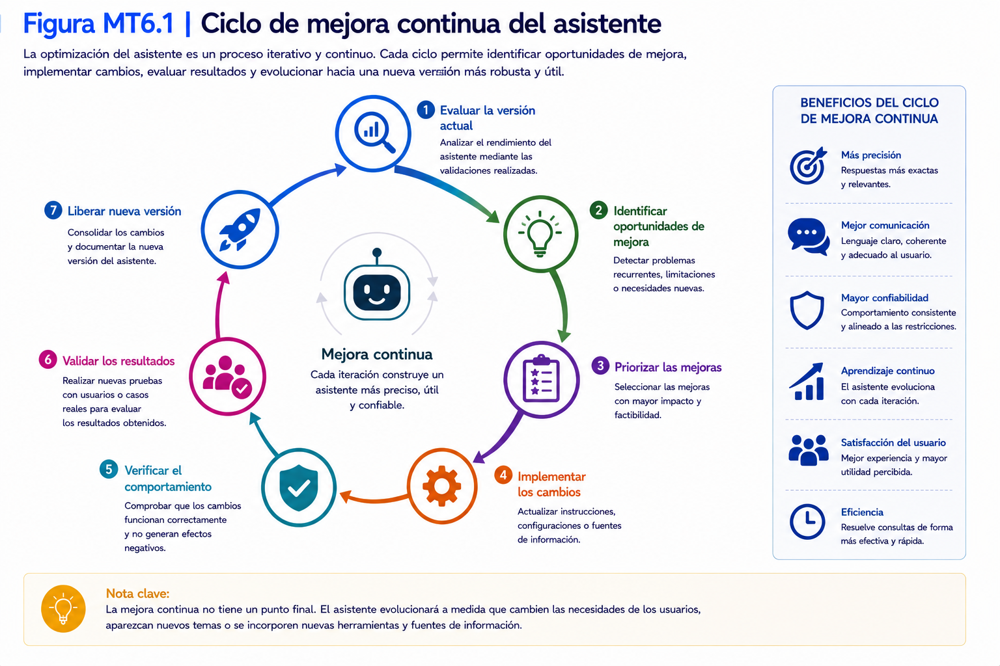
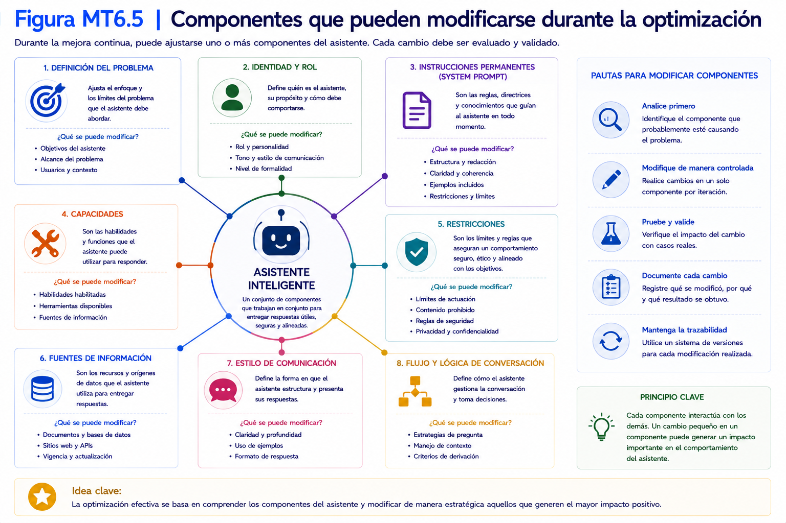
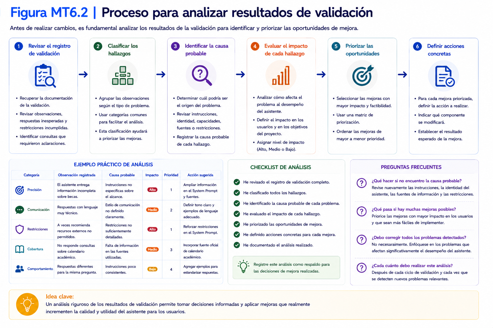

# Capítulo 6

# Optimización y mejora continua del asistente

## 6.1 ¿Por qué optimizar un asistente inteligente?

### Objetivo

Comprender la importancia de la mejora continua en el desarrollo de asistentes inteligentes y reconocer que la primera versión constituye únicamente el punto de partida para un proceso de evolución progresiva.

---

### Tiempo estimado

**10 minutos**

---

### Requisitos previos

Antes de comenzar esta sección deberá haber completado íntegramente el **Capítulo 5 – Diseño de asistentes inteligentes**.

Además, deberá disponer de la **Versión 1.0** del asistente correctamente documentada.

---

### Procedimiento

Durante el capítulo anterior construyó la primera versión funcional del asistente.

Dicha versión fue diseñada, implementada, verificada y validada.

Sin embargo, esto no significa que el asistente esté terminado.

Como ocurre en cualquier proyecto de ingeniería, la primera versión constituye el punto de partida para un proceso continuo de mejora.

El objetivo de este capítulo será aprender cómo analizar el comportamiento del asistente, identificar oportunidades de optimización y gestionar su evolución de forma controlada.

---

## ¿Por qué optimizar un asistente?

La optimización permite mejorar aspectos como:

- precisión de las respuestas;
- claridad de la comunicación;
- consistencia del comportamiento;
- cumplimiento de las restricciones;
- eficiencia en la resolución de consultas.

Cada mejora incorporada deberá responder a una necesidad identificada durante la etapa de validación.

---

## ¿Qué puede mejorarse?

Un asistente inteligente puede evolucionar en distintos aspectos.

Por ejemplo:

- la redacción de las instrucciones permanentes;
- la organización de la información;
- la definición del rol;
- las capacidades incorporadas;
- las restricciones de comportamiento;
- el estilo de comunicación.

La optimización no implica comenzar nuevamente el proyecto, sino perfeccionar la versión existente.

---

## Principio de mejora incremental

En este taller se aplicará un principio simple.

> **Cada modificación debe aportar una mejora observable al comportamiento del asistente.**

Evite realizar cambios simultáneos en múltiples componentes.

Modificar una única variable por vez facilitará identificar el efecto producido.

---

## Ciclo de mejora continua

El proceso que seguirá durante este capítulo será el siguiente.

  

Cada iteración permitirá construir un asistente más robusto y consistente.

---

💡 **Nota técnica 6.1**

La optimización nunca finaliza completamente.

Incluso un asistente que funciona correctamente puede seguir evolucionando a medida que aparecen nuevas necesidades, nuevas fuentes de información o nuevas funcionalidades.

---

### Verificación

Responda las siguientes preguntas.

| Pregunta | Sí | No |
|----------|:--:|:--:|
| Comprendo que la versión 1.0 es un punto de partida. | ☐ | ☐ |
| Comprendo el objetivo de la optimización. | ☐ | ☐ |
| Comprendo el concepto de mejora incremental. | ☐ | ☐ |
| Comprendo el ciclo de mejora continua. | ☐ | ☐ |

---

### Problemas frecuentes

#### Quiero modificar muchas cosas al mismo tiempo.

Realice un cambio por iteración.

Esto facilitará evaluar el efecto de cada modificación.

---

#### El asistente ya funciona correctamente.

Siempre existirán oportunidades de mejora.

El objetivo no es corregir errores únicamente, sino incrementar progresivamente la calidad del asistente.

---

### Buenas prácticas

- Optimice de manera gradual.
- Documente cada cambio realizado.
- Evalúe los resultados antes de continuar.
- Mantenga un historial de versiones.

---

### Checklist

Antes de continuar confirme que:

☐ Comprende el propósito de la optimización.

☐ Comprende el concepto de mejora continua.

☐ Está preparado para analizar la versión 1.0 del asistente.

---

## 6.2 Análisis de resultados y oportunidades de mejora

### Objetivo

Analizar los resultados obtenidos durante la validación del asistente, identificar oportunidades de mejora y priorizar las acciones que serán incorporadas en la siguiente versión del proyecto.

---

### Tiempo estimado

**20 minutos**

---

### Requisitos previos

Antes de comenzar esta sección deberá haber completado:

- Sección 6.1 – ¿Por qué optimizar un asistente inteligente?

Además, deberá disponer de:

- Registro de validación del asistente.
- Especificación técnica del asistente.
- Versión 1.0 liberada.

---

### Procedimiento

La optimización debe sustentarse en evidencias obtenidas durante el proceso de validación.

Antes de modificar cualquier componente del asistente, es necesario analizar los resultados obtenidos e identificar aquellas situaciones que justifican una mejora.

---

## Paso 1. Revisar el registro de validación

Recupere la documentación generada durante la validación del asistente.

Revise especialmente:

- observaciones registradas;
- respuestas inesperadas;
- restricciones incumplidas;
- consultas que requirieron aclaraciones.

Toda mejora deberá estar respaldada por alguno de estos antecedentes.

---

## Paso 2. Clasificar los hallazgos

Agrupe las observaciones según el tipo de problema detectado.

Utilice la siguiente clasificación como referencia.

| Categoría | Ejemplos |
|-----------|----------|
| Precisión | Respuestas incorrectas o incompletas |
| Comunicación | Lenguaje poco claro o inconsistente |
| Restricciones | Incumplimiento de límites definidos |
| Cobertura | Temas no abordados por el asistente |
| Comportamiento | Respuestas inconsistentes entre conversaciones |

Esta clasificación facilitará la priorización de las mejoras.

---

## Paso 3. Identificar la causa probable

Para cada observación determine cuál podría ser su origen.

Por ejemplo:

- definición poco clara del problema;
- identidad insuficientemente especificada;
- capacidades mal definidas;
- instrucciones permanentes ambiguas;
- ausencia de información relevante.

Evite modificar el asistente sin comprender previamente la causa del comportamiento observado.

---

## Paso 4. Priorizar las mejoras

Clasifique las oportunidades de mejora según su impacto.

| Prioridad | Descripción |
|-----------|-------------|
| Alta | Afecta el funcionamiento principal del asistente. |
| Media | Mejora la calidad de las respuestas. |
| Baja | Optimización deseable, pero no crítica. |

Comience siempre por las mejoras de mayor prioridad.

---

## Paso 5. Elaborar el plan de optimización

Complete la siguiente tabla.

| Hallazgo | Causa probable | Acción propuesta |      Prioridad      | Estado                            |
| -------- | -------------- | ---------------- | :-----------------: | --------------------------------- |
|          |                |                  | Alta / Media / Baja | Pendiente / En proceso / Aplicada |
|          |                |                  |                     |                                   |
|          |                |                  |                     |                                   |

Este plan guiará las modificaciones que se realizarán en las siguientes secciones.

---

💡 **Nota técnica 6.2**

No todas las observaciones requieren una modificación inmediata.

Algunas podrán agruparse y resolverse mediante un único ajuste en las instrucciones permanentes o en la especificación del asistente.

---

### Verificación

Complete la siguiente tabla.

| Pregunta | Sí | No |
|----------|:--:|:--:|
| Analicé los resultados de la validación. | ☐ | ☐ |
| Clasifiqué los hallazgos. | ☐ | ☐ |
| Identifiqué las causas probables. | ☐ | ☐ |
| Elaboré un plan de optimización. | ☐ | ☐ |

---

### Problemas frecuentes

#### No encuentro oportunidades de mejora.

Revise nuevamente los casos de uso ejecutados durante la validación.

Incluso pequeños ajustes pueden incrementar la calidad del asistente.

---

#### Todas las mejoras parecen importantes.

Priorice aquellas que afectan directamente el objetivo principal del asistente.

---

#### No logro identificar la causa del problema.

Analice cada componente del asistente por separado.

Evite modificar simultáneamente varias partes del diseño.

---

### Buenas prácticas

- Base las mejoras en evidencias.
- Analice las causas antes de intervenir.
- Priorice los cambios de mayor impacto.
- Documente todas las decisiones.

---

### Checklist

Antes de continuar confirme que:

☐ Analizó los resultados obtenidos.

☐ Identificó oportunidades de mejora.

☐ Priorizó las acciones.

☐ Elaboró un plan de optimización.

---

## 6.3 Implementación de mejoras

### Objetivo

Implementar las mejoras identificadas durante el análisis de resultados, actualizando la especificación técnica del asistente y sus instrucciones permanentes de manera controlada y documentada.

---

### Tiempo estimado

**25 minutos**

---

### Requisitos previos

Antes de comenzar esta sección deberá haber completado:

- Sección 6.2 – Análisis de resultados y oportunidades de mejora.

Además, deberá disponer de:

- Plan de optimización.
- Especificación técnica del asistente.
- Instrucciones permanentes (System Prompt).

---

### Procedimiento

Las mejoras identificadas durante el análisis deberán implementarse de forma planificada.

Cada modificación debe responder a una necesidad previamente documentada y mantenerse alineada con el propósito original del asistente.

---

## Paso 1. Seleccionar una mejora

Revise el plan de optimización.

Seleccione una única mejora para implementar.

Comience siempre por aquellas clasificadas con prioridad **Alta**.

Evite aplicar varias modificaciones simultáneamente.

---

## Paso 2. Identificar el componente afectado

Determine qué parte del asistente deberá modificarse.

Utilice la siguiente guía.

| Componente | Cuándo modificarlo |
|------------|--------------------|
| Problema | Cambia la necesidad que resolverá el asistente. |
| Identidad | Cambia el rol o el estilo de comunicación. |
| Capacidades | Se incorporan o eliminan funciones. |
| Restricciones | Se agregan o ajustan límites de comportamiento. |
| Conocimiento | Se incorpora nueva información relevante. |
| Instrucciones permanentes | Se requiere reflejar alguno de los cambios anteriores. |

Realice únicamente las modificaciones necesarias.

---

## Paso 3. Actualizar la especificación técnica

Antes de modificar Open WebUI, incorpore los cambios en la documentación del proyecto.

Actualice únicamente los apartados afectados.

Mantenga un registro de las modificaciones realizadas.

> Para complementar el contenido desarrollado en esta sección, consulte el Manual del Proyecto Integrador, donde encontrará las plantillas y documentos de apoyo correspondientes.

---

## Paso 4. Actualizar las instrucciones permanentes

Una vez actualizada la especificación técnica, incorpore los cambios correspondientes al conjunto de instrucciones permanentes (*System Prompt*).

Verifique que las modificaciones reflejan fielmente la nueva especificación.

---

## Paso 5. Registrar los cambios

Complete un registro de cambios similar al siguiente.

| Fecha | Versión | Cambio realizado | Motivo |
|--------|---------|------------------|--------|
| | 1.1 | | |

Este registro facilitará el seguimiento de la evolución del asistente.

---

## Paso 6. Guardar la nueva configuración

Guarde la configuración actualizada del modelo personalizado **Servicio Inteligente Académico** en Open WebUI.

A partir de este momento, el modelo personalizado utilizará la nueva versión de las instrucciones permanentes definidas en el _System Prompt_.

---

💡 **Nota técnica 6.3**

No implemente mejoras directamente sobre el System Prompt sin actualizar previamente la especificación técnica.

La documentación debe representar siempre el comportamiento esperado del asistente.

---

### Verificación

Complete la siguiente tabla.

| Verificación | Estado |
|--------------|:------:|
| Seleccioné una única mejora | ☐ |
| Actualicé la especificación técnica | ☐ |
| Modifiqué las instrucciones permanentes | ☐ |
| Registré los cambios realizados | ☐ |

---

### Problemas frecuentes

#### Implementé varias mejoras simultáneamente.

Vuelva al plan de optimización e implemente un cambio por iteración.

Esto facilitará identificar el efecto de cada modificación.

---

#### El System Prompt ya no coincide con la documentación.

Actualice inmediatamente la especificación técnica.

Ambos elementos deben mantenerse sincronizados.

---

#### No registré los cambios realizados.

Documente cada modificación antes de continuar.

Esto permitirá reconstruir la evolución del proyecto.

---

### Buenas prácticas

- Actualice primero la documentación.
- Implemente una mejora por iteración.
- Mantenga sincronizada la especificación técnica con las instrucciones permanentes.
- Registre todas las modificaciones.

---

### Checklist

Antes de continuar confirme que:

☐ La mejora fue implementada.

☐ La documentación fue actualizada.

☐ El System Prompt refleja la nueva especificación.

☐ Existe un registro de cambios.

---

## 6.4 Evaluación de las mejoras implementadas

### Objetivo

Evaluar el impacto de las mejoras incorporadas al asistente inteligente, comparando el comportamiento de la nueva versión con la versión anterior mediante los mismos casos de uso.

  

---

### Tiempo estimado

**20 minutos**

---

### Requisitos previos

Antes de comenzar esta sección deberá haber completado:

- Sección 6.3 – Implementación de mejoras.

Además, deberá disponer de:

- Versión 1.0 documentada.
- Versión actualizada del asistente.
- Registro de casos de uso utilizados durante la validación inicial.

---

### Procedimiento

Una mejora solamente puede considerarse exitosa cuando produce un cambio observable en el comportamiento del asistente.

Para comprobarlo se utilizarán exactamente los mismos casos de uso empleados durante la validación de la versión anterior.

De esta manera será posible comparar objetivamente ambos resultados.

---

## Paso 1. Recuperar los casos de uso

Revise el registro de validación correspondiente a la Versión 1.0.

Seleccione los mismos casos de uso utilizados anteriormente.

No modifique las preguntas.

Esto garantizará que la comparación sea objetiva.

---

## Paso 2. Ejecutar nuevamente las pruebas

Utilizando la nueva versión del asistente, repita cada uno de los casos de uso.

Ejecute las pruebas en una **nueva conversación**, evitando que el historial de interacciones anteriores influya en las respuestas obtenidas.

Registre cuidadosamente las respuestas obtenidas.

---

## Paso 3. Comparar los resultados

Complete la siguiente tabla.

| Caso de uso | Versión 1.0 | Nueva versión | ¿Mejoró? |
|--------------|-------------|---------------|:---------:|
| Caso 1 | | | ☐ |
| Caso 2 | | | ☐ |
| Caso 3 | | | ☐ |
| Caso 4 | | | ☐ |

La comparación debe centrarse en aspectos observables.

Por ejemplo:

- precisión;
- claridad;
- consistencia;
- cumplimiento de restricciones;
- utilidad de la respuesta.

---

## Paso 4. Analizar los resultados

Determine si las modificaciones produjeron el efecto esperado.

Considere preguntas como:

- ¿La respuesta es más precisa?
- ¿El asistente mantiene mejor su rol?
- ¿Respeta las restricciones?
- ¿La comunicación es más clara?
- ¿Se redujeron las inconsistencias?

Documente las conclusiones.

---

## Paso 5. Decidir la siguiente acción

Según los resultados obtenidos, determine una de las siguientes alternativas.

- Mantener la mejora incorporada.
- Ajustar nuevamente el asistente.
- Revertir el cambio implementado.

Justifique brevemente la decisión adoptada.

---

💡 **Nota técnica 6.4**

No todas las modificaciones producirán mejoras.

Si una optimización reduce la calidad del comportamiento del asistente, resulta recomendable volver a la versión anterior y replantear la solución.

---

### Verificación

Complete la siguiente tabla.

| Pregunta | Sí | No |
|----------|:--:|:--:|
| Comparé ambas versiones utilizando los mismos casos de uso. | ☐ | ☐ |
| Registré las diferencias observadas. | ☐ | ☐ |
| Evalué objetivamente los resultados. | ☐ | ☐ |
| Definí la siguiente acción. | ☐ | ☐ |

---

### Problemas frecuentes

#### Utilicé preguntas diferentes.

Repita la evaluación utilizando exactamente los mismos casos de uso.

---

#### No observo diferencias entre ambas versiones.

Revise si la mejora implementada fue realmente incorporada al asistente.

---

#### La nueva versión presenta un comportamiento peor.

Analice las modificaciones realizadas.

Si es necesario, revierta el cambio y replantee la optimización.

---

### Buenas prácticas

- Compare siempre utilizando los mismos escenarios.
- Documente las diferencias observadas.
- Evalúe únicamente una mejora por iteración.
- Mantenga evidencia de todas las pruebas realizadas.

---

### Checklist

Antes de continuar confirme que:

☐ Comparó ambas versiones.

☐ Registró los resultados.

☐ Evaluó el impacto de la mejora.

☐ Definió la siguiente acción.

  

---

## 6.5 Gestión de la evolución del asistente

### Objetivo

Registrar formalmente la evolución del asistente inteligente, documentando los cambios realizados, sus motivaciones y los resultados obtenidos para mantener la trazabilidad del proyecto.

---

### Tiempo estimado

**15 minutos**

---

### Requisitos previos

Antes de comenzar esta sección deberá haber completado:

- Sección 6.4 – Evaluación de las mejoras implementadas.

Además, deberá disponer del registro de cambios realizado durante la optimización.

---

### Procedimiento

Cada modificación incorporada al asistente debe quedar documentada.

Mantener un historial de evolución permitirá comprender cómo ha cambiado el asistente a lo largo del proyecto y facilitará futuras mejoras.

---

## Paso 1. Identificar la nueva versión

Asigne un número de versión a la nueva iteración del asistente.

Se recomienda utilizar el siguiente esquema.

| Tipo de cambio                     | Ejemplo |
| ---------------------------------- | ------- |
| Corrección menor                   | 1.1     |
| Incorporación de mejoras           | 1.2     |
| Nueva etapa funcional del proyecto | 2.0     |

Mantenga una numeración consistente durante todo el proyecto.

---

## Paso 2. Registrar los cambios

Complete el historial de evolución.

| Versión | Fecha | Cambio realizado | Motivo |
|----------|-------|------------------|--------|
| | | | |

Describa cada modificación de forma breve y precisa.

---

## Paso 3. Registrar los resultados

Indique el efecto observado después de implementar la mejora.

Por ejemplo.

- mayor precisión;
- respuestas más consistentes;
- mejor organización;
- reducción de errores;
- cumplimiento de restricciones.

---

## Paso 4. Registrar mejoras pendientes

No todas las oportunidades de mejora podrán implementarse inmediatamente.

Mantenga un listado actualizado de aquellas que serán consideradas en versiones futuras.

| Prioridad | Mejora pendiente | Estado |
|-----------|------------------|--------|
| Alta | | Pendiente |
| Media | | Pendiente |
| Baja | | Pendiente |

---

## Paso 5. Actualizar la documentación

Verifique que los siguientes documentos reflejan la nueva versión.

- Especificación técnica.
- Historial de evolución.
- Instrucciones permanentes.
- Registro de validación.

Toda la documentación deberá permanecer sincronizada.

> Para complementar el contenido desarrollado en esta sección, consulte el Manual del Proyecto Integrador, donde encontrará las plantillas y documentos de apoyo correspondientes.

---

💡 **Nota técnica 6.5**

La trazabilidad facilita comprender por qué se realizaron determinados cambios y evita repetir errores en futuras iteraciones.

Mantener una documentación actualizada constituye una buena práctica en cualquier proyecto de desarrollo.

---

### Verificación

Complete la siguiente tabla.

| Verificación | Estado |
|--------------|:------:|
| Registré la nueva versión | ☐ |
| Documenté los cambios realizados | ☐ |
| Registré los resultados obtenidos | ☐ |
| Actualicé toda la documentación | ☐ |

---

### Problemas frecuentes

#### No recuerdo qué cambios realicé.

Registre las modificaciones inmediatamente después de implementarlas.

---

#### Existen varias versiones sin documentación.

Complete el historial antes de continuar con nuevas mejoras.

---

#### La documentación presenta información contradictoria.

Revise todos los documentos y sincronice la información correspondiente a la versión vigente.

---

### Buenas prácticas

- Documente cada versión.
- Mantenga un historial de evolución.
- Registre las mejoras pendientes.
- Sincronice toda la documentación del proyecto.

---

### Checklist

Antes de continuar confirme que:

☐ La evolución del asistente quedó documentada.

☐ Existe un historial de versiones.

☐ Las mejoras pendientes fueron registradas.

☐ La documentación está actualizada.

---

## 6.6 Consolidación de la versión estable

### Objetivo

Consolidar las mejoras implementadas durante el proceso de optimización, registrar una versión estable del asistente inteligente y dejar preparado el proyecto para incorporar nuevas funcionalidades en los capítulos siguientes.

---

### Tiempo estimado

**15 minutos**

---

### Requisitos previos

Antes de comenzar esta sección deberá haber completado:

- Sección 6.5 – Gestión de la evolución del asistente.

Además, deberá disponer de toda la documentación del proyecto actualizada.

---

### Procedimiento

Una vez implementadas y evaluadas las mejoras, el asistente puede consolidarse como una versión estable.

Una versión estable representa un estado del proyecto en el que el comportamiento esperado ha sido verificado y la documentación refleja fielmente la implementación realizada.

Esta versión servirá como punto de partida para incorporar nuevas capacidades en los capítulos siguientes.

---

## Paso 1. Revisar la documentación del proyecto

Compruebe que dispone de los siguientes documentos actualizados.

- Especificación técnica.
- Historial de evolución.
- Registro de validación.
- Instrucciones permanentes.
- Plan de mejoras.

Todos ellos deberán corresponder a la misma versión del asistente.

---

## Paso 2. Confirmar la estabilidad

Verifique que:

- el asistente mantiene su identidad;
- cumple sus objetivos;
- respeta las restricciones;
- responde de forma consistente;
- supera satisfactoriamente los casos de uso definidos.

Si alguno de estos aspectos presenta problemas, realice una nueva iteración de mejora antes de continuar.

---

## Paso 3. Registrar la versión estable

Complete la siguiente ficha.

| Elemento | Descripción |
|----------|-------------|
| Nombre del asistente | |
| Versión estable | |
| Fecha | |
| Responsable | |
| Estado | Estable |
| Observaciones | |

Esta ficha representa el estado oficial del proyecto al finalizar el proceso de optimización.

---

## Paso 4. Registrar las mejoras futuras

No todas las mejoras deben implementarse inmediatamente.

Elabore un listado con las funcionalidades que se incorporarán en versiones posteriores.

Por ejemplo.

|Funcionalidad futura|Etapa|
|---|---|
|Integración con Google Forms y Google Sheets|Integración|
|Integración mediante Google Apps Script|Automatización|
|Procesamiento local mediante Python y Ollama|Automatización|
|Envío automático de respuestas mediante Gmail|Automatización|

Este plan facilitará la evolución ordenada del asistente.

---

## Paso 5. Resguardar la documentación

Guarde todos los documentos asociados al proyecto en una ubicación común.

Conservar un respaldo facilitará continuar el desarrollo en los siguientes capítulos.

---

💡 **Nota técnica 6.6**

Una versión estable no implica que el asistente sea definitivo.

Significa que ha alcanzado un nivel de calidad suficiente para servir como base de nuevas funcionalidades sin comprometer su comportamiento actual.

---

### Verificación

Complete la siguiente tabla.

| Verificación | Estado |
|--------------|:------:|
| La documentación está sincronizada | ☐ |
| El asistente mantiene un comportamiento consistente | ☐ |
| La versión estable fue registrada | ☐ |
| Existe un plan para futuras versiones | ☐ |

---

### Problemas frecuentes

#### La documentación corresponde a versiones distintas.

Actualice todos los documentos antes de declarar una versión estable.

---

#### Aún existen problemas importantes.

No consolide la versión.

Realice una nueva iteración de optimización.

---

#### No definí las próximas funcionalidades.

Elabore una hoja de ruta sencilla indicando las capacidades que serán incorporadas posteriormente.

---

### Buenas prácticas

- Consolide únicamente versiones verificadas y validadas.
- Mantenga sincronizada toda la documentación.
- Planifique la evolución del proyecto.
- Respalde periódicamente la información.

---

### Checklist

Antes de finalizar el capítulo confirme que:

☐ El asistente dispone de una versión estable.

☐ La documentación está completa.

☐ Existe una hoja de ruta para la evolución futura.

☐ El proyecto está preparado para incorporar nuevas funcionalidades.

---

# Resumen del capítulo

En este capítulo usted:

✔ Comprendió la importancia de la mejora continua.

✔ Analizó los resultados obtenidos durante la validación.

✔ Identificó oportunidades de mejora.

✔ Implementó modificaciones sobre la especificación técnica y las instrucciones permanentes.

✔ Evaluó objetivamente el impacto de los cambios.

✔ Documentó la evolución del asistente.

✔ Consolidó una versión estable preparada para continuar su desarrollo.

Como resultado, dispone de un asistente más robusto, consistente y documentado, preparado para incorporar nuevas capacidades mediante procesos de integración y automatización.

---

## Próximo capítulo

En el **Capítulo 7 – Integración del asistente con Google Forms** comenzará una nueva etapa del proyecto: se incorporará un punto de captura de información mediante Google Forms y Google Sheets, permitiendo recibir y almacenar de manera estructurada las solicitudes que posteriormente serán procesadas mediante el flujo automatizado.

---

# Fin del Capítulo 6

**Capítulo siguiente: Integración del asistente con Google Forms**
