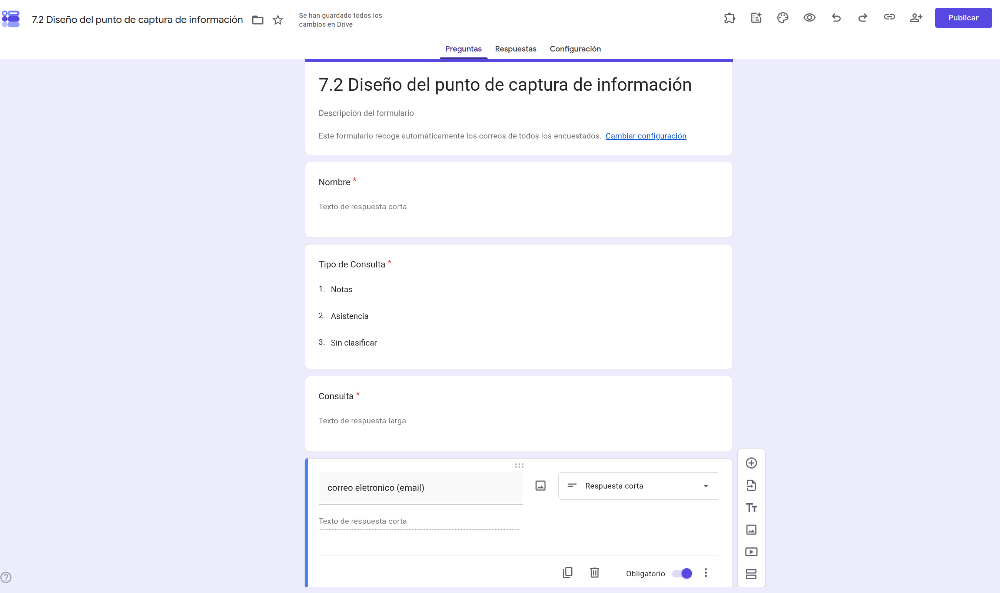
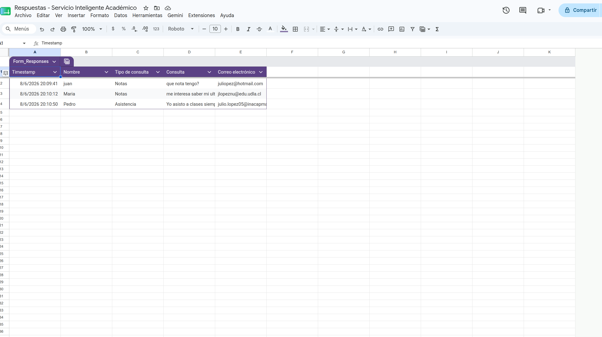

# Parte III

# Integración del asistente con herramientas de productividad

---

# Capítulo 7

# Integración del asistente con Google Forms

## 7.1 Arquitectura del flujo de entrada

### Objetivo

Comprender cómo un asistente inteligente puede integrarse con herramientas de productividad para recibir información desde usuarios externos, identificando el papel que desempeña cada componente dentro del flujo de entrada de datos.

---

### Tiempo estimado

**15 minutos**

---

### Requisitos previos

Antes de comenzar este capítulo deberá haber completado íntegramente:

- Parte I – Construcción del entorno local.
- Parte II – Diseño e implementación de asistentes inteligentes.

Además, se asume que el lector posee conocimientos básicos sobre:

- creación de formularios en Google Forms;
- uso de Google Sheets;
- navegación general en Google Workspace.

El propósito de este capítulo no es enseñar estas herramientas, sino integrarlas con el asistente inteligente desarrollado anteriormente.

---

### Procedimiento

Hasta este momento el asistente ha sido utilizado directamente desde Open WebUI.

En un escenario real, los usuarios normalmente no interactúan con Open WebUI, sino mediante aplicaciones o formularios que capturan la información necesaria para posteriormente ser procesada por el asistente.

En este capítulo se construirá el primer flujo de integración entre el asistente inteligente y una herramienta de productividad.

---

## Arquitectura general

El flujo que se implementará durante este capítulo será el siguiente.

```text
                 Usuario
                    │
                    ▼
             Google Forms
                    │
                    ▼
            Google Sheets
```

Cada componente cumple una función específica.

| Componente | Función |
|------------|---------|
| Usuario | Ingresa la información requerida por el proceso. |
| Google Forms | Captura la información proporcionada por el usuario. |
| Google Sheets | Almacena automáticamente las respuestas recibidas. |

Durante este capítulo el flujo finalizará en Google Sheets.

En el siguiente capítulo se incorporará Google Apps Script para automatizar el procesamiento de esta información mediante el asistente inteligente.

---

## Punto de captura de información

Dentro de esta metodología, Google Forms representa el **punto de captura de información**.

Su objetivo consiste únicamente en recopilar los datos que posteriormente serán procesados por el asistente inteligente.

Por esta razón, el diseño del formulario será deliberadamente simple.

No se busca desarrollar formularios complejos, sino disponer de un mecanismo confiable para capturar información.

> El formulario no contiene inteligencia. Su única responsabilidad consiste en capturar información de manera estructurada para que posteriormente pueda ser procesada por el asistente inteligente.

---

## Caso de estudio

Durante toda la Parte III se utilizará el mismo caso de estudio desarrollado en los capítulos anteriores.

El asistente inteligente continuará desempeñando el rol de **asistente académico**.

Para ello se empleará un formulario compuesto por cuatro campos.

| Campo | Tipo de dato | Propósito |
|---------|--------------|-----------|
| Nombre | Texto corto | Personalizar la respuesta. |
| Tipo de consulta | Lista desplegable | Clasificar la solicitud recibida. |
| Consulta | Texto largo | Contenido que será analizado por el asistente. |
| Correo electrónico | Correo electrónico | Destino de la respuesta automática. |

Esta estructura será suficiente para implementar todo el flujo de integración presentado en los capítulos siguientes.

---

## Alcance del capítulo

Al finalizar este capítulo el estudiante habrá construido un flujo capaz de:

- capturar información desde un formulario;
- almacenar automáticamente las respuestas en Google Sheets;
- verificar la integridad de los datos recibidos;
- preparar la información para su posterior procesamiento.

La automatización del flujo será desarrollada íntegramente en el Capítulo 8.

---

💡 **Nota técnica 7.1**

Aunque en este manual se utiliza Google Forms como mecanismo de captura, la metodología propuesta es independiente de la herramienta utilizada.

En otros proyectos el punto de captura podría implementarse mediante una aplicación web, una aplicación móvil, Microsoft Forms o cualquier otro sistema capaz de recopilar información estructurada.

---

### Verificación

Complete la siguiente tabla.

| Pregunta                                                                    | Sí  | No  |
| --------------------------------------------------------------------------- | :-: | :-: |
| Comprendo la arquitectura del flujo de entrada.                             |  ☐  |  ☐  |
| Comprendo la función de Google Forms dentro del proceso.                    |  ☐  |  ☐  |
| Comprendo el papel de Google Sheets como repositorio de las solicitudes.    |  ☐  |  ☐  |
| Comprendo que la automatización será desarrollada en el siguiente capítulo. |  ☐  |  ☐  |

---

### Problemas frecuentes

#### Intento diseñar un formulario complejo.

No es necesario.

El objetivo consiste en implementar un flujo de integración, no en desarrollar un formulario completo.

---

#### Intento conectar Open WebUI directamente con Google Forms.

Durante este capítulo no existirá comunicación directa entre ambos componentes.

La integración será incorporada en el Capítulo 8 mediante Google Apps Script, un puente local desarrollado en Python y Ollama.

---

#### No comprendo por qué utilizar Google Sheets.

Google Sheets actuará como repositorio intermedio, permitiendo registrar las respuestas antes de que sean procesadas automáticamente.

---

### Buenas prácticas

- Diseñe formularios simples y orientados al proceso.
- Capture únicamente la información necesaria.
- Mantenga una estructura de datos consistente.
- Comprenda el flujo completo antes de comenzar la implementación.

---

### Checklist

Antes de continuar confirme que:

☐ Comprende la arquitectura del flujo.

☐ Comprende el rol de cada componente.

☐ Comprende el caso de estudio.

☐ Está preparado para construir el punto de captura de información.

---

## 7.2 Diseño del punto de captura de información

### Objetivo

Diseñar un punto de captura de información que permita recopilar los datos mínimos necesarios para que el asistente inteligente pueda procesar posteriormente una solicitud del usuario.

---

### Tiempo estimado

**20 minutos**

---

### Requisitos previos

Antes de comenzar esta sección deberá haber completado:

- Sección 7.1 – Arquitectura del flujo de entrada.

Se asume además que el lector sabe crear un formulario básico en Google Forms y vincularlo con Google Sheets.

---

### Procedimiento

Antes de crear cualquier formulario es necesario definir qué información requiere realmente el asistente inteligente.

Uno de los errores más frecuentes consiste en solicitar más información de la necesaria.

En esta metodología se aplicará el principio de **captura mínima de información**, que consiste en recopilar únicamente aquellos datos indispensables para que el asistente pueda generar una respuesta útil.

---

## Paso 1. Identificar la información necesaria

Revise la especificación técnica del asistente desarrollada en la Parte II.

Pregúntese:

> ¿Qué información necesita el asistente para responder correctamente?

Para el caso de estudio de este manual se determinó que únicamente serán necesarios cuatro datos.

---

## Paso 2. Definir los campos del formulario

Diseñe un formulario compuesto por los siguientes campos.

| Campo | Tipo de dato | Obligatorio |
|---------|--------------|:-----------:|
| Nombre | Texto corto | Sí |
| Tipo de consulta | Lista desplegable | Sí |
| Consulta | Texto largo | Sí |
| Correo electrónico | Correo electrónico | Sí |

No agregue campos adicionales.

El objetivo consiste en construir un flujo simple que facilite el aprendizaje del proceso completo.

---

## Paso 3. Definir el propósito de cada campo

Cada dato capturado tendrá una función específica dentro del flujo de integración.

| Campo | Utilización posterior |
|---------|----------------------|
| Nombre | Personalizar la respuesta del asistente. |
| Tipo de consulta | Clasificar la solicitud recibida. |
| Consulta | Información que será analizada por el asistente inteligente. |
| Correo electrónico | Destino de la respuesta automática generada por el sistema. |

Esta definición facilitará el desarrollo de la automatización en el capítulo siguiente.

---

## Paso 4. Configurar el formulario

Utilizando Google Forms:

- cree un formulario nuevo;
- incorpore los cuatro campos definidos;
- marque todos los campos como obligatorios;
- vincule el formulario con una hoja de cálculo de Google Sheets.

No es necesario personalizar colores, imágenes, temas o configuraciones avanzadas.

El interés de este manual se centra en el flujo de integración y no en el diseño visual del formulario.

<p align="center">
  
</p>


---

## Paso 5. Revisar la estructura del flujo

Una vez configurado el formulario, verifique que el proceso queda representado de la siguiente forma.

```text
Usuario

↓

Google Forms

↓

Google Sheets
```

En este punto todavía no existe procesamiento mediante Inteligencia Artificial.

El formulario únicamente captura la información y la almacena.

---

💡 **Nota técnica 7.2**

Un formulario bien diseñado solicita únicamente la información necesaria para cumplir el objetivo del proceso.

Reducir la cantidad de campos mejora la experiencia del usuario y simplifica la automatización posterior.

---

### Verificación

Complete la siguiente tabla.

| Verificación | Estado |
|--------------|:------:|
| El formulario contiene únicamente cuatro campos | ☐ |
| Todos los campos son obligatorios | ☐ |
| El formulario está vinculado con Google Sheets | ☐ |
| Comprendo el propósito de cada dato capturado | ☐ |

---

### Problemas frecuentes

#### Agregué demasiados campos.

Revise nuevamente el objetivo del proceso.

Capture únicamente la información necesaria para que el asistente pueda responder.

---

#### El formulario incluye preguntas que nunca serán utilizadas.

Elimine aquellos campos que no participarán en el flujo automatizado.

---

#### Personalicé excesivamente el formulario.

El diseño visual no constituye el objetivo de este manual.

Priorice la funcionalidad del proceso.

---

### Buenas prácticas

- Capture únicamente la información necesaria.
- Mantenga formularios simples.
- Utilice nombres claros para los campos.
- Diseñe pensando en el procesamiento posterior de los datos.

---

### Checklist

Antes de continuar confirme que:

☐ El punto de captura fue diseñado.

☐ El formulario contiene los cuatro campos definidos.

☐ Google Sheets quedó vinculado correctamente.

☐ El flujo está preparado para recibir información.

---

## 7.3 Verificación del almacenamiento de datos

### Objetivo

Verificar que la información capturada mediante Google Forms se almacena correctamente en Google Sheets y comprender cómo esta estructura de datos será utilizada posteriormente por el proceso de automatización.

---

### Tiempo estimado

**20 minutos**

---

### Requisitos previos

Antes de comenzar esta sección deberá haber completado:

- Sección 7.2 – Diseño del punto de captura de información.

Además, el formulario deberá encontrarse vinculado correctamente a una hoja de cálculo de Google Sheets.

---

### Procedimiento

Una vez diseñado el punto de captura de información, el siguiente paso consiste en comprobar que los datos ingresados por los usuarios se almacenan correctamente.

En esta etapa todavía no existirá procesamiento mediante Inteligencia Artificial.

El objetivo consiste únicamente en garantizar la integridad de los datos que posteriormente serán utilizados por el asistente.

---

## Paso 1. Enviar una respuesta de prueba

Abra el formulario creado en la sección anterior.

Complete todos los campos utilizando información de prueba.

Por ejemplo.

| Campo | Valor de ejemplo |
|--------|------------------|
| Nombre | Juan Pérez |
| Tipo de consulta | Contenidos |
| Consulta | ¿Qué diferencia existe entre un modelo de lenguaje y un asistente inteligente? |
| Correo electrónico | juan@email.com |

Envíe el formulario.

---

## Paso 2. Verificar el registro en Google Sheets

Abra la hoja de cálculo vinculada al formulario.

Compruebe que la respuesta fue registrada automáticamente.

Debería observar una estructura similar a la siguiente.

| Marca temporal | Nombre | Tipo de consulta | Consulta | Correo electrónico |
|----------------|---------|------------------|-----------|--------------------|
| ... | ... | ... | ... | ... |

Cada fila representa una nueva solicitud realizada por un usuario.

<p align="center">
  
</p>
---

## Paso 3. Comprender la estructura de los datos

Observe que Google Sheets almacena cada respuesta siguiendo una estructura tabular.

En esta metodología:

- cada fila representa una solicitud;
- cada columna representa un atributo de la solicitud.

Esta organización facilitará el procesamiento automático mediante Google Apps Script.

---

## Paso 4. Verificar la calidad de los datos

Revise que:

- no existan celdas vacías;
- los valores correspondan al tipo de dato esperado;
- los textos no presenten errores evidentes;
- el correo electrónico haya sido registrado correctamente.

Detectar errores en esta etapa evitará problemas durante la automatización.

---

## Paso 5. Preparar la hoja para la automatización

No modifique:

- el nombre de las columnas;
- el orden de las columnas;
- la estructura de la hoja.

El script desarrollado en el Capítulo 8 utilizará esta estructura para identificar la información que deberá enviar al asistente inteligente.

---

💡 **Nota técnica 7.3**

Considere la hoja de cálculo como una fuente de datos.

Cualquier modificación en su estructura podría afectar el funcionamiento del proceso automatizado que se desarrollará posteriormente.

---

### Verificación

Complete la siguiente tabla.

| Verificación | Estado |
|--------------|:------:|
| La respuesta se almacenó correctamente | ☐ |
| Todos los campos fueron registrados | ☐ |
| La estructura de la hoja permanece intacta | ☐ |
| Comprendo que cada fila representa una solicitud | ☐ |

---

### Problemas frecuentes

#### La respuesta no aparece en Google Sheets.

Verifique que el formulario se encuentra correctamente vinculado a la hoja de cálculo correspondiente.

---

#### Modifiqué el nombre de las columnas.

Restablezca la estructura original antes de continuar.

Los nombres de las columnas serán utilizados durante la automatización.

---

#### Eliminé registros de prueba.

Realice un nuevo envío desde el formulario.

Las respuestas podrán recrearse fácilmente.

---

#### Existen datos incompletos.

Revise que todos los campos del formulario sean obligatorios y vuelva a realizar la prueba.

---

### Buenas prácticas

- Mantenga una estructura de datos consistente.
- Evite modificar manualmente las columnas generadas por Google Forms.
- Realice siempre pruebas utilizando datos ficticios o representativos del escenario de uso.
- Verifique la integridad de la información antes de automatizar el proceso.

---

### Checklist

Antes de continuar confirme que:

☐ El formulario registra correctamente las respuestas.

☐ Google Sheets almacena la información sin errores.

☐ La estructura de la hoja está completa.

☐ El flujo de captura está preparado para la siguiente etapa.

---

## 7.4 Validación del flujo de captura de información

### Objetivo

Validar el funcionamiento completo del flujo de captura de información, verificando que las solicitudes enviadas por los usuarios sean registradas correctamente y que los datos se encuentren preparados para su procesamiento automático.

---

### Tiempo estimado

**20 minutos**

---

### Requisitos previos

Antes de comenzar esta sección deberá haber completado:

- Sección 7.3 – Verificación del almacenamiento de datos.

Además, el formulario y la hoja de cálculo deberán encontrarse funcionando correctamente.

---

### Procedimiento

Hasta este momento se ha comprobado que el formulario captura información y que Google Sheets la almacena correctamente.

En esta sección se validará el funcionamiento del proceso completo, simulando el comportamiento que tendría el sistema en un escenario de uso.

El propósito consiste en garantizar que la información llegue correctamente hasta el punto donde comenzará la automatización desarrollada en el Capítulo 8.

---

## Paso 1. Ejecutar múltiples pruebas

Realice al menos tres envíos utilizando diferentes valores.

Por ejemplo.

| Prueba | Tipo de consulta | Resultado esperado |
|---------|------------------|--------------------|
| 1 | Contenidos | Registro correcto |
| 2 | Evaluaciones | Registro correcto |
| 3 | Calendario | Registro correcto |

Cada envío deberá generar una nueva fila en Google Sheets.

---

## Paso 2. Verificar la consistencia de los datos

Revise que todas las respuestas:

- mantengan el mismo formato;
- respeten los tipos de datos definidos;
- no presenten registros incompletos;
- conserven el orden de las columnas.

La estructura deberá permanecer idéntica en todas las respuestas recibidas.

---

## Paso 3. Analizar la calidad del flujo

Observe el comportamiento del proceso.

Pregúntese:

- ¿Toda la información llega correctamente?
- ¿Existen datos innecesarios?
- ¿Falta algún dato importante?
- ¿El formulario resulta sencillo de completar?

Documente cualquier observación.

---

## Paso 4. Confirmar la preparación para la automatización

Verifique que Google Sheets contiene toda la información necesaria para construir posteriormente una solicitud dirigida al asistente inteligente.

En este punto la hoja de cálculo deberá representar fielmente cada solicitud realizada por un usuario.

---

## Paso 5. Registrar la validación

Complete la siguiente tabla.

| Aspecto evaluado | Resultado | Observaciones |
|------------------|:---------:|--------------|
| Captura de datos | ☐ | |
| Almacenamiento | ☐ | |
| Integridad de la información | ☐ | |
| Consistencia del formato | ☐ | |
| Preparación para automatización | ☐ | |

---

💡 **Nota técnica 7.4**

Una automatización solamente será tan confiable como los datos que recibe.

Validar el flujo de captura antes de desarrollar el código reducirá considerablemente los problemas durante la integración con Google Apps Script.

---

### Verificación

Complete la siguiente tabla.

| Pregunta | Sí | No |
|----------|:--:|:--:|
| El flujo captura correctamente todas las respuestas. | ☐ | ☐ |
| Los datos mantienen una estructura consistente. | ☐ | ☐ |
| Google Sheets contiene toda la información necesaria. | ☐ | ☐ |
| El proceso está preparado para automatizarse. | ☐ | ☐ |

---

### Problemas frecuentes

#### Algunas respuestas presentan información incompleta.

Revise que todos los campos definidos como obligatorios continúan configurados correctamente.

---

#### La estructura cambia entre distintas pruebas.

Verifique que no se hayan realizado modificaciones manuales sobre la hoja de cálculo.

---

#### Existen datos que nunca serán utilizados.

Simplifique el formulario.

Recuerde el principio de captura mínima de información.

---

#### El flujo funciona correctamente con una prueba, pero falla con varias.

Repita la validación utilizando distintos valores antes de continuar con la automatización.

---

### Buenas prácticas

- Realice varias pruebas antes de automatizar.
- Utilice datos representativos.
- Mantenga una estructura uniforme.
- Documente cualquier comportamiento inesperado.

---

### Checklist

Antes de continuar confirme que:

☐ El flujo fue validado mediante varias pruebas.

☐ La información presenta una estructura consistente.

☐ Los datos están preparados para ser procesados.

☐ El sistema está listo para iniciar la automatización.

---

## 7.5 Preparación de los datos para el procesamiento

### Objetivo

Identificar y preparar los datos que posteriormente serán utilizados por Google Apps Script para construir la solicitud que será enviada al asistente inteligente.

---

### Tiempo estimado

**20 minutos**

---

### Requisitos previos

Antes de comenzar esta sección deberá haber completado:

- Sección 7.4 – Validación del flujo de captura de información.

Además, el formulario deberá registrar correctamente las respuestas en Google Sheets.

---

### Procedimiento

Hasta este momento la información capturada por el formulario se encuentra almacenada correctamente.

El siguiente paso consiste en identificar cuáles de esos datos serán utilizados durante el proceso de automatización.

No toda la información almacenada necesariamente será enviada al asistente inteligente.

Por ello es importante distinguir entre:

- datos capturados;
- datos utilizados;
- datos generados posteriormente por el sistema.

---

## Paso 1. Revisar la estructura de la hoja de cálculo

Abra la hoja de respuestas de Google Sheets.

Identifique las columnas generadas automáticamente por el formulario.

Una estructura típica será similar a la siguiente.

| Columna | Origen |
|----------|--------|
| Marca temporal | Google Forms |
| Nombre | Usuario |
| Tipo de consulta | Usuario |
| Consulta | Usuario |
| Correo electrónico | Usuario |

Cada columna representa un atributo de la solicitud.

---

## Paso 2. Identificar los datos que utilizará el asistente

Analice cuáles de los campos serán utilizados durante el procesamiento.

Para el caso de estudio de este manual:

| Campo | Utilización |
|--------|-------------|
| Nombre | Personalizar la respuesta. |
| Tipo de consulta | Proporcionar contexto adicional. |
| Consulta | Contenido principal que analizará el asistente. |

Observe que el correo electrónico no será enviado al asistente.

Su función será utilizada posteriormente para enviar la respuesta al usuario.

---

## Paso 3. Identificar los datos utilizados por la automatización

Existen datos que no forman parte de la consulta, pero sí serán necesarios para el funcionamiento del proceso.

Por ejemplo.

| Campo | Utilización |
|--------|-------------|
| Correo electrónico | Destino del mensaje generado por el asistente. |
| Marca temporal | Registro de la solicitud. |

Estos campos serán utilizados por Google Apps Script durante la automatización.

---

## Paso 4. Definir el conjunto mínimo de información

El asistente únicamente necesita la información necesaria para comprender la solicitud.

En este caso:

```text
Nombre

Tipo de consulta

Consulta
```

Esta será la información utilizada para construir la petición dirigida al asistente inteligente.

---

## Paso 5. Documentar el flujo de datos

El flujo de información quedará definido de la siguiente forma.

```text
Usuario

↓

Google Forms

↓

Google Sheets

↓

Datos seleccionados

↓

(Procesamiento en Capítulo 8)
```

Esta representación permitirá comprender claramente qué información será utilizada en las siguientes etapas.

---

💡 **Nota técnica 7.5**

Evite enviar al asistente información que no aporte valor a la generación de la respuesta.

Reducir la cantidad de datos procesados simplifica el flujo, mejora su mantenibilidad y disminuye el riesgo de utilizar información innecesaria.

---

### Verificación

Complete la siguiente tabla.

| Verificación | Estado |
|--------------|:------:|
| Identifiqué los datos capturados | ☐ |
| Distinguí los datos utilizados por el asistente | ☐ |
| Identifiqué los datos utilizados por la automatización | ☐ |
| Documenté el flujo de información | ☐ |

---

### Problemas frecuentes

#### Todos los datos parecen necesarios.

Analice si cada campo será realmente utilizado por el asistente o por la automatización.

Si no participa en ninguno de estos procesos, probablemente no sea necesario.

---

#### No comprendo por qué el correo electrónico no se envía al asistente.

El correo electrónico será utilizado únicamente para entregar la respuesta generada.

No aporta información al análisis de la consulta.

---

#### Confundo los datos del usuario con los datos del proceso.

Recuerde que algunos campos describen la consulta y otros permiten gestionar el flujo automatizado.

Ambos cumplen funciones distintas.

---

### Buenas prácticas

- Envíe al asistente únicamente la información necesaria.
- Diferencie claramente los datos de negocio de los datos del proceso.
- Mantenga documentado el flujo de información.
- Evite incorporar datos redundantes.

---

### Checklist

Antes de continuar confirme que:

☐ Identificó los datos relevantes para el asistente.

☐ Identificó los datos necesarios para la automatización.

☐ Comprende el flujo de información.

☐ La estructura está preparada para el Capítulo 8.

---

## 7.6 Consolidación del flujo de captura

### Objetivo

Consolidar la integración del asistente inteligente con Google Forms y Google Sheets, actualizar la documentación técnica del proyecto y registrar el estado actual de su desarrollo, dejando preparada la infraestructura para la automatización mediante Google Apps Script.

---

### Tiempo estimado

**15 minutos**

---

### Requisitos previos

Antes de comenzar esta sección deberá haber completado:

- Sección 7.5 – Preparación de los datos para el procesamiento.

Además, el flujo de captura deberá encontrarse completamente validado.

---

### Procedimiento

Durante este capítulo se incorporó una nueva capacidad al proyecto: la captura estructurada de información mediante Google Forms y su almacenamiento automático en Google Sheets.

Esta funcionalidad representa un cambio importante en la arquitectura del sistema y constituye un nuevo avance en el desarrollo del proyecto.

---

## Paso 1. Revisar la arquitectura del proyecto

Compruebe que el flujo implementado corresponde a la siguiente arquitectura.

```text
                Usuario
                   │
                   ▼
            Google Forms
                   │
                   ▼
            Google Sheets
```

En esta etapa todavía no existe automatización mediante Inteligencia Artificial.

La información únicamente se captura y almacena de manera estructurada.

---

## Paso 2. Actualizar la documentación técnica

Verifique que los siguientes documentos reflejan el estado actual del proyecto.

- Especificación técnica del asistente.
- Historial de evolución.
- Registro de validación.
- Arquitectura del sistema.
- Plan de desarrollo.

Toda la documentación deberá encontrarse sincronizada.

> Para complementar el contenido desarrollado en esta sección, consulte el Manual del Proyecto Integrador, donde encontrará las plantillas y documentos de apoyo correspondientes.

---

## Paso 3. Registrar el estado actual del proyecto

Complete la ficha de versión.

|Elemento|Descripción|
|---|---|
|Nombre del proyecto|Servicio Inteligente Académico|
|Estado|Flujo de captura validado|
|Fecha||
|Responsable||

---

## Paso 4. Registrar las capacidades incorporadas

Documente las nuevas funcionalidades disponibles.

| Capacidad | Estado |
|------------|:------:|
| Captura mediante Google Forms | ✔ |
| Almacenamiento en Google Sheets | ✔ |
| Validación del flujo de entrada | ✔ |
| Preparación para automatización | ✔ |

Estas capacidades representan el estado actual de desarrollo del proyecto.

---

## Paso 5. Definir la hoja de ruta

Registre las funcionalidades que serán desarrolladas en la siguiente etapa del proyecto.

| Funcionalidad                                     | Etapa prevista |
| ------------------------------------------------- | -------------- |
| Recuperación automática de solicitudes pendientes | Automatización |
| Integración mediante Google Apps Script           | Automatización |
| Procesamiento local mediante Python y Ollama      | Automatización |
| Envío automático de respuestas por Gmail          | Automatización |

Esta planificación facilitará la continuidad del desarrollo.

---

💡 **Nota técnica 7.6**

La incorporación de nuevas capacidades debe quedar registrada en la documentación técnica del proyecto.

En este caso, el mecanismo estructurado de captura de información modifica la arquitectura del proyecto y constituye un avance relevante que debe quedar documentado antes de continuar con la automatización.

---

### Verificación

Complete la siguiente tabla.

| Verificación                                     | Estado |
| ------------------------------------------------ | :----: |
| El flujo de captura funciona correctamente       |   ☐    |
| La documentación fue actualizada                 |   ☐    |
| El estado actual del proyecto quedó registrado.  |   ☐    |
| Existe una hoja de ruta para la siguiente etapa. |   ☐    |

---

### Problemas frecuentes

#### La documentación no coincide con la arquitectura actual.

Actualice todos los documentos antes de registrar la nueva versión.

---

#### El flujo de captura aún presenta errores.

No continúe con la siguiente etapa del proyecto.

Corrija los problemas detectados y repita la validación.

---

#### No definí las funcionalidades futuras.

Complete la hoja de ruta antes de continuar con el siguiente capítulo.

Esto facilitará mantener la continuidad del proyecto.

---

### Buenas prácticas

- Libere únicamente versiones completamente verificadas.
- Mantenga sincronizada la documentación técnica.
- Documente las capacidades incorporadas.
- Planifique la evolución del sistema antes de implementar nuevas funcionalidades.

---

### Checklist

Antes de finalizar el capítulo confirme que:

☐ El flujo de captura fue implementado y validado.

☐ Google Forms y Google Sheets funcionan correctamente.

☐ La documentación técnica está actualizada.

☐ El estado actual del proyecto fue registrado.

☐ El proyecto está preparado para iniciar la automatización.

---

# Resumen del capítulo

En este capítulo usted:

✔ Comprendió la arquitectura del flujo de entrada de información.

✔ Diseñó un punto de captura utilizando Google Forms.

✔ Verificó el almacenamiento automático en Google Sheets.

✔ Validó el funcionamiento del flujo de captura.

✔ Identificó los datos que serán utilizados durante el procesamiento.

✔ Consolidó la integración con herramientas de productividad.

✔ Documentó el estado actual del proyecto y su hoja de ruta.

Al finalizar este capítulo el sistema ya es capaz de capturar solicitudes mediante el formulario y almacenarlas de manera estructurada. Sin embargo, dichas solicitudes todavía no son procesadas por el asistente inteligente. La automatización de este proceso constituye el objetivo del siguiente capítulo, donde Google Apps Script permitirá gestionar las solicitudes almacenadas en Google Workspace y un puente local desarrollado en Python realizará la comunicación con Ollama para generar las respuestas.

---

## Próximo capítulo

En el **Capítulo 8 – Automatización del asistente inteligente mediante Google Apps Script y Ollama** desarrollará el flujo completo de procesamiento. Aprenderá a gestionar automáticamente la información almacenada en Google Sheets, recuperar las solicitudes mediante un puente local desarrollado en Python, procesarlas con Ollama y enviar la respuesta al usuario mediante Gmail.

---

# Fin del Capítulo 7

**Capítulo siguiente: Automatización mediante Google Apps Script**
