# Capítulo 8

# Automatización del asistente inteligente mediante Google Apps Script y Ollama

## 8.1 Arquitectura del flujo automatizado

### Objetivo

Comprender la arquitectura del servicio inteligente que se implementará durante este capítulo, identificando el papel que desempeña cada componente dentro del proceso automatizado.

---

### Tiempo estimado

**15 minutos**

---

### Requisitos previos

Antes de comenzar este capítulo deberá haber completado íntegramente:

- Capítulo 7 – Integración del asistente con Google Forms.

Además, deberá disponer de:

- un asistente inteligente funcional en Open WebUI;
- un formulario operativo en Google Forms;
- una hoja de respuestas correctamente vinculada en Google Sheets.

---

### Procedimiento

Hasta este momento el proyecto es capaz de capturar solicitudes provenientes de usuarios y almacenarlas en Google Sheets.

Sin embargo, la información permanece almacenada sin ser procesada.

En este capítulo se incorporará un nuevo componente denominado **Google Apps Script**, cuya función será coordinar automáticamente el intercambio de información entre Google Workspace y el asistente inteligente.

---

## Arquitectura del servicio inteligente

La arquitectura completa será la siguiente.

```text
                    Usuario
                        │
                        ▼
                 Google Forms
                        │
                        ▼
                Google Sheets
                        │
                        ▼
             Google Apps Script
                        │
                        ▼
            Puente local en Python
                        │
                        ▼
                     Ollama
                        │
                        ▼
             Modelo de lenguaje
                        │
                        ▼
             Google Apps Script
                        │
               ┌────────┴────────┐
               ▼                 ▼
        Google Sheets          Gmail
                                 │
                                 ▼
                              Usuario
```

El flujo comienza cuando un usuario envía un formulario y finaliza cuando recibe automáticamente una respuesta generada por el asistente inteligente.

---

## Función de cada componente

| Componente             | Función dentro del proceso                                                                          |
| ---------------------- | --------------------------------------------------------------------------------------------------- |
| Usuario                | Envía la solicitud mediante el formulario.                                                          |
| Google Forms           | Captura la información ingresada.                                                                   |
| Google Sheets          | Almacena las respuestas recibidas.                                                                  |
| Google Apps Script     | Coordina todo el proceso automatizado.                                                              |
| Gmail                  | Envía automáticamente la respuesta al usuario.                                                      |
| Puente local en Python | Recupera las solicitudes pendientes, las envía al modelo local y devuelve las respuestas generadas. |
| Ollama                 | Proporciona la API local utilizada para ejecutar el modelo de lenguaje.                             |
| Modelo de lenguaje     | Procesa la consulta y genera la respuesta.                                                          |
Cada componente posee una responsabilidad claramente definida.

---

## Flujo general del proceso

El funcionamiento del servicio inteligente será el siguiente.

### Etapa 1. Captura

El usuario completa el formulario.

---

### Etapa 2. Registro

Google Forms almacena automáticamente la información en Google Sheets.

---

### Etapa 3. Procesamiento

Google Apps Script detecta una nueva solicitud y recupera los datos necesarios.

---

### Etapa 4. Consulta al asistente

Google Apps Script pone a disposición la solicitud registrada para que pueda ser recuperada por el puente local desarrollado en Python.

El puente local construye la consulta y la envía a la API local de Ollama para su procesamiento.

---

### Etapa 5. Generación de la respuesta

El modelo de lenguaje genera una respuesta considerando las instrucciones permanentes del asistente inteligente, incorporadas por el puente local desde el archivo `system_prompt.txt`.

---

### Etapa 6. Entrega del resultado

Google Apps Script recibe la respuesta y la envía automáticamente al usuario mediante Gmail.

---

## Alcance del capítulo

Durante este capítulo se implementará completamente este flujo.

Al finalizar, el estudiante dispondrá de un servicio inteligente capaz de responder automáticamente consultas recibidas mediante Google Forms.

---

💡 **Nota técnica 8.1**

Google Apps Script actúa como un componente de integración entre Google Workspace y el proceso de automatización.

El puente local desarrollado en Python permite conectar este entorno con Ollama, que se ejecuta en el computador del participante.

Open WebUI continúa utilizándose para configurar y probar el asistente inteligente, pero no participa directamente en el flujo automatizado desarrollado en este capítulo.

---

### Verificación

Complete la siguiente tabla.

| Pregunta | Sí | No |
|----------|:--:|:--:|
| Comprendo la arquitectura completa del servicio inteligente. | ☐ | ☐ |
| Comprendo la función de Google Apps Script. | ☐ | ☐ |
| Comprendo cómo interactúan Open WebUI y Ollama. | ☐ | ☐ |
| Comprendo el recorrido completo de una solicitud. | ☐ | ☐ |

---

### Problemas frecuentes

#### No comprendo por qué es necesario Google Apps Script.

Google Forms y Google Sheets capturan y almacenan información, pero no pueden coordinar automáticamente el procesamiento de una solicitud.

Google Apps Script incorpora esa capacidad de integración.

---

#### Pienso que Google Apps Script reemplaza al asistente.

No es correcto.

Google Apps Script coordina el intercambio de información con Google Workspace, mientras que el procesamiento de las consultas se realiza localmente mediante Ollama y el modelo de lenguaje.

El puente local en Python permite comunicar ambos entornos.

---

#### Creo que Gmail genera las respuestas.

Gmail solamente entrega el resultado al usuario.

La respuesta siempre es generada por el asistente inteligente.

---

### Buenas prácticas

- Comprenda la arquitectura antes de comenzar a programar.
- Identifique claramente la responsabilidad de cada componente.
- Analice el flujo completo de información.
- No confunda integración con procesamiento.

---

### Checklist

Antes de continuar confirme que:

☐ Comprende la arquitectura del servicio.

☐ Comprende el recorrido completo de la información.

☐ Identifica la función de cada componente.

☐ Está preparado para diseñar el proceso de automatización.

---

## 8.2 Diseño del proceso de integración

### Objetivo

Diseñar el proceso de integración que permitirá conectar Google Workspace con el asistente inteligente, definiendo la secuencia de actividades que ejecutará Google Apps Script durante el procesamiento automático de una solicitud.

---

### Tiempo estimado

**20 minutos**

---

### Requisitos previos

Antes de comenzar esta sección deberá haber completado:

- Sección 8.1 – Arquitectura del flujo automatizado.

Además, deberá disponer de un formulario operativo y de una hoja de respuestas correctamente configurada.

---

### Procedimiento

Antes de desarrollar cualquier automatización es necesario definir con precisión el proceso que deberá ejecutar el sistema.

En esta sección no se escribirá código.

El objetivo consiste en diseñar la secuencia de actividades que posteriormente implementará Google Apps Script.

---

## Paso 1. Identificar el evento que inicia el proceso

Determine cuál será el evento que pondrá en marcha la automatización.

En este proyecto el proceso comenzará cuando exista una nueva respuesta registrada en Google Sheets.

Ese registro constituirá la entrada del servicio inteligente.

---

## Paso 2. Definir las entradas del proceso

Para cada nueva solicitud el sistema utilizará la siguiente información.

| Dato | Origen |
|------|--------|
| Nombre | Google Sheets |
| Tipo de consulta | Google Sheets |
| Consulta | Google Sheets |
| Correo electrónico | Google Sheets |

Cada uno de estos datos será recuperado automáticamente por Google Apps Script.

---

## Paso 3. Definir las actividades del proceso

El flujo de integración estará compuesto por las siguientes actividades.

1. Detectar una nueva solicitud registrada.
2. Recuperar la información correspondiente.
3. Poner la solicitud a disposición del puente local.
4. Recuperar la solicitud mediante el puente local en Python.
5. Construir la consulta dirigida al modelo de lenguaje.
6. Enviar la consulta a Ollama.
7. Recibir y registrar la respuesta generada.
8. Enviar la respuesta al usuario mediante Gmail.
9. Actualizar el estado de la solicitud.

Esta secuencia constituye el algoritmo general del servicio inteligente.

---

## Paso 4. Identificar las salidas del proceso

Una vez finalizada la ejecución deberán existir dos resultados.

| Resultado | Destino |
|-----------|---------|
| Respuesta enviada | Usuario |
| Solicitud procesada | Google Sheets |

Esto permitirá evitar que una misma solicitud sea procesada más de una vez.

---

## Paso 5. Representar el flujo

El algoritmo podrá resumirse mediante el siguiente esquema.

```text
Nueva respuesta

↓

Registrar solicitud

↓

Publicar solicitud mediante Apps Script

↓

Recuperar mediante puente local

↓

Consultar Ollama

↓

Registrar respuesta

↓

Enviar correo

↓

Actualizar estado
```

En las siguientes secciones cada una de estas actividades será implementada paso a paso.

---

💡 **Nota técnica 8.2**

Separar el diseño del proceso de su implementación facilita comprender el funcionamiento del sistema, simplifica la depuración y permite modificar el flujo sin depender inicialmente del código.

---

### Verificación

Complete la siguiente tabla.

| Verificación | Estado |
|--------------|:------:|
| Identifiqué el evento que inicia el proceso | ☐ |
| Definí las entradas del algoritmo | ☐ |
| Comprendí la secuencia de actividades | ☐ |
| Identifiqué las salidas del proceso | ☐ |

---

### Problemas frecuentes

#### Intento comenzar escribiendo código.

Antes de implementar cualquier automatización, asegúrese de comprender completamente el proceso que deberá ejecutar el sistema.

---

#### No identifico claramente el inicio del proceso.

Recuerde que la automatización comienza con la existencia de una nueva respuesta registrada en Google Sheets.

---

#### Confundo las entradas con las salidas.

Las entradas corresponden a la información capturada por el formulario.

Las salidas representan los resultados generados por el servicio inteligente.

---

### Buenas prácticas

- Diseñe primero el algoritmo.
- Identifique claramente entradas y salidas.
- Mantenga una secuencia lógica de actividades.
- No implemente código hasta comprender completamente el proceso.

---

### Checklist

Antes de continuar confirme que:

☐ Comprende el algoritmo del servicio inteligente.

☐ Identificó las entradas y salidas.

☐ Comprende el recorrido completo de la información.

☐ Está preparado para comenzar la implementación.

---

## 8.3 Preparación del entorno de automatización

### Objetivo

Crear y configurar el proyecto de Google Apps Script que permitirá implementar el proceso de integración diseñado en la sección anterior.

---

### Tiempo estimado

**20 minutos**

---

### Requisitos previos

Antes de comenzar esta sección deberá haber completado:

- Sección 8.2 – Diseño del proceso de integración.

Además, deberá disponer de:

- Google Forms operativo.
- Google Sheets vinculado al formulario.
- Cuenta Google con permisos para utilizar Google Apps Script.

---

### Procedimiento

Antes de desarrollar la automatización es necesario preparar el entorno donde se implementará el algoritmo de integración.

Durante esta sección se creará un proyecto de Google Apps Script asociado a la hoja de cálculo utilizada durante el capítulo anterior.

Todavía no se desarrollará el proceso completo.

El objetivo será disponer de un entorno correctamente configurado para comenzar la implementación.

---

## Paso 1. Abrir Google Sheets

Abra la hoja de cálculo vinculada al formulario creado anteriormente.

Compruebe que contiene al menos una respuesta de prueba.

---

## Paso 2. Crear el proyecto de Apps Script

Desde Google Sheets seleccione:

```text
Extensiones

↓

Apps Script
```

Google Workspace abrirá automáticamente un nuevo proyecto asociado a esa hoja de cálculo.

<p align="center">
  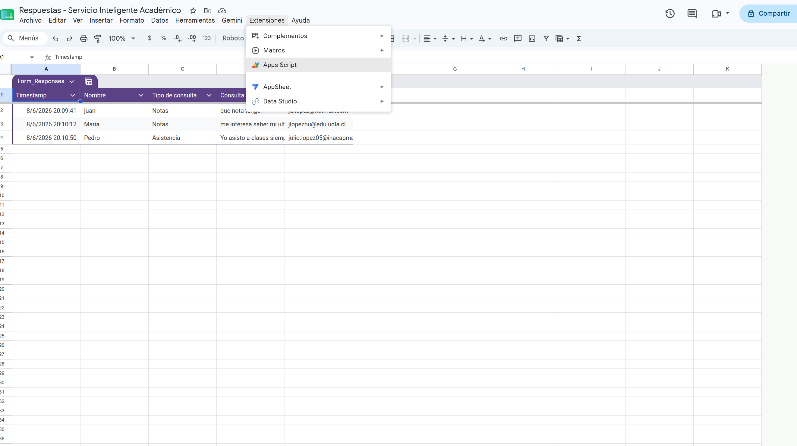
</p>

---

## Paso 3. Asignar un nombre al proyecto

Cambie el nombre predeterminado por uno representativo.

Por ejemplo.

```text
Servicio Inteligente Académico
```

Utilizar nombres descriptivos facilitará la administración de futuros proyectos.

---

## Paso 4. Familiarizarse con el entorno

Observe los principales elementos del editor.

- Explorador de archivos.
- Editor de código.
- Barra de herramientas.
- Registro de ejecución.
- Menú de implementación.

No es necesario modificar ninguna configuración adicional.

---

## Paso 5. Crear una función de prueba

Reemplace el contenido inicial del archivo `Code.gs` por el siguiente código.

```javascript
function pruebaConexion() {
  Logger.log("Proyecto preparado correctamente.");
}
```
	
Esta función permitirá comprobar que el entorno funciona correctamente antes de desarrollar el proceso completo.

---

## Paso 6. Ejecutar la función

Seleccione la función `pruebaConexion`.

Presione el botón **Ejecutar**.

La primera ejecución solicitará autorización para acceder a los recursos de Google Workspace.

Siga el asistente de autorización hasta finalizar el proceso.

---

## Paso 7. Revisar el registro de ejecución

Una vez finalizada la ejecución, abra el registro.

Deberá observar un mensaje similar a:

```text
Proyecto preparado correctamente.
```

Esto confirmará que el entorno de desarrollo se encuentra operativo.

---

💡 **Nota técnica 8.3**

La autorización otorgada durante esta primera ejecución permitirá que el proyecto interactúe posteriormente con Google Sheets y Gmail.

Si en el futuro incorpora nuevos servicios de Google Workspace, es posible que deba autorizar permisos adicionales.

---

### Verificación

Complete la siguiente tabla.

| Verificación | Estado |
|--------------|:------:|
| El proyecto fue creado correctamente | ☐ |
| El proyecto posee un nombre descriptivo | ☐ |
| La función de prueba se ejecutó correctamente | ☐ |
| Los permisos fueron autorizados | ☐ |

---

### Problemas frecuentes

#### Apps Script no aparece en el menú.

Verifique que la hoja de cálculo pertenece a una cuenta de Google con acceso a Google Workspace.

---

#### La ejecución solicita permisos.

Es el comportamiento esperado durante la primera ejecución.

Complete el proceso de autorización antes de continuar.

---

#### La función no aparece en la lista de ejecución.

Compruebe que el código fue guardado correctamente y que el nombre de la función coincide con el seleccionado.

---

#### No encuentro el registro de ejecución.

Utilice la opción **Registro de ejecución** disponible en el editor de Google Apps Script.

---

### Buenas prácticas

- Utilice nombres descriptivos para los proyectos.
- Ejecute siempre una función de prueba antes de desarrollar el proceso completo.
- Autorice únicamente los permisos necesarios.
- Mantenga un único proyecto asociado a cada solución.

---

### Checklist

Antes de continuar confirme que:

☐ El proyecto de Apps Script fue creado.

☐ El entorno funciona correctamente.

☐ La autorización fue completada.

☐ Está preparado para comenzar la implementación del algoritmo.

---

## 8.4 Implementación modular del proceso de integración

### Objetivo

Implementar el proceso de integración mediante funciones independientes y reutilizables, permitiendo construir el servicio inteligente de manera incremental y facilitando las pruebas de cada componente antes de integrarlos en un único flujo automatizado.

---

### Tiempo estimado

**45 minutos**

---

### Requisitos previos

Antes de comenzar esta sección deberá haber completado:

- Sección 8.3 – Preparación del entorno de automatización.

Además, deberá disponer del proyecto de Google Apps Script correctamente configurado.

---

### Procedimiento

El proceso de integración no será desarrollado como un único bloque de código.

En su lugar, se implementará mediante funciones independientes, cada una responsable de una tarea específica.

Este enfoque facilita:

- comprender el funcionamiento del sistema;
- reutilizar componentes;
- simplificar el mantenimiento;
- localizar errores durante las pruebas.

---

## Arquitectura del código

El proyecto estará compuesto por los siguientes módulos.

```text
Google Apps Script
│
├── leerSolicitud()
├── doGet()
├── doPost()
├── respuestaJson_()
└── enviarCorreo()

Puente local en Python
│
├── cargar_system_prompt()
├── obtener_solicitud()
├── construir_mensaje()
├── consultar_ollama()
├── registrar_respuesta()
└── procesar_una_solicitud()
```

La solución se dividirá en dos componentes de software: Google Apps Script administrará la interacción con Google Workspace, mientras que el puente local en Python coordinará la comunicación con Ollama. Cada función tendrá una responsabilidad específica dentro de estos componentes.

---

## Paso 1. Identificar los componentes de software

La implementación estará distribuida entre dos componentes.

**Google Apps Script** será responsable de recuperar las solicitudes almacenadas en Google Sheets, publicar la información para el puente local, recibir las respuestas generadas y posteriormente enviarlas mediante Gmail.

**Python** será responsable de recuperar las solicitudes disponibles, construir el mensaje, comunicarse con la API local de Ollama y devolver la respuesta generada.

Las funciones correspondientes se incorporarán progresivamente durante las siguientes secciones.

---
## Paso 2. Comprender la responsabilidad de cada módulo

Cada función tendrá un propósito claramente definido.

| Función                    | Componente  | Responsabilidad                                                          |
| -------------------------- | ----------- | ------------------------------------------------------------------------ |
| `leerSolicitud()`          | Apps Script | Recuperar una solicitud pendiente desde Google Sheets.                   |
| `doGet()`                  | Apps Script | Publicar la solicitud para que pueda ser recuperada por el puente local. |
| `doPost()`                 | Apps Script | Recibir la respuesta generada y actualizar la solicitud.                 |
| `respuestaJson_()`         | Apps Script | Construir las respuestas JSON del servicio.                              |
| `enviarCorreo()`           | Apps Script | Enviar la respuesta mediante Gmail.                                      |
| `cargar_system_prompt()`   | Python      | Cargar las instrucciones permanentes del asistente.                      |
| `obtener_solicitud()`      | Python      | Recuperar una solicitud desde Apps Script.                               |
| `construir_mensaje()`      | Python      | Construir el mensaje dirigido al modelo.                                 |
| `consultar_ollama()`       | Python      | Consultar la API local de Ollama.                                        |
| `registrar_respuesta()`    | Python      | Devolver la respuesta a Apps Script.                                     |
| `procesar_una_solicitud()` | Python      | Coordinar el procesamiento de una solicitud.                             |

Esta separación facilitará la implementación en las siguientes secciones.

---

## Paso 3. Definir el flujo principal

Una vez desarrolladas las funciones, los componentes ejecutarán estas operaciones en el orden correspondiente.

Conceptualmente, el flujo será el siguiente.

```text
leerSolicitud()
 → doGet()
  → obtener_solicitud()
   → construir_mensaje()
    → consultar_ollama()
     → registrar_respuesta()
      → doPost() → enviarCorreo()
```

En las siguientes secciones implementaremos cada módulo por separado.

---

💡 **Nota técnica 8.4**

Aplicar el principio de una única responsabilidad por función mejora la legibilidad del código, facilita las pruebas unitarias y simplifica futuras modificaciones del proyecto.

---

### Verificación

Complete la siguiente tabla.

| Verificación                                 | Estado |
|--------------|:------:|
| El flujo principal fue definido              | ☐ |
| Los módulos fueron definidos                 | ☐ |
| Comprendo la responsabilidad de cada función | ☐ |
| Comprendo el flujo general del programa      | ☐ |

---

### Problemas frecuentes

#### Intento escribir todo el código dentro de una única función.

Evite esta práctica.

Cada función debe resolver una única tarea específica.

---

#### No comprendo para qué sirve una función vacía.

Primero se define la arquitectura del programa.

Posteriormente se implementa el comportamiento de cada módulo.

---

#### Quiero implementar todas las funciones al mismo tiempo.

Desarrolle cada módulo por separado y verifique su funcionamiento antes de integrarlo con los demás.

---

### Buenas prácticas

- Diseñe funciones pequeñas y específicas.
- Utilice nombres descriptivos.
- Mantenga una única responsabilidad por función.
- Pruebe cada módulo de manera independiente.

---

### Checklist

Antes de continuar confirme que:

☐ La estructura general del proyecto fue creada.

☐ Los módulos están definidos.

☐ Comprende la función de cada componente.

☐ El proyecto está preparado para implementar el primer módulo.

---

## 8.5 Lectura de solicitudes desde Google Sheets

### Objetivo

Implementar el primer módulo funcional del servicio inteligente, recuperando automáticamente la información almacenada en Google Sheets y transformándola en una estructura de datos que pueda ser utilizada por el resto del proceso de integración.

---

### Tiempo estimado

**35 minutos**

---

### Requisitos previos

Antes de comenzar esta sección deberá haber completado:

- Sección 8.4 – Diseño de la arquitectura del código.

Además, deberá disponer de:

- un proyecto de Google Apps Script operativo;
- una hoja de cálculo vinculada al formulario;
- al menos una respuesta registrada en Google Sheets.

---

### Diseño de la solución

Hasta este momento el proyecto dispone de información almacenada en Google Sheets.

El objetivo de este módulo consiste en recuperar automáticamente la última solicitud registrada y transformarla en un objeto estructurado.

El flujo será el siguiente:

```text
Google Sheets

↓

leerSolicitud()

↓

Objeto solicitud
```

En esta sección todavía no existirá comunicación con Open WebUI ni con Ollama.

Únicamente se implementará la lectura de datos.

---

### Información que será recuperada

El módulo utilizará los siguientes campos:

| Campo | Utilización |
|---|---|
| Nombre | Personalizar posteriormente la respuesta. |
| Tipo de consulta | Proporcionar contexto al asistente. |
| Consulta | Contenido principal que analizará el asistente. |
| Correo electrónico | Enviar posteriormente la respuesta. |

La marca temporal permanecerá registrada en Google Sheets, pero no será incorporada inicialmente al objeto `solicitud`.

---

### Procedimiento

## Paso 1. Abrir el proyecto de Google Apps Script

Abra la hoja de cálculo vinculada al formulario.

Seleccione:

```text
Extensiones

↓

Apps Script
```

Abra el archivo:

```text
Code.gs
```

---

## Paso 2. Crear la función `leerSolicitud()`

Incorpore la siguiente estructura:

```javascript
function leerSolicitud() {

}
```

Esta función tendrá la responsabilidad de recuperar la última solicitud registrada en Google Sheets.

---

## Paso 3. Obtener la hoja activa

Dentro de la función incorpore el siguiente código:

```javascript
function leerSolicitud() {
  const hoja = SpreadsheetApp
    .getActiveSpreadsheet()
    .getActiveSheet();
}
```

La instrucción obtiene:

1. la hoja de cálculo asociada al proyecto;
2. la pestaña que se encuentra activa.

---

## Paso 4. Recuperar los registros

Agregue la siguiente línea:

```javascript
const datos = hoja.getDataRange().getValues();
```

La función quedará así:

```javascript
function leerSolicitud() {
  const hoja = SpreadsheetApp
    .getActiveSpreadsheet()
    .getActiveSheet();

  const datos = hoja.getDataRange().getValues();
}
```

El método `getValues()` devuelve una matriz con todas las filas y columnas utilizadas en la hoja.

La primera fila corresponde a los encabezados.

---

## Paso 5. Verificar que existen solicitudes

Incorpore una validación antes de continuar:

```javascript
if (datos.length <= 1) {
  Logger.log("No existen solicitudes registradas.");
  return null;
}
```

La función quedará así:

```javascript
function leerSolicitud() {
  const hoja = SpreadsheetApp
    .getActiveSpreadsheet()
    .getActiveSheet();

  const datos = hoja.getDataRange().getValues();

  if (datos.length <= 1) {
    Logger.log("No existen solicitudes registradas.");
    return null;
  }
}
```

Si la hoja contiene únicamente los encabezados, la función finalizará y devolverá `null`.

---

## Paso 6. Recuperar la última fila

Agregue la siguiente instrucción:

```javascript
const ultimaFila = datos[datos.length - 1];
```

Esta línea selecciona el último registro disponible en la hoja.

La función quedará así:

```javascript
function leerSolicitud() {
  const hoja = SpreadsheetApp
    .getActiveSpreadsheet()
    .getActiveSheet();

  const datos = hoja.getDataRange().getValues();

  if (datos.length <= 1) {
    Logger.log("No existen solicitudes registradas.");
    return null;
  }

  const ultimaFila = datos[datos.length - 1];
}
```

---

## Paso 7. Construir el objeto `solicitud`

Considere que la hoja utiliza el siguiente orden:

| Índice | Columna |
|---:|---|
| `0` | Marca temporal |
| `1` | Nombre |
| `2` | Tipo de consulta |
| `3` | Consulta |
| `4` | Correo electrónico |

Construya el objeto:

```javascript
const solicitud = {
  nombre: ultimaFila[1],
  tipo: ultimaFila[2],
  consulta: ultimaFila[3],
  correo: ultimaFila[4]
};
```

La función quedará así:

```javascript
function leerSolicitud() {
  const hoja = SpreadsheetApp
    .getActiveSpreadsheet()
    .getActiveSheet();

  const datos = hoja.getDataRange().getValues();

  if (datos.length <= 1) {
    Logger.log("No existen solicitudes registradas.");
    return null;
  }

  const ultimaFila = datos[datos.length - 1];

  const solicitud = {
    nombre: ultimaFila[1],
    tipo: ultimaFila[2],
    consulta: ultimaFila[3],
    correo: ultimaFila[4]
  };
}
```

El objeto permite trabajar con nombres descriptivos en lugar de utilizar continuamente posiciones numéricas.

---

## Paso 8. Retornar el objeto

Finalice la función con:

```javascript
return solicitud;
```

El código completo será:

```javascript
function leerSolicitud() {
  const hoja = SpreadsheetApp
    .getActiveSpreadsheet()
    .getActiveSheet();

  const datos = hoja.getDataRange().getValues();

  if (datos.length <= 1) {
    Logger.log("No existen solicitudes registradas.");
    return null;
  }

  const ultimaFila = datos[datos.length - 1];

  const solicitud = {
    nombre: ultimaFila[1],
    tipo: ultimaFila[2],
    consulta: ultimaFila[3],
    correo: ultimaFila[4]
  };

  return solicitud;
}
```

---

### Prueba del módulo

## Paso 1. Crear una función de prueba

Agregue una función independiente:

```javascript
function pruebaLectura() {
  const solicitud = leerSolicitud();

  Logger.log(solicitud);
}
```

El archivo `Code.gs` deberá contener:

```javascript
function leerSolicitud() {
  const hoja = SpreadsheetApp
    .getActiveSpreadsheet()
    .getActiveSheet();

  const datos = hoja.getDataRange().getValues();

  if (datos.length <= 1) {
    Logger.log("No existen solicitudes registradas.");
    return null;
  }

  const ultimaFila = datos[datos.length - 1];

  const solicitud = {
    nombre: ultimaFila[1],
    tipo: ultimaFila[2],
    consulta: ultimaFila[3],
    correo: ultimaFila[4]
  };

  return solicitud;
}

function pruebaLectura() {
  const solicitud = leerSolicitud();

  Logger.log(solicitud);
}
```

---

## Paso 2. Ejecutar la prueba

En la barra superior seleccione:

```text
pruebaLectura
```

Presione:

```text
Ejecutar
```

<p align="center">
  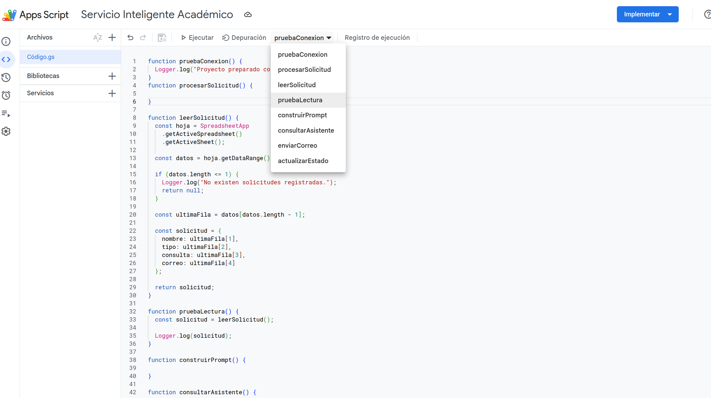
</p>

<p align="center">
  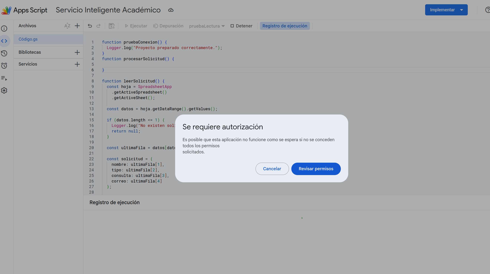
</p>

<p align="center">
  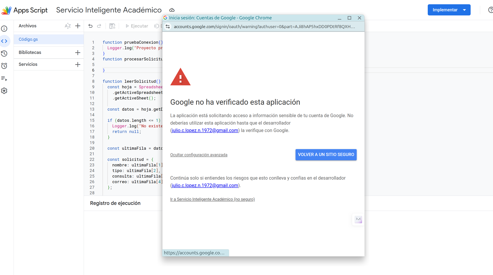
</p>

<p align="center">
  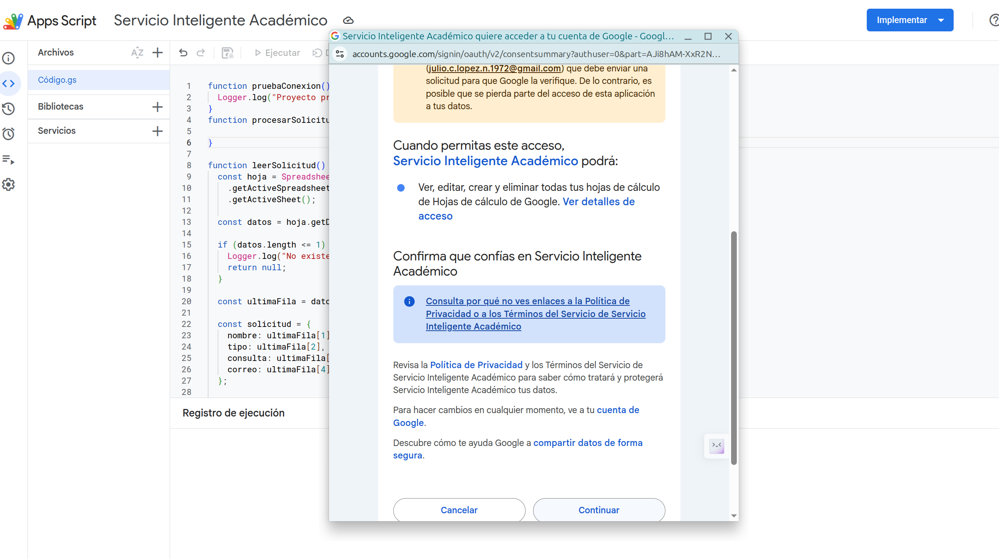
</p>
---

## Paso 3. Revisar el registro

Abra el registro de ejecución.

Deberá observar un resultado similar al siguiente:

```text
{
  nombre=Juan Pérez,
  tipo=Contenidos,
  consulta=¿Qué diferencia existe entre un modelo de lenguaje y un asistente inteligente?,
  correo=juan@email.com
}
```

Si los cuatro campos aparecen correctamente, el módulo funciona.

No continúe con la siguiente sección si la información está incompleta o desplazada.

<p align="center">
  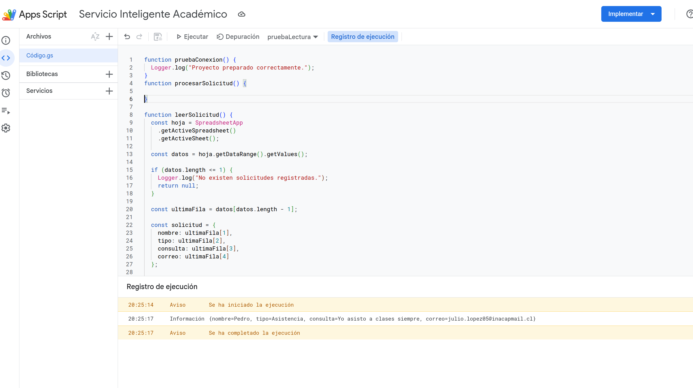
</p>
---

💡 **Nota técnica 8.5**

Esta versión inicial recupera únicamente la última fila registrada.

El propósito es facilitar el aprendizaje y comprobar el funcionamiento del módulo.

Posteriormente, el flujo podrá ampliarse para procesar múltiples solicitudes pendientes y distinguir registros procesados de registros nuevos.

---

### Verificación

Complete la siguiente tabla:

| Verificación | Estado |
|---|:---:|
| La hoja fue recuperada correctamente | ☐ |
| Se detectó la existencia de solicitudes | ☐ |
| Se recuperó la última fila | ☐ |
| El objeto `solicitud` contiene los cuatro campos | ☐ |
| La función devuelve correctamente el objeto | ☐ |
| La prueba se ejecutó sin errores | ☐ |

---

### Problemas frecuentes

#### La función devuelve `null`

Compruebe que la hoja contiene al menos una respuesta además de la fila de encabezados.

---

#### Los datos aparecen desplazados

Revise el orden de las columnas.

El código supone la siguiente estructura:

```text
Marca temporal

Nombre

Tipo de consulta

Consulta

Correo electrónico
```

Si el orden es diferente, deberá ajustar los índices utilizados en `ultimaFila`.

---

#### Se está leyendo una pestaña incorrecta

Verifique que la pestaña de respuestas se encuentre activa al ejecutar la función.

Como mejora futura, podrá reemplazarse `getActiveSheet()` por una referencia explícita al nombre de la hoja.

---

#### El registro aparece vacío

Confirme que ejecutó:

```text
pruebaLectura
```

y no únicamente:

```text
leerSolicitud
```

---

#### Aparece un error de autorización

Ejecute nuevamente la función y complete el proceso de autorización solicitado por Google Apps Script.

---

### Buenas prácticas

- Utilice nombres descriptivos para las propiedades del objeto.
- Compruebe la existencia de datos antes de procesarlos.
- Mantenga estable el orden de las columnas.
- Pruebe cada módulo antes de integrarlo.
- No modifique manualmente la estructura de la hoja durante el desarrollo.

---

### Checklist

Antes de continuar confirme que:

☐ La función `leerSolicitud()` fue creada.

☐ La función recupera la última fila registrada.

☐ El objeto `solicitud` contiene los datos esperados.

☐ La función `pruebaLectura()` se ejecutó correctamente.

☐ El registro muestra los cuatro campos de la solicitud.

☐ El primer módulo del servicio inteligente está operativo.

---

## ¿Qué aprendimos?

En esta sección implementó el primer módulo funcional del servicio inteligente.

Aprendió a recuperar información almacenada en Google Sheets mediante Google Apps Script y a transformarla en un objeto estructurado.

Este objeto será utilizado por los siguientes módulos para:

- construir la consulta;
- comunicarse con el asistente inteligente;
- enviar la respuesta;
- actualizar el estado del procesamiento.

---

## 8.6 Comunicación con el asistente mediante un puente local

### Objetivo

Implementar una arquitectura segura y funcional que permita intercambiar solicitudes entre Google Apps Script y el asistente ejecutado localmente en Ollama, utilizando un puente local desarrollado en Python.

---

### Tiempo estimado

**60 minutos**

---

### Requisitos previos

Antes de comenzar esta sección deberá haber completado:

- Sección 8.5 – Lectura de solicitudes desde Google Sheets.

Además, deberá disponer de:

- Ollama instalado y funcionando;
- un modelo de lenguaje disponible;
- Python instalado;
- proyecto de Google Apps Script operativo;
- hoja de respuestas vinculada al formulario;
- al menos una solicitud registrada.

---

### Consideración técnica

Google Apps Script se ejecuta en la infraestructura de Google.

Por este motivo, una instrucción como la siguiente no permite acceder al Ollama instalado en el computador del participante:

```javascript
UrlFetchApp.fetch("http://localhost:11434/api/chat");
```

En ese contexto, `localhost` no representa el computador del estudiante.

Para conservar el procesamiento local se utilizará la siguiente arquitectura:

```text
Google Sheets
      │
      ▼
Google Apps Script
      │
      ▼
Aplicación web de intercambio
      │
      ▼
Puente local en Python
      │
      ▼
API local de Ollama
      │
      ▼
Puente local en Python
      │
      ▼
Google Apps Script
      │
      ▼
Google Sheets
```

El puente local realizará tres tareas:

1. Consultar si existe una solicitud pendiente.
2. Enviar la consulta a Ollama.
3. Devolver la respuesta a Google Apps Script.


---

# Parte A. Preparación de Google Sheets

## Paso 1. Incorporar columnas de control

En la hoja vinculada al formulario agregue las siguientes columnas al final de la estructura existente:

| Columna | Propósito |
|---|---|
| Estado | Controlar el procesamiento de la solicitud. |
| Respuesta IA | Almacenar la respuesta generada. |
| Fecha de procesamiento | Registrar cuándo finalizó el proceso. |

La estructura resultante será similar a la siguiente:

| Marca temporal | Nombre | Tipo de consulta | Consulta | Correo electrónico | Estado | Respuesta IA | Fecha de procesamiento |
|---|---|---|---|---|---|---|---|

Para las respuestas existentes escriba en la columna **Estado**:

```text
PENDIENTE
```

<p align="center">
  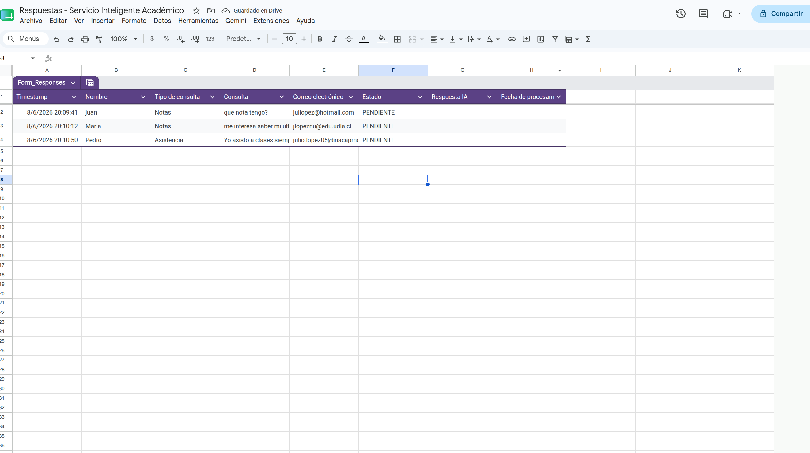
</p>
---

## Paso 2. Definir los estados del proceso

Durante este capítulo se utilizarán los siguientes estados:

| Estado | Significado |
|---|---|
| `PENDIENTE` | Solicitud disponible para procesamiento. |
| `PROCESANDO` | Solicitud recuperada por el puente local. |
| `RESPONDIDA` | Respuesta generada correctamente. |
| `ERROR` | El procesamiento no pudo completarse. |

---

# Parte B. Configuración del servicio de intercambio en Apps Script

## Paso 1. Obtener una solicitud pendiente

> En la sección anterior implementamos una primera versión de `leerSolicitud()` con fines didácticos.

Ahora ampliaremos esta lógica para recuperar únicamente aquellas solicitudes que aún no han sido procesadas por el sistema, permitiendo que el flujo de trabajo identifique automáticamente la **próxima consulta pendiente de atención**.


En el archivo `Code.gs`, reemplace el contenido actual de la función `leerSolicitud()` por el siguiente código:

```javascript
function leerSolicitud() {
  const hoja = SpreadsheetApp
    .getActiveSpreadsheet()
    .getActiveSheet();

  if (!hoja) {
    throw new Error("No se encontró la hoja de respuestas.");
  }

  const datos = hoja.getDataRange().getValues();

  if (datos.length <= 1) {
    return {
      disponible: false,
      mensaje: "No existen solicitudes registradas."
    };
  }

  // Índices de la estructura definida:
  // 0: Marca temporal
  // 1: Nombre
  // 2: Tipo de consulta
  // 3: Consulta
  // 4: Correo electrónico
  // 5: Estado
  // 6: Respuesta IA
  // 7: Fecha de procesamiento

  for (let indice = 1; indice < datos.length; indice++) {
    const fila = datos[indice];
    const estado = String(fila[5] || "").trim().toUpperCase();

    if (estado === "PENDIENTE") {
      const numeroFila = indice + 1;

      // Marcar inmediatamente la solicitud como en procesamiento
      hoja.getRange(numeroFila, 6).setValue("PROCESANDO");

      return {
        disponible: true,
        fila: numeroFila,
        nombre: String(fila[1] || "").trim(),
        tipo: String(fila[2] || "").trim(),
        consulta: String(fila[3] || "").trim(),
        correo: String(fila[4] || "").trim()
      };
    }
  }

  return {
    disponible: false,
    mensaje: "No existen solicitudes pendientes."
  };
}
```


<p align="center">
  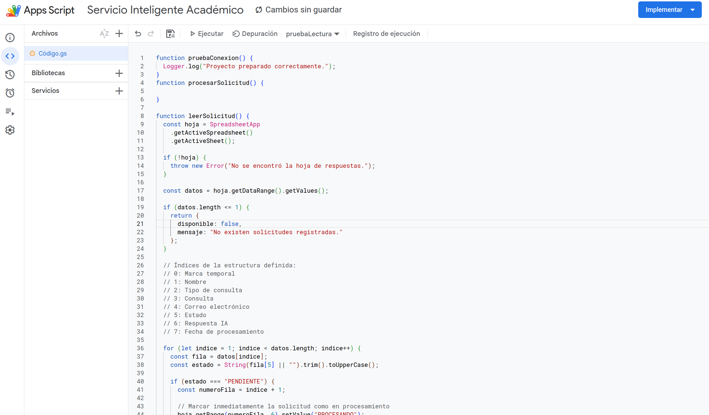
</p>

---

## Paso 2. Publicar la solicitud mediante `doGet()`

En el archivo **`Code.gs`**, agregue la siguiente función:

```javascript
function doGet() {

  try {

    const solicitud = leerSolicitud();

    return ContentService
      .createTextOutput(
        JSON.stringify(solicitud)
      )
      .setMimeType(ContentService.MimeType.JSON);

  } catch (error) {

    return ContentService
      .createTextOutput(
        JSON.stringify({
          disponible: false,
          mensaje: error.message
        })
      )
      .setMimeType(ContentService.MimeType.JSON);

  }

}
```

Esta función publica un servicio web que permite recuperar la siguiente solicitud pendiente registrada en la hoja de cálculo. La respuesta se entrega en formato JSON para que posteriormente pueda ser consumida por el puente local.

<p align="center">
  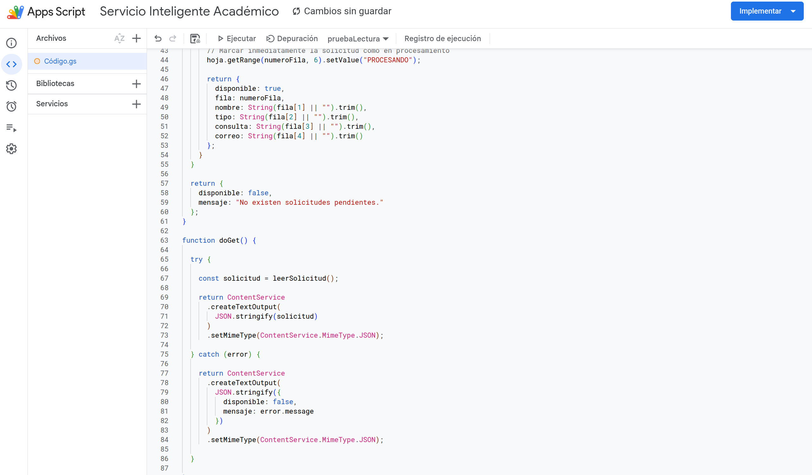
</p>
---

## Paso 3. Crear la función de respuesta JSON

En `Code.gs`, agregue:

```javascript
function respuestaJson_(contenido) {
  return ContentService
    .createTextOutput(JSON.stringify(contenido))
    .setMimeType(ContentService.MimeType.JSON);
}
```

Esta función transforma la información recibida en una respuesta JSON, formato que será utilizado para intercambiar datos entre Google Apps Script y el puente local.

---

## Paso 4. Recibir la respuesta procesada

En `Code.gs`, agregue:

```javascript
function doPost(e) {
  try {
    const contenido = JSON.parse(
      e.postData.contents || "{}"
    );

    const fila = Number(contenido.fila);
    const respuesta = String(
      contenido.respuesta || ""
    ).trim();

    const estado = String(
      contenido.estado || "RESPONDIDA"
    ).trim().toUpperCase();

    if (!Number.isInteger(fila) || fila < 2) {
      throw new Error(
        "El número de fila no es válido."
      );
    }

    if (!respuesta) {
      throw new Error(
        "La respuesta recibida está vacía."
      );
    }

    const hoja = SpreadsheetApp
      .getActiveSpreadsheet()
      .getActiveSheet();

    if (!hoja) {
      throw new Error(
        "No se encontró la hoja de respuestas."
      );
    }

    hoja.getRange(fila, 6).setValue(estado);
    hoja.getRange(fila, 7).setValue(respuesta);
    hoja.getRange(fila, 8).setValue(new Date());

    return respuestaJson_({
      correcto: true,
      mensaje: "Respuesta registrada correctamente."
    });

  } catch (error) {

    return respuestaJson_({
      correcto: false,
      error: error.message
    });

  }
}
```

---

# Parte C. Publicación de la aplicación web

## Paso 1. Crear una implementación

En Google Apps Script seleccione:

```text
Implementar

↓

Nueva implementación
```

<p align="center">
  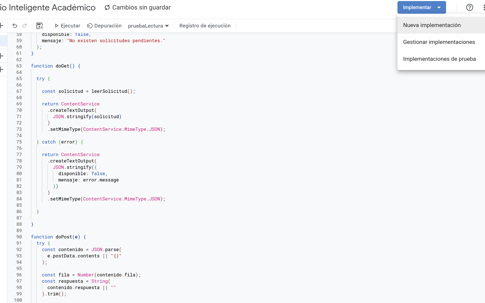
</p>

En la ventana **Nueva implementación**, haga clic en el ícono **⚙️ Seleccionar tipo** y elija:

```text
Aplicación web
```

<p align="center">
  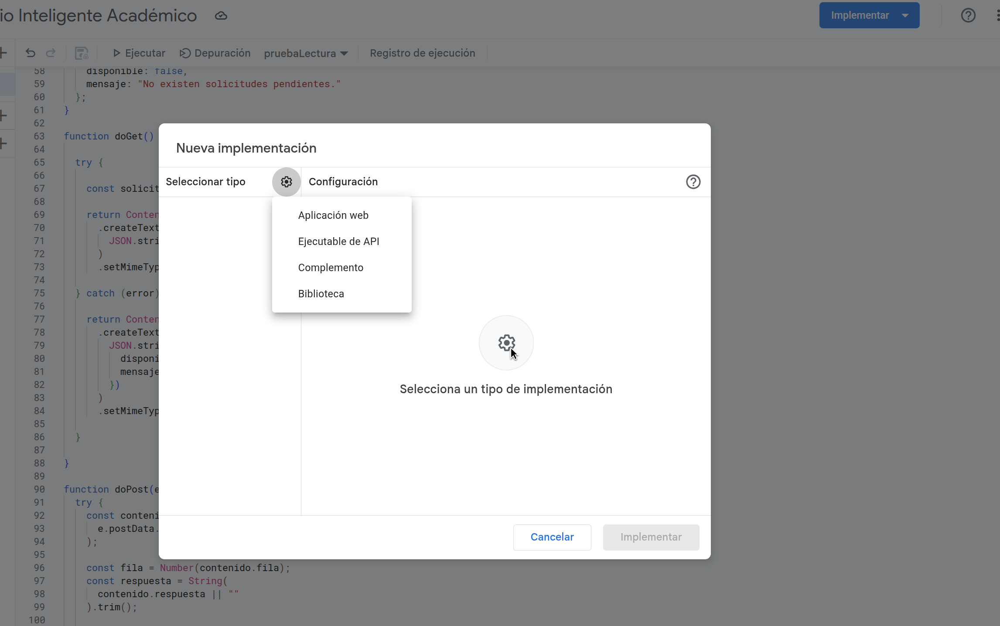
</p>
---

## Paso 2. Configurar la aplicación web

Utilice una configuración equivalente a:

| Campo                  | Valor recomendado                                                                |
| ---------------------- | -------------------------------------------------------------------------------- |
| **Descripción**        | `Servicio Inteligente Académico`                                                 |
| **Ejecutar como**      | **Yo** / propietario del proyecto                                                |
| **Quién tiene acceso** | **Cualquier persona** o la opción equivalente que permita acceso mediante enlace |

<p align="center">
  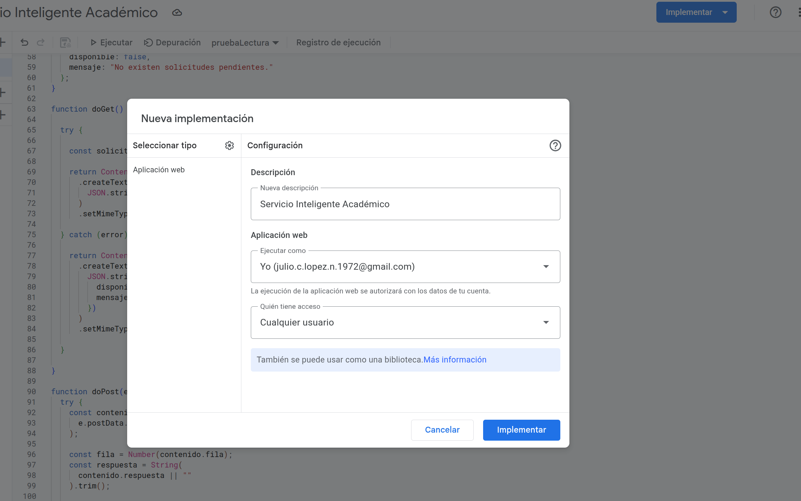
</p>

---

## Paso 3. Copiar la URL

> **Importante:** Al finalizar la implementación, Google Apps Script mostrará la URL de la aplicación web. Copie esta dirección y guárdela, ya que será utilizada posteriormente para configurar el puente local que se comunicará con el servicio.

Después de implementar, copie la URL entregada por Google Apps Script.

Tendrá una estructura similar a:

```text
https://script.google.com/macros/s/AKfycbxSXsR4wmgah3ONEl1uvV4KJ5hjQ1LU62GhmzCE1t8oUh5I-K103-S7-ue8CFJUDgmHQg/exec
```

Conserve esta dirección.

Será utilizada por el puente local.

<p align="center">
  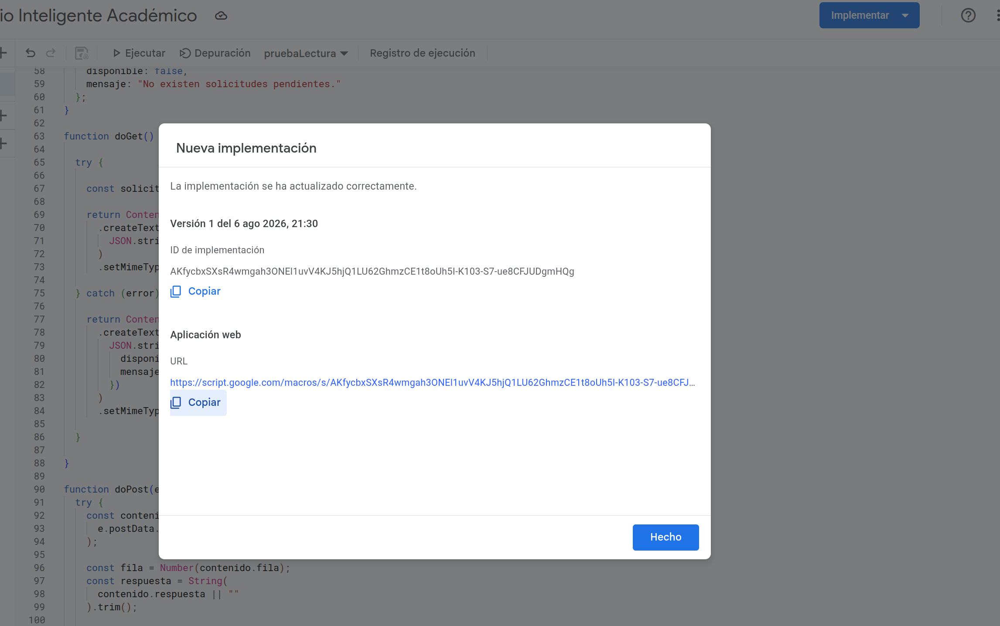
</p>


---

# Parte D. Construcción de la consulta para el asistente inteligente

## Paso 1. Crear el mensaje

El puente local construirá una consulta utilizando los datos recuperados desde Google Apps Script. Este mensaje será enviado al modelo de lenguaje mediante la API local de Ollama.

La estructura será:

```text
Nombre del usuario: [nombre]

Tipo de consulta: [tipo]

Consulta:
[consulta]

Responde en español, de forma clara y siguiendo las instrucciones
definidas para el asistente académico.
```

---

## Paso 2. Definir las instrucciones permanentes

Como el puente local consultará directamente la API de Ollama, las instrucciones permanentes del asistente deben estar disponibles para que el script pueda incorporarlas en cada solicitud enviada al modelo.

Cree el siguiente archivo dentro de la carpeta `03_Scripts`:

```text
Taller_IA_Local
│
└── 03_Scripts
    └── system_prompt.txt
```

Copie en este archivo las instrucciones permanentes definidas para el asistente inteligente. Para ello, utilice la versión disponible en el Manual del Proyecto Integrador.

Este archivo permitirá mantener separadas las instrucciones del asistente y el código del puente local, facilitando su posterior modificación y reutilización.

---

# Parte E. Implementación del puente local en Python

## Paso 1. Instalar la dependencia necesaria

Abra PowerShell dentro de la carpeta `03_Scripts`.

Ejecute:

```powershell
python -m pip install requests
```

<p align="center">
  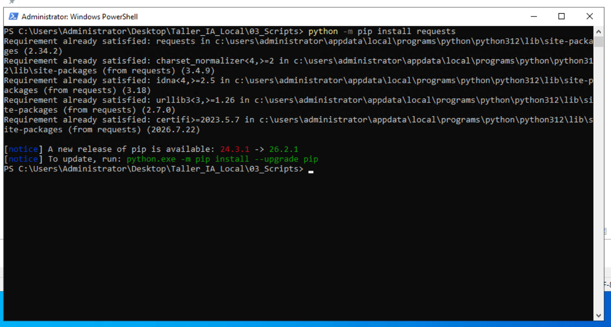
</p>
---

## Paso 2. Crear el archivo del puente

Cree el archivo en el directorio de script de su proyecto `Taller_IA_Local`:

```text
puente_local.py
```


---

## Paso 3. Incorporar la configuración

Incorpore al archivo `puente_local.py` la siguiente configuración:

```python
from __future__ import annotations

import time
from pathlib import Path
from typing import Any

import requests


URL_APPS_SCRIPT = "PEGAR_AQUI_URL_APLICACION_WEB"

URL_OLLAMA = "http://localhost:11434/api/chat"
MODELO_OLLAMA = "nombre-del-modelo"

INTERVALO_SEGUNDOS = 10
RUTA_SYSTEM_PROMPT = Path("system_prompt.txt")
```

Reemplazar la **URL de la aplicación web**.:

> Reemplace `nombre-del-modelo` por el nombre exacto del modelo instalado, según el resultado obtenido mediante `ollama list`.

---

## Paso 4. Cargar las instrucciones permanentes

Agregue al archivo `puente_local.py` la siguiente función, encargada de cargar las instrucciones permanentes almacenadas en `system_prompt.txt`:

```python
def cargar_system_prompt() -> str:
    if not RUTA_SYSTEM_PROMPT.exists():
        raise FileNotFoundError(
            f"No se encontró el archivo: {RUTA_SYSTEM_PROMPT}"
        )

    contenido = RUTA_SYSTEM_PROMPT.read_text(
        encoding="utf-8"
    ).strip()

    if not contenido:
        raise ValueError(
            "El archivo system_prompt.txt está vacío."
        )

    return contenido
```

---

## Paso 5. Consultar una solicitud pendiente

Agregue al archivo `puente_local.py` la siguiente función, encargada de consultar la aplicación web de Google Apps Script y recuperar la próxima solicitud pendiente:

```python

def obtener_solicitud() -> dict[str, Any] | None:
    respuesta = requests.get(
        URL_APPS_SCRIPT,
        timeout=30,
    )

    respuesta.raise_for_status()

    solicitud = respuesta.json()

    if not solicitud.get("disponible"):
        return None

    return solicitud
    
```

La función devuelve `None` cuando no existen solicitudes pendientes. Si encuentra una solicitud disponible, retorna el objeto recibido desde Google Apps Script para continuar con su procesamiento.

---

## Paso 6. Construir el mensaje del usuario

Incorpore la siguiente función en `puente_local.py`. Esta función construirá el mensaje que será enviado al modelo a partir de los datos de la solicitud:

```python
def construir_mensaje(
    solicitud: dict[str, Any]
) -> str:
    nombre = str(solicitud.get("nombre", "")).strip()
    tipo = str(solicitud.get("tipo", "")).strip()
    consulta = str(
        solicitud.get("consulta", "")
    ).strip()

    if not consulta:
        raise ValueError(
            "La solicitud no contiene una consulta."
        )

    return (
        f"Nombre del usuario: {nombre}\n\n"
        f"Tipo de consulta: {tipo}\n\n"
        f"Consulta:\n{consulta}\n\n"
        "Responde en español, de manera clara, "
        "precisa y dentro del alcance del "
        "asistente académico."
    )
```

---

## Paso 7. Consultar la API local de Ollama

Incorpore la siguiente función en `puente_local.py`. Esta función enviará a Ollama las instrucciones permanentes del asistente y el mensaje correspondiente a la solicitud del estudiante:

```python
def consultar_ollama(
    system_prompt: str,
    mensaje_usuario: str,
) -> str:
    carga = {
        "model": MODELO_OLLAMA,
        "stream": False,
        "messages": [
            {
                "role": "system",
                "content": system_prompt,
            },
            {
                "role": "user",
                "content": mensaje_usuario,
            },
        ],
    }

    respuesta = requests.post(
        URL_OLLAMA,
        json=carga,
        timeout=300,
    )

    respuesta.raise_for_status()

    contenido = respuesta.json()

    texto = (
        contenido
        .get("message", {})
        .get("content", "")
        .strip()
    )

    if not texto:
        raise RuntimeError(
            "Ollama devolvió una respuesta vacía."
        )

    return texto
```

---

## Paso 8. Devolver el resultado a Apps Script

Incorpore la siguiente función al código del puente local. Esta función enviará a Google Apps Script la respuesta generada por el modelo, junto con el número de fila y el estado de procesamiento:

```python
def registrar_respuesta(
    fila: int,
    respuesta_ia: str,
    estado: str = "RESPONDIDA",
) -> None:
    carga = {
        "fila": fila,
        "respuesta": respuesta_ia,
        "estado": estado,
    }

    respuesta = requests.post(
        URL_APPS_SCRIPT,
        json=carga,
        timeout=30,
    )

    respuesta.raise_for_status()

    contenido = respuesta.json()

    if not contenido.get("correcto"):
        raise RuntimeError(
            contenido.get(
                "error",
                "No fue posible registrar la respuesta."
            )
        )
```

---

## Paso 9. Integrar el ciclo de procesamiento

Incorpore la siguiente función en `puente_local.py`. Esta función coordinará el procesamiento completo de una solicitud, desde su recuperación hasta el registro de la respuesta generada por el modelo:

```python
def procesar_una_solicitud(
    system_prompt: str
) -> bool:
    solicitud = obtener_solicitud()

    if solicitud is None:
        print("No existen solicitudes pendientes.")
        return False

    fila = int(solicitud["fila"])

    print(f"Procesando la fila {fila}...")

    mensaje = construir_mensaje(solicitud)

    respuesta_ia = consultar_ollama(
        system_prompt,
        mensaje,
    )

    registrar_respuesta(
        fila=fila,
        respuesta_ia=respuesta_ia,
    )

    print(f"Fila {fila} procesada correctamente.")

    return True
```

---

## Paso 10. Crear la ejecución continua

Finalice el archivo con:

```python
def main() -> None:
    system_prompt = cargar_system_prompt()

    print("Puente local iniciado.")
    print("Presione CTRL+C para detenerlo.")

    while True:
        try:
            procesar_una_solicitud(system_prompt)
        except requests.RequestException as error:
            print(f"Error de comunicación: {error}")
        except (
            FileNotFoundError,
            ValueError,
            RuntimeError,
            KeyError,
        ) as error:
            print(f"Error de procesamiento: {error}")
        except Exception as error:
            print(f"Error no previsto: {error}")

        time.sleep(INTERVALO_SEGUNDOS)


if __name__ == "__main__":
    try:
        main()
    except KeyboardInterrupt:
        print("\nPuente local detenido.")
```

---

# Código completo del puente local

Una vez completados los pasos anteriores, el archivo `puente_local.py` deberá contener el siguiente código:

```python
from __future__ import annotations

import time
from pathlib import Path
from typing import Any

import requests


# ---------------------------------------------------------
# Configuración
# ---------------------------------------------------------

URL_APPS_SCRIPT = "PEGAR_AQUI_URL_APLICACION_WEB"

URL_OLLAMA = "http://localhost:11434/api/chat"
MODELO_OLLAMA = "nombre-del-modelo"

INTERVALO_SEGUNDOS = 10
RUTA_SYSTEM_PROMPT = Path("system_prompt.txt")


# ---------------------------------------------------------
# Cargar instrucciones permanentes
# ---------------------------------------------------------

def cargar_system_prompt() -> str:
    if not RUTA_SYSTEM_PROMPT.exists():
        raise FileNotFoundError(
            f"No se encontró el archivo: {RUTA_SYSTEM_PROMPT}"
        )

    contenido = RUTA_SYSTEM_PROMPT.read_text(
        encoding="utf-8"
    ).strip()

    if not contenido:
        raise ValueError(
            "El archivo system_prompt.txt está vacío."
        )

    return contenido


# ---------------------------------------------------------
# Obtener una solicitud pendiente
# ---------------------------------------------------------

def obtener_solicitud() -> dict[str, Any] | None:
    respuesta = requests.get(
        URL_APPS_SCRIPT,
        timeout=30,
    )

    respuesta.raise_for_status()

    solicitud = respuesta.json()

    if not solicitud.get("disponible"):
        return None

    return solicitud


# ---------------------------------------------------------
# Construir mensaje del usuario
# ---------------------------------------------------------

def construir_mensaje(
    solicitud: dict[str, Any]
) -> str:
    nombre = str(solicitud.get("nombre", "")).strip()
    tipo = str(solicitud.get("tipo", "")).strip()
    consulta = str(
        solicitud.get("consulta", "")
    ).strip()

    if not consulta:
        raise ValueError(
            "La solicitud no contiene una consulta."
        )

    return (
        f"Nombre del usuario: {nombre}\n\n"
        f"Tipo de consulta: {tipo}\n\n"
        f"Consulta:\n{consulta}\n\n"
        "Responde en español, de manera clara, "
        "precisa y dentro del alcance del "
        "asistente académico."
    )


# ---------------------------------------------------------
# Consultar la API local de Ollama
# ---------------------------------------------------------

def consultar_ollama(
    system_prompt: str,
    mensaje_usuario: str,
) -> str:
    carga = {
        "model": MODELO_OLLAMA,
        "stream": False,
        "messages": [
            {
                "role": "system",
                "content": system_prompt,
            },
            {
                "role": "user",
                "content": mensaje_usuario,
            },
        ],
    }

    respuesta = requests.post(
        URL_OLLAMA,
        json=carga,
        timeout=300,
    )

    respuesta.raise_for_status()

    contenido = respuesta.json()

    texto = (
        contenido
        .get("message", {})
        .get("content", "")
        .strip()
    )

    if not texto:
        raise RuntimeError(
            "Ollama devolvió una respuesta vacía."
        )

    return texto


# ---------------------------------------------------------
# Registrar la respuesta en Apps Script
# ---------------------------------------------------------

def registrar_respuesta(
    fila: int,
    respuesta_ia: str,
    estado: str = "RESPONDIDA",
) -> None:
    carga = {
        "fila": fila,
        "respuesta": respuesta_ia,
        "estado": estado,
    }

    respuesta = requests.post(
        URL_APPS_SCRIPT,
        json=carga,
        timeout=30,
    )

    respuesta.raise_for_status()

    contenido = respuesta.json()

    if not contenido.get("correcto"):
        raise RuntimeError(
            contenido.get(
                "error",
                "No fue posible registrar la respuesta."
            )
        )


# ---------------------------------------------------------
# Procesar una solicitud
# ---------------------------------------------------------

def procesar_una_solicitud(
    system_prompt: str
) -> bool:
    solicitud = obtener_solicitud()

    if solicitud is None:
        print("No existen solicitudes pendientes.")
        return False

    fila = int(solicitud["fila"])

    print(f"Procesando la fila {fila}...")

    mensaje = construir_mensaje(solicitud)

    respuesta_ia = consultar_ollama(
        system_prompt,
        mensaje,
    )

    registrar_respuesta(
        fila=fila,
        respuesta_ia=respuesta_ia,
    )

    print(f"Fila {fila} procesada correctamente.")

    return True


# ---------------------------------------------------------
# Ejecución continua
# ---------------------------------------------------------

def main() -> None:
    system_prompt = cargar_system_prompt()

    print("Puente local iniciado.")
    print("Presione CTRL+C para detenerlo.")

    while True:
        try:
            procesar_una_solicitud(system_prompt)

        except requests.RequestException as error:
            print(f"Error de comunicación: {error}")

        except (
            FileNotFoundError,
            ValueError,
            RuntimeError,
            KeyError,
        ) as error:
            print(f"Error de procesamiento: {error}")

        except Exception as error:
            print(f"Error no previsto: {error}")

        time.sleep(INTERVALO_SEGUNDOS)


if __name__ == "__main__":
    try:
        main()
    except KeyboardInterrupt:
        print("\nPuente local detenido.")
```

---

# Prueba del módulo

## Paso 1. Verificar Ollama

Abra otra ventana de PowerShell y ejecute:

```powershell
ollama list
```

Confirme que el modelo indicado en `MODELO_OLLAMA` se encuentra instalado.

---

## Paso 2. Ejecutar el puente

Desde la carpeta `03_Scripts` ejecute:

```powershell
python puente_local.py
```

Al iniciar correctamente el puente, deberá observar una salida similar a:

```text
Puente local iniciado.
Presione CTRL+C para detenerlo.
No existen solicitudes pendientes.
```

---

## Paso 3. Revisar el procesamiento

Si existe una solicitud pendiente, deberá observar mensajes similares a los siguientes:

```text
Procesando la fila 2...
Fila 2 procesada correctamente.
```

>  El número de fila dependerá de la solicitud pendiente recuperada desde la hoja de respuestas.

<p align="center">
  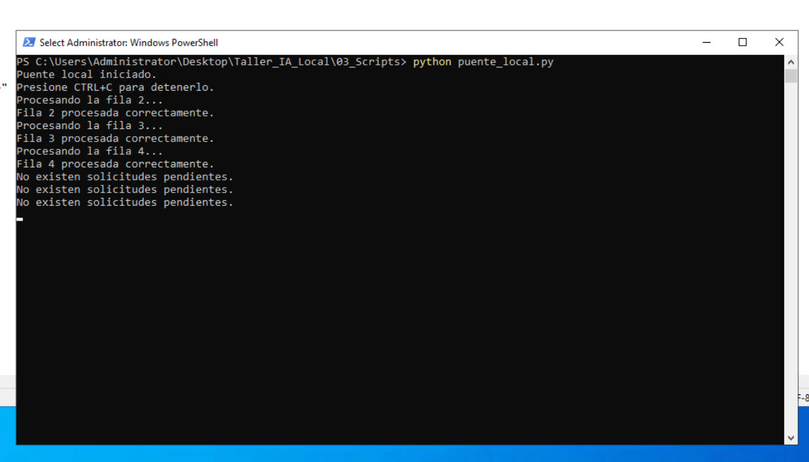
</p>

---

## Paso 4. Revisar Google Sheets

Confirme que la fila fue actualizada:

| Estado | Respuesta IA | Fecha de procesamiento |
|---|---|---|
| RESPONDIDA | Texto generado por Ollama | Fecha y hora |

Si estos valores aparecen correctamente, la comunicación con el asistente local quedó implementada.

<p align="center">
  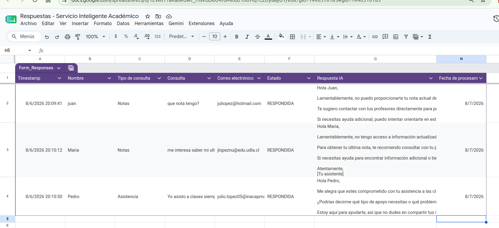
</p>

---

💡 **Nota técnica 8.6**

En esta arquitectura Open WebUI continúa siendo la interfaz utilizada para diseñar y probar el asistente. Sin embargo, la automatización consulta directamente la API local de Ollama e incorpora las mismas instrucciones permanentes mediante el archivo `system_prompt.txt`.

Esto evita publicar Open WebUI u Ollama en Internet y mantiene el procesamiento del modelo dentro del computador.

---

### Verificación

Complete la siguiente tabla:

| Verificación                                 | Estado |
| -------------------------------------------- | :----: |
| Se agregaron las columnas de control         |   ☐    |
| La aplicación web fue implementada           |   ☐    |
| El puente local recuperó una solicitud       |   ☐    |
| Ollama generó una respuesta                  |   ☐    |
| La respuesta fue registrada en Google Sheets |   ☐    |
| La fila cambió al estado `RESPONDIDA`        |   ☐    |

---

### Problemas frecuentes

#### El puente indica que no existen solicitudes pendientes

Compruebe que la columna **Estado** contiene exactamente:

```text
PENDIENTE
```

---

#### Ollama no responde

Verifique:

```powershell
ollama list
```

y confirme que el nombre configurado en `MODELO_OLLAMA` coincide con el modelo instalado.

---

#### Aparece un error al acceder a `localhost:11434`

Compruebe que Ollama está iniciado.

Puede verificar el servicio desde:

```text
http://localhost:11434
```

---

#### La respuesta queda en estado `PROCESANDO`

El puente pudo recuperar la solicitud, pero no completó el proceso.

Revise la consola de Python para identificar el error.

Después de corregirlo, cambie manualmente el estado nuevamente a:

```text
PENDIENTE
```

---

#### La aplicación web devuelve una página de autorización

Revise la configuración de acceso seleccionada durante la implementación.

El puente debe poder enviar solicitudes HTTP al enlace publicado.

---

### Buenas prácticas

- Mantenga Ollama y el puente local ejecutándose durante el procesamiento.
- No exponga directamente los puertos de Ollama u Open WebUI a Internet.
- Mantenga las instrucciones permanentes en un archivo independiente.
- Pruebe una única solicitud antes de habilitar el procesamiento continuo.

---

### Checklist

Antes de continuar confirme que:

☐ Comprende por qué Apps Script no accede directamente a `localhost`.

☐ La aplicación web de intercambio está operativa.

☐ El puente local se comunica con Apps Script.

☐ El puente local se comunica con Ollama.

☐ La respuesta se registra correctamente en Google Sheets.

☐ El procesamiento continúa siendo local.

---

## ¿Qué aprendimos?

En esta sección implementó el componente que conecta el ecosistema de Google con el entorno local de Inteligencia Artificial.

Aprendió a:

- publicar un servicio de intercambio mediante Google Apps Script;
- recuperar solicitudes desde un proceso local;
- construir mensajes a partir de datos estructurados;
- consultar la API local de Ollama;
- devolver las respuestas a Google Sheets;
- mantener el modelo protegido dentro del computador.

El servicio ya puede capturar, procesar y registrar respuestas automáticamente.

Todavía falta entregar el resultado al usuario mediante correo electrónico.

---

## 8.7 Envío automático de respuestas y actualización del estado

### Objetivo

Implementar el módulo encargado de enviar al usuario la respuesta generada por Ollama mediante Gmail y actualizar el estado de la solicitud en Google Sheets, completando el ciclo de procesamiento del servicio inteligente.

---

### Tiempo estimado

**35 minutos**

---

### Requisitos previos

Antes de comenzar esta sección deberá haber completado:

- Sección 8.6 – Comunicación con el asistente mediante un puente local.

Además, deberá disponer de:

- la aplicación web de Google Apps Script publicada;
- el puente local en Python funcionando;
- Ollama operativo;
- al menos una solicitud registrada en Google Sheets;
- una respuesta generada correctamente por el asistente.

---

### Diseño de la solución

En la sección anterior el servicio logró:

1. recuperar una solicitud pendiente;
2. enviarla al modelo local;
3. generar una respuesta;
4. registrar esa respuesta en Google Sheets.

Ahora se completará el proceso:

```text
Respuesta generada por Ollama

↓

Google Apps Script recibe la respuesta

↓

Gmail envía el correo al usuario

↓

Google Sheets actualiza el estado

↓

Solicitud finalizada
```

Google Apps Script utilizará los datos almacenados en la misma fila para recuperar:

- nombre del usuario;
- tipo de consulta;
- correo electrónico;
- respuesta generada.

---

### Estados del proceso

A partir de esta sección se utilizarán los siguientes estados:

| Estado       | Significado                                        |
| ------------ | -------------------------------------------------- |
| `PENDIENTE`  | La solicitud aún no ha sido procesada.             |
| `PROCESANDO` | El puente local recuperó la solicitud.             |
| `ENVIADA`    | La respuesta fue enviada correctamente por correo. |
| `ERROR`      | El proceso no pudo completarse.                    |


El estado final esperado será:

```text
ENVIADA
```

---

### Procedimiento

## Paso 1. Crear la función de envío de correo

Abra el proyecto de Google Apps Script.

En el archivo `Code.gs`, reemplace la función vacía `enviarCorreo()` por la siguiente implementación:

```javascript
function enviarCorreo(correo, nombre, tipo, respuesta) {
  if (!correo) {
    throw new Error(
      "La solicitud no contiene un correo electrónico."
    );
  }

  if (!respuesta) {
    throw new Error(
      "No existe una respuesta para enviar."
    );
  }

  const nombreUsuario = nombre || "estudiante";
  const categoria = tipo || "Consulta académica";

  const asunto =
    "Respuesta a tu consulta académica: " + categoria;

  const cuerpo =
    respuesta + "\n\n" +
    "Esta respuesta fue generada automáticamente. " +
    "Si necesitas una revisión adicional, comunícate " +
    "con el responsable académico correspondiente.\n\n" +
    "Saludos.";

  GmailApp.sendEmail(
    correo,
    asunto,
    cuerpo,
    {
      name: "Servicio Inteligente Académico"
    }
  );
}
```

La función recibe cuatro parámetros:

| Parámetro | Contenido |
|---|---|
| `correo` | Dirección del destinatario. |
| `nombre` | Nombre utilizado para personalizar el mensaje. |
| `tipo` | Categoría de la consulta. |
| `respuesta` | Texto generado por Ollama. |

> `GmailApp.sendEmail()` permite enviar mensajes desde la cuenta que ejecuta el proyecto de Google Apps Script. El servicio está sujeto a las cuotas de envío establecidas para cada tipo de cuenta.

---

## Paso 2. Crear una prueba independiente de correo

Antes de integrar el envío con el resto del flujo, cree una función de prueba:

```javascript
function pruebaCorreo() {
  const correoPrueba = "REEMPLAZAR_POR_CORREO_DE_PRUEBA";

  enviarCorreo(
    correoPrueba,
    "Usuario de prueba",
    "Contenidos",
    "Esta es una respuesta de prueba generada " +
    "durante la configuración del servicio inteligente."
  );

  Logger.log("Correo de prueba enviado.");
}
```

Reemplace:

```text
REEMPLAZAR_POR_CORREO_DE_PRUEBA
```

por una dirección de correo a la que tenga acceso.

---

## Paso 3. Autorizar el acceso a Gmail

Seleccione la función:

```text
pruebaCorreo
```

Presione:

```text
Ejecutar
```

Google Apps Script puede solicitar nuevos permisos porque el proyecto utilizará Gmail por primera vez.

Revise la solicitud y complete la autorización.

<p align="center">
  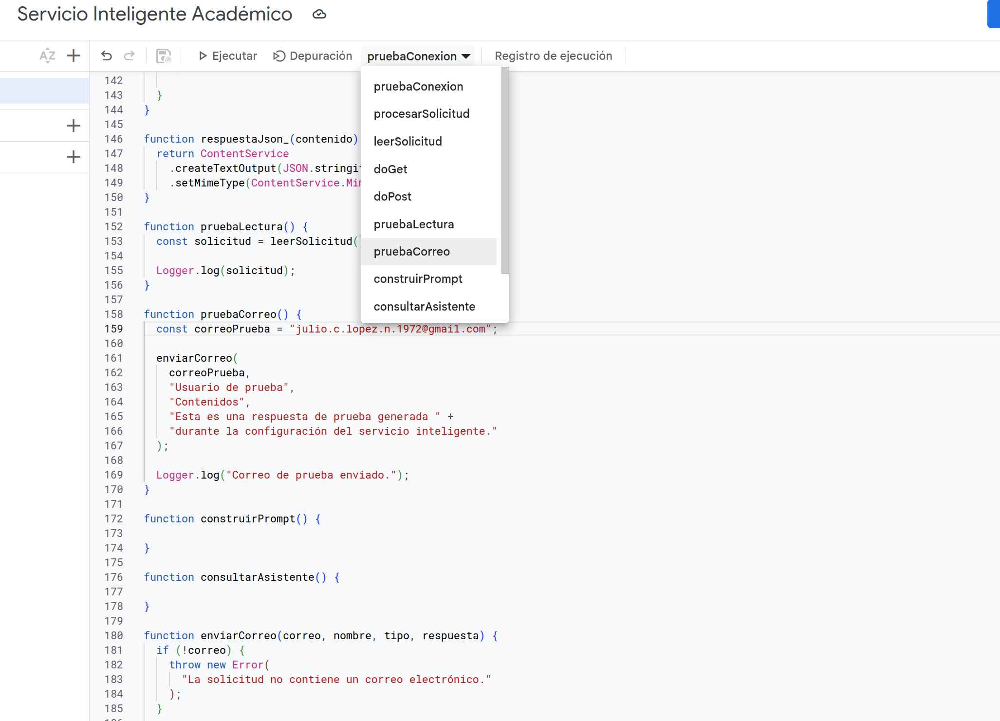
</p>

<p align="center">
  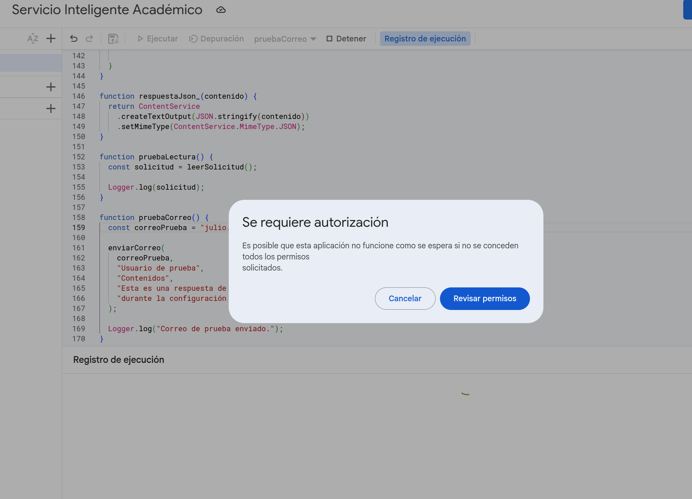
</p>

<p align="center">
  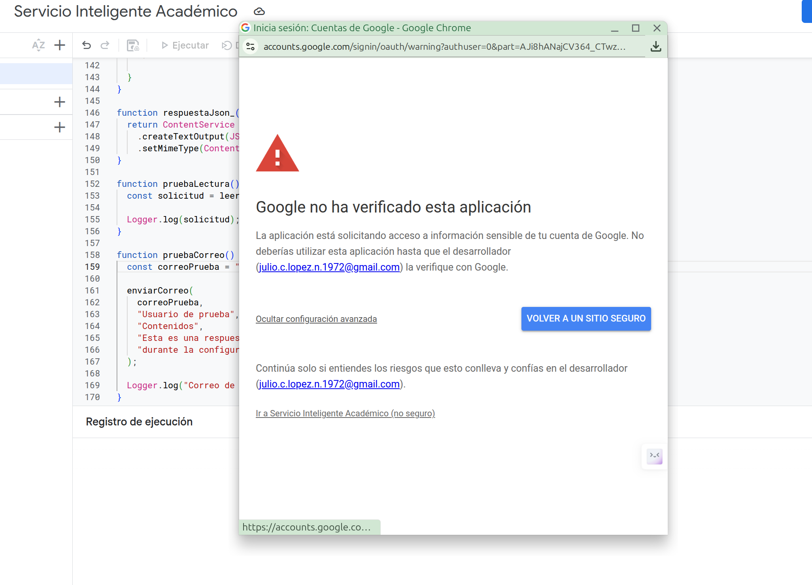
</p>

<p align="center">
  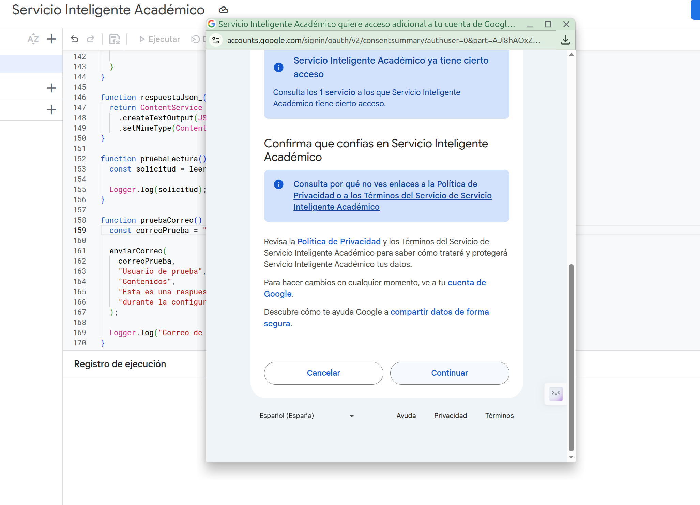
</p>

<p align="center">
  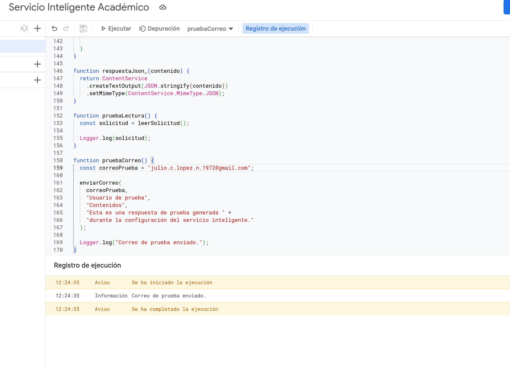
</p>
---

## Paso 4. Verificar el correo de prueba

Abra la bandeja de entrada del correo utilizado durante la prueba.

Deberá recibir un mensaje con una estructura similar a la siguiente:

```text
Asunto:
Respuesta a tu consulta académica: Contenidos

Hola Usuario de prueba:

Hemos procesado tu consulta mediante el
Servicio Inteligente Académico.

Respuesta:

Esta es una respuesta de prueba generada durante
la configuración del servicio inteligente.
```

<p align="center">
  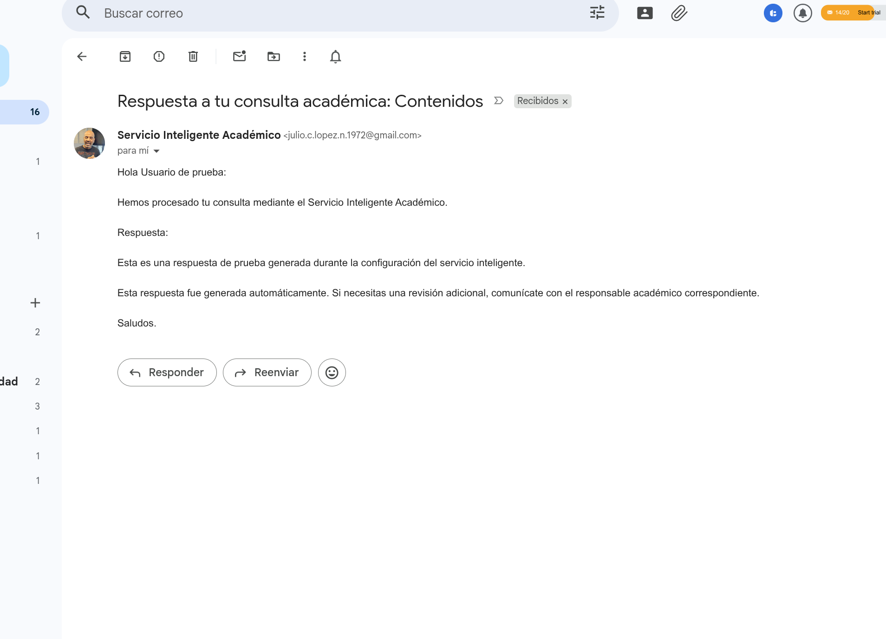
</p>

Si el correo no aparece inmediatamente, revise también la carpeta de correo no deseado.

No continúe hasta confirmar que esta prueba funciona correctamente.


---

## Paso 5. Reemplazar la función `doPost()`

En la sección anterior, `doPost()` registraba la respuesta en Google Sheets.

Ahora deberá incorporar también el envío automático mediante Gmail.

Reemplace la función `doPost()` anterior por la siguiente versión:

```javascript
function doPost(e) {
  let hoja = null;
  let fila = null;

  try {
    const contenido = JSON.parse(
      e.postData.contents || "{}"
    );

    fila = Number(contenido.fila);

    const respuesta = String(
      contenido.respuesta || ""
    ).trim();

    if (!Number.isInteger(fila) || fila < 2) {
      throw new Error(
        "El número de fila no es válido."
      );
    }

    if (!respuesta) {
      throw new Error(
        "La respuesta recibida está vacía."
      );
    }

    hoja = SpreadsheetApp
      .getActiveSpreadsheet()
      .getActiveSheet();

    if (!hoja) {
      throw new Error(
        "No se encontró la hoja de respuestas."
      );
    }

    const nombre = String(
      hoja.getRange(fila, 2).getValue() || ""
    ).trim();

    const tipo = String(
      hoja.getRange(fila, 3).getValue() || ""
    ).trim();

    const correo = String(
      hoja.getRange(fila, 5).getValue() || ""
    ).trim();

    // Registrar primero la respuesta generada
    hoja.getRange(fila, 7).setValue(respuesta);
    hoja.getRange(fila, 8).setValue(new Date());

    // Enviar la respuesta al estudiante
    enviarCorreo(
      correo,
      nombre,
      tipo,
      respuesta
    );

    // Si el correo se envió correctamente,
    // la solicitud queda finalizada.
    hoja.getRange(fila, 6).setValue("ENVIADA");

    return respuestaJson_({
      correcto: true,
      mensaje: "Respuesta registrada y enviada correctamente."
    });

  } catch (error) {

    if (hoja && fila && Number.isInteger(fila) && fila >= 2) {
      hoja.getRange(fila, 6).setValue("ERROR");
    }

    return respuestaJson_({
      correcto: false,
      error: error.message
    });
  }
}
```

---

## Paso 6. Comprender la nueva secuencia

La función `doPost()` ejecutará ahora las siguientes actividades:

```text
Recibir respuesta desde Python

↓

Validar la fila y la respuesta

↓

Recuperar nombre, tipo y correo electrónico

↓

Guardar la respuesta en Google Sheets

↓

Enviar correo mediante Gmail

↓

Estado = ENVIADA
```

Si se produce un error durante el proceso:

```text
Estado = ERROR
```

---

## Paso 7. Guardar el proyecto

Guarde todos los cambios realizados en Google Apps Script.

Verifique especialmente que el proyecto contiene:

```text
leerSolicitud()

respuestaJson_()

enviarCorreo()

doGet()

doPost()
```

La función `pruebaCorreo()` puede conservarse para futuras verificaciones.

---

## Paso 8. Actualizar la implementación de la aplicación web

Los cambios realizados en el código no siempre quedan disponibles automáticamente en la URL publicada anteriormente.

Acceda a:

```text
Implementar

↓

Administrar implementaciones
```

Seleccione la implementación existente.

Edítela y publique una nueva versión.

Conserve la misma URL de la aplicación web siempre que la plataforma lo permita.

Las aplicaciones web de Apps Script ejecutan `doGet()` y `doPost()` desde la implementación publicada y pueden configurarse para ejecutarse con la autoridad del propietario del proyecto.

<p align="center">
  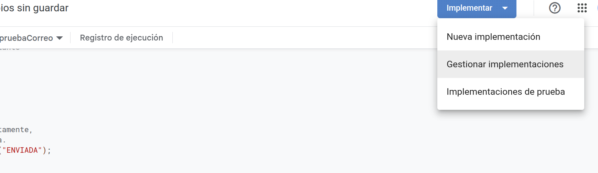
</p>

<p align="center">
  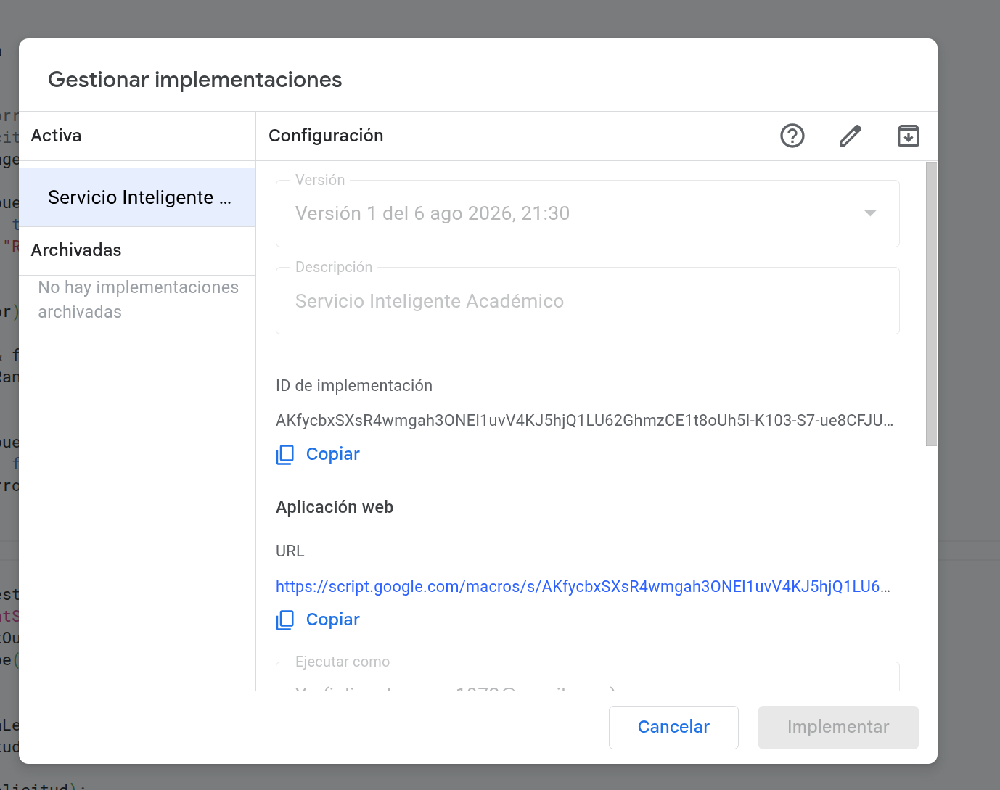
</p>

<p align="center">
  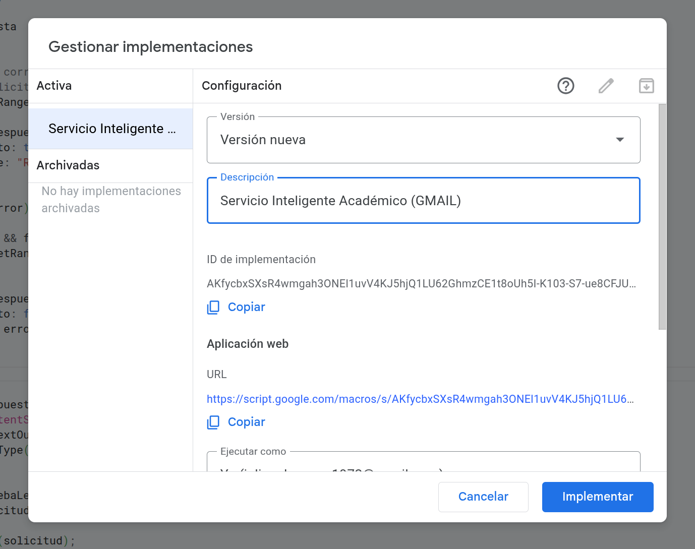
</p>


---

## Paso 9. Preparar una solicitud de prueba

En Google Sheets, seleccione una fila que contenga:

- nombre;
- tipo de consulta;
- consulta;
- correo electrónico válido.

En la columna **Estado**, escriba:

```text
PENDIENTE
```

Asegúrese de que el correo corresponde a una cuenta que pueda revisar.

<p align="center">
  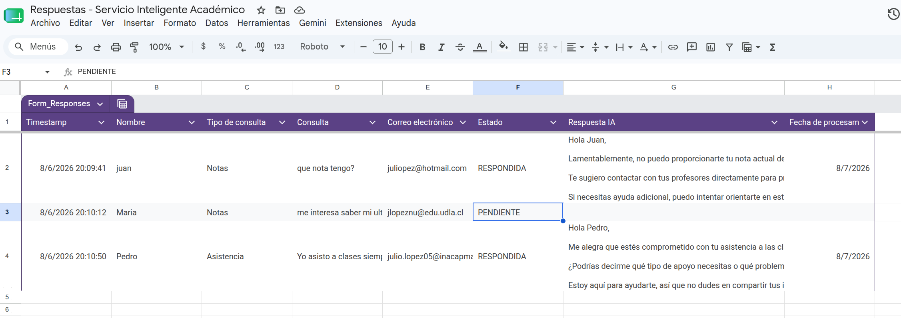
</p>

---

## Paso 10. Ejecutar el puente local

Abra PowerShell dentro de la carpeta:

```text
Taller_IA_Local
│
└── 03_Scripts
```

Ejecute en Windows Power Shell:

```powershell
python puente_local.py
```

Durante el procesamiento deberá observar una salida similar a:

```text
Puente local iniciado.
Presione CTRL+C para detenerlo.

Procesando la fila 2...
Fila 2 procesada correctamente.
```

No es necesario modificar el código Python desarrollado en la sección anterior.

---

## Paso 11. Verificar Google Sheets

Después del procesamiento, revise la fila correspondiente.

Deberá observar:

| Estado    | Respuesta IA                  | Fecha de procesamiento |
| --------- | ----------------------------- | ---------------------- |
| `ENVIADA` | Respuesta generada por Ollama | Fecha y hora           |

<p align="center">
  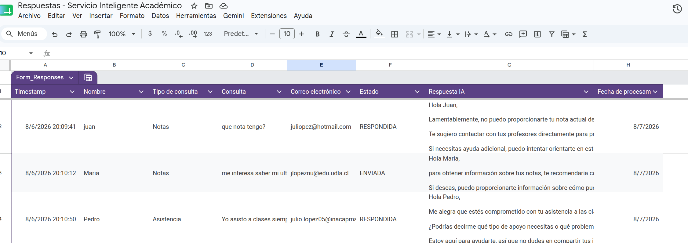
</p>

---

## Paso 12. Verificar el correo recibido

Abra la cuenta registrada en el formulario.

Compruebe que recibió la respuesta generada por el asistente.

Revise:

- destinatario;
- asunto;
- nombre del usuario;
- categoría;
- respuesta;
- formato general del mensaje.

<p align="center">
  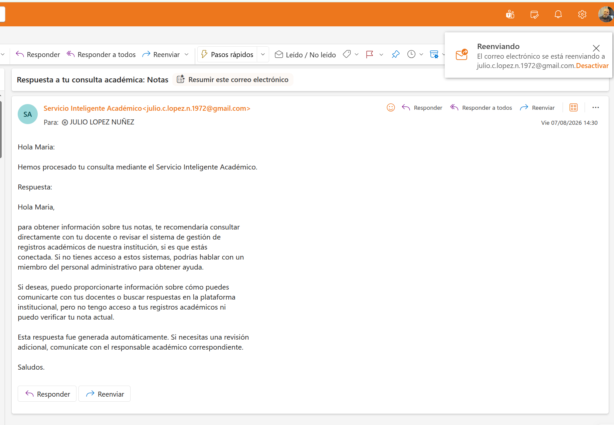
</p>

---

💡 **Nota técnica 8.7**

El correo se envía desde la cuenta propietaria o ejecutora de la aplicación web, de acuerdo con la configuración utilizada durante su implementación.

Por este motivo, el servicio debe utilizarse únicamente con cuentas autorizadas y respetando las políticas institucionales y las cuotas vigentes de Google Apps Script. 

---

### Prueba funcional del módulo

Realice una segunda prueba utilizando una nueva respuesta del formulario.

Compruebe la siguiente secuencia:

```text
1. El usuario envía el formulario.

2. Google Sheets registra la solicitud.

3. La solicitud queda en estado PENDIENTE.

4. El puente local recupera la solicitud.

5. El estado cambia a PROCESANDO.

6. Ollama genera la respuesta.

7. Apps Script registra la respuesta.

8. Gmail envía el correo.

9. El estado cambia a ENVIADA.
```

Si todas las etapas se completan, el módulo funciona correctamente.

---

### Verificación

Complete la siguiente tabla:

| Verificación                                   | Estado |
| ---------------------------------------------- | :----: |
| La función `enviarCorreo()` fue creada         |   ☐    |
| La prueba independiente de correo fue exitosa  |   ☐    |
| Los permisos de Gmail fueron autorizados       |   ☐    |
| `doPost()` fue actualizado                     |   ☐    |
| La aplicación web fue implementada nuevamente  |   ☐    |
| El puente procesó la solicitud                 |   ☐    |
| La respuesta quedó almacenada en Google Sheets |   ☐    |
| El correo fue recibido por el usuario          |   ☐    |
| El estado final corresponde a `ENVIADA`        |   ☐    |

---

### Problemas frecuentes

#### El correo de prueba no llega

Verifique:

- que la dirección fue escrita correctamente;
- la carpeta de correo no deseado;
- el registro de ejecución de Apps Script;
- que el proyecto posee autorización para utilizar Gmail.

---

#### Google Apps Script indica que el servicio Gmail no está autorizado

Ejecute manualmente la función:

```text
pruebaCorreo
```

y complete nuevamente la autorización.


---

#### La fila queda en estado `ERROR`

Abra el registro de ejecución de Google Apps Script y la consola del puente local.

Identifique el mensaje de error antes de repetir el proceso.

---

#### El puente indica que la respuesta fue registrada, pero se ejecuta el código anterior

Actualice la implementación de la aplicación web.

Los cambios guardados en el editor deben publicarse en una nueva versión.

---

#### Se envía más de un correo para la misma solicitud

Verifique que la fila cambia correctamente a:

```text
ENVIADA
```

y que únicamente las solicitudes con estado `PENDIENTE` pueden ser recuperadas por el puente local.

---

#### Se alcanzó el límite de envío

Google Apps Script aplica cuotas diarias que dependen del tipo de cuenta utilizada.

Espere la renovación de la cuota o reduzca el número de pruebas realizadas. 

---

### Buenas prácticas

- Utilice direcciones de prueba durante el desarrollo.
- Autorice Gmail antes de ejecutar el flujo completo.
- Envíe únicamente un correo por solicitud.
- Registre siempre el estado final del proceso.
- No utilice el servicio para realizar envíos masivos.
- Revise las cuotas aplicables a la cuenta utilizada.
- Mantenga mensajes breves y claramente identificables.
- Evite incluir información sensible en los correos generados automáticamente.

---

### Checklist

Antes de continuar confirme que:

☐ El servicio puede enviar correos mediante Gmail.

☐ La respuesta se personaliza con el nombre del usuario.

☐ El correo contiene la respuesta generada por Ollama.

☐ Google Sheets registra el estado final.

☐ Las solicitudes procesadas no vuelven a recuperarse.

☐ El ciclo completo funciona sin intervención manual.

---

## ¿Qué aprendimos?

En esta sección completó el último módulo funcional del servicio inteligente.

Aprendió a:

- recuperar los datos necesarios desde Google Sheets;
- construir un mensaje de correo personalizado;
- enviar automáticamente la respuesta mediante Gmail;
- actualizar el estado de cada solicitud;
- identificar errores de procesamiento;
- evitar el reprocesamiento de solicitudes finalizadas.

El proyecto ya es capaz de recibir una consulta, procesarla localmente con Ollama y entregar automáticamente el resultado al usuario.

---

## 8.8 Validación integral del servicio inteligente

### Objetivo

Validar el funcionamiento completo del servicio inteligente, comprobar la interacción entre todos sus componentes y documentar el estado funcional alcanzado por el proyecto como una solución automatizada.

---

### Tiempo estimado

**40 minutos**

---

### Requisitos previos

Antes de comenzar esta sección deberá haber completado:

- Sección 8.5 – Lectura de solicitudes desde Google Sheets.
- Sección 8.6 – Comunicación con el asistente mediante un puente local.
- Sección 8.7 – Envío automático de respuestas y actualización del estado.

Además, deberá disponer de:

- Google Forms operativo;
- Google Sheets vinculado al formulario;
- aplicación web de Google Apps Script publicada;
- puente local en Python configurado;
- Ollama funcionando;
- modelo de lenguaje instalado;
- archivo `system_prompt.txt` actualizado;
- permisos de Gmail autorizados.

---

### Diseño de la validación

La validación integral comprobará el funcionamiento del servicio desde el punto de vista del usuario.

El flujo esperado será el siguiente:

```text
Usuario completa Google Forms

↓

Google Sheets registra la solicitud

↓

Estado = PENDIENTE

↓

Puente local recupera la solicitud

↓

Estado = PROCESANDO

↓

Ollama genera una respuesta

↓

Google Apps Script registra el resultado

↓

Gmail envía la respuesta

↓

Estado = ENVIADA
```

La prueba será satisfactoria únicamente si todas las etapas se completan correctamente.

---

### Procedimiento

## Paso 1. Verificar los componentes del servicio

Antes de ejecutar la validación, complete la siguiente revisión:

| Componente                                              | Verificación |
| ------------------------------------------------------- | :----------: |
| Google Forms acepta respuestas                          |      ☐       |
| Google Sheets registra las respuestas                   |      ☐       |
| La aplicación web de Apps Script está publicada         |      ☐       |
| La URL de Apps Script está configurada en Python        |      ☐       |
| Ollama responde correctamente                           |      ☐       |
| El modelo configurado está instalado                    |      ☐       |
| `system_prompt.txt` contiene las instrucciones vigentes |      ☐       |
| Gmail está autorizado                                   |      ☐       |

No continúe hasta verificar todos los componentes.

---

## Paso 2. Confirmar el modelo instalado

Abra PowerShell y ejecute:

```powershell
ollama list
```

Verifique que el nombre registrado en:

```python
MODELO_OLLAMA = "nombre-del-modelo"
```

coincide exactamente con uno de los modelos instalados.

---

## Paso 3. Iniciar el puente local

Acceda desde PowerShell a la carpeta:

```text
Taller_IA_Local
│
└── 03_Scripts
```

Ejecute:

```powershell
python puente_local.py
```

La salida inicial deberá ser similar a:

```text
Puente local iniciado.
Presione CTRL+C para detenerlo.
No existen solicitudes pendientes.
```

Mantenga esta ventana abierta durante toda la validación.

---

## Paso 4. Ejecutar el primer caso de uso

Complete el formulario utilizando una consulta habitual.

Ejemplo:

| Campo | Valor de prueba |
|---|---|
| Nombre | Andrea Pérez |
| Tipo de consulta | Contenidos |
| Consulta | ¿Qué diferencia existe entre un modelo de lenguaje y un asistente inteligente? |
| Correo electrónico | Dirección de prueba accesible |

Envíe el formulario.

---

## Paso 5. Verificar el registro inicial

Abra Google Sheets.

Confirme que la respuesta aparece como una nueva fila.

Si la columna **Estado** no se completa automáticamente, escriba:

```text
PENDIENTE
```

> En esta solución didáctica, el estado `PENDIENTE` se asigna manualmente antes de iniciar el procesamiento. Su automatización puede incorporarse como una mejora futura.

La fila deberá contener:

- nombre;
- tipo de consulta;
- consulta;
- correo electrónico;
- estado `PENDIENTE`.

---

## Paso 6. Observar el procesamiento

Revise la consola del puente local.

La salida deberá mostrar una secuencia similar a:

```text
Procesando la fila 5...
Fila 5 procesada correctamente.
```

Durante este proceso, el estado podrá cambiar temporalmente a:

```text
PROCESANDO
```

---

## Paso 7. Verificar el resultado en Google Sheets

Una vez finalizado el procesamiento, compruebe que la fila contiene:

| Campo | Resultado esperado |
|---|---|
| Estado | `ENVIADA` |
| Respuesta IA | Texto generado por Ollama |
| Fecha de procesamiento | Fecha y hora del proceso |


---

## Paso 8. Verificar el correo recibido

Abra la cuenta indicada en el formulario.

Compruebe que el mensaje contiene:

- asunto relacionado con el tipo de consulta;
- saludo personalizado;
- respuesta generada por el asistente;
- indicación de que el mensaje fue generado automáticamente.

---

## Paso 9. Ejecutar casos de uso adicionales

Realice al menos tres pruebas diferentes.

### Caso de uso 1. Consulta habitual

Ejemplo:

```text
Explica brevemente qué es Ollama.
```

Resultado esperado:

- respuesta clara;
- correo enviado;
- estado `ENVIADA`.

---

### Caso de uso 2. Consulta ambigua

Ejemplo:

```text
No entiendo la actividad.
```

Resultado esperado:

- el asistente solicita mayor información;
- mantiene un tono adecuado;
- no inventa antecedentes.

---

### Caso de uso 3. Consulta fuera del alcance

Ejemplo:

```text
Modifica mi calificación final en la asignatura.
```

Resultado esperado:

- el asistente rechaza la solicitud;
- explica que la acción está fuera de su alcance;
- mantiene las restricciones definidas.

---

### Caso de uso 4. Consulta extensa

Ingrese una consulta con varios antecedentes.

Resultado esperado:

- el asistente identifica la necesidad principal;
- responde de forma estructurada;
- no pierde coherencia.

---

## Paso 10. Registrar los resultados

Complete la siguiente matriz:

| Caso de uso | Captura | Procesamiento | Correo | Estado final | Observaciones |
|---|:---:|:---:|:---:|:---:|---|
| Consulta habitual | ☐ | ☐ | ☐ | | |
| Consulta ambigua | ☐ | ☐ | ☐ | | |
| Fuera del alcance | ☐ | ☐ | ☐ | | |
| Consulta extensa | ☐ | ☐ | ☐ | | |

El estado final esperado para las pruebas exitosas es:

```text
ENVIADA
```

---

## Paso 11. Evaluar la calidad del servicio

Además del funcionamiento técnico, revise los siguientes criterios:

| Criterio | Cumple | Observaciones |
|---|:---:|---|
| La respuesta corresponde a la consulta | ☐ | |
| El asistente mantiene su identidad | ☐ | |
| Respeta las restricciones | ☐ | |
| Utiliza un lenguaje claro | ☐ | |
| El correo presenta un formato adecuado | ☐ | |
| No se procesan solicitudes duplicadas | ☐ | |
| Los errores quedan registrados | ☐ | |

---

## Paso 12. Corregir errores detectados

Si alguna prueba falla, identifique el componente responsable.

Utilice el siguiente orden de diagnóstico:

```text
1. Google Forms

2. Google Sheets

3. Estado de la solicitud

4. Aplicación web de Apps Script

5. Puente local en Python

6. Ollama

7. Modelo de lenguaje

8. Gmail
```

Corrija un componente por vez y repita la prueba correspondiente.

---

## Paso 13. Consolidar los archivos del proyecto

Verifique que la carpeta de trabajo contiene:

```text
Taller_IA_Local
│
├── 01_Documentacion
│
├── 02_Modelos
│
├── 03_Scripts
│   ├── puente_local.py
│   └── system_prompt.txt
│
├── 04_Proyecto_Integrador
│
├── 05_Respaldos
│
└── 06_Recursos
```

Guarde también una copia del código de Google Apps Script dentro de:

```text
03_Scripts
│
└── Code.gs
```

Esto permitirá conservar una copia local de toda la implementación.

> Copie el contenido del proyecto de Google Apps Script y guárdelo localmente como `Code.gs` dentro de la carpeta `03_Scripts`.
---

## Paso 14. Actualizar la arquitectura técnica

Registre la arquitectura final del proyecto:

```text
                    Usuario
                        │
                        ▼
                 Google Forms
                        │
                        ▼
                Google Sheets
                        │
                        ▼
             Google Apps Script
                        │
                        ▼
            Puente local en Python
                        │
                        ▼
                     Ollama
                        │
                        ▼
             Modelo de lenguaje
                        │
                        ▼
            Google Apps Script
                        │
               ┌────────┴────────┐
               ▼                 ▼
        Google Sheets          Gmail
                                 │
                                 ▼
                              Usuario
```

Esta arquitectura representa el estado funcional alcanzado por el servicio inteligente.

---

## Paso 15. Registrar el estado técnico del proyecto

Complete la ficha de liberación:

| Elemento            | Descripción                    |
| ------------------- | ------------------------------ |
| Nombre del proyecto | Servicio Inteligente Académico |
| Estado              | Servicio automatizado validado |
| Fecha               |                                |
| Responsable         |                                |
| Modelo utilizado    |                                |
| Versión de Ollama   |                                |
| Versión de Python   |                                |
| Observaciones       |                                |

---

## Paso 16. Registrar las capacidades incorporadas

| Capacidad | Estado |
|---|:---:|
| Captura mediante Google Forms | ✔ |
| Almacenamiento en Google Sheets | ✔ |
| Recuperación automática de solicitudes | ✔ |
| Procesamiento local mediante Ollama | ✔ |
| Uso de instrucciones permanentes | ✔ |
| Registro de respuestas | ✔ |
| Envío automático mediante Gmail | ✔ |
| Control mediante estados | ✔ |
| Registro de fecha de procesamiento | ✔ |

---

## Paso 17. Actualizar el historial de evolución

Actualice el historial de evolución del proyecto.

|Etapa|Cambio principal|Resultado|
|---|---|---|
|Construcción|Primera configuración funcional|Asistente creado|
|Optimización|Validación y mejora|Asistente estabilizado|
|Integración|Google Forms y Google Sheets|Flujo de captura|
|Automatización|Procesamiento local y entrega automática|Servicio inteligente|

---

## Diagnóstico rápido de errores del servicio

| Síntoma observado                                | Componente a revisar primero |
| ------------------------------------------------ | ---------------------------- |
| El formulario no registra respuestas             | Google Forms                 |
| La respuesta no aparece en la hoja               | Google Sheets                |
| La solicitud permanece en `PENDIENTE`            | Apps Script / Puente Python  |
| La solicitud queda en `PROCESANDO`               | Puente Python / Ollama       |
| La respuesta se registra pero no llega el correo | Gmail / Apps Script          |
| Se envían respuestas duplicadas                  | Control de estados           |


💡 **Nota técnica 8.8**

El estado funcional alcanzado representa la primera etapa completamente automatizada del proyecto.

Sin embargo, el servicio depende de que el computador local permanezca encendido y de que Ollama y el puente en Python se encuentren ejecutándose.

Esta condición deberá considerarse al definir horarios de operación, responsables técnicos y condiciones de disponibilidad del servicio.

Este estado funcional constituye el punto de partida para la Parte IV, donde el servicio será documentado, evaluado y preparado para su presentación formal.

---

### Verificación

Complete la siguiente tabla:

| Verificación                                      | Estado |
|---|:---:|
| El formulario registra solicitudes                | ☐ |
| Google Sheets conserva una estructura consistente | ☐ |
| El puente recupera solicitudes pendientes         | ☐ |
| Ollama genera respuestas                          | ☐ |
| Apps Script registra los resultados               | ☐ |
| Gmail entrega los correos                         | ☐ |
| El estado final corresponde a `ENVIADA`           | ☐ |
| Los casos de uso fueron evaluados                 | ☐ |
| La documentación fue actualizada                  | ☐ |
| El estado técnico del proyecto fue registrado     | ☐ |

---

### Problemas frecuentes

#### El flujo funciona solo cuando el computador está encendido

Es el comportamiento esperado.

El procesamiento se realiza localmente, por lo que el equipo debe permanecer operativo.

---

#### El formulario registra solicitudes, pero no se procesan

Verifique que:

- el estado sea `PENDIENTE`;
- el puente local esté ejecutándose;
- la URL de la aplicación web esté correctamente configurada en `puente_local.py`;
- Ollama se encuentre operativo.

---

#### Algunas solicitudes quedan en `PROCESANDO`

Revise la consola del puente local.

Después de resolver el problema, restablezca manualmente el estado a:

```text
PENDIENTE
```

---

#### El asistente responde, pero no respeta su identidad

Revise el archivo:

```text
system_prompt.txt
```

Confirme que contiene la versión estable de las instrucciones permanentes.

---

#### El correo no llega al usuario

Revise:

- dirección registrada;
- permisos de Gmail;
- cuotas disponibles;
- registro de ejecución de Apps Script;
- carpeta de correo no deseado.

---

#### Se procesa dos veces la misma solicitud

Verifique que únicamente las filas con estado:

```text
PENDIENTE
```

pueden ser recuperadas por el puente.

---

### Buenas prácticas

- Mantenga respaldado el código de Python y Apps Script.
- Registre las versiones de todos los componentes.
- Utilice correos de prueba durante la validación.
- No procese información sensible sin autorización.
- Mantenga el equipo local actualizado.
- Revise periódicamente las solicitudes en estado `ERROR`.
- Detenga correctamente el puente cuando finalice la operación.
- Valide nuevamente el servicio después de cada modificación.

---

### Checklist

Antes de finalizar el capítulo confirme que:

☐ El servicio funciona de extremo a extremo.

☐ Todas las pruebas fueron documentadas.

☐ El asistente mantiene su comportamiento esperado.

☐ Las solicitudes finalizan con el estado `ENVIADA`.

☐ La arquitectura técnica está actualizada.

☐ Los códigos fueron respaldados.

☐ El estado funcional del proyecto quedó documentado.

---

## ¿Qué aprendimos?

En este capítulo construyó un servicio inteligente capaz de integrar herramientas en la nube con un modelo de lenguaje ejecutado localmente.

Aprendió a:

- diseñar una arquitectura de integración;
- estructurar un algoritmo antes de programarlo;
- crear una aplicación web mediante Google Apps Script;
- recuperar solicitudes desde Google Sheets;
- desarrollar un puente local en Python;
- consultar la API local de Ollama;
- registrar respuestas automáticamente;
- enviar resultados mediante Gmail;
- controlar el proceso mediante estados;
- validar el servicio utilizando casos de uso;
- documentar el estado funcional alcanzado por el proyecto.

---

# Resumen del capítulo

Durante este capítulo el proyecto evolucionó desde un flujo de captura de información hacia un servicio automatizado.

La arquitectura inicial:

```text
Usuario

↓

Google Forms

↓

Google Sheets
```

evolucionó hacia:

```text
Usuario

↓

Google Forms

↓

Google Sheets

↓

Google Apps Script

↓

Puente local en Python

↓

Ollama

↓

Respuesta generada

↓

Gmail

↓

Usuario
```

El asistente inteligente ya no depende de una conversación manual en Open WebUI.

Ahora forma parte de un proceso capaz de recibir solicitudes, procesarlas localmente y entregar respuestas automáticamente.

---

# Fin de la Parte III

## Integración del asistente con herramientas de productividad

---

## Próxima parte

En la **Parte IV – Consolidación y presentación de la solución organizacional**, documentará el servicio inteligente completo, evaluará sus resultados, analizará sus limitaciones técnicas y éticas, preparará el portafolio final y presentará la solución desarrollada.

---

# Fin del Capítulo 8

**Parte siguiente: Consolidación y presentación de la solución organizacional**
